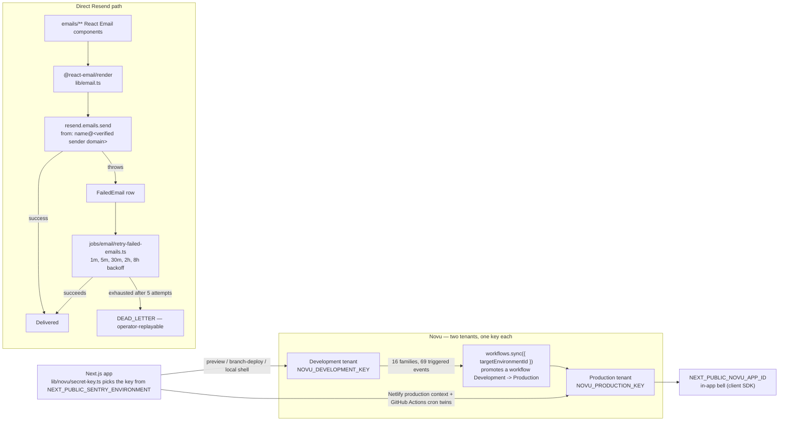
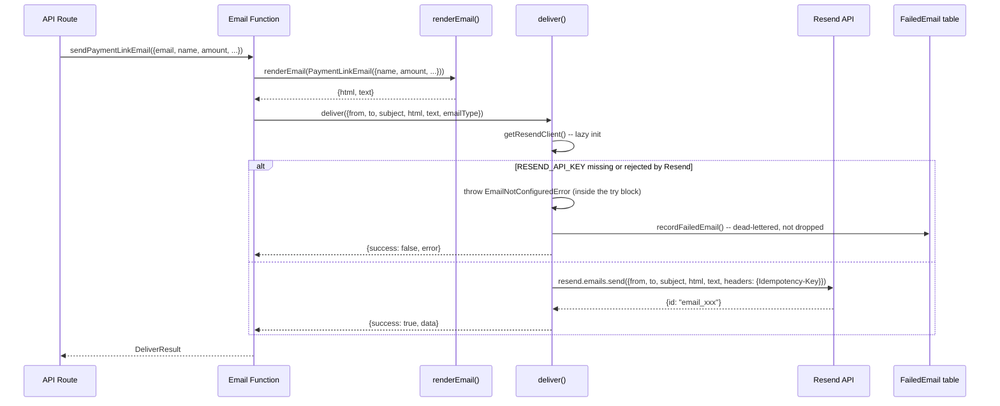
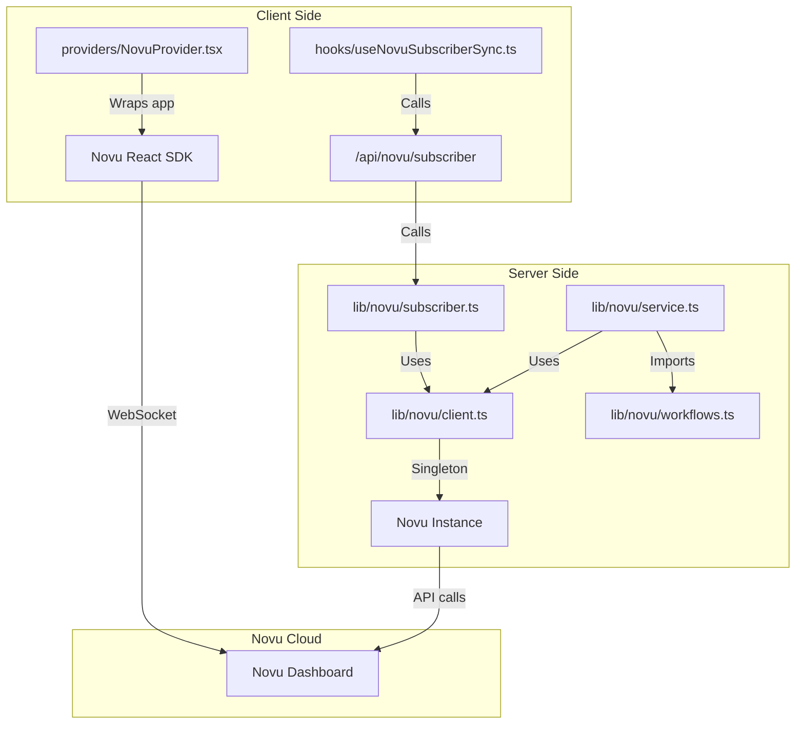
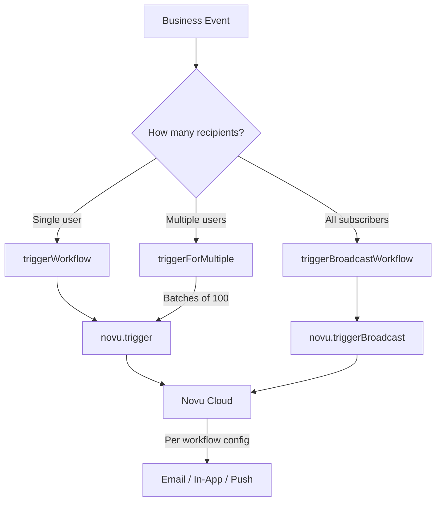
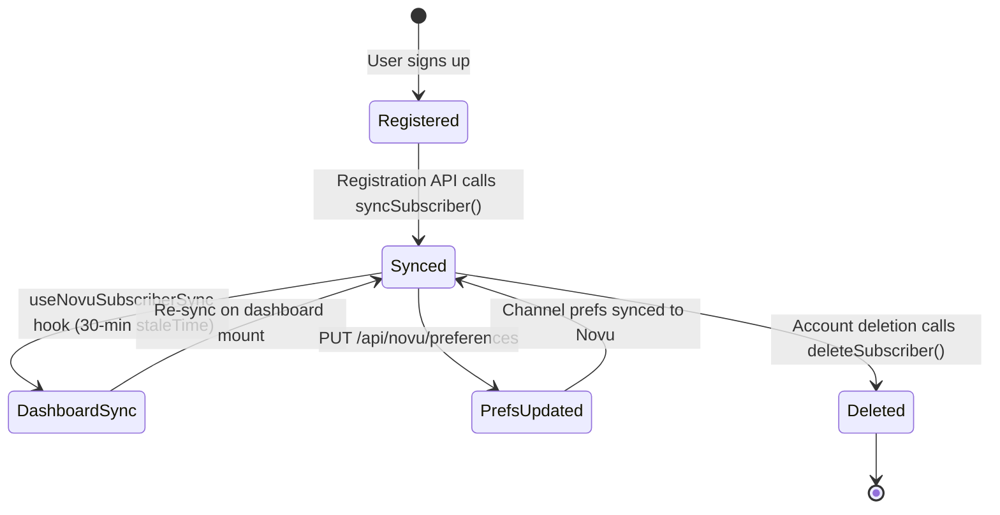
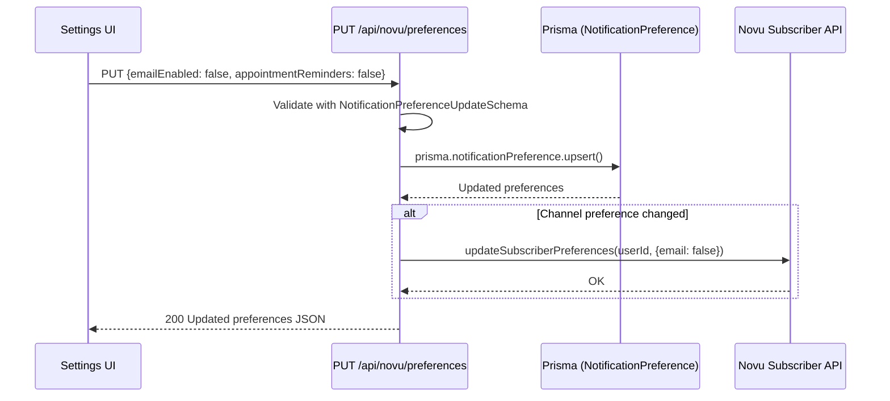

# Notification Architecture

## Design Decision: Resend + Novu

The notification system uses two complementary services rather than one:

| Service    | Role                                     | Analogy     |
| ---------- | ---------------------------------------- | ----------- |
| **Resend** | Email delivery infrastructure            | The postman |
| **Novu**   | Multi-channel notification orchestration | The brain   |

**Why both?** Resend sends emails reliably (DKIM, SPF, bounce handling) but cannot do in-app notifications, push notifications, digest batching, or user preference routing. Novu orchestrates all channels but cannot deliver emails itself. As of ADR 30 every Novu workflow family is in-app only, so the Novu email channel shown below is a possible future path, not a configured one; Novu sends no email today.

**Why not Novu for everything?** Some emails (auth, payment links) are tightly coupled to their API routes and don't need multi-channel delivery. Sending these directly through Resend avoids unnecessary complexity.

```mermaid
graph LR
    subgraph "Direct Resend Path"
        A1[Auth Emails] --> R[Resend API]
        A2[Payment Emails] --> R
        A3[Newsletter Emails] --> R
        R --> T[React Email Templates]
        T --> D[Email Delivery]
    end

    subgraph "Novu Orchestrated Path"
        B1[Appointment Events] --> N[Novu API]
        B2[Support Events] --> N
        B3[Subscription Events] --> N
        B4[Admin Events] --> N
        N -.->|Email channel: future, not configured| R
        N -->|In-App channel| WS[WebSocket]
        N -->|Push channel| FCM[Firebase]
    end
```

### When to Use Each Path

| Use Resend Directly                                   | Use Novu                                                          |
| ----------------------------------------------------- | ----------------------------------------------------------------- |
| Auth emails (welcome, password reset, account linked) | Appointment lifecycle (booked, cancelled, rescheduled, completed) |
| Payment transactional (payment link, success, failed) | Support tickets (created, updated, response)                      |
| Newsletter opt-in (confirm, welcome)                  | Feedback and reviews                                              |
| Any email that doesn't need in-app/push delivery      | Trial sessions, subscriptions                                     |
|                                                       | Consultant-specific (booking requests, verification, payouts)     |
|                                                       | Admin/system (announcements, new applications)                    |
|                                                       | Disputes, recordings                                              |

---

## Two Novu tenants, and the Resend path underneath

Novu treats Development and Production as two fully separate tenants — separate workflows, separate subscribers, separate notification history, and a secret key that only works against its own tenant. `lib/novu/secret-key.ts` decides which tenant a given process talks to by reading `NEXT_PUBLIC_SENTRY_ENVIRONMENT`: the Netlify production context and the GitHub Actions cron twins resolve to `NOVU_PRODUCTION_KEY`, and every preview, branch deploy and local shell resolves to `NOVU_DEVELOPMENT_KEY`, so a developer testing on a preview can never trigger a workflow that reaches a real subscriber's inbox. The platform ships 16 workflow families against Novu's 20-workflow plan cap, and all 69 individual events across those families have a trigger call site in code; promoting a workflow from Development to Production is a per-workflow `workflows.sync({ targetEnvironmentId })` call made from the Development side, because Novu's environment-publish endpoint itself refuses API keys.

The diagram also follows the direct-Resend path for the emails that never go through Novu. A `Failed*/email` component under `emails/**` is rendered to HTML by `@react-email/render` inside `lib/email.ts`, sent with `resend.emails.send({ from: "<name> <address>@<sender domain>", ... })`, and, on a thrown error, persisted verbatim to a `FailedEmail` row that `jobs/email/retry-failed-emails.ts` retries on a fixed backoff before giving up to `DEAD_LETTER`. Whichever domain appears after the `@` in that `from` address has to be a domain Resend has verified, with DKIM, SPF and DMARC records published at whatever host manages that domain's DNS; those records are what let a receiving mail server trust that the message actually came from this platform rather than being spoofed.



## Resend Layer

### Client Initialization

```
lib/email/
├── index.ts          -- 11 sender functions; @/lib/email still resolves to this module
├── config.ts         -- SENDERS getters, supportEmail(), contactInboxAddress(), billingEmail(), companyPostalAddress()
├── deliver.ts         -- deliver(), the single send core; getResendClient(), recordFailedEmail(), EmailNotConfiguredError
├── idempotency.ts     -- derives the content-hash Idempotency-Key shared by a sender and the retry worker
├── classify.ts        -- classifies a Resend failure as terminal or transient
└── render.ts          -- renderEmail(), returns { html, text }

sendWelcomeEmail()         -- from: SENDERS.onboarding (onboarding@mail.familiarisenow.com)
sendPasswordResetEmail()   -- from: SENDERS.security (security@mail.familiarisenow.com)
sendVerificationEmail()    -- from: SENDERS.onboarding
sendAccountLinkedEmail()   -- from: SENDERS.security
sendPaymentLinkEmail()     -- from: SENDERS.payments (payments@mail.familiarisenow.com)
sendPaymentSuccessEmail()  -- from: SENDERS.payments
sendPaymentFailedEmail()   -- from: SENDERS.payments
sendOrgInvitationEmail()   -- from: SENDERS.notifications (no caller today)
sendWaitlistConfirmEmail() -- from: SENDERS.newsletter (newsletter@news.familiarisenow.com)
sendWaitlistWelcomeEmail() -- from: SENDERS.newsletter
sendContactInquiryEmail()  -- from: SENDERS.notifications, to: contactInboxAddress()
```

Every domain in `SENDERS` is read from `EMAIL_TRANSACTIONAL_DOMAIN` / `EMAIL_NEWSLETTER_DOMAIN` at call time (defaults `mail.familiarisenow.com` / `news.familiarisenow.com`), not hardcoded, so an environment can point sends at a different verified domain without a code change.

### Email Rendering Pipeline

Every sender follows render → build → deliver. `renderEmail()` (`lib/email/render.ts`) renders the React Email element once and returns both an HTML string and a plain-text string, so every outbound message carries a text part alongside the HTML part. `deliver()` (`lib/email/deliver.ts`) is the single send core all eleven senders funnel through.



Because `EmailNotConfiguredError` is thrown inside `deliver()`'s own try block rather than short-circuiting before it, a missing or invalid key takes the same dead-letter path as any other terminal send failure -- the message lands in `FailedEmail` as `PENDING` instead of being lost. `deliver()` also derives a content-hash Idempotency-Key (`lib/email/idempotency.ts`) of the form `<EMAIL_TYPE>/<sha256(to\nsubject\nhtml)[:48]>` and sends it on the Resend request; Resend deduplicates on that header for 24 hours, which covers the whole five-step retry ladder described later in this document. `deliver()` defaults Reply-To to `supportEmail()` when the caller does not set one, and reports a Sentry event at level `"error"` with fingerprint `["email-send-terminal", reason]` for a dead key, an unverified domain or a missing key, and at level `"warning"` otherwise.

### From Address Convention

| Domain Prefix    | Used For                                                    | Domain                    |
| ---------------- | ----------------------------------------------------------- | ------------------------- |
| `onboarding@`    | Welcome, email verification                                 | `mail.familiarisenow.com` |
| `security@`      | Password reset, account linking                             | `mail.familiarisenow.com` |
| `payments@`      | Payment link, success, failure                              | `mail.familiarisenow.com` |
| `notifications@` | Org invitations, contact inquiry                            | `mail.familiarisenow.com` |
| `finance@`       | Finance-facing notices                                      | `mail.familiarisenow.com` |
| `dpdp@`          | DPDP compliance alerts                                      | `mail.familiarisenow.com` |
| `noreply@`       | Data-export notice (the worker falls back to `onboarding@`) | `mail.familiarisenow.com` |
| `system` (bare)  | Internal requester id, not a `From` header                  | `mail.familiarisenow.com` |
| `newsletter@`    | Waitlist opt-in + broadcast                                 | `news.familiarisenow.com` |

---

## Novu Layer

### Client Architecture



### Server-Side Client (`lib/novu/client.ts`)

Singleton pattern matching `lib/stream-client.ts`:

- `isNovuConfigured()` -- checks whether the secret key for the detected Novu environment is set: `NOVU_PRODUCTION_KEY` when `NEXT_PUBLIC_SENTRY_ENVIRONMENT=production`, otherwise `NOVU_DEVELOPMENT_KEY` (`lib/novu/secret-key.ts`)
- `validateNovuConfig()` -- throws if not configured (used by `getNovuClient`)
- `getNovuClient()` -- returns singleton `Novu` instance
- `resetNovuClient()` -- clears singleton (for testing)

### Core Trigger Functions (`lib/novu/service.ts`)

Three trigger patterns handle all notification scenarios:



| Function                                             | Use Case                                            | Batching             |
| ---------------------------------------------------- | --------------------------------------------------- | -------------------- |
| `triggerWorkflow(workflowId, subscriberId, payload)` | Single recipient (payment success, booking request) | N/A                  |
| `triggerForMultiple(workflowId, userIds, payload)`   | Both parties or staff group                         | 100 per API call     |
| `triggerBroadcastWorkflow(workflowId, payload)`      | System announcements to all users                   | Novu handles fan-out |

All three follow the same error handling pattern:

```
1. Check isNovuConfigured() -- if false, log warning, return {success: false}
2. Try novu.trigger() / novu.triggerBroadcast()
3. On success: log, return {success: true}
4. On error: log error, return {success: false, error}
```

### 20+ Exported Trigger Functions

Each exported function in `lib/novu/service.ts` is a thin wrapper over the core triggers with the correct workflow ID:

```
notifyAppointmentBooked(userIds[], payload)      -> triggerForMultiple
notifyAppointmentCancelled(userIds[], payload)    -> triggerForMultiple
notifyAppointmentRescheduled(userIds[], payload)  -> triggerForMultiple
notifyAppointmentCompleted(userIds[], payload)    -> triggerForMultiple
notifyPaymentSuccess(userId, payload)             -> triggerWorkflow
notifyPaymentFailed(userId, payload)              -> triggerWorkflow
notifyRefundProcessed(userId, payload)            -> triggerWorkflow
notifyRefundRequested(adminUserIds[], payload)    -> triggerForMultiple
notifySupportTicketCreated(staffUserIds[], payload)   -> triggerForMultiple
notifySupportTicketUpdate(userId, payload)            -> triggerWorkflow
notifySupportTicketResponse(userId, payload)          -> triggerWorkflow
notifyFeedbackReceived(adminUserIds[], payload)   -> triggerForMultiple
notifyNewReview(consultantUserId, payload)        -> triggerWorkflow
notifyTrialRequested(consultantUserId, payload)  -> triggerWorkflow
notifyTrialScheduled(consulteeUserId, payload)   -> triggerWorkflow
notifyTrialCompleted(userIds[], payload)         -> triggerForMultiple
notifyTrialCancelled(userIds[], payload)         -> triggerForMultiple
notifySubscriptionStarted(userId, payload)        -> triggerWorkflow
notifySubscriptionCancelled(userIds[], payload)   -> triggerForMultiple
notifySubscriptionRenewed(userId, payload)        -> triggerWorkflow
notifyNewBookingRequest(consultantUserId, payload)          -> triggerWorkflow
notifyVerificationStatusChanged(consultantUserId, payload)  -> triggerWorkflow
notifyPayoutProcessed(consultantUserId, payload)            -> triggerWorkflow
notifyGeneralAnnouncement(payload)                -> triggerBroadcastWorkflow
notifyNewConsultantApplication(adminUserIds[], payload)  -> triggerForMultiple
notifyDisputeCreated(userIds[], payload)          -> triggerForMultiple
notifyDisputeResolved(userIds[], payload)         -> triggerForMultiple
notifyRecordingAvailable(userIds[], payload)      -> triggerForMultiple
```

---

## Subscriber Management

### Subscriber Lifecycle



### Server-Side Sync (`lib/novu/subscriber.ts`)

| Function                                     | Purpose                                   | Called When                                   |
| -------------------------------------------- | ----------------------------------------- | --------------------------------------------- |
| `syncSubscriber(data)`                       | Creates or updates Novu subscriber        | Registration, dashboard mount, profile update |
| `updateSubscriberPreferences(userId, prefs)` | Syncs channel toggles to Novu custom data | Preference update via API                     |
| `deleteSubscriber(userId)`                   | Removes subscriber from Novu              | Account deletion                              |

Subscriber data mapped from User model:

| Novu Field     | Source                         |
| -------------- | ------------------------------ |
| `subscriberId` | `User.id`                      |
| `firstName`    | First word of `User.name`      |
| `lastName`     | Remaining words of `User.name` |
| `email`        | `User.email`                   |
| `phone`        | `User.phone`                   |
| `avatar`       | `User.image`                   |
| `locale`       | `"en"` (hardcoded)             |

### Client-Side Sync (`hooks/useNovuSubscriberSync.ts`)

Uses React Query with aggressive caching to avoid redundant API calls:

```
useQuery({
  queryKey: ["novu-subscriber-sync", session?.user?.id],
  queryFn: () => fetch("/api/novu/subscriber", {method: "POST"}),
  enabled: !!session?.user?.id && !!process.env.NEXT_PUBLIC_NOVU_APP_ID,
  staleTime: 30 * 60 * 1000,     // 30 minutes
  gcTime: 60 * 60 * 1000,        // 1 hour
  retry: 1,
  refetchOnWindowFocus: false,
  refetchOnMount: false,
})
```

### Client-Side Provider (`providers/NovuProvider.tsx`)

Wraps the app with Novu's React SDK. Only renders when both conditions are met:

1. User is authenticated (`session.user.id` exists)
2. `NEXT_PUBLIC_NOVU_APP_ID` env var is configured

When active, provides WebSocket connection for real-time in-app notifications (bell icon, notification center).

---

## Notification Preferences

### Schema (`schemas/user.ts`)

```
NotificationPreferenceSchema:
  allNotifications: boolean (default: true)

  Channel Preferences:
    inAppEnabled: boolean (default: true)
    emailEnabled: boolean (default: true)
    pushEnabled: boolean (default: false)

  Legacy (backward compatibility):
    mentions: boolean (default: false)
    directMessages: boolean (default: false)
    updates: boolean (default: false)

  Category Preferences:
    appointmentReminders: boolean (default: true)
    paymentNotifications: boolean (default: true)
    supportUpdates: boolean (default: true)
    feedbackAlerts: boolean (default: true)
    trialNotifications: boolean (default: true)
    subscriptionAlerts: boolean (default: true)
    marketingEmails: boolean (default: false)

  Quiet Hours:
    quietHoursEnabled: boolean (default: false)
    quietHoursStart: string | null
    quietHoursEnd: string | null
    quietHoursTimezone: string | null
```

### Preference Update Flow



When no preferences exist yet, `GET /api/novu/preferences` returns hardcoded defaults (all enabled except push and marketing).

---

## Fire-and-Forget Pattern

Notifications are intentionally non-blocking throughout the codebase. Example from payment webhook handler:

```
// In lib/payments/webhooks/handlers.ts
await prisma.$transaction(async (tx) => {
  // ... update payment, create appointment ...
});

// AFTER the transaction commits:
try {
  await notifyAppointmentBooked([consultantId, consulteeId], payload);
} catch {
  // Log error, but don't fail the payment flow
}
```

This pattern ensures:

1. Core business operations (payments, bookings) always succeed even if Novu is down
2. Email delivery failures don't cause transaction rollbacks
3. The user gets their booking/payment confirmation regardless of notification status

For Novu triggers this remains a true fire-and-forget: a failed call is logged and forgotten. As of #474 the direct Resend transactional emails behave differently on failure, and #1298 extended the same treatment to a missing or invalid key. When a Resend send throws -- a transient provider outage, a dead key, an unverified domain, or `EmailNotConfiguredError` -- the sender no longer drops the message. Instead `deliver()` persists the already-rendered message (subject, HTML and text body, recipient, from and reply-to) to the `FailedEmail` table via `recordFailedEmail()` in `lib/email/deliver.ts`. A transient failure is retried by `jobs/email/retry-failed-emails.ts` on a fixed backoff schedule of one minute, five minutes, thirty minutes, two hours, and eight hours, replaying the same content-hash Idempotency-Key the original send used so a Resend-side success that never reached the caller is not re-sent as a duplicate. A terminal failure (dead key, unverified domain, missing key) is dead-lettered on the first attempt instead of walking the ladder, and pages through a Sentry message at level `"error"`. An `EMAIL_VERIFICATION` row older than 60 minutes or a `PASSWORD_RESET` row older than 30 minutes is dead-lettered without a send, because a stale link is no longer useful to the recipient. The calling operation still never blocks or rolls back; the difference is that nothing that reaches `deliver()` is silently lost.

`lib/auth.ts` awaits `sendWelcomeEmail()` and `sendAccountLinkedEmail()` inside a try/catch instead of firing them without awaiting, because a Netlify instance that freezes immediately after the response is sent drops an un-awaited call before it reaches Resend, which is the same failure class as #1616; the surrounding try/catch makes the send non-fatal (the operation still waits for delivery and for `recordFailedEmail()`, but a thrown error does not abort it).

---

## Environment Variables

| Variable                             | Side   | Required                                                    | Purpose                                                                                                   |
| ------------------------------------ | ------ | ----------------------------------------------------------- | --------------------------------------------------------------------------------------------------------- |
| `RESEND_API_KEY`                     | Server | Yes (for emails)                                            | Resend API key for email delivery                                                                         |
| `EMAIL_TRANSACTIONAL_DOMAIN`         | Server | No (defaults to `mail.familiarisenow.com`)                  | Domain for transactional senders (onboarding/security/payments/notifications/finance/dpdp/noreply/system) |
| `EMAIL_NEWSLETTER_DOMAIN`            | Server | No (defaults to `news.familiarisenow.com`)                  | Domain for the waitlist/newsletter sender                                                                 |
| `NEXT_PUBLIC_SUPPORT_EMAIL`          | Both   | No (defaults to `support@familiarisenow.com`)               | Public support mailbox; also the default Reply-To on every send                                           |
| `CONTACT_INBOX_ADDRESS`              | Server | No (defaults to `supportEmail()`)                           | Where `/contactus` inquiries are delivered                                                                |
| `BILLING_EMAIL`                      | Server | No (defaults to `supportEmail()`)                           | Supplier contact printed on tax invoices                                                                  |
| `NEXT_PUBLIC_COMPANY_POSTAL_ADDRESS` | Both   | No (line omitted when unset)                                | Optional postal line in `EmailFooter`                                                                     |
| `NOVU_DEVELOPMENT_KEY`               | Server | Yes (for notifications)                                     | Novu secret key, Development environment                                                                  |
| `NOVU_PRODUCTION_KEY`                | Server | Yes (production only)                                       | Novu secret key, Production environment                                                                   |
| `NEXT_PUBLIC_NOVU_APP_ID`            | Client | Yes (for in-app)                                            | Novu application identifier for React SDK                                                                 |
| `NEXT_PUBLIC_APP_URL`                | Both   | Yes in production; local dev falls back to `localhost:3000` | Base URL for email links (`lib/url.ts` also honours Netlify `DEPLOY_PRIME_URL` / `URL`)                   |

### NPM Packages

| Package        | Version | Purpose                                                                                                        |
| -------------- | ------- | -------------------------------------------------------------------------------------------------------------- |
| `resend`       | ^6.28.0 | Resend Node.js SDK                                                                                             |
| `react-email`  | 6.9.5   | Server-side React Email rendering; replaces the deprecated `@react-email/components` and `@react-email/render` |
| `@novu/api`    | 3.13.0  | Novu server-side SDK                                                                                           |
| `@novu/nextjs` | 3.13.0  | Novu Next.js integration (provider)                                                                            |
| `@novu/react`  | 3.13.0  | Novu React SDK (notification center)                                                                           |
