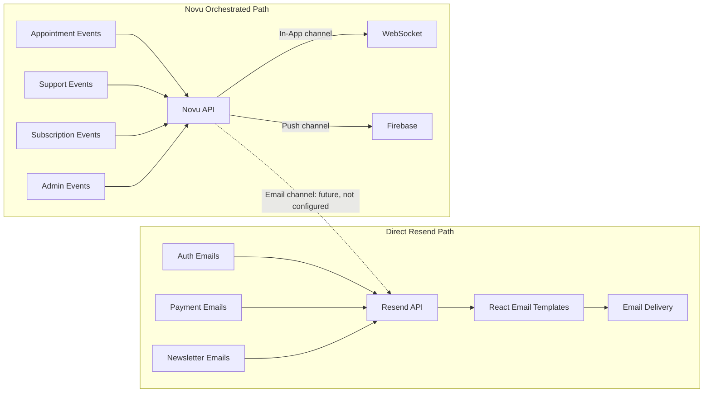
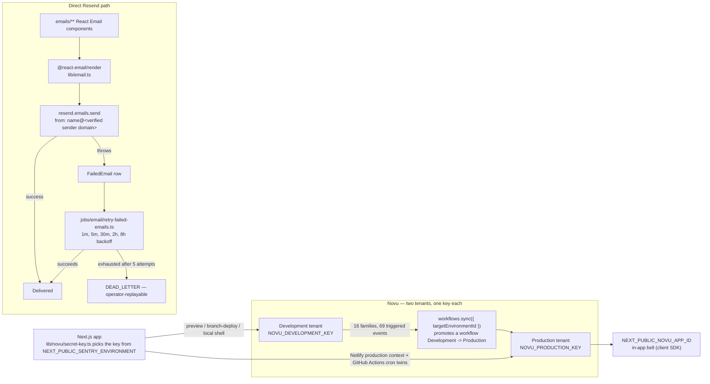
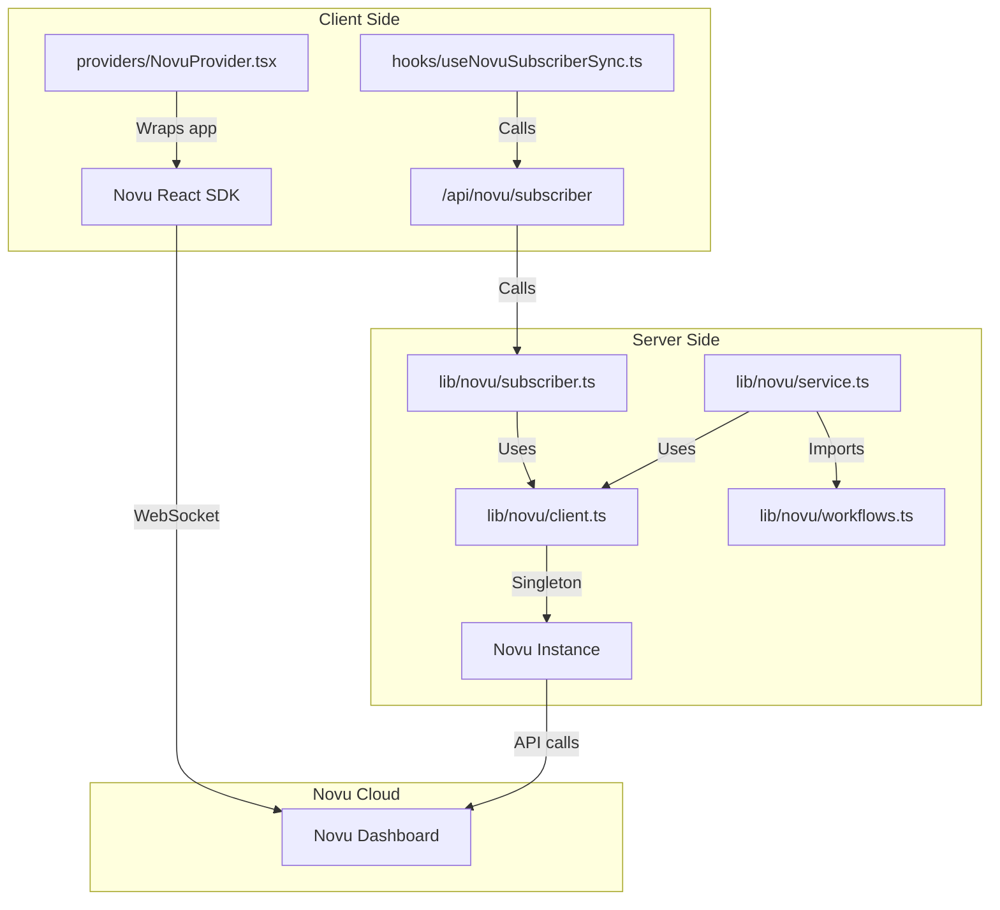
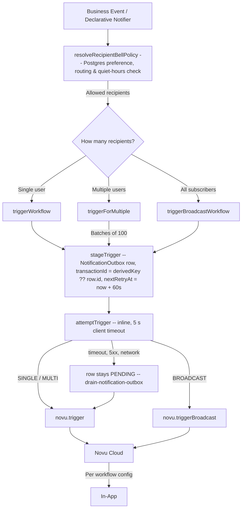
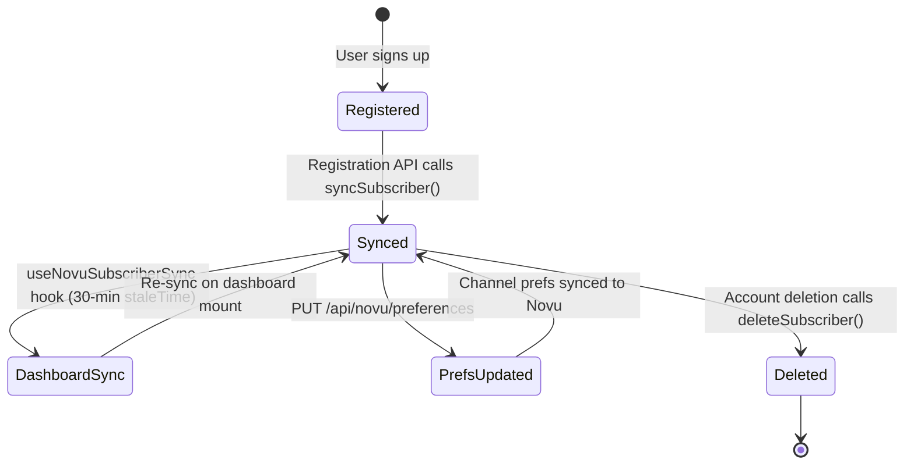
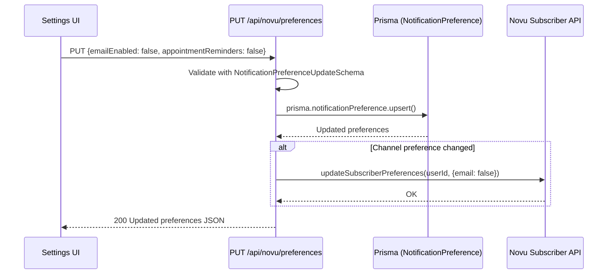

# Notification Architecture

## Design Decision: Resend + Novu

The notification system uses two complementary services rather than one:

| Service    | Role                                     | Analogy     |
| ---------- | ---------------------------------------- | ----------- |
| **Resend** | Email delivery infrastructure            | The postman |
| **Novu**   | Multi-channel notification orchestration | The brain   |

**Why both?** Resend sends emails reliably (DKIM, SPF, bounce handling) but cannot do in-app notifications, push notifications, digest batching, or user preference routing. Novu orchestrates all channels but cannot deliver emails itself. As of ADR 30 every Novu workflow family is in-app only, so the Novu email channel shown below is a possible future path, not a configured one; Novu sends no email today.

**Why not Novu for everything?** Some emails (auth, payment links) are tightly coupled to their API routes and don't need multi-channel delivery. Sending these directly through Resend avoids unnecessary complexity.


```mermaid
graph LR
    subgraph "Direct Resend Path"
        A1[Auth Emails] --> R[Resend API]
        A2[Payment Emails] --> R
        A3[Newsletter Emails] --> R
        R --> T[React Email Templates]
        T --> D[Email Delivery]
    end

    subgraph "Novu Orchestrated Path"
        B1[Appointment Events] --> N[Novu API]
        B2[Support Events] --> N
        B3[Subscription Events] --> N
        B4[Admin Events] --> N
        N -.->|Email channel: future, not configured| R
        N -->|In-App channel| WS[WebSocket]
        N -->|Push channel| FCM[Firebase]
    end
```

### When to Use Each Path

| Use Resend Directly                                   | Use Novu                                                          |
| ----------------------------------------------------- | ----------------------------------------------------------------- |
| Auth emails (welcome, password reset, account linked) | Appointment lifecycle (booked, cancelled, rescheduled, completed) |
| Payment transactional (payment link, success, failed) | Support tickets (created, updated, response)                      |
| Newsletter opt-in (confirm, welcome)                  | Feedback and reviews                                              |
| Any email that doesn't need in-app/push delivery      | Trial sessions, subscriptions                                     |
|                                                       | Consultant-specific (booking requests, verification, payouts)     |
|                                                       | Admin/system (announcements, new applications)                    |
|                                                       | Disputes, recordings                                              |

---

## Two Novu tenants, and the Resend path underneath

Novu treats Development and Production as two fully separate tenants — separate workflows, separate subscribers, separate notification history, and a secret key that only works against its own tenant. `lib/novu/secret-key.ts` decides which tenant a given process talks to by reading `NEXT_PUBLIC_SENTRY_ENVIRONMENT`: the Netlify production context and the GitHub Actions cron twins resolve to `NOVU_PRODUCTION_KEY`, and every preview, branch deploy and local shell resolves to `NOVU_DEVELOPMENT_KEY`, so a developer testing on a preview can never trigger a workflow that reaches a real subscriber's inbox. The platform ships 16 workflow families against Novu's 20-workflow plan cap, and all 69 individual events across those families have a trigger call site in code; promoting a workflow from Development to Production is a per-workflow `workflows.sync({ targetEnvironmentId })` call made from the Development side, because Novu's environment-publish endpoint itself refuses API keys.

The diagram also follows the direct-Resend path for the emails that never go through Novu. A `Failed*/email` component under `emails/**` is rendered to HTML by `@react-email/render` inside `lib/email.ts`, sent with `resend.emails.send({ from: "<name> <address>@<sender domain>", ... })`, and, on a thrown error, persisted verbatim to a `FailedEmail` row that `jobs/email/retry-failed-emails.ts` retries on a fixed backoff before giving up to `DEAD_LETTER`. Whichever domain appears after the `@` in that `from` address has to be a domain Resend has verified, with DKIM, SPF and DMARC records published at whatever host manages that domain's DNS; those records are what let a receiving mail server trust that the message actually came from this platform rather than being spoofed.


```mermaid
flowchart LR
  subgraph NovuTenants["Novu — two tenants, one key each"]
    DEV_ENV["Development tenant<br/>NOVU_DEVELOPMENT_KEY"]
    PROD_ENV["Production tenant<br/>NOVU_PRODUCTION_KEY"]
    SYNC["workflows.sync({ targetEnvironmentId })<br/>promotes a workflow Development -> Production"]
    DEV_ENV -- "16 families, 69 triggered events" --> SYNC --> PROD_ENV
  end
  APP["Next.js app<br/>lib/novu/secret-key.ts picks the key from NEXT_PUBLIC_SENTRY_ENVIRONMENT"]
  APP -- "preview / branch-deploy / local shell" --> DEV_ENV
  APP -- "Netlify production context + GitHub Actions cron twins" --> PROD_ENV
  BELL["NEXT_PUBLIC_NOVU_APP_ID<br/>in-app bell (client SDK)"]
  PROD_ENV --> BELL

  subgraph ResendPath["Direct Resend path"]
    TPL["emails/** React Email components"]
    RENDER["@react-email/render<br/>lib/email.ts"]
    SEND["resend.emails.send<br/>from: name@&lt;verified sender domain&gt;"]
    OK["Delivered"]
    FAIL["FailedEmail row"]
    RETRY["jobs/email/retry-failed-emails.ts<br/>1m, 5m, 30m, 2h, 8h backoff"]
    DEAD["DEAD_LETTER — operator-replayable"]
  end
  TPL --> RENDER --> SEND
  SEND -- "success" --> OK
  SEND -- "throws" --> FAIL --> RETRY
  RETRY -- "exhausted after 5 attempts" --> DEAD
  RETRY -- "succeeds" --> OK
```

## End-to-End Outbox & Delivery Evolution (Old vs. New Double ASCII Diagram)

### 1.1 Pre-Hardening Architecture (With All 10 Audited Production Flaws Highlighted)

```text
+===================================================================================================+
|                        PRODUCERS (API Routes, Webhooks, Server Actions, Jobs)                     |
+===================================================================================================+
   |                                                |
   | (~10% Money/Booking paths pass `tx`)           | (~90% Lifecycle/Booking/Org paths omit `tx`)
   v                                                v
+------------------------------------------------+ +------------------------------------------------+
| INSIDE `Serializable` $transaction (PG_POOL=1) | | OUTSIDE $transaction (Post-Commit Dual Write)  |
|  [FLAW #1] Runs 2x React Email SSR (`render` + | |  [FLAW #2] Crash/freeze after DB commit loses  |
|  `plainText`) + sequential User/Suppression    | |  the email & Novu bell completely.             |
|  queries while holding Serializable locks!     | +------------------------------------------------+
+------------------------------------------------+                          |
   |                                                                        |
   +-----------------------------------+------------------------------------+
                                       |
         +-----------------------------+-----------------------------+
         |                                                           |
         v (Email Path: `lib/email/deliver.ts`)                      v (In-App Bell Path: `lib/novu/outbox.ts`)
+--------------------------------------------------+       +--------------------------------------------------+
| Postgres: `FailedEmail` & `FailedEmailBatch`     |       | Postgres: `NotificationOutbox`                   |
| - Inserts `status: PENDING, nextRetryAt: NOW()`  |       | - Upserts `status: PENDING, nextRetryAt: NOW()`  |
| - [FLAW #3] NO inline lease grace window!        |       | - [FLAW #3] NO inline lease grace window!        |
| - [FLAW #4] `headers` (`List-Unsubscribe`) NOT   |       | - [FLAW #6] `deriveTransactionId` misses 5 keys  |
|   rebuilt on retry -> stripped on relay replay!  |       |   (`invoiceNumber`, `exportId`, `providerId`,    |
| - [FLAW #5] Never pruned! Full HTML/text bodies  |       |   `feedbackId`, `streamCallId`) & omits fallback |
|   for every `SENT` email accumulate forever!     |       |   to `row.id` when `transactionId` is null!      |
+--------------------------------------------------+       +--------------------------------------------------+
         |                           |                               |                           |
         | Inline Fast-Path (3-5s)   | Relay (Every 15m, limit=20)   | Inline Fast-Path (5s)     | Relay (Every 5m, limit=20)
         | [RACE CONDITION!]         | [6s timeout in cron-tick!]    | [RACE CONDITION!]         | [6s timeout in cron-tick!]
         +-------------+-------------+                               +-------------+-------------+
                       |                                                           |
                       v                                                           v
+--------------------------------------------------+       +--------------------------------------------------+
| Resend API (`POST /emails`, `/emails/batch`)     |       | Novu Cloud API (16 Multiplexed Workflow Families)|
| - [FLAW #7] `idempotencyKeyFor()` hashes         |       | - [FLAW #8] `syncSubscriber` (on dashboard mount)|
|   `to + subject + html` instead of `row.id`!     |       |   & `updateSubscriberPreferences` overwrite      |
|   Resend caches keys 24h -> SILENTLY DROPS any   |       |   disjoint keys in `subscriber.data`, wiping out |
|   2nd identical email sent within 24 hours!      |       |   muted preferences on every dashboard load!     |
| - [FLAW #9] Exhausting 5 transient attempts ->   |       | - [FLAW #10] All 18 `ORG_*` workflows omit       |
|   `DEAD_LETTER` emits ZERO Sentry error alerts!  |       |   `NotificationScope` (`organizationId`) -> org  |
|   `NovuError.body` echoes PII to Sentry!         |       |   alerts NEVER show under Org tab in `<Inbox />`!|
+--------------------------------------------------+       +--------------------------------------------------+

+===================================================================================================+
|                     CRON & MAINTENANCE INFRASTRUCTURE (Post-`c4e85c003` State)                    |
+===================================================================================================+
  Netlify `cron-tick.mts` (*/5 * * * *)                      GitHub Actions (42 Scheduled Workflows)
  - Uses `minute % every < 5` (ZERO stagger):                - `c4e85c003` deleted 17 GHA backstop workflows
    * `:00` & `:30` -> fires ALL 18/19 targets at once!        for ticker jobs without raising ticker timeouts!
    * `:15` & `:45` -> fires 16/17 targets at once!          - `cron-heartbeat.yml` runs 1x/day at 04:40 UTC:
    * `:05, :25, :35, :55` -> fires ZERO targets (33% idle!)   ONLY writer of `redis.set("cron:heartbeat:last")`!
  - `keep-warm.mts` only warms 3 instances -> 15+ cold       - `/api/health` checks `cron:heartbeat:last` with
    starts stampede PgBouncer & hit 6s abort ceiling!          6h threshold -> `cron.stale: true` 18h/day!
  - Warm container bug: 1 failed tick loads `@sentry/node`   - `withCronLock` in Postgres (`SystemJobExecution`)
    and patches global `fetch` for all future warm ticks!      has NO partial unique index on `(jobName) WHERE
                                                               status = 'RUNNING'` -> P0 TOCTOU lock race!
```

### 1.2 Target Production Architecture (Improvised, Decoupled & Hardened)

```text
+===================================================================================================+
|                     PRODUCERS (API Routes, Webhooks, Server Actions, Jobs)                        |
+===================================================================================================+
   |
   | 1. Pre-render React Email OUTSIDE Serializable $transaction (single-pass `render` + `toPlainText(html)`)
   | 2. Evaluate all User & Org NotificationPreferences in Postgres/App BEFORE staging (Single Source of Truth)
   | 3. Declarative senders (`defineEmailSender`, `defineSingleNotifier`, `defineOrgRosterNotifier`) stage rows
   |    inside `$transaction(tx)` with:
   |    - `status: "PENDING"`, `nextRetryAt: NOW() + 60s` (inline lease grace window — prevents relay race!)
   |    - Reconstructed RFC 8058 `List-Unsubscribe` + `List-Unsubscribe-Post` headers on relay retry
   |    - `transactionId: derivedKey ?? row.id` (guaranteed idempotency key for every single/org workflow)
   |    - `NotificationScope` (`scope: "org", organizationId`) on all 18 `ORG_*` workflows
   v
+---------------------------------------------------------------------------------------------------+
|                        CONSOLIDATED OUTBOX LAYER (Postgres + Partial Indexes)                     |
|  1. `FailedEmail` & `FailedEmailBatch` (Resend Email Outbox)                                      |
|  2. `NotificationOutbox` (Novu In-App Feed Outbox)                                                |
|  3. `OutboundWebhookDelivery` (Enterprise Customer Webhooks)                                      |
|  * Bounded concurrency (`CONCURRENCY = 5`) + multi-recipient `resend.batch.send` (up to 100/call) |
|  * Outbox-row-scoped `Idempotency-Key: <EMAIL_TYPE>/<row.id>` (never drops legitimate repeats)    |
|  * Automated retention pruning in `prune-system-job-executions`:                                  |
|    - Null `htmlBody`/`textBody` on `SENT` emails after 7d; delete terminal outbox rows after 30d  |
+---------------------------------------------------------------------------------------------------+
   |
   v
+===================================================================================================+
|                  STAGGERED CRON & LOCKING ENGINE (Netlify Ticker + GitHub Actions)                |
+===================================================================================================+
  Netlify `cron-tick.mts` (Every 5m, Phase-Staggered):
  - Slot `:00, :15, :30, :45` (6 targets) | Slot `:05, :20, :35, :50` (6 targets) | Slot `:10, :25, :40, :55` (6 targets)
  - Max 6–7 concurrent targets per tick (matches warm pool + PgBouncer budget); 0% idle ticks!
  - Per-target timeout raised from 6s -> 15s; `tracePropagationTargets: []` prevents warm container fetch pollution.
  - Atomic Postgres lock: `CREATE UNIQUE INDEX "SystemJobExecution_running_jobName_key" ON "SystemJobExecution"("jobName") WHERE status = 'RUNNING'`
  - `/api/health` queries `pickFresherTimestamp(redisHeartbeat, SystemJobExecution.startedAt)` -> 0% false-stale rate!

+===================================================================================================+
|                CONSOLIDATED SENTRY v10 OBSERVABILITY (Errors + Traces + Logs + Metrics)           |
+===================================================================================================+
  - `tracesSampler`: 0% `/api/health` & `/_next`, 2% `/api/cleanup/*`, 10% default, 50% `/api/webhooks/*` & `/api/payments/*`
  - `beforeSend`, `beforeSendTransaction`, `beforeSendSpan`, `beforeSendLog`: unified `sentry-scrubber.ts`
    (strips `NovuError.body`, regex-redacts emails/tokens in messages/breadcrumbs, strips `culture.timezone`)
  - `Sentry.startSpan({ op: "queue.process" })` + `Sentry.metrics.count/gauge` on email & Novu drains
  - P0 Alerting: `level: "error"` (`expected: false`) whenever `FailedEmail` or `NotificationOutbox` hits `DEAD_LETTER`
```

### 1.3 Message Broker & Queueing Trade-Off Matrix

| Broker / Pattern                                           | Atomic with Postgres `$transaction`?                                                                     | Serverless (Netlify) Compatibility                                                               | Operational & Cost Overhead                                            | Architectural Verdict                                                                                                                                        |
| :--------------------------------------------------------- | :------------------------------------------------------------------------------------------------------- | :----------------------------------------------------------------------------------------------- | :--------------------------------------------------------------------- | :----------------------------------------------------------------------------------------------------------------------------------------------------------- |
| **Apache Kafka** (Confluent / Upstash)                     | **No** (Publishing to Kafka inside a DB txn is a dual-write; still requires a DB outbox + CDC/Debezium). | **Poor** (Requires long-lived consumer groups & partition rebalancing).                          | **Very High** (\$150–\$500+/mo + massive ops complexity).              | **Rejected.** 1,000x over-engineered for `<100` events/sec marketplace workloads.                                                                            |
| **RabbitMQ / BullMQ**                                      | **No** (Enqueuing to Redis/AMQP inside a Postgres txn is a dual-write).                                  | **Poor** (Requires persistent TCP connections and a separate 24/7 worker VM/container tier).     | **High** (Requires hosting a second compute fleet on Railway/Fly/ECS). | **Rejected.** Violates serverless simplicity for zero benefit.                                                                                               |
| **AWS SQS**                                                | **No** (HTTP `SendMessage` inside a DB txn is a dual-write).                                             | **Mediocre** (Netlify has no native SQS Lambda Event Source Mapping trigger).                    | **Moderate** (Cross-cloud IAM credentials + still needs a poller).     | **Rejected.** Unnecessary multi-cloud sprawl.                                                                                                                |
| **Upstash QStash**                                         | **No on its own** (Still needs DB outbox to avoid dual-write).                                           | **Excellent** (HTTP push to Next.js routes with built-in retries, DLQ, and `FlowControl`).       | **Low** (~$1 per 100k messages; Upstash already in stack).             | **Optional Stage-2 Enhancement** only if customer outbound webhooks (`OutboundWebhookDelivery`) scale to >10k/day and need per-endpoint HTTP push isolation. |
| **Postgres Transactional Outbox + Phase-Staggered Ticker** | **100% Atomic** (`stage()` writes inside the exact same Postgres `tx`).                                  | **Native** (Zero external broker; inline fast-path delivers in ~150ms; relay sweeps stragglers). | **Zero Incremental Cost** (\$0/mo).                                    | **Active Production Architecture.** Staggered `cron-tick.mts` + atomic `withCronLock` + bounded concurrency handles 100% of platform needs.                  |

## Resend Layer

### Client Initialization & Declarative Sender Layout

```
lib/email/
├── index.ts          -- 11 direct senders (via defineDirectEmailSender) plus renderPaymentSuccessEmail()/renderPaymentFailedEmail()
├── config.ts         -- SENDERS getters, EMAIL_BUDGET_MS, supportEmail(), contactInboxAddress(), billingEmail(), companyPostalAddress()
├── deliver.ts        -- deliver() = stage() (60s inline lease grace window) + attempt(); getResendClient(), recordFailedEmail()
├── idempotency.ts    -- derives row-scoped (<EMAIL_TYPE>/<rowId>) or content-hash Idempotency-Key
├── classify.ts       -- classifies a Resend failure as terminal or transient
├── render.ts         -- single-pass renderEmail() (render + toPlainText(html)) with Sentry email.render span
├── preferences.ts    -- loadEmailRecipients(), the Postgres NotificationPreference gate
├── send-to-recipients.ts -- sendToRecipients() / stageToRecipients() / attemptStaged(), the per-recipient fan-out
└── senders/
    ├── shared.ts      -- shared formatting helpers (greet, absolute, whenText, dateText, money) + declarative builders
    │                     (defineBudgetedEmailSender, defineFixedBudgetEmailSender, defineStagedEmailSender)
    ├── booking.ts     -- booking lifecycle senders (#1653, #1937), re-exported from index.ts
    ├── money.ts       -- money & org billing senders (#1653, #1937), re-exported from index.ts
    ├── onboarding.ts  -- staged onboarding & verification senders (#1937), re-exported from index.ts
    └── people.ts      -- people, support, moderation & review senders (#1653, #1937), re-exported from index.ts

sendWelcomeEmail()         -- from: SENDERS.onboarding (onboarding@mail.familiarisenow.com)
sendPasswordResetEmail()   -- from: SENDERS.security (security@mail.familiarisenow.com)
sendVerificationEmail()    -- from: SENDERS.onboarding
sendAccountLinkedEmail()   -- from: SENDERS.security
sendPaymentLinkEmail()     -- from: SENDERS.payments (payments@mail.familiarisenow.com)
renderPaymentSuccessEmail()-- from: SENDERS.payments (staged via lib/payments/webhooks/staged-emails.ts)
renderPaymentFailedEmail() -- from: SENDERS.payments (staged via lib/payments/webhooks/staged-emails.ts)
stageOrgInvitationEmail()  -- from: SENDERS.notifications, entityRef orgInvite:<id> or membership:<id>
sendWaitlistConfirmEmail() -- from: SENDERS.newsletter (newsletter@news.familiarisenow.com)
sendWaitlistWelcomeEmail() -- from: SENDERS.newsletter
sendContactInquiryEmail()  -- from: SENDERS.notifications, to: contactInboxAddress()

stageAppointmentBookedEmail(tx, …)
                           -- from: SENDERS.notifications, category appointments, entityRef appointment:<id>
sendAppointmentCancelledEmail()   -- from: SENDERS.notifications, category appointments, entityRef appointment:<id>
sendAppointmentRescheduledEmail() -- from: SENDERS.notifications, category appointments, entityRef appointment:<id>
sendAppointmentReminderEmail()    -- from: SENDERS.notifications, category appointments, entityRef appointment:<id>:<24h|1h>
sendNewBookingRequestEmail()      -- from: SENDERS.notifications, category appointments, entityRef request:<id>
sendTrialScheduledEmail()         -- from: SENDERS.notifications, category trials, entityRef trial:<id>
```

All recipient-ID senders in `lib/email/senders/{booking,money,onboarding,people}.ts` are built on the declarative helpers in `lib/email/senders/shared.ts` (`defineBudgetedEmailSender`, `defineFixedBudgetEmailSender`, `defineStagedEmailSender`, `sendSpecGuarded`, `stageSpecGuarded`). Each takes user IDs plus raw domain values, resolves recipients through `loadEmailRecipients()`, renders one message per recipient in that recipient's timezone (`whenText` / `dateText`), and never throws: unexpected errors are reported to Sentry with `tags: { subsystem: "email", emailType }` and returned as a failed count under the caller's budget (`REQUEST`, `JOB`, or `WEBHOOK`).

```
sendRefundProcessedEmail() / stageRefundProcessedEmail(tx, …) -- from: SENDERS.payments, category payments, entityRef payment:<id>
sendRefundFailedEmail() -- from: SENDERS.payments, category payments, entityRef payment:<id>
sendOrgPayoutFailedEmail() -- from: SENDERS.finance, category orgBilling, entityRef orgPayout:<id>
sendOrgInvoiceOverdueEmail() -- from: SENDERS.finance, category orgBilling, entityRef orgInvoice:<id>
sendOrgWalletLowEmail() -- from: SENDERS.finance, category orgBilling, entityRef org:<id>
sendOrgOverageDueEmail() -- from: SENDERS.finance, category orgBilling, entityRef overage:<id>

sendSupportTicketResponseEmail() -- from: SENDERS.notifications, category support, entityRef ticket:<id>
sendSupportTicketUpdateEmail() -- from: SENDERS.notifications, category support, entityRef ticket:<id>
sendAccountSuspendedEmail() -- from: SENDERS.security, category null (required notice), entityRef user:<id>
sendAccountBannedEmail() -- from: SENDERS.security, category null (required notice), entityRef user:<id>
sendNewReviewEmail() -- from: SENDERS.notifications, category feedback, entityRef review:<id>
```

Every domain in `SENDERS` is read from `EMAIL_TRANSACTIONAL_DOMAIN` / `EMAIL_NEWSLETTER_DOMAIN` at call time (defaults `mail.familiarisenow.com` / `news.familiarisenow.com`), not hardcoded, so an environment can point sends at a different verified domain without a code change.

### Email Rendering Pipeline

Every sender follows render → build → deliver. `renderEmail()` (`lib/email/render.ts`) renders the React Email element in a single pass (`render(element)` followed by `toPlainText(html)`) wrapped in an OpenTelemetry `email.render` span and returns `{ html, text }`. `deliver()` (`lib/email/deliver.ts`) is two phases: `stage()` writes the rendered message as a `PENDING` `FailedEmail` row with a **60-second inline lease grace window** (`nextRetryAt: new Date(Date.now() + 60_000)`) before any network call, and `attempt()` performs one inline send under a time budget and settles the row.

```mermaid
sequenceDiagram
    participant API as API Route
    participant Fn as Email Function
    participant RE as renderEmail()
    participant DL as deliver() = stage() + attempt()
    participant FE as FailedEmail table
    participant RS as Resend API

    API->>Fn: sendPaymentLinkEmail({email, name, amount, ...})
    Fn->>RE: renderEmail(PaymentLinkEmail({name, amount, ...}))
    RE-->>Fn: {html, text}
    Fn->>DL: deliver({from, to, subject, html, text}, emailType, {entityRef, budgetMs})
    DL->>FE: stage() -- PENDING row (nextRetryAt = now + 60s lease grace)
    DL->>RS: attempt() -- emails.send(payload, {idempotencyKey: "<TYPE>/<row.id>", signal: AbortSignal.timeout(budgetMs)})
    alt sent
        RS-->>DL: {id: "email_xxx"}
        DL->>FE: status SENT, sentAt, resendId
        DL-->>Fn: {success: true, data}
    else timed out
        DL->>DL: log once, no Sentry
        DL-->>Fn: {success: false, staged: true} -- the row stays PENDING for the relay after 60s grace
    else terminal error (dead key, unverified domain, rejected body)
        DL->>FE: status DEAD_LETTER, lastError; Sentry error fingerprint ["email-send-terminal", reason]
        DL-->>Fn: {success: false, staged: true}
    else transient error or missing key
        DL->>FE: lastError only -- still PENDING, the relay's backoff starts from its own first try
        DL-->>Fn: {success: false, staged: true}
    end
    Fn-->>API: DeliverResult
```

The inline attempt runs under a budget named in `EMAIL_BUDGET_MS` (`lib/email/config.ts`) and chosen per caller:

| Budget                 | Milliseconds | Callers                                                                                                        |
| ---------------------- | ------------ | -------------------------------------------------------------------------------------------------------------- |
| `AUTH`                 | 8 000        | The Better Auth hooks (welcome, verification, password reset, account linked) and the organisation invitation. |
| `CONTACT_AND_WAITLIST` | 5 000        | The contact form and both waitlist senders.                                                                    |
| `WEBHOOK`              | 3 000        | The payment senders (receipt, failure notice, payment link).                                                   |
| `JOB`                  | 10 000       | The compliance alert jobs and every send the relay itself makes.                                               |
| `REQUEST`              | 5 000        | API-route senders of lifecycle mail (#1653): the request must not wait on Resend longer than this.             |

A timeout is not a failure. When a staged row has an `id`, `idempotencyKeyFor` (`lib/email/idempotency.ts`) scopes the Resend `Idempotency-Key` header to `<EMAIL_TYPE>/<row.id>` (falling back to the content hash `<EMAIL_TYPE>/<sha256(to\nsubject\nhtml)[:48]>` only when unstaged), so the relay deduplicates against the inline attempt for that specific outbox row without ever dropping a legitimate second email with identical content sent within 24 hours (#1931).

#### Staging inside a transaction

A caller that owns a database transaction calls `stage(message, emailType, { tx, entityRef })` inside the transaction and `attempt(staged, message, emailType, { budgetMs })` after it commits. Payment webhook email staging lives in `lib/payments/webhooks/staged-emails.ts` (extracted from `lib/payments/webhooks/handlers.ts` in #1937): `loadAppointmentForEmails()`, `stagePaymentSuccessEmail()`, `stageBookedEmails()`, and `stagePaymentFailedEmail()` stage rows inside the Phase 1 transaction and return the loaded appointment notification context so Phase 2 can attempt the staged emails and Novu bells without re-querying the appointment.

### The relay

`jobs/email/retry-failed-emails.ts` drains `FailedEmail` rows whose status is `PENDING` or `RETRY` with `nextRetryAt <= now`, with bounded concurrency (`CONCURRENCY = 5`), reconstructing RFC 8058 `List-Unsubscribe` and `List-Unsubscribe-Post` headers for lifecycle emails (#1931), emitting `queue.process` Sentry spans and `outbox.lag_ms` / `outbox.batch_duration_ms` metrics (#1932), and paging Sentry at `level: "error"` (`outbox_dead_letter: "true"`) whenever a row exhausts its 5 attempts into `DEAD_LETTER`. It runs every 15 minutes from the phase-staggered Netlify ticker (`netlify/functions/cron-tick.mts`, offset `:05`) and via GitHub Actions as the unbounded backstop, guarded by the atomic Postgres `withCronLock("retry-failed-emails")`. `scripts/cleanup/prune-system-job-executions.ts` scrubs `htmlBody`/`textBody` on `SENT` rows after 7 days and deletes terminal rows after 30–90 days (#1935).

### Delivery events and suppression

`app/api/webhooks/resend/route.ts` (#1647) is where Resend tells us what happened to a message after it was accepted. Every signed event, whatever its type, becomes one `EmailEvent` row holding the svix id, the Resend email id, the type, the first recipient (normalised to lower case) and the full payload, so support can trace a `FailedEmail.resendId` to its delivery history. The receiver verifies the signature with the SDK's `webhooks.verify()` against `RESEND_WEBHOOK_SECRET`, answers 401 without logging the body when the signature does not verify, 400 when a svix header is missing, 413 above a 256 KB body, and 503 with a Sentry page when the secret or the API key is not configured. It is idempotent on the svix id: a redelivery or a dashboard replay hits the unique constraint and answers 200 with `duplicate: true` without re-running any side effect, and the row is written before any side effect so a failure after that point still answers 200 rather than making Resend retry an event that is already durable.

Two event types do more than store a row. An `email.bounced` event whose `bounce.type` is `Permanent` writes the address to `EmailSuppression` with reason `HARD_BOUNCE` and moves a `PENDING` or `SUBSCRIBED` `Waitlist` row to `BOUNCED`; an `email.complained` event writes reason `COMPLAINT` and moves the `Waitlist` row to `UNSUBSCRIBED` with `unsubscribedAt` stamped. A `Transient` bounce (a full mailbox, greylisting) does not suppress, because the address is not dead and the next send may well be accepted. The suppression upsert has an empty update, so an existing row is never downgraded from `COMPLAINT` to `HARD_BOUNCE` or re-stamped by a later event; a `MANUAL` reason exists for an operator to add an address by hand.

The list is enforced at both ends of the outbox. `stage()` in `lib/email/deliver.ts` reads `EmailSuppression` for the recipient (through the caller's transaction when there is one) before writing the `FailedEmail` row, and a suppressed address is written as `DEAD_LETTER` with `lastError` set to `suppressed:<REASON>`; `attempt()` then returns `{ success: false, staged: true }` with an `EmailSuppressedError` and never calls Resend. The relay reads the list once per tick for the rows it selected and dead-letters a suppressed row the same way without a send, and the newsletter broadcast filters suppressed addresses out of its recipients and reports the count as `skippedSuppressed`. None of these refusals reach Sentry, because the refusal is the intended outcome. Resend's own event hook delivers to production only (the same constraint as Stream's), so the `EmailEvent` and `EmailSuppression` tables fill only there; previews and local runs see no events.

### From Address Convention

| Domain Prefix    | Used For                                                            | Domain                    |
| ---------------- | ------------------------------------------------------------------- | ------------------------- |
| `onboarding@`    | Welcome, email verification                                         | `mail.familiarisenow.com` |
| `security@`      | Password reset, linking, suspension, ban                            | `mail.familiarisenow.com` |
| `payments@`      | Payment link, success, failure                                      | `mail.familiarisenow.com` |
| `notifications@` | Org invitations, contact inquiry, booking, support, reviews (#1653) | `mail.familiarisenow.com` |
| `finance@`       | Finance-facing notices                                              | `mail.familiarisenow.com` |
| `dpdp@`          | DPDP compliance alerts                                              | `mail.familiarisenow.com` |
| `noreply@`       | Data-export notice (the worker falls back to `onboarding@`)         | `mail.familiarisenow.com` |
| `system` (bare)  | Internal requester id, not a `From` header                          | `mail.familiarisenow.com` |
| `newsletter@`    | Waitlist opt-in + broadcast                                         | `news.familiarisenow.com` |

---

## Novu Layer

### Client Architecture


```mermaid
graph TD
    subgraph "Server Side"
        C[lib/novu/client.ts] -->|Singleton| N[Novu Instance]
        S[lib/novu/service.ts] -->|Uses| C
        S -->|Imports| W[lib/novu/workflows.ts]
        SUB[lib/novu/subscriber.ts] -->|Uses| C
    end

    subgraph "Client Side"
        P[providers/NovuProvider.tsx] -->|Wraps app| SDK[Novu React SDK]
        H[hooks/useNovuSubscriberSync.ts] -->|Calls| API["/api/novu/subscriber"]
        API -->|Calls| SUB
    end

    subgraph "Novu Cloud"
        N -->|API calls| NC[Novu Dashboard]
        SDK -->|WebSocket| NC
    end
```

### Server-Side Client (`lib/novu/client.ts`)

Singleton pattern matching `lib/stream-client.ts`:

- `isNovuConfigured()` -- checks whether the secret key for the detected Novu environment is set: `NOVU_PRODUCTION_KEY` when `NEXT_PUBLIC_SENTRY_ENVIRONMENT=production`, otherwise `NOVU_DEVELOPMENT_KEY` (`lib/novu/secret-key.ts`)
- `validateNovuConfig()` -- throws if not configured (used by `getNovuClient`)
- `getNovuClient()` -- returns singleton `Novu` instance
- `resetNovuClient()` -- clears singleton (for testing)

### Core Trigger Functions & Declarative Factories (`lib/novu/service.ts` & `lib/novu/org-workflows.ts`)

Three trigger patterns handle all notification scenarios, and since #1654 and #1931 all three evaluate user/org bell preferences in Postgres (`resolveRecipientBellPolicy`) before staging a `NotificationOutbox` row (with a 60s inline lease grace window), attempting the wire call inline under a 5-second timeout, and leaving anything unsettled for the drain.


```mermaid
graph TD
    A[Business Event / Declarative Notifier] --> P[resolveRecipientBellPolicy -- Postgres preference, routing & quiet-hours check]
    P -->|Allowed recipients| B{How many recipients?}
    B -->|Single user| C[triggerWorkflow]
    B -->|Multiple users| D[triggerForMultiple]
    B -->|All subscribers| E[triggerBroadcastWorkflow]

    C --> S[stageTrigger -- NotificationOutbox row, transactionId = derivedKey ?? row.id, nextRetryAt = now + 60s]
    D -->|Batches of 100| S
    E --> S
    S --> T[attemptTrigger -- inline, 5 s client timeout]
    T -->|SINGLE / MULTI| F[novu.trigger]
    T -->|BROADCAST| G[novu.triggerBroadcast]
    T -->|timeout, 5xx, network| R[row stays PENDING -- drain-notification-outbox]
    R --> F

    F --> H[Novu Cloud]
    G --> H
    H -->|Per workflow config| I[In-App]
```

| Function                                                                | Use Case                                            | Batching             |
| ----------------------------------------------------------------------- | --------------------------------------------------- | -------------------- |
| `triggerWorkflow(workflowId, subscriberId, payload, dedupeKey?, opts?)` | Single recipient (payment success, booking request) | N/A                  |
| `triggerForMultiple(workflowId, userIds, payload, dedupeKey?, opts?)`   | Both parties or staff group                         | 100 per API call     |
| `triggerBroadcastWorkflow(workflowId, payload, opts?)`                  | System announcements to all users                   | Novu handles fan-out |

All three follow the same sequence:

```
1. resolveRecipientBellPolicy() -- filters out recipients with notificationRoutingMode === "EMAIL_ONLY",
   allNotifications === false, inAppEnabled === false, or muted category columns; computes quiet-hours notBefore
2. stageTrigger() -- upsert the NotificationOutbox row on its transactionId (PENDING, entityRef, notBefore, nextRetryAt = now + 60s)
3. If Novu is not configured: report, return {success: false} -- the row waits for the relay
4. If a tx was passed: return {success: true, staged} -- the caller runs attemptTrigger(staged) after commit
5. attemptTrigger(): novu.trigger() / novu.triggerBroadcast() under transactionId ?? row.id
6. On success (or a 2xx the SDK could not parse): row SENT, return {success: true}
7. On a terminal 4xx: row DEAD_LETTER, Sentry error fingerprint ["novu-trigger-terminal", reason]
8. On a timeout, 5xx or connection failure: row stays PENDING with lastError, return {success: false}
```

`transactionId` is derived when the row is staged by `deriveTransactionId()` in `lib/novu/outbox.ts` from the event id, sorted recipient ids (code-point comparator), and canonical entity keys (`appointmentId`, `paymentId`, `refundId`, `disputeId`, `payoutId`, `ticketId`, `invoiceNumber`, `exportId`, `providerId`, `feedbackId`, `streamCallId`, etc., or an explicit `dedupeKey`), falling back to `row.id` on the wire when no entity key is present (#1931). All 17 organisation helpers in `lib/novu/org-workflows.ts` automatically stamp `notificationScope(orgId, payload.orgName)` so organization notifications appear under the specific organization tab in `<NotificationInbox />` (#1055, #1931).

#### Staging a trigger inside a transaction

A caller inside a `$transaction` passes `{ tx, entityRef }` as the trailing option of the `notify*` helper; the helper runs `resolveRecipientBellPolicy` and `stageTrigger` on `opts.tx` (preventing `PG_POOL_MAX=1` self-deadlocks) and returns `{ success: true, staged }`, and the caller runs `attemptTrigger(staged)` after commit.

### The Novu relay

`jobs/notifications/drain-notification-outbox.ts` drains `NotificationOutbox` rows whose status is `PENDING` or `RETRY` with `nextRetryAt <= now` and `notBefore <= now`, with bounded concurrency (`CONCURRENCY = 5`), wrapped in a `queue.process` Sentry span and emitting `outbox.lag_ms` / `outbox.batch_duration_ms` metrics (#1932). Exhausting 5 attempts transitions the row to `DEAD_LETTER` and emits a `level: "error"` (`outbox_dead_letter: "true"`) Sentry alert.

### Declarative Notifier Factories (#1937)

Instead of hand-written per-workflow wrapper functions, `lib/novu/service.ts` and `lib/novu/org-workflows.ts` define all 53 B2C/admin notifiers and 14 org notifiers declaratively via typed factories while preserving every exported function name and call signature:

- `defineSingleNotifier(workflowId, mapPayload?, defaultOpts?)`
- `defineMultiNotifier(workflowId, mapPayload?)`
- `defineZonedSingleNotifier(workflowId, buildPayload)`
- `defineZonedMultiNotifier(workflowId, buildPayload)`
- `defineBroadcastNotifier(workflowId, mapPayload?)`
- `defineOrgRosterNotifier(workflowId, roles, mapPayload?)`
- `defineOrgZonedRosterNotifier(workflowId, roles, buildPayload)`
- `defineOrgAssigneeRosterNotifier(workflowId, roles, buildPayload)`
- `defineOrgMemberNotifier(workflowId, buildPayload)`

---

## Subscriber Management

### Subscriber Lifecycle


```mermaid
stateDiagram-v2
    [*] --> Registered: User signs up
    Registered --> Synced: Registration API calls syncSubscriber()
    Synced --> DashboardSync: useNovuSubscriberSync hook (30-min staleTime)
    DashboardSync --> Synced: Re-sync on dashboard mount
    Synced --> PrefsUpdated: PUT /api/novu/preferences
    PrefsUpdated --> Synced: Channel prefs synced to Novu
    Synced --> Deleted: Account deletion calls deleteSubscriber()
    Deleted --> [*]
```

### Server-Side Sync (`lib/novu/subscriber.ts`)

| Function                                     | Purpose                                   | Called When                                   |
| -------------------------------------------- | ----------------------------------------- | --------------------------------------------- |
| `syncSubscriber(data)`                       | Creates or updates Novu subscriber        | Registration, dashboard mount, profile update |
| `updateSubscriberPreferences(userId, prefs)` | Syncs channel toggles to Novu custom data | Preference update via API                     |
| `deleteSubscriber(userId)`                   | Removes subscriber from Novu              | Account deletion                              |

Subscriber data mapped from User model:

| Novu Field     | Source                         |
| -------------- | ------------------------------ |
| `subscriberId` | `User.id`                      |
| `firstName`    | First word of `User.name`      |
| `lastName`     | Remaining words of `User.name` |
| `email`        | `User.email`                   |
| `phone`        | `User.phone`                   |
| `avatar`       | `User.image`                   |
| `locale`       | `"en"` (hardcoded)             |

### Client-Side Sync (`hooks/useNovuSubscriberSync.ts`)

Uses React Query with aggressive caching to avoid redundant API calls:

```
useQuery({
  queryKey: ["novu-subscriber-sync", session?.user?.id],
  queryFn: () => fetch("/api/novu/subscriber", {method: "POST"}),
  enabled: !!session?.user?.id && !!process.env.NEXT_PUBLIC_NOVU_APP_ID,
  staleTime: 30 * 60 * 1000,     // 30 minutes
  gcTime: 60 * 60 * 1000,        // 1 hour
  retry: 1,
  refetchOnWindowFocus: false,
  refetchOnMount: false,
})
```

### Client-Side Provider (`providers/NovuProvider.tsx`)

Wraps the app with Novu's React SDK. Only renders when both conditions are met:

1. User is authenticated (`session.user.id` exists)
2. `NEXT_PUBLIC_NOVU_APP_ID` env var is configured

When active, provides WebSocket connection for real-time in-app notifications (bell icon, notification center).

---

## Notification Preferences

### Schema (`schemas/user.ts`)

```
NotificationPreferenceSchema:
  allNotifications: boolean (default: true)

  Channel Preferences:
    inAppEnabled: boolean (default: true)
    emailEnabled: boolean (default: true)
    pushEnabled: boolean (default: false)

  Legacy (backward compatibility):
    mentions: boolean (default: false)
    directMessages: boolean (default: false)
    updates: boolean (default: false)

  Category Preferences:
    appointmentReminders: boolean (default: true)
    paymentNotifications: boolean (default: true)
    supportUpdates: boolean (default: true)
    feedbackAlerts: boolean (default: true)
    trialNotifications: boolean (default: true)
    subscriptionAlerts: boolean (default: true)
    marketingEmails: boolean (default: false)

  Quiet Hours:
    quietHoursEnabled: boolean (default: false)
    quietHoursStart: string | null
    quietHoursEnd: string | null
    quietHoursTimezone: string | null
```

### Preference Update Flow


```mermaid
sequenceDiagram
    participant UI as Settings UI
    participant API as PUT /api/novu/preferences
    participant DB as Prisma (NotificationPreference)
    participant Novu as Novu Subscriber API

    UI->>API: PUT {emailEnabled: false, appointmentReminders: false}
    API->>API: Validate with NotificationPreferenceUpdateSchema
    API->>DB: prisma.notificationPreference.upsert()
    DB-->>API: Updated preferences
    alt Channel preference changed
        API->>Novu: updateSubscriberPreferences(userId, {email: false})
        Novu-->>API: OK
    end
    API-->>UI: 200 Updated preferences JSON
```

When no preferences exist yet, `GET /api/novu/preferences` returns hardcoded defaults (all enabled except push and marketing).

### Email gating and one-click unsubscribe

Since #1653 every lifecycle email is gated by `NotificationPreference` at send time. `loadEmailRecipients(userIds, category)` in `lib/email/preferences.ts` reads the recipients' rows in one query and returns an `EmailRecipient` per user with `allowed` already decided, the IANA zone the message should render times in (`User.timezone`, else `Asia/Kolkata`), and a signed unsubscribe URL. The gate reads the database row and not Novu's copy of the flags, because Novu is in-app only and its copy is a mirror written after the fact by `updateSubscriberPreferences()`. A user with no row has never changed anything and gets the defaults, which allow every category. A recipient is allowed when `allNotifications` and `emailEnabled` are both true and the category's own column is not false. The table below lists which column each category reads; the same map, `EMAIL_CATEGORY_COLUMN`, is what `lib/novu/subscriber.ts` uses to write the `category*` flags onto the Novu subscriber, so the two cannot drift.

| Category        | `NotificationPreference` column |
| --------------- | ------------------------------- |
| `appointments`  | `appointmentReminders`          |
| `payments`      | `paymentNotifications`          |
| `subscriptions` | `subscriptionAlerts`            |
| `trials`        | `trialNotifications`            |
| `support`       | `supportUpdates`                |
| `feedback`      | `feedbackAlerts`                |
| `orgBilling`    | `orgBillingAlerts`              |
| `orgMembership` | `orgMembershipAlerts`           |
| `orgProgram`    | `orgProgramAlerts`              |

A `null` category is a required account notice and bypasses the gate entirely: the recipient is always allowed and carries no unsubscribe URL, and the footer says the notice cannot be turned off. Three notices are never gated: an account suspension (`sendAccountSuspendedEmail()`), a ban (`sendAccountBannedEmail()`) and an organisation invitation (`sendOrgInvitationEmail()`, whose invitee has no preference row to read), because the reader must act on each of them whether or not they want mail.

One-click unsubscribe follows RFC 8058. `sendToRecipients()` (`lib/email/send-to-recipients.ts`) attaches `List-Unsubscribe: <url>` and `List-Unsubscribe-Post: List-Unsubscribe=One-Click` to every gated message, so Gmail and Yahoo render their own unsubscribe button and POST to the URL without a click-through. The URL is `/api/notifications/unsubscribe?u=<userId>&t=<token>`, where the token is an HMAC over the user id under the same `WAITLIST_HMAC_SECRET` the newsletter links use (`lib/waitlist/tokens.ts`), bound to its own purpose so a newsletter token cannot be replayed against an account. The token is timeless because an unsubscribe link in a year-old email must still work. `POST` verifies the token, upserts `NotificationPreference` with `emailEnabled = false`, mirrors the flags to Novu the way `PUT /api/novu/preferences` does, and answers `{ ok: true }`; a bad token answers 400 and an id with no user answers 200 all the same, so the route is not an oracle. `GET` is the footer link a human clicks: it verifies the token and redirects to `/email/unsubscribe`, which shows a form that POSTs to the same route, and it flips nothing on its own because link scanners prefetch. One-click turns off the email channel only and leaves the category columns and the in-app bell untouched, because the category columns are shared across channels: the complaint was the inbox, not the bell, and turning off `appointmentReminders` would also silence the in-app reminder. The relay's resend of a staged `FailedEmail` row carries no `List-Unsubscribe` headers, because `stage()` does not persist them; the footer link in the body still works, and the headers return on every inline send.

---

## Side Effects and the Essential Path

Notifications must never fail, roll back or slow down the business change that caused them, and since #1654 the mechanism for that is the outbox rather than fire-and-forget. Example from the payment webhook handler:

```
// In lib/payments/webhooks/handlers.ts
const txResult = await prisma.$transaction(async (tx) => {
  // ... confirm the payment, confirm the appointment ...
  const successEmail = await stagePaymentSuccessEmail(tx, payment, appointment.id, type);
  return { ..., successEmail };
});

// AFTER the transaction commits:
if (txResult.successEmail) {
  await attemptEmail(txResult.successEmail.staged, txResult.successEmail.message, "PAYMENT_SUCCESS", { budgetMs: EMAIL_BUDGET_MS.WEBHOOK });
}
```

This shape guarantees three things:

1. Core business operations (payments, bookings) always succeed even if Resend or Novu is down, because the only thing inside the transaction is a row insert.
2. A rollback takes the outbox row with it, so no email or bell describes a change that never happened.
3. A crash or freeze between the commit and the send cannot lose the message, because the row already exists and the relay finishes it.

Before #1654 the shape was send-first with a dead-letter safety net: `deliver()` awaited one Resend call with no timeout and wrote a `FailedEmail` row only when the call failed, so a slow provider could hold a signup to Netlify's ceiling and a freeze between the commit and the insert lost the email with no trace; Novu triggers were fired without awaiting and simply forgotten on failure (#691 NTF-1). The retry ladder is unchanged: a transient failure is retried by `jobs/email/retry-failed-emails.ts` on the shared schedule of one minute, five minutes, thirty minutes, two hours and eight hours, replaying the same content-hash Idempotency-Key so a Resend-side success that never reached the caller is not re-sent as a duplicate; a terminal failure (dead key, unverified domain, rejected body) is dead-lettered on the first attempt and pages through Sentry at level `"error"`; an `EMAIL_VERIFICATION` row older than 60 minutes or a `PASSWORD_RESET` row older than 30 minutes is dead-lettered without a send, because a stale link is no longer useful to the recipient.

`lib/auth.ts` awaits its senders inside a try/catch, and every `notify*` call site is awaited, because a Netlify instance that freezes immediately after the response is sent drops an un-awaited call before it reaches the provider, which is the same failure class as #1616. The await costs at most the caller's budget, and a budget that runs out leaves a row the relay sends.

The tables behind this shape (the `FailedEmail` provider id and business anchor, `FailedEmailBatch`, the `NotificationOutbox` for Novu triggers) and the Resend webhook tables of #1647 (`EmailEvent`, `EmailSuppression`) are documented column by column in [07-schema-reference.md](07-schema-reference.md); the design rationale and the options that were ruled out are in issue #1654.

---

## Environment Variables

| Variable                             | Side   | Required                                                    | Purpose                                                                                                   |
| ------------------------------------ | ------ | ----------------------------------------------------------- | --------------------------------------------------------------------------------------------------------- |
| `RESEND_API_KEY`                     | Server | Yes (for emails)                                            | Resend API key for email delivery                                                                         |
| `RESEND_WEBHOOK_SECRET`              | Server | Yes (production only)                                       | Signing secret of the Resend webhook endpoint, verified by `/api/webhooks/resend` (#1647)                 |
| `EMAIL_TRANSACTIONAL_DOMAIN`         | Server | No (defaults to `mail.familiarisenow.com`)                  | Domain for transactional senders (onboarding/security/payments/notifications/finance/dpdp/noreply/system) |
| `EMAIL_NEWSLETTER_DOMAIN`            | Server | No (defaults to `news.familiarisenow.com`)                  | Domain for the waitlist/newsletter sender                                                                 |
| `NEXT_PUBLIC_SUPPORT_EMAIL`          | Both   | No (defaults to `support@familiarisenow.com`)               | Public support mailbox; also the default Reply-To on every send                                           |
| `CONTACT_INBOX_ADDRESS`              | Server | No (defaults to `supportEmail()`)                           | Where `/contactus` inquiries are delivered                                                                |
| `BILLING_EMAIL`                      | Server | No (defaults to `supportEmail()`)                           | Supplier contact printed on tax invoices                                                                  |
| `NEXT_PUBLIC_COMPANY_POSTAL_ADDRESS` | Both   | No (line omitted when unset)                                | Optional postal line in `EmailFooter`                                                                     |
| `NOVU_DEVELOPMENT_KEY`               | Server | Yes (for notifications)                                     | Novu secret key, Development environment                                                                  |
| `NOVU_PRODUCTION_KEY`                | Server | Yes (production only)                                       | Novu secret key, Production environment                                                                   |
| `NEXT_PUBLIC_NOVU_APP_ID`            | Client | Yes (for in-app)                                            | Novu application identifier for React SDK                                                                 |
| `NEXT_PUBLIC_APP_URL`                | Both   | Yes in production; local dev falls back to `localhost:3000` | Base URL for email links (`lib/url.ts` also honours Netlify `DEPLOY_PRIME_URL` / `URL`)                   |

### NPM Packages

| Package        | Version | Purpose                                                                                                        |
| -------------- | ------- | -------------------------------------------------------------------------------------------------------------- |
| `resend`       | ^6.28.0 | Resend Node.js SDK                                                                                             |
| `react-email`  | 6.9.5   | Server-side React Email rendering; replaces the deprecated `@react-email/components` and `@react-email/render` |
| `@novu/api`    | 3.13.0  | Novu server-side SDK                                                                                           |
| `@novu/nextjs` | 3.13.0  | Novu Next.js integration (provider)                                                                            |
| `@novu/react`  | 3.13.0  | Novu React SDK (notification center)                                                                           |
