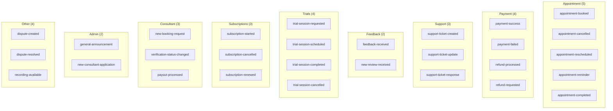
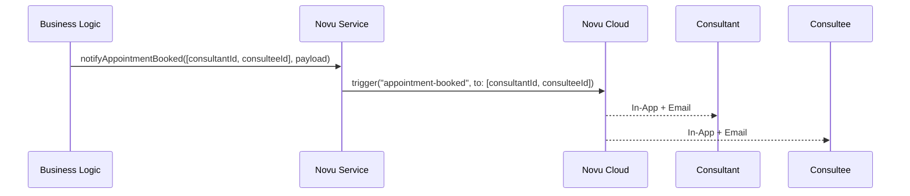

# Workflows and API Reference

## Novu Workflows Overview

All 27 workflow IDs are defined in `lib/novu/workflows.ts` as the `NOVU_WORKFLOWS` constant. Each ID must match its counterpart in the Novu dashboard.



---

## Workflows by Category

### Appointment Lifecycle

| Workflow ID               | Trigger Function                                   | Recipients   | Payload Type                    |
| ------------------------- | -------------------------------------------------- | ------------ | ------------------------------- |
| `appointment-booked`      | `notifyAppointmentBooked(userIds[], payload)`      | Both parties | `AppointmentPayload`            |
| `appointment-cancelled`   | `notifyAppointmentCancelled(userIds[], payload)`   | Both parties | `AppointmentCancelledPayload`   |
| `appointment-rescheduled` | `notifyAppointmentRescheduled(userIds[], payload)` | Both parties | `AppointmentRescheduledPayload` |
| `appointment-reminder`    | _(cron job)_                                       | Both parties | `AppointmentPayload`            |
| `appointment-completed`   | `notifyAppointmentCompleted(userIds[], payload)`   | Both parties | `AppointmentPayload`            |



**AppointmentPayload fields**: `appointmentId?`, `appointmentType`, `consultantName`, `consulteeName`, `planTitle`, `dateTime?`, `dashboardUrl`

**AppointmentCancelledPayload** extends AppointmentPayload with: `reason?`, `cancelledBy: "consultant" | "consultee" | "system"`

**AppointmentRescheduledPayload** extends AppointmentPayload with: `oldDateTime?`, `newDateTime?`

---

### Payment Events

| Workflow ID        | Trigger Function                                 | Recipients            | Payload Type            |
| ------------------ | ------------------------------------------------ | --------------------- | ----------------------- |
| `payment-success`  | `notifyPaymentSuccess(userId, payload)`          | Payer (consultee)     | `PaymentSuccessPayload` |
| `payment-failed`   | `notifyPaymentFailed(userId, payload)`           | Payer (consultee)     | `PaymentFailedPayload`  |
| `refund-processed` | `notifyRefundProcessed(userId, payload)`         | Recipient (consultee) | `RefundPayload`         |
| `refund-requested` | `notifyRefundRequested(adminUserIds[], payload)` | Admin team            | `RefundPayload`         |

**PaymentSuccessPayload**: `amount`, `currency`, `consultantName`, `appointmentType`, `planTitle`, `receiptUrl?`, `dashboardUrl`

**PaymentFailedPayload**: `amount`, `currency`, `consultantName`, `appointmentType`, `planTitle?`, `failureReason`, `retryUrl?`

**RefundPayload**: `amount`, `currency`, `reason?`, `appointmentType?`, `consultantName?`, `dashboardUrl`

---

### Support Tickets

| Workflow ID               | Trigger Function                                      | Recipients    | Payload Type           |
| ------------------------- | ----------------------------------------------------- | ------------- | ---------------------- |
| `support-ticket-created`  | `notifySupportTicketCreated(staffUserIds[], payload)` | Staff team    | `SupportTicketPayload` |
| `support-ticket-update`   | `notifySupportTicketUpdate(userId, payload)`          | Ticket author | `SupportTicketPayload` |
| `support-ticket-response` | `notifySupportTicketResponse(userId, payload)`        | Ticket author | `SupportTicketPayload` |

**SupportTicketPayload**: `ticketId`, `ticketTitle`, `status?`, `message?`, `respondedBy?`, `dashboardUrl`

---

### Feedback and Reviews

| Workflow ID           | Trigger Function                                  | Recipients | Payload Type      |
| --------------------- | ------------------------------------------------- | ---------- | ----------------- |
| `feedback-received`   | `notifyFeedbackReceived(adminUserIds[], payload)` | Admin team | `FeedbackPayload` |
| `new-review-received` | `notifyNewReview(consultantUserId, payload)`      | Consultant | `ReviewPayload`   |

**FeedbackPayload**: `feedbackId`, `userName`, `category?`, `message`, `dashboardUrl`

**ReviewPayload**: `reviewerName`, `rating`, `comment?`, `planTitle?`, `dashboardUrl`

---

### Trial Sessions

| Workflow ID               | Trigger Function                                         | Recipients   | Payload Type          |
| ------------------------- | -------------------------------------------------------- | ------------ | --------------------- |
| `trial-session-requested` | `notifyTrialSessionRequested(consultantUserId, payload)` | Consultant   | `TrialSessionPayload` |
| `trial-session-scheduled` | `notifyTrialSessionScheduled(consulteeUserId, payload)`  | Consultee    | `TrialSessionPayload` |
| `trial-session-completed` | `notifyTrialSessionCompleted(userIds[], payload)`        | Both parties | `TrialSessionPayload` |
| `trial-session-cancelled` | `notifyTrialSessionCancelled(userIds[], payload)`        | Both parties | `TrialSessionPayload` |

**TrialSessionPayload**: `consultantName`, `consulteeName`, `planTitle`, `dateTime?`, `status`, `dashboardUrl`

---

### Subscriptions

| Workflow ID              | Trigger Function                                  | Recipients   | Payload Type          |
| ------------------------ | ------------------------------------------------- | ------------ | --------------------- |
| `subscription-started`   | `notifySubscriptionStarted(userId, payload)`      | Consultee    | `SubscriptionPayload` |
| `subscription-cancelled` | `notifySubscriptionCancelled(userIds[], payload)` | Both parties | `SubscriptionPayload` |
| `subscription-renewed`   | `notifySubscriptionRenewed(userId, payload)`      | Consultee    | `SubscriptionPayload` |

**SubscriptionPayload**: `subscriptionId?`, `planTitle`, `consultantName`, `consulteeName?`, `dashboardUrl`

---

### Consultant-Specific

| Workflow ID                   | Trigger Function                                             | Recipients | Payload Type            |
| ----------------------------- | ------------------------------------------------------------ | ---------- | ----------------------- |
| `new-booking-request`         | `notifyNewBookingRequest(consultantUserId, payload)`         | Consultant | `BookingRequestPayload` |
| `verification-status-changed` | `notifyVerificationStatusChanged(consultantUserId, payload)` | Consultant | `VerificationPayload`   |
| `payout-processed`            | `notifyPayoutProcessed(consultantUserId, payload)`           | Consultant | `PayoutPayload`         |

**BookingRequestPayload**: `consulteeName`, `planTitle`, `appointmentType`, `requestedDateTime?`, `dashboardUrl`

**VerificationPayload**: `status`, `reason?`, `dashboardUrl`

**PayoutPayload**: `amount`, `currency`, `payoutId?`, `dashboardUrl`

---

### Admin / System

| Workflow ID                  | Trigger Function                                          | Recipients                  | Payload Type                   |
| ---------------------------- | --------------------------------------------------------- | --------------------------- | ------------------------------ |
| `general-announcement`       | `notifyGeneralAnnouncement(payload)`                      | All subscribers (broadcast) | `AnnouncementPayload`          |
| `new-consultant-application` | `notifyNewConsultantApplication(adminUserIds[], payload)` | Admin team                  | `ConsultantApplicationPayload` |

**AnnouncementPayload**: `title`, `content`, `linkUrl?`, `linkText?`

**ConsultantApplicationPayload**: `applicantName`, `applicantEmail`, `dashboardUrl`

---

### Disputes, Recordings

| Workflow ID               | Trigger Function                               | Recipients      | Payload Type       |
| ------------------------- | ---------------------------------------------- | --------------- | ------------------ |
| `dispute-created`         | `notifyDisputeCreated(userIds[], payload)`     | Both parties    | `DisputePayload`   |
| `dispute-resolved`        | `notifyDisputeResolved(userIds[], payload)`    | Both parties    | `DisputePayload`   |
| `recording-available`     | `notifyRecordingAvailable(userIds[], payload)` | Both parties    | `RecordingPayload` |


**DisputePayload**: `disputeId?`, `amount`, `currency`, `reason?`, `status?`, `consultantName?`, `consulteeName?`, `dashboardUrl`

**RecordingPayload**: `appointmentType`, `consultantName`, `consulteeName?`, `recordingUrl`, `dashboardUrl`

---

## Resend Direct Emails

These emails bypass Novu and are sent directly through Resend with React Email templates.

### Auth Emails (`lib/email.ts`)

| Function                                                         | Subject                                               | From                       |
| ---------------------------------------------------------------- | ----------------------------------------------------- | -------------------------- |
| `sendWelcomeEmail({email, name, dashboardUrl?})`                 | "Welcome to Familiarise!"                             | onboarding@familiarise.com |
| `sendPasswordResetEmail({email, name, token})`                   | "Reset your Familiarise password"                     | security@familiarise.com   |
| `sendAccountLinkedEmail({email, name, provider, dashboardUrl?})` | "Your Familiarise account now linked with {provider}" | security@familiarise.com   |

### Payment Emails (`lib/email.ts`)

| Function                                                                                                                         | Subject                                        | From                     |
| -------------------------------------------------------------------------------------------------------------------------------- | ---------------------------------------------- | ------------------------ |
| `sendPaymentLinkEmail({email, name, consultantName, appointmentType, amount, currency, paymentUrl, expiresAt})`                  | "Payment Required - {Type} with {Consultant}"  | payments@familiarise.com |
| `sendPaymentSuccessEmail({email, name, consultantName, appointmentType, amount, currency, receiptUrl?, dashboardUrl?})`          | "Payment Confirmed - {Type} with {Consultant}" | payments@familiarise.com |
| `sendPaymentFailedEmail({email, name, consultantName, appointmentType, amount, currency, retryUrl, failureReason?, expiresAt?})` | "Payment Failed - {Type} with {Consultant}"    | payments@familiarise.com |

### POST /api/novu/subscriber

Syncs the authenticated user to Novu as a subscriber. Called by the `useNovuSubscriberSync` hook on dashboard mount.

**Auth**: Required (NextAuth session)

**Request**: No body required (uses session user ID)

**Response**:

```json
{ "success": true }
```

**Errors**:
| Status | Error | Cause |
|--------|-------|-------|
| 401 | `"Unauthorized"` | No valid session |
| 404 | `"User not found"` | User ID not in database |
| 500 | `"Sync failed"` | Novu API error |

---

### GET /api/novu/preferences

Returns the current user's notification preferences. If none exist, returns defaults.

**Auth**: Required (NextAuth session)

**Response** (defaults shown):

```json
{
  "allNotifications": true,
  "inAppEnabled": true,
  "emailEnabled": true,
  "pushEnabled": false,
  "mentions": false,
  "directMessages": false,
  "updates": false,
  "appointmentReminders": true,
  "paymentNotifications": true,
  "supportUpdates": true,
  "feedbackAlerts": true,
  "trialNotifications": true,
  "subscriptionAlerts": true,
  "marketingEmails": false,
  "quietHoursEnabled": false,
  "quietHoursStart": null,
  "quietHoursEnd": null,
  "quietHoursTimezone": null
}
```

---

### PUT /api/novu/preferences

Updates notification preferences. Accepts partial updates (any subset of fields).

**Auth**: Required (NextAuth session)

**Request body** (all fields optional):

```json
{
  "emailEnabled": false,
  "appointmentReminders": false,
  "quietHoursEnabled": true,
  "quietHoursStart": "22:00",
  "quietHoursEnd": "08:00",
  "quietHoursTimezone": "Asia/Kolkata"
}
```

**Validation**: `NotificationPreferenceUpdateSchema` (partial Zod schema from `schemas/user.ts`)

**Side effect**: If `inAppEnabled`, `emailEnabled`, or `pushEnabled` changes, the channel preferences are also synced to the Novu subscriber via `updateSubscriberPreferences()`.

**Response**: Full updated preferences object

**Errors**:
| Status | Error | Cause |
|--------|-------|-------|
| 400 | `"Validation failed"` | Request body fails Zod validation |
| 401 | `"Unauthorized"` | No valid session |
| 500 | `"Failed to update preferences"` | Database or Novu API error |

---

## Integration Points

### Where Notifications Are Triggered in the Codebase

```mermaid
graph TD
    subgraph "Registration"
        R1["/api/auth/register"] -->|sendWelcomeEmail| RES[Resend]
        R1 -->|syncSubscriber| NOVU[Novu]
    end

    subgraph "Booking Flow"
        B1["Consultation/Subscription approval"] -->|notifyAppointmentBooked| NOVU
        B2["Cancellation API"] -->|notifyAppointmentCancelled| NOVU
        B3["Reschedule API"] -->|notifyAppointmentRescheduled| NOVU
    end

    subgraph "Payment Webhooks"
        P1["Stripe/Razorpay webhook"] -->|sendPaymentSuccessEmail| RES
        P1 -->|notifyPaymentSuccess| NOVU
        P2["Payment failure"] -->|sendPaymentFailedEmail| RES
        P2 -->|notifyPaymentFailed| NOVU
    end

    subgraph "Request Approval"
        A1["Consultant approves"] -->|sendPaymentLinkEmail| RES
        A1 -->|notifyNewBookingRequest| NOVU
    end

    subgraph "Support"
        S1["Ticket created"] -->|notifySupportTicketCreated| NOVU
        S2["Staff responds"] -->|notifySupportTicketResponse| NOVU
    end

    subgraph "Cron Jobs"
        CJ1["Appointment reminders"] -->|APPOINTMENT_REMINDER workflow| NOVU
        CJ3["Auto-complete"] -->|notifyAppointmentCompleted| NOVU
    end

    subgraph "Admin"
        AD1["/api/announcements"] -->|notifyGeneralAnnouncement| NOVU
    end
```



### Adding a New Notification

1. **Add workflow ID** to `NOVU_WORKFLOWS` in `lib/novu/workflows.ts`
2. **Add payload type** in the same file
3. **Add trigger function** in `lib/novu/service.ts` using `triggerWorkflow` or `triggerForMultiple`
4. **Create workflow** in the Novu dashboard with matching ID
5. **Call the trigger function** from the relevant API route/webhook handler (inside try-catch, after the main transaction)
