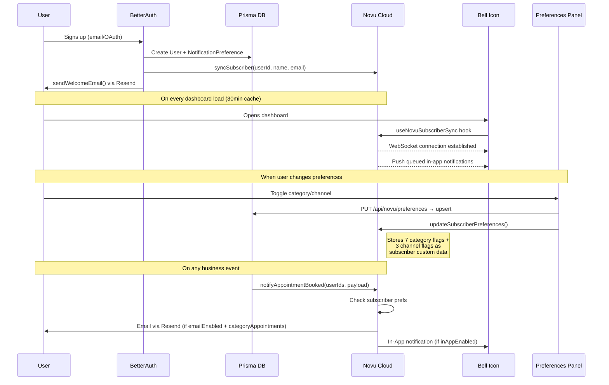
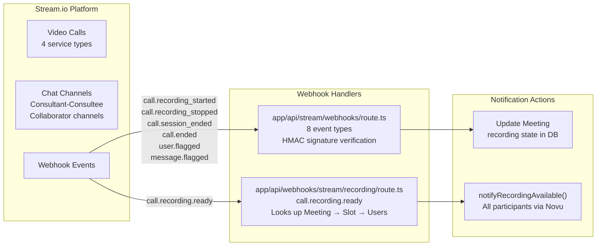
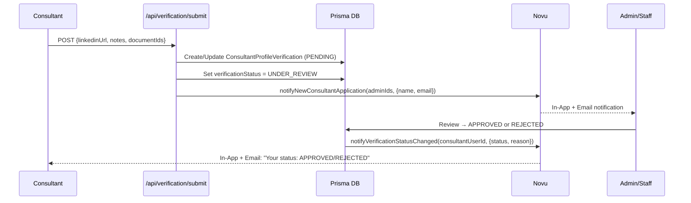
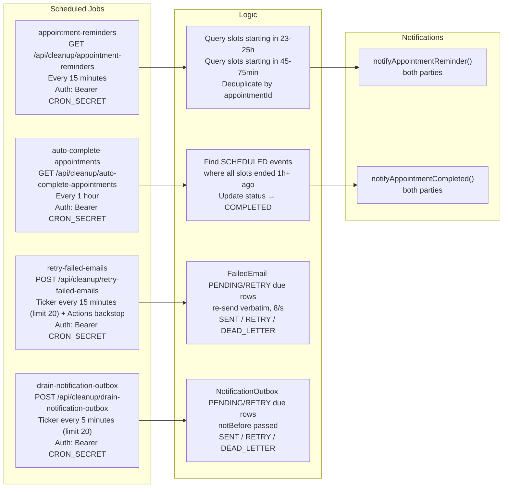

# Email, Notification & Newsletter — Full Ecosystem Architecture

> Complete map of every service, pipeline, component, and data flow in the Familiarise notification system.

**Last Updated**: 2026-09-14

---

## Status Legend

| Symbol        | Meaning                                              |
| ------------- | ---------------------------------------------------- |
| **LIVE**      | Fully implemented and wired into business logic      |
| **CODE DONE** | Code exists, external config needed (Novu Dashboard) |
| **STUB**      | Placeholder code, logs only, no real functionality   |
| **MISSING**   | Not implemented, not stubbed                         |

---

## Master Architecture Diagram

```mermaid
flowchart TB
    subgraph TRIGGERS["User & System Triggers"]
        direction LR
        T_AUTH["Sign Up\nPassword Reset\nOAuth Link"]
        T_BOOK["Book / Pay\nCancel / Reschedule"]
        T_SUPPORT["Support Ticket\nReview / Feedback"]
        T_TRIAL["Trial Request\nVerification Submit"]
        T_ADMIN["Admin Broadcast\nNewsletter Send"]
        T_CRON["Cron: Reminders\nCron: Auto-Complete"]
        T_STREAM["Stream.io:\nRecording Ready"]
        T_NL["Newsletter Subscribe\non website"]
    end

    subgraph PIPE1["PIPELINE 1: Resend Direct — LIVE"]
        direction TB
        P1_LIB["lib/email/index.ts\n11 functions"]
        subgraph P1_TEMPLATES["10 React Email Templates"]
            P1_T1["emails/auth/\nWelcomeEmail\nPasswordResetEmail\nVerificationEmail\nAccountLinkedEmail"]
            P1_T2["emails/payments/\nPaymentLinkEmail\nPaymentSuccessEmail\nPaymentFailedEmail"]
            P1_T3["emails/waitlist/\nConfirm | Welcome"]
            P1_T4["emails/organizations/\nOrgInvitationEmail"]
        end
        P1_RENDER["renderEmail()\nreact-email → {html, text}"]
        P1_STAGE["stage()\nPENDING FailedEmail row\nbefore any send (#1654)"]
        P1_ATTEMPT["attempt()\ninline send under a budget\nidempotency key + AbortSignal"]
        P1_RELAY["retry-failed-emails\nticker every 15 min + Actions backstop\n8 sends/s, backoff ladder"]
        P1_RENDER --> P1_STAGE --> P1_ATTEMPT
        P1_STAGE -. "timed out / transient" .-> P1_RELAY
    end

    subgraph PIPE2["PIPELINE 2: Novu Orchestrated — CODE DONE, DASHBOARD NEEDS CONFIG"]
        direction TB
        P2_SVC["lib/novu/service.ts\n30+ exported trigger functions\nawaited, outbox-first (#1654)"]
        P2_OUTBOX["lib/novu/outbox.ts\nstageTrigger() → NotificationOutbox row\nattemptTrigger() → 5 s inline"]
        P2_DRAIN["drain-notification-outbox\nticker every 5 min\nbackoff ladder, 5 attempts"]
        P2_SVC --> P2_OUTBOX
        P2_OUTBOX -. "timed out / transient" .-> P2_DRAIN
        P2_WF["lib/novu/workflows.ts\n40 workflow IDs\n20+ typed payload interfaces"]
        P2_CLIENT["lib/novu/client.ts\nSingleton, lazy init\nGraceful degradation"]
        P2_SUB["lib/novu/subscriber.ts\nsyncSubscriber()\nupdateSubscriberPreferences()\ndeleteSubscriber()"]
        subgraph NOVU_CLOUD["Novu Cloud Dashboard — NEEDS CONFIG"]
            NC_WF["15 Tier 1 Workflows\nSpecs: docs/notifications/\n03-novu-template-specs.md"]
            NC_EMAIL["Email Channel\nNOT CONFIGURED (ADR 30: in-app only)"]
            NC_INAPP["In-App Channel\nWebSocket → bell icon"]
            NC_PUSH["Push/FCM Channel\nNOT IMPLEMENTED"]
            NC_PREFS["Subscriber Custom Data\n7 category flags\n3 channel flags"]
        end
    end

    subgraph PIPE3["PIPELINE 3: Newsletter — LIVE (interim)"]
        direction TB
        P3_SUB["POST /api/waitlist\nUpserts a PENDING row, sends the confirm email"]
        P3_CONFIRM["GET /api/waitlist/confirm\nHMAC-signed, 48h link\nPENDING → SUBSCRIBED, sends welcome"]
        P3_UNSUB["GET|POST /api/waitlist/unsubscribe\nHMAC-signed, timeless token\nRFC 8058 one-click"]
        P3_SEND["POST /api/admin/waitlist/broadcast\nAdmin-only, Resend batch API\n100/call, auto-appends\nunsubscribe footer + headers"]
        P3_DB[("Waitlist table\nemail, name, status, source, tags\nconfirmedAt, unsubscribedAt")]
    end

    subgraph STUBS["DEFERRED — STUBS"]
        direction TB
        STUB_CK["ConvertKit / Kit\nNo code yet — deferred until\nthe list outgrows the Resend batch API"]
        STUB_CMS["Directus CMS\napp/api/webhooks/directus/\nLogs webhook, returns 200\nTODO: blog → broadcast"]
        STUB_PUSH["Push Notifications\nSchema: pushEnabled field\nNo FCM integration"]
    end

    subgraph PROMO["PROMOTIONAL — NOT CONNECTED"]
        PROMO_MD["emails/promotional/\n16 markdown templates\n8 consultant + 8 consultee\ninitial / followup /\nspecialized / reengagement\nFor: Lemlist, Apollo, Instantly"]
    end

    subgraph CLIENT["CLIENT-SIDE — LIVE"]
        direction TB
        CL_PROV["providers/NovuProvider.tsx\nWraps app with NovuSDKProvider\nAuth-gated rendering"]
        CL_INBOX["components/notifications/\nNotificationInbox.tsx\nBell icon + unread badge\nClick → redirect URL"]
        CL_HOOK["hooks/useNovuSubscriberSync.ts\nReact Query, 30min staleTime\nPOST /api/novu/subscriber"]
        CL_PREFS["components/notifications/\nNotificationPreferencesPanel.tsx\n3 channels + 7 categories\n+ quiet hours"]
    end

    subgraph DASHBOARDS["DASHBOARD INTEGRATION"]
        direction TB
        D_ADMIN["Admin Settings\nHas NotificationPreferencesPanel ✅"]
        D_STAFF["Staff Settings\nHas NotificationPreferencesPanel ✅"]
        D_CONSULTANT["Consultant Settings\nMISSING prefs panel ⚠️"]
        D_CONSULTEE["Consultee Settings\nMISSING prefs panel ⚠️"]
        D_ANNOUNCE["Admin: POST /api/announcements\nCreates announcement record\n+ notifyGeneralAnnouncement()\ntriggerBroadcast to ALL users"]
        D_NL_SEND["Admin: Newsletter Send UI\nPOST /api/admin/waitlist/broadcast"]
    end

    subgraph DELIVERY["DELIVERY"]
        DEL_RESEND["Resend API\nresend.emails.send()\nresend.batch.send()"]
        DEL_WS["Novu WebSocket\nReal-time in-app"]
        DEL_EMAIL["User Email Inbox"]
        DEL_HOOK["POST /api/webhooks/resend\nsvix-signed delivery events (#1647)"]
        DEL_EVENTS[("EmailEvent\nEmailSuppression")]
    end

    %% Trigger → Pipeline 1 (Resend Direct)
    T_AUTH -->|"sendWelcomeEmail\nsendPasswordResetEmail\nsendAccountLinkedEmail"| P1_LIB
    T_BOOK -->|"sendPaymentLinkEmail\nsendPaymentSuccessEmail\nsendPaymentFailedEmail"| P1_LIB

    %% Trigger → Pipeline 2 (Novu)
    T_BOOK -->|"notifyAppointmentBooked\nnotifyPaymentSuccess/Failed\nnotifyAppointmentCancelled"| P2_SVC
    T_SUPPORT -->|"notifySupportTicketCreated\nnotifyNewReview"| P2_SVC
    T_TRIAL -->|"notifyTrialRequested\nnotifyVerificationStatusChanged\nnotifyNewConsultantApplication"| P2_SVC
    T_ADMIN -->|"notifyGeneralAnnouncement"| P2_SVC
    T_CRON -->|"notifyAppointmentReminder\nnotifyAppointmentCompleted"| P2_SVC
    T_STREAM -->|"notifyRecordingAvailable"| P2_SVC

    %% Trigger → Pipeline 3 (Newsletter)
    T_NL --> P3_SUB
    T_ADMIN --> P3_SEND

    %% Pipeline 1 internal
    P1_LIB --> P1_RENDER
    P1_RENDER --> P1_DELIVER
    P1_DELIVER --> DEL_RESEND

    %% Pipeline 2 internal
    P2_SVC --> P2_CLIENT --> NOVU_CLOUD
    NC_EMAIL -.->|"future"| DEL_RESEND
    NC_INAPP --> DEL_WS

    %% Pipeline 3 internal
    P3_SUB --> P3_DB
    P3_SUB --> DEL_RESEND
    P3_CONFIRM --> P3_DB
    P3_CONFIRM --> DEL_RESEND
    P3_UNSUB --> P3_DB
    P3_SEND --> P3_DB
    P3_SEND --> DEL_RESEND

    %% Stubs
    STUB_CMS -.->|"future: blog webhook"| STUB_CK

    %% Delivery
    DEL_RESEND --> DEL_EMAIL
    DEL_WS --> CL_INBOX

    %% Delivery events back into the outbox (#1647)
    DEL_RESEND -->|"email.delivered / bounced /\ncomplained / failed"| DEL_HOOK
    DEL_HOOK --> DEL_EVENTS
    DEL_EVENTS -.->|"stage() and the relay\nrefuse a suppressed address"| P1_STAGE

    %% Client → Backend
    CL_PREFS -->|"PUT /api/novu/preferences"| P2_SUB
    CL_HOOK -->|"POST /api/novu/subscriber"| P2_SUB
    P2_SUB --> NC_PREFS

    %% Dashboard → Components
    CL_PREFS --> D_ADMIN
    CL_PREFS --> D_STAFF
    CL_PREFS -.->|"NOT included"| D_CONSULTANT
    CL_PREFS -.->|"NOT included"| D_CONSULTEE
    D_ANNOUNCE --> P2_SVC
    D_NL_SEND --> P3_SEND
```



---

## Pipeline Breakdown

### Pipeline 1: Resend Direct — LIVE

**Purpose:** Transactional emails that are tightly coupled to auth, payment, and newsletter flows. These bypass Novu because they don't need multi-channel delivery (no in-app, no push).

**How it works:**

1. Business logic calls a send function (e.g., `sendWelcomeEmail()`) in `lib/email/index.ts`
2. The function renders its React Email element via `renderEmail()` (`lib/email/render.ts`) into `{html, text}`
3. The function calls `deliver()` (`lib/email/deliver.ts`), the single send core, with the entity anchor it knows and its budget from `EMAIL_BUDGET_MS`
4. `deliver()` first stages the rendered message as a `PENDING` `FailedEmail` row (`stage()`), then attempts one send via `resend.emails.send()` under a content-hash Idempotency-Key and an `AbortSignal` for the budget (`attempt()`); success marks the row `SENT` with the Resend id, a terminal failure dead-letters it, a transient failure or a timeout leaves it `PENDING` for the relay (#1654)
5. A caller inside a database transaction (the payment webhook) calls `stage()` inside the transaction and `attempt()` after the commit, so a rollback takes the row with it
6. `jobs/email/retry-failed-emails.ts` is the relay: the Netlify ticker runs it every fifteen minutes through `/api/cleanup/retry-failed-emails`, paced under Resend's rate limit, and the GitHub Actions workflow is the unbounded backstop
7. Resend reports what happened after acceptance to `POST /api/webhooks/resend` (#1647), which stores every signed event as an `EmailEvent` row and, for a permanent bounce or a complaint, writes the address to `EmailSuppression`; `stage()` and the relay dead-letter a message to a suppressed address with `suppressed:<REASON>` instead of sending it

The delivery events close the loop that the outbox opened. A `FailedEmail` row records that a message was handed to Resend and under which id; the `EmailEvent` rows for that id record whether it was delivered, delayed, bounced or complained about, and the suppression list built from those events is consulted before the next message to the same address is staged. The receiver is idempotent on the svix id, answers 200 for a duplicate, and only reaches production because Resend's event hook is registered against the production URL; the wiring steps are in [05-pre-production-checklist.md](05-pre-production-checklist.md).

**10 React Email templates behind 11 senders** (the contact-inquiry sender builds inline HTML instead of a template):

| Template                   | From Address                            | Triggered By                                          |
| -------------------------- | --------------------------------------- | ----------------------------------------------------- |
| WelcomeEmail               | `onboarding@mail.familiarisenow.com`    | BetterAuth `user.create.after` hook (awaited, #1298)  |
| PasswordResetEmail         | `security@mail.familiarisenow.com`      | Password reset flow                                   |
| VerificationEmail          | `onboarding@mail.familiarisenow.com`    | Email verification flow                               |
| AccountLinkedEmail         | `security@mail.familiarisenow.com`      | OAuth account linking (awaited, #1298)                |
| PaymentLinkEmail           | `payments@mail.familiarisenow.com`      | Consultant approves consultation/subscription request |
| PaymentSuccessEmail        | `payments@mail.familiarisenow.com`      | Stripe/Razorpay payment webhook                       |
| PaymentFailedEmail         | `payments@mail.familiarisenow.com`      | Stripe/Razorpay failure webhook                       |
| OrgInvitationEmail         | `notifications@mail.familiarisenow.com` | Organization invitation flow (no caller today)        |
| WaitlistConfirmEmail       | `newsletter@news.familiarisenow.com`    | Double opt-in confirmation for a waitlist signup      |
| WaitlistWelcomeEmail       | `newsletter@news.familiarisenow.com`    | Sent once the confirm link is clicked                 |
| (inline HTML, no template) | `notifications@mail.familiarisenow.com` | `/contactus` submission → `sendContactInquiryEmail`   |

Every address above is env-derived from `EMAIL_TRANSACTIONAL_DOMAIN` / `EMAIL_NEWSLETTER_DOMAIN`; the values shown are the defaults.

**Design system:** White card on `#f5f5f5` background, black CTA button, `-apple-system` font stack, `16px` body, `28px` heading.

---

### Pipeline 2: Novu Orchestrated — CODE DONE, DASHBOARD NEEDS CONFIG

**Purpose:** Multi-channel notifications (in-app today; email and push are future channels). Novu is the "brain" that decides what/who/where/when. As of ADR 30 all sixteen workflow families are in-app only, so the email step described below is the planned design and is not created in any family; no Resend provider is configured in Novu.

**How it works:**

1. Business logic awaits a trigger function (e.g., `notifyAppointmentBooked(userIds, payload)`); a caller inside a transaction passes `{ tx, entityRef }` and runs `attemptTrigger()` after the commit
2. `stageTrigger()` (`lib/novu/outbox.ts`) upserts a `NotificationOutbox` row keyed on a `transactionId` derived from the event, the sorted recipients and the payload (#1654)
3. If `isNovuConfigured()` is false the row waits for the drain and the function returns `{success: false}`; otherwise `attemptTrigger()` calls `novu.trigger()` (single user or a batch of 100) or `novu.triggerBroadcast()` (all subscribers) under the client's five-second timeout, marks the row `SENT`, dead-letters it on a terminal 4xx, or leaves it `PENDING` on a timeout or 5xx for `jobs/notifications/drain-notification-outbox.ts`, which the Netlify ticker runs every five minutes
4. Novu Cloud receives the event, deduplicates on the `transactionId`, and executes the workflow:
   - **Email step (not yet created)** → would render a template with `{{payload.variables}}` and send via a Resend integration
   - **In-App step** → pushes to subscriber's WebSocket → appears in bell icon
   - **Digest/Delay steps** → can batch or schedule (configured per-workflow in Dashboard)
5. Novu checks subscriber preference data before sending (category flags)

**40 Workflow IDs (by tier):**

| Tier        | Workflows                                                                                                                                                                                                                                                                                    | Status                                                                 |
| ----------- | -------------------------------------------------------------------------------------------------------------------------------------------------------------------------------------------------------------------------------------------------------------------------------------------- | ---------------------------------------------------------------------- |
| Tier 1 (16) | appointment-booked, appointment-cancelled, appointment-reminder, payment-success, payment-failed, new-booking-request, subscription-started, subscription-cancelled, trial-session-\* (4), support-ticket-created, support-ticket-response, new-review-received, verification-status-changed | Template specs ready in `docs/notifications/03-novu-template-specs.md` |
| Tier 2 (12) | appointment-rescheduled, appointment-completed, appointment-partially-scheduled, refund-processed, refund-requested, payout-processed, payout-failed, maintenance-scheduled, collaborator-invited/accepted/removed, new-consultant-application                                                            | Triggers wired, Dashboard config deferred                              |
| Tier 3 (16) | subscription-renewed, referral-_, maintenance-_, dispute-_, recording-_, general-announcement, feedback-received, etc.                                                                                                                                                                            | Functions exist, wiring deferred |

**Trigger wiring (which business logic calls which notification):**

| Business Logic File                                         | Notifications Fired                                            |
| ----------------------------------------------------------- | -------------------------------------------------------------- |
| `lib/payments/webhooks/handlers.ts`                         | appointmentBooked, paymentSuccess, paymentFailed               |
| `app/api/appointments/[id]/cancel/route.ts`                 | appointmentCancelled                                           |
| `app/api/appointments/[id]/reschedule/route.ts`             | appointmentRescheduled                                         |
| `app/api/cleanup/appointment-reminders/route.ts`            | appointmentReminder (cron)                                     |
| `scripts/appointments/auto-complete-appointments.ts`        | appointmentCompleted (cron)                                    |
| `app/api/scheduling/request-for-approval/route.ts`          | newBookingRequest                                              |
| `app/api/bookings/subscriptions/`                           | subscriptionStarted, subscriptionCancelled                     |
| `app/api/trials/route.ts` + `[trialId]/route.ts`            | trial\* (4)                                                    |
| `app/api/user/support-tickets/route.ts`                     | supportTicketCreated                                           |
| `app/api/staff/support-tickets/[id]/responses/route.ts`     | supportTicketResponse                                          |
| `app/api/user/reviews/route.ts`                             | newReview                                                      |
| `app/api/admin/verification/` + `app/api/staff/moderation/` | verificationStatusChanged                                      |
| `app/api/verification/submit/route.ts`                      | newConsultantApplication                                       |
| `lib/payments/payouts/payout-service.ts`                    | payoutProcessed, payoutFailed                                  |
| `lib/collaborators/service.ts`                              | collaboratorInvited, collaboratorAccepted, collaboratorRemoved |
| `app/api/webhooks/stream/recording/route.ts`                | recordingAvailable                                             |
| `app/api/announcements/route.ts`                            | generalAnnouncement (broadcast)                                |
| `app/api/webhooks/utils.ts`                                 | refundProcessed, disputeCreated, disputeResolved               |
| `app/api/user/feedbacks/route.ts`                           | feedbackReceived                                               |

---

### Pipeline 3: Newsletter Interim — LIVE

**Purpose:** Collect newsletter subscribers with a double opt-in and send occasional broadcasts via the Resend batch API. Interim solution until a list tool such as ConvertKit is integrated at 500+ subscribers.

**How it works:**

```
Subscribe (double opt-in, see docs/marketing/01-waitlist-newsletter.md):
  User enters email on site → POST /api/waitlist
    → upserts a Waitlist row with status PENDING (re-subscribe resets it)
    → sendWaitlistConfirmEmail() with an HMAC-signed, 48-hour confirm link
    → returns {success: true}

Confirm:
  User clicks link → GET /api/waitlist/confirm?email=...&token=...&issuedAt=...
    → verifyConfirmToken() (signature + TTL)
    → status PENDING → SUBSCRIBED, confirmedAt = now()
    → sendWaitlistWelcomeEmail() with the unsubscribe link

Send:
  Admin calls POST /api/admin/waitlist/broadcast {subject, htmlBody, textBody?}
    → Auth check (ADMIN role only, requireAdminAuth())
    → listSendableSubscribers() from lib/waitlist/service.ts
    → findSuppressed() drops every address on EmailSuppression (#1647)
    → For each batch of 100: a FailedEmailBatch row is upserted under the
      batch's idempotency key, then resend.batch.send() via getResendClient()
      from lib/email; a failed send leaves the row PENDING for the relay
    → Each email gets: unsubscribe footer + List-Unsubscribe header
    → Returns {sent, failed, total, skippedSuppressed}

  There is no `/api/admin/newsletter/send` route; the broadcast endpoint lives
  under `/api/admin/waitlist/broadcast` because the send list and the double
  opt-in confirmation share the Waitlist table.

Unsubscribe:
  User clicks link → GET /api/waitlist/unsubscribe?email=...&token=...
  Mail client one-click → POST /api/waitlist/unsubscribe (RFC 8058)
    → verifyUnsubscribeToken() (HMAC-SHA256, never expires)
    → status → UNSUBSCRIBED, unsubscribedAt = now()
    → Show HTML confirmation page
```

**Database model:** the `Waitlist` model in `prisma/schema.prisma` (`email`, `name`, `status`, `source`, `tags`, `userId`, `confirmedAt`, `unsubscribedAt`, consent proof). There are no token columns because both links are stateless HMACs; the field-by-field description lives in [docs/marketing/01-waitlist-newsletter.md](../marketing/01-waitlist-newsletter.md).

---

## Subscriber Lifecycle



---

## Stream.io Integration



**Data path for recording notification:**
`Stream.io call.recording.ready` → `route.ts` → `prisma.meeting.findFirst({where: {streamCallId}})` → `include: appointmentOccurrence → appointment → consultation/subscription/webinar/class` → extract consultant name + participant user IDs from slot's M2M `user` relation → `notifyRecordingAvailable(userIds, {recordingUrl, ...})`

---

## Verification Flow



---

## Cron Jobs



The two relays are the outbox halves of #1654: every email and every Novu trigger is a row before it is a network call, and these two jobs finish whatever the inline attempt could not settle within its budget. Both are also runnable as standalone jobs (`jobs/email/retry-failed-emails.ts`, `jobs/notifications/drain-notification-outbox.ts`) under the same fail-closed cron locks.

---

## Dashboard & Admin Features

| Feature                      | Route                              | Who                                             | What It Does                                                |
| ---------------------------- | ---------------------------------- | ----------------------------------------------- | ----------------------------------------------------------- |
| **Notification Preferences** | Settings page                      | Admin ✅, Staff ✅, Consultant ⚠️, Consultee ⚠️ | 3 channels + 7 categories + quiet hours                     |
| **Bell Icon / Inbox**        | All dashboards                     | All roles                                       | Novu in-app notifications, unread count, click-to-redirect  |
| **Announcements**            | POST /api/announcements            | Admin, Staff                                    | Create announcement + broadcast to all Novu subscribers     |
| **Newsletter Send**          | POST /api/admin/waitlist/broadcast | Admin only                                      | Send HTML email to every SUBSCRIBED Waitlist row via Resend |
| **Newsletter Stats**         | (not built)                        | —                                               | Would show subscriber count, open rates                     |
| **Verification Review**      | /dashboard/admin/verification      | Admin, Staff                                    | Review applications → triggers verificationStatusChanged    |

---

## What's STUB vs LIVE vs MISSING

### LIVE (fully working)

| Component                                      | Files                                                                                                            |
| ---------------------------------------------- | ---------------------------------------------------------------------------------------------------------------- |
| Resend email client                            | `lib/email/index.ts`, `lib/email/deliver.ts`, `lib/email/config.ts`                                              |
| 10 React Email templates behind 11 senders     | `emails/auth/`, `emails/payments/`, `emails/organizations/`, `emails/waitlist/`, `emails/components/`            |
| Novu client + service + workflows + subscriber | `lib/novu/*.ts`                                                                                                  |
| Novu React provider + bell icon + sync hook    | `providers/NovuProvider.tsx`, `components/notifications/NotificationInbox.tsx`, `hooks/useNovuSubscriberSync.ts` |
| Notification Preferences Panel                 | `components/notifications/NotificationPreferencesPanel.tsx`                                                      |
| Preferences API                                | `app/api/novu/preferences/route.ts` (GET/PUT)                                                                    |
| Subscriber sync API                            | `app/api/novu/subscriber/route.ts` (POST)                                                                        |
| Waitlist double opt-in confirm/unsubscribe     | `lib/waitlist/tokens.ts`, `lib/waitlist/service.ts`                                                              |
| Admin waitlist broadcast                       | `app/api/admin/waitlist/broadcast/route.ts`                                                                      |
| Appointment reminders cron                     | `app/api/cleanup/appointment-reminders/route.ts`                                                                 |
| Auto-complete + notify                         | `scripts/appointments/auto-complete-appointments.ts`                                                             |
| Stream recording webhook                       | `app/api/webhooks/stream/recording/route.ts`                                                                     |
| Stream main webhook                            | `app/api/stream/webhooks/route.ts`                                                                               |
| Announcements + broadcast                      | `app/api/announcements/route.ts`                                                                                 |
| 30+ notification trigger wiring                | Various API routes and services                                                                                  |

### STUB (placeholder code, no functionality)

| Component            | File                                 | What It Does Now        | When to Implement  |
| -------------------- | ------------------------------------ | ----------------------- | ------------------ |
| Directus CMS webhook | `app/api/webhooks/directus/route.ts` | Logs event, returns 200 | When blog launches |

### NEEDS EXTERNAL CONFIG (code complete, config needed)

| Component       | What's Needed                                                                                                                                                                                                          |
| --------------- | ---------------------------------------------------------------------------------------------------------------------------------------------------------------------------------------------------------------------- |
| Novu workflows  | Not a dashboard task: `lib/novu/templates/` is the source of truth and `npm run novu:sync` writes it to the Development environment (ADR 30); all sixteen families are in-app only, no Resend integration to configure |
| Resend domains  | Add `mail.familiarisenow.com` and `news.familiarisenow.com` in the Resend dashboard, then add the DKIM/return-path/SPF/DMARC records the dashboard returns in Netlify DNS (region: Tokyo, `ap-northeast-1`)            |
| Cron scheduling | Schedule reminder + auto-complete cron jobs in GitHub Actions or Netlify                                                                                                                                               |

### MISSING (no code, no stub)

| Component                              | Impact                                       | Recommendation                                             |
| -------------------------------------- | -------------------------------------------- | ---------------------------------------------------------- |
| Consultant/Consultee preferences panel | Users can't manage notification preferences  | Add `NotificationPreferencesPanel` to their settings pages |
| Newsletter subscribe UI component      | No way for users to subscribe on the website | Build footer/sidebar email input form                      |
| Push notifications (FCM)               | No browser push                              | Defer until significant user base                          |
| Email analytics (opens/clicks)         | No open or click tracking                    | Widen the #1647 webhook subscription once tracking is on   |
| Notification logging/audit             | No delivery audit trail                      | Novu Dashboard activity feed covers this                   |
| Promotional email automation           | 16 templates sit unused                      | Use external tool (Lemlist) for cold outreach              |

---

## Environment Variables

| Variable                             | Required | Used By                                                                              |
| ------------------------------------ | -------- | ------------------------------------------------------------------------------------ |
| `RESEND_API_KEY`                     | Yes      | Resend direct emails, waitlist broadcast                                             |
| `RESEND_WEBHOOK_SECRET`              | Yes      | Signature verification in `/api/webhooks/resend` (#1647); production context only    |
| `EMAIL_TRANSACTIONAL_DOMAIN`         | No       | Transactional sender domain (defaults to `mail.familiarisenow.com`)                  |
| `EMAIL_NEWSLETTER_DOMAIN`            | No       | Waitlist/newsletter sender domain (defaults to `news.familiarisenow.com`)            |
| `NEXT_PUBLIC_SUPPORT_EMAIL`          | No       | Public support mailbox, default Reply-To                                             |
| `CONTACT_INBOX_ADDRESS`              | No       | `/contactus` delivery inbox (defaults to the support mailbox)                        |
| `BILLING_EMAIL`                      | No       | Supplier contact on tax invoices (defaults to the support mailbox)                   |
| `NEXT_PUBLIC_COMPANY_POSTAL_ADDRESS` | No       | Optional postal line in `EmailFooter`                                                |
| `NOVU_DEVELOPMENT_KEY`               | Yes      | Novu server-side SDK, Development environment (local, previews)                      |
| `NOVU_PRODUCTION_KEY`                | Yes      | Novu server-side SDK, Production environment (production only)                       |
| `NEXT_PUBLIC_NOVU_APP_ID`            | Yes      | Novu React SDK (client-side)                                                         |
| `NEXT_PUBLIC_APP_URL`                | Yes      | Email link URLs, unsubscribe URLs                                                    |
| `CRON_SECRET`                        | Yes      | Auth for cron job endpoints                                                          |
| `WAITLIST_HMAC_SECRET`               | Yes      | Waitlist confirm/unsubscribe token signing; there is no fallback to `RESEND_API_KEY` |
| `STREAM_WEBHOOK_SECRET`              | Yes      | Stream webhook signature verification                                                |

---

## NPM Packages

| Package        | Version | Pipeline                                                                                 |
| -------------- | ------- | ---------------------------------------------------------------------------------------- |
| `resend`       | ^6.28.0 | Pipeline 1 + 3                                                                           |
| `react-email`  | 6.9.5   | Pipeline 1 (replaces the deprecated `@react-email/components` and `@react-email/render`) |
| `@novu/api`    | 3.13.0  | Pipeline 2 (server)                                                                      |
| `@novu/nextjs` | 3.13.0  | Pipeline 2 (client)                                                                      |
| `@novu/react`  | 3.13.0  | Pipeline 2 (client)                                                                      |
