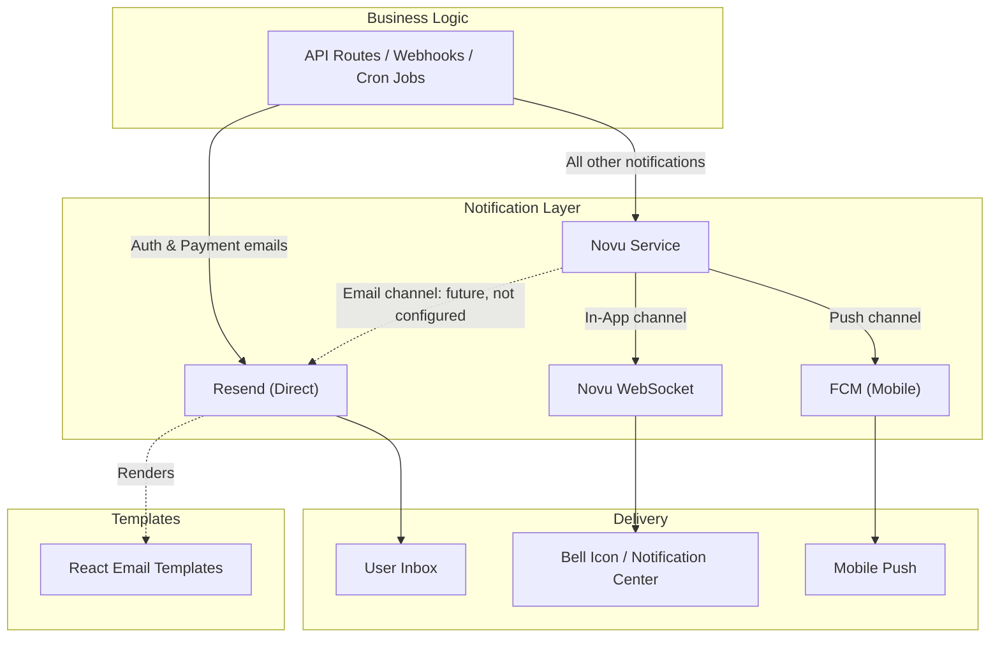

# Notification System

The notification system uses a dual-layer architecture: **Resend** for direct transactional email delivery and **Novu** for multi-channel notification orchestration (in-app, email, push). Neither layer blocks the main transaction flow — a notification call never causes the calling operation to roll back. As of #1654 both layers are outbox-first: a transactional email is a `PENDING` `FailedEmail` row before Resend is called and a Novu trigger is a `NotificationOutbox` row before Novu is called, each written where the business change commits (inside its transaction when the caller has one), attempted once inline under a time budget, and finished by a relay on the Netlify ticker when that attempt times out or fails transiently. A timeout is not a failure and never pages; the row waits and the idempotency key (Resend) or `transactionId` (Novu) makes a late duplicate harmless. As of #1298, a missing or invalid `RESEND_API_KEY` leaves the row `PENDING` for the relay rather than dropping the message. All sixteen Novu workflow families are in-app only, so Novu never sends an email.

## Core Principles

- **Non-fatal, and durable** -- a notification failure never rolls back the persisted business work, because the only thing inside the transaction is the outbox row; the send happens after the commit, under a budget, and the relay finishes it. Every call site is awaited (an un-awaited call is dropped when the Netlify instance freezes after the response), so "non-fatal" does not mean "fire-and-forget". `app/api/contact/route.ts` answers success once the inquiry row exists and keeps its 502 only for the case where even the row could not be written
- **A missing key is captured, not dropped** -- a missing Novu secret key for the current environment (`NOVU_DEVELOPMENT_KEY` or `NOVU_PRODUCTION_KEY`) leaves the `NotificationOutbox` row `PENDING` for the drain to deliver once the key exists. On the Resend side a missing `RESEND_API_KEY` (`EmailNotConfiguredError`) leaves the `FailedEmail` row `PENDING` and pages once at level "error"; a terminal cause (dead key, unverified domain, `validation_error`) dead-letters the row on the spot. The relays skip every row while the key is absent, replay it once the key exists, and move a transient failure to `RETRY` on the shared backoff ladder
- **Singleton clients** -- both Resend and Novu use lazy-initialized singleton instances
- **Subscriber = User** -- Novu `subscriberId` is the Prisma `User.id`
- **67 notification events in 16 Novu workflow families** -- each event has a typed payload; the family is the Novu workflow and carries the event as `payload.event`; every family is in-app only, so Novu never carries an email
- **11 Resend senders, 10 React Email templates** -- `lib/email/index.ts` exports eleven sender functions; the contact-inquiry sender builds inline HTML instead of a template, so there are 10 React Email templates behind 11 senders. Every message is rendered server-side by `renderEmail()` (`lib/email/render.ts`, `react-email`'s `render()`) into both an HTML and a plain-text part
- **User preferences** -- channel toggles (in-app, email, push), category toggles (7 categories), quiet hours

## Source Code Map

### Backend Services

| File                                | Purpose                                                                                                                                                                                                           |
| ----------------------------------- | ----------------------------------------------------------------------------------------------------------------------------------------------------------------------------------------------------------------- |
| `lib/novu/client.ts`                | Singleton Novu client, `isNovuConfigured()` guard                                                                                                                                                                 |
| `lib/novu/service.ts`               | 20+ trigger functions: `notifyAppointmentBooked`, `notifyPaymentSuccess`, etc.                                                                                                                                    |
| `lib/novu/workflows.ts`             | 69 event id constants and their typed payloads; `lib/novu/templates/` maps them onto 16 workflow families                                                                                                         |
| `lib/novu/subscriber.ts`            | `syncSubscriber`, `updateSubscriberPreferences`, `deleteSubscriber`                                                                                                                                               |
| `lib/email/index.ts`                | Eleven Resend sender functions (welcome, password reset, verification, account linked, payment link/success/failed, org invitation, waitlist confirm/welcome, contact inquiry); `@/lib/email` still resolves here |
| `lib/email/config.ts`               | `SENDERS` getters and `supportEmail()`/`contactInboxAddress()`/`billingEmail()`/`companyPostalAddress()`, all read from env at call time                                                                          |
| `lib/email/deliver.ts`              | `deliver()`, the single send core: content-hash idempotency key, `EmailNotConfiguredError`, `recordFailedEmail`                                                                                                   |
| `lib/email/preferences.ts`          | `loadEmailRecipients()` and `isEmailAllowed()`, the send-time preference gate; `EMAIL_CATEGORY_COLUMN`, the one category → column map (#1653)                                                                     |
| `lib/email/unsubscribe.ts`          | Timeless HMAC unsubscribe tokens, `buildEmailUnsubscribeUrl()` and the RFC 8058 `listUnsubscribeHeaders()` (#1653)                                                                                                |
| `lib/email/send-to-recipients.ts`   | `sendToRecipients()` fan-out over gated recipients, plus `stageToRecipients()`/`attemptStaged()` for a transaction owner (#1653)                                                                                  |
| `lib/email/idempotency.ts`          | Derives the `<EMAIL_TYPE>/<sha256(to\nsubject\nhtml)[:48]>` idempotency key shared by a sender and the retry worker                                                                                               |
| `lib/email/classify.ts`             | Classifies a Resend failure as terminal (dead key, unverified domain, missing key) or transient                                                                                                                   |
| `lib/email/render.ts`               | `renderEmail()` — renders a React Email element to `{ html, text }`                                                                                                                                               |
| `jobs/email/retry-failed-emails.ts` | Retry worker: dead-letters an expired verification/reset row, replays under the same idempotency key otherwise                                                                                                    |

### Frontend

| File                             | Purpose                                                       |
| -------------------------------- | ------------------------------------------------------------- |
| `providers/NovuProvider.tsx`     | Client-side Novu SDK wrapper, auth-gated                      |
| `hooks/useNovuSubscriberSync.ts` | Auto-syncs user to Novu on dashboard mount (30-min staleTime) |

### API Routes

| Route                            | Method | Purpose                                                                                        |
| -------------------------------- | ------ | ---------------------------------------------------------------------------------------------- |
| `/api/novu/subscriber`           | POST   | Syncs authenticated user to Novu as subscriber                                                 |
| `/api/novu/preferences`          | GET    | Returns user's notification preferences (with defaults)                                        |
| `/api/novu/preferences`          | PUT    | Updates notification preferences, syncs channel prefs to Novu                                  |
| `/api/notifications/unsubscribe` | GET    | Verifies the footer link's token and redirects to `/email/unsubscribe`; writes nothing (#1653) |
| `/api/notifications/unsubscribe` | POST   | RFC 8058 one-click: sets `emailEnabled = false` and mirrors the flags to Novu (#1653)          |

### Email Templates (`emails/`)

The table below lists the ten React Email templates plus the one sender that builds inline HTML instead of a template; `components/EmailLogo.tsx` and `components/EmailFooter.tsx` are shared building blocks each template composes rather than templates of their own.

| Template                               | Category      | Sent Via                                                                                                                                                                              |
| -------------------------------------- | ------------- | ------------------------------------------------------------------------------------------------------------------------------------------------------------------------------------- |
| `components/EmailLogo.tsx`             | Shared        | Absolute logo URL via `getAppUrl()`, composed into every template                                                                                                                     |
| `components/EmailFooter.tsx`           | Shared        | Copyright year, Privacy/Terms links, optional postal line, optional unsubscribe link, optional support line, optional preferences link and required-notice line (#1653)               |
| `components/EmailLayout.tsx`           | Shared        | The frame new lifecycle templates render inside: `Html > Head > Preview > Body > Container > EmailLogo > Section > EmailFooter`, taking `unsubscribeUrl` and `requiredNotice` (#1653) |
| `components/styles.ts`                 | Shared        | The inline style objects (`heading`, `paragraph`, `button`, `divider`, `link`, ...) new templates import instead of re-declaring (#1653)                                              |
| `auth/WelcomeEmail.tsx`                | Auth          | `lib/email/index.ts` → `sendWelcomeEmail`                                                                                                                                             |
| `auth/PasswordResetEmail.tsx`          | Auth          | `lib/email/index.ts` → `sendPasswordResetEmail`                                                                                                                                       |
| `auth/VerificationEmail.tsx`           | Auth          | `lib/email/index.ts` → `sendVerificationEmail`                                                                                                                                        |
| `auth/AccountLinkedEmail.tsx`          | Auth          | `lib/email/index.ts` → `sendAccountLinkedEmail`                                                                                                                                       |
| `payments/PaymentLinkEmail.tsx`        | Payments      | `lib/email/index.ts` → `sendPaymentLinkEmail`                                                                                                                                         |
| `payments/PaymentSuccessEmail.tsx`     | Payments      | `lib/email/index.ts` → `sendPaymentSuccessEmail`                                                                                                                                      |
| `payments/PaymentFailedEmail.tsx`      | Payments      | `lib/email/index.ts` → `sendPaymentFailedEmail`                                                                                                                                       |
| `organizations/OrgInvitationEmail.tsx` | Organizations | `lib/email/index.ts` → `sendOrgInvitationEmail` (no caller today)                                                                                                                     |
| `waitlist/WaitlistConfirmEmail.tsx`    | Newsletter    | `lib/email/index.ts` → `sendWaitlistConfirmEmail`                                                                                                                                     |
| `waitlist/WaitlistWelcomeEmail.tsx`    | Newsletter    | `lib/email/index.ts` → `sendWaitlistWelcomeEmail`                                                                                                                                     |
| Inline HTML (no `.tsx` file)           | Contact       | `lib/email/index.ts` → `sendContactInquiryEmail`, builds HTML directly instead of rendering a template                                                                                |

### Schemas

| File                                               | Purpose                                                                                                                                                 |
| -------------------------------------------------- | ------------------------------------------------------------------------------------------------------------------------------------------------------- |
| `schemas/user.ts`                                  | `NotificationPreferenceSchema`, `NotificationPreferenceUpdateSchema`                                                                                    |
| [07-schema-reference.md](./07-schema-reference.md) | The Prisma tables behind outbox-first delivery: `FailedEmail`'s new columns, `FailedEmailBatch`, `EmailEvent`, `EmailSuppression`, `NotificationOutbox` |

## Source of truth for Novu templates

`lib/novu/templates/` is the source of truth for every Novu workflow's in-app copy, redirect and opt-out category; `scripts/novu/sync-workflows.ts` writes it to the Novu environment as one workflow per family. Run `npm run novu:sync -- --dry-run` to preview a change, `npm run novu:sync` to apply it, and `npm run novu:check` to check for drift (the CI-side guard). See [ADR 30](../enterprise/70-design-decisions/30-novu-templates-as-code-and-workflow-families.md) for why the templates moved into the repository and why they are grouped into families.

## Quick Navigation

| I want to...                                                        | Go to                                                                                                                      |
| ------------------------------------------------------------------- | -------------------------------------------------------------------------------------------------------------------------- |
| Understand the dual-layer architecture                              | [01-architecture.md](./01-architecture.md)                                                                                 |
| See all 69 events, the 16 families and API endpoints                | [02-workflows-and-api.md](./02-workflows-and-api.md)                                                                       |
| Read the #1298 outage diagnosis and the send-core fix               | [06-engineering-log-2026-09-14-email-resend-outage.md](./06-engineering-log-2026-09-14-email-resend-outage.md)             |
| Understand the outbox and Resend-event tables                       | [07-schema-reference.md](./07-schema-reference.md)                                                                         |
| Gate a lifecycle email on preferences, or add one-click unsubscribe | [01-architecture.md § Email gating and one-click unsubscribe](./01-architecture.md#email-gating-and-one-click-unsubscribe) |
| Read how outbox-first delivery and the email core were built        | [08-engineering-log-2026-09-15-outbox-first.md](./08-engineering-log-2026-09-15-outbox-first.md)                           |
| Understand the payment system                                       | [../payments/architecture.md](../payments/architecture.md)                                                                 |
| Check the database schema                                           | [../../prisma/schema.prisma](../../prisma/schema.prisma)                                                                   |
