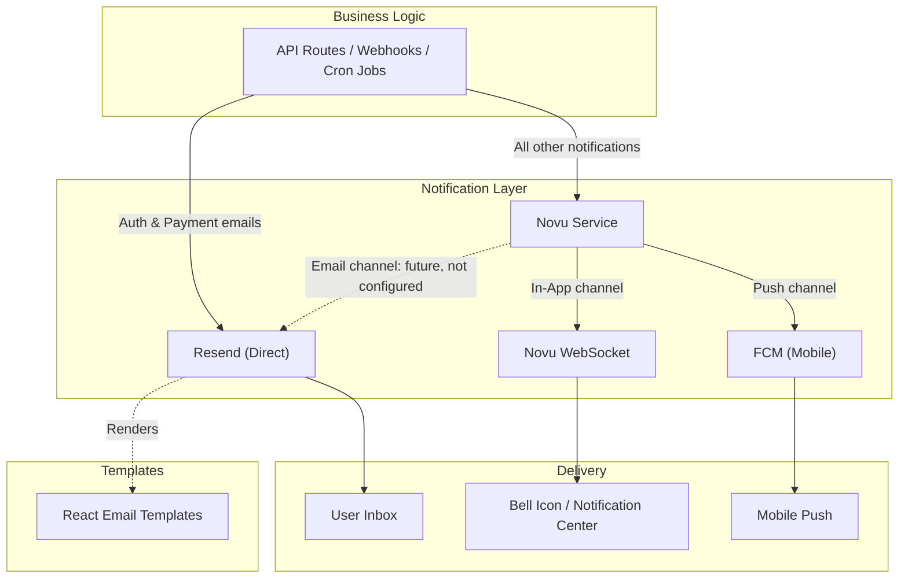

# Notification System

The notification system uses a dual-layer architecture: **Resend** for direct transactional email delivery and **Novu** for multi-channel notification orchestration (in-app, email, push). Neither layer blocks the main transaction flow — a notification call never causes the calling operation to roll back. As of #1654 both layers are outbox-first: a transactional email is a `PENDING` `FailedEmail` row before Resend is called and a Novu trigger is a `NotificationOutbox` row before Novu is called, each written where the business change commits (inside its transaction when the caller has one), attempted once inline under a time budget, and finished by a relay on the Netlify ticker when that attempt times out or fails transiently. A timeout is not a failure and never pages; the row waits and the idempotency key (Resend) or `transactionId` (Novu) makes a late duplicate harmless. As of #1298, a missing or invalid `RESEND_API_KEY` leaves the row `PENDING` for the relay rather than dropping the message. All sixteen Novu workflow families are in-app only, so Novu never sends an email.


```mermaid
graph TD
    subgraph "Business Logic"
        A[API Routes / Webhooks / Cron Jobs]
    end

    subgraph "Notification Layer"
        A -->|Auth & Payment emails| B["Resend (Direct)"]
        A -->|All other notifications| C["Novu Service"]
        C -.->|Email channel: future, not configured| B
        C -->|In-App channel| D[Novu WebSocket]
        C -->|Push channel| E["FCM (Mobile)"]
    end

    subgraph "Delivery"
        B --> F[User Inbox]
        D --> G[Bell Icon / Notification Center]
        E --> H[Mobile Push]
    end

    subgraph "Templates"
        B -.->|Renders| I[React Email Templates]
    end
```

---

## End-to-End System Architecture (Old vs. New Double ASCII Diagram)

### 1.1 Pre-Hardening Architecture (With All 10 Audited Production Flaws Highlighted)

```text
+===================================================================================================+
|                        PRODUCERS (API Routes, Webhooks, Server Actions, Jobs)                     |
+===================================================================================================+
   |                                                |
   | (~10% Money/Booking paths pass `tx`)           | (~90% Lifecycle/Booking/Org paths omit `tx`)
   v                                                v
+------------------------------------------------+ +------------------------------------------------+
| INSIDE `Serializable` $transaction (PG_POOL=1) | | OUTSIDE $transaction (Post-Commit Dual Write)  |
|  [FLAW #1] Runs 2x React Email SSR (`render` + | |  [FLAW #2] Crash/freeze after DB commit loses  |
|  `plainText`) + sequential User/Suppression    | |  the email & Novu bell completely.             |
|  queries while holding Serializable locks!     | +------------------------------------------------+
+------------------------------------------------+                          |
   |                                                                        |
   +-----------------------------------+------------------------------------+
                                       |
         +-----------------------------+-----------------------------+
         |                                                           |
         v (Email Path: `lib/email/deliver.ts`)                      v (In-App Bell Path: `lib/novu/outbox.ts`)
+--------------------------------------------------+       +--------------------------------------------------+
| Postgres: `FailedEmail` & `FailedEmailBatch`     |       | Postgres: `NotificationOutbox`                   |
| - Inserts `status: PENDING, nextRetryAt: NOW()`  |       | - Upserts `status: PENDING, nextRetryAt: NOW()`  |
| - [FLAW #3] NO inline lease grace window!        |       | - [FLAW #3] NO inline lease grace window!        |
| - [FLAW #4] `headers` (`List-Unsubscribe`) NOT   |       | - [FLAW #6] `deriveTransactionId` misses 5 keys  |
|   rebuilt on retry -> stripped on relay replay!  |       |   (`invoiceNumber`, `exportId`, `providerId`,    |
| - [FLAW #5] Never pruned! Full HTML/text bodies  |       |   `feedbackId`, `streamCallId`) & omits fallback |
|   for every `SENT` email accumulate forever!     |       |   to `row.id` when `transactionId` is null!      |
+--------------------------------------------------+       +--------------------------------------------------+
         |                           |                               |                           |
         | Inline Fast-Path (3-5s)   | Relay (Every 15m, limit=20)   | Inline Fast-Path (5s)     | Relay (Every 5m, limit=20)
         | [RACE CONDITION!]         | [6s timeout in cron-tick!]    | [RACE CONDITION!]         | [6s timeout in cron-tick!]
         +-------------+-------------+                               +-------------+-------------+
                       |                                                           |
                       v                                                           v
+--------------------------------------------------+       +--------------------------------------------------+
| Resend API (`POST /emails`, `/emails/batch`)     |       | Novu Cloud API (16 Multiplexed Workflow Families)|
| - [FLAW #7] `idempotencyKeyFor()` hashes         |       | - [FLAW #8] `syncSubscriber` (on dashboard mount)|
|   `to + subject + html` instead of `row.id`!     |       |   & `updateSubscriberPreferences` overwrite      |
|   Resend caches keys 24h -> SILENTLY DROPS any   |       |   disjoint keys in `subscriber.data`, wiping out |
|   2nd identical email sent within 24 hours!      |       |   muted preferences on every dashboard load!     |
| - [FLAW #9] Exhausting 5 transient attempts ->   |       | - [FLAW #10] All 18 `ORG_*` workflows omit       |
|   `DEAD_LETTER` emits ZERO Sentry error alerts!  |       |   `NotificationScope` (`organizationId`) -> org  |
|   `NovuError.body` echoes PII to Sentry!         |       |   alerts NEVER show under Org tab in `<Inbox />`!|
+--------------------------------------------------+       +--------------------------------------------------+

+===================================================================================================+
|                     CRON & MAINTENANCE INFRASTRUCTURE (Post-`c4e85c003` State)                    |
+===================================================================================================+
  Netlify `cron-tick.mts` (*/5 * * * *)                      GitHub Actions (42 Scheduled Workflows)
  - Uses `minute % every < 5` (ZERO stagger):                - `c4e85c003` deleted 17 GHA backstop workflows
    * `:00` & `:30` -> fires ALL 18/19 targets at once!        for ticker jobs without raising ticker timeouts!
    * `:15` & `:45` -> fires 16/17 targets at once!          - `cron-heartbeat.yml` runs 1x/day at 04:40 UTC:
    * `:05, :25, :35, :55` -> fires ZERO targets (33% idle!)   ONLY writer of `redis.set("cron:heartbeat:last")`!
  - `keep-warm.mts` only warms 3 instances -> 15+ cold       - `/api/health` checks `cron:heartbeat:last` with
    starts stampede PgBouncer & hit 6s abort ceiling!          6h threshold -> `cron.stale: true` 18h/day!
  - Warm container bug: 1 failed tick loads `@sentry/node`   - `withCronLock` in Postgres (`SystemJobExecution`)
    and patches global `fetch` for all future warm ticks!      has NO partial unique index on `(jobName) WHERE
                                                               status = 'RUNNING'` -> P0 TOCTOU lock race!
```

### 1.2 Target Production Architecture (Improvised, Decoupled & Hardened)

```text
+===================================================================================================+
|                     PRODUCERS (API Routes, Webhooks, Server Actions, Jobs)                        |
+===================================================================================================+
   |
   | 1. Pre-render React Email OUTSIDE Serializable $transaction (single-pass `render` + `toPlainText(html)`)
   | 2. Evaluate all User & Org NotificationPreferences in Postgres/App BEFORE staging (Single Source of Truth)
   | 3. Inside `$transaction(tx)`: insert lightweight Outbox row with:
   |    - `status: "PENDING"`, `nextRetryAt: NOW() + 60s` (inline lease grace window — prevents relay race!)
   |    - Reconstructed RFC 8058 `List-Unsubscribe` + `List-Unsubscribe-Post` headers on relay retry
   |    - `transactionId: derivedKey ?? row.id` (guaranteed idempotency key for every single/org workflow)
   |    - `NotificationScope` (`scope: "org", organizationId`) on all 18 `ORG_*` workflows
   v
+---------------------------------------------------------------------------------------------------+
|                        CONSOLIDATED OUTBOX LAYER (Postgres + Partial Indexes)                     |
|  1. `FailedEmail` & `FailedEmailBatch` (Resend Email Outbox)                                      |
|  2. `NotificationOutbox` (Novu In-App Feed Outbox)                                                |
|  3. `OutboundWebhookDelivery` (Enterprise Customer Webhooks)                                      |
|  * Bounded concurrency (`CONCURRENCY = 5`) + multi-recipient `resend.batch.send` (up to 100/call) |
|  * Outbox-row-scoped `Idempotency-Key: <EMAIL_TYPE>/<row.id>` (never drops legitimate repeats)    |
|  * Automated retention pruning in `prune-system-job-executions`:                                  |
|    - Null `htmlBody`/`textBody` on `SENT` emails after 7d; delete terminal outbox rows after 30d  |
+---------------------------------------------------------------------------------------------------+
   |
   v
+===================================================================================================+
|                  STAGGERED CRON & LOCKING ENGINE (Netlify Ticker + GitHub Actions)                |
+===================================================================================================+
  Netlify `cron-tick.mts` (Every 5m, Phase-Staggered):
  - Slot `:00, :15, :30, :45` (6 targets) | Slot `:05, :20, :35, :50` (6 targets) | Slot `:10, :25, :40, :55` (6 targets)
  - Max 6–7 concurrent targets per tick (matches warm pool + PgBouncer budget); 0% idle ticks!
  - Per-target timeout raised from 6s -> 15s; `tracePropagationTargets: []` prevents warm container fetch pollution.
  - Atomic Postgres lock: `CREATE UNIQUE INDEX "SystemJobExecution_running_jobName_key" ON "SystemJobExecution"("jobName") WHERE status = 'RUNNING'`
  - `/api/health` queries `pickFresherTimestamp(redisHeartbeat, SystemJobExecution.startedAt)` -> 0% false-stale rate!

+===================================================================================================+
|                CONSOLIDATED SENTRY v10 OBSERVABILITY (Errors + Traces + Logs + Metrics)           |
+===================================================================================================+
  - `tracesSampler`: 0% `/api/health` & `/_next`, 2% `/api/cleanup/*`, 10% default, 50% `/api/webhooks/*` & `/api/payments/*`
  - `beforeSend`, `beforeSendTransaction`, `beforeSendSpan`, `beforeSendLog`: unified `sentry-scrubber.ts`
    (strips `NovuError.body`, regex-redacts emails/tokens in messages/breadcrumbs, strips `culture.timezone`)
  - `Sentry.startSpan({ op: "queue.process" })` + `Sentry.metrics.count/gauge` on email & Novu drains
  - P0 Alerting: `level: "error"` (`expected: false`) whenever `FailedEmail` or `NotificationOutbox` hits `DEAD_LETTER`
```

### 1.3 Message Broker & Queueing Trade-Off Matrix

| Broker / Pattern                                           | Atomic with Postgres `$transaction`?                                                                     | Serverless (Netlify) Compatibility                                                               | Operational & Cost Overhead                                            | Architectural Verdict                                                                                                                                        |
| :--------------------------------------------------------- | :------------------------------------------------------------------------------------------------------- | :----------------------------------------------------------------------------------------------- | :--------------------------------------------------------------------- | :----------------------------------------------------------------------------------------------------------------------------------------------------------- |
| **Apache Kafka** (Confluent / Upstash)                     | **No** (Publishing to Kafka inside a DB txn is a dual-write; still requires a DB outbox + CDC/Debezium). | **Poor** (Requires long-lived consumer groups & partition rebalancing).                          | **Very High** (\$150–\$500+/mo + massive ops complexity).              | **Rejected.** 1,000x over-engineered for `<100` events/sec marketplace workloads.                                                                            |
| **RabbitMQ / BullMQ**                                      | **No** (Enqueuing to Redis/AMQP inside a Postgres txn is a dual-write).                                  | **Poor** (Requires persistent TCP connections and a separate 24/7 worker VM/container tier).     | **High** (Requires hosting a second compute fleet on Railway/Fly/ECS). | **Rejected.** Violates serverless simplicity for zero benefit.                                                                                               |
| **AWS SQS**                                                | **No** (HTTP `SendMessage` inside a DB txn is a dual-write).                                             | **Mediocre** (Netlify has no native SQS Lambda Event Source Mapping trigger).                    | **Moderate** (Cross-cloud IAM credentials + still needs a poller).     | **Rejected.** Unnecessary multi-cloud sprawl.                                                                                                                |
| **Upstash QStash**                                         | **No on its own** (Still needs DB outbox to avoid dual-write).                                           | **Excellent** (HTTP push to Next.js routes with built-in retries, DLQ, and `FlowControl`).       | **Low** (~$1 per 100k messages; Upstash already in stack).             | **Optional Stage-2 Enhancement** only if customer outbound webhooks (`OutboundWebhookDelivery`) scale to >10k/day and need per-endpoint HTTP push isolation. |
| **Postgres Transactional Outbox + Phase-Staggered Ticker** | **100% Atomic** (`stage()` writes inside the exact same Postgres `tx`).                                  | **Native** (Zero external broker; inline fast-path delivers in ~150ms; relay sweeps stragglers). | **Zero Incremental Cost** (\$0/mo).                                    | **Active Production Architecture.** Staggered `cron-tick.mts` + atomic `withCronLock` + bounded concurrency handles 100% of platform needs.                  |

---

## Core Principles

- **Non-fatal, and durable** -- a notification failure never rolls back the persisted business work, because the only thing inside the transaction is the outbox row; the send happens after the commit, under a budget, and the relay finishes it. Every call site is awaited (an un-awaited call is dropped when the Netlify instance freezes after the response), so "non-fatal" does not mean "fire-and-forget". `app/api/contact/route.ts` answers success once the inquiry row exists and keeps its 502 only for the case where even the row could not be written
- **A missing key is captured, not dropped** -- a missing Novu secret key for the current environment (`NOVU_DEVELOPMENT_KEY` or `NOVU_PRODUCTION_KEY`) leaves the `NotificationOutbox` row `PENDING` for the drain to deliver once the key exists. On the Resend side a missing `RESEND_API_KEY` (`EmailNotConfiguredError`) leaves the `FailedEmail` row `PENDING` and pages once at level "error"; a terminal cause (dead key, unverified domain, `validation_error`) dead-letters the row on the spot. The relays skip every row while the key is absent, replay it once the key exists, and move a transient failure to `RETRY` on the shared backoff ladder
- **Singleton clients** -- both Resend and Novu use lazy-initialized singleton instances
- **Subscriber = User** -- Novu `subscriberId` is the Prisma `User.id`
- **67 notification events in 16 Novu workflow families** -- each event has a typed payload; the family is the Novu workflow and carries the event as `payload.event`; every family is in-app only, so Novu never carries an email
- **11 Resend senders, 10 React Email templates** -- `lib/email/index.ts` exports eleven sender functions; the contact-inquiry sender builds inline HTML instead of a template, so there are 10 React Email templates behind 11 senders. Every message is rendered server-side by `renderEmail()` (`lib/email/render.ts`, `react-email`'s `render()`) into both an HTML and a plain-text part
- **User preferences** -- channel toggles (in-app, email, push), category toggles (7 categories), quiet hours

## Source Code Map

### Backend Services

| File                                | Purpose                                                                                                                                                                                                           |
| ----------------------------------- | ----------------------------------------------------------------------------------------------------------------------------------------------------------------------------------------------------------------- |
| `lib/novu/client.ts`                | Singleton Novu client, `isNovuConfigured()` guard                                                                                                                                                                 |
| `lib/novu/service.ts`               | 20+ trigger functions: `notifyAppointmentBooked`, `notifyPaymentSuccess`, etc.                                                                                                                                    |
| `lib/novu/workflows.ts`             | 69 event id constants and their typed payloads; `lib/novu/templates/` maps them onto 16 workflow families                                                                                                         |
| `lib/novu/subscriber.ts`            | `syncSubscriber`, `updateSubscriberPreferences`, `deleteSubscriber`                                                                                                                                               |
| `lib/email/index.ts`                | Eleven Resend sender functions (welcome, password reset, verification, account linked, payment link/success/failed, org invitation, waitlist confirm/welcome, contact inquiry); `@/lib/email` still resolves here |
| `lib/email/config.ts`               | `SENDERS` getters and `supportEmail()`/`contactInboxAddress()`/`billingEmail()`/`companyPostalAddress()`, all read from env at call time                                                                          |
| `lib/email/deliver.ts`              | `deliver()`, the single send core: content-hash idempotency key, `EmailNotConfiguredError`, `recordFailedEmail`                                                                                                   |
| `lib/email/preferences.ts`          | `loadEmailRecipients()` and `isEmailAllowed()`, the send-time preference gate; `EMAIL_CATEGORY_COLUMN`, the one category → column map (#1653)                                                                     |
| `lib/email/unsubscribe.ts`          | Timeless HMAC unsubscribe tokens, `buildEmailUnsubscribeUrl()` and the RFC 8058 `listUnsubscribeHeaders()` (#1653)                                                                                                |
| `lib/email/send-to-recipients.ts`   | `sendToRecipients()` fan-out over gated recipients, plus `stageToRecipients()`/`attemptStaged()` for a transaction owner (#1653)                                                                                  |
| `lib/email/idempotency.ts`          | Derives the `<EMAIL_TYPE>/<sha256(to\nsubject\nhtml)[:48]>` idempotency key shared by a sender and the retry worker                                                                                               |
| `lib/email/classify.ts`             | Classifies a Resend failure as terminal (dead key, unverified domain, missing key) or transient                                                                                                                   |
| `lib/email/render.ts`               | `renderEmail()` — renders a React Email element to `{ html, text }`                                                                                                                                               |
| `jobs/email/retry-failed-emails.ts` | Retry worker: dead-letters an expired verification/reset row, replays under the same idempotency key otherwise                                                                                                    |

### Frontend

| File                             | Purpose                                                       |
| -------------------------------- | ------------------------------------------------------------- |
| `providers/NovuProvider.tsx`     | Client-side Novu SDK wrapper, auth-gated                      |
| `hooks/useNovuSubscriberSync.ts` | Auto-syncs user to Novu on dashboard mount (30-min staleTime) |

### API Routes

| Route                            | Method | Purpose                                                                                        |
| -------------------------------- | ------ | ---------------------------------------------------------------------------------------------- |
| `/api/novu/subscriber`           | POST   | Syncs authenticated user to Novu as subscriber                                                 |
| `/api/novu/preferences`          | GET    | Returns user's notification preferences (with defaults)                                        |
| `/api/novu/preferences`          | PUT    | Updates notification preferences, syncs channel prefs to Novu                                  |
| `/api/notifications/unsubscribe` | GET    | Verifies the footer link's token and redirects to `/email/unsubscribe`; writes nothing (#1653) |
| `/api/notifications/unsubscribe` | POST   | RFC 8058 one-click: sets `emailEnabled = false` and mirrors the flags to Novu (#1653)          |

### Email Templates (`emails/`)

The table below lists the ten React Email templates plus the one sender that builds inline HTML instead of a template; `components/EmailLogo.tsx` and `components/EmailFooter.tsx` are shared building blocks each template composes rather than templates of their own.

| Template                               | Category      | Sent Via                                                                                                                                                                              |
| -------------------------------------- | ------------- | ------------------------------------------------------------------------------------------------------------------------------------------------------------------------------------- |
| `components/EmailLogo.tsx`             | Shared        | Absolute logo URL via `getAppUrl()`, composed into every template                                                                                                                     |
| `components/EmailFooter.tsx`           | Shared        | Copyright year, Privacy/Terms links, optional postal line, optional unsubscribe link, optional support line, optional preferences link and required-notice line (#1653)               |
| `components/EmailLayout.tsx`           | Shared        | The frame new lifecycle templates render inside: `Html > Head > Preview > Body > Container > EmailLogo > Section > EmailFooter`, taking `unsubscribeUrl` and `requiredNotice` (#1653) |
| `components/styles.ts`                 | Shared        | The inline style objects (`heading`, `paragraph`, `button`, `divider`, `link`, ...) new templates import instead of re-declaring (#1653)                                              |
| `auth/WelcomeEmail.tsx`                | Auth          | `lib/email/index.ts` → `sendWelcomeEmail`                                                                                                                                             |
| `auth/PasswordResetEmail.tsx`          | Auth          | `lib/email/index.ts` → `sendPasswordResetEmail`                                                                                                                                       |
| `auth/VerificationEmail.tsx`           | Auth          | `lib/email/index.ts` → `sendVerificationEmail`                                                                                                                                        |
| `auth/AccountLinkedEmail.tsx`          | Auth          | `lib/email/index.ts` → `sendAccountLinkedEmail`                                                                                                                                       |
| `payments/PaymentLinkEmail.tsx`        | Payments      | `lib/email/index.ts` → `sendPaymentLinkEmail`                                                                                                                                         |
| `payments/PaymentSuccessEmail.tsx`     | Payments      | `lib/email/index.ts` → `sendPaymentSuccessEmail`                                                                                                                                      |
| `payments/PaymentFailedEmail.tsx`      | Payments      | `lib/email/index.ts` → `sendPaymentFailedEmail`                                                                                                                                       |
| `organizations/OrgInvitationEmail.tsx` | Organizations | `lib/email/index.ts` → `sendOrgInvitationEmail` (no caller today)                                                                                                                     |
| `waitlist/WaitlistConfirmEmail.tsx`    | Newsletter    | `lib/email/index.ts` → `sendWaitlistConfirmEmail`                                                                                                                                     |
| `waitlist/WaitlistWelcomeEmail.tsx`    | Newsletter    | `lib/email/index.ts` → `sendWaitlistWelcomeEmail`                                                                                                                                     |
| Inline HTML (no `.tsx` file)           | Contact       | `lib/email/index.ts` → `sendContactInquiryEmail`, builds HTML directly instead of rendering a template                                                                                |

### Schemas

| File                                               | Purpose                                                                                                                                                 |
| -------------------------------------------------- | ------------------------------------------------------------------------------------------------------------------------------------------------------- |
| `schemas/user.ts`                                  | `NotificationPreferenceSchema`, `NotificationPreferenceUpdateSchema`                                                                                    |
| [07-schema-reference.md](./07-schema-reference.md) | The Prisma tables behind outbox-first delivery: `FailedEmail`'s new columns, `FailedEmailBatch`, `EmailEvent`, `EmailSuppression`, `NotificationOutbox` |

## Source of truth for Novu templates

`lib/novu/templates/` is the source of truth for every Novu workflow's in-app copy, redirect and opt-out category; `scripts/novu/sync-workflows.ts` writes it to the Novu environment as one workflow per family. Run `npm run novu:sync -- --dry-run` to preview a change, `npm run novu:sync` to apply it, and `npm run novu:check` to check for drift (the CI-side guard). See [ADR 30](../enterprise/70-design-decisions/30-novu-templates-as-code-and-workflow-families.md) for why the templates moved into the repository and why they are grouped into families.

## Quick Navigation

| I want to...                                                        | Go to                                                                                                                      |
| ------------------------------------------------------------------- | -------------------------------------------------------------------------------------------------------------------------- |
| Understand the dual-layer architecture                              | [01-architecture.md](./01-architecture.md)                                                                                 |
| See all 69 events, the 16 families and API endpoints                | [02-workflows-and-api.md](./02-workflows-and-api.md)                                                                       |
| Read the #1298 outage diagnosis and the send-core fix               | [06-engineering-log-2026-09-14-email-resend-outage.md](./06-engineering-log-2026-09-14-email-resend-outage.md)             |
| Understand the outbox and Resend-event tables                       | [07-schema-reference.md](./07-schema-reference.md)                                                                         |
| Gate a lifecycle email on preferences, or add one-click unsubscribe | [01-architecture.md § Email gating and one-click unsubscribe](./01-architecture.md#email-gating-and-one-click-unsubscribe) |
| Read how outbox-first delivery and the email core were built        | [08-engineering-log-2026-09-15-outbox-first.md](./08-engineering-log-2026-09-15-outbox-first.md)                           |
| See the whole email map, the pre-launch guard and ops routing       | [../email/README.md](../email/README.md)                                                                                   |
| Understand the payment system                                       | [../payments/architecture.md](../payments/architecture.md)                                                                 |
| Check the database schema                                           | [../../prisma/schema.prisma](../../prisma/schema.prisma)                                                                   |
