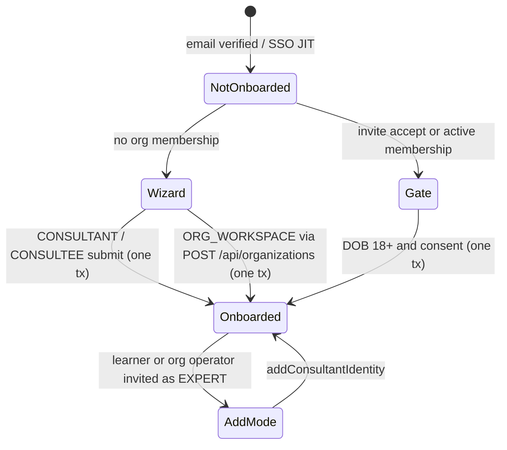

# Onboarding System — Complete Reference

> **Audience:** Coding agents (Claude, Codex, Copilot), future interns, and any developer touching the onboarding flow.
>
> **Last updated:** 2026-10-09

---

## 0. Profile model roster (Arch-4)

The platform wires a user to one or more profile models. Each row has
a matching FK on `User` (all nullable, all `@unique`). The wizard writes
`ConsultantProfile` / `ConsulteeProfile`; `OrgWorkspaceProfile` is written by
the org-create transaction; operator profiles come from `createOperator()`.

| Profile               | Purpose                                                                                                                             | FK on `User`            | Created by                                                                                                                                                  |
| --------------------- | ----------------------------------------------------------------------------------------------------------------------------------- | ----------------------- | ----------------------------------------------------------------------------------------------------------------------------------------------------------- |
| `ConsultantProfile`   | Platform expert — domains, availability, earnings.                                                                                  | `consultantProfileId`   | `/form/onboarding` (CONSULTANT), or the wizard's add mode for an onboarded learner / org operator.                                                          |
| `ConsulteeProfile`    | Platform learner — goals, career stage, aboutMe.                                                                                    | `consulteeProfileId`    | `/form/onboarding` (CONSULTEE), or **lazily** via `ensureConsulteeProfile(db, userId)` from checkout, slot request-for-approval, and LEARNER invite accept. |
| `StaffProfile`        | Platform operator (support / moderation / ops).                                                                                     | `staffProfileId`        | `createOperator()` (operators arrive already onboarded).                                                                                                    |
| `AdminProfile`        | Platform admin.                                                                                                                     | `adminProfileId`        | `createOperator()`.                                                                                                                                         |
| `OrgWorkspaceProfile` | One row per user who operates an org. Mirrors `StaffProfile` / `AdminProfile` structure. Backs `/dashboard/org-workspace/:id/home`. | `orgWorkspaceProfileId` | `POST /api/organizations` (inside the create transaction) and by the `prisma/scripts/backfill-org-workspace-profiles.ts` one-shot for existing OWNERs.      |

### Lazy ConsulteeProfile (Arch-4)

The BetterAuth signup hook in `lib/auth.ts`
(`databaseHooks.user.create.after`) **no longer force-creates a
`ConsulteeProfile`**. Instead, the helper
`lib/profiles/ensure-consultee-profile.ts::ensureConsulteeProfile(db,
userId)` upserts one on first consumer action. It is invoked from:

- `lib/payments/operations/checkout.ts` (checkout path +
  `revalidateInsideLock`)
- `app/api/scheduling/request-for-approval/route.ts`
- `app/api/organizations/invitations/accept/route.ts` (LEARNER branch, for an already onboarded user)
- The existing `/form/onboarding` path continues to work because
  `utils/onboarding-server.ts::upsertConsulteeProfile` is
  idempotent — it upserts regardless of whether one already exists.

This means a fresh signup who never takes a consumer action will have
`consulteeProfileId = null` until one of the above triggers fires. UI
code should treat the FK as optional and use
`resolvePersonalDashboardHref` (`lib/labels/personal-dashboard.ts`) to
decide the "Personal Dashboard" target.

### OrgWorkspaceProfile on org creation

`POST /api/organizations` upserts an `OrgWorkspaceProfile` for the caller
inside the same transaction that creates the `Organization`,
`BillingAccount`, and OWNER `Membership` (for a first-time owner the same
transaction also completes onboarding, §2), and returns the
`orgWorkspaceProfileId` on the response body so the client can
immediately navigate to `/dashboard/org-workspace/:id/home`. See
`docs/enterprise/12-dashboard-pages.md` for the operator home route.

### EXPERT invite accept stays strict (no placeholder)

When a user accepts an EXPERT invitation without a pre-existing
`ConsultantProfile`, `app/api/organizations/invitations/accept/route.ts`
rejects with `NOT_A_CONSULTANT` (400) instead of provisioning anything —
an expert identity carries domain/rates/verification/payout prerequisites
that no invite click can substitute for (who-is-acting rule, #819). Accept
only runs for an onboarded user (a new one passes the gate first, §2), so
the invite page links straight into the wizard's add mode and the emailed
link accepts afterwards.

Marketplace visibility in `/explore/experts` still gates on platform
verification, not on membership existence.

---

## Table of Contents

1. [Architecture Overview](#1-architecture-overview)
2. [Step-by-Step Flow per Role](#2-step-by-step-flow-per-role)
3. [Component Reference](#3-component-reference)
4. [Zod Schema Hierarchy](#4-zod-schema-hierarchy)
5. [Type System & Data Shapes](#5-type-system--data-shapes)
6. [Transform Pipeline](#6-transform-pipeline)
7. [Server Processing](#7-server-processing)
8. [Database Models](#8-database-models)
9. [Enums Reference](#9-enums-reference)
10. [Validation Rules](#10-validation-rules)
11. [Known Design Decisions](#11-known-design-decisions)
12. [File Map](#12-file-map)
13. [Funnel Query (interim)](#13-funnel-query-interim)
14. [Deprecated & Superseded Approaches](#deprecated--superseded-approaches)

---

## 1. Architecture Overview

The onboarding system is a **multi-step wizard** that collects role-specific data from new users, validates it with Zod schemas, transforms it into Prisma-shaped payloads, and persists it atomically in a single database transaction.

```
┌─────────────────────────────────────────────────────────────────────┐
│                     ARCHITECTURE LAYERS                             │
├─────────────────────────────────────────────────────────────────────┤
│                                                                     │
│  LAYER 1 — UI Components (React, react-hook-form)                  │
│    OnboardingWizard.tsx orchestrates steps; each is a component     │
│    Progressive state: formData accumulates across steps             │
│                                                                     │
│  LAYER 2 — Form Schemas (Zod, per-step validation)                 │
│    PersonalInfoAndRoleFormSchema, ConsultantProfileFormSchema, etc. │
│    OnboardingFormDataSchema = discriminatedUnion("role", [...])     │
│                                                                     │
│  LAYER 3 — Transform (form shape → Prisma shape)                   │
│    transformOnboardingFormToServerData()                            │
│    Converts { domain: { id, name } } → { domain: { connect: {} }} │
│                                                                     │
│  LAYER 4 — Server Validation (Zod, strict)                         │
│    OnboardingDataSchema validates the Prisma-shaped payload        │
│                                                                     │
│  LAYER 5 — Server Processing (Prisma transaction)                  │
│    processOnboardingData() → upsertProfileByRole()                 │
│    + persistProfessionalBackground() + verification                │
│                                                                     │
└─────────────────────────────────────────────────────────────────────┘
```

### Key Patterns

- **Progressive state accumulation**: Each step merges its data into a single `formData` object in the parent (`OnboardingWizard.tsx`). Steps receive `initialData` for back-navigation.
- **Discriminated union on `role`**: Both the form schema (`OnboardingFormDataSchema`) and the server payload schema (`OnboardingDataSchema`) use `z.discriminatedUnion("role", [...])` to ensure role-specific fields aren't stripped.
- **Flat form ↔ nested server**: Forms use flat objects (`domain: { id, name }`). Server expects Prisma connect syntax (`domain: { connect: { id } }`). The transform layer converts between them.
- **Claim first, then write**: the terminal `onboardingCompleted` CAS is the first statement of every completion transaction, so a racing submit waits on the user-row lock and then loses cleanly instead of rewriting profile rows.
- **Replace semantics for arrays**: Availability slots, work experiences, education, certifications, and achievements are deleted-then-recreated on each submission (not merged).

---

## 2. Step-by-Step Flow per Role

Every completion path ends in the same transition: `claimOnboardingCompletion`
(`utils/onboarding-completion.ts`) runs `updateMany WHERE id AND
onboardingCompleted != true`, stamps `termsAcceptedAt` / `privacyAcceptedAt`
with the server clock, and `recordOnboardingConsent` writes one
`ConsentArtifact` per sign-up purpose (plus `MARKETING_COMMS` when ticked) at
`TERMS_VERSION`. The browser only ever sends `termsAccepted: true` and
`privacyAccepted: true`.



The guards share one predicate, `isFullyOnboarded` (`utils/onboarding-shared.ts`):
`onboardingCompleted` plus the consultant profile for CONSULTANT and the staff
profile for STAFF. Consultee and org-workspace profiles are lazy, so an
onboarded CONSULTEE or invited operator never loops back into the wizard.

### Consultant (5 steps)

| Step | Component                                | What It Collects                                                                                                                                                                                                                                                                                     |
| ---- | ---------------------------------------- | ---------------------------------------------------------------------------------------------------------------------------------------------------------------------------------------------------------------------------------------------------------------------------------------------------- |
| 0    | `PersonalInfoAndRoleForm`                | Name, email, phone, DOB (18+), role=CONSULTANT, gender, city, country, bio, linkedinUrl                                                                                                                                                                                                              |
| 1    | `ConsultantProfessionalStep`             | **Tab "Expertise":** field of expertise (`domain`), specialties (`subDomains`), skills (`tags`), description, headline, experience. **Tab "Experience & credentials (optional)":** work experiences, education, certifications, achievements, with a "Skip for now" exit. Field-level autosave (2 s) |
| 2    | `ConsultantPreferredScheduleForm`        | The one place the schedule type is chosen (Weekly / Custom), then weekly windows (day + UTC minutes) or custom windows (datetime range)                                                                                                                                                              |
| 3    | `ConsultantAgreementAndVerificationStep` | LinkedIn URL (optional), verification documents (optional, up to `MAX_VERIFICATION_DOCUMENTS` = 5), notes, terms + privacy, optional marketing. Field-level autosave (2 s)                                                                                                                           |
| 4    | `ConsultantReviewForm`                   | Read-only review of all data → Submit                                                                                                                                                                                                                                                                |

### Consultee (2 steps)

| Step | Component                 | What It Collects                                                                                      |
| ---- | ------------------------- | ----------------------------------------------------------------------------------------------------- |
| 0    | `PersonalInfoAndRoleForm` | Name, email, phone, DOB (18+), role=CONSULTEE, gender, city, country, bio, linkedinUrl                |
| 1    | `ConsulteeAgreementForm`  | Terms + privacy (+ optional marketing) → Submit; the button is disabled while the submit is in flight |

Profile enrichment (career stage, aboutMe, goals) happens later in the
consultee dashboard Settings tab and through the lazy `ensureConsulteeProfile()`
path (§0); every consultee profile field is optional on the server.

### Organisation owner (ORG_WORKSPACE)

| Step | Component                                                                          | What It Collects                                             |
| ---- | ---------------------------------------------------------------------------------- | ------------------------------------------------------------ |
| 0    | `PersonalInfoAndRoleForm`                                                          | Name, phone, DOB (18+), role=ORG_WORKSPACE                   |
| 1    | `ConsulteeAgreementForm`                                                           | Terms + privacy (+ optional marketing)                       |
| 2    | `CreateOrganizationWizard` ("Organisation setup", full-bleed, its own 5–6 screens) | Org info, billing / revenue split, branding, invites, review |

Nothing is written server-side until launch. The Review step sends
`POST /api/organizations` with an `onboarding` block (`OrgOnboardingSchema`:
name, phone, timezone, DOB, consent). The route admits a not-yet-onboarded
CONSULTEE-default account only with that block, and in **one** transaction
claims onboarding (role `ORG_WORKSPACE`, DOB, server-stamped consent), creates
the organization, billing account and OWNER membership, and links the
`OrgWorkspaceProfile`. A lost claim (second tab) is `409 ALREADY_ONBOARDED`
and creates no organization. Backing out of the org wizard simply returns to
step 0.

### Invitees and SSO members (the gate)

`/onboarding/gate` (`app/onboarding/gate/page.tsx`,
`components/onboarding/OnboardingGateForm.tsx`,
`actions/onboarding-gate.action.ts`) collects a DOB (18+, `DateOfBirthSchema`)
and consent, validated with `OnboardingGateSchema` on the server, and completes
onboarding in one transaction. It is open only to a user with an ACTIVE
membership (SSO JIT) or a pending, unexpired invitation to their verified
email; anyone else is sent to the wizard.

- **Invite accept** never onboards: a not-yet-onboarded caller gets
  `403 ONBOARDING_REQUIRED` with `gateHref`, for every role, and the invite
  page redirects there and back.
- **EXPERT invite, brand-new user:** the gate onboards them (role stays the
  CONSULTEE default), accept then answers `NOT_A_CONSULTANT`, and the invite
  page links to `?add=CONSULTANT`, which the server page admits because
  `canAddConsultantIdentity` now holds.
- **SSO JIT:** `requireOnboarded` and the wizard layout send a
  not-yet-onboarded user with an ACTIVE membership to the gate, so JIT members
  never run the B2C wizard or create a stray organization.

### Resumable drafts

One `OnboardingDraft` row per user, saved with CAS on `version`
(`saveOnboardingDraftAction`): `updateMany WHERE userId AND version = base`,
then `version + 1`. A stale base returns `DRAFT_CONFLICT` and the tab stops
saving with the prompt "newer edits from another device — reload, or keep this
tab's answers". Autosave arms only after a successful load (one retry), so a
failed load never overwrites the stored draft, and the action refuses writes
once onboarding is complete (except in add mode). Step transitions save after
800 ms; the professional and verification steps also save field edits after
2 s. Drafts idle for 90 days are deleted by the `expire-onboarding-drafts`
registry job (weekly).

---

## 3. Component Reference

All components live under `app/form/onboarding/`.

### 3.1 Orchestrator: `page.tsx` + `OnboardingWizard.tsx`

`page.tsx` is a server component: the layout's `requireNotOnboarded` has run,
and the page decides add mode from the live session (`canAddConsultantIdentity`)
plus `?add=CONSULTANT`, never from the URL alone. It renders the client
`OnboardingWizard`.

```
State:
  step: number (0-4)
  formData: Partial<OnboardingFormData>  — cumulative across steps

Draft layer (resumable wizard, #onboarding-ux):
  On mount   → loadOnboardingDraftAction() hydrates step + formData once and
               returns the CAS version; autosave arms only on success
  Per step   → debounced (800ms) autosave through a serialized save queue;
               each save reads the version the previous one returned
  Long steps → field edits (onDraftChange) saved after 2s
  Conflict   → DRAFT_CONFLICT stops saving and shows the reload prompt
  Lifecycle  → every delete of the draft row (successful submission, Start
               over, org-wizard launch) first DRAINS the queue via
               quiesceDraftSaves(), then clears — an in-flight upsert can
               never recreate a deleted row

Handlers:
  handleNext(stepData)  → merge data, advance step
  handleBack()          → decrement step
  handleGoToStep(n)     → jump back to a completed step (stepper button,
                          review-step pencil)
  handleSubmit(data)    → one in-flight submit (submittingRef); validate,
                           transform, submit to server action; a refusal is
                           routed to the step that owns the first failing
                           field (see "Refusals" below)
  startOver()           → quiesce saves, clear draft row, restart at step 0;
                          autosave stays armed afterwards

Layout:
  Header with step counter + sign-out (drains pending saves first)
  Resume banner when a saved draft was restored (Start over; "Resume at
  step N" when the user had already started typing before the draft loaded)
  Progress stepper — a <nav><ol> of buttons: completed steps are clickable
  and keyboard-operable (aria-current="step" on the active one); upcoming
  steps are inert because moving forward requires the current step to pass
  Form card (renders current step); focus moves to its heading on every
  step change so screen readers announce the new step
  Help text footer
```

**Typing while the draft loads.** The wizard renders step 0 immediately and hydrates the saved draft afterwards, which on a cold instance can take seconds. Two rules keep what the user typed in that window: step 0 resets with `keepDirtyValues`, so a field the user has touched is never overwritten by the stored draft or the add-mode seed, and the shell records the first pointer or key event before hydration resolved (`interactedRef`) — when the draft then points at a later step, the banner offers "Resume at step N" instead of jumping there and abandoning the half-typed step.

**Refusals reach the field that caused them.** Every step renders its inline errors through `components/ui/field-error.tsx` (`role="alert"`, `data-field-error`), and a refused submit calls `lib/forms/scroll-to-first-error.ts`, which scrolls the first `aria-invalid` control or error marker into view and focuses it — react-hook-form only does this for inputs it registered itself, so Controller-driven pickers and the agreement/verification steps were refusing off-screen. The final submit validates the whole payload; `app/form/onboarding/field-map.ts` maps each top-level field to the step that owns it (`personal`, `professional`, `availability`, `agreement`, `review`, `org`) and to its on-screen label, so the toast reads "Weekly hours (row 3): …" and the wizard opens that step. A server refusal is typed the same way: the availability contract's `AvailabilityContractError`, the server schema's issues (`refusalFromIssues` maps `consultantProfile.create.availabilityWindowsWeekly` and friends back to the wizard's field names) and the tag/specialty ownership checks are wrapped in `OnboardingRefusedError` (`utils/onboarding-shared.ts`) carrying `code`, `field` and `index`, `refusalResult` puts them on the action result, and the shell opens the owning step with the server's sentence; any untyped exception reaches the customer only as the generic fallback. Verification is the exception by design: the profile is already committed when the verification core refuses, so `maybeSubmitConsultantVerification` turns that into `verificationWarning` / `verificationDeferred` on a successful result, and the consultant finishes from Settings → Verification. The LinkedIn rule is one expression, `LINKEDIN_PROFILE_URL_RE` in `schemas/user.ts`, used by the verification step, the settings form and the hint copy.

### 3.2 Step 0: `PersonalInfoAndRoleForm`

| Field         | Type          | Required | Validation                                                            |
| ------------- | ------------- | -------- | --------------------------------------------------------------------- |
| `name`        | text          | Yes      | min 1 char                                                            |
| `email`       | email         | Yes      | Pre-filled from session, disabled                                     |
| `phone`       | tel           | No       | —                                                                     |
| `gender`      | select        | No       | Gender enum                                                           |
| `city`        | text          | No       | —                                                                     |
| `country`     | text          | No       | —                                                                     |
| `address`     | text          | No       | —                                                                     |
| `bio`         | textarea      | No       | max 160 chars                                                         |
| `linkedinUrl` | url           | No       | URL format or empty                                                   |
| `dateOfBirth` | date          | Yes      | `DateOfBirthSchema` (18+)                                             |
| `role`        | radio buttons | Yes      | CONSULTANT, CONSULTEE, ORG_WORKSPACE (operators never use the wizard) |

### 3.3 Step 1 Consultant: `ConsultantProfessionalStep`

Two-tab layout:

**Tab "Expertise"** (via `ConsultantProfileForm`). On screen the three taxonomy levels are called _field of expertise_, _specialties_ and _skills_; the model names (`Domain`, `SubDomain`, `Tag`) stay until the reset window:

| Field                           | Type           | Required | Validation                                |
| ------------------------------- | -------------- | -------- | ----------------------------------------- |
| `description`                   | textarea       | Yes      | min 1 char                                |
| `headline`                      | text           | No       | max 120 chars                             |
| `experience`                    | number         | No       | 0–100 years, step 0.5                     |
| `domain` ("Field of expertise") | select         | Yes      | Fetched from `/api/user/consultants/meta` |
| `subDomains` ("Specialties")    | multi-checkbox | No       | Filtered by the selected field            |
| `tags` ("Skills")               | multi-checkbox | No       | Filtered by the selected field            |

**Tab "Experience & credentials (optional)"** (4 card sections). Every section is optional and says so in its own title; one inline line repeats that it can be added later from the dashboard, and the footer offers "Skip for now" beside "Continue" (NN/g: mark optional at the point of use, never with a warning banner, and keep the asterisk for required fields only). Each section uses a list + modal pattern (Add/Edit/Delete):

- **WorkExperienceSection**: company, companyDomain, title, location, startDate, endDate, isCurrent, description
- **EducationSection**: institution, degree, fieldOfStudy, startYear, endYear, grade, activities, description
- **CertificationsSection**: name, issuingOrganization, issueDate, expiryDate, credentialId, credentialUrl
- **AchievementsSection**: title, achievementType (AchievementType enum), description, url

### 3.4 Step 2 Consultant: `ConsultantPreferredScheduleForm`

The Weekly / Custom toggle at the top of this step is the only place the schedule type is chosen (it used to be asked on the Professional step as well, with the later answer silently winning), and only the active type's grid renders — the earlier layout showed both side by side with the inactive one dimmed (#494 §2.2).

**WEEKLY mode:**

- Day-by-day grid (7 days)
- Time inputs per day (start/end, 15-minute steps)
- Timezone display and conversion
- Overlap validation between windows

**CUSTOM mode:**

- Calendar month view (click to select dates)
- Time inputs per selected date
- Date range validation

**Slot schemas:**

```
WeeklySlot: { startDay, endDay, startTimeUtc (0-1439 min), endTimeUtc (0-1439 min) }
CustomSlot: { startsAt (ISO string), endsAt (ISO string) }
```

### 3.5 Step 3 Consultant: `ConsultantAgreementAndVerificationStep`

| Field                     | Type        | Required           | Validation                                                                                                       |
| ------------------------- | ----------- | ------------------ | ---------------------------------------------------------------------------------------------------------------- |
| `verificationLinkedinUrl` | url         | Optional at submit | Regex: `/^https?:\/\/(www\.)?linkedin\.com\/in\/[\w-]+\/?$/i`                                                    |
| `verificationDocuments`   | file upload | Optional at submit | `MAX_VERIFICATION_DOCUMENTS` (= `MAX_OUTSTANDING_UPLOADS`, 5) files, 10MB each. Types: PDF, PNG, JPG, JPEG, WEBP |
| `verificationNotes`       | textarea    | No                 | max 500 chars                                                                                                    |
| `termsAccepted`           | checkbox    | Yes                | server `z.literal(true)`                                                                                         |
| `privacyAccepted`         | checkbox    | Yes                | server `z.literal(true)`                                                                                         |
| `marketingConsent`        | checkbox    | No                 | recorded with the submit, never before it                                                                        |

Uploads during onboarding are authorised by the live `User` row
(`canUploadVerificationDoc`: still onboarding, or eligible for add mode), never
by the draft.

Both verification inputs are labeled "(needed to get listed)": providing
LinkedIn + ≥1 uploaded document submits the verification immediately;
skipping defers to the dashboard (decision #12). Only documents that actually
persisted (uploaded records or uploads with a storage URL) count toward the
package — see `isPersistableVerificationDoc()` in onboarding-shared.ts.

Uses `VerificationDocumentUpload` component (drag & drop, progress, status badges).

- Upload endpoint: `POST /api/verification/documents`
- Remove endpoint: `DELETE /api/verification/documents?id={docId}`

### 3.6 Agreement Forms

`ConsulteeAgreementForm` (consultee and org owner) and `TermsAndPrivacyAgreement`
(consultant) collect:

- `termsAccepted` (checkbox, required)
- `privacyAccepted` (checkbox, required)
- `marketingConsent` (optional, sent with the submit payload)

### 3.7 Review Form

`ConsultantReviewForm` is a read-only display of accumulated `formData`. The consultant review includes sections for professional background, schedule, and verification. The review step calls `onSubmit(formData)` which triggers the full submission pipeline. (The consultee flow has no review step since #onboarding-ux — its final screen submits directly.)

---

## 4. Zod Schema Hierarchy

The system uses **3 schema layers**, all defined primarily in `utils/onboarding.ts`:

```
Layer 1: Base Schemas (schemas/user.ts)
  Single source of truth for profile model shapes
  ├── ConsultantProfileSchema
  ├── ConsulteeProfileSchema
  ├── WeeklySlotSchema
  ├── CustomSlotSchema
  ├── WorkExperienceSchema
  ├── EducationSchema
  └── CertificationSchema

Layer 2: Server Schemas (utils/onboarding.ts)
  Prisma-shaped, with connect/set syntax
  ├── BaseConsultantProfileCreateInputSchema  (scalars + prismaRelations)
  ├── BaseConsulteeProfileCreateInputSchema   (ConsulteeProfileSchema)
  ├── *ProfileCreateObjectSchema              ({ create: Base...Schema })
  ├── OnboardingConsentSchema                 (termsAccepted/privacyAccepted literal(true), marketingConsent?)
  ├── OnboardingGateSchema / OrgOnboardingSchema (consent + DateOfBirthSchema)
  └── OnboardingDataSchema                    (discriminatedUnion on role: CONSULTANT | CONSULTEE)

Layer 3: Form Schemas (utils/onboarding.ts)
  React-hook-form compatible, progressive fill
  ├── PersonalInfoAndRoleFormSchema
  ├── ConsultantProfileFormSchema       (stricter: description required)
  ├── PreferredScheduleFormSchema
  ├── consultantFormFields              (role-specific, domain optional in step-state)
  ├── consulteeFormFields
  ├── orgWorkspaceFormFields
  └── OnboardingFormDataSchema          (discriminatedUnion on role)
```

### AchievementCreateInputSchema

Defined in `utils/onboarding.ts`, used by both the form modal and server persistence:

```typescript
{
  id?: string
  title: string          // required, min 1
  description?: string
  url?: string           // URL or ""
  imageUrl?: string      // URL or "" (no UI input — DB field only)
  achievementType: AchievementType  // default: OTHER
}
```

### OnboardingDataSchema (Server Payload)

Discriminated union on `role`. Each branch extends `OnboardingBaseSchema`:

```
OnboardingBaseSchema:
  name: string (required)
  email: string (email)
  phone?: string
  address?: string
  timezone?: string
  onlineStatus?: boolean (default: false)
  onboardingCompleted?: boolean (default: false)
  dateOfBirth?: Date | null
  gender?: Gender | null
  city?, country?: string
  linkedinUrl?: string (URL or "")
  bio?: string (max 160)
  verificationLinkedinUrl?, verificationNotes?: string
  verificationDocuments?: any[]

CONSULTANT branch:
  role: literal("CONSULTANT")
  consultantProfile: { create: BaseConsultantProfileCreateInputSchema }

CONSULTEE branch:
  role: literal("CONSULTEE")
  consulteeProfile: { create: BaseConsulteeProfileCreateInputSchema }

Every branch also merges OnboardingConsentSchema:
  termsAccepted: literal(true)
  privacyAccepted: literal(true)
  marketingConsent?: boolean
```

`OnboardingGateSchema` (gate) and `OrgOnboardingSchema` (org create) reuse
`OnboardingConsentSchema` plus `DateOfBirthSchema`.

### OnboardingFormDataSchema (Client Form)

Also a discriminated union, but with relaxed field requirements for progressive fill:

```
consultantFormFields:
  ...sharedFormFields (name, email, role, timezone, terms, etc.)
  ...consultantScalarFields (description, experience, headline, etc.)
  domain?: { id, name }           // optional during fill, required at submission
  subDomains?, tags?              // optional
  weeklySlots?, customSlots?      // optional
  verificationLinkedinUrl?, verificationNotes?, verificationDocuments?
  workExperiences?, educationHistory?, certificationsList?, achievements?

consulteeFormFields:
  ...sharedFormFields
  ...ConsulteeProfileSchema.shape

orgWorkspaceFormFields:
  ...sharedFormFields
```

### OnboardingFormData Type

The flat intersection type used by `OnboardingWizard.tsx` for cumulative form state:

```typescript
type OnboardingFormData = Omit<consultantFormFields, "role"> & // all consultant fields
  Partial<Omit<consulteeFormFields, "role">> & // optional consultee fields
  Partial<Omit<orgWorkspaceFormFields, "role">> & { role: UserRole };
```

This is an intersection, not a union — it has ALL possible fields. The discriminated union is only used for validation.

---

## 5. Type System & Data Shapes

### Frontend Shape (form state)

```typescript
{
  // User-level
  name: "Jane Doe",
  email: "jane@example.com",
  role: "CONSULTANT",
  timezone: "Asia/Kolkata",

  // Consultant profile (flat)
  description: "Full-stack engineer with 10 years...",
  headline: "Senior Developer & Mentor",
  experience: 10,
  scheduleType: "WEEKLY",
  domain: { id: "abc123", name: "Technology" },
  subDomains: [{ id: "sub1", name: "Web Development", domainId: "abc123" }],
  tags: [{ id: "tag1", name: "React", domainId: "abc123" }],
  weeklySlots: [{ startDay: "MONDAY", endDay: "MONDAY", startTimeUtc: 540, endTimeUtc: 1020 }],

  // Professional background
  workExperiences: [{ company: "Google", title: "SWE", startDate: "2020-01-01", isCurrent: true }],
  achievements: [{ title: "Speaker at React Summit", achievementType: "TALK" }],

  // Verification
  verificationLinkedinUrl: "https://linkedin.com/in/janedoe",
  verificationDocuments: [{ fileName: "cert.pdf", status: "uploaded", ... }],
  termsAccepted: true,
  privacyAccepted: true,
}
```

### Server Shape (Prisma-ready)

```typescript
{
  // User-level
  name: "Jane Doe",
  email: "jane@example.com",
  role: "CONSULTANT",
  timezone: "Asia/Kolkata",
  onboardingCompleted: true,

  // Consultant profile (nested create)
  consultantProfile: {
    create: {
      description: "Full-stack engineer...",
      headline: "Senior Developer & Mentor",
      experience: 10,
      scheduleType: "WEEKLY",
      domain: { connect: { id: "abc123" } },
      subDomains: { connect: [{ id: "sub1" }] },
      tags: { connect: [{ id: "tag1" }] },
      slotsOfAvailabilityWeekly: {
        create: [{ startDay: "MONDAY", endDay: "MONDAY", startTimeUtc: 540, endTimeUtc: 1020 }]
      },
      languages: [],
      toolsAndTechnologies: [],
      offeringFormats: [],
    }
  },
  consulteeProfile: undefined,
  termsAccepted: true,
  privacyAccepted: true,
}
```

---

## 6. Transform Pipeline

### Form → Server: `transformOnboardingFormToServerData(formData)`

```
1. pickUserFields(formData)
   → extracts: name, email, phone, address, timezone, role, gender, etc.
   → forces: onboardingCompleted = true
   → defaults: timezone = browser timezone if not set

2. Switch on formData.role:

   CONSULTANT:
     buildConsultantServerProfile(formData)
       → domain: { id, name } → { connect: { id } }
       → subDomains: [{ id }] → { connect: [{ id }] }
       → tags: [{ id }] → { connect: [{ id }] }
       → weeklySlots: [...] → slotsOfAvailabilityWeekly: { create: [...] }
       → customSlots: [...] → slotsOfAvailabilityCustom: { create: [...] }
       → Throws if domain.id missing

   CONSULTEE:
     Direct field mapping (aboutMe, goals, careerStage, etc.)
```

`transformOrgOnboardingForm(formData)` builds the `onboarding` block for the
org create (blank phone / timezone omitted, since `User.phone` is unique).

### Server builders: `utils/onboarding-shared.ts`

| Function                                                            | Input                       | Output                                                                                                                                                       |
| ------------------------------------------------------------------- | --------------------------- | ------------------------------------------------------------------------------------------------------------------------------------------------------------ |
| `buildUserUpdateData(data)`                                         | OnboardingData              | Prisma User update fields                                                                                                                                    |
| `buildConsultantScalarData(data)`                                   | ConsultantProfileCreateData | Non-relational consultant fields                                                                                                                             |
| `buildConsulteeScalarData(data)`                                    | ConsulteeProfileCreateData  | Consultee scalar fields                                                                                                                                      |
| `validateProfessionalBackground(body)`                              | Raw body                    | `{ workExperiences, educationHistory, certificationsList, achievements }`: an array, or null when absent; an invalid array throws a refusal naming the field |
| `isFullyOnboarded(user)`                                            | User columns                | The one "fully onboarded" predicate                                                                                                                          |
| `canAddConsultantIdentity(user)` / `canUploadVerificationDoc(args)` | User columns                | Add-mode and upload authorisation                                                                                                                            |

---

## 7. Server Processing

### Entry Points

1. **Server Action** (`actions/forms/onboarding.action.ts`):
   `updateOnboardingInformationAction(userId, body)` and
   `addConsultantIdentityAction(userId, body)`, called from the wizard. Self
   only (the session user must be `userId`), email must equal the verified
   session email, and the submit rate limit applies.
2. **Gate** (`actions/onboarding-gate.action.ts`) and **org create**
   (`POST /api/organizations` with `onboarding`), §2.

### `processOnboardingData(userId, body)` — Main Pipeline

```
Step 1: VALIDATE
  └─ validateOnboardingData(body) via OnboardingDataSchema
     └─ Returns formatted error messages with field paths

Step 2: ASSERT USER EXISTS
  └─ Refusal USER_NOT_FOUND if missing

Step 3: TRANSACTION (maxWait: 15s, timeout: 45s)
  ├─ claimOnboardingCompletion() FIRST — CAS on onboardingCompleted, sets the
  │   user columns, role and server-stamped consent; count 0 → claim lost
  ├─ upsertProfileByRole() → creates/updates role-specific profile
  │   ├─ CONSULTANT: upsertConsultantProfile(userId, data, tx, timezone)
  │   │   ├─ consultantProfile.upsert (with domain connect, subDomains, tags)
  │   │   └─ syncAvailabilitySlots (delete old + validate + create new)
  │   └─ CONSULTEE: upsertConsulteeProfile(userId, data, tx)
  ├─ persistProfessionalBackground(userId, consultantProfileId, body, tx)
  │   ├─ workExperiences: null=skip, []=delete all, [items]=replace
  │   ├─ educationHistory: same semantics
  │   ├─ certificationsList: same semantics
  │   └─ achievements: same semantics (consultant-only, keyed by consultantProfileId)
  ├─ recordOnboardingConsent() — one artifact per missing purpose
  └─ User.update with the profile FK + full include

Recovery: a lost claim, or a P2002 from a concurrent submit, re-reads the user.
Same role and isFullyOnboarded → success; anything else → ALREADY_ONBOARDED.
A P2002 on User.phone → PHONE_TAKEN routed to the phone field.

Step 4: POST-TRANSACTION (consultant only)
  └─ shouldSubmitVerification(body) — LinkedIn + ≥1 persistable document?
      ├─ YES → submitVerificationRequest(userId, consultantProfileId, body, name, email)
      │     ├─ Update User.linkedinUrl
      │     ├─ Create ConsultantProfileVerification (status: PENDING)
      │     ├─ Create/link ProfileVerificationDocument records
      │     ├─ Update ConsultantProfile.verificationStatus → UNDER_REVIEW
      │     └─ Notify admins via Novu (fire-and-forget)
      │         └─ On failure: returns verificationWarning (profile still saved)
      └─ NO → deferred path (#onboarding-ux, decision #12)
            ├─ Save whatever LinkedIn was entered onto User.linkedinUrl
            ├─ Profile keeps model default PENDING_VERIFICATION
            │  (unlisted until verified; no verification rows, no document
            │   links, never UNDER_REVIEW)
            └─ Response carries verificationDeferred: true — the consultant
               finishes from Settings → Verification (/api/verification/submit)

Step 5: RETURN
  └─ { success: true, user, verificationWarning?, verificationDeferred? }
```

> "Persistable document" = an existing record uploaded earlier via
> `/api/verification/documents`, or an onboarding upload carrying its storage
> URL (`isPersistableVerificationDoc`). The same predicate gates both the
> deferral decision and what `submitVerificationRequest` persists.

### Availability Slot Sync

`syncAvailabilitySlots(consultantProfileId, scheduleType, profileData, tx, timezone?)`

Both arms delete every row of both tables and recreate the chosen arm inside the onboarding transaction. Validation is no longer inline: the rows go through `assertWeeklyWindows` / `assertCustomWindows` from `lib/scheduling/availability-contract.ts`, the rule set the settings PUT and the per-row routes share (30 minutes to 12 hours, time order, pairwise overlap, no already-ended custom window, and at least one window for the chosen type). The wire schema (`ConsultantProfileCreateObjectSchema`) refuses the empty set before the transaction starts, so a direct caller cannot onboard an unbookable consultant. Adjacent entries are folded into one row on save (#1320) and weekly rows carry the frozen `utcOffsetMinutes` plus the dual-written local columns (#872). The full rule table and where each path enforces it live in [03-availability-contract.md](03-availability-contract.md).

**Time storage:** Weekly slots use `Int SmallInt` (0–1439 = minutes since midnight UTC). Custom slots use `DateTime` (Timestamptz).

### Professional Background Persistence

`persistProfessionalBackground(userId, consultantProfileId, body, tx)`

Uses `validateProfessionalBackground(body)` from `onboarding-shared.ts`:

```
For each section (workExperiences, educationHistory, certificationsList, achievements):
  1. If body.field is absent → return null
  2. Parse with z.array(Schema).safeParse()
  3. If parse fails → throw OnboardingRefusedError(VALIDATION, field, index)
  4. If parse succeeds → return validated array (may be empty)

Then in persistence:
  null   → skip (don't touch DB)
  []     → delete all existing records
  [...]  → delete all, then create new
```

### Verification Flow

Runs **after** the main transaction commits, through the one submission writer in `lib/verification/submit-request.ts` (the same one `POST /api/verification/submit` and `/resubmit` call). Uploads made from the wizard are already rows owned by the user (`uploadedByUserId`, `verificationId` null), so the writer links them by id under an ownership predicate, supersedes any open request, CASes the profile to `UNDER_REVIEW`, and refuses a request with no document. The admin bells are staged before the response and attempted in `after()`. If filing fails, the profile stays `PENDING_VERIFICATION`, the failure is captured in Sentry, and the response carries `verificationDeferred: true` plus a warning — the consultant finishes from Settings (#698 OB-3). The full lifecycle, the review side and the sweep are in [04-verification-lifecycle.md](04-verification-lifecycle.md).

---

## 8. Database Models

### Models Modified During Onboarding

| Model                           | Scope                | Operation                                                                                                    |
| ------------------------------- | -------------------- | ------------------------------------------------------------------------------------------------------------ |
| `User`                          | All roles            | CAS claim (name, email, role, timezone, DOB, consent timestamps, `onboardingCompleted`), then the profile FK |
| `ConsultantProfile`             | Consultant           | Upsert (domain, scalars, rating=0)                                                                           |
| `ConsulteeProfile`              | Consultee            | Upsert (aboutMe, goals, etc.)                                                                                |
| `ConsentArtifact`               | All completion paths | One row per missing sign-up purpose (+ marketing), `version = TERMS_VERSION`                                 |
| `AvailabilityWindowWeekly`      | Consultant           | Delete all + create new                                                                                      |
| `AvailabilityWindowCustom`      | Consultant           | Delete all + create new                                                                                      |
| `WorkExperience`                | All roles            | Delete all + create new (keyed by userId)                                                                    |
| `Education`                     | All roles            | Delete all + create new (keyed by userId)                                                                    |
| `Certification`                 | All roles            | Delete all + create new (keyed by userId)                                                                    |
| `Achievement`                   | Consultant           | Delete all + create new (keyed by consultantProfileId)                                                       |
| `ConsultantProfileVerification` | Consultant (post-tx) | Create                                                                                                       |
| `ProfileVerificationDocument`   | Consultant (post-tx) | Create/update                                                                                                |

### Key Model Fields

#### User

```
id             String    @id @default(cuid())
name           String
email          String    @unique
role           UserRole? @default(CONSULTEE)
onboardingCompleted  Boolean?  @default(false)
timezone       String?
dateOfBirth    DateTime?
gender         Gender?
city, country  String?
linkedinUrl    String?
bio            String?   @db.VarChar(160)
consultantProfileId  String?  @unique
consulteeProfileId   String?  @unique
staffProfileId       String?  @unique
adminProfileId       String?  @unique
orgWorkspaceProfileId    String?  @unique    // one row per user who operates an org
```

#### ConsultantProfile

```
id                  String    @id @default(uuid())
description         String?   @db.Text
experience          Float?
headline            String?   @db.VarChar(120)
websiteUrl          String?
twitterUrl          String?
githubUrl           String?
videoIntroUrl       String?
languages           String[]  @default([])
toolsAndTechnologies String[] @default([])
mentoringStyle      String?   @db.Text
offeringFormats        OfferingFormat[]  @default([])
scheduleType        ScheduleType
domainId            String    (FK → Domain)
userId              String    @unique (FK → User)
isVerified          Boolean   @default(false)
verificationStatus  ConsultantVerificationStatus  @default(PENDING_VERIFICATION)
profileCompletionPercentage  Int  @default(0)
totalMenteesHelped  Int  @default(0)
```

#### ConsulteeProfile

```
id                String    @id @default(uuid())
occupation        String?
aboutMe           String?   @db.Text
preferredLanguage String?
goals             String?   @db.Text
careerStage       CareerStage?
currentCompany    String?
industry          String?
skillsToDevelop   String[]  @default([])
budgetPreference  BudgetPreference?
userId            String    @unique
```

#### StaffProfile

```
id               String    @id @default(uuid())
department       String?
position         String?
permissions      Json?
responsibilities Json?
employeeId       String?
hireDate         DateTime?
reportsTo        String?
skills           String[]  @default([])
workSchedule     String?
userId           String    @unique
```

#### AdminProfile

```
id              String     @id @default(uuid())
adminLevel      AdminLevel
accessScope     Json?
assignedRegions String[]   @default([])
notes           String?    @db.Text
userId          String     @unique
```

#### AvailabilityWindowWeekly

```
id                    String     @id @default(uuid())
startDay              DayOfWeek
startTimeUtc          Int        @db.SmallInt    // 0-1439 (minutes since midnight UTC)
endDay                DayOfWeek
endTimeUtc            Int        @db.SmallInt    // 0-1439
utcOffsetMinutes      Int        @default(0) @db.SmallInt  // e.g. 330 for IST, -300 for EST
consultantProfileId   String     (FK)
```

#### AvailabilityWindowCustom

```
id                    String     @id @default(uuid())
startsAt              DateTime   @db.Timestamptz
endsAt                DateTime   @db.Timestamptz
consultantProfileId   String     (FK)
```

#### WorkExperience

```
id            String    @id @default(uuid())
company       String
companyDomain String?                       // for Logo.dev auto-detection
title         String
location      String?
startDate     DateTime
endDate       DateTime?
isCurrent     Boolean   @default(false)
description   String?   @db.Text
userId        String    (FK)
```

#### Education

```
id            String    @id @default(uuid())
institution   String
degree        String
fieldOfStudy  String?
startYear     Int?
endYear       Int?
grade         String?
activities    String?
description   String?   @db.Text
userId        String    (FK)
```

#### Certification

```
id                   String    @id @default(uuid())
name                 String
issuingOrganization  String
issueDate            DateTime
expiryDate           DateTime?
credentialId         String?
credentialUrl        String?
userId               String    (FK)
```

#### Achievement

```
id                    String          @id @default(uuid())
title                 String
description           String?         @db.Text
url                   String?
imageUrl              String?
achievementType       AchievementType @default(OTHER)
consultantProfileId   String          (FK)
```

#### Domain / SubDomain / Tag

```
Domain:    { id, name (unique) }    → has many SubDomains, Tags, ConsultantProfiles
SubDomain: { id, name, domainId }   → unique(name, domainId), M2M with ConsultantProfile
Tag:       { id, name, domainId }   → unique(name, domainId), M2M with ConsultantProfile
```

#### ConsultantProfileVerification

```
id                    String    @id @default(uuid())
status                ProfileVerificationStatus  @default(PENDING)
consultantProfileId   String    (FK)
submittedAt           DateTime  @default(now())
notes                 String?   @db.Text     // applicant notes
reviewedAt            DateTime?
reviewedById          String?                // staff reviewer
reviewNotes           String?   @db.Text     // internal (not shown to consultant)
rejectionReason       String?   @db.Text
feedbackDetails       String?   @db.Text
documents             ProfileVerificationDocument[]
```

#### ProfileVerificationDocument

```
id               String    @id @default(uuid())
fileName         String
originalName     String
fileSize         Int
mimeType         String
fileUrl          String                  // the download route, never a signed URL
storagePath      String
description      String?
isValid          Boolean?                // null=not reviewed, true/false
staffFeedback    String?
issue            VerificationDocumentIssue?   // reason code when invalid
verificationId   String?   (FK, null until a submission links the row)
linkedAt         DateTime?
uploadedByUserId String?   (FK → User; the owner, #1224)
uploadedAt       DateTime  @default(now())
```

Rationale for every column above is in [05-schema-reference.md](05-schema-reference.md).

---

## 9. Enums Reference

| Enum                           | Values                                                                            |
| ------------------------------ | --------------------------------------------------------------------------------- |
| `UserRole`                     | `CONSULTANT`, `CONSULTEE`, `ADMIN`, `STAFF`, `ORG_WORKSPACE`                      |
| `ScheduleType`                 | `WEEKLY`, `CUSTOM`                                                                |
| `DayOfWeek`                    | `MONDAY`, `TUESDAY`, `WEDNESDAY`, `THURSDAY`, `FRIDAY`, `SATURDAY`, `SUNDAY`      |
| `Gender`                       | `MALE`, `FEMALE`, `NON_BINARY`, `PREFER_NOT_TO_SAY`                               |
| `CareerStage`                  | `STUDENT`, `EARLY_CAREER`, `MID_CAREER`, `SENIOR`, `EXECUTIVE`                    |
| `BudgetPreference`             | `BUDGET`, `MODERATE`, `PREMIUM`, `FLEXIBLE`                                       |
| `OfferingFormat`               | `ONE_ON_ONE`, `GROUP`, `ASYNC_REVIEW`                                             |
| `AdminLevel`                   | `SUPER_ADMIN`, `ADMIN`, `MODERATOR`                                               |
| `AchievementType`              | `AWARD`, `PUBLICATION`, `PROJECT`, `TALK`, `OPEN_SOURCE`, `OTHER`                 |
| `ConsultantVerificationStatus` | `PENDING_VERIFICATION`, `UNDER_REVIEW`, `VERIFIED`, `REJECTED`                    |
| `ProfileVerificationStatus`    | `PENDING`, `APPROVED`, `REJECTED`, `NEEDS_INFO`, `SUPERSEDED`                     |
| `VerificationDocumentIssue`    | `UNCLEAR_SCAN`, `EXPIRED`, `NAME_MISMATCH`, `MISSING_PAGE`, `WRONG_TYPE`, `OTHER` |

---

## 10. Validation Rules

### User-Level

| Field         | Rule                         |
| ------------- | ---------------------------- |
| `name`        | Required, min 1 char         |
| `email`       | Required, valid email format |
| `bio`         | Max 160 chars                |
| `linkedinUrl` | Valid URL or empty string    |
| `dateOfBirth` | Coerced to Date, optional    |

### Consultant-Level

| Field                     | Rule                                                          |
| ------------------------- | ------------------------------------------------------------- |
| `domain.id`               | **Required** at submission (optional during progressive fill) |
| `description`             | Required at submission (optional in form step)                |
| `experience`              | 0–100 years                                                   |
| `headline`                | Max 120 chars                                                 |
| `verificationLinkedinUrl` | Must match LinkedIn URL regex                                 |
| `verificationDocuments`   | Min 1 uploaded file                                           |
| `verificationNotes`       | Max 500 chars                                                 |

### Slot Validation (server-side)

The rules below are the availability contract (`lib/scheduling/availability-contract.ts`); the table lists each with the refusal code a route answers with.

| Code       | Rule                                                                              |
| ---------- | --------------------------------------------------------------------------------- |
| `EMPTY`    | At least one window for the chosen schedule type                                  |
| `RANGE`    | Weekly minutes are whole numbers 0–1439; custom instants parse                    |
| `ORDER`    | Same-day: start < end. Overnight: end on the next weekday and start > end         |
| `DURATION` | 30 minutes minimum, 12 hours maximum, measured across midnight for overnight rows |
| `OVERLAP`  | Pairwise check; back-to-back allowed and folded on save                           |
| `PAST`     | A custom window that has already ended is refused                                 |

### Professional Background

| Field                         | Rule                                    |
| ----------------------------- | --------------------------------------- |
| `company`, `title`            | Required, min 1 char                    |
| `institution`, `degree`       | Required, min 1 char                    |
| `name`, `issuingOrganization` | Required, min 1 char                    |
| `startDate`, `issueDate`      | Required, coerced to Date               |
| `startYear`, `endYear`        | 1900–2100 (optional)                    |
| `credentialUrl`               | Valid URL (optional)                    |
| `achievementType`             | AchievementType enum, defaults to OTHER |

---

## 11. Known Design Decisions

1. **Domain is conditionally required.** In `consultantFormFields`, `domain` is optional (progressive form fill). But `buildConsultantServerProfile()` throws if `domain.id` is missing. This is by design — the form fills progressively, and validation at submission catches the missing field.

2. **Operators never use the wizard.** STAFF and ADMIN accounts come from `createOperator()` already onboarded; the server payload schema has no operator branch, and onboarding is self-only.

3. **Verification is post-transaction and conditional.** `submitVerificationRequest()` runs after the main transaction commits, but only when the package is complete (LinkedIn + ≥1 persistable document — see decision #12). If submission itself fails, the user profile is still created. The client receives `verificationWarning` to display a warning toast.

4. **Replace (not merge) semantics.** Professional background sections (work experience, education, certifications, achievements) and availability slots are completely replaced on each submission. This prevents orphaned records but means partial updates aren't supported.

5. **Null vs empty array distinction.** In `persistProfessionalBackground`:
   - `null` = field absent from payload → skip (don't touch existing DB records)
   - `[]` = user explicitly cleared all entries → delete all existing records
   - `[...items]` = user has entries → delete all then create new

6. **Goals normalization.** `buildConsulteeScalarData` handles older clients that send `goals: string[]` by joining with `", "`. Current clients always send `goals: string`.

7. **Logo.dev token is public.** `NEXT_PUBLIC_LOGO_DEV_TOKEN` is intentionally exposed in client code. Logo.dev free-tier tokens are domain-restricted and meant to be public.

8. **utcOffsetMinutes captured at slot creation.** The timezone offset is snapshot when the slot is created (via `getTimezoneOffsetMinutes(timezone)`). This allows the system to reconstruct the consultant's intended local time even if they change timezones later.

9. **SubDomains/Tags use `set` on update, `connect` on create.** On upsert update path, subDomains and tags use `{ set: [...] }` which replaces the entire M2M relation. On create, they use `{ connect: [...] }`.

10. **`onboardingCompleted` is written only by `claimOnboardingCompletion`.** Every completion path (wizard, gate, org create) goes through the same CAS; what the form sends for the flag is ignored.

11. **Drafts are a convenience cache, never an authorization surface.** The `OnboardingDraft` row only restores wizard state; guards and the verification-upload gate read the `User` row. The row is deleted on completion, expired after 90 idle days, cascade-deleted with the user under DPDP erasure, and saved with CAS on `version` so a stale tab can never overwrite newer progress silently.

12. **Consultant verification is deferrable.** A submission without LinkedIn + ≥1 persistable document still completes onboarding: the profile is saved with the model default `PENDING_VERIFICATION` and the response carries `verificationDeferred: true`. Marketplace visibility continues to gate on verification, so a deferred consultant is simply unlisted until they finish from Settings → Verification (`/api/verification/submit`, `VerificationSection.tsx`). Policy lives in `shouldSubmitVerification()` (onboarding-shared.ts); "persistable" means the entry would actually create/link a row (`isPersistableVerificationDoc()`), so junk like `[{}]` defers instead of flipping the profile to `UNDER_REVIEW` with zero documents.

13. **The consultee flow is intentionally two screens.** Demand-side users must reach marketplace value with one form + consent; every profile field is optional server-side, and enrichment is owned by the dashboard Settings tab + lazy `ensureConsulteeProfile()`.

14. **EXPERT invites stay strict, and the wizard's add mode is the way through.** Accepting an EXPERT invitation requires an existing `ConsultantProfile` (`NOT_A_CONSULTANT` otherwise). A brand-new user passes the gate first, so they are onboarded by the time accept refuses. An onboarded learner or org operator opens `/form/onboarding?add=CONSULTANT` (the invite page links there): `requireNotOnboarded` admits the session and the server page enables add mode when `canAddConsultantIdentity` holds, the wizard runs the consultant steps with step 0 pre-filled and the role fixed, and `addConsultantIdentity` links the new profile without nulling any other link — a `CONSULTEE` becomes a `CONSULTANT`, an `ORG_WORKSPACE` keeps its role. The full matrix is in [02-identity-and-org-permutations.md](02-identity-and-org-permutations.md).
15. **One gate for invitees and SSO members.** Invite accept and SSO JIT both finish onboarding at `/onboarding/gate` (DOB 18+ and consent), never in the B2C wizard. Accept itself writes no onboarding state.

16. **Availability has one contract, and shrinking it is reported, not refused.** Every availability write (onboarding, settings PUT, per-row routes) validates through `lib/scheduling/availability-contract.ts`; the WEEKLY↔CUSTOM switch stays a hard block while anything is booked (now including trials and open reschedule requests, checked again inside the transaction with a CAS on `scheduleType`); narrowing hours within a type succeeds and the response carries `uncoveredUpcoming` for the settings toast. `profileCompletionPercentage` is computed (`lib/profiles/profile-completion.ts`, #698 OB-1) rather than seeded. Details in [03-availability-contract.md](03-availability-contract.md).

### Alternatives considered (#onboarding-ux, 2026-08)

Recorded so nobody re-litigates these without new evidence. Benchmarks from
the Aug-2026 competitor review: Calendly (setup-as-activation, required steps
minimal, rest becomes a checklist), ADPList (demand side ≈ zero friction,
supply side is a checklist not a gate), Clarity.fm (members self-serve
instantly; experts file a separate application reviewed async),
MentorCruise (application-based supply, near-zero demand friction).

| Decision                                 | Rejected alternative                             | Why rejected                                                                                                                                                                                                                                                                                                                              |
| ---------------------------------------- | ------------------------------------------------ | ----------------------------------------------------------------------------------------------------------------------------------------------------------------------------------------------------------------------------------------------------------------------------------------------------------------------------------------- |
| Targeted refactor of the existing wizard | Full rewrite (new state machine, new components) | The hard parts were already correct and battle-tested: 5-layer validation pipeline, atomic tx, #724/#840 CAS flip, idempotent upserts, DPDP consent stamping. A rewrite (~8.6k LOC) would re-risk all of them while fighting the #705 additive-only schema freeze. The real problems were UX-layer, not data-layer.                       |
| Server draft row (`OnboardingDraft`)     | `localStorage` only                              | Lost on device switch/clear-storage and invisible to ops; also cannot be cascade-deleted with the user under DPDP erasure.                                                                                                                                                                                                                |
| Server draft row                         | Per-step incremental commits to real tables      | Touches many live code paths, complicates "incomplete" states, and couples wizard navigation to production upserts. The draft keeps the big-bang transaction as the single writer of truth.                                                                                                                                               |
| Consultee cut to 2 screens               | 1-screen consent-only gate                       | Would maximize conversion but lose all personalization/matching signal at signup; 2 screens keep name/DOB/contact while everything else defers. Keeping all 4 original screens was measured against ADPList/Calendly demand-side flows and judged the primary abandonment risk.                                                           |
| Deferrable consultant verification       | Keep docs strictly blocking                      | Verification review is asynchronous by nature (docs say 1-2 business days); blocking onboarding on it adds drop-off without speeding the review. Dashboard VerificationSection already owned post-onboarding submission, making deferral nearly free. Marketplace visibility still gates on verification, so supply quality is unchanged. |

If funnel data (§13) contradicts any of
these assumptions — e.g. deferred consultants never finish verification, or
step-0 role picking leaks — revisit that row specifically rather than the
whole design.

---

## 12. File Map

### Core Files

| File                                                        | Purpose                                                                                                               |
| ----------------------------------------------------------- | --------------------------------------------------------------------------------------------------------------------- |
| `app/form/onboarding/page.tsx`                              | Server page — decides add mode from the session                                                                       |
| `app/form/onboarding/OnboardingWizard.tsx`                  | Orchestrator — step state, form data accumulation, draft hydrate/autosave/conflict/clear, submission                  |
| `app/onboarding/gate/page.tsx`                              | The onboarding gate for invitees and SSO members                                                                      |
| `actions/onboarding-gate.action.ts`                         | Gate server action (DOB + consent, eligibility, CAS claim)                                                            |
| `utils/onboarding-completion.ts`                            | `claimOnboardingCompletion`, `recordOnboardingConsent`, gate eligibility                                              |
| `utils/onboarding.ts`                                       | All Zod schemas, types, transform functions, validation utilities                                                     |
| `utils/onboarding-draft.ts`                                 | Draft contract — wire schema, JSON sanitizer, date reviver, size gate                                                 |
| `utils/onboarding-shared.ts`                                | Data builders, `isFullyOnboarded`, `canAddConsultantIdentity`, `canUploadVerificationDoc`, `shouldSubmitVerification` |
| `utils/onboarding-server.ts`                                | Server processing (processOnboardingData, upserts, slot sync, verification deferral)                                  |
| `actions/forms/onboarding.action.ts`                        | Server action entry point                                                                                             |
| `actions/onboarding-draft.action.ts`                        | Session-scoped draft save (version CAS) / load / clear actions                                                        |
| `utils/onboarding-telemetry.ts`                             | Client breadcrumbs (Sentry category "onboarding")                                                                     |
| `lib/cron/cleanup-registry.ts` (`expire-onboarding-drafts`) | 90-day draft expiry                                                                                                   |
| `schemas/user.ts`                                           | Base Zod schemas (profiles, slots, work experience, education, certs)                                                 |
| `schemas/shared.ts`                                         | Shared validation helpers (experienceValidation)                                                                      |

### Component Files

| File                                                                        | Component                                        |
| --------------------------------------------------------------------------- | ------------------------------------------------ |
| `app/form/onboarding/components/PersonalInfoAndRoleForm.tsx`                | Step 0 — all roles                               |
| `app/form/onboarding/components/ConsultantProfileForm.tsx`                  | Step 1 Tab 1 — expertise & domain                |
| `app/form/onboarding/components/ConsultantProfessionalStep.tsx`             | Step 1 — two-tab wrapper                         |
| `app/form/onboarding/components/ConsultantPreferredScheduleForm.tsx`        | Step 2 — schedule                                |
| `app/form/onboarding/components/ConsultantAgreementAndVerificationStep.tsx` | Step 3 — verification (deferrable) + terms       |
| `app/form/onboarding/components/ConsultantReviewForm.tsx`                   | Step 4 — review                                  |
| `app/form/onboarding/components/ConsulteeAgreementForm.tsx`                 | Step 1 — terms + submit (final consultee screen) |
| `app/form/onboarding/components/TermsAndPrivacyAgreement.tsx`               | Shared terms/privacy/marketing checkboxes        |
| `components/onboarding/OnboardingGateForm.tsx`                              | Gate form (DOB + consent)                        |
| `components/verification/ConsultantVerificationForm.tsx`                    | Settings → Verification form (dashboard only)    |

### Experience Sub-Components

| File                                                                   | Component                |
| ---------------------------------------------------------------------- | ------------------------ |
| `app/form/onboarding/components/experience/WorkExperienceSection.tsx`  | Work experience list     |
| `app/form/onboarding/components/experience/AddWorkExperienceModal.tsx` | Add/edit work experience |
| `app/form/onboarding/components/experience/EducationSection.tsx`       | Education list           |
| `app/form/onboarding/components/experience/AddEducationModal.tsx`      | Add/edit education       |
| `app/form/onboarding/components/experience/CertificationsSection.tsx`  | Certifications list      |
| `app/form/onboarding/components/experience/AddCertificationModal.tsx`  | Add/edit certification   |
| `app/form/onboarding/components/experience/AchievementsSection.tsx`    | Achievements list        |
| `app/form/onboarding/components/experience/AddAchievementModal.tsx`    | Add/edit achievement     |

### Supporting Files

| File                                                     | Purpose                                                                                           |
| -------------------------------------------------------- | ------------------------------------------------------------------------------------------------- |
| `components/verification/VerificationDocumentUpload.tsx` | Drag & drop file upload with progress                                                             |
| `components/ui/company-logo.tsx`                         | Auto-detect company logos from name (Logo.dev)                                                    |
| `lib/scheduling/availability-contract.ts`                | The shared availability rule set (`validate*Windows`, `assert*Windows`, refusal codes)            |
| `lib/scheduling/uncovered-upcoming.ts`                   | `settleAvailabilityWrite()` — shrink notice + completion recompute after every availability write |
| `lib/profiles/profile-completion.ts`                     | `calculateProfileCompletion()` / `recomputeProfileCompletion()` (#698 OB-1)                       |
| `utils/scheduling-engine/slotTimeUtils.ts`               | Slot overlap detection, time validation, `getTimezoneOffsetMinutes()`                             |
| `utils/scheduling-engine/interval-validation.ts`         | `isValidTimeRange()` — duration bounds (30min–12h)                                                |
| `lib/novu.ts`                                            | `notifyNewConsultantApplication()` — admin notifications                                          |
| `prisma/schema.prisma`                                   | All model definitions                                                                             |

---

## 13. Funnel Query (interim)

Client breadcrumbs only reach Sentry with an error, so they are not a funnel.
Until product analytics lands (#378), read the funnel from the draft table and
the user row. Run read-only against a replica or with `SET TRANSACTION READ ONLY`:

```sql
-- Where in-progress users are, by role and step, and how long they have idled.
SELECT d.role,
       d."currentStep",
       count(*)                                   AS users,
       count(*) FILTER (WHERE d."updatedAt" < now() - interval '7 days') AS idle_7d,
       percentile_cont(0.5) WITHIN GROUP (ORDER BY now() - d."updatedAt") AS median_idle
FROM "OnboardingDraft" d
JOIN "User" u ON u.id = d."userId"
WHERE u."onboardingCompleted" IS NOT TRUE
GROUP BY d.role, d."currentStep"
ORDER BY d.role, d."currentStep";

-- Completion over the last 30 days: verified sign-ups vs onboarded, by role.
SELECT u.role,
       count(*)                                           AS signed_up,
       count(*) FILTER (WHERE u."onboardingCompleted")    AS onboarded,
       count(*) FILTER (WHERE d."userId" IS NOT NULL)     AS has_draft
FROM "User" u
LEFT JOIN "OnboardingDraft" d ON d."userId" = u.id
WHERE u."createdAt" > now() - interval '30 days' AND u."emailVerified"
GROUP BY u.role;
```

Drafts are deleted on completion and after 90 idle days, so the first query
shows only live in-progress users.

---

## Deprecated & Superseded Approaches

- **Provisional ORG_WORKSPACE handoff** (`setOnboardingRoleAction`,
  `resetOnboardingRoleAction`, `completeOrgWorkspaceOnboardingAction`):
  committed the role at step 0 and the onboarding flag after launch, leaving a
  half-onboarded window and allowing a second org. Replaced by the single
  org-create transaction.
- **STAFF/ADMIN wizard branches and `PATCH /api/form/onboarding/[id]`**: never
  reachable from the UI; the PATCH route let operators onboard other users.
  Operators are created by `createOperator()`; onboarding is self-only.
- **Accept-time onboarding flip** (`onboardingCompleted = true` inside invite
  accept, with no DOB or profile): caused the operator redirect loop. Replaced
  by the gate.
- **Client-made consent timestamps** (`termsAcceptedAt` on the wire) and the
  `hasEvery` consent check that never matched one-purpose rows: replaced by
  `z.literal(true)`, server stamps and per-purpose `ensureConsentPurposes`.
- **Last-write-wins drafts** and draft-role upload authorisation: replaced by
  the version CAS and `User`-row checks.
- **Marketing consent fetch on checkbox change**: replaced by recording it with
  the completion.
