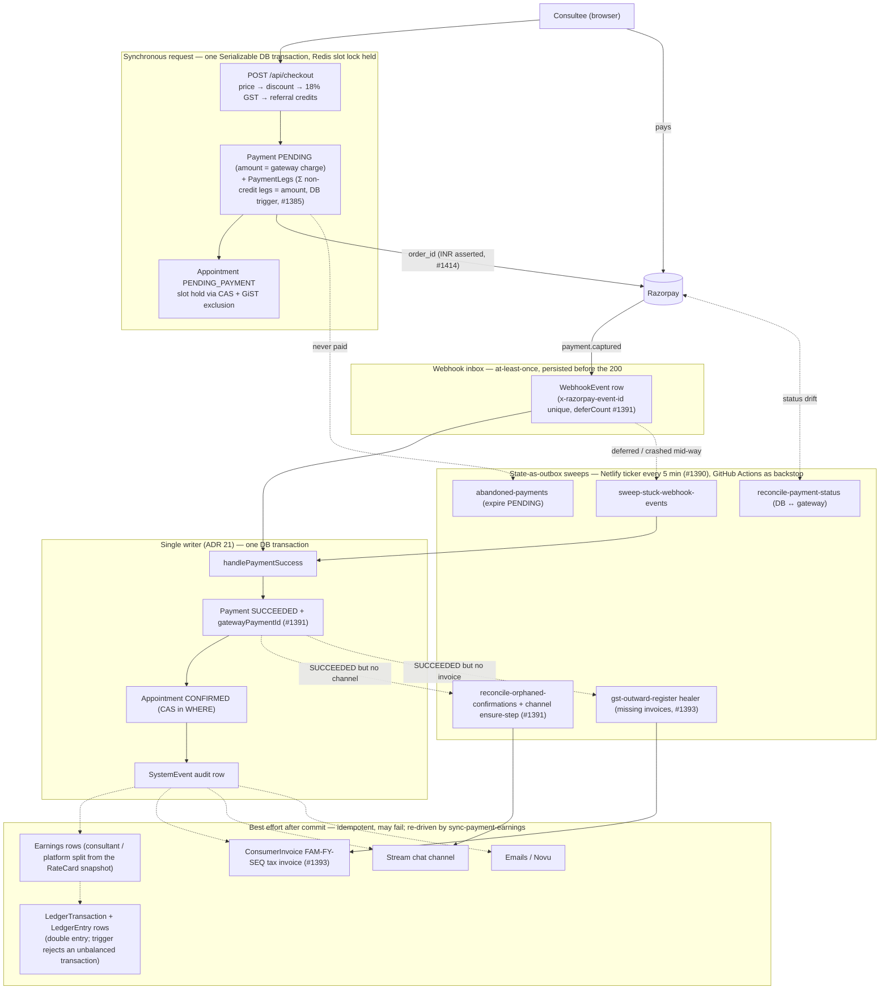
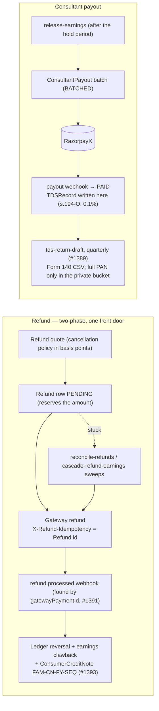
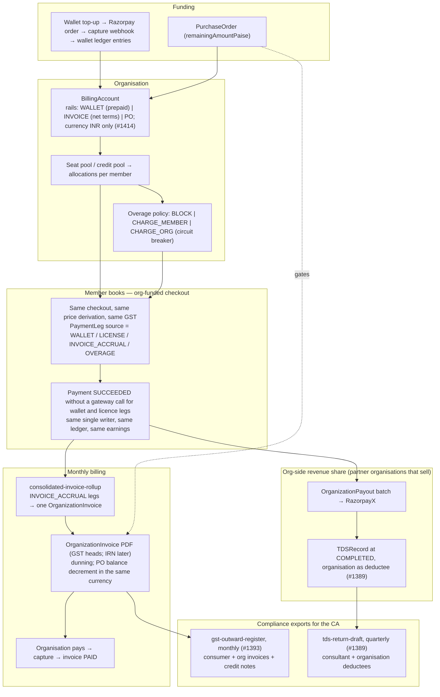
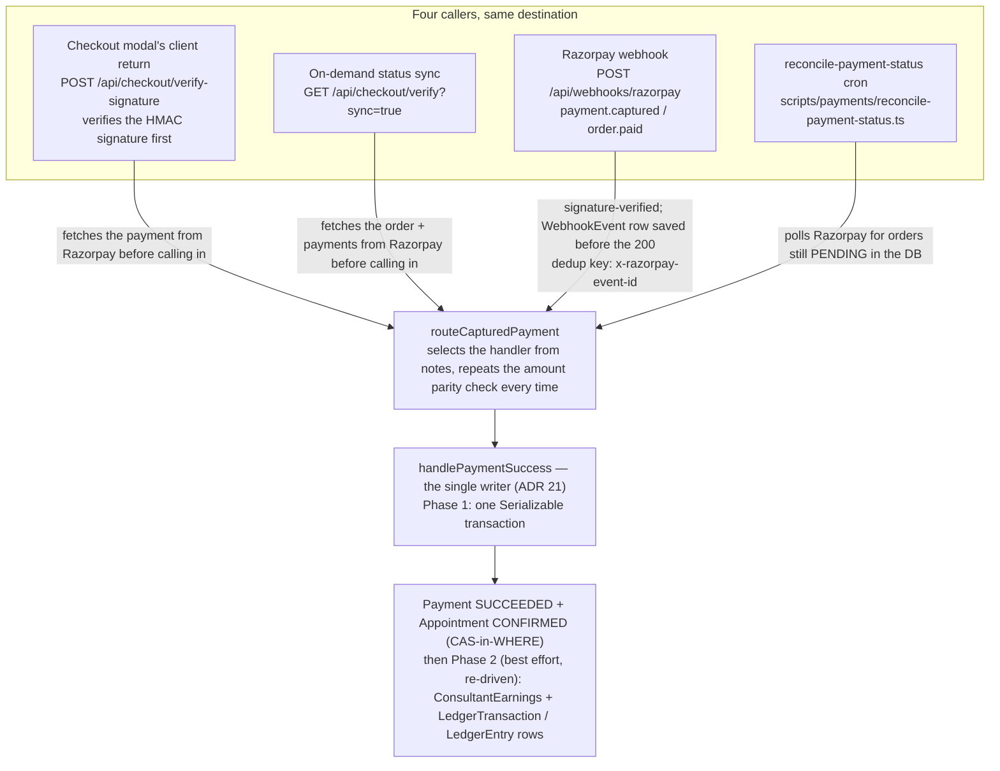

# Money subsystem — high-level design in five diagrams

This page is the map a newcomer should read before any other payments document. It shows where money truth is written, what is allowed to lag behind it, and which mechanism closes each gap. Everything drawn here runs inside one Next.js application against one Postgres database and one Redis instance. There are no services, no queues and no message brokers; the domain rows themselves carry every pending obligation, and scheduled sweeps read those rows to finish the work (ADR 14, ADR 22 and ADR 27 explain why that posture was chosen over a broker).

The diagrams describe the code as it stands after the 2026-09-03 finance train (PRs #1385, #1386, #1389, #1390, #1391, #1393, #1392 and #1414) and the 2026-09-19 Muse Spark finance train. Where a box only exists because of one of those PRs, the PR number is written on it. The verdict record that motivated the earlier train lives in [audits/2026-09-03-finance-verdicts.md](./audits/2026-09-03-finance-verdicts.md).

## 1. B2C: a consultee pays for a session

The first diagram follows a single booking from the checkout request to the moment every side effect exists. The synchronous part is one Serializable database transaction taken under a Redis slot lock; it writes the Payment, its funding legs and the appointment hold together, so either all three exist or none does. The gateway then calls back asynchronously, and the webhook row is saved before the request is acknowledged, which makes the inbound event durable: the platform can redrive the persisted row without requiring Razorpay to resend it. The single writer's Phase-1 transaction moves the Payment to `SUCCEEDED` and the Appointment to `CONFIRMED`; the earnings rows and the ledger posting are Phase 2, written immediately after that transaction commits and re-driven by `sync-payment-earnings` if the first attempt does not land. Everything after the Phase-1 commit, earnings and the ledger included, is best effort and is re-driven by the sweeps at the bottom.

Three guarantees follow from this shape. The buyer's money state is exact at the moment the Phase-1 writer commits, because the Payment and the appointment are in the same transaction; the earnings and ledger rows are written in the immediately following Phase 2 and are re-driven by `sync-payment-earnings` rather than by the checkout request if that first attempt does not land. Side effects are eventually consistent and are retried by the listed sweeps where a sweep exists; the five-minute ticker cadence is the normal retry interval, not a hard completion bound. Every sweep is idempotent, so a sweep and a webhook retry racing each other cannot double-post anything.

## 2. B2C: refunds and consultant payouts

The second diagram covers money leaving the platform on the consumer side. A refund is two-phase: the Refund row reserves the amount before the gateway is called, the gateway call carries the Refund id as its idempotency key, and the ledger reversal, the earnings clawback and the credit note are written only when the gateway confirms. A consultant payout releases earnings after the hold period, batches them, and writes the TDS record only when the RazorpayX webhook says the money moved.

The refund path has a single front door on purpose. Every rail that can return money to a buyer, whether a cancellation, a dispute, a removed event seat or an admin action, must produce a Refund row first, so the reserve, the idempotency key and the credit note are never skipped.

## 3. B2B: an organisation funds its members

The third diagram shows what changes when an organisation pays. The checkout, the price derivation, the GST calculation, the single writer and the ledger are the same code as the consumer path. What differs is the funding leg: a wallet, a licence seat, an invoice accrual or an overage charge replaces the card, and for wallet and licence legs no gateway call happens at all. Accrued legs roll up into one organisation invoice per month, and organisations that sell on the platform receive payouts with their own TDS records.

The three axes that make enterprise finance look complicated, namely the organisation's shape, its funding source and the programme type, are product facts rather than engineering choices. The code keeps them orthogonal so that a new combination is a configuration, not a new code path.

## 4. Cross-cutting: truth, audit, schedulers and reconciliation

The last diagram separates the four layers that the first three diagrams mix together. Money truth is strongly consistent and guarded by the database itself. The audit trail is a set of append-only rows written inside the same transactions, so it cannot disagree with the money. The schedulers are the only asynchronous machinery, and they do nothing but call HTTP routes that already exist. Reconciliation has exactly four purposes, and every scheduled money job maps to one of them.

```mermaid
flowchart LR
  subgraph Truth["Money truth — strongly consistent, one transaction"]
    T1["Payment / Refund / Payout rows<br/>status moves only through the CAS-in-WHERE helpers"]
    T2["Double-entry journal: LedgerTransaction + LedgerEntry<br/>balances are derived; walletBalance is a reconciled cache"]
    T3["DB guards: leg-sum trigger, ledger-balanced trigger, CHECK sidecars"]
  end
  subgraph Audit["Audit trail — append-only rows"]
    A1["OrgAuditLog (who did what inside an organisation)"]
    A2["SystemEvent / recordSystemError (operations timeline)"]
    A3["SystemJobExecution (every cron run, its lock, its outcome)"]
    A4["WebhookEvent (raw inbound payload, retries)"]
  end
  subgraph Sched["Schedulers — no broker"]
    G["GitHub Actions cron<br/>nightly and backstop runs (sub-hourly schedules fire only every ~100 min)"]
    N["Netlify scheduled function cron-tick.mts (#1390)<br/>every 5 min, ten money routes, bounded by ?limit"]
    R["app/api/cleanup/* routes<br/>CRON_SECRET + withCronLock (fail-closed for money jobs)"]
  end
  subgraph Recon["Reconciliation — four purposes"]
    R1["DB ↔ gateway status"]
    R2["DB ↔ journal caches"]
    R3["crash-gap re-drives"]
    R4["time expiry"]
  end
  G --> R
  N --> R
  R --> Recon
  Recon --> Truth
  Truth --> Audit
```

## 5. Four callers, one writer

A captured payment can be reported by four different callers, and the code is built so that only one of them is ever allowed to move money. The checkout modal's own client return, an on-demand status-sync poll, the asynchronous Razorpay webhook, and the `reconcile-payment-status` cron each learn about a capture through a different channel and on a different schedule, yet all four resolve to the same order-level facts — the order's `notes`, the captured amount, and, on every path but the webhook, a gateway payment id fetched fresh from Razorpay — and hand them to the same router, `routeCapturedPayment` (`app/api/webhooks/razorpay-dispatch.ts`), which is the only code allowed to call `handlePaymentSuccess`. A caller that is not the webhook must fetch gateway truth before calling in, because a client-side signature proves the order/payment id pair is genuine but says nothing about whether the money actually moved.

| Term                                       | One-sentence definition                                                                                                                                                                                                                                                    |
| ------------------------------------------ | -------------------------------------------------------------------------------------------------------------------------------------------------------------------------------------------------------------------------------------------------------------------------- |
| Webhook                                    | Razorpay's asynchronous callback to `POST /api/webhooks/razorpay`, saved as a `WebhookEvent` row before the request is acknowledged so the platform can redrive it without Razorpay resending it.                                                                          |
| Idempotency key                            | A value that makes a repeated call produce the same result once instead of twice — `x-razorpay-event-id` for webhook dedup, `Refund.id` for a gateway refund, and `booking:<paymentId>` for a ledger transaction.                                                          |
| CAS-in-WHERE                               | Every status move repeats the money predicate inside the `UPDATE ... WHERE` clause (for example `WHERE status = 'PENDING'`), so a second writer racing the first is rejected by the database rather than silently overwriting it.                                          |
| Single writer                              | `Payment.paymentStatus` is written by `handlePaymentSuccess` alone; all four callers above route into it instead of each writing the status themselves (ADR 21).                                                                                                           |
| Payment legs                               | `PaymentLeg` rows record what funded a `Payment` (card, wallet, invoice, licence seat); their sum must equal `Payment.amount`, excluding `REFERRAL_CREDIT` legs, which record value already subtracted out of `amount`.                                                    |
| Double-entry ledger with reconciled caches | Every money movement posts a balanced `LedgerTransaction` plus two or more `LedgerEntry` rows; a cache such as `BillingAccount.walletBalance` is a read optimisation the reconciler corrects against that journal, never a second source of truth.                         |
| State-as-outbox sweep                      | A scheduled job that finds domain rows whose expected side effect never landed (an unstamped column, a `PENDING` row past its window) and redrives exactly that side effect, instead of a separate outbox table (ADR 27).                                                  |
| Transient vs terminal failure              | A transient failure (a timeout, a not-yet-settled gateway lookup) is retried by the next sweep tick; a terminal failure (Razorpay's `BAD_REQUEST_ERROR` / `input_validation_failed` for an id it has no record of) is recorded once with a reason and never retried again. |

## When this design should change

A message broker earns its place when a second, independently deployed consumer needs the same events, when inbound webhooks sustain tens of events per second, or when the application leaves a serverless host and can run a consumer process around the clock. None of those conditions holds today, and the first step when one does is an HTTP queue such as QStash driving the same cleanup routes (issue #866), not Kafka. Until then, the cost of this design is readability rather than correctness: a reader has to know the sweeps exist, which is why ADR 27 lists every one of them.
