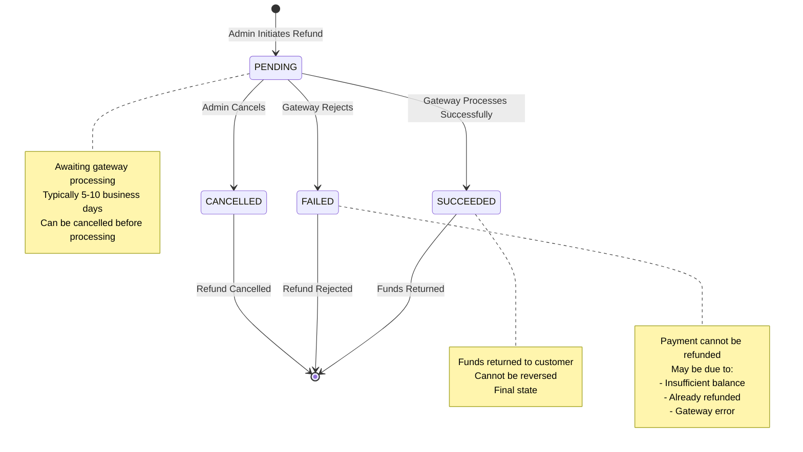
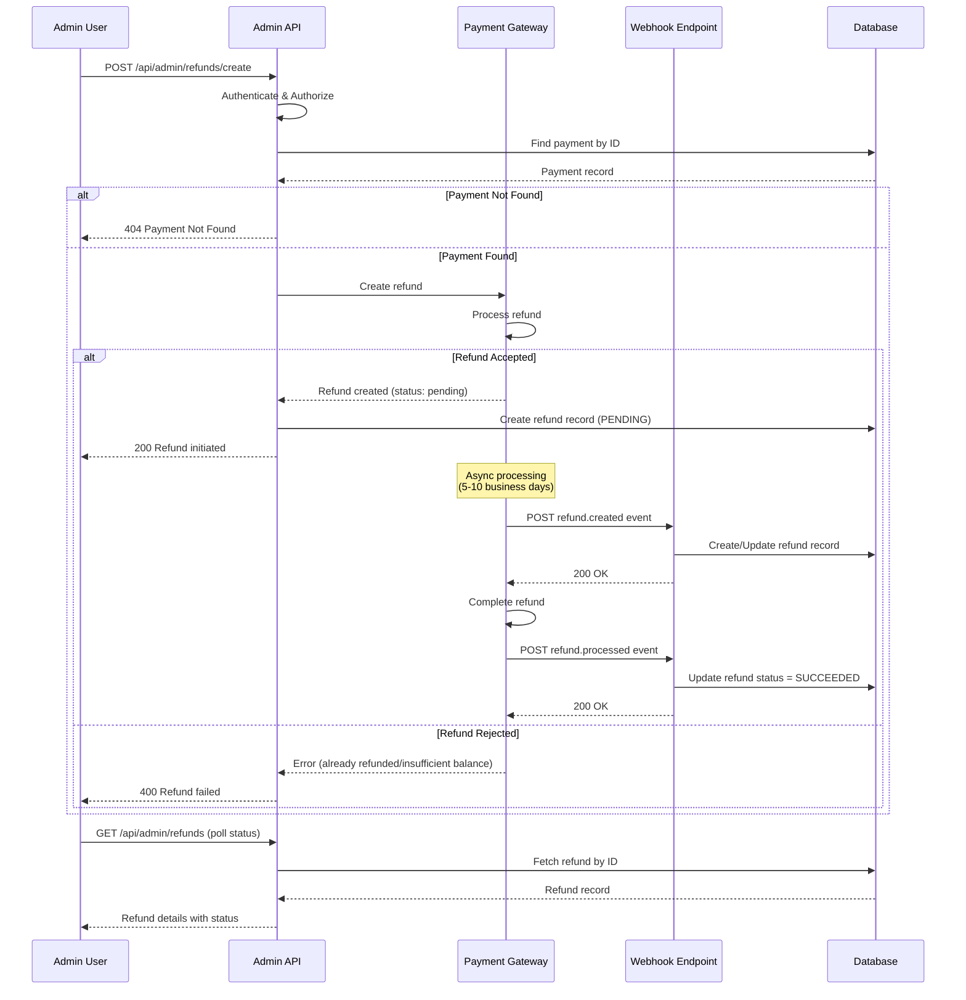
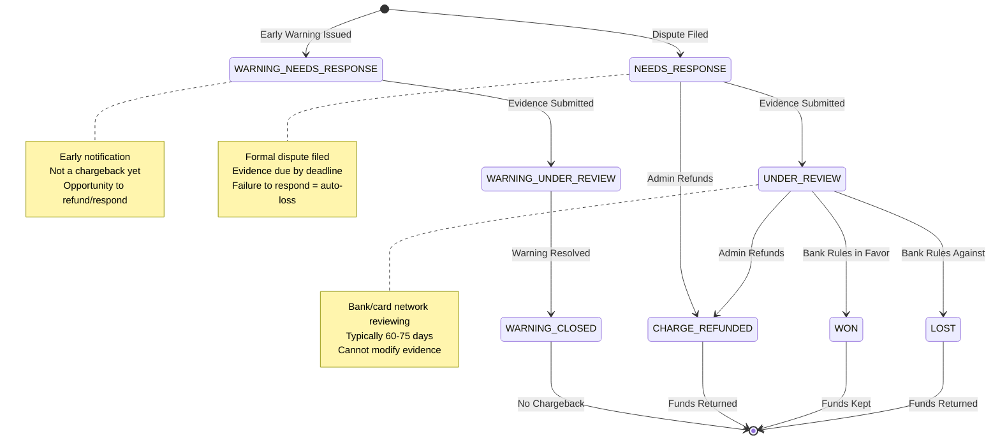
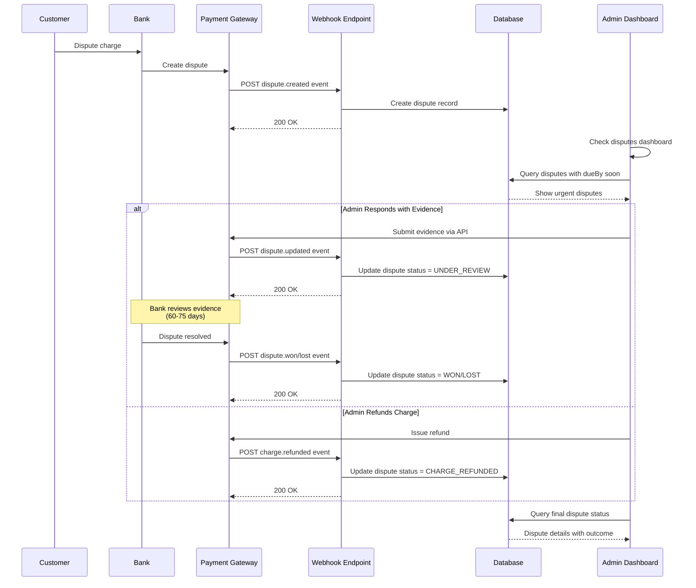
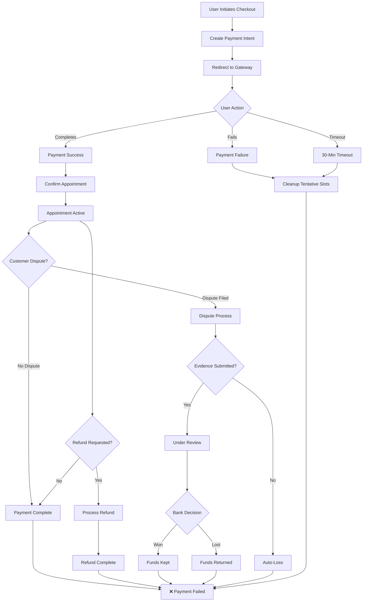

# Payment System Documentation - Part 4: Refunds, Disputes & Post-Payment

> **Navigation:** [Part 1](./CHECKOUT_FLOW_PART1.md) | [Part 2](./CHECKOUT_FLOW_PART2.md) | [Part 3](./CHECKOUT_FLOW_PART3.md) | **Part 4** | [Part 5](./CHECKOUT_FLOW_PART5.md)

## Table of Contents

1. [Refund System](#1-refund-system)
2. [Dispute System](#2-dispute-system)
3. [Admin Dashboard APIs](#3-admin-dashboard-apis)
4. [Webhook-Based Updates](#4-webhook-based-updates)
5. [Post-Payment Operations](#5-post-payment-operations)
6. [Lifecycle Management](#6-lifecycle-management)

---

## 1. Refund System

### 1.1 Refund Overview

Refunds allow reversal of completed payments, returning funds to customers. The system supports both full and partial refunds through multiple payment gateways.

```
┌─────────────────────────────────────────────────────────────┐
│                      Refund Architecture                     │
└─────────────────────────────────────────────────────────────┘
                              │
                ┌─────────────┼─────────────┐
                │             │             │
                ▼             ▼             ▼
         ┌──────────┐  ┌──────────┐  ┌──────────┐
         │  Admin   │  │ Gateway  │  │ Webhook  │
         │ Initiated│  │  Event   │  │  Update  │
         └──────────┘  └──────────┘  └──────────┘
                │             │             │
                └─────────────┼─────────────┘
                              │
                              ▼
                    ┌─────────────────────┐
                    │  Refund Database    │
                    │      Record         │
                    └─────────────────────┘
```

### 1.2 Refund States

```typescript
// Prisma enum
enum RefundStatus {
  PENDING    // Refund initiated, processing
  SUCCEEDED  // Refund completed successfully
  FAILED     // Refund failed to process
  CANCELLED  // Refund was cancelled
}
```

### 1.3 Refund State Diagram



### 1.4 Refund Data Model

**Prisma Schema:**
```prisma
model Refund {
  id             String         @id @default(uuid())
  amount         Int            // Amount in smallest unit (cents/paise)
  currency       String
  reason         String?        // Reason for refund
  status         RefundStatus
  refundId       String         @unique // Gateway refund ID
  paymentGateway PaymentGateway
  metadata       Json?          // Additional metadata

  payment   Payment @relation(fields: [paymentId], references: [id])
  paymentId String

  createdAt DateTime @default(now())
  updatedAt DateTime @updatedAt

  @@index([paymentId])
  @@index([status])
  @@index([refundId])
}
```

**Key Fields:**
- `amount`: Refund amount (can be less than original payment for partial refunds)
- `refundId`: Gateway-specific ID (e.g., `re_...` for Stripe, `rfnd_...` for Razorpay)
- `paymentId`: Links back to original payment
- `status`: Current refund status
- `metadata`: Additional gateway-specific data

### 1.5 Stripe Refund Flow

**File:** `/lib/payments/core/stripe.ts` (lines 174-207)

```typescript
export async function createStripeRefund({
  paymentIntentId,
  amount,
  reason,
  metadata,
}: RefundParams): Promise<RefundResult> {
  if (!stripeClient) {
    throw new RefundError(
      "Stripe client not initialized",
      "STRIPE_NOT_INITIALIZED",
      "STRIPE"
    );
  }

  const refund = await stripeClient.refunds.create({
    payment_intent: paymentIntentId,
    amount: amount ? toSmallestUnit(amount, "USD") : undefined, // undefined = full refund
    reason: mapRefundReason(reason),
    metadata,
  });

  return {
    refundId: refund.id,
    amount: fromSmallestUnit(refund.amount, refund.currency || "USD"),
    currency: refund.currency?.toUpperCase() || "USD",
    status: mapStripeRefundStatus(refund.status),
    metadata: refund.metadata || undefined,
  };
}
```

**Refund Reasons (Stripe):**
```typescript
function mapRefundReason(reason?: string):
  | "duplicate"
  | "fraudulent"
  | "requested_by_customer"
  | undefined {

  if (!reason) return "requested_by_customer";
  if (reason.includes("duplicate")) return "duplicate";
  if (reason.includes("fraud")) return "fraudulent";
  return "requested_by_customer";
}
```

**Status Mapping:**
```typescript
function mapStripeRefundStatus(status: string | null): RefundStatus {
  switch (status) {
    case "succeeded": return "SUCCEEDED";
    case "pending":   return "PENDING";
    case "failed":    return "FAILED";
    case "canceled":  return "CANCELLED";
    default:          return "PENDING";
  }
}
```

### 1.6 Razorpay Refund Flow

**File:** `/lib/payments/core/razorpay.ts` (lines 128-183)

```typescript
export async function createRazorpayRefund({
  paymentIntentId,
  amount,
  reason,
  metadata,
}: RefundParams): Promise<RefundResult> {
  if (!razorpayClient) {
    throw new RefundError(
      "Razorpay client not initialized",
      "RAZORPAY_NOT_INITIALIZED",
      "RAZORPAY"
    );
  }

  // Step 1: Get payment ID from order
  const payments = await razorpayClient.orders.fetchPayments(paymentIntentId);

  if (payments.count === 0) {
    throw new RefundError(
      "No payment found for this order",
      "NO_PAYMENT_FOUND",
      "RAZORPAY"
    );
  }

  const payment = payments.items[0];

  // Step 2: Create refund on the payment
  const refund = await razorpayClient.payments.refund(payment.id, {
    amount: amount ? toSmallestUnit(amount, payment.currency || "INR") : undefined,
    notes: {
      reason: reason || "requested_by_customer",
      ...metadata,
    },
  });

  return {
    refundId: refund.id,
    amount: fromSmallestUnit(Number(refund.amount), refund.currency || "INR"),
    currency: refund.currency?.toUpperCase() || "INR",
    status: mapRazorpayRefundStatus(refund.status),
    metadata: refund.notes as Record<string, unknown>,
  };
}
```

**Key Difference:** Razorpay requires fetching payment ID from order first, then refunding the payment (not the order directly).

**Status Mapping:**
```typescript
function mapRazorpayRefundStatus(status: string | null): RefundStatus {
  switch (status) {
    case "processed": return "SUCCEEDED";
    case "pending":   return "PENDING";
    case "failed":    return "FAILED";
    default:          return "PENDING";
  }
}
```

### 1.7 Mock Refund Flow

**File:** `/lib/payments/operations/mock.ts` (lines 120-143)

```typescript
export async function createMockRefund(
  paymentIntentId: string,
  amount?: number,
  _reason?: string,
): Promise<{
  refundId: string;
  amount: number;
  status: string;
}> {
  // Simulate API delay
  await new Promise((resolve) => setTimeout(resolve, 300));

  const mockRefundId = `rfnd_mock_${Math.random().toString(36).substring(2, 15)}`;

  console.log(
    `✅ Mock refund created: ${mockRefundId} for payment ${paymentIntentId}`
  );

  return {
    refundId: mockRefundId,
    amount: amount || 0,
    status: "succeeded", // Mock refunds always succeed
  };
}
```

### 1.8 Refund Webhook Handling

**File:** `/app/api/webhooks/utils.ts` (lines 434-487)

```typescript
export async function handleRefundCreated(
  refundId: string,
  paymentIntentId: string,
  amount: number,
  currency: string,
  status: string,
  gateway: "STRIPE" | "RAZORPAY",
) {
  return await prisma.$transaction(async (tx) => {
    // Find the payment
    const payment = await tx.payment.findUnique({
      where: { paymentIntent: paymentIntentId },
    });

    if (!payment) {
      console.warn(`Payment not found for refund: ${refundId}`);
      return;
    }

    // Check if refund already exists (idempotency)
    const existingRefund = await tx.refund.findUnique({
      where: { refundId },
    });

    if (existingRefund) {
      // Update status if changed
      if (existingRefund.status !== status) {
        await tx.refund.update({
          where: { refundId },
          data: {
            status: mapRefundStatus(status),
            updatedAt: new Date(),
          },
        });
        console.log(`✅ Refund ${refundId} status updated to ${status}`);
      }
      return;
    }

    // Create new refund record
    await tx.refund.create({
      data: {
        amount,
        currency,
        status: mapRefundStatus(status),
        refundId,
        paymentGateway: gateway,
        paymentId: payment.id,
      },
    });

    console.log(`✅ Refund ${refundId} created for payment ${payment.id}`);
  });
}
```

### 1.9 Refund Sequence Diagram



### 1.10 Refund Business Rules

**Full Refund vs Partial Refund:**
```typescript
// Full refund (omit amount parameter)
await createStripeRefund({
  paymentIntentId: "pi_123",
  reason: "requested_by_customer",
  // amount not specified = full refund
});

// Partial refund (specify amount)
await createStripeRefund({
  paymentIntentId: "pi_123",
  amount: 50.00, // Refund $50 of original $150
  reason: "partial_cancellation",
});
```

**Refund Eligibility:**
- Payment must be in SUCCEEDED status
- Refund cannot exceed original payment amount
- Total refunds (if multiple) cannot exceed original amount
- Some gateways have time limits (e.g., 180 days for Stripe)

**Refund Timeline:**
- **Stripe:** 5-10 business days to customer's account
- **Razorpay:** 5-7 business days to customer's account
- **Mock:** Instant (development only)

---

## 2. Dispute System

### 2.1 Dispute Overview

Disputes (chargebacks) occur when a customer contests a charge with their bank. The system tracks disputes, manages evidence submission, and monitors resolution.

```
┌─────────────────────────────────────────────────────────────┐
│                     Dispute Lifecycle                        │
└─────────────────────────────────────────────────────────────┘
                              │
                              ▼
                    ┌─────────────────────┐
                    │  Customer Disputes  │
                    │  Charge with Bank   │
                    └──────────┬──────────┘
                               │
                               ▼
                    ┌─────────────────────┐
                    │  Gateway Creates    │
                    │  Dispute Record     │
                    └──────────┬──────────┘
                               │
                               ▼
                    ┌─────────────────────┐
                    │  Webhook Notifies   │
                    │  Our System         │
                    └──────────┬──────────┘
                               │
                               ▼
                    ┌─────────────────────┐
                    │  Admin Submits      │
                    │  Evidence           │
                    └──────────┬──────────┘
                               │
                               ▼
                    ┌─────────────────────┐
                    │  Bank Reviews       │
                    │  Evidence           │
                    └──────────┬──────────┘
                               │
                               ▼
                    ┌─────────────────────┐
                    │  Dispute Resolved   │
                    │  (Won/Lost)         │
                    └─────────────────────┘
```

### 2.2 Dispute States

```typescript
enum DisputeStatus {
  WARNING_NEEDS_RESPONSE   // Early fraud warning, needs response
  WARNING_UNDER_REVIEW     // Early fraud warning under review
  WARNING_CLOSED           // Early fraud warning closed
  NEEDS_RESPONSE           // Dispute filed, needs evidence
  UNDER_REVIEW             // Evidence submitted, under review
  CHARGE_REFUNDED          // Charge was refunded (dispute closed)
  WON                      // Dispute won (funds kept)
  LOST                     // Dispute lost (funds returned)
}
```

### 2.3 Dispute State Diagram



### 2.4 Dispute Data Model

**Prisma Schema:**
```prisma
model Dispute {
  id             String         @id @default(uuid())
  amount         Int            // Disputed amount in smallest unit
  currency       String
  reason         String         // Dispute reason from gateway
  status         DisputeStatus
  disputeId      String         @unique // Gateway dispute ID
  paymentGateway PaymentGateway
  evidence       Json?          // Evidence submitted
  dueBy          DateTime?      // Deadline to respond
  isChargeRefundable Boolean    @default(true)

  payment   Payment @relation(fields: [paymentId], references: [id])
  paymentId String

  createdAt DateTime @default(now())
  updatedAt DateTime @updatedAt

  @@index([paymentId])
  @@index([status])
  @@index([disputeId])
  @@index([dueBy])
}
```

**Key Fields:**
- `disputeId`: Gateway-specific ID (e.g., `dp_...` for Stripe)
- `reason`: Dispute reason (e.g., "fraudulent", "product_not_received")
- `dueBy`: Deadline to submit evidence (critical for admin alerts)
- `isChargeRefundable`: Whether charge can still be refunded
- `evidence`: JSON object with submitted evidence

### 2.5 Stripe Dispute Flow

**Get Dispute Details:**
**File:** `/lib/payments/core/stripe.ts` (lines 278-305)

```typescript
export async function getStripeDispute(
  disputeId: string,
): Promise<DisputeResult> {
  if (!stripeClient) {
    throw new DisputeError(
      "Stripe client not initialized",
      "STRIPE_NOT_INITIALIZED",
      "STRIPE"
    );
  }

  const dispute = await stripeClient.disputes.retrieve(disputeId);

  return {
    disputeId: dispute.id,
    status: mapStripeDisputeStatus(dispute.status),
    evidence: dispute.evidence as Record<string, unknown>,
    isChargeRefundable: dispute.is_charge_refundable,
    dueBy: dispute.evidence_details?.due_by
      ? new Date(dispute.evidence_details.due_by * 1000)
      : undefined,
  };
}
```

**Submit Evidence:**
**File:** `/lib/payments/core/stripe.ts` (lines 310-358)

```typescript
export async function submitStripeDisputeEvidence({
  disputeId,
  evidence,
}: DisputeParams): Promise<DisputeResult> {
  if (!stripeClient) {
    throw new DisputeError(
      "Stripe client not initialized",
      "STRIPE_NOT_INITIALIZED",
      "STRIPE"
    );
  }

  // Update dispute with evidence
  const dispute = await stripeClient.disputes.update(disputeId, {
    evidence: {
      customer_name: evidence.customerName,
      customer_email_address: evidence.customerEmailAddress,
      customer_purchase_ip: evidence.customerPurchaseIp,
      cancellation_policy: evidence.cancellationPolicy,
      cancellation_policy_disclosure: evidence.cancellationPolicyDisclosure,
      cancellation_rebuttal: evidence.cancellationRebuttal,
      duplicate_charge_id: evidence.duplicateChargeId,
      duplicate_charge_explanation: evidence.duplicateChargeExplanation,
      duplicate_charge_documentation: evidence.duplicateChargeDocumentation,
      product_description: evidence.productDescription,
      receipt: evidence.receipt,
      customer_communication: evidence.customerCommunication,
      uncategorized_text: evidence.uncategorizedText,
      uncategorized_file: evidence.uncategorizedFile,
    },
  });

  // Submit evidence to Stripe
  await stripeClient.disputes.close(disputeId);

  return {
    disputeId: dispute.id,
    status: mapStripeDisputeStatus(dispute.status),
    evidence: dispute.evidence as Record<string, unknown>,
    isChargeRefundable: dispute.is_charge_refundable,
    dueBy: dispute.evidence_details?.due_by
      ? new Date(dispute.evidence_details.due_by * 1000)
      : undefined,
  };
}
```

**Evidence Fields (Stripe):**
- `customer_name`: Customer's name
- `customer_email_address`: Customer's email
- `customer_purchase_ip`: IP address used for purchase
- `cancellation_policy`: Text or URL of cancellation policy
- `cancellation_policy_disclosure`: How policy was shown to customer
- `cancellation_rebuttal`: Response to cancellation claim
- `duplicate_charge_explanation`: Why charges aren't duplicates
- `product_description`: Description of service/product provided
- `receipt`: Receipt or invoice document
- `customer_communication`: Communications with customer
- `uncategorized_text`: Additional text evidence
- `uncategorized_file`: Additional file evidence

**Status Mapping:**
```typescript
function mapStripeDisputeStatus(status: string): DisputeStatus {
  switch (status) {
    case "warning_needs_response": return "WARNING_NEEDS_RESPONSE";
    case "warning_under_review":   return "WARNING_UNDER_REVIEW";
    case "warning_closed":         return "WARNING_CLOSED";
    case "needs_response":         return "NEEDS_RESPONSE";
    case "under_review":           return "UNDER_REVIEW";
    case "charge_refunded":        return "CHARGE_REFUNDED";
    case "won":                    return "WON";
    case "lost":                   return "LOST";
    default:                       return "NEEDS_RESPONSE";
  }
}
```

### 2.6 Razorpay Dispute Flow

**Note:** Razorpay does not provide a direct API for submitting evidence. Disputes are managed through the Razorpay Dashboard.

**Webhook Events:**
- `payment.dispute.created`: New dispute created
- `payment.dispute.won`: Dispute resolved in merchant's favor
- `payment.dispute.lost`: Dispute resolved in customer's favor
- `payment.dispute.closed`: Dispute closed without resolution

**File:** `/app/api/webhooks/razorpay/route.ts` (lines 95-132)

```typescript
switch (eventType) {
  case "payment.dispute.created": {
    const disputeCreatedEvent = event.payload.dispute.entity;
    await handleDisputeCreated(
      disputeCreatedEvent.id,
      disputeCreatedEvent.payment_id,
      disputeCreatedEvent.amount,
      disputeCreatedEvent.currency || "INR",
      disputeCreatedEvent.reason_description || disputeCreatedEvent.reason_code,
      disputeCreatedEvent.status,
      disputeCreatedEvent.respond_by || null,
      disputeCreatedEvent.deduct_at_onset === false,
      "RAZORPAY"
    );
    break;
  }

  case "payment.dispute.won": {
    const disputeWonEvent = event.payload.dispute.entity;
    await handleDisputeUpdated(disputeWonEvent.id, "won", null);
    break;
  }

  case "payment.dispute.lost": {
    const disputeLostEvent = event.payload.dispute.entity;
    await handleDisputeUpdated(disputeLostEvent.id, "lost", null);
    break;
  }

  case "payment.dispute.closed": {
    const disputeClosedEvent = event.payload.dispute.entity;
    await handleDisputeUpdated(
      disputeClosedEvent.id,
      disputeClosedEvent.status,
      null
    );
    break;
  }
}
```

### 2.7 Dispute Webhook Handling

**Create Dispute:**
**File:** `/app/api/webhooks/utils.ts` (lines 513-587)

```typescript
export async function handleDisputeCreated(
  disputeId: string,
  chargeId: string,
  amount: number,
  currency: string,
  reason: string,
  status: string,
  dueBy: number | null,
  isChargeRefundable: boolean,
  gateway: "STRIPE" | "RAZORPAY",
) {
  return await prisma.$transaction(async (tx) => {
    // Find payment by charge ID
    let payment;
    if (gateway === "STRIPE" && stripeClient) {
      // Get payment intent from charge
      const charge = await stripeClient.charges.retrieve(chargeId);
      if (charge.payment_intent) {
        payment = await tx.payment.findUnique({
          where: {
            paymentIntent: typeof charge.payment_intent === "string"
              ? charge.payment_intent
              : charge.payment_intent.id,
          },
        });
      }
    } else {
      // For Razorpay, charge ID is the payment ID
      payment = await tx.payment.findFirst({
        where: { paymentIntent: { contains: chargeId } },
      });
    }

    if (!payment) {
      console.warn(`Payment not found for dispute: ${disputeId}`);
      return;
    }

    // Check if dispute already exists (idempotency)
    const existingDispute = await tx.dispute.findUnique({
      where: { disputeId },
    });

    if (existingDispute) {
      console.log(`Dispute ${disputeId} already exists`);
      return;
    }

    // Create dispute record
    await tx.dispute.create({
      data: {
        amount,
        currency,
        reason,
        status: mapDisputeStatus(status),
        disputeId,
        paymentGateway: gateway,
        dueBy: dueBy ? new Date(dueBy * 1000) : null,
        isChargeRefundable,
        paymentId: payment.id,
      },
    });

    console.log(`✅ Dispute ${disputeId} created for payment ${payment.id}`);
  });
}
```

**Update Dispute:**
**File:** `/app/api/webhooks/utils.ts` (lines 592-618)

```typescript
export async function handleDisputeUpdated(
  disputeId: string,
  status: string,
  evidence: Record<string, unknown> | null,
) {
  return await prisma.$transaction(async (tx) => {
    const dispute = await tx.dispute.findUnique({
      where: { disputeId },
    });

    if (!dispute) {
      console.warn(`Dispute not found: ${disputeId}`);
      return;
    }

    await tx.dispute.update({
      where: { disputeId },
      data: {
        status: mapDisputeStatus(status),
        ...(evidence && { evidence: evidence as Prisma.InputJsonValue }),
        updatedAt: new Date(),
      },
    });

    console.log(`✅ Dispute ${disputeId} updated to status ${status}`);
  });
}
```

### 2.8 Dispute Sequence Diagram



---

## 3. Admin Dashboard APIs

### 3.1 Refunds List API

**Endpoint:** `GET /api/admin/refunds`

**File:** `/app/api/admin/refunds/route.ts`

**Purpose:** List and filter refunds for admin dashboard

**Authentication:** Admin role required

**Query Parameters:**
```typescript
{
  page?: number,        // Page number (default: 1)
  limit?: number,       // Results per page (default: 20)
  status?: RefundStatus,// Filter by status
  gateway?: PaymentGateway, // Filter by gateway
  search?: string,      // Search by refund ID
}
```

**Response:**
```json
{
  "refunds": [
    {
      "id": "uuid",
      "amount": 15000,
      "currency": "USD",
      "reason": "requested_by_customer",
      "status": "SUCCEEDED",
      "refundId": "re_1abc123",
      "paymentGateway": "STRIPE",
      "createdAt": "2025-11-06T10:00:00Z",
      "updatedAt": "2025-11-06T10:05:00Z",
      "payment": {
        "id": "payment-uuid",
        "paymentIntent": "pi_abc123"
      }
    }
  ],
  "total": 50,
  "page": 1,
  "limit": 20,
  "totalPages": 3
}
```

**Implementation (lines 7-84):**
```typescript
export async function GET(req: NextRequest) {
  // 1. Authenticate user
  const session = await getServerSession(authOptions);
  if (!session?.user) {
    return NextResponse.json({ error: "Unauthorized" }, { status: 401 });
  }

  // 2. Check admin role
  const user = await prisma.user.findUnique({
    where: { id: session.user.id },
    select: { role: true },
  });

  if (user?.role !== UserRole.ADMIN) {
    return NextResponse.json({ error: "Forbidden" }, { status: 403 });
  }

  // 3. Parse query parameters
  const searchParams = req.nextUrl.searchParams;
  const page = parseInt(searchParams.get("page") || "1");
  const limit = parseInt(searchParams.get("limit") || "20");
  const status = searchParams.get("status") as RefundStatus | null;
  const gateway = searchParams.get("gateway") as PaymentGateway | null;
  const search = searchParams.get("search");

  // 4. Build where clause
  const where: any = {};
  if (status) where.status = status;
  if (gateway) where.paymentGateway = gateway;
  if (search) where.refundId = { contains: search, mode: "insensitive" };

  // 5. Fetch refunds with pagination
  const [refunds, total] = await Promise.all([
    prisma.refund.findMany({
      where,
      skip: (page - 1) * limit,
      take: limit,
      orderBy: { createdAt: "desc" },
      include: {
        payment: {
          select: { id: true, paymentIntent: true },
        },
      },
    }),
    prisma.refund.count({ where }),
  ]);

  return NextResponse.json({
    refunds,
    total,
    page,
    limit,
    totalPages: Math.ceil(total / limit),
  });
}
```

### 3.2 Disputes List API

**Endpoint:** `GET /api/admin/disputes`

**File:** `/app/api/admin/disputes/route.ts`

**Purpose:** List disputes with urgency indicators

**Query Parameters:**
```typescript
{
  page?: number,
  limit?: number,
  status?: DisputeStatus,
  gateway?: PaymentGateway,
  search?: string,
}
```

**Response:**
```json
{
  "disputes": [
    {
      "id": "uuid",
      "amount": 15000,
      "currency": "USD",
      "reason": "fraudulent",
      "status": "NEEDS_RESPONSE",
      "disputeId": "dp_abc123",
      "paymentGateway": "STRIPE",
      "dueBy": "2025-11-10T23:59:59Z",
      "isChargeRefundable": true,
      "createdAt": "2025-11-06T10:00:00Z",
      "payment": {
        "id": "payment-uuid",
        "paymentIntent": "pi_abc123"
      }
    }
  ],
  "total": 10,
  "urgentDisputes": 3,  // Disputes due within 3 days
  "page": 1,
  "limit": 20,
  "totalPages": 1
}
```

**Urgent Disputes Query (lines 68-79):**
```typescript
// Count disputes due within 3 days
const urgentDisputes = await prisma.dispute.count({
  where: {
    dueBy: {
      lte: new Date(Date.now() + 3 * 24 * 60 * 60 * 1000), // 3 days from now
      gte: new Date(), // Not in the past
    },
    status: {
      in: ["WARNING_NEEDS_RESPONSE", "NEEDS_RESPONSE", "UNDER_REVIEW"],
    },
  },
});
```

### 3.3 Dispute Details API

**Endpoint:** `GET /api/admin/disputes/[disputeId]`

**File:** `/app/api/admin/disputes/[disputeId]/route.ts`

**Purpose:** Get full details of a specific dispute

**Response:**
```json
{
  "id": "uuid",
  "amount": 15000,
  "currency": "USD",
  "reason": "fraudulent",
  "status": "NEEDS_RESPONSE",
  "disputeId": "dp_abc123",
  "paymentGateway": "STRIPE",
  "evidence": {
    "customer_name": "John Doe",
    "customer_email_address": "john@example.com",
    "product_description": "Consultation service on 2025-11-05"
  },
  "dueBy": "2025-11-10T23:59:59Z",
  "isChargeRefundable": true,
  "createdAt": "2025-11-06T10:00:00Z",
  "updatedAt": "2025-11-06T10:00:00Z",
  "payment": {
    "id": "payment-uuid",
    "paymentIntent": "pi_abc123",
    "user": {
      "id": "user-uuid",
      "name": "John Doe",
      "email": "john@example.com"
    }
  }
}
```

---

## 4. Webhook-Based Updates

### 4.1 Refund Webhook Events

**Stripe:**
```typescript
// Event: charge.refunded
{
  "type": "charge.refunded",
  "data": {
    "object": {
      "id": "ch_abc123",
      "payment_intent": "pi_abc123",
      "refunds": {
        "data": [
          {
            "id": "re_abc123",
            "amount": 15000,
            "currency": "usd",
            "status": "succeeded"
          }
        ]
      }
    }
  }
}
```

**Razorpay:**
```typescript
// Event: refund.created
{
  "event": "refund.created",
  "payload": {
    "refund": {
      "entity": {
        "id": "rfnd_abc123",
        "payment_id": "pay_abc123",
        "amount": 15000,
        "currency": "INR",
        "status": "processed"
      }
    }
  }
}

// Event: refund.processed
// Same structure as refund.created
```

### 4.2 Dispute Webhook Events

**Stripe:**
```typescript
// Event: charge.dispute.created
{
  "type": "charge.dispute.created",
  "data": {
    "object": {
      "id": "dp_abc123",
      "charge": "ch_abc123",
      "amount": 15000,
      "currency": "usd",
      "reason": "fraudulent",
      "status": "needs_response",
      "evidence_details": {
        "due_by": 1699564800  // Unix timestamp
      },
      "is_charge_refundable": true
    }
  }
}

// Event: charge.dispute.updated
// Similar structure with updated fields

// Event: charge.dispute.closed
{
  "type": "charge.dispute.closed",
  "data": {
    "object": {
      "id": "dp_abc123",
      "status": "won" | "lost"
    }
  }
}
```

**Razorpay:**
```typescript
// Event: payment.dispute.created
{
  "event": "payment.dispute.created",
  "payload": {
    "dispute": {
      "entity": {
        "id": "disp_abc123",
        "payment_id": "pay_abc123",
        "amount": 15000,
        "currency": "INR",
        "reason_code": "chargeback",
        "reason_description": "Customer claims transaction is fraudulent",
        "status": "open",
        "respond_by": 1699564800,  // Unix timestamp
        "deduct_at_onset": true
      }
    }
  }
}

// Event: payment.dispute.won
// Event: payment.dispute.lost
// Event: payment.dispute.closed
```

---

## 5. Post-Payment Operations

### 5.1 Payment Confirmation

After successful payment, several post-payment operations occur automatically:

**1. Slot Confirmation (Tentative → Confirmed):**
```typescript
// File: /app/api/webhooks/utils.ts (line 340)
await tx.slotOfAppointment.updateMany({
  where: { appointmentId },
  data: { isTentative: false },
});
```

**2. Event Status Update:**
```typescript
// File: /app/api/webhooks/utils.ts (lines 355-378)
if (appointment?.consultation) {
  await tx.consultation.update({
    where: { id: appointment.consultation.id },
    data: { requestStatus: RequestStatus.APPROVED },
  });
}

if (appointment?.subscription) {
  await tx.subscription.update({
    where: { id: appointment.subscription.id },
    data: { requestStatus: RequestStatus.APPROVED },
  });
}

if (appointment?.webinar) {
  await tx.webinar.update({
    where: { id: appointment.webinar.id },
    data: { status: "SCHEDULED" },
  });
}

if (appointment?.class) {
  await tx.class.update({
    where: { id: appointment.class.id },
    data: { status: "SCHEDULED" },
  });
}
```

**3. Payment Record Update:**
```typescript
// Link appointment to payment
await tx.payment.update({
  where: { id: payment.id },
  data: { appointmentId: appointment.id },
});
```

### 5.2 Notification System (Future)

Post-payment notifications (not yet implemented):

```typescript
// Proposed notification flow
async function sendPaymentConfirmation(payment: Payment, appointment: Appointment) {
  // Email notification
  await sendEmail({
    to: payment.user.email,
    subject: "Payment Confirmed - Appointment Booked",
    template: "payment-confirmation",
    data: {
      amount: payment.amount,
      currency: payment.currency,
      appointmentType: appointment.appointmentType,
      scheduledAt: appointment.slotsOfAppointment[0]?.startsAt,
    },
  });

  // SMS notification (optional)
  if (payment.user.phone) {
    await sendSMS({
      to: payment.user.phone,
      message: `Payment confirmed! Your ${appointment.appointmentType} is scheduled for ${appointment.slotsOfAppointment[0]?.startsAt}.`,
    });
  }

  // In-app notification
  await createNotification({
    userId: payment.userId,
    type: "PAYMENT_SUCCESS",
    title: "Payment Confirmed",
    message: "Your appointment has been successfully booked.",
    link: `/appointments/${appointment.id}`,
  });
}
```

### 5.3 Calendar Integration (Future)

```typescript
// Proposed calendar sync
async function syncToCalendar(appointment: Appointment, user: User) {
  if (user.calendarIntegration) {
    await createCalendarEvent({
      userId: user.id,
      summary: `${appointment.appointmentType} Appointment`,
      start: appointment.slotsOfAppointment[0]?.startsAt,
      end: appointment.slotsOfAppointment[0]?.endsAt,
      description: "Booked via payment system",
    });
  }
}
```

---

## 6. Lifecycle Management

### 6.1 Complete Payment Lifecycle



### 6.2 Timeline Summary

| Event | Typical Timeline | Notes |
|-------|-----------------|-------|
| **Payment Intent Creation** | < 1 second | Synchronous |
| **User Completes Payment** | 0-30 minutes | Expires after 30 min |
| **Webhook Delivery** | 1-5 seconds | Asynchronous |
| **Appointment Confirmation** | < 1 second | Database transaction |
| **Refund Initiation** | < 1 second | Admin action |
| **Refund Processing** | 5-10 business days | Gateway dependent |
| **Dispute Creation** | Varies | Customer initiates with bank |
| **Evidence Deadline** | 7-21 days | Varies by reason |
| **Dispute Resolution** | 60-75 days | Bank review time |

### 6.3 Admin Action Checklist

**For Disputes:**
- [ ] Check dispute dashboard daily
- [ ] Prioritize disputes due within 3 days
- [ ] Gather evidence immediately:
  - Customer communication (emails, chats)
  - Service delivery proof (meeting logs, recordings)
  - Terms of service acceptance
  - Cancellation policy disclosure
- [ ] Submit evidence before deadline
- [ ] Monitor status updates via dashboard

**For Refunds:**
- [ ] Verify refund eligibility
- [ ] Check if dispute exists (may need to refund to close dispute)
- [ ] Document refund reason
- [ ] Process full or partial refund as appropriate
- [ ] Monitor refund status until SUCCEEDED

---

## Key Takeaways

### ✅ Refund Best Practices

1. **Full vs Partial Refunds**
   - Omit amount for full refund
   - Specify amount for partial refund
   - Track total refunded amount

2. **Timing Matters**
   - Refunds take 5-10 business days
   - Inform customers about timeline
   - Check gateway time limits

3. **Idempotency**
   - Webhooks may deliver multiple times
   - Check for existing refund before creating
   - Update status if refund exists

### ✅ Dispute Best Practices

1. **Respond Quickly**
   - Monitor dueBy dates
   - Set up urgent dispute alerts
   - Gather evidence immediately

2. **Submit Complete Evidence**
   - Include all available documentation
   - Customer communications are critical
   - Proof of service delivery

3. **Consider Refunding**
   - If evidence is weak, refund proactively
   - Closes dispute without bank involvement
   - Better for customer relationship

### ✅ Admin Dashboard Guidelines

1. **Daily Monitoring**
   - Check urgent disputes (due within 3 days)
   - Review new refund requests
   - Monitor pending statuses

2. **Data Filtering**
   - Filter by status, gateway, date range
   - Search by payment intent or dispute ID
   - Export data for analysis

3. **Audit Trail**
   - All actions logged with timestamps
   - Metadata stored for reference
   - Gateway records accessible

### 🔗 Related Documentation

- **[Part 1: System Overview](./CHECKOUT_FLOW_PART1.md)** - Architecture, consultation & subscription
- **[Part 2: Group Events](./CHECKOUT_FLOW_PART2.md)** - Webinar & class flows
- **[Part 3: Payment Processing](./CHECKOUT_FLOW_PART3.md)** - Webhooks, success/failure flows
- **[Part 5: Edge Cases](./CHECKOUT_FLOW_PART5.md)** - Corner cases, race conditions, troubleshooting

---

**Last Updated:** 2025-11-06
**Version:** 1.0
**Status:** ✅ Complete
