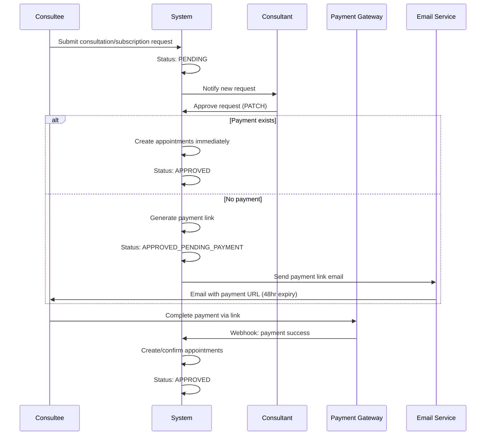

# Approval Payments Workflow

## Overview

The **Approval Payments** feature enables consultants to approve consultation and subscription requests before payment, generating a payment link for consultees to complete payment within 48 hours. This addresses the business requirement of allowing consultants to reserve slots while awaiting payment confirmation.

> Previously referred to as "Pay Later" in the codebase. The underlying code uses `approval-payment.ts` in `lib/payments/operations/`.

## Business Flow

## Documents

| # | Document | Description |
|---|----------|-------------|
| 01 | [Architecture](./01-architecture.md) | System components, approval state machine, payment link generation |
| 02 | [API Reference](./02-api-reference.md) | Endpoints for approval, payment link, status checking |
| 03 | [Cron Schedules](./03-cron-schedules.md) | Auto-expiry jobs for unpaid approval links |
| 04 | [Distributed Locking](./04-distributed-locking.md) | Race condition prevention during approval |
| 05 | [Email Notifications](./05-email-notifications.md) | Payment link emails, reminders, expiry notices |
| 06 | [Testing](./06-testing.md) | Test scenarios and verification steps |
| 07 | [Troubleshooting](./07-troubleshooting.md) | Common issues and debugging guide |
