# Cashfree Payments & Cashfree Payouts v2 (`CASHFREE`)

> **Status**: Planned #1 Full-Stack Backup / Dual-Rail Provider (Pay-ins + Payouts + Bank Verification + Splits)
> **Last Updated**: 2026-10-05
> **Official Citations**:
> - [Cashfree Payment Gateway API (`v2025-01-01`)](https://www.cashfree.com/docs/api-reference/payments/latest)
> - [Cashfree Node/TypeScript SDK (`cashfree-pg` v5)](https://www.cashfree.com/docs/payments/online/web/nodejs-sdk)
> - [Cashfree Payouts v2 API (`POST /payout/v1.2/directTransfer`)](https://www.cashfree.com/docs/api-reference/payouts/v2/payouts-api-v2)
> - [Cashfree Secure ID (Bank Account Penny Drop & UPI Reverse Penny Drop)](https://www.cashfree.com/docs/api-reference/vrs/v2/bav-v2)
> - [Cashfree Easy Split (Marketplace Split Settlements)](https://www.cashfree.com/docs/payments/split/easy-split)

---

## 1. Why Cashfree Is Our #1 Backup to Razorpay + RazorpayX

Cashfree is the **only** Indian payment infrastructure provider that maps 1:1 to every single product surface Familiarise uses on Razorpay and RazorpayX:

| Familiarise Capability | Razorpay / RazorpayX (Primary) | Cashfree Equivalent (`CASHFREE`) |
|---|---|---|
| **RBI Regulatory Licenses** | Final PA-O + PA-P + PA-CB (Dec 2025) | **First non-bank fintech** to receive both final **RBI PA** and **RBI PA-CB (Export & Import)** licenses (July 2024) |
| **Domestic & Intl Checkout** | `POST /v1/orders` + `checkout.js` (`2.0%` domestic / `3.0%` intl) | `POST /pg/orders` + `@cashfreepayments/cashfree-js` (`1.95%` domestic cards, `0%` UPI, `2.99%` intl cards across 140+ currencies + PayPal) |
| **Refunds (Idempotent)** | `POST /v1/payments/:id/refund` (`X-Refund-Idempotency`) | `POST /pg/orders/{order_id}/refunds` (`refund_id` body idempotency + `x-idempotency-key` header, `refund_speed: "STANDARD" \| "INSTANT"`) |
| **Disputes API & Webhooks** | `/v1/disputes` + `payment.dispute.*` | `/pg/disputes` + `DISPUTE_CREATED`, `DISPUTE_UPDATED`, `DISPUTE_CLOSED` |
| **Consultant & Org Payouts** | RazorpayX `POST /v1/payouts` (`X-Payout-Idempotency`) | **Cashfree Payouts v2** `POST /payout/v1.2/directTransfer` (`transfer_id` idempotency, 24×7 IMPS/UPI/NEFT/RTGS) |
| **Bank & UPI Ownership Verification** | RazorpayX `/v1/fund_accounts/validations` (Penny Drop & `upi_intent` RPD) | **Cashfree Secure ID (Verification Suite)**: `POST /verification/bank-account/sync` (Penny Drop / Penniless) & `POST /verification/reverse-penny-drop` (UPI Intent RPD) |
| **Marketplace Split Settlements** | Razorpay Route (not used due to KYC friction) | **Cashfree Easy Split** (`0.1%–0.2%` split fee vs Razorpay Route `0.25%`) |

---

## 2. End-to-End Architecture Mapping to Familiarise

```mermaid
flowchart TD
    subgraph "1. Pay-In Pipeline (Single-Writer Invariant)"
        Client["Client Browser (@cashfreepayments/cashfree-js)"] -->|"1. POST /api/checkout"| Server["Familiarise Checkout Route"]
        Server -->|"2. Create Payment (PENDING, BigInt paise) + POST /pg/orders"| CF_PG["Cashfree PG (x-api-version: 2025-01-01)"]
        CF_PG -->|"3. Return payment_session_id + cf_order_id"| Client
        Client -->|"4. cashfree.checkout({ paymentSessionId })"| CF_PG
        CF_PG -->|"5a. Webhook: PAYMENT_SUCCESS_WEBHOOK"| Webhook["POST /api/webhooks/cashfree"]
        Client -->|"5b. Return callback: GET /pg/orders/{order_id}/payments"| Verify["POST /api/checkout/verify-cashfree"]
        Webhook -->|"6. Verify x-webhook-signature + routeCapturedPayment()"| Confirm["Single-Writer handlePaymentSuccess (Serializable $transaction)"]
        Verify -->|"6. Prove payment_status === SUCCESS + routeCapturedPayment()"| Confirm
    end

    subgraph "2. Payout Pipeline (PayoutProvider Fallback)"
        Batch["Approved ConsultantPayout / OrganizationPayout"] -->|"POST /payout/v1.2/directTransfer (transfer_id = payout.id)"| CF_Payout["Cashfree Payouts v2"]
        CF_Payout -->|"TRANSFER_SUCCESS / TRANSFER_FAILED / TRANSFER_REVERSED"| PayoutHook["handleCashfreePayoutWebhook"]
    end
```

---

## 3. Key API Differences Between Razorpay and Cashfree (Critical Watch-Outs)

> [!WARNING]
> **1. Major Units (`Rupees`) at the Cashfree API Boundary vs. `BigInt` Paise in Postgres**:
> - Razorpay takes integer **paise** (`50000` = ₹500.00).
> - Cashfree PG (`order_amount`, `refund_amount`) and Cashfree Payouts (`transfer_amount`) take **decimal major units (Rupees)** up to 2 decimal places (`500.00`).
> - **Doctrine Rule**: All Familiarise database columns (`Payment.amount`, `Refund.amountPaise`, `ConsultantPayout.amount`) MUST remain **`BigInt` paise**. Convert at the Cashfree HTTP boundary only:
>   - Outbound to Cashfree: `Number(amountPaise) / 100` (formatted to 2 decimal places)
>   - Inbound from Cashfree: `BigInt(Math.round(Number(cfAmount) * 100))`

| Aspect | Razorpay | Cashfree (`v2025-01-01`) |
|---|---|---|
| **Auth Headers** | HTTP Basic Auth (`key_id:key_secret`) | `x-client-id`, `x-client-secret`, `x-api-version: "2025-01-01"`, `x-idempotency-key` |
| **Order Amount Unit** | Integer **paise** (`100000` = ₹1,000) | Decimal **rupees** (`1000.00` = ₹1,000; min `₹1.00`) |
| **Client Checkout Token** | `order_id` (`order_...`) passed to `checkout.js` | **`payment_session_id`** (`session_...`) passed to `@cashfreepayments/cashfree-js` |
| **Webhook Signature Formula** | `HMAC-SHA256(rawBody, webhookSecret)` in **hex** | `HMAC-SHA256(timestamp + rawBody, clientSecret)` in **base64** (`x-webhook-timestamp` + `x-webhook-signature`) |
| **Order Tags / Metadata Limit** | `notes`: max **15** key-value pairs (`<= 256` chars) | `order_tags`: max **10** string key-value pairs (`<= 256` chars) |

---

## 4. Environment Variables (When Enabled)

| Variable | Purpose |
|---|---|
| `CASHFREE_APP_ID` | Cashfree Payment Gateway Client ID (`x-client-id`) |
| `CASHFREE_SECRET_KEY` | Cashfree Payment Gateway Secret Key (`x-client-secret`, also used for webhook HMAC) |
| `CASHFREE_ENV` | `"SANDBOX"` (`https://sandbox.cashfree.com/pg`) or `"PRODUCTION"` (`https://api.cashfree.com/pg`) |
| `CASHFREE_PAYOUT_CLIENT_ID` | Cashfree Payouts v2 Client ID |
| `CASHFREE_PAYOUT_CLIENT_SECRET` | Cashfree Payouts v2 Client Secret |
| `CASHFREE_VERIFICATION_CLIENT_ID` | Cashfree Secure ID (Bank Account / Reverse Penny Drop) Client ID |
| `CASHFREE_VERIFICATION_SECRET` | Cashfree Secure ID Secret Key |

---

## 5. Related References

- **Finance Skill Reference**: [`.claude/skills/finance/references/gateways/cashfree.md`](../../../../.claude/skills/finance/references/gateways/cashfree.md)
- **Subagent**: [`.claude/agents/cashfree-integration.md`](../../../../.claude/agents/cashfree-integration.md)
- **Gateway Evaluation (2026)**: [`../gateway-evaluation-2026.md`](../gateway-evaluation-2026.md)
