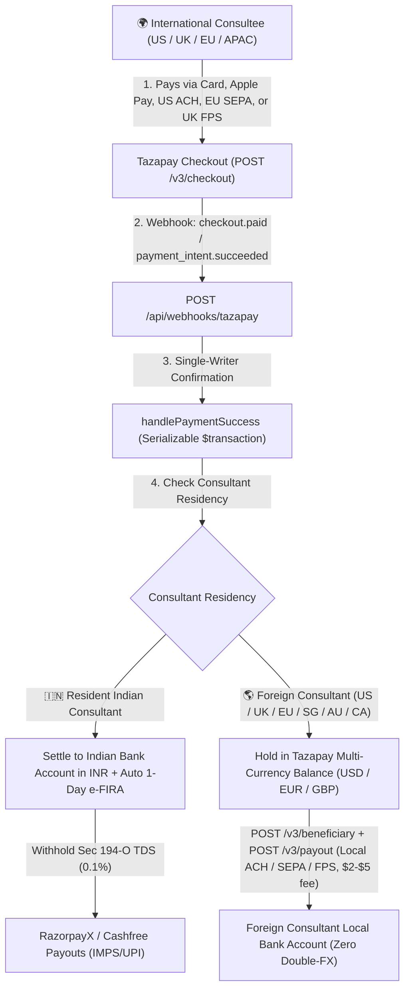

# Tazapay Cross-Border Checkout & Global Consultant Payouts (`TAZAPAY`)

> **Status**: Planned Global Marketplace Gateway (Cross-Border Pay-ins + Foreign Non-Indian Consultant Payouts)
> **Last Updated**: 2026-10-05
> **Official Citations**:
> - [Tazapay API v3 Reference (`https://docs.tazapay.com`)](https://docs.tazapay.com/reference/introduction)
> - [Tazapay Checkout Session API (`POST /v3/checkout`)](https://docs.tazapay.com/reference/create-checkout)
> - [Tazapay Beneficiary & Payouts API (`POST /v3/beneficiary`, `POST /v3/payout`)](https://docs.tazapay.com/reference/create-payout)
> - [Tazapay Local Collection Methods (80+ Countries)](https://docs.tazapay.com/docs/local-payment-methods)

---

## 1. Why Tazapay Unlocks Global Consultants for Familiarise

Currently, Familiarise can accept international consultee payments via Razorpay (settling in INR), but **cannot onboard or pay non-Indian consultants** (US, UK, EU, Singapore, Australia, Canada, UAE) because:
1. **RazorpayX is strictly INR-only** (it cannot wire USD/EUR/GBP to foreign bank accounts).
2. **Stripe Connect Cross-Border Payouts does NOT support India (`IN`)** as a recipient country and requires a non-Indian platform entity.
3. **Remitting outbound from an Indian bank account** triggers a **4%–6% double-FX loss** (`USD → INR → USD`), **$15–$30 SWIFT fees**, **20% Indian Section 393 (`§393(2) Table Sl.17`, payment code `1057`; pre-April 1, 2026: Section 195) withholding** (unless the foreign mentor obtains a Tax Residency Certificate + files digital **Form 10F** on the Indian income tax portal), and per-remittance **Form 145 / CA-certified Form 146** (pre-April 1, 2026: **Form 15CA / Form 15CB**) filings.

**Tazapay solves both sides of the cross-border marketplace**:
- **Licensed & Consulting/Marketplace-Friendly**: Regulated by the Monetary Authority of Singapore (MAS Major Payment Institution), FinCEN (US MSB), FINTRAC (Canada), and partnered with Cashfree (RBI PA-CB) for India settlements. Explicitly supports **1:1 consulting, edtech, live tutoring, and two-sided marketplaces**.
- **80+ Local Payment Methods for Global Consultees**: Collects via International Cards (Visa, Mastercard, Amex, Apple Pay, Google Pay) AND low-cost local bank rails (**US ACH**, **EU SEPA**, **UK Faster Payments**, **Brazil Pix**, **Singapore PayNow**, **UPI**).
- **Split-Corridor Settlement & Treasury**:
  - **When the Consultant is in India (`RESIDENT`)**: Tazapay settles the net amount in **INR** to Familiarise's Indian bank account within **T+1–T+2 days** with an automated **1-day e-FIRA** (via its RBI PA-CB partner), and RazorpayX / Cashfree Payouts disburses to the Indian consultant with Section 393 (`§393(1) Table Sl.8(v)`, code `1035` / pre-cutover Section 194-O) TDS.
  - **When the Consultant is Outside India (`NON_RESIDENT`)**: Tazapay holds the collected funds in a **multi-currency treasury balance (`USD`, `EUR`, `GBP`, `SGD`, `AUD`, `CAD`)** and disburses directly to the foreign consultant's local bank account via `POST /v3/payout` (`ACH` in US, `SEPA` in EU, `FPS` in UK) for a flat **$2–$5 local payout fee** — **eliminating the `Foreign Buyer → INR → Foreign Consultant` double-FX conversion!**

---

## 2. Architecture & Treasury Flow

---

## 3. Core Tazapay v3 API Endpoints

| Capability | Endpoint | Key Parameters & Behavior |
|---|---|---|
| **Authentication** | All `/v3/*` endpoints | HTTP Basic Auth: `Authorization: Basic base64(TAZAPAY_API_KEY + ":" + TAZAPAY_API_SECRET)` |
| **Create Checkout Session** | `POST https://service.tazapay.com/v3/checkout` (Sandbox: `service-sandbox.tazapay.com`) | `{ invoice_currency, amount (in subunits/cents!), customer_details: { name, email, country }, success_url, cancel_url, webhook_url, payment_methods, reference_id }`. Note: Tazapay v3 uses **integer subunits** (`10000` = `$100.00` or `₹100.00`), matching our `BigInt` subunit convention! |
| **Create Beneficiary (Consultant)** | `POST /v3/beneficiary` | Registers a consultant's local bank account (`type: "individual" \| "business"`, `name`, `email`, `country`, `currency`, `destination_details.bank: { account_number / iban, bank_codes: { aba_code / sort_code / bic_code / ifsc } }`) → returns `beneficiary_id` (`bnf_...`). |
| **Create Global Payout** | `POST /v3/payout` | `{ purpose: "PYR003" (professional/consulting services), amount (integer subunits), currency, beneficiary_id: "bnf_...", payout_type: "local" \| "swift", holding_currency, reference_id: payout.id }` → returns `po_...`. |
| **Create Refund** | `POST /v3/refund` | `{ payment_intent: "pi_...", amount, reason, reference_id: refund.id }` → returns `rf_...`. |

---

## 4. Pricing Summary

| Transaction Type | Tazapay Fee | Notes |
|---|---|---|
| **Local Payment Methods** (US ACH, EU SEPA, UK FPS, PayNow, Pix) | **0.8% – 1.8% + \$0.30** | Zero chargeback risk on push bank transfers; highest conversion for packages > \$100 |
| **International Cards** (Visa, Mastercard, Amex, Apple Pay, Google Pay) | **3.5% – 3.8% + \$0.50** | Includes global acquiring & 3DS2 orchestration |
| **FX Conversion Margin** | **1.5% – 2.0%** over mid-market | **0% FX** when collecting USD and paying out USD to a US consultant! |
| **Local Payout to Foreign Consultant** (`POST /v3/payout`, `payout_type: "local"`) | **\$2 – \$5 flat per payout** | Supports 70+ countries (US ACH, UK Faster Payments, EU SEPA, SG FAST, AU BECS, CA EFT) |
| **SWIFT Payout** (`payout_type: "swift"`) | **\$15 – \$25 flat per payout** | Used for 100+ additional countries without local rail coverage |

---

## 5. Related References

- **Finance Skill Reference**: [`.claude/skills/finance/references/gateways/tazapay.md`](../../../../.claude/skills/finance/references/gateways/tazapay.md)
- **Subagent**: [`.claude/agents/tazapay-global-payouts.md`](../../../../.claude/agents/tazapay-global-payouts.md)
- **Gateway Evaluation (2026)**: [`../gateway-evaluation-2026.md`](../gateway-evaluation-2026.md)
