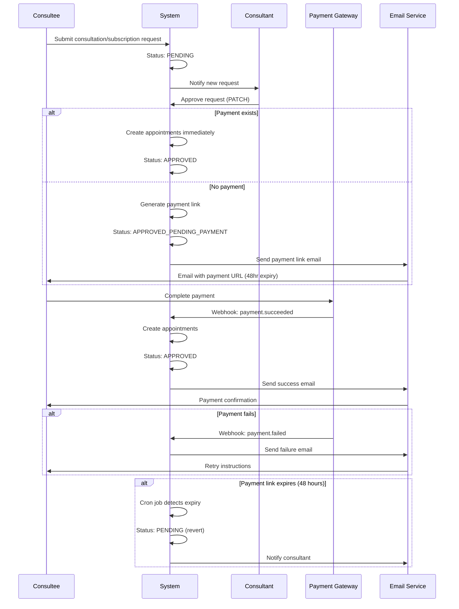

# Payment Approval Workflow - Pay Later Feature

## Overview

The **Pay Later** feature enables consultants to approve consultation and subscription requests before payment, generating a payment link for consultees to complete payment within 48 hours. This addresses the business requirement of allowing consultants to reserve slots while awaiting payment confirmation.

## Business Flow



## Key Features

### 1. **Triple-Layer Race Condition Protection**
Prevents duplicate payment links under high concurrency:
- **Layer 1**: Upstash Redis distributed locks (Redlock algorithm)
- **Layer 2**: Prisma serializable transactions
- **Layer 3**: Application-level idempotency checks

### 2. **Email Notification System**
Automated emails at every payment stage:
- Payment link email (with 48-hour countdown)
- Payment success confirmation
- Payment failure with retry instructions

### 3. **Real-Time Dashboard Updates**
Three dashboards with live payment status:
- **Consultant**: Payment status badges on requests table
- **Consultee**: Pending payments widget on home page
- **Admin**: Comprehensive approval payments monitor

### 4. **Automated Expiry Management**
Cron job to handle expired payment links:
- Runs every hour
- Detects payment links older than 48 hours
- Reverts status from `APPROVED_PENDING_PAYMENT` → `PENDING`
- Notifies consultants of expired requests

## Status Enum Reference

| Status | Description | User Action |
|--------|-------------|-------------|
| `PENDING` | Initial state after request submission | Consultant needs to approve |
| `APPROVED_PENDING_PAYMENT` | Approved, awaiting payment | Consultee needs to pay within 48hrs |
| `APPROVED` | Paid and confirmed | Slots allocated, ready for scheduling |
| `REJECTED` | Declined by consultant | Request closed |

## Payment Link Lifecycle

```
Request Submitted
       ↓
   [PENDING] ← ─ ─ ─ ─ ─ ─ ─ ┐
       ↓                      │
Consultant Approves           │
       ↓                      │
Generate Payment Link         │ Expires after 48hrs
       ↓                      │ (Cron job reverts)
[APPROVED_PENDING_PAYMENT] ─ ┘
       ↓
Payment Completed
       ↓
   [APPROVED]
       ↓
Slots Allocated
```

## Implementation Components

### Backend
- **Approval Endpoints**: `app/api/events/{consultations|subscriptions}/[id]/route.ts`
- **Webhook Handlers**: `lib/payments/webhooks/handlers.ts`
- **Distributed Locking**: `utils/appointmentlock.ts`
- **Email Service**: `lib/email.ts`
- **Cron Jobs**: `app/api/cleanup/approval-payments/route.ts`

### Frontend
- **Consultant Dashboard**: `PaymentRequiredBadge` component
- **Consultee Dashboard**: `PendingPaymentsWidget` component
- **Admin Dashboard**: Approval payments monitor page

### Infrastructure
- **Redis**: Upstash Redis (serverless, REST-based)
- **Payment Gateway**: Stripe (configurable)
- **Email Provider**: Resend API with React Email templates

## Environment Variables

```bash
# Redis (Distributed Locking)
UPSTASH_REDIS_REST_URL=https://your-redis-instance.upstash.io
UPSTASH_REDIS_REST_TOKEN=your_token_here

# Email (Resend)
RESEND_API_KEY=re_your_api_key_here

# Payment (Stripe)
STRIPE_SECRET_KEY=sk_test_...
STRIPE_PUBLISHABLE_KEY=pk_test_...
NEXT_PUBLIC_APP_URL=https://familiarise.com
```

## Quick Links

- [Architecture & Technical Details](./ARCHITECTURE.md)
- [Distributed Locking Implementation](./DISTRIBUTED_LOCKING.md)
- [Email Notification System](./EMAIL_NOTIFICATIONS.md)
- [Cron Schedules & Cleanup](./CRON_SCHEDULES.md)
- [API Reference](./API_REFERENCE.md)
- [UI Components Guide](./UI_COMPONENTS.md)
- [Testing Guide](./TESTING.md)
- [Troubleshooting](./TROUBLESHOOTING.md)

## Related PRs

- **PR #216**: Initial payment algorithm implementation
- **PR #225**: Race condition protection (Phase 1)
- **Current PR**: Email integration, UI components, and real-time updates (Phases 2-4)

## Security Considerations

1. **Race Condition Protection**: Triple-layer approach prevents duplicate payment link generation
2. **Payment Link Expiry**: 48-hour automatic expiry reduces security window
3. **Webhook Validation**: Stripe signature verification on all webhook events
4. **Email Security**: Payment URLs are one-time use, invalidated after successful payment
5. **Lock TTL**: 30-second distributed lock prevents indefinite blocking

## Performance Metrics

- **Lock Acquisition Time**: ~50-100ms (Upstash REST API latency)
- **Transaction Duration**: ~500ms-2s (depending on appointment creation complexity)
- **Email Delivery**: ~1-3 seconds (Resend API)
- **Dashboard Auto-Refresh**:
  - Consultee widget: Every 2 minutes
  - Admin monitor: Every 1 minute
  - React Query refetch on window focus

## Support & Maintenance

For issues or questions:
1. Check [Troubleshooting Guide](./TROUBLESHOOTING.md)
2. Review logs in admin panel: `/dashboard/admin/payments`
3. Monitor Redis health: Upstash console
4. Check email delivery: Resend dashboard
