# RazorpayX Payouts & Fund Account Validation Implementation Guide

> Technical reference for consultant and organization payouts in this repository using **RazorpayX Payouts** (`Contacts` → `Fund Accounts` → `Fund Account Validations` → `Payouts`).
> For the B2B/enterprise ledger and batch pipeline, also see [`docs/enterprise/10-money-and-ledger/07-payout-pipeline.md`](../../enterprise/10-money-and-ledger/07-payout-pipeline.md) and [`06-earnings-lifecycle.md`](../../enterprise/10-money-and-ledger/06-earnings-lifecycle.md).

**Last Updated**: 2026-10-05

---

## 1. Architecture Overview

Familiarise uses **RazorpayX Payouts** (`https://api.razorpay.com/v1/contacts`, `/v1/fund_accounts`, `/v1/fund_accounts/validations`, `/v1/payouts`) to disburse net earnings to Indian consultants and organizations.

```mermaid
flowchart TD
    subgraph "1. Payee Onboarding & Verification"
        A["Consultant / Org Adds Bank or UPI"] --> B["POST /v1/contacts (cont_...)"]
        B --> C["POST /v1/fund_accounts (fa_...)"]
        C --> D{"Verification Method"}
        D -->|"Bank Account (Penny Drop)"| E["POST /v1/fund_accounts/validations (fav_...)"]
        D -->|"UPI Intent (Reverse Penny Drop)"| F["POST /v1/orders (₹1) + UPI Payment + Auto-Refund"]
        E --> G["Webhook: fund_account.validation.completed"]
        F --> H["Webhook: payment.captured (extract VPA & name)"]
        G --> I["ConsultantBankAccount.isVerified = true"]
        H --> I
    end

    subgraph "2. Earnings & Payout Lifecycle"
        J["Payment Captured"] --> K["ConsultantEarnings (PENDING / ON_HOLD)"]
        K -->|"Hold Expires (24h–168h)"| L["Earnings (READY)"]
        L -->|"Batch / Instant Payout"| M["Withhold Sec 194-O TDS + Create Payout (BATCHED)"]
        M -->|"POST /v1/payouts + X-Payout-Idempotency"| N["RazorpayX Processing (payout.initiated)"]
        N -->|"payout.processed"| O["Payout COMPLETED + Earnings PAID"]
        N -->|"payout.failed / reversed / rejected"| P["Payout FAILED + Restore Earnings to READY + Reverse TDS"]
    end
```



---

## 2. Canonical Source Files

| File | Responsibility |
|---|---|
| [`lib/payments/payouts/razorpay-payouts.ts`](../../../lib/payments/payouts/razorpay-payouts.ts) | RazorpayX REST client: `createRazorpayContact`, `createRazorpayFundAccount`, `createRazorpayPayout`, `fetchRazorpayPayout`, `selectPayoutMode`, `boundPayoutIdempotencyKey`, `assertNoTestKeysInLivePayouts` |
| [`lib/payments/payouts/reverse-penny-drop.ts`](../../../lib/payments/payouts/reverse-penny-drop.ts) | Bank & UPI ownership verification via Penny Drop (`POST /v1/fund_accounts/validations`) and Reverse Penny Drop (₹1 UPI Intent order + auto-refund) |
| [`lib/payments/payouts/processor.ts`](../../../lib/payments/payouts/processor.ts) | Payout execution, Section 194-O TDS integration, and `handlePayoutWebhook` state transitions |
| [`lib/payments/payouts/payout-gateway-lookup.ts`](../../../lib/payments/payouts/payout-gateway-lookup.ts) | Reconciler polling helper (`lookupRazorpayPayout`, `mapRazorpayPayoutStatus`) |
| [`lib/payments/payouts/tax-calculator.ts`](../../../lib/payments/payouts/tax-calculator.ts) | Section 194-O TDS withholding (`0.1%` above ₹5,00,000 FY threshold for Resident Individual/HUF with PAN; `5%` under Sec 206AA without PAN) |
| [`lib/payments/payouts/constants.ts`](../../../lib/payments/payouts/constants.ts) | Hold periods (`24h` consultation/class, `48h` webinar, `168h` subscription), minimum payout (`₹500`), auto-approve thresholds, SAC `999293` |
| [`app/api/webhooks/razorpay-dispatch.ts`](../../../app/api/webhooks/razorpay-dispatch.ts) | Dispatches `payout.*` and `fund_account.validation.*` webhook events |

---

## 3. Contacts & Fund Accounts (`lib/payments/payouts/razorpay-payouts.ts`)

### 3.1 Contacts (`POST /v1/contacts`)
- **Payload**: `{ name, email, contact, type: "vendor", reference_id, notes }`.
- **Composite Idempotency**: RazorpayX deduplicates contacts when `{ name, email, contact, type, reference_id }` match an existing contact, returning the existing `cont_...` ID. Changing any field creates a new `cont_...`.
- **No `DELETE` endpoint**: Contacts cannot be deleted, only deactivated via `PATCH /v1/contacts/:id` with `{ active: false }`.

### 3.2 Fund Accounts (`POST /v1/fund_accounts`)
- **Bank Account**: `{ contact_id, account_type: "bank_account", bank_account: { name, ifsc, account_number } }`.
- **UPI (VPA)**: `{ contact_id, account_type: "vpa", vpa: { address } }`.
- **Deduplication**: Identical details under the same `contact_id` return the existing `fa_...` ID.
- **Immutability**: Fund account details cannot be edited once created; deactivate (`PATCH /v1/fund_accounts/:id { active: false }`) and create a new Fund Account when a consultant changes bank details.

---

## 4. Fund Account Validation: Penny Drop & Reverse Penny Drop (`lib/payments/payouts/reverse-penny-drop.ts`)

### 4.1 Penny Drop (`POST /v1/fund_accounts/validations`)
Used to verify bank accounts (`account_type: "bank_account"`) and VPAs:
```json
{
  "account_number": "<RAZORPAYX_ACCOUNT_NUMBER>",
  "fund_account": { "id": "fa_..." },
  "amount": 100,
  "currency": "INR",
  "notes": { "consultantProfileId": "..." }
}
```
- **Important Official Behavior**:
  - **Not available in Test Mode**: `POST /v1/fund_accounts/validations` is a live-banking operation and is not supported in RazorpayX test mode.
  - **₹1.00 is NOT reversed**: For bank accounts, RazorpayX transfers ₹1.00 (`100` paise) via IMPS to the beneficiary's bank account so the bank returns the registered account holder name; the ₹1.00 remains with the beneficiary.
  - **`status: "completed"` ≠ valid account**: `status: "completed"` only means the check finished. Always verify `results.account_status === "active"` (vs `"invalid"`) and compare `results.registered_name` using fuzzy name matching (`fuzzyNameMatch` in `reverse-penny-drop.ts`).
  - **Field name**: Official RazorpayX responses and webhooks (`fund_account.validation.completed`, `fund_account.validation.failed`) use `results: { account_status, registered_name }`. Our schema and handlers check `results ?? validation_results` for resilience.

### 4.2 Reverse Penny Drop (UPI Intent Flow)
Used when a consultant verifies via UPI Intent:
1. `initiateReversePennyDrop()` creates a ₹1.00 (`100` paise) Razorpay Order (`POST /v1/orders`) with `notes.purpose = "REVERSE_PENNY_DROP"`.
2. Consultant pays ₹1.00 in their UPI app.
3. On `payment.captured`, `completeReversePennyDrop()` extracts the payer's VPA (`payment.vpa ?? payment.upi?.vpa`), creates the Contact + VPA Fund Account (`fa_...`), marks `ConsultantBankAccount.isVerified = true`, and automatically refunds the ₹1.00 payment.

---

## 5. Payout Execution & Idempotency (`POST /v1/payouts`)

### 5.1 Mandatory `X-Payout-Idempotency` Header
Since **15 March 2025**, RazorpayX requires the `X-Payout-Idempotency` header on every `POST /v1/payouts` request:
- **Constraints**: **4 to 36 characters**, allowed charset `[A-Za-z0-9 _-]`.
- **Deterministic Folding (`boundPayoutIdempotencyKey`)**: Internal payout keys (`payout_<uuid>` = 43 chars, or `payout_<profileId>_<batchId>` = 72 chars) exceed 36 characters. `boundPayoutIdempotencyKey()` in `lib/payments/payouts/razorpay-payouts.ts` deterministically folds keys longer than 36 characters into `pout_<29-hex-sha256>` (34 chars) so retries always map to the exact same RazorpayX idempotency slot.
- **HTTP `409 Conflict`**: Returned if the same idempotency key is reused with a different request body or while the original request is still in flight.

### 5.2 Payout Modes, Limits & Field Rules
| Mode | Min Amount | Max Amount per Txn | Availability | Selection Rule (`selectPayoutMode`) |
|---|---|---|---|---|
| `UPI` | ₹1 | **₹1,00,000** (₹1L) | 24×7 instant | Selected when Fund Account is `vpa` |
| `IMPS` | ₹1 | **₹5,00,000** (₹5L) | 24×7 instant | Selected for `bank_account` when `amount <= ₹5,00,000` |
| `NEFT` | ₹1 | No upper limit | 24×7 half-hourly batches | Selected for `bank_account` when `amount > ₹5,00,000` |
| `RTGS` | **₹2,00,000** (₹2L) | No upper limit | 24×7 real-time | Available for high-value transfers `>= ₹2,00,000` |

- **`purpose`**: Must match an active purpose on the RazorpayX account (`"payout"`, `"refund"`, `"cashback"`, `"salary"`, `"utility bill"`, `"vendor bill"` — note the space in `"utility bill"` and `"vendor bill"`). We pass `"payout"`.
- **`narration`**: Max **30 characters**, **alphanumeric and spaces only** (no hyphens, underscores, or punctuation). Appears on the consultant's bank statement.
- **`reference_id`**: Max **40 characters**, set to `payout.id`.

---

## 6. Payout Status Machine & Webhooks

| RazorpayX Status | Webhook Event(s) | Internal `PayoutStatus` | Handler Action (`lib/payments/payouts/processor.ts`) |
|---|---|---|---|
| `queued` | `payout.queued` | `PENDING` | Queued due to low balance; waits for balance top-up |
| `pending` | `payout.pending` | `PENDING` | Awaiting RazorpayX workflow approval |
| `processing` | `payout.initiated`, `payout.updated` | `PROCESSING` | In flight with partner bank |
| `processed` | `payout.processed`, `payout.updated` | `COMPLETED` | Stores `utr`, marks `ConsultantEarnings` as `PAID`, finalizes ledger |
| `failed` | `payout.failed` | `FAILED` | Extracts reason from `failure_reason ?? status_details.description ?? status_details.reason`; restores earnings to `READY` and reverses TDS |
| `reversed` | `payout.reversed` | `FAILED` | Bank returned funds after processing; restores earnings to `READY` and reverses TDS |
| `rejected` | `payout.rejected` | `FAILED` | Rejected in approval workflow; restores earnings to `READY` |
| `cancelled` | `payout.updated` | `CANCELLED` | Queued payout cancelled before processing |

---

## Appendix: Why RazorpayX Payouts Was Chosen Over Razorpay Route

Earlier design drafts considered **Razorpay Route** (`LinkedAccount` `acc_...` + `transfers` `trf_...`). Familiarise deliberately uses **RazorpayX Payouts** instead because:
1. **No Consultant KYC Friction**: Razorpay Route requires onboarding each consultant as a sub-merchant Linked Account with full Razorpay KYC. With RazorpayX Payouts, the platform only collects bank/UPI details and verifies ownership via Penny Drop or Reverse Penny Drop.
2. **Wallet, Credit & B2B Invoice Funding**: Bookings can be funded by organization wallets, post-paid B2B invoices (`OrganizationInvoice`), or multi-leg payments where there is no single 1:1 consultee Razorpay payment to split via Route.
3. **Consolidated Weekly Batching & Section 194-O TDS**: RazorpayX lets us aggregate multiple `READY` earnings rows into a single weekly (or instant) payout, compute cumulative FY Section 194-O TDS across all earnings cleanly in `lib/payments/payouts/tax-calculator.ts`, and disburse the exact post-TDS net amount in one transfer.
