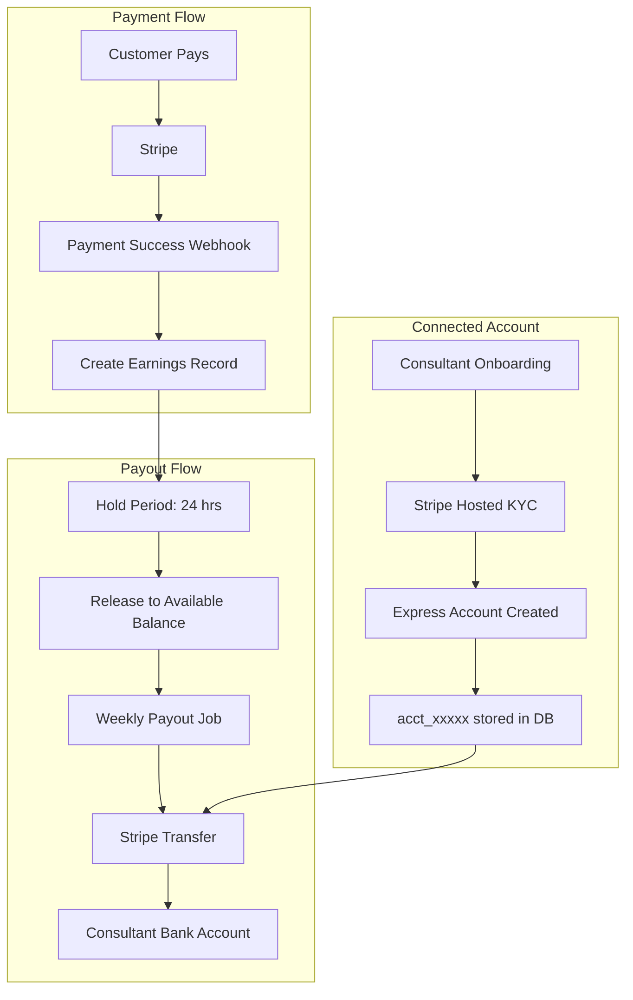

# Stripe Connect Payout Implementation Guide

## Overview

This document provides the technical implementation details for automating consultant payouts using Stripe Connect. It builds upon the existing payment infrastructure in the codebase.

**Current State**: No Stripe payout system implemented - manual transfers required
**Target State**: Automated payouts via Stripe Connect (Express accounts)

---

## Architecture Overview



---

## File Structure

```
lib/
|-- payments/
|   |-- core/
|   |   |-- stripe.ts               # Existing - Server-side Stripe client
|   |   +-- types.ts                # Existing - Add payout types
|   |-- payouts/
|   |   |-- index.ts                # NEW - Export all payout functions
|   |   |-- earnings-service.ts     # EXISTING - Works with both gateways
|   |   |-- payout-service.ts       # MODIFY - Add Stripe gateway support
|   |   |-- balance-service.ts      # EXISTING - Gateway agnostic
|   |   +-- stripe/
|   |       |-- connected-accounts.ts   # NEW - Connected account CRUD
|   |       |-- transfers.ts            # NEW - Transfer execution
|   |       +-- webhooks.ts             # NEW - Payout webhook handlers
|   +-- webhooks/
|       +-- stripe-handlers.ts      # MODIFY - Add earnings creation
|-- prisma/
|   +-- schema.prisma               # MODIFY - Stripe fields to LinkedAccount
+-- jobs/
    |-- release-earnings-hold.ts    # EXISTING - Gateway agnostic
    +-- process-weekly-payouts.ts   # MODIFY - Add Stripe support
```

---

## Database Schema

### Modifications to Existing Models

Add Stripe-specific fields to `prisma/schema.prisma`:

```prisma
// ============================================
// EXISTING MODELS - ADD STRIPE SUPPORT
// ============================================

/// LinkedAccount model - ADD stripeAccountId and stripeKycStatus
model LinkedAccount {
  id                  String               @id @default(uuid())

  // Linked to consultant
  consultantProfile   ConsultantProfile    @relation(fields: [consultantProfileId], references: [id], onDelete: Cascade)
  consultantProfileId String               @unique

  // Gateway account IDs (we store IDs, not actual bank details)
  razorpayAccountId   String?              @unique // acc_xxxxx (India)
  stripeAccountId     String?              @unique // acct_xxxxx (International)

  // Status for each gateway
  razorpayKycStatus   KycStatus?
  stripeKycStatus     KycStatus?
  stripeDetailsSubmitted Boolean           @default(false)
  stripePayoutsEnabled   Boolean           @default(false)

  // General status
  isActive            Boolean              @default(false)
  preferredGateway    PayoutGateway?       // Which gateway to use for payouts

  // Metadata (masked for display)
  displayName         String?              // "Chase ****4567"
  stripeBankLast4     String?              // Last 4 of bank account
  lastPayoutAt        DateTime?

  createdAt           DateTime             @default(now())
  updatedAt           DateTime             @updatedAt

  @@index([razorpayAccountId])
  @@index([stripeAccountId])
}

enum KycStatus {
  NOT_STARTED
  PENDING
  COMPLETED
  FAILED
  RESTRICTED       // Additional verification needed
}

/// Payout model - Stripe uses STRIPE_CONNECT gateway
enum PayoutGateway {
  RAZORPAY_ROUTE      // India payouts via Razorpay Route
  STRIPE_CONNECT      // International payouts via Stripe Connect
  BANK_TRANSFER       // Manual/fallback
}

/// ConsultantProfile - ADD country for gateway selection
model ConsultantProfile {
  // ... existing fields ...

  // Payout preferences
  country             String?              // ISO country code for gateway selection
  preferredCurrency   String?              // Preferred payout currency (USD, GBP, EUR)

  // Stripe specific
  stripeAccountId     String?              // Redundant with LinkedAccount for quick access

  // Relations
  linkedAccount       LinkedAccount?
  earnings            ConsultantEarnings[]
  payouts             Payout[]
}
```

---

## Core Implementation

### 1. Stripe Client Configuration

```typescript
// lib/payments/core/stripe.ts

import Stripe from "stripe";

if (!process.env.STRIPE_SECRET_KEY) {
  throw new Error("STRIPE_SECRET_KEY is required");
}

const stripe = new Stripe(process.env.STRIPE_SECRET_KEY, {
  apiVersion: "2023-10-16",
  typescript: true,
});

export default stripe;

// Helper for Connect operations
export const stripeConnect = {
  /**
   * Create an Express connected account
   */
  async createAccount(params: {
    email: string;
    country: string;
    metadata?: Record<string, string>;
  }): Promise<Stripe.Account> {
    return stripe.accounts.create({
      type: "express",
      country: params.country,
      email: params.email,
      metadata: params.metadata,
      capabilities: {
        card_payments: { requested: true },
        transfers: { requested: true },
      },
    });
  },

  /**
   * Create onboarding link for consultant
   */
  async createAccountLink(
    accountId: string,
    refreshUrl: string,
    returnUrl: string,
  ): Promise<Stripe.AccountLink> {
    return stripe.accountLinks.create({
      account: accountId,
      refresh_url: refreshUrl,
      return_url: returnUrl,
      type: "account_onboarding",
    });
  },

  /**
   * Get account details
   */
  async getAccount(accountId: string): Promise<Stripe.Account> {
    return stripe.accounts.retrieve(accountId);
  },

  /**
   * Create a transfer to connected account
   */
  async createTransfer(params: {
    amount: number;
    currency: string;
    destination: string;
    metadata?: Record<string, string>;
  }): Promise<Stripe.Transfer> {
    return stripe.transfers.create({
      amount: params.amount,
      currency: params.currency.toLowerCase(),
      destination: params.destination,
      metadata: params.metadata,
    });
  },

  /**
   * Get transfer details
   */
  async getTransfer(transferId: string): Promise<Stripe.Transfer> {
    return stripe.transfers.retrieve(transferId);
  },
};
```

---

### 2. Connected Account Service

```typescript
// lib/payments/payouts/stripe/connected-accounts.ts

import { prisma } from "@/lib/prisma";
import stripe, { stripeConnect } from "@/lib/payments/core/stripe";

export class StripeConnectedAccountService {
  /**
   * Create a new Stripe Connected Account for a consultant
   */
  async createConnectedAccount(consultantProfileId: string): Promise<{
    accountId: string;
    onboardingUrl: string;
  }> {
    // Get consultant details
    const consultant = await prisma.consultantProfile.findUnique({
      where: { id: consultantProfileId },
      include: { user: true, linkedAccount: true },
    });

    if (!consultant) {
      throw new Error("Consultant not found");
    }

    // Check if already has Stripe account
    if (consultant.linkedAccount?.stripeAccountId) {
      throw new Error("Consultant already has a Stripe account");
    }

    // Determine country from consultant profile
    const country = consultant.country || "US";

    // Create Express account
    const account = await stripeConnect.createAccount({
      email: consultant.user.email,
      country,
      metadata: {
        consultantProfileId,
        platform: "familiarise",
      },
    });

    // Create or update LinkedAccount
    await prisma.linkedAccount.upsert({
      where: { consultantProfileId },
      create: {
        consultantProfileId,
        stripeAccountId: account.id,
        stripeKycStatus: "NOT_STARTED",
        preferredGateway: "STRIPE_CONNECT",
      },
      update: {
        stripeAccountId: account.id,
        stripeKycStatus: "NOT_STARTED",
      },
    });

    // Update consultant profile for quick access
    await prisma.consultantProfile.update({
      where: { id: consultantProfileId },
      data: { stripeAccountId: account.id },
    });

    // Generate onboarding link
    const baseUrl = process.env.NEXT_PUBLIC_APP_URL;
    const accountLink = await stripeConnect.createAccountLink(
      account.id,
      `${baseUrl}/dashboard/payout-settings?refresh=true`,
      `${baseUrl}/dashboard/payout-settings?onboarding=complete`,
    );

    return {
      accountId: account.id,
      onboardingUrl: accountLink.url,
    };
  }

  /**
   * Generate new onboarding link (if previous expired or needs refresh)
   */
  async getOnboardingLink(consultantProfileId: string): Promise<string> {
    const linkedAccount = await prisma.linkedAccount.findUnique({
      where: { consultantProfileId },
    });

    if (!linkedAccount?.stripeAccountId) {
      throw new Error("No Stripe account found. Create one first.");
    }

    const baseUrl = process.env.NEXT_PUBLIC_APP_URL;
    const accountLink = await stripeConnect.createAccountLink(
      linkedAccount.stripeAccountId,
      `${baseUrl}/dashboard/payout-settings?refresh=true`,
      `${baseUrl}/dashboard/payout-settings?onboarding=complete`,
    );

    return accountLink.url;
  }

  /**
   * Sync account status from Stripe
   */
  async syncAccountStatus(stripeAccountId: string): Promise<void> {
    const account = await stripeConnect.getAccount(stripeAccountId);

    // Determine KYC status
    let kycStatus:
      | "NOT_STARTED"
      | "PENDING"
      | "COMPLETED"
      | "FAILED"
      | "RESTRICTED";

    if (account.details_submitted && account.payouts_enabled) {
      kycStatus = "COMPLETED";
    } else if (account.requirements?.currently_due?.length) {
      kycStatus = account.details_submitted ? "RESTRICTED" : "PENDING";
    } else if (account.requirements?.disabled_reason) {
      kycStatus = "FAILED";
    } else {
      kycStatus = "NOT_STARTED";
    }

    // Get bank account display info
    let displayName = null;
    let bankLast4 = null;

    if (account.external_accounts?.data?.length) {
      const bankAccount = account.external_accounts.data[0];
      if (bankAccount.object === "bank_account") {
        displayName = `${bankAccount.bank_name} ****${bankAccount.last4}`;
        bankLast4 = bankAccount.last4;
      }
    }

    // Update database
    await prisma.linkedAccount.update({
      where: { stripeAccountId },
      data: {
        stripeKycStatus: kycStatus,
        stripeDetailsSubmitted: account.details_submitted || false,
        stripePayoutsEnabled: account.payouts_enabled || false,
        displayName,
        stripeBankLast4: bankLast4,
        isActive: account.payouts_enabled || false,
      },
    });
  }

  /**
   * Check if consultant can receive payouts
   */
  async canReceivePayouts(consultantProfileId: string): Promise<{
    canReceive: boolean;
    reason?: string;
  }> {
    const linkedAccount = await prisma.linkedAccount.findUnique({
      where: { consultantProfileId },
    });

    if (!linkedAccount?.stripeAccountId) {
      return {
        canReceive: false,
        reason: "No Stripe account set up",
      };
    }

    if (!linkedAccount.stripePayoutsEnabled) {
      return {
        canReceive: false,
        reason: "Stripe account not fully verified",
      };
    }

    return { canReceive: true };
  }

  /**
   * Get dashboard link for consultant to manage their account
   */
  async getDashboardLink(stripeAccountId: string): Promise<string> {
    const loginLink = await stripe.accounts.createLoginLink(stripeAccountId);
    return loginLink.url;
  }

  /**
   * Delete connected account (if needed)
   */
  async deleteAccount(stripeAccountId: string): Promise<void> {
    await stripe.accounts.del(stripeAccountId);

    await prisma.linkedAccount.update({
      where: { stripeAccountId },
      data: {
        stripeAccountId: null,
        stripeKycStatus: null,
        stripeDetailsSubmitted: false,
        stripePayoutsEnabled: false,
        isActive: false,
      },
    });
  }
}

export const stripeConnectedAccountService =
  new StripeConnectedAccountService();
```

---

### 3. Transfer Service

```typescript
// lib/payments/payouts/stripe/transfers.ts

import { prisma } from "@/lib/prisma";
import { stripeConnect } from "@/lib/payments/core/stripe";
import type { EarningStatus, PayoutStatus } from "@prisma/client";

interface TransferResult {
  success: boolean;
  transferId?: string;
  error?: string;
}

export class StripeTransferService {
  /**
   * Create a transfer to consultant's connected account
   */
  async createTransfer(
    payoutId: string,
    connectedAccountId: string,
    amount: number,
    currency: string,
    earningIds: string[],
  ): Promise<TransferResult> {
    try {
      // Create the Stripe transfer
      const transfer = await stripeConnect.createTransfer({
        amount,
        currency: currency.toLowerCase(),
        destination: connectedAccountId,
        metadata: {
          payoutId,
          earningIds: earningIds.join(","),
          platform: "familiarise",
        },
      });

      // Update payout record
      await prisma.payout.update({
        where: { id: payoutId },
        data: {
          gatewayPayoutId: transfer.id,
          status: "PROCESSING",
          processedAt: new Date(),
        },
      });

      // Update all associated earnings
      await prisma.consultantEarnings.updateMany({
        where: { id: { in: earningIds } },
        data: {
          status: "PROCESSING",
          payoutId,
        },
      });

      return {
        success: true,
        transferId: transfer.id,
      };
    } catch (error) {
      console.error("Stripe transfer failed:", error);

      // Update payout as failed
      await prisma.payout.update({
        where: { id: payoutId },
        data: {
          status: "FAILED",
          failureReason:
            error instanceof Error ? error.message : "Unknown error",
        },
      });

      return {
        success: false,
        error: error instanceof Error ? error.message : "Transfer failed",
      };
    }
  }

  /**
   * Process payout for a single consultant
   */
  async processConsultantPayout(
    consultantProfileId: string,
  ): Promise<TransferResult> {
    // Get consultant's linked account
    const linkedAccount = await prisma.linkedAccount.findUnique({
      where: { consultantProfileId },
    });

    if (
      !linkedAccount?.stripeAccountId ||
      !linkedAccount.stripePayoutsEnabled
    ) {
      return {
        success: false,
        error: "Consultant not set up for Stripe payouts",
      };
    }

    // Get all available earnings for this consultant
    const availableEarnings = await prisma.consultantEarnings.findMany({
      where: {
        consultantProfileId,
        status: "AVAILABLE",
      },
    });

    if (availableEarnings.length === 0) {
      return {
        success: false,
        error: "No available earnings to pay out",
      };
    }

    // Calculate totals (group by currency)
    const totalAmount = availableEarnings.reduce(
      (sum, e) => sum + e.netAmount,
      0,
    );
    const currency = availableEarnings[0].currency; // Assume same currency

    // Minimum payout threshold (100 cents = $1)
    const MINIMUM_PAYOUT = 100;
    if (totalAmount < MINIMUM_PAYOUT) {
      return {
        success: false,
        error: `Below minimum payout threshold ($${MINIMUM_PAYOUT / 100})`,
      };
    }

    // Create payout record
    const payout = await prisma.payout.create({
      data: {
        consultantProfileId,
        amount: totalAmount,
        currency,
        gateway: "STRIPE_CONNECT",
        gatewayAccountId: linkedAccount.stripeAccountId,
        status: "PENDING",
      },
    });

    // Create the transfer
    const earningIds = availableEarnings.map((e) => e.id);
    return this.createTransfer(
      payout.id,
      linkedAccount.stripeAccountId,
      totalAmount,
      currency,
      earningIds,
    );
  }

  /**
   * Handle successful transfer webhook
   */
  async handleTransferPaid(transferId: string): Promise<void> {
    const transfer = await stripeConnect.getTransfer(transferId);

    // Find the payout
    const payout = await prisma.payout.findUnique({
      where: { gatewayPayoutId: transferId },
    });

    if (!payout) {
      console.error("Payout not found for transfer:", transferId);
      return;
    }

    // Update payout status
    await prisma.payout.update({
      where: { id: payout.id },
      data: {
        status: "SUCCEEDED",
        settledAt: new Date(),
      },
    });

    // Update all associated earnings
    await prisma.consultantEarnings.updateMany({
      where: { payoutId: payout.id },
      data: {
        status: "PAID",
      },
    });

    // Update linked account last payout time
    await prisma.linkedAccount.update({
      where: { consultantProfileId: payout.consultantProfileId },
      data: { lastPayoutAt: new Date() },
    });

    // TODO: Send notification to consultant
    // await notifyConsultantPayoutComplete(payout);
  }

  /**
   * Handle failed transfer webhook
   */
  async handleTransferFailed(
    transferId: string,
    failureMessage?: string,
  ): Promise<void> {
    const payout = await prisma.payout.findUnique({
      where: { gatewayPayoutId: transferId },
    });

    if (!payout) {
      console.error("Payout not found for failed transfer:", transferId);
      return;
    }

    // Update payout status
    await prisma.payout.update({
      where: { id: payout.id },
      data: {
        status: "FAILED",
        failureReason: failureMessage || "Transfer failed",
      },
    });

    // Revert earnings back to available for next payout cycle
    await prisma.consultantEarnings.updateMany({
      where: { payoutId: payout.id },
      data: {
        status: "AVAILABLE",
        payoutId: null,
      },
    });

    // TODO: Alert operations team
    // await alertOperationsTeam({ type: 'TRANSFER_FAILED', payout, reason: failureMessage });
  }

  /**
   * Get transfer status
   */
  async getTransferStatus(transferId: string): Promise<{
    status: string;
    amount: number;
    currency: string;
    created: Date;
  }> {
    const transfer = await stripeConnect.getTransfer(transferId);
    return {
      status: transfer.reversed ? "reversed" : "succeeded",
      amount: transfer.amount,
      currency: transfer.currency,
      created: new Date(transfer.created * 1000),
    };
  }
}

export const stripeTransferService = new StripeTransferService();
```

---

### 4. Webhook Handler

```typescript
// lib/payments/payouts/stripe/webhooks.ts

import { headers } from "next/headers";
import stripe from "@/lib/payments/core/stripe";
import { stripeConnectedAccountService } from "./connected-accounts";
import { stripeTransferService } from "./transfers";
import type Stripe from "stripe";

export class StripeConnectWebhookHandler {
  private webhookSecret: string;

  constructor() {
    this.webhookSecret = process.env.STRIPE_CONNECT_WEBHOOK_SECRET!;
    if (!this.webhookSecret) {
      throw new Error("STRIPE_CONNECT_WEBHOOK_SECRET is required");
    }
  }

  /**
   * Verify and parse webhook event
   */
  async verifyEvent(body: string, signature: string): Promise<Stripe.Event> {
    try {
      return stripe.webhooks.constructEvent(
        body,
        signature,
        this.webhookSecret,
      );
    } catch (err) {
      throw new Error(`Webhook signature verification failed: ${err}`);
    }
  }

  /**
   * Handle webhook event
   */
  async handleEvent(event: Stripe.Event): Promise<void> {
    switch (event.type) {
      // Connected Account Events
      case "account.updated":
        await this.handleAccountUpdated(event.data.object as Stripe.Account);
        break;

      case "account.application.authorized":
        await this.handleAccountAuthorized(event.data.object as Stripe.Account);
        break;

      case "account.application.deauthorized":
        await this.handleAccountDeauthorized(
          event.data.object as Stripe.Account,
        );
        break;

      // Transfer Events
      case "transfer.created":
        await this.handleTransferCreated(event.data.object as Stripe.Transfer);
        break;

      case "transfer.paid":
        await this.handleTransferPaid(event.data.object as Stripe.Transfer);
        break;

      case "transfer.failed":
        await this.handleTransferFailed(event.data.object as Stripe.Transfer);
        break;

      case "transfer.reversed":
        await this.handleTransferReversed(event.data.object as Stripe.Transfer);
        break;

      // Payout Events (payouts from connected account to their bank)
      case "payout.paid":
        await this.handlePayoutPaid(event.data.object as Stripe.Payout);
        break;

      case "payout.failed":
        await this.handlePayoutFailed(event.data.object as Stripe.Payout);
        break;

      default:
        console.log(`Unhandled Stripe Connect event type: ${event.type}`);
    }
  }

  // ===== Account Event Handlers =====

  private async handleAccountUpdated(account: Stripe.Account): Promise<void> {
    console.log(`Account updated: ${account.id}`);
    await stripeConnectedAccountService.syncAccountStatus(account.id);
  }

  private async handleAccountAuthorized(
    account: Stripe.Account,
  ): Promise<void> {
    console.log(`Account authorized: ${account.id}`);
    await stripeConnectedAccountService.syncAccountStatus(account.id);
  }

  private async handleAccountDeauthorized(
    account: Stripe.Account,
  ): Promise<void> {
    console.log(`Account deauthorized: ${account.id}`);
    // Mark account as inactive
    await stripeConnectedAccountService.syncAccountStatus(account.id);
    // TODO: Notify operations team
  }

  // ===== Transfer Event Handlers =====

  private async handleTransferCreated(
    transfer: Stripe.Transfer,
  ): Promise<void> {
    console.log(`Transfer created: ${transfer.id}, amount: ${transfer.amount}`);
    // Informational - no action needed
  }

  private async handleTransferPaid(transfer: Stripe.Transfer): Promise<void> {
    console.log(`Transfer paid: ${transfer.id}`);
    await stripeTransferService.handleTransferPaid(transfer.id);
  }

  private async handleTransferFailed(transfer: Stripe.Transfer): Promise<void> {
    console.log(`Transfer failed: ${transfer.id}`);
    // Note: transfer.failure_message might contain the reason
    await stripeTransferService.handleTransferFailed(
      transfer.id,
      "Transfer failed - check Stripe dashboard for details",
    );
  }

  private async handleTransferReversed(
    transfer: Stripe.Transfer,
  ): Promise<void> {
    console.log(`Transfer reversed: ${transfer.id}`);
    await stripeTransferService.handleTransferFailed(
      transfer.id,
      "Transfer was reversed",
    );
  }

  // ===== Payout Event Handlers (Connected Account -> Bank) =====

  private async handlePayoutPaid(payout: Stripe.Payout): Promise<void> {
    console.log(
      `Payout to bank completed: ${payout.id}, account: ${payout.destination}`,
    );
    // This is when money hits the consultant's actual bank account
    // Optional: Update settled timestamp
  }

  private async handlePayoutFailed(payout: Stripe.Payout): Promise<void> {
    console.log(`Payout to bank failed: ${payout.id}`);
    // TODO: Alert operations team
    // This means money is stuck in connected account
  }
}

export const stripeConnectWebhookHandler = new StripeConnectWebhookHandler();
```

---

### 5. Webhook API Route

```typescript
// app/api/webhooks/stripe-connect/route.ts

import { NextResponse } from "next/server";
import { headers } from "next/headers";
import { stripeConnectWebhookHandler } from "@/lib/payments/payouts/stripe/webhooks";

export async function POST(req: Request) {
  const body = await req.text();
  const signature = headers().get("stripe-signature");

  if (!signature) {
    return NextResponse.json(
      { error: "Missing stripe-signature header" },
      { status: 400 },
    );
  }

  try {
    const event = await stripeConnectWebhookHandler.verifyEvent(
      body,
      signature,
    );
    await stripeConnectWebhookHandler.handleEvent(event);

    return NextResponse.json({ received: true });
  } catch (error) {
    console.error("Webhook error:", error);
    return NextResponse.json(
      {
        error:
          error instanceof Error ? error.message : "Webhook handler failed",
      },
      { status: 400 },
    );
  }
}

// Disable body parsing for webhook signature verification
export const config = {
  api: {
    bodyParser: false,
  },
};
```

---

### 6. Weekly Payout Job

```typescript
// jobs/process-weekly-stripe-payouts.ts

import { prisma } from "@/lib/prisma";
import { stripeTransferService } from "@/lib/payments/payouts/stripe/transfers";

interface PayoutJobResult {
  processed: number;
  succeeded: number;
  failed: number;
  errors: Array<{ consultantId: string; error: string }>;
}

export async function processWeeklyStripePayouts(): Promise<PayoutJobResult> {
  const result: PayoutJobResult = {
    processed: 0,
    succeeded: 0,
    failed: 0,
    errors: [],
  };

  // Find all consultants with:
  // 1. Active Stripe connected account
  // 2. Available earnings
  const eligibleConsultants = await prisma.consultantProfile.findMany({
    where: {
      linkedAccount: {
        stripePayoutsEnabled: true,
        stripeAccountId: { not: null },
      },
      earnings: {
        some: {
          status: "AVAILABLE",
        },
      },
    },
    select: {
      id: true,
      user: { select: { email: true } },
      linkedAccount: { select: { stripeAccountId: true } },
      earnings: {
        where: { status: "AVAILABLE" },
        select: { netAmount: true },
      },
    },
  });

  console.log(
    `Found ${eligibleConsultants.length} consultants eligible for Stripe payout`,
  );

  // Process each consultant
  for (const consultant of eligibleConsultants) {
    result.processed++;

    try {
      const transferResult =
        await stripeTransferService.processConsultantPayout(consultant.id);

      if (transferResult.success) {
        result.succeeded++;
        console.log(
          `Payout initiated for ${consultant.user.email}: ${transferResult.transferId}`,
        );
      } else {
        result.failed++;
        result.errors.push({
          consultantId: consultant.id,
          error: transferResult.error || "Unknown error",
        });
        console.error(
          `Payout failed for ${consultant.user.email}: ${transferResult.error}`,
        );
      }
    } catch (error) {
      result.failed++;
      result.errors.push({
        consultantId: consultant.id,
        error: error instanceof Error ? error.message : "Unknown error",
      });
      console.error(`Payout exception for ${consultant.user.email}:`, error);
    }

    // Add small delay between transfers to avoid rate limiting
    await new Promise((resolve) => setTimeout(resolve, 200));
  }

  console.log(
    `Stripe payout job complete: ${result.succeeded}/${result.processed} succeeded`,
  );

  return result;
}
```

---

### 7. Cron Job Configuration

```typescript
// For Vercel Cron Jobs - vercel.json
{
  "crons": [
    {
      "path": "/api/cron/release-earnings",
      "schedule": "0 * * * *"  // Every hour
    },
    {
      "path": "/api/cron/process-stripe-payouts",
      "schedule": "0 0 * * 1"  // Monday at midnight UTC
    }
  ]
}
```

```typescript
// app/api/cron/process-stripe-payouts/route.ts

import { NextResponse } from "next/server";
import { headers } from "next/headers";
import { processWeeklyStripePayouts } from "@/jobs/process-weekly-stripe-payouts";

export async function GET(req: Request) {
  // Verify cron secret for security
  const authHeader = headers().get("authorization");
  if (authHeader !== `Bearer ${process.env.CRON_SECRET}`) {
    return NextResponse.json({ error: "Unauthorized" }, { status: 401 });
  }

  try {
    const result = await processWeeklyStripePayouts();
    return NextResponse.json(result);
  } catch (error) {
    console.error("Stripe payout cron failed:", error);
    return NextResponse.json({ error: "Payout job failed" }, { status: 500 });
  }
}
```

---

## API Endpoints

### 1. Create Connected Account

```typescript
// app/api/consultant/stripe/create-account/route.ts

import { NextResponse } from "next/server";
import { getServerSession } from "next-auth";
import { authOptions } from "@/lib/auth";
import { stripeConnectedAccountService } from "@/lib/payments/payouts/stripe/connected-accounts";

export async function POST(req: Request) {
  const session = await getServerSession(authOptions);

  if (!session?.user?.consultantProfileId) {
    return NextResponse.json({ error: "Unauthorized" }, { status: 401 });
  }

  try {
    const result = await stripeConnectedAccountService.createConnectedAccount(
      session.user.consultantProfileId,
    );

    return NextResponse.json({
      accountId: result.accountId,
      onboardingUrl: result.onboardingUrl,
    });
  } catch (error) {
    console.error("Create Stripe account error:", error);
    return NextResponse.json(
      {
        error:
          error instanceof Error ? error.message : "Failed to create account",
      },
      { status: 500 },
    );
  }
}
```

### 2. Get Onboarding Link

```typescript
// app/api/consultant/stripe/onboarding-link/route.ts

import { NextResponse } from "next/server";
import { getServerSession } from "next-auth";
import { authOptions } from "@/lib/auth";
import { stripeConnectedAccountService } from "@/lib/payments/payouts/stripe/connected-accounts";

export async function GET(req: Request) {
  const session = await getServerSession(authOptions);

  if (!session?.user?.consultantProfileId) {
    return NextResponse.json({ error: "Unauthorized" }, { status: 401 });
  }

  try {
    const onboardingUrl = await stripeConnectedAccountService.getOnboardingLink(
      session.user.consultantProfileId,
    );

    return NextResponse.json({ onboardingUrl });
  } catch (error) {
    return NextResponse.json(
      { error: error instanceof Error ? error.message : "Failed to get link" },
      { status: 500 },
    );
  }
}
```

### 3. Get Account Status

```typescript
// app/api/consultant/stripe/status/route.ts

import { NextResponse } from "next/server";
import { getServerSession } from "next-auth";
import { authOptions } from "@/lib/auth";
import { prisma } from "@/lib/prisma";
import { stripeConnectedAccountService } from "@/lib/payments/payouts/stripe/connected-accounts";

export async function GET(req: Request) {
  const session = await getServerSession(authOptions);

  if (!session?.user?.consultantProfileId) {
    return NextResponse.json({ error: "Unauthorized" }, { status: 401 });
  }

  const linkedAccount = await prisma.linkedAccount.findUnique({
    where: { consultantProfileId: session.user.consultantProfileId },
    select: {
      stripeAccountId: true,
      stripeKycStatus: true,
      stripeDetailsSubmitted: true,
      stripePayoutsEnabled: true,
      displayName: true,
      stripeBankLast4: true,
      lastPayoutAt: true,
    },
  });

  if (!linkedAccount?.stripeAccountId) {
    return NextResponse.json({
      hasAccount: false,
      kycStatus: null,
      payoutsEnabled: false,
    });
  }

  // Sync latest status from Stripe
  await stripeConnectedAccountService.syncAccountStatus(
    linkedAccount.stripeAccountId,
  );

  // Get updated data
  const updatedAccount = await prisma.linkedAccount.findUnique({
    where: { consultantProfileId: session.user.consultantProfileId },
  });

  return NextResponse.json({
    hasAccount: true,
    accountId: updatedAccount?.stripeAccountId,
    kycStatus: updatedAccount?.stripeKycStatus,
    detailsSubmitted: updatedAccount?.stripeDetailsSubmitted,
    payoutsEnabled: updatedAccount?.stripePayoutsEnabled,
    bankDisplay: updatedAccount?.displayName,
    bankLast4: updatedAccount?.stripeBankLast4,
    lastPayoutAt: updatedAccount?.lastPayoutAt,
  });
}
```

### 4. Get Stripe Dashboard Link

```typescript
// app/api/consultant/stripe/dashboard/route.ts

import { NextResponse } from "next/server";
import { getServerSession } from "next-auth";
import { authOptions } from "@/lib/auth";
import { prisma } from "@/lib/prisma";
import { stripeConnectedAccountService } from "@/lib/payments/payouts/stripe/connected-accounts";

export async function GET(req: Request) {
  const session = await getServerSession(authOptions);

  if (!session?.user?.consultantProfileId) {
    return NextResponse.json({ error: "Unauthorized" }, { status: 401 });
  }

  const linkedAccount = await prisma.linkedAccount.findUnique({
    where: { consultantProfileId: session.user.consultantProfileId },
    select: { stripeAccountId: true },
  });

  if (!linkedAccount?.stripeAccountId) {
    return NextResponse.json({ error: "No Stripe account" }, { status: 404 });
  }

  try {
    const dashboardUrl = await stripeConnectedAccountService.getDashboardLink(
      linkedAccount.stripeAccountId,
    );
    return NextResponse.json({ dashboardUrl });
  } catch (error) {
    return NextResponse.json(
      { error: "Failed to generate dashboard link" },
      { status: 500 },
    );
  }
}
```

---

## Environment Variables

```env
# Stripe Configuration
STRIPE_SECRET_KEY=sk_test_xxxxxxxxxxxxxxxxxxxxxxxxxxxxx
STRIPE_PUBLISHABLE_KEY=pk_test_xxxxxxxxxxxxxxxxxxxxxxxxxxxxx
STRIPE_WEBHOOK_SECRET=whsec_xxxxxxxxxxxxxxxxxxxxxxxxxxxxx

# Stripe Connect specific webhook (for payout events)
STRIPE_CONNECT_WEBHOOK_SECRET=whsec_xxxxxxxxxxxxxxxxxxxxxxxxxxxxx

# Application URL (for redirect URLs)
NEXT_PUBLIC_APP_URL=https://app.familiarise.com

# Cron job authentication
CRON_SECRET=your-secure-cron-secret
```

---

## Webhook Setup in Stripe Dashboard

### Main Webhook (Payments)

```
URL: https://app.familiarise.com/api/webhooks/stripe
Events:
- payment_intent.succeeded
- payment_intent.payment_failed
- charge.refunded
- charge.dispute.created
```

### Connect Webhook (Payouts)

```
URL: https://app.familiarise.com/api/webhooks/stripe-connect
Events:
- account.updated
- account.application.authorized
- account.application.deauthorized
- transfer.created
- transfer.paid
- transfer.failed
- transfer.reversed
- payout.paid
- payout.failed
```

---

## Testing

### Using Stripe CLI

```bash
# Login to Stripe
stripe login

# Forward Connect webhooks to local server
stripe listen --forward-to localhost:3000/api/webhooks/stripe-connect

# Trigger test events
stripe trigger account.updated
stripe trigger transfer.paid
stripe trigger transfer.failed
```

### Test Connected Accounts

```bash
# Create test account
stripe accounts create \
  --type express \
  --country US \
  --email test@example.com

# Create account link
stripe account_links create \
  --account acct_xxxxx \
  --type account_onboarding \
  --refresh-url http://localhost:3000/refresh \
  --return-url http://localhost:3000/return
```

### Test Transfers

```bash
# Create test transfer
stripe transfers create \
  --amount 5000 \
  --currency usd \
  --destination acct_xxxxx
```

### Test Script

```typescript
// scripts/test-stripe-payout.ts

import { stripeConnectedAccountService } from "@/lib/payments/payouts/stripe/connected-accounts";
import { stripeTransferService } from "@/lib/payments/payouts/stripe/transfers";

async function testStripePayout() {
  const testConsultantId = "test-consultant-id";

  // 1. Check if can receive payouts
  const canReceive =
    await stripeConnectedAccountService.canReceivePayouts(testConsultantId);
  console.log("Can receive payouts:", canReceive);

  // 2. Process payout
  if (canReceive.canReceive) {
    const result =
      await stripeTransferService.processConsultantPayout(testConsultantId);
    console.log("Payout result:", result);
  }
}

testStripePayout();
```

---

## Migration Checklist

```
Database:
[ ] Add stripeAccountId to LinkedAccount
[ ] Add Stripe-specific status fields
[ ] Add STRIPE_CONNECT to PayoutGateway enum
[ ] Run migrations

Code:
[ ] Create lib/payments/payouts/stripe/ directory
[ ] Implement connected-accounts.ts
[ ] Implement transfers.ts
[ ] Implement webhooks.ts
[ ] Create API routes for consultant onboarding
[ ] Create webhook endpoint
[ ] Update payout job to support Stripe

Dashboard:
[ ] Configure Stripe Connect in dashboard
[ ] Set up Connect webhook endpoint
[ ] Enable required events
[ ] Configure branding

Testing:
[ ] Test account creation
[ ] Test onboarding flow
[ ] Test webhook handling
[ ] Test transfer creation
[ ] Test failed transfer handling
[ ] Test weekly payout job
```

---

## Error Handling Reference

```typescript
// Common Stripe Connect errors

// Account errors
"account_invalid"; // Account doesn't exist
"account_country_invalid"; // Account in unsupported country
"acct_id_invalid"; // Invalid account ID format

// Transfer errors
"amount_too_large"; // Exceeds available balance
"amount_too_small"; // Below minimum ($1)
"insufficient_funds"; // Platform balance too low
"destination_invalid"; // Invalid destination account
"currency_mismatch"; // Currency doesn't match account

// Payout errors
"account_restricted"; // Account needs verification
"payouts_not_allowed"; // Payouts disabled on account
```

---

## Related Documents

- [01-setup.md](../gateways/stripe/01-setup.md) - Initial Stripe setup
- [02-architecture-and-flow.md](../gateways/stripe/02-architecture-and-flow.md) - Payment flow
- [03-payout-flow.md](../gateways/stripe/03-payout-flow.md) - Payout flow overview
- [Stripe Connect API Docs](https://stripe.com/docs/connect)
- [Stripe Transfers API](https://stripe.com/docs/api/transfers)
