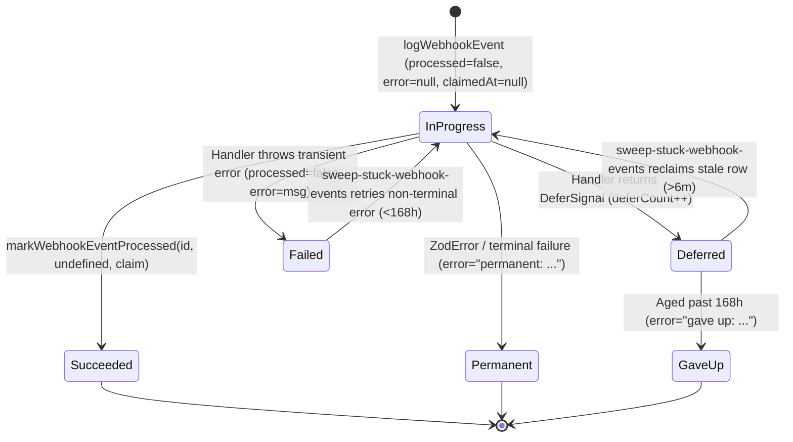

# Webhook Monitoring, Recovery Sweeps & Retention Guide

> **Scope:** Operational monitoring, observability signals, stuck-webhook recovery (`sweep-stuck-webhook-events`), and weekly storage retention (`archive-webhook-events`) across Razorpay/RazorpayX, Stream, Resend, Novu, and Stripe. Organization double-entry ledger mechanics live in [`docs/enterprise/10-money-and-ledger/12-payment-webhooks.md`](../../enterprise/10-money-and-ledger/12-payment-webhooks.md).

---

## 1. Webhook Lifecycle State Machine (`WebhookEvent`)

Inbound webhooks backed by `logWebhookEvent` (`lib/webhooks/event-log.ts`) transition through a deterministic four-state machine using `(processed, error, claimedAt, deferCount)`:



### CAS Lease Fencing (`WebhookClaim`)

When `POST /api/webhooks/razorpay` or `POST /api/stream/webhooks` acknowledges HTTP `200` and enters `after()`, it holds a `WebhookClaim` (`{ claimedAt }`). If the Netlify function container freezes before `after()` completes:

1. Once `claimedAt` (or `receivedAt` on initial arrival) ages past **6 minutes**, `sweep-stuck-webhook-events` atomically reclaims the row via `reclaimStaleProcessingWebhookEvent`, stamping a fresh `claimedAt`.
2. If the frozen container subsequently thaws and reaches `markWebhookEventProcessed(eventId, error, claim)`, the conditional `updateMany({ where: { eventId, claimedAt: claim.claimedAt } })` matches **0 rows** (`Webhook completion fenced: claim was superseded`), preventing stale execution from clobbering the sweeper's result.

---

## 2. Automated Recovery Sweep (`sweep-stuck-webhook-events`)

Registered in `lib/cron/cleanup-registry.ts` (`POST /api/cleanup/sweep-stuck-webhook-events`) and protected by Postgres `withCronLock("sweep-stuck-webhook-events", { failMode: "closed" })`:

- **Providers Covered**: `"razorpay"`, `"stream"`, and `"novu"`.
- **Per-Event Execution Timeout**: Each claimed event re-drive executes inside a strict per-event deadline (`Promise.race`) so a slow upstream REST lookup or network stall on one event cannot exhaust the sweep's 15-second batch budget or block `PG_POOL_MAX=1`.
- **Single-Event Batch Alerting (Sentry Quota Safe)**:
  - Never calls `Sentry.captureException` per row inside loops.
  - Emits **at most one consolidated warning per sweep** when any stuck event reaches `deferCount >= 5` or `age > 1 hour` (`sweep-stuck-webhook-events: N webhook event(s) still unprocessed`), listing up to 20 stalled `eventId` entries in structured Sentry context.
- **Terminal Error Exclusions (`TERMINAL_ERROR_PREFIXES`)**:
  - Rows prefixed with `"permanent:"` (schema validation failures) or `"gave up:"` (>168 hours unresolvable deferral) are permanently excluded from re-drives.

---

## 3. Production SQL Diagnostic Queries

### Inspect Unprocessed or Deferred Webhooks

```sql
SELECT
  id,
  provider,
  "eventType",
  "eventId",
  processed,
  "deferCount",
  "claimedAt",
  "receivedAt",
  error
FROM "WebhookEvent"
WHERE processed = false
   OR (error IS NOT NULL AND error NOT LIKE 'permanent:%' AND error NOT LIKE 'gave up:%')
ORDER BY "receivedAt" ASC
LIMIT 25;
```

### Verify Recent Resend Email Deliveries & Suppressions

```sql
SELECT
  "svixId",
  type,
  recipient,
  "createdAt"
FROM "EmailEvent"
ORDER BY "createdAt" DESC
LIMIT 20;

SELECT
  email,
  reason,
  "createdAt"
FROM "EmailSuppression"
ORDER BY "createdAt" DESC
LIMIT 20;
```

### Diagnose High `deferCount` on Refund or Dispute Events

1. Extract the `pay_...` ID from `WebhookEvent.payload` (`payload.refund.entity.payment_id` or `payload.dispute.entity.payment_id`).
2. Check whether `Payment.gatewayPaymentId` or `Payment.paymentIntent` exists in Postgres:
   ```sql
   SELECT id, "paymentIntent", "gatewayPaymentId", "paymentStatus", "createdAt"
   FROM "Payment"
   WHERE "gatewayPaymentId" = 'pay_...' OR "paymentIntent" = 'order_...';
   ```
3. If no row exists, `payment.captured` has not yet landed — trigger or inspect `reconcile-payment-status`. If the row exists with `gatewayPaymentId IS NULL`, verify Razorpay API credentials (`RAZORPAY_KEY_ID` / `RAZORPAY_SECRET`) used by fallback `payments.fetch`.

---

## 4. Environment Configuration & Secret Rotation Checklist

| Variable                               | Provider  | Purpose & Verification Rule                                                                                                             |
| -------------------------------------- | --------- | --------------------------------------------------------------------------------------------------------------------------------------- |
| `RAZORPAY_WEBHOOK_SECRET`              | Razorpay  | Primary HMAC-SHA256 secret for all payment, order, refund, and dispute events.                                                          |
| `RAZORPAY_WEBHOOK_SECRET_PREVIOUS`     | Razorpay  | Optional grace-window secret during Dashboard secret rotation; emits `WEBHOOK` `WARN` when matched so operators know when to retire it. |
| `RAZORPAYX_WEBHOOK_SECRET`             | RazorpayX | Dedicated HMAC-SHA256 secret tried **only** when `isPayoutEventName(body)` matches `payout.*` or `fund_account.*`.                      |
| `STREAM_API_KEY` / `STREAM_API_SECRET` | Stream    | Verifies `X-Api-Key` and `X-Signature` over uncompressed UTF-8 payload bytes.                                                           |
| `RESEND_WEBHOOK_SECRET`                | Resend    | Svix `whsec_...` secret verifying `svix-id`, `svix-timestamp` (5m window), and `svix-signature`.                                        |
| `NOVU_WEBHOOK_SECRET`                  | Novu      | Verifies Svix outbound webhooks (`svix-id`, `svix-timestamp`, `svix-signature`, 5m window) or channel HMAC (`x-novu-signature`).        |

---

## 5. Weekly Multi-Table Retention Archival (`archive-webhook-events`)

Executed weekly on Sunday at 00:00 UTC via `scripts/cleanup/archive-webhook-events.ts` (`POST /api/cleanup/archive-webhook-events`, guarded by `withCronLock("archive-webhook-events", { failMode: "open" })`):

| Table                     | Condition                                                        | Retention Window | Rationale                                                                                                                         |
| ------------------------- | ---------------------------------------------------------------- | ---------------- | --------------------------------------------------------------------------------------------------------------------------------- |
| `WebhookEvent`            | `processed = true AND error IS NULL`                             | **30 days**      | Retains clean idempotency history far past every provider's retry window (max 5 days on Novu, 3 days on Stripe, 24h on Razorpay). |
| `WebhookEvent`            | `processed = false AND error LIKE 'permanent:%' \| 'gave up:%'`  | **30 days**      | Prunes unreplayable terminal payloads (`TERMINAL_ERROR_PREFIXES`) after monthly inspection window.                                |
| `WebhookEvent`            | Other failed rows (`processed = false AND error IS NOT NULL`)    | **90 days**      | Retains non-terminal failed/errored payloads for quarterly financial audit inspection.                                            |
| `EmailEvent`              | All recorded Resend delivery events                              | **90 days**      | Retains delivery audit logs for 90 days while permanent `EmailSuppression` records persist indefinitely.                          |
| `OutboundWebhookDelivery` | Terminal rows (`status IN ('SUCCESS', 'FAILED', 'DEAD_LETTER')`) | **30 days**      | Prunes completed enterprise tenant webhook delivery logs without touching active retry queue entries.                             |

---

## Deprecated & Superseded Approaches

- **72-Hour Lower Floor on Stuck-Event Sweeping**: Superseded because `archive-webhook-events` retains failed rows for 90 days; skipping stuck rows older than 72 hours orphaned valid events permanently when weekend incidents exceeded 3 days. `maxAgeHours` now emits a warning log without excluding older unprocessed rows.
- **Unbounded Per-Event Sweep Loop**: Superseded by explicit per-event timeouts (`Promise.race`) inside `sweep-stuck-webhook-events` so a single hung webhook replay cannot starve subsequent rows or exceed Netlify function limits under `PG_POOL_MAX=1`.
- **Archiving `WebhookEvent` Alone While Leaving `EmailEvent` and `OutboundWebhookDelivery` Unbounded**: Superseded by unified weekly pruning across all three webhook log tables in `archive-webhook-events`.
