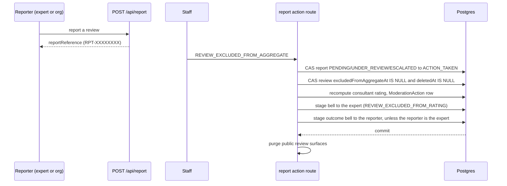

# Rating cause and aggregate exclusion

A low rating caused by our own video stack failing mid-session is a true statement about that session and a false statement about the consultant. This page describes the `RatingCause` taxonomy the private rating and the public review share, the split between what a rater claims and what staff adjudicate, and the difference between excluding a rating from the arithmetic and removing it.

## Ratings protection, and the counter-example

Uber publishes this as "ratings protection": it drops ratings attributed to traffic, navigation and co-rider behaviour, because a driver cannot control them. The same argument applies with more force here, where our own stack failing produces a one-star rating about us that lands permanently on a consultant. Urban Company is the counter-example. Category minimums of 4.5 to 4.7 against a platform mean of 4.83 leave a usable range of a third of a star, and it is now a labour dispute. If a rating can end someone's livelihood, they are owed an attribution filter.

## The taxonomy

`RatingCause` is one enum used by both `AppointmentFeedback.ratingCause` and `ConsultantReview.ratingCause`, so that one Stream outage does not read to an organisation as a bad consultant either. The table below lists its values.

| Value                | Meaning                                                          |
| -------------------- | ---------------------------------------------------------------- |
| `CONSULTANT`         | The person. The only value that is unambiguously about them.     |
| `PLATFORM_TECHNICAL` | Our stack failed: Stream video or chat, auth, the meeting route. |
| `PAYMENT`            | Billing, refund or invoice friction, not the session.            |
| `SCHEDULING`         | Reschedule churn, late confirmation, allocation.                 |
| `CONTENT`            | Materials, handouts, pre-reads: the content, not the delivery.   |
| `OTHER`              | Anything else the rater wants to name.                           |

`CONSULTANT` is a positive claim rather than a default. `NULL` means "not asked or not answered" and must stay distinguishable from it, so no surface may treat an absent cause as an accusation of the consultant.

## A claim is not an adjudication

`ratingCause` records what the rater **says** drove a low score. `excludedFromAggregateAt` records the **adjudication**; who made it and why is the `ModerationAction` row (`REVIEW_EXCLUDED_FROM_AGGREGATE` or `FEEDBACK_EXCLUDED_FROM_AGGREGATE`) that names the content, not a column on it (#1562). The two are deliberately separate: if a self-reported cause removed a rating by itself, every consultant would coach clients to tick "platform issue". Only staff set the exclusion, because a self-served exclusion is a coaching vector.

Only rows with a `NULL` `excludedFromAggregateAt` enter either published score or the organisation's quality aggregate. `recomputeConsultantRating` and the organisation's `feedback-summary` both carry the predicate.

## Excluded is not deleted, and is not hidden

`excludedFromAggregateAt` is distinct from `deletedAt`. A rating excluded because our video stack failed is still a true statement about that session, so the review stays listed with its text; it simply stops arithmetically punishing the person who did not cause it. A deleted row disappears from every public read.

The exclusion is disclosed, not concealed. `sanitisePublicReview` replaces the timestamp with a boolean `notCounted`, and the review card on the expert's profile renders the label "Not counted in rating" beside the date. The timestamp itself and the staff reason on the audit row never reach the wire, so a reader learns that the review is not in the score but not who decided or why. The label exists because a silent exclusion is a transparency failure in both directions: a reader cannot tell why the score ignores a visible one-star review, and the expert can lose a published score without being told (excluding one of five reviews drops a consultant under the five-client publication gate).

## How a cause travels

The cause is a claim the rater makes about a low score, and it round-trips through both rails.

- **Private rating.** `POST /api/appointments/[appointmentId]/feedback` accepts `ratingCause` (nullable, validated against the enum) beside the star value. `resolveRatingCausePatch` in `lib/reviews.ts` is the one rule for what is stored: a rating above three clears the cause to `NULL`, a rating of three or below stores the supplied cause, and an update that omits the cause leaves the stored one alone. The feedback `GET` returns the caller's own cause per occurrence (`ratingCauses`) so `SessionRatingRow` can pre-select it after a reload; the provider's view of the same rows carries neither the cause nor the comment. If saving a new cause fails, the row restores the previous selection, exactly as a failed star save does.
- **Public review.** `existingReview` in `lib/reviews.ts` selects `ratingCause`, so the composer pre-selects it, and `PUT /api/user/reviews/[id]` writes it through the same `resolveRatingCausePatch`, using the new rating when the edit changes it and the stored rating otherwise. A text-only edit of a three-star review therefore keeps its cause, and raising the rating above three clears it.

`ratingCause` never reaches an anonymous reader: it is deliberately absent from `publicReviewSelect`.

## The adjudication path

Staff set the exclusion through a moderation report, and every step happens in the report action's one Serializable transaction.

- **Both parties are told.** The expert gets the "Not counted in rating" bell inside the transaction. The reporter gets the report-outcome bell unless the reporter is the reviewed expert, who already received the exclusion notice; one message is enough. The review's author is not sent a warning, since an exclusion is not a finding against them.
- **A second exclusion is a 409, not a second audit row.** The review update is conditional on `excludedFromAggregateAt IS NULL` and `deletedAt IS NULL`; zero rows throws a 409 and the transaction rolls back, so nothing is staged and the report does not flip.
- **Feedback exclusion is bound to the reported review.** `FEEDBACK_EXCLUDED_FROM_AGGREGATE` needs a REVIEW report bound to an appointment, a `feedbackId`, and that feedback must belong to the same appointment and be authored by the reported review's author, so staff cannot exclude an unrelated rating. The write is conditional on `excludedFromAggregateAt IS NULL` and answers 409 when the row is already excluded.

Only rows with a `NULL` `excludedFromAggregateAt` enter either published score or the organisation's quality aggregate. `recomputeConsultantRating` and the organisation's `feedback-summary` both carry the predicate.

## Related

- [05-moderation-and-reports.md](05-moderation-and-reports.md) — the report pipe, the gates and the references reporters receive.
- [02-two-track-scoring.md](02-two-track-scoring.md) — the arithmetic the exclusion removes a row from.
- [The org quality signal](../feedback/02-org-quality-signal.md) — the aggregate that honours the same predicate on the private rail.
- [ADR 29](../enterprise/70-design-decisions/29-two-track-reputation-and-the-right-of-reply.md), "A low rating we caused does not count against the consultant".

## Deprecated & Superseded Approaches

- **Reserved columns with no writers**: `ratingCause` and `excludedFromAggregateAt` once shipped ahead of any route that set them, and this page described them as reserved. They are now written by the routes above; do not describe them as data-model support only.
- **A public projection that hid the exclusion entirely**: the review stayed listed with no label and nobody was notified. Superseded by the boolean `notCounted`; the timestamp stays private.
- **The composer dropping the cause**: `existingReview` did not select it, and `PUT` never wrote or cleared it, so a text-only edit saved `ratingCause: null`. Superseded by the shared patch rule.
- **Warning the review's author on exclusion**: the notice was once routed to the report's target through the moderation-warning template. Superseded by a notice to the expert and an outcome bell to the reporter.
