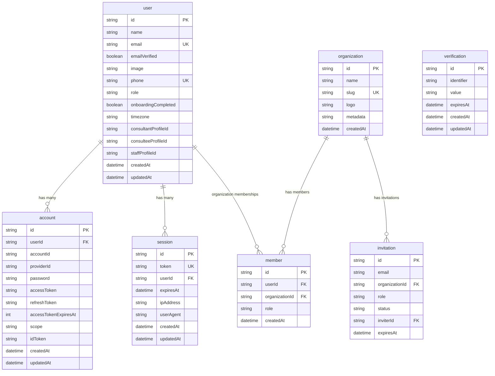
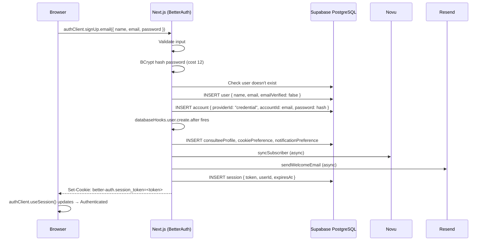
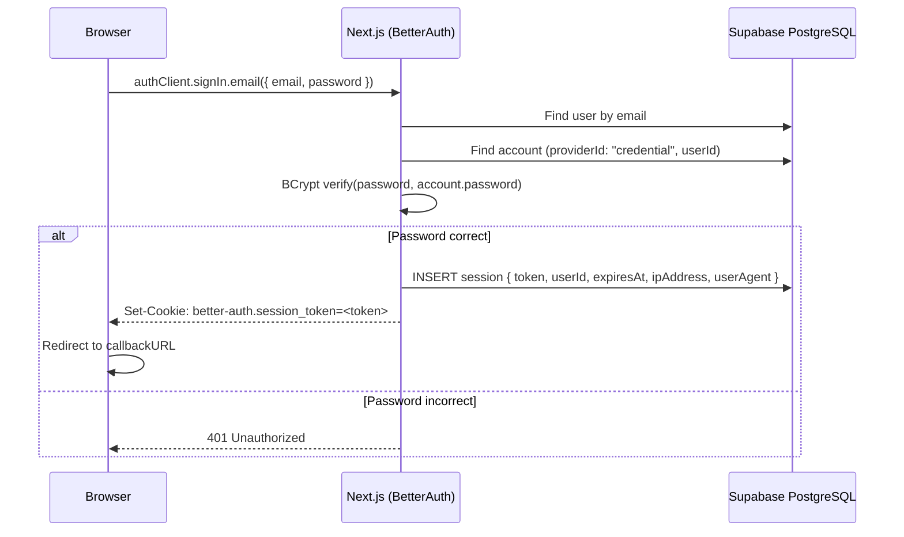
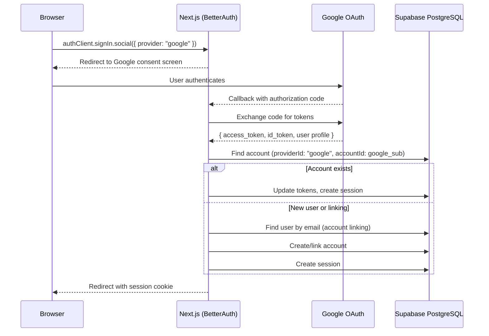
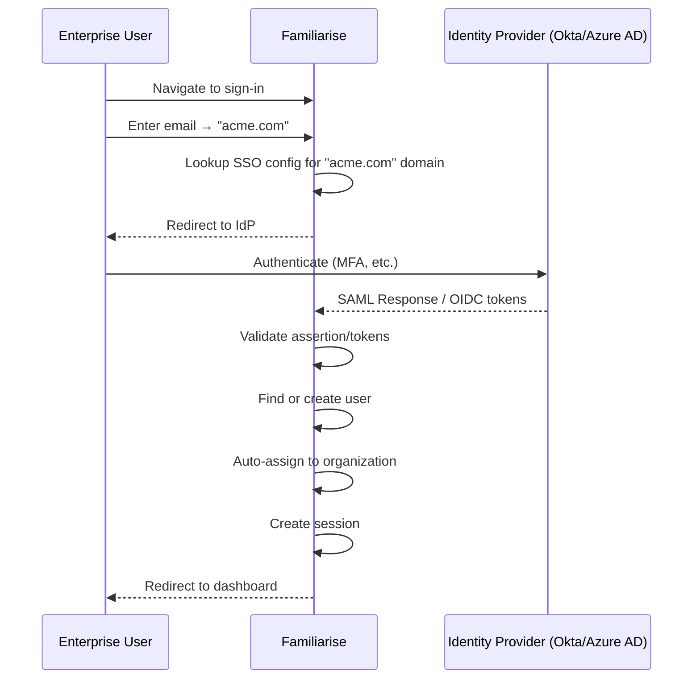

# BetterAuth Implementation Guide — Familiarise Web

> Complete implementation reference for BetterAuth on the Familiarise web application (Next.js), including core authentication, enterprise features, and cross-platform integration.

**Status**: Design
**Decision Date**: 2026-02-02
**Related Issues**: #367 (Enterprise), #405 (User Lifecycle)
**Decision Record**: [betterauth-migration.md](./betterauth-migration.md)
**Migration Guide**: [betterauth-nextauth-migration.md](./betterauth-nextauth-migration.md)

---

## Table of Contents

- [Architecture Overview](#architecture-overview)
- [Core Configuration](#core-configuration)
- [Database Schema](#database-schema)
- [Authentication Flows](#authentication-flows)
- [Session Management](#session-management)
- [Middleware & Route Protection](#middleware--route-protection)
- [Database Hooks](#database-hooks)
- [Password Management](#password-management)
- [User Management](#user-management)
- [Enterprise: Organizations Plugin](#enterprise-organizations-plugin)
- [Enterprise: RBAC](#enterprise-rbac)
- [Enterprise: SSO (SAML & OIDC)](#enterprise-sso-saml--oidc)
- [Enterprise: API Key Management](#enterprise-api-key-management)
- [Enterprise: Stripe Billing Integration](#enterprise-stripe-billing-integration)
- [Enterprise: Admin Dashboard](#enterprise-admin-dashboard)
- [OpenAPI Documentation](#openapi-documentation)
- [Cross-Platform Integration (Mobile)](#cross-platform-integration-mobile)
- [Security](#security)
- [Environment Variables](#environment-variables)

---

## Architecture Overview

### System Diagram

```
┌────────────────────────────────────────────────────────────────────────────────────┐
│                               FAMILIARISE WEB                                       │
│                                                                                     │
│  ┌──────────────────────┐    ┌───────────────────────────────────────────────────┐  │
│  │  Next.js Frontend    │    │  BetterAuth Server (lib/auth.ts)                  │  │
│  │                      │    │                                                   │  │
│  │  • useSession()      │    │  ┌─────────────┐  ┌────────────┐  ┌───────────┐  │  │
│  │  • signIn.email()    │───▶│  │  Core Auth   │  │ Org Plugin │  │ SSO Plugin│  │  │
│  │  • signIn.social()   │    │  │  • email/pw  │  │ • teams    │  │ • SAML    │  │  │
│  │  • signUp.email()    │    │  │  • OAuth     │  │ • roles    │  │ • OIDC    │  │  │
│  │  • signOut()         │    │  │  • sessions  │  │ • invites  │  │           │  │  │
│  │  • Novu Inbox        │    │  └──────┬──────┘  └─────┬──────┘  └─────┬─────┘  │  │
│  └──────────────────────┘    │         │               │               │         │  │
│                              │  ┌──────▼───────────────▼───────────────▼──────┐  │  │
│  ┌──────────────────────┐    │  │           Prisma Adapter                     │  │  │
│  │  API Route Handler   │    │  │           (PostgreSQL)                       │  │  │
│  │                      │    │  └──────────────────┬──────────────────────────┘  │  │
│  │  app/api/auth/       │    │                     │                             │  │
│  │    [...all]/route.ts │    └─────────────────────┼─────────────────────────────┘  │
│  │                      │                          │                                │
│  │  toNextJsHandler()   │                          ▼                                │
│  └──────────────────────┘    ┌──────────────────────────────────────────────────┐   │
│                              │              Supabase PostgreSQL                  │   │
│                              │                                                  │   │
│                              │  "public" schema (Prisma)                        │   │
│                              │  ┌──────┐ ┌─────────┐ ┌─────────┐ ┌──────────┐ │   │
│                              │  │ user │ │ account │ │ session │ │ verif.   │ │   │
│                              │  └──────┘ └─────────┘ └─────────┘ └──────────┘ │   │
│                              │  ┌──────────────┐ ┌────────┐ ┌──────────────┐  │   │
│                              │  │ organization │ │ member │ │ invitation   │  │   │
│                              │  └──────────────┘ └────────┘ └──────────────┘  │   │
│                              │  ... + 51 other business models                 │   │
│                              └──────────────────────────────────────────────────┘   │
└────────────────────────────────────────────────────────────────────────────────────┘
         ▲                                          ▲
         │                                          │
         │  Shared database (symlinked Prisma)      │
         │                                          │
┌────────┴────────────────────────────────────┐     │
│  FAMILIARISE MOBILE                          │     │
│                                              │     │
│  Flutter App ──▶ Dart Frog Backend ──────────┘     │
│  (Custom auth, schema-compatible with BetterAuth)  │
└────────────────────────────────────────────────────┘
```

### Component Summary

| Component | File | Purpose |
|-----------|------|---------|
| Server config | `lib/auth.ts` | BetterAuth initialization, plugins, hooks |
| Client config | `lib/auth-client.ts` | React hooks, sign-in/out methods |
| Route handler | `app/api/auth/[...all]/route.ts` | HTTP handler for all auth endpoints |
| Middleware | `middleware.ts` | Route protection, role-based access |
| Types | Auto-inferred from `auth.$Infer` | No manual type extensions needed |

---

## Core Configuration

### Server Setup: `lib/auth.ts`

```typescript
import { betterAuth } from "better-auth";
import { prismaAdapter } from "better-auth/adapters/prisma";
import { organization } from "better-auth/plugins/organization";
import { admin } from "better-auth/plugins/admin";
import { openAPI } from "better-auth/plugins/open-api";
import { nextCookies } from "better-auth/next-js";
import prisma from "@/lib/prisma";
import bcrypt from "bcrypt";

export const auth = betterAuth({
  // ── Database ──
  database: prismaAdapter(prisma, {
    provider: "postgresql",
  }),

  // ── Secrets ──
  secret: process.env.BETTER_AUTH_SECRET,
  baseURL: process.env.BETTER_AUTH_URL,

  // ── Email & Password ──
  emailAndPassword: {
    enabled: true,
    password: {
      // BCrypt to match Dart Frog mobile backend
      hash: (password) => bcrypt.hash(password, 12),
      verify: ({ password, hash }) => bcrypt.compare(password, hash),
    },
    sendResetPassword: async ({ user, url }) => {
      // Send password reset email via Resend
      await sendPasswordResetEmail(user.email, user.name, url);
    },
    sendVerificationEmail: async ({ user, url }) => {
      // Send email verification via Resend
      await sendVerificationEmail(user.email, user.name, url);
    },
  },

  // ── Social Providers ──
  socialProviders: {
    google: {
      clientId: process.env.GOOGLE_CLIENT_ID!,
      clientSecret: process.env.GOOGLE_CLIENT_SECRET!,
    },
    github: {
      clientId: process.env.GITHUB_ID!,
      clientSecret: process.env.GITHUB_SECRET!,
    },
    facebook: {
      clientId: process.env.FACEBOOK_CLIENT_ID!,
      clientSecret: process.env.FACEBOOK_CLIENT_SECRET!,
    },
    apple: {
      clientId: process.env.APPLE_CLIENT_ID!,
      clientSecret: process.env.APPLE_CLIENT_SECRET!,
    },
  },

  // ── Account Linking ──
  accountLinking: {
    enabled: true,
    trustedProviders: ["google", "github", "facebook", "apple"],
  },

  // ── Session ──
  session: {
    expiresIn: 30 * 24 * 60 * 60, // 30 days
    updateAge: 24 * 60 * 60,       // Refresh every 24h
    cookieCache: {
      enabled: true,
      maxAge: 5 * 60, // 5-minute cookie cache
    },
  },

  // ── Custom User Fields ──
  user: {
    additionalFields: {
      phone: { type: "string", required: false },
      role: { type: "string", required: false, defaultValue: "CONSULTEE" },
      onboardingCompleted: { type: "boolean", required: false, defaultValue: false },
      timezone: { type: "string", required: false },
      consultantProfileId: { type: "string", required: false },
      consulteeProfileId: { type: "string", required: false },
      staffProfileId: { type: "string", required: false },
      adminProfileId: { type: "string", required: false },
    },
  },

  // ── Trusted Origins ──
  trustedOrigins: [
    "https://familiarise.com",
    "familiarise://", // Mobile deep link scheme
  ],

  // ── Database Hooks ──
  databaseHooks: {
    user: {
      create: {
        after: async (user) => {
          // Create default profiles and preferences
          await prisma.$transaction([
            prisma.consulteeProfile.create({ data: { userId: user.id } }),
            prisma.cookiePreference.create({ data: { userId: user.id } }),
            prisma.notificationPreference.create({ data: { userId: user.id } }),
          ]);
          // Novu subscriber sync + welcome email (async)
          syncSubscriber({ userId: user.id, email: user.email, firstName: user.name }).catch(console.error);
          sendWelcomeEmail(user.email, user.name).catch(console.error);
        },
      },
      delete: {
        before: async (user) => {
          deleteSubscriber(user.id).catch(console.error);
        },
      },
    },
    account: {
      create: {
        after: async (account) => {
          if (account.providerId !== "credential") {
            const user = await prisma.user.findUnique({ where: { id: account.userId } });
            if (user) sendAccountLinkedEmail(user.email, account.providerId).catch(console.error);
          }
        },
      },
    },
  },

  // ── Plugins (order matters — nextCookies MUST be last) ──
  plugins: [
    organization({
      // See Enterprise: Organizations Plugin section
    }),
    admin({
      // See Enterprise: Admin Dashboard section
    }),
    openAPI(),
    nextCookies(), // MUST BE LAST
  ],
});

// Type exports
export type Session = typeof auth.$Infer.Session;
export type User = typeof auth.$Infer.Session.user;
```

### Client Setup: `lib/auth-client.ts`

```typescript
import { createAuthClient } from "better-auth/react";
import { organizationClient } from "better-auth/client/plugins";
import { adminClient } from "better-auth/client/plugins";

export const authClient = createAuthClient({
  baseURL: process.env.NEXT_PUBLIC_APP_URL,
  plugins: [
    organizationClient(),
    adminClient(),
  ],
});

// Named exports for convenience
export const {
  useSession,
  signIn,
  signUp,
  signOut,
  useActiveOrganization,
  useListOrganizations,
} = authClient;
```

### API Route Handler: `app/api/auth/[...all]/route.ts`

```typescript
import { toNextJsHandler } from "better-auth/next-js";
import { auth } from "@/lib/auth";

export const { GET, POST } = toNextJsHandler(auth);
```

---

## Database Schema

### Core Auth Tables (Post-Migration)



### Additional Fields Configuration

BetterAuth's `additionalFields` maps custom columns on existing tables. The Prisma schema keeps all current User fields — BetterAuth reads them automatically:

| Field | Type | Default | Purpose |
|-------|------|---------|---------|
| `phone` | string? | null | User's phone number |
| `role` | string | "CONSULTEE" | CONSULTEE, CONSULTANT, STAFF, ADMIN |
| `onboardingCompleted` | boolean | false | Onboarding flow status |
| `timezone` | string? | null | User's timezone (e.g., "Asia/Kolkata") |
| `consultantProfileId` | string? | null | FK to ConsultantProfile |
| `consulteeProfileId` | string? | null | FK to ConsulteeProfile |
| `staffProfileId` | string? | null | FK to StaffProfile |
| `adminProfileId` | string? | null | FK to AdminProfile |

---

## Authentication Flows

### Email/Password Sign-Up



### Email/Password Sign-In



### Google OAuth



### GitHub OAuth

Same flow as Google, with `provider: "github"`.

### Facebook OAuth

Same flow as Google, with `provider: "facebook"`.

### Apple Sign-In

Same flow as Google, with `provider: "apple"`. BetterAuth handles Apple's specific requirements (private relay emails, name provided only once).

---

## Session Management

### Cookie-Based Sessions

BetterAuth uses server-side sessions stored in the database. The session token is sent via an HTTP-only cookie:

```
Cookie: better-auth.session_token=<opaque-token>
```

| Attribute | Value |
|-----------|-------|
| Name | `better-auth.session_token` |
| HttpOnly | true (not accessible via JavaScript) |
| Secure | true (HTTPS only in production) |
| SameSite | Lax |
| Path | / |
| Max-Age | Session expiry (30 days) |

### Cookie Caching (Performance)

With cookie caching enabled, BetterAuth encodes a compact version of the session into an additional cookie. This avoids a database lookup on every request:

```typescript
session: {
  cookieCache: {
    enabled: true,
    maxAge: 5 * 60, // Cache for 5 minutes
  },
},
```

**How it works:**
1. First request: DB lookup → session data → set `better-auth.session_data` cookie (compact encoded)
2. Subsequent requests (within 5 min): Read from cookie, skip DB
3. After 5 min: Cookie expires, next request does a fresh DB lookup

### Secondary Storage (Redis) — Optional

For high-traffic scenarios, session lookups can be accelerated with Redis:

```typescript
import { createClient } from "@upstash/redis";

const redis = createClient({
  url: process.env.UPSTASH_REDIS_REST_URL,
  token: process.env.UPSTASH_REDIS_REST_TOKEN,
});

export const auth = betterAuth({
  secondaryStorage: {
    get: (key) => redis.get(key),
    set: (key, value, ttl) => redis.set(key, value, { ex: ttl }),
    delete: (key) => redis.del(key),
  },
});
```

### Multi-Device Sessions

BetterAuth provides built-in endpoints for session management:

| Endpoint | Method | Purpose |
|----------|--------|---------|
| `/api/auth/list-sessions` | GET | List all active sessions for current user |
| `/api/auth/revoke-session` | POST | Revoke a specific session by ID |
| `/api/auth/revoke-other-sessions` | POST | Revoke all sessions except current |

Client usage:
```typescript
// List all sessions
const sessions = await authClient.listSessions();

// Revoke a session
await authClient.revokeSession({ sessionId: "session-id" });

// Revoke all other sessions (e.g., after password change)
await authClient.revokeOtherSessions();
```

### Session Freshness

For sensitive operations (password change, account deletion), require a fresh session:

```typescript
// Server-side check
const session = await auth.api.getSession({
  headers: await headers(),
  query: { disableCookieCache: true }, // Force DB lookup
});

const sessionAge = Date.now() - new Date(session.session.createdAt).getTime();
if (sessionAge > 10 * 60 * 1000) { // 10 minutes
  // Require re-authentication
}
```

---

## Middleware & Route Protection

### Middleware Implementation

```typescript
// middleware.ts
import { auth } from "@/lib/auth";
import { NextRequest, NextResponse } from "next/server";

const PROTECTED_PREFIXES = [
  "/form/",
  "/dashboard/",
  "/settings/",
  "/profile/",
  "/checkout/",
  "/meetings/",
];

const PUBLIC_AUTH_PREFIXES = ["/auth/"];

const isProtectedRoute = (pathname: string) =>
  PROTECTED_PREFIXES.some((prefix) => pathname.startsWith(prefix));

const isAuthRoute = (pathname: string) =>
  PUBLIC_AUTH_PREFIXES.some((prefix) => pathname.startsWith(prefix));

export async function middleware(req: NextRequest) {
  const session = await auth.api.getSession({
    headers: req.headers,
  });

  const { pathname } = req.nextUrl;

  // Redirect authenticated users away from auth pages
  if (session && isAuthRoute(pathname)) {
    return NextResponse.redirect(new URL("/explore/experts", req.url));
  }

  // Redirect unauthenticated users to sign-in
  if (!session && isProtectedRoute(pathname)) {
    const signInUrl = new URL("/auth/signin", req.url);
    signInUrl.searchParams.set("callbackUrl", pathname);
    return NextResponse.redirect(signInUrl);
  }

  // Role-based dashboard access
  if (session && pathname.startsWith("/dashboard/")) {
    const role = session.user.role;

    if (pathname.startsWith("/dashboard/consultant") && role !== "CONSULTANT") {
      return NextResponse.redirect(new URL("/dashboard", req.url));
    }
    if (pathname.startsWith("/dashboard/staff") && !["STAFF", "ADMIN"].includes(role)) {
      return NextResponse.redirect(new URL("/dashboard", req.url));
    }
    if (pathname.startsWith("/dashboard/admin") && role !== "ADMIN") {
      return NextResponse.redirect(new URL("/dashboard", req.url));
    }
  }

  // Onboarding redirect
  if (session && !session.user.onboardingCompleted && isProtectedRoute(pathname) && !pathname.startsWith("/form/onboarding")) {
    return NextResponse.redirect(new URL("/form/onboarding", req.url));
  }

  return NextResponse.next();
}

export const config = {
  matcher: [
    "/auth/:path*",
    "/form/:path*",
    "/dashboard/:path*",
    "/settings/:path*",
    "/profile/:path*",
    "/checkout/:path*",
    "/meetings/:path*",
  ],
};
```

---

## Database Hooks

Database hooks fire on CRUD operations for BetterAuth-managed tables:

```typescript
databaseHooks: {
  user: {
    create: {
      before: async (user) => {
        // Modify user data before insertion
        // e.g., normalize email, set defaults
        return { data: { ...user, email: user.email.toLowerCase() } };
      },
      after: async (user) => {
        // After user creation:
        // 1. Create default profiles
        // 2. Sync to Novu
        // 3. Send welcome email
      },
    },
    update: {
      after: async (user) => {
        // After profile update: sync to Novu subscriber
        syncSubscriber({
          userId: user.id,
          email: user.email,
          firstName: user.name,
        }).catch(console.error);
      },
    },
    delete: {
      before: async (user) => {
        // Before account deletion: cleanup Novu subscriber
        deleteSubscriber(user.id).catch(console.error);
      },
    },
  },
  session: {
    create: {
      after: async (session) => {
        // Track login events for analytics/security
      },
    },
  },
  account: {
    create: {
      after: async (account) => {
        // Send "account linked" email for OAuth
        if (account.providerId !== "credential") {
          const user = await prisma.user.findUnique({ where: { id: account.userId } });
          if (user) sendAccountLinkedEmail(user.email, account.providerId).catch(console.error);
        }
      },
    },
  },
},
```

---

## Password Management

### Change Password

```
POST /api/auth/change-password
Headers: Cookie (authenticated)

Body: { currentPassword, newPassword }
```

Client:
```typescript
await authClient.changePassword({
  currentPassword: "OldPass123",
  newPassword: "NewPass456",
  revokeOtherSessions: true, // Optional: sign out everywhere else
});
```

### Forget Password

```
POST /api/auth/forget-password
Body: { email }
```

Triggers `sendResetPassword` hook → sends email with reset URL containing a token.

Client:
```typescript
await authClient.forgetPassword({
  email: "john@example.com",
  redirectTo: "/auth/reset-password", // URL prefix for the reset page
});
```

### Reset Password

```
POST /api/auth/reset-password
Body: { token, newPassword }
```

Client:
```typescript
await authClient.resetPassword({
  token: searchParams.get("token"),
  newPassword: "NewSecure123",
});
```

### Email Verification

```
POST /api/auth/verify-email
Body: { token }
```

Triggers `sendVerificationEmail` hook on registration.

Client:
```typescript
await authClient.verifyEmail({ token: searchParams.get("token") });
```

### Set Password (OAuth-Only Users)

Users who only have OAuth accounts can set a password:

```typescript
await authClient.setPassword({ newPassword: "MyNewPassword123" });
```

---

## User Management

### Update User Profile

```typescript
// Client-side
await authClient.updateUser({
  name: "New Name",
  image: "https://storage.example.com/avatar.jpg",
});
```

### Delete Account

```typescript
await authClient.deleteUser({
  password: "current-password", // Required for confirmation
  callbackURL: "/", // Redirect after deletion
});
```

### Profile Image Management

Profile images are stored in Supabase Storage. The image URL is saved in `user.image`:

```typescript
// Upload to Supabase Storage, then update user
const { data } = await supabase.storage
  .from("profile-images")
  .upload(`${userId}/avatar.jpg`, file);

await authClient.updateUser({
  image: supabase.storage.from("profile-images").getPublicUrl(data.path).data.publicUrl,
});
```

---

## Enterprise: Organizations Plugin

### Overview

The Organization plugin adds multi-tenant support with organizations, members, invitations, teams, and RBAC. This is the foundation for Familiarise's enterprise tier (B2B organizations with team management, seat allocation, and recording collections).

### Configuration

```typescript
import { organization } from "better-auth/plugins/organization";

plugins: [
  organization({
    // Allow users to create organizations
    allowUserToCreateOrganization: async (user) => {
      // Only enterprise plan users can create orgs, or admins
      return user.role === "ADMIN" || user.plan === "enterprise";
    },

    // Organization creation hook
    organizationCreated: async (org) => {
      // Initialize org defaults, send notification
    },

    // Custom roles beyond the defaults (owner, admin, member)
    roles: {
      owner: { permissions: ["org:*"] },
      admin: { permissions: ["org:manage", "member:*", "recording:*"] },
      manager: { permissions: ["member:read", "recording:*", "progress:read"] },
      member: { permissions: ["recording:read", "progress:write"] },
    },

    // Enable teams within organizations
    teams: {
      enabled: true,
      maximumTeams: 20,
    },
  }),
],
```

### Schema (Plugin Tables)

The organization plugin creates these tables automatically:

```prisma
model Organization {
  id        String   @id @default(cuid())
  name      String
  slug      String   @unique
  logo      String?
  metadata  String?  // JSON metadata
  createdAt DateTime @default(now())

  members     Member[]
  invitations Invitation[]
  teams       Team[]

  @@map("organizations")
}

model Member {
  id             String   @id @default(cuid())
  userId         String
  organizationId String
  role           String   @default("member")
  createdAt      DateTime @default(now())

  user         User         @relation(fields: [userId], references: [id], onDelete: Cascade)
  organization Organization @relation(fields: [organizationId], references: [id], onDelete: Cascade)
  teamMembers  TeamMember[]

  @@unique([userId, organizationId])
  @@map("members")
}

model Invitation {
  id             String   @id @default(cuid())
  email          String
  organizationId String
  role           String   @default("member")
  status         String   @default("pending") // pending, accepted, rejected, cancelled
  inviterId      String
  expiresAt      DateTime
  createdAt      DateTime @default(now())

  organization Organization @relation(fields: [organizationId], references: [id], onDelete: Cascade)

  @@map("invitations")
}

model Team {
  id             String   @id @default(cuid())
  name           String
  organizationId String
  createdAt      DateTime @default(now())

  organization Organization @relation(fields: [organizationId], references: [id], onDelete: Cascade)
  teamMembers  TeamMember[]

  @@map("teams")
}

model TeamMember {
  id       String @id @default(cuid())
  memberId String
  teamId   String

  member Member @relation(fields: [memberId], references: [id], onDelete: Cascade)
  team   Team   @relation(fields: [teamId], references: [id], onDelete: Cascade)

  @@unique([memberId, teamId])
  @@map("team_members")
}
```

### Organization Operations (Client)

```typescript
// Create organization
const org = await authClient.organization.create({
  name: "Acme Corp",
  slug: "acme-corp",
});

// Invite member
await authClient.organization.inviteMember({
  email: "jane@acme.com",
  role: "member",
  organizationId: org.id,
});

// Accept invitation
await authClient.organization.acceptInvitation({
  invitationId: "invitation-id",
});

// List members
const members = await authClient.organization.listMembers({
  organizationId: org.id,
});

// Remove member
await authClient.organization.removeMember({
  memberId: "member-id",
  organizationId: org.id,
});

// Update member role
await authClient.organization.updateMemberRole({
  memberId: "member-id",
  role: "admin",
  organizationId: org.id,
});

// Create team
await authClient.organization.createTeam({
  name: "Engineering",
  organizationId: org.id,
});

// Add member to team
await authClient.organization.addTeamMember({
  teamId: "team-id",
  memberId: "member-id",
});

// Set active organization
await authClient.organization.setActive({ organizationId: org.id });

// Get active organization
const { data: activeOrg } = authClient.useActiveOrganization();
```

### Organization Events → Novu Notifications

| Event | Novu Workflow | Recipients |
|-------|--------------|------------|
| Member invited | `org-member-invited` | Invitee (email) + org admin (in-app) |
| Member joined | `org-member-joined` | Org admin (in-app) |
| Member removed | `org-member-removed` | Removed member (email) |
| Seat usage at 90% | `org-seat-warning` | Org admin (email + in-app) |
| Monthly invoice ready | `org-invoice-ready` | Org admin (email) |

---

## Enterprise: RBAC

### Permission System

BetterAuth RBAC uses resource-action pairs:

```typescript
import { createAccessControl } from "better-auth/plugins/access";

const ac = createAccessControl({
  // Resources and their allowed actions
  organization: ["create", "read", "update", "delete"],
  member: ["create", "read", "update", "delete", "invite"],
  recording: ["create", "read", "update", "delete", "share"],
  collection: ["create", "read", "update", "delete"],
  progress: ["read", "write"],
  billing: ["read", "manage"],
  analytics: ["read"],
});
```

### Role Definitions

```typescript
const roles = {
  owner: ac.newRole({
    organization: ["create", "read", "update", "delete"],
    member: ["create", "read", "update", "delete", "invite"],
    recording: ["create", "read", "update", "delete", "share"],
    collection: ["create", "read", "update", "delete"],
    progress: ["read", "write"],
    billing: ["read", "manage"],
    analytics: ["read"],
  }),
  admin: ac.newRole({
    organization: ["read", "update"],
    member: ["create", "read", "update", "invite"],
    recording: ["create", "read", "update", "share"],
    collection: ["create", "read", "update"],
    progress: ["read"],
    billing: ["read"],
    analytics: ["read"],
  }),
  manager: ac.newRole({
    member: ["read"],
    recording: ["read", "share"],
    collection: ["read"],
    progress: ["read"],
    analytics: ["read"],
  }),
  member: ac.newRole({
    recording: ["read"],
    collection: ["read"],
    progress: ["read", "write"],
  }),
};
```

### Permission Checks

```typescript
// Server-side
import { hasPermission } from "better-auth/plugins/organization";

const session = await auth.api.getSession({ headers: await headers() });
const member = await auth.api.getActiveMember({ headers: await headers() });

if (!hasPermission(member, "recording", "create")) {
  return new Response("Forbidden", { status: 403 });
}
```

---

## Enterprise: SSO (SAML & OIDC)

### Overview

The `@better-auth/sso` plugin enables enterprise SSO via SAML 2.0 and OpenID Connect (OIDC). Organizations can configure their own identity providers (Okta, Azure AD, Google Workspace, etc.).

### Configuration

```typescript
import { sso } from "@better-auth/sso";

plugins: [
  sso({
    // Provider limits per plan
    providerLimit: async (organizationId) => {
      const org = await getOrganization(organizationId);
      if (org.plan === "free") return 0;
      if (org.plan === "pro") return 1;
      return Infinity; // enterprise = unlimited
    },

    // SAML configuration
    saml: {
      enabled: true,
      inResponseToValidation: true, // Enhanced security
    },

    // OIDC configuration
    oidc: {
      enabled: true,
    },

    // Auto-provision users who sign in via SSO
    autoProvision: true,
  }),
],
```

### SSO Flow



---

## Enterprise: API Key Management

### Configuration

```typescript
import { apiKey } from "better-auth/plugins/api-key";

plugins: [
  apiKey({
    // Rate limit expired key cleanup
    rateLimit: {
      window: 60, // seconds
      max: 10,
    },
  }),
],
```

### Usage

```typescript
// Create API key
const key = await authClient.apiKey.create({
  name: "Production API Key",
  expiresIn: 90 * 24 * 60 * 60, // 90 days
  prefix: "fam_", // Custom prefix
  metadata: { environment: "production" },
});
// key.key = "fam_xxxxx..." (only shown once)

// List API keys
const keys = await authClient.apiKey.list();

// Delete API key
await authClient.apiKey.delete({ keyId: "key-id" });
```

### API Key Authentication

Programmatic access using API keys (for integrations, CI/CD, etc.):

```
GET /api/some-endpoint
Headers:
  x-api-key: fam_xxxxx...
```

BetterAuth's `sessionForAPIKeys` option creates a mock session from the API key, so existing session-based authorization works without modification.

---

## Enterprise: Stripe Billing Integration

### Configuration

```typescript
import { stripe } from "@better-auth/stripe";

plugins: [
  stripe({
    stripeSecretKey: process.env.STRIPE_SECRET_KEY!,
    stripeWebhookSecret: process.env.STRIPE_WEBHOOK_SECRET!,

    // Organization-level billing
    subscription: {
      enabled: true,
      plans: [
        {
          name: "Pro",
          priceId: "price_xxx",
          limits: { seats: 10 },
        },
        {
          name: "Enterprise",
          priceId: "price_yyy",
          limits: { seats: 100, ssoProviders: Infinity },
        },
      ],
    },

    // Auto-create Stripe customer on org creation
    createCustomerOnSignUp: true,
  }),
],
```

### Billing Operations

```typescript
// Subscribe organization
await authClient.stripe.createSubscription({
  plan: "Enterprise",
  organizationId: org.id,
});

// Open billing portal
await authClient.stripe.openBillingPortal({
  organizationId: org.id,
});

// Check subscription status
const sub = await authClient.stripe.getSubscription({
  organizationId: org.id,
});
```

---

## Enterprise: Admin Dashboard

### Configuration

```typescript
import { admin } from "better-auth/plugins/admin";

plugins: [
  admin({
    defaultRole: "CONSULTEE",
    adminRole: "ADMIN",
  }),
],
```

### Admin Operations

```typescript
// List users (admin only)
const users = await authClient.admin.listUsers({
  limit: 50,
  offset: 0,
  sortBy: "createdAt",
  sortDirection: "desc",
});

// Create user (admin only)
await authClient.admin.createUser({
  name: "Jane Doe",
  email: "jane@example.com",
  password: "TempPassword123",
  role: "CONSULTANT",
});

// Ban user
await authClient.admin.banUser({ userId: "user-id" });

// Unban user
await authClient.admin.unbanUser({ userId: "user-id" });

// Impersonate user (for debugging)
await authClient.admin.impersonateUser({ userId: "user-id" });

// Stop impersonation
await authClient.admin.stopImpersonation();
```

---

## OpenAPI Documentation

### Configuration

```typescript
import { openAPI } from "better-auth/plugins/open-api";

plugins: [
  openAPI(), // Generates OpenAPI spec at /api/auth/reference
],
```

Access the auto-generated API docs at:
```
https://familiarise.com/api/auth/reference
```

This provides a complete, interactive reference of all BetterAuth endpoints — useful for the mobile team to verify API compatibility.

---

## Cross-Platform Integration (Mobile)

### Architecture

```
┌────────────────────────┐           ┌────────────────────────┐
│     WEB (BetterAuth)   │           │   MOBILE (Dart Frog)   │
│                        │           │                        │
│  • Cookie sessions     │           │  • JWT Bearer tokens   │
│  • BetterAuth SDK      │  SHARED   │  • Custom auth logic   │
│  • Social providers    │◄─────────▶│  • Google/Apple/GitHub  │
│  • Enterprise plugins  │  DATABASE │  • BCrypt hashing       │
│  • Admin dashboard     │           │  • Session management   │
└────────────────────────┘           └────────────────────────┘
```

### Shared Database Contract

Both platforms read/write the same tables with the same schema:

| Table | Web (BetterAuth) | Mobile (Dart Frog) |
|-------|-----------------|-------------------|
| `users` | Managed by BetterAuth | Read/write directly via Prisma |
| `accounts` | Managed by BetterAuth | Read/write directly via Prisma |
| `sessions` | Managed by BetterAuth | Read/write directly via Prisma |
| `verifications` | Managed by BetterAuth | Read/write directly via Prisma |

### Critical Compatibility Requirements

| Requirement | Details |
|-------------|---------|
| Password hashing | Both must use BCrypt with cost factor 12 |
| Account providerId values | Must match exactly: `"google"`, `"github"`, `"facebook"`, `"apple"`, `"credential"` |
| Account accountId values | Must match: Google `sub`, GitHub `id`, Apple `sub`, email for credentials |
| User ID format | Both use cuid() |
| Session token format | Web: opaque string in cookie. Mobile: opaque string in DB, JWT wrapper for transport |

### Mobile Auth Document

See the mobile repo's `docs/architecture/phase-02-authentication.md` for the complete Dart Frog authentication implementation that is schema-compatible with this BetterAuth setup.

---

## Security

### HMAC Subscriber Hash (Novu Inbox)

For the Novu Inbox component, HMAC authentication ensures only the authenticated user can connect to their notification inbox:

```typescript
import crypto from "crypto";

export function generateNovuSubscriberHash(userId: string): string {
  return crypto
    .createHmac("sha256", process.env.NOVU_SECRET_KEY!)
    .update(userId)
    .digest("hex");
}

// Used in NovuProvider.tsx
// <Inbox subscriberId={user.id} subscriberHash={hash} />
```

### CORS Configuration

BetterAuth handles CORS automatically based on `trustedOrigins`:

```typescript
trustedOrigins: [
  "https://familiarise.com",
  "familiarise://", // Mobile app scheme
],
```

### Rate Limiting

BetterAuth includes built-in rate limiting for auth endpoints. Additional rate limiting should be applied at the infrastructure level (e.g., Vercel, Cloudflare).

### Cookie Security

| Cookie | HttpOnly | Secure | SameSite | Purpose |
|--------|----------|--------|----------|---------|
| `better-auth.session_token` | Yes | Yes (prod) | Lax | Session identifier |
| `better-auth.session_data` | Yes | Yes (prod) | Lax | Cached session data (if cookie cache enabled) |

---

## Environment Variables

### Required

| Variable | Example | Purpose |
|----------|---------|---------|
| `BETTER_AUTH_SECRET` | `a1b2c3...` (32+ chars) | Server secret for signing |
| `BETTER_AUTH_URL` | `https://familiarise.com` | Base URL for callbacks |
| `DATABASE_URL` | `postgresql://...` | Supabase connection string |
| `GOOGLE_CLIENT_ID` | `xxx.apps.googleusercontent.com` | Google OAuth |
| `GOOGLE_CLIENT_SECRET` | `GOCSPX-xxx` | Google OAuth |
| `GITHUB_ID` | `Iv1.xxx` | GitHub OAuth |
| `GITHUB_SECRET` | `xxx` | GitHub OAuth |
| `FACEBOOK_CLIENT_ID` | `123456` | Facebook OAuth |
| `FACEBOOK_CLIENT_SECRET` | `xxx` | Facebook OAuth |

### Optional (Enterprise)

| Variable | Example | Purpose |
|----------|---------|---------|
| `APPLE_CLIENT_ID` | `com.familiarise.web` | Apple Sign-In |
| `APPLE_CLIENT_SECRET` | `xxx` | Apple Sign-In |
| `STRIPE_SECRET_KEY` | `sk_live_xxx` | Stripe billing |
| `STRIPE_WEBHOOK_SECRET` | `whsec_xxx` | Stripe webhook verification |
| `UPSTASH_REDIS_REST_URL` | `https://xxx.upstash.io` | Session secondary storage |
| `UPSTASH_REDIS_REST_TOKEN` | `xxx` | Redis auth |

### Client-Side (Public)

| Variable | Example | Purpose |
|----------|---------|---------|
| `NEXT_PUBLIC_APP_URL` | `https://familiarise.com` | Auth client base URL |
| `NEXT_PUBLIC_NOVU_APP_ID` | `xxx` | Novu Inbox widget |
