# NextAuth → BetterAuth Migration Guide

> Step-by-step guide for migrating the Familiarise web application from NextAuth (Auth.js) to BetterAuth.

**Status**: Design
**Decision Date**: 2026-02-02
**Related Issues**: #367 (Enterprise), #405 (User Lifecycle)
**Decision Record**: [betterauth-migration.md](./betterauth-migration.md)

---

## Table of Contents

- [Overview](#overview)
- [Pre-Migration Checklist](#pre-migration-checklist)
- [Current NextAuth Inventory](#current-nextauth-inventory)
- [Step 1: Install & Configure BetterAuth](#step-1-install--configure-betterauth)
- [Step 2: Database Schema Migration](#step-2-database-schema-migration)
- [Step 3: Provider Migration](#step-3-provider-migration)
- [Step 4: Route Handler Migration](#step-4-route-handler-migration)
- [Step 5: Session & Callback Migration](#step-5-session--callback-migration)
- [Step 6: Client-Side Migration](#step-6-client-side-migration)
- [Step 7: Middleware Migration](#step-7-middleware-migration)
- [Step 8: Registration Flow Migration](#step-8-registration-flow-migration)
- [Step 9: Password Reset Migration](#step-9-password-reset-migration)
- [Step 10: Testing & Verification](#step-10-testing--verification)
- [Step 11: Cleanup](#step-11-cleanup)

---

## Overview

### Why Migrate?

Auth.js (NextAuth) entered maintenance mode in September 2025 when its core team officially joined BetterAuth. Auth.js v5 never reached a stable release. BetterAuth is now the recommended path forward — Auth.js itself links to the BetterAuth migration guide.

See [betterauth-migration.md](./betterauth-migration.md) for the full decision analysis.

### Migration Scope

```
┌──────────────────────────────────────────────────────────────────────┐
│                    MIGRATION SCOPE                                    │
│                                                                      │
│  REPLACE:                                                            │
│    • next-auth package → better-auth                                 │
│    • @next-auth/prisma-adapter → better-auth/adapters/prisma         │
│    • next-auth/providers/* → better-auth social providers            │
│    • next-auth/jwt → better-auth session management                  │
│    • Custom CredentialsProvider → better-auth emailAndPassword       │
│    • [...nextauth]/route.ts → [...all]/route.ts                      │
│    • next-auth.d.ts type extensions → BetterAuth type inference      │
│    • useSession() → authClient.useSession()                          │
│    • getServerSession() → auth.api.getSession()                      │
│    • getToken() in middleware → cookie-based session check            │
│                                                                      │
│  KEEP:                                                               │
│    • All business logic (sign-in callback behavior)                  │
│    • Prisma as the ORM                                               │
│    • Supabase as the database                                        │
│    • OAuth app credentials (same client IDs/secrets)                 │
│    • BCrypt password hashing (configure BetterAuth to match)         │
│    • Session enrichment logic (role, profileIds, onboarding)         │
│    • Novu subscriber sync on registration                            │
│    • Welcome email on registration                                   │
│                                                                      │
│  ADD:                                                                │
│    • BetterAuth Organization plugin (for future enterprise)          │
│    • BetterAuth Admin plugin                                         │
│    • Built-in account linking (replaces custom signIn callback)      │
│    • Cookie caching for session performance                          │
│    • HMAC subscriber hash for Novu Inbox                             │
│                                                                      │
│  MIGRATE SCHEMA:                                                     │
│    • Account: provider → providerId, providerAccountId → accountId   │
│    • Account: snake_case → camelCase, add password field             │
│    • Session: sessionToken → token, expires → expiresAt              │
│    • Session: add ipAddress, userAgent                               │
│    • Verification: rename + add id primary key                       │
│    • User: move password to Account table, emailVerified type change │
│                                                                      │
└──────────────────────────────────────────────────────────────────────┘
```

### Risk Assessment

**Medium complexity.** Key factors:

| Factor | Risk | Mitigation |
|--------|------|------------|
| Existing users with passwords | Medium | Password migration from User → Account table |
| Active sessions during migration | Low | Users will need to re-login (expected) |
| OAuth provider config | Low | Same credentials, just different callback URLs |
| Custom callbacks | Medium | Must replicate signIn/jwt/session logic in BetterAuth |
| Middleware | Medium | Different session validation approach |
| TypeScript types | Low | BetterAuth auto-infers types from config |

---

## Pre-Migration Checklist

Before starting:

- [ ] Database backup (Supabase dashboard → Backups, or `pg_dump`)
- [ ] Document all current session fields used in the frontend (`role`, `consultantProfileId`, `consulteeProfileId`, `staffProfileId`, `onboardingCompleted`)
- [ ] Verify all OAuth app callback URLs in Google/GitHub/Facebook developer consoles
- [ ] Create a feature branch (`feat/phase-2-betterauth`)
- [ ] Confirm mobile team alignment (Dart Frog must match schema changes)

---

## Current NextAuth Inventory

### File: `app/api/auth/[...nextauth]/options.ts`

**Providers:**
1. **Google** — `GOOGLE_CLIENT_ID`, `GOOGLE_CLIENT_SECRET`
2. **GitHub** — `GITHUB_ID`, `GITHUB_SECRET`
3. **Facebook** — `FACEBOOK_CLIENT_ID`, `FACEBOOK_CLIENT_SECRET`
4. **Credentials** — Email/password with BCrypt (`bcrypt.compare`)

**Session Strategy:** JWT (30-day expiry, `JWT_SECRET`)

**Callbacks:**

| Callback | Logic | BetterAuth Equivalent |
|----------|-------|----------------------|
| `signIn` | Auto-links OAuth accounts to existing users by email. Creates new `account` record if provider not yet linked. Updates user image/name from profile. | BetterAuth's built-in `accountLinking.enabled: true` handles most of this. Custom linking logic via `databaseHooks`. |
| `jwt` | Enriches JWT with `role`, `onboardingCompleted`, `consultantProfileId`, `consulteeProfileId`, `staffProfileId` from DB. Handles trigger="update" for session refresh. | `customSession` plugin or `session.expiresIn` + session hooks. |
| `session` | Copies JWT fields to session object for frontend consumption. | `session` configuration in BetterAuth + `additionalFields` on User model. |
| `redirect` | Redirects to `/explore/experts` after auth. | BetterAuth client-side redirect or `callbackURL` parameter. |

### File: `middleware.ts`

- Uses `getToken()` from `next-auth/jwt`
- 1-minute token cache (`Map<string, { token, timestamp }>`)
- Protected route prefixes: `/form/`, `/dashboard/`, `/settings/`, `/profile/`, `/checkout/`, `/meetings/`
- Role-based routing: redirects to role-specific dashboard
- Dev bypass cookie for development

### File: `app/api/auth/register/route.ts`

Custom registration endpoint that:
1. Validates input with Zod (`RegisterSchema`)
2. Handles OAuth-only users adding password credentials
3. Creates user + ConsulteeProfile + CookiePreference + NotificationPreference
4. Syncs to Novu subscriber
5. Sends welcome email via Resend

### TypeScript Extensions: `next-auth.d.ts`

Extended session type:
```typescript
interface Session {
  user: {
    id: string;
    emailVerified: Date | null;
    phone: string | null;
    address: string | null;
    onboardingCompleted: boolean;
    role: string;
    consultantProfileId?: string;
    consulteeProfileId?: string;
    staffProfileId?: string;
  };
}
```

---

## Step 1: Install & Configure BetterAuth

### Install Packages

```bash
npm install better-auth
npm uninstall next-auth @next-auth/prisma-adapter
```

### Create Server Config: `lib/auth.ts`

```typescript
import { betterAuth } from "better-auth";
import { prismaAdapter } from "better-auth/adapters/prisma";
import prisma from "@/lib/prisma";
import bcrypt from "bcrypt";

export const auth = betterAuth({
  database: prismaAdapter(prisma, {
    provider: "postgresql",
  }),

  // REQUIRED: 32+ character random string
  secret: process.env.BETTER_AUTH_SECRET,

  // Base URL for callbacks
  baseURL: process.env.BETTER_AUTH_URL, // e.g., "https://familiarise.com"

  // Email/password with BCrypt (MUST match Dart Frog mobile backend)
  emailAndPassword: {
    enabled: true,
    password: {
      hash: (password) => bcrypt.hash(password, 12),
      verify: ({ password, hash }) => bcrypt.compare(password, hash),
    },
  },

  // Social providers (same credentials as NextAuth)
  socialProviders: {
    google: {
      clientId: process.env.GOOGLE_CLIENT_ID!,
      clientSecret: process.env.GOOGLE_CLIENT_SECRET!,
    },
    github: {
      clientId: process.env.GITHUB_ID!,
      clientSecret: process.env.GITHUB_SECRET!,
    },
    facebook: {
      clientId: process.env.FACEBOOK_CLIENT_ID!,
      clientSecret: process.env.FACEBOOK_CLIENT_SECRET!,
    },
  },

  // Account linking (replaces custom signIn callback)
  accountLinking: {
    enabled: true,
    trustedProviders: ["google", "github", "facebook"],
  },

  // Session configuration
  session: {
    expiresIn: 30 * 24 * 60 * 60, // 30 days (matches current NextAuth config)
    updateAge: 24 * 60 * 60,       // Update session every 24 hours
    cookieCache: {
      enabled: true,
      maxAge: 5 * 60, // 5 min cookie cache to reduce DB lookups
    },
  },

  // Additional user fields (custom fields beyond BetterAuth's core)
  user: {
    additionalFields: {
      phone: { type: "string", required: false },
      role: { type: "string", required: false, defaultValue: "CONSULTEE" },
      onboardingCompleted: { type: "boolean", required: false, defaultValue: false },
      timezone: { type: "string", required: false },
      consultantProfileId: { type: "string", required: false },
      consulteeProfileId: { type: "string", required: false },
      staffProfileId: { type: "string", required: false },
      adminProfileId: { type: "string", required: false },
    },
  },

  // Trusted origins (web + mobile app scheme)
  trustedOrigins: [
    "https://familiarise.com",
    "familiarise://",    // Mobile app deep link scheme
  ],

  // Plugins (added in order)
  plugins: [
    // ... organization(), admin(), openAPI() — see implementation guide
    // nextCookies() MUST be last
  ],
});

export type Session = typeof auth.$Infer.Session;
```

### Environment Variables

```env
# Replace these:
# NEXTAUTH_SECRET → BETTER_AUTH_SECRET
# NEXTAUTH_URL → BETTER_AUTH_URL

BETTER_AUTH_SECRET="your-32-character-random-string-here"
BETTER_AUTH_URL="https://familiarise.com"

# These stay the same:
GOOGLE_CLIENT_ID=...
GOOGLE_CLIENT_SECRET=...
GITHUB_ID=...
GITHUB_SECRET=...
FACEBOOK_CLIENT_ID=...
FACEBOOK_CLIENT_SECRET=...
```

### Create Client Config: `lib/auth-client.ts`

```typescript
import { createAuthClient } from "better-auth/react";

export const authClient = createAuthClient({
  baseURL: process.env.NEXT_PUBLIC_APP_URL, // e.g., "https://familiarise.com"
});

export const {
  useSession,
  signIn,
  signUp,
  signOut,
} = authClient;
```

---

## Step 2: Database Schema Migration

### Overview of Changes

```
┌──────────────────────────────────────────────────────────────────────────┐
│                        SCHEMA MIGRATION MAP                               │
│                                                                          │
│  USERS TABLE (@@map("users"))                                            │
│  ├── emailVerified: DateTime? → Boolean?  (TYPE CHANGE)                  │
│  ├── password: String? → REMOVE (moves to accounts table)                │
│  ├── passwordResetToken: String? → REMOVE (handled by verification)      │
│  └── passwordResetExpires: DateTime? → REMOVE (handled by verification)  │
│                                                                          │
│  ACCOUNTS TABLE (@@map("accounts"))                                      │
│  ├── type: String → REMOVE                                               │
│  ├── provider: String → providerId: String  (RENAME)                     │
│  ├── providerAccountId: String → accountId: String  (RENAME)             │
│  ├── refresh_token: String? → refreshToken: String?  (camelCase)         │
│  ├── access_token: String? → accessToken: String?  (camelCase)           │
│  ├── expires_at: Int? → accessTokenExpiresAt: Int?  (RENAME)             │
│  ├── token_type: String? → tokenType: String?  (camelCase)               │
│  ├── id_token: String? → idToken: String?  (camelCase)                   │
│  ├── session_state: String? → REMOVE                                     │
│  ├── + password: String?  (NEW — for credential accounts)                │
│  ├── + createdAt: DateTime  (NEW)                                        │
│  └── + updatedAt: DateTime  (NEW)                                        │
│                                                                          │
│  SESSIONS TABLE (@@map("sessions"))                                      │
│  ├── sessionToken: String → token: String  (RENAME)                      │
│  ├── expires: DateTime → expiresAt: DateTime  (RENAME)                   │
│  ├── + ipAddress: String?  (NEW)                                         │
│  ├── + userAgent: String?  (NEW)                                         │
│  ├── + createdAt: DateTime  (NEW)                                        │
│  └── + updatedAt: DateTime  (NEW)                                        │
│                                                                          │
│  VERIFICATIONTOKENS TABLE (@@map("verificationtokens"))                  │
│  ├── + id: String @id  (NEW primary key)                                 │
│  ├── token: String → value: String  (RENAME)                             │
│  ├── expires: DateTime → expiresAt: DateTime  (RENAME)                   │
│  ├── + createdAt: DateTime  (NEW)                                        │
│  └── + updatedAt: DateTime  (NEW)                                        │
│                                                                          │
└──────────────────────────────────────────────────────────────────────────┘
```

### Updated Prisma Schema

After migration, the auth-related models in `prisma/schema.prisma` become:

```prisma
model User {
  id                   String    @id @default(cuid())
  name                 String
  email                String    @unique
  emailVerified        Boolean   @default(false)
  image                String?
  phone                String?   @unique
  address              String?
  onlineStatus         Boolean   @default(false)
  timezone             String?
  onboardingCompleted  Boolean?  @default(false)
  role                 UserRole? @default(CONSULTEE)

  // ... all other fields remain unchanged ...

  accounts Account[]
  sessions Session[]

  createdAt DateTime @default(now())
  updatedAt DateTime @updatedAt

  @@map("users")
}

model Account {
  id                    String    @id @default(cuid())
  userId                String
  accountId             String
  providerId            String
  accessToken           String?   @db.Text
  refreshToken          String?   @db.Text
  accessTokenExpiresAt  Int?
  tokenType             String?
  scope                 String?
  idToken               String?   @db.Text
  password              String?

  user User @relation(fields: [userId], references: [id], onDelete: Cascade)

  createdAt DateTime @default(now())
  updatedAt DateTime @updatedAt

  @@unique([providerId, accountId])
  @@index([userId])
  @@map("accounts")
}

model Session {
  id        String   @id @default(cuid())
  token     String   @unique
  userId    String
  expiresAt DateTime
  ipAddress String?
  userAgent String?
  user      User     @relation(fields: [userId], references: [id], onDelete: Cascade)

  createdAt DateTime @default(now())
  updatedAt DateTime @updatedAt

  @@index([userId])
  @@map("sessions")
}

model Verification {
  id         String   @id @default(cuid())
  identifier String
  value      String
  expiresAt  DateTime

  createdAt DateTime @default(now())
  updatedAt DateTime @updatedAt

  @@unique([identifier, value])
  @@map("verifications")
}
```

### Prisma Migration SQL

The migration needs to handle data transformation. Create a migration file:

```sql
-- Step 1: Migrate passwords from User to Account table
INSERT INTO "accounts" ("id", "userId", "accountId", "providerId", "password", "createdAt", "updatedAt")
SELECT
  gen_random_uuid()::text,
  "id",
  "email",
  'credential',
  "password",
  "createdAt",
  NOW()
FROM "users"
WHERE "password" IS NOT NULL
AND NOT EXISTS (
  SELECT 1 FROM "accounts"
  WHERE "accounts"."userId" = "users"."id"
  AND "accounts"."provider" = 'credentials'
);

-- Step 2: Rename Account columns
ALTER TABLE "accounts" RENAME COLUMN "provider" TO "providerId";
ALTER TABLE "accounts" RENAME COLUMN "providerAccountId" TO "accountId";
ALTER TABLE "accounts" RENAME COLUMN "access_token" TO "accessToken";
ALTER TABLE "accounts" RENAME COLUMN "refresh_token" TO "refreshToken";
ALTER TABLE "accounts" RENAME COLUMN "expires_at" TO "accessTokenExpiresAt";
ALTER TABLE "accounts" RENAME COLUMN "token_type" TO "tokenType";
ALTER TABLE "accounts" RENAME COLUMN "id_token" TO "idToken";

-- Step 3: Add password column to Account (if not already added)
ALTER TABLE "accounts" ADD COLUMN IF NOT EXISTS "password" TEXT;

-- Step 4: Add timestamps to Account
ALTER TABLE "accounts" ADD COLUMN IF NOT EXISTS "createdAt" TIMESTAMP(3) DEFAULT CURRENT_TIMESTAMP;
ALTER TABLE "accounts" ADD COLUMN IF NOT EXISTS "updatedAt" TIMESTAMP(3) DEFAULT CURRENT_TIMESTAMP;

-- Step 5: Drop unused Account columns
ALTER TABLE "accounts" DROP COLUMN IF EXISTS "type";
ALTER TABLE "accounts" DROP COLUMN IF EXISTS "session_state";

-- Step 6: Update unique constraint on Account
ALTER TABLE "accounts" DROP CONSTRAINT IF EXISTS "accounts_provider_providerAccountId_key";
ALTER TABLE "accounts" ADD CONSTRAINT "accounts_providerId_accountId_key" UNIQUE ("providerId", "accountId");

-- Step 7: Rename Session columns
ALTER TABLE "sessions" RENAME COLUMN "sessionToken" TO "token";
ALTER TABLE "sessions" RENAME COLUMN "expires" TO "expiresAt";

-- Step 8: Add new Session columns
ALTER TABLE "sessions" ADD COLUMN IF NOT EXISTS "ipAddress" TEXT;
ALTER TABLE "sessions" ADD COLUMN IF NOT EXISTS "userAgent" TEXT;
ALTER TABLE "sessions" ADD COLUMN IF NOT EXISTS "createdAt" TIMESTAMP(3) DEFAULT CURRENT_TIMESTAMP;
ALTER TABLE "sessions" ADD COLUMN IF NOT EXISTS "updatedAt" TIMESTAMP(3) DEFAULT CURRENT_TIMESTAMP;

-- Step 9: Migrate Verification table
-- Rename table
ALTER TABLE "verificationtokens" RENAME TO "verifications";
-- Add id column as primary key
ALTER TABLE "verifications" ADD COLUMN IF NOT EXISTS "id" TEXT;
UPDATE "verifications" SET "id" = gen_random_uuid()::text WHERE "id" IS NULL;
ALTER TABLE "verifications" ADD PRIMARY KEY ("id");
-- Rename columns
ALTER TABLE "verifications" RENAME COLUMN "token" TO "value";
ALTER TABLE "verifications" RENAME COLUMN "expires" TO "expiresAt";
-- Add timestamps
ALTER TABLE "verifications" ADD COLUMN IF NOT EXISTS "createdAt" TIMESTAMP(3) DEFAULT CURRENT_TIMESTAMP;
ALTER TABLE "verifications" ADD COLUMN IF NOT EXISTS "updatedAt" TIMESTAMP(3) DEFAULT CURRENT_TIMESTAMP;

-- Step 10: Change emailVerified type on User
-- Convert DateTime? to Boolean
ALTER TABLE "users" ADD COLUMN "emailVerified_new" BOOLEAN DEFAULT FALSE;
UPDATE "users" SET "emailVerified_new" = ("emailVerified" IS NOT NULL);
ALTER TABLE "users" DROP COLUMN "emailVerified";
ALTER TABLE "users" RENAME COLUMN "emailVerified_new" TO "emailVerified";

-- Step 11: Drop deprecated User columns
ALTER TABLE "users" DROP COLUMN IF EXISTS "password";
ALTER TABLE "users" DROP COLUMN IF EXISTS "passwordResetToken";
ALTER TABLE "users" DROP COLUMN IF EXISTS "passwordResetExpires";

-- Step 12: Update "credentials" providerId to "credential" (BetterAuth convention)
UPDATE "accounts" SET "providerId" = 'credential' WHERE "providerId" = 'credentials';
```

### Alternative: BetterAuth Field Mapping (No Migration)

If you prefer not to rename database columns, BetterAuth supports field mapping:

```typescript
// lib/auth.ts — field mapping approach
export const auth = betterAuth({
  database: prismaAdapter(prisma, { provider: "postgresql" }),
  session: {
    modelName: "Session",
    fields: {
      token: "sessionToken",
      expiresAt: "expires",
    },
  },
  account: {
    modelName: "Account",
    fields: {
      accountId: "providerAccountId",
      providerId: "provider",
      accessToken: "access_token",
      refreshToken: "refresh_token",
      accessTokenExpiresAt: "expires_at",
      idToken: "id_token",
    },
  },
});
```

**Recommendation:** Perform the full migration (rename columns). Field mapping adds hidden complexity, and the mobile Dart Frog backend would need to maintain matching mappings. A clean schema is easier to maintain.

---

## Step 3: Provider Migration

### Provider Comparison

| Provider | NextAuth Config | BetterAuth Config |
|----------|----------------|-------------------|
| Google | `GoogleProvider({ clientId, clientSecret })` | `socialProviders: { google: { clientId, clientSecret } }` |
| GitHub | `GitHubProvider({ clientId, clientSecret })` | `socialProviders: { github: { clientId, clientSecret } }` |
| Facebook | `FacebookProvider({ clientId, clientSecret })` | `socialProviders: { facebook: { clientId, clientSecret } }` |
| Credentials | `CredentialsProvider({ authorize(credentials) { ... } })` | `emailAndPassword: { enabled: true, password: { hash, verify } }` |

### Callback URL Changes

Update OAuth app settings in each provider's developer console:

| Provider | NextAuth Callback URL | BetterAuth Callback URL |
|----------|----------------------|------------------------|
| Google | `https://familiarise.com/api/auth/callback/google` | `https://familiarise.com/api/auth/callback/google` |
| GitHub | `https://familiarise.com/api/auth/callback/github` | `https://familiarise.com/api/auth/callback/github` |
| Facebook | `https://familiarise.com/api/auth/callback/facebook` | `https://familiarise.com/api/auth/callback/facebook` |

BetterAuth uses the same callback URL pattern as NextAuth, so no changes are needed in most cases.

### Credentials → Email/Password

The biggest change is how credentials auth works:

**NextAuth (current):**
```
1. User submits email + password
2. CredentialsProvider.authorize() runs
3. Finds user by email in User table
4. Compares password from User.password
5. Returns user object → JWT created
```

**BetterAuth (target):**
```
1. User submits email + password
2. BetterAuth's signIn.email handler runs
3. Finds user by email in User table
4. Finds credential Account for user (providerId = "credential")
5. Compares password from Account.password
6. Creates Session record in DB → returns session token in cookie
```

Key difference: **password storage location** (User table → Account table) and **session type** (JWT → server-side session with cookie).

---

## Step 4: Route Handler Migration

### Before (NextAuth)

```
app/api/auth/[...nextauth]/
├── options.ts     ← NextAuth config (230+ lines)
└── route.ts       ← exports GET, POST handlers
```

```typescript
// app/api/auth/[...nextauth]/route.ts
import NextAuth from "next-auth";
import { authOptions } from "./options";
const handler = NextAuth(authOptions);
export { handler as GET, handler as POST };
```

### After (BetterAuth)

```
app/api/auth/[...all]/
└── route.ts       ← single file
```

```typescript
// app/api/auth/[...all]/route.ts
import { toNextJsHandler } from "better-auth/next-js";
import { auth } from "@/lib/auth";

export const { GET, POST } = toNextJsHandler(auth);
```

### Delete the old files

```bash
rm -rf app/api/auth/\[...nextauth\]/
```

---

## Step 5: Session & Callback Migration

### NextAuth JWT Callbacks → BetterAuth Sessions

NextAuth used JWT callbacks to enrich the token with custom data. BetterAuth uses server-side sessions — the `user` object returned in the session already has access to all `additionalFields`.

**Before (NextAuth jwt callback):**
```typescript
async jwt({ token, user }) {
  if (user) {
    const dbUser = await prisma.user.findUnique({
      where: { id: user.id },
      select: {
        role: true,
        onboardingCompleted: true,
        consultantProfile: { select: { id: true } },
        consulteeProfile: { select: { id: true } },
        staffProfile: { select: { id: true } },
      },
    });
    token.role = dbUser?.role;
    token.onboardingCompleted = dbUser?.onboardingCompleted;
    token.consultantProfileId = dbUser?.consultantProfile?.id;
    // ...
  }
  return token;
}
```

**After (BetterAuth):**

BetterAuth sessions include user data from the database. For `additionalFields` defined on the User model, these are automatically included. For relation-based data (profile IDs), use the `customSession` plugin or `databaseHooks`:

```typescript
// lib/auth.ts — session includes additionalFields automatically
// The session.user will contain: role, onboardingCompleted, phone, timezone, etc.
// because they're defined in user.additionalFields

// For profile IDs, use session hooks or a custom session plugin
// Option A: Include in the session data via databaseHooks
databaseHooks: {
  session: {
    create: {
      before: async (session) => {
        // Session is about to be created — no modification needed here
        return session;
      },
    },
  },
},
```

### NextAuth signIn Callback → BetterAuth Account Linking

The current `signIn` callback handles auto-linking OAuth accounts to existing users by email. BetterAuth does this natively:

```typescript
// lib/auth.ts
accountLinking: {
  enabled: true,
  trustedProviders: ["google", "github", "facebook"],
},
```

For the additional logic (updating user image/name from profile), use `databaseHooks`:

```typescript
databaseHooks: {
  account: {
    create: {
      after: async (account) => {
        // An account was just linked — update user profile if needed
        if (account.providerId !== "credential") {
          const user = await prisma.user.findUnique({
            where: { id: account.userId },
          });
          // Update image/name if not set
          if (user && (!user.image || !user.name)) {
            // Fetch profile from provider...
          }
        }
      },
    },
  },
},
```

### NextAuth redirect Callback → Client-Side Redirect

The current redirect callback sends users to `/explore/experts` after sign-in. In BetterAuth, handle this on the client side:

```typescript
// Client-side sign-in
await authClient.signIn.email({
  email,
  password,
  callbackURL: "/explore/experts",
});
```

### Session Update Trigger

The current NextAuth `trigger === "update"` mechanism (used when role changes during onboarding) maps to BetterAuth's `useSession()` which auto-refreshes, or explicit `authClient.useSession({ fetchOnWindowFocus: true })`.

---

## Step 6: Client-Side Migration

### Hook Replacements

| NextAuth | BetterAuth | Notes |
|----------|-----------|-------|
| `useSession()` from `next-auth/react` | `authClient.useSession()` from `@/lib/auth-client` | Returns `{ data: session, isPending, error }` |
| `signIn("google")` | `authClient.signIn.social({ provider: "google" })` | |
| `signIn("github")` | `authClient.signIn.social({ provider: "github" })` | |
| `signIn("credentials", { email, password })` | `authClient.signIn.email({ email, password })` | |
| `signOut()` | `authClient.signOut()` | |
| `SessionProvider` wrapper | Not needed | BetterAuth doesn't require a provider |
| `getServerSession(authOptions)` | `auth.api.getSession({ headers: await headers() })` | Server Components / Server Actions |

### Example: Sign-In Page Migration

**Before:**
```typescript
import { signIn } from "next-auth/react";

const handleSubmit = async () => {
  await signIn("credentials", {
    email, password,
    redirect: true,
    callbackUrl: "/explore/experts",
  });
};

const handleGoogleSignIn = () => signIn("google");
```

**After:**
```typescript
import { authClient } from "@/lib/auth-client";

const handleSubmit = async () => {
  await authClient.signIn.email({
    email, password,
    callbackURL: "/explore/experts",
  });
};

const handleGoogleSignIn = () => {
  authClient.signIn.social({
    provider: "google",
    callbackURL: "/explore/experts",
  });
};
```

### Example: Server Component Session Access

**Before:**
```typescript
import { getServerSession } from "next-auth";
import { authOptions } from "@/app/api/auth/[...nextauth]/options";

export default async function DashboardPage() {
  const session = await getServerSession(authOptions);
  if (!session) redirect("/auth/signin");
  // ...
}
```

**After:**
```typescript
import { auth } from "@/lib/auth";
import { headers } from "next/headers";

export default async function DashboardPage() {
  const session = await auth.api.getSession({
    headers: await headers(),
  });
  if (!session) redirect("/auth/signin");
  // session.user.role, session.user.onboardingCompleted, etc.
}
```

### Remove SessionProvider

**Before:**
```typescript
// app/layout.tsx or providers.tsx
import { SessionProvider } from "next-auth/react";

export default function Layout({ children }) {
  return <SessionProvider>{children}</SessionProvider>;
}
```

**After:** Remove the `SessionProvider` wrapper entirely. BetterAuth's `useSession()` works without a context provider.

---

## Step 7: Middleware Migration

### Before (NextAuth)

The current middleware uses `getToken()` from `next-auth/jwt` with a 1-minute cache:

```typescript
import { getToken } from "next-auth/jwt";

const getCachedToken = async (req) => {
  const cacheKey = req.cookies.get("next-auth.session-token")?.value;
  // check cache, call getToken(), cache result
};

export async function middleware(req: NextRequest) {
  const token = await getCachedToken(req);
  if (!token && isProtectedRoute) redirect("/auth/signin");
  // Role-based routing...
}
```

### After (BetterAuth)

BetterAuth uses `getSessionCookie()` for lightweight middleware checks (no DB query) or `auth.api.getSession()` for full validation:

```typescript
import { auth } from "@/lib/auth";
import { NextRequest, NextResponse } from "next/server";

export async function middleware(req: NextRequest) {
  // Option A: Lightweight cookie check (no DB query, relies on cookie cache)
  const sessionCookie = req.cookies.get("better-auth.session_token")?.value;

  if (!sessionCookie && isProtectedRoute(req.nextUrl.pathname)) {
    return NextResponse.redirect(new URL("/auth/signin", req.url));
  }

  // Option B: Full session validation (DB query, more secure)
  // Note: requires Node.js runtime in middleware (Next.js 15.2.0+)
  const session = await auth.api.getSession({
    headers: req.headers,
  });

  if (!session && isProtectedRoute(req.nextUrl.pathname)) {
    return NextResponse.redirect(new URL("/auth/signin", req.url));
  }

  // Role-based routing (same logic as before)
  if (session) {
    const role = session.user.role;
    const pathname = req.nextUrl.pathname;

    if (pathname.startsWith("/dashboard/consultant") && role !== "CONSULTANT") {
      return NextResponse.redirect(new URL("/dashboard", req.url));
    }
    // ... other role checks
  }

  return NextResponse.next();
}
```

### Middleware Runtime Consideration

BetterAuth's `auth.api.getSession()` requires the Node.js runtime. Next.js 15.2.0+ supports this:

```typescript
// middleware.ts
export const config = {
  runtime: "nodejs", // Required for BetterAuth session validation
  matcher: [
    "/form/:path*",
    "/dashboard/:path*",
    "/settings/:path*",
    "/profile/:path*",
    "/checkout/:path*",
    "/meetings/:path*",
  ],
};
```

---

## Step 8: Registration Flow Migration

### Before (Custom Route)

The current `app/api/auth/register/route.ts` handles registration manually:
1. Zod validation
2. Check for existing user (handle OAuth → add password case)
3. `bcrypt.hash(password, 10)`
4. Create user + ConsulteeProfile + CookiePreference + NotificationPreference
5. `syncSubscriber()` (Novu)
6. `sendWelcomeEmail()` (Resend)

### After (BetterAuth + Database Hooks)

BetterAuth handles sign-up natively via `signUp.email`. The custom logic (profile creation, Novu sync, welcome email) moves to `databaseHooks`:

```typescript
// lib/auth.ts
databaseHooks: {
  user: {
    create: {
      after: async (user) => {
        // Replaces the custom register/route.ts logic
        await prisma.$transaction([
          prisma.consulteeProfile.create({ data: { userId: user.id } }),
          prisma.cookiePreference.create({ data: { userId: user.id } }),
          prisma.notificationPreference.create({ data: { userId: user.id } }),
        ]);

        // Novu subscriber sync (non-blocking)
        syncSubscriber({
          userId: user.id,
          email: user.email,
          firstName: user.name.split(" ")[0],
          lastName: user.name.split(" ").slice(1).join(" "),
        }).catch(console.error);

        // Welcome email (non-blocking)
        sendWelcomeEmail(user.email, user.name).catch(console.error);
      },
    },
    delete: {
      before: async (user) => {
        // Cleanup Novu subscriber
        deleteSubscriber(user.id).catch(console.error);
      },
    },
  },
  account: {
    create: {
      after: async (account) => {
        // Send "account linked" email for OAuth accounts
        if (account.providerId !== "credential") {
          const user = await prisma.user.findUnique({
            where: { id: account.userId },
          });
          if (user) {
            sendAccountLinkedEmail(user.email, account.providerId).catch(console.error);
          }
        }
      },
    },
  },
},
```

### Delete the custom register route

```bash
rm app/api/auth/register/route.ts
```

BetterAuth's built-in `signUp.email` endpoint handles registration. The client calls:

```typescript
await authClient.signUp.email({
  name: "John Doe",
  email: "john@example.com",
  password: "SecurePass123",
  callbackURL: "/form/onboarding",
});
```

---

## Step 9: Password Reset Migration

### Before (Custom Routes)

Current custom routes:
- `app/api/auth/forgot-password/route.ts` — generates token, sends email
- `app/api/auth/reset-password/route.ts` — validates token, updates password

### After (BetterAuth Built-in)

BetterAuth provides `forgetPassword` and `resetPassword` out of the box:

```typescript
// lib/auth.ts
emailAndPassword: {
  enabled: true,
  sendResetPassword: async ({ user, url, token }) => {
    // BetterAuth generates the token and provides the reset URL
    // You just need to send the email
    await resend.emails.send({
      to: user.email,
      subject: "Reset your password",
      template: "password-reset",
      data: { name: user.name, resetUrl: url },
    });
  },
},
```

Client-side:
```typescript
// Request reset
await authClient.forgetPassword({ email: "john@example.com" });

// Reset password (from email link)
await authClient.resetPassword({
  token: searchParams.get("token"),
  newPassword: "NewSecurePass123",
});
```

### Delete custom routes

```bash
rm app/api/auth/forgot-password/route.ts
rm app/api/auth/reset-password/route.ts
```

---

## Step 10: Testing & Verification

### Test Matrix

Every auth flow must be tested before and after migration:

| Flow | Test Steps | Expected Result |
|------|-----------|----------------|
| Email sign-up | Submit name/email/password | User + Account + ConsulteeProfile created, session cookie set |
| Email sign-in | Submit email/password | Session created, redirect to dashboard |
| Google OAuth | Click Google button | Redirect to Google, callback creates/links account |
| GitHub OAuth | Click GitHub button | Redirect to GitHub, callback creates/links account |
| Facebook OAuth | Click Facebook button | Redirect to Facebook, callback creates/links account |
| Account linking | Sign in with email, then link Google | Second account record created, both methods work |
| Password change | Submit current + new password | Account.password updated with BCrypt hash |
| Forgot password | Submit email | Email sent with reset link |
| Reset password | Click link, submit new password | Password updated, all sessions revoked |
| Sign out | Click sign out | Session deleted from DB, cookie cleared |
| Session persistence | Refresh page | Still authenticated |
| Middleware protection | Access /dashboard without session | Redirect to /auth/signin |
| Role-based routing | Consultant accesses consultee dashboard | Redirect to correct dashboard |

### Cross-Platform Compatibility Tests

| Scenario | Test Steps | Expected Result |
|----------|-----------|----------------|
| Register on web, sign in on mobile | Web: sign up → Mobile: sign in with same credentials | Success |
| Register on mobile, sign in on web | Mobile: sign up → Web: sign in with same credentials | Success |
| Link Google on web, use on mobile | Web: link Google → Mobile: sign in with Google | Same user account |
| Password change on web, sign in on mobile | Web: change password → Mobile: sign in with new password | Success |

### Rollback Plan

If issues are discovered post-migration:

1. The Prisma migration can be reversed with `prisma migrate resolve`
2. Keep the NextAuth config files in a backup branch until migration is verified
3. The OAuth app credentials haven't changed, so reverting is safe
4. Existing sessions will be invalidated (users must re-login regardless)

---

## Step 11: Cleanup

### Remove NextAuth Packages

```bash
npm uninstall next-auth @next-auth/prisma-adapter
```

### Delete NextAuth Files

```bash
rm -rf app/api/auth/\[...nextauth\]/
rm app/api/auth/register/route.ts
rm app/api/auth/forgot-password/route.ts
rm app/api/auth/reset-password/route.ts
rm types/next-auth.d.ts           # NextAuth type extensions no longer needed
```

### Update Imports

Search and replace across the codebase:

| Find | Replace |
|------|---------|
| `import { useSession } from "next-auth/react"` | `import { useSession } from "@/lib/auth-client"` |
| `import { getServerSession } from "next-auth"` | `import { auth } from "@/lib/auth"` |
| `import { getToken } from "next-auth/jwt"` | Remove (use `auth.api.getSession()`) |
| `import { authOptions } from "@/app/api/auth/[...nextauth]/options"` | Remove |
| `getServerSession(authOptions)` | `auth.api.getSession({ headers: await headers() })` |
| `SessionProvider` | Remove wrapper |
| `NEXTAUTH_SECRET` | `BETTER_AUTH_SECRET` |
| `NEXTAUTH_URL` | `BETTER_AUTH_URL` |

### Update Environment Variables

```env
# Remove:
NEXTAUTH_SECRET=...
NEXTAUTH_URL=...

# Add:
BETTER_AUTH_SECRET=...
BETTER_AUTH_URL=...
```

### Verify All Pages Load

After cleanup, run the dev server and manually verify:
- Home page
- Sign in / Sign up pages
- Dashboard (consultee, consultant, staff, admin)
- Onboarding form
- Settings page
- Checkout flow
- Meeting room

---

## Migration Sequence Diagram (End-to-End)

```mermaid
gantt
    title NextAuth → BetterAuth Migration
    dateFormat X
    axisFormat %s

    section Setup
    Install BetterAuth, create lib/auth.ts    :a1, 0, 1
    Create lib/auth-client.ts                  :a2, 0, 1

    section Database
    Write Prisma migration SQL                 :b1, 1, 2
    Run migration on staging DB                :b2, 2, 3
    Verify data integrity                      :b3, 3, 4

    section Backend
    Create [...all]/route.ts                   :c1, 1, 2
    Add databaseHooks (register logic)         :c2, 2, 3
    Configure providers + BCrypt               :c3, 1, 2
    Update middleware                          :c4, 3, 4

    section Frontend
    Replace useSession imports                 :d1, 4, 5
    Replace signIn/signOut calls               :d2, 4, 5
    Remove SessionProvider                     :d3, 4, 5
    Update Server Components                   :d4, 4, 5

    section Cleanup
    Delete NextAuth files                      :e1, 5, 6
    Remove next-auth packages                  :e2, 5, 6
    Update env vars                            :e3, 5, 6

    section Testing
    Auth flow testing                          :f1, 6, 7
    Cross-platform testing                     :f2, 7, 8
    Production deploy                          :f3, 8, 9
```


