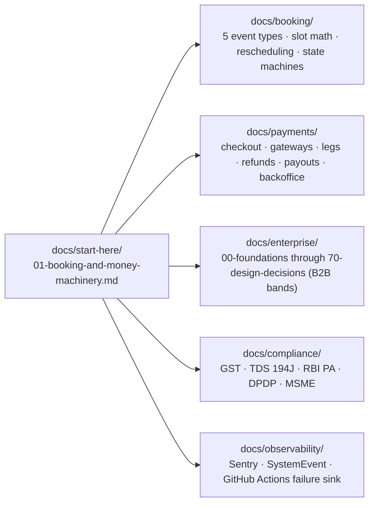

# Start Here — Platform Architecture & End-to-End Explainers

This folder is the **entry point for engineers onboarding onto Familiarise** or working across subsystem boundaries. While each domain directory (`docs/booking/`, `docs/payments/`, `docs/enterprise/`, `docs/compliance/`, `docs/observability/`) documents its own vertical in depth, the documents in `docs/start-here/` trace how the whole platform fits together on one spine.

---

## Canonical Explainers

| #   | Document                                                                          | Scope & What You Will Learn                                                                                                                                                                                                                                                                                                         |
| --- | --------------------------------------------------------------------------------- | ----------------------------------------------------------------------------------------------------------------------------------------------------------------------------------------------------------------------------------------------------------------------------------------------------------------------------------- |
| 01  | [Booking & Money Machinery](./01-booking-and-money-machinery.md)                  | **The end-to-end platform spine.** Combines the 5 booking event types, 4-tier concurrency & locking, organizational scoping (`canSponsor × canHost`, `MemberRole`, `?orgScope=` resolution), B2C & B2B funding rails, all 20 double-entry ledger permutations, 9 worked numeric scenarios with seeded users/orgs, and Wave-2 crons. |
| —   | [Distributed Systems Explained](../architecture/distributed-systems-explained.md) | Upstash Redis distributed locking (`Redlock`), caching layers, and failure-mode posture across serverless functions.                                                                                                                                                                                                                |
| —   | [Prisma Schema Map](../prisma/00-schema-map.md)                                   | Domain-by-domain entity-relationship diagrams of [`prisma/schema.prisma`](../../prisma/schema.prisma).                                                                                                                                                                                                                              |

---

## Where to Go Next by Subsystem

| Domain            | Entry Point                                                      | When to Read                                                                                                    |
| ----------------- | ---------------------------------------------------------------- | --------------------------------------------------------------------------------------------------------------- |
| **Booking**       | [`docs/booking/README.md`](../booking/README.md)                 | Modifying slot validation, `SchedulingService`, rescheduling, cancellations, or recurring series math.          |
| **Payments**      | [`docs/payments/README.md`](../payments/README.md)               | Working on Razorpay/Stripe checkout, `PaymentLeg`, refunds, disputes, payouts, or the Money backoffice console. |
| **Enterprise**    | [`docs/enterprise/README.md`](../enterprise/README.md)           | Working on organizations, SSO/JIT, contracts, programs, sponsor wallets, B2B invoicing, or the ledger.          |
| **Compliance**    | [`docs/compliance/00-overview.md`](../compliance/00-overview.md) | Touching GST (SAC `9983`/`9992`), TDS (`194J`), RBI Payment Aggregator rules, DPDP erasure, or MSME ageing.     |
| **Observability** | [`docs/observability/`](../observability/)                       | Adding Sentry instrumentation, triaging production issues, or inspecting `SystemEvent` / cron failure sinks.    |
