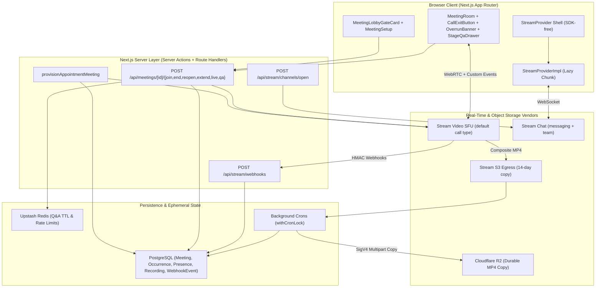
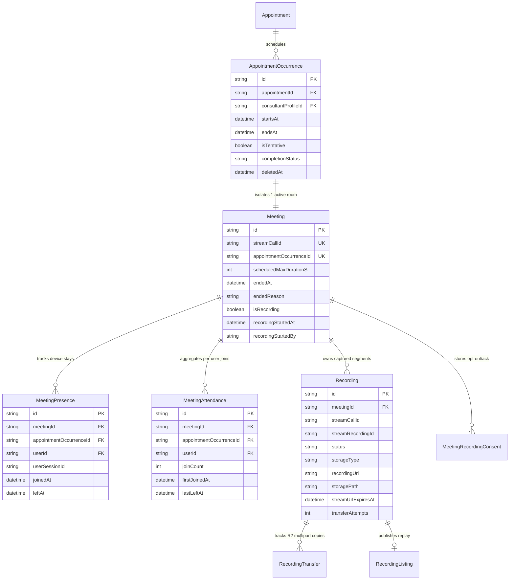

# 01. High-Level Architecture (HLD) & Low-Level Data Model Design (LLD)

> End-to-end distributed systems architecture connecting Next.js App Router, Stream Video SFU, Stream Chat, PostgreSQL CAS state machines, Upstash Redis, Cloudflare R2 storage, and background reconciliation jobs.

## Table of Contents

- [High-Level Architecture (HLD) Topology](#high-level-architecture-hld-topology)
- [Stream Control-Plane Roles & Call Type Matrix](#stream-control-plane-roles--call-type-matrix)
- [Low-Level Design (LLD) & Relational Data Models](#low-level-design-lld--relational-data-models)
- [Call Identifier Isolation & Stale-Link Alias Resolution](#call-identifier-isolation--stale-link-alias-resolution)
- [Compare-and-Set (CAS) Concurrency Invariants (`PG_POOL_MAX=1`)](#compare-and-set-cas-concurrency-invariants-pg_pool_max1)
- [Storage, Caching & Background Reconciliation Crons](#storage-caching--background-reconciliation-crons)
- [Client Provider Split & Bundle Architecture](#client-provider-split--bundle-architecture)
- [Architectural Non-Goals & Deferred Capabilities](#architectural-non-goals--deferred-capabilities)
- [Deprecated & Superseded Approaches](#deprecated--superseded-approaches)

---

## High-Level Architecture (HLD) Topology

The real-time collaboration platform integrates six core subsystems across synchronous HTTP/WebRTC request paths and asynchronous webhook/cron pipelines:

1. **Client Tier (Next.js App Router Browser Bundle)**:
   - SDK-free outer shell (`providers/StreamProvider.tsx`) + lazy `next/dynamic(..., { ssr: false })` bundle (`providers/StreamProviderImpl.tsx`) backed by external singleton refs (`lib/stream/disconnect.ts` and `lib/stream/connection-store.ts`).
   - Meeting lobby gate (`MeetingLobbyGateCard.tsx`), pre-call setup (`MeetingSetup.tsx`), live call stage (`MeetingRoom.tsx`, `CallExitButton`, `OverrunBanner`, `StageControls`, `StageQaDrawer`, `StagePinnedBannerOverlay`), and recording playback drawer (`RecordingPlayerModal.tsx`).
2. **Next.js Server Tier (Server Actions & Route Handlers)**:
   - Server-only room provisioning (`provisionAppointmentMeeting` in `actions/stream/meetings/meeting.action.ts`).
   - Hardened meeting REST endpoints (`POST /api/meetings/[meetingId]/{join,end,reopen,live,extend,qa,recording-consent,stage}`).
   - Chat channel opening (`POST /api/stream/channels/open`), recording controls (`POST /api/stream/recordings/{start,stop,sync}`), and signed webhook ingress (`POST /api/stream/webhooks`).
3. **Stream Video SFU (`default` Call Type)**:
   - Multi-region WebRTC SFU carrying live audio, video, screen shares, emoji reactions, custom Q&A WebSocket events (`sendCallEvent`), backstage waiting rooms (`join_ahead_time_seconds: 900`), and composite MP4 egress into Stream S3 (14-day primary TTL).
4. **Stream Chat (`messaging` & `team` Channels)**:
   - Persistent 1:1 human-pair DMs (`dm-<a>-<b>` for personal scope, `dmo-<orgHash>-<pairHash>` for enterprise org scope), cohort `team` channels (`webinar-<id>`, `class-<id>`), and collaborator threads (`collab-webinar-<planId>`, `collab-class-<planId>`).
5. **PostgreSQL Relational Core & Upstash Redis**:
   - PostgreSQL (`PG_POOL_MAX=1`) stores authoritative appointment schedules (`AppointmentOccurrence`), room metadata (`Meeting`), device stay intervals (`MeetingPresence`), user attendance ledgers (`MeetingAttendance`), recording lifecycles (`Recording`), webhook deduplication receipts (`WebhookEvent`), and DPDP revocation queues (`StreamRevocationRetry`).
   - Upstash Redis (`lib/redis.ts`) stores ephemeral session Q&A question payloads (`stage-qa:<callId>:<questionId>`, 6-hour TTL) and rate-limit sliding windows.
6. **Cloudflare R2 Durable Storage & Background Cron Fleet**:
   - Scheduled GitHub Actions / Netlify background sweeps (`transfer-recordings`, `expire-recordings`, `reconcile-orphaned-sessions`, `reconcile-orphaned-recordings`, `expire-event-channels`, `stream-sync`, `wind-down-deactivated-orgs`) reconcile vendor state against PostgreSQL under `withCronLock`.



---

## Stream Control-Plane Roles & Call Type Matrix

All sessions execute on Stream Video's built-in `default` call type (`STREAM_CALL_TYPE = "default"`), hardened idempotently by `scripts/stream/ensure.ts` (`ensure-call-type-grants.ts`, `ensure-app-settings.ts`, `harden-unused-call-types.ts`):

| Role Name                 | Assigned To                                                                       | Key Permissions Granted                                                                                                                                      | Strictly Stripped / Denied                                                               |
| ------------------------- | --------------------------------------------------------------------------------- | ------------------------------------------------------------------------------------------------------------------------------------------------------------ | ---------------------------------------------------------------------------------------- |
| **`user` / `guest`**      | Unassociated users with a valid app JWT                                           | None on calls (`guest_user_creation_disabled: true`)                                                                                                         | `join-call`, `join-ended-call`, `end-call`, all 18 billable permissions                  |
| **`call_member`**         | Every admitted learner / attendee (`POST /api/meetings/[id]/join`) + plan owner   | `join-call`, `join-ended-call`, `read-call`, `create-call-reaction`, plus `-owner` variants (`mute-users-owner`, `pin-call-track-owner`)                     | `end-call`, global `mute-users`, global `update-call-permissions`, recording start/stop  |
| **`co_presenter`**        | `ACCEPTED` presenter collaborators (`CO_HOST` / `CO_INSTRUCTOR` on webinar/class) | `join-call`, `join-ended-call`, `join-backstage`, `send-audio`, `send-video`, `screenshare`, `mute-users`, `pin-call-track`, `send-event`, `list-recordings` | `end-call`, `update-call-permissions`, `update-call-member`, recording capture mutations |
| **Server SDK (`secret`)** | Next.js API routes (`end`, `reopen`, `extend`, `live`, `qa`, `recordings/start`)  | Full administrative control-plane authority after `guardMeetingRoute` / `resolveMeetingAccess` passes                                                        | Never exposed to browsers (`STREAM_API_SECRET` server-only)                              |

- **Chat Channel Topology**:
  - `dm-<a>-<b>` (`dmh-<sha256>` when exceeding 64 bytes): Canonical 1:1 personal thread between a consultant and consultee across consultations, subscriptions, webinars, and classes.
  - `dmo-<orgHash>-<pairHash>`: Enterprise tenant-isolated 1:1 thread carrying `custom.organization_id = orgId`.
  - `webinar-<id>` / `class-<id>`: Moderated `team` cohort channels with host, `ACCEPTED` collaborators, and enrolled participants.
  - `collab-webinar-<planId>` / `collab-class-<planId>`: Private back-channel thread between plan owner and `ACCEPTED` co-hosts.
  - `TRIAL`: Free trials completely disable Stream Chat channels, 1:1 DMs, and in-call Q&A/chat (`isInCallChatAllowed("TRIAL") === false`).

---

## Low-Level Design (LLD) & Relational Data Models

PostgreSQL acts as the single system of record for scheduling, access authorization, attendance settlement, and recording retention.



### Core Schema Tables, Unique Indices & Invariants

| Model                       | Key Unique Constraints & Indices                                                  | Critical Runtime Invariants                                                                                                                                             |
| --------------------------- | --------------------------------------------------------------------------------- | ----------------------------------------------------------------------------------------------------------------------------------------------------------------------- |
| **`Meeting`**               | `streamCallId @unique`, `appointmentOccurrenceId @unique`                         | Stores bare `streamCallId` (`occurrence-<uuid>` or `occurrence-<uuid>-r<base36>`), never prefixed with `default:`. `endedAt` advances monotonically via CAS.            |
| **`AppointmentOccurrence`** | Indexed on `(appointmentId, startsAt)`, `(consultantProfileId, startsAt, endsAt)` | `endsAt` reflects both scheduled slot end and any persisted `+15m` host extension. Excluded when `deletedAt != null` or `completionStatus in [CANCELLED, RESCHEDULED]`. |
| **`MeetingPresence`**       | `@@unique([meetingId, userSessionId])`, indexed on `appointmentOccurrenceId`      | Keyed by `user_session_id                                                                                                                                               |     | "${sessionId}:${userId}"` so duplicate webhook deliveries (`skipDuplicates: true`) never inflate session counts or move `leftAt` back. |
| **`MeetingAttendance`**     | `@@unique([meetingId, userId])`, indexed on `appointmentOccurrenceId`             | `firstJoinedAt` is write-once immutable; `joinCount` increments only when a genuinely new `MeetingPresence` session interval is inserted (`newSessions > 0`).           |
| **`Recording`**             | Indexed on `(meetingId, streamRecordingId)`, `(status, streamUrlExpiresAt)`       | `READY` rows live on `STREAM_S3` (`streamUrlExpiresAt = end + 14d`) until `transfer-recordings` copies MP4 to R2 (`status = AVAILABLE`, `storageType = PLATFORM`).      |
| **`WebhookEvent`**          | `payloadHash @unique` (`sha256(rawBody)`)                                         | Written prior to dispatch; stale `PROCESSING` claims older than 5 minutes (`STALE_PROCESSING_MS = 300_000`) are safely reclaimed on retry.                              |

---

## Call Identifier Isolation & Stale-Link Alias Resolution

As codified in [ADR-01](./18-architecture-decision-records.md#adr-01-strict-per-occurrence-stream-call-isolation-1-occurrence--1-active-call-id-vs-permanent-link-reuse) and [ADR-02](./18-architecture-decision-records.md#adr-02-call-id-rotation-occurrence-id-rbase36--asymmetric-webhook-lookup-for-reopened-rooms), every occurrence is isolated under its own bare Stream call identifier (`lib/stream/call-cid.ts`):

1. **Initial Canonical Format**: `occurrence-<occurrenceUuid>` (e.g., `occurrence-550e8400-e29b-41d4-a716-446655440000`).
2. **Rotated Segment Format**: `occurrence-<occurrenceUuid>-r<base36Timestamp>` minted whenever a host ends a pre-start device test (`endedAt < startsAt`) or explicitly reopens a closed room via `POST /api/meetings/[meetingId]/reopen`.
3. **Transparent Alias Resolution (`parseOccurrenceIdFromCallId` & `loadMeeting`)**:
   ```typescript
   const OCCURRENCE_CALL_ID_PATTERN =
     /^occurrence-([0-9a-f-]{36})(?:-r[a-z0-9]+)?$/i;
   ```
   When a user navigates to `/meetings/occurrence-<uuid>` from an older invite link after the room has rotated to `occurrence-<uuid>-r<base36>`, `loadMeeting(callId)` in `lib/meetings/access.ts` falls back from `where: { streamCallId: callId }` to `where: { appointmentOccurrenceId: occurrenceId }`, resolving the live `Meeting` record seamlessly and admitting the user into the active `occurrence-<uuid>-r<base36>` room.

---

## Compare-and-Set (CAS) Concurrency Invariants (`PG_POOL_MAX=1`)

Serverless invocations run with a strict 1-connection pool (`PG_POOL_MAX=1`). Every state-mutating route and webhook obeys two strict engineering laws:

1. **Zero Network I/O Inside `prisma.$transaction`**:
   - External calls to Stream (`call.get()`, `call.update()`, `call.end()`, `call.getOrCreate()`, `upsertUsersToStream`) always run **outside** `prisma.$transaction` inside `withStreamCircuitBreaker`.
   - Inside `prisma.$transaction(async (tx) => ...)`, every read or write passes `tx`, never the global `prisma` client.
2. **Optimistic Compare-and-Set (`updateMany`) on Every Lifecycle Edge**:
   - **Room Termination (`stampEnd`)**: `tx.meeting.updateMany({ where: { id: meeting.id, endedAt: meeting.endedAt }, data: { endedAt, endedReason, isRecording: false } })`. If `count === 0`, a racing webhook or route already transitioned `endedAt` and the caller aborts cleanly.
   - **Room Reopen (`POST /api/meetings/[id]/reopen`)**: `prisma.meeting.updateMany({ where: { id: meeting.id, endedAt: { not: null } }, data: { streamCallId: nextCallId, endedAt: null, endedReason: null, isRecording: false } })`. Two concurrent clicks never double-rotate `streamCallId`.
   - **Duration Extension (`POST /api/meetings/[id]/extend`)**: `prisma.appointmentOccurrence.updateMany({ where: { id: occurrence.id, endsAt: slotEndsAt }, data: { endsAt: extendedEndsAt } })`.
   - **Recording Transfer (`transfer-recordings`)**: Claims work via `updateMany({ where: { id, status: "READY" }, data: { status: "TRANSFERRING" } })` and finalizes via `where: { id, status: "TRANSFERRING" }`.

---

## Storage, Caching & Background Reconciliation Crons

All periodic background jobs acquire an exclusive PostgreSQL lease via `withCronLock` (`SystemJobExecution` table) rather than Redis locks:

| Background Job                      | Schedule / Trigger        | Responsibility & Invariant                                                                                                                      |
| ----------------------------------- | ------------------------- | ----------------------------------------------------------------------------------------------------------------------------------------------- |
| **`reconcile-orphaned-sessions`**   | Intra-day cleanup sweep   | Closes open `MeetingPresence` intervals (`leftAt = endedAt`) and reconciles `Meeting` rows whose webhook delivery dropped.                      |
| **`transfer-recordings`**           | Every 6 hours (`:33` UTC) | Reclaims `TRANSFERRING` claims older than 15m, copies `READY` recordings from Stream CDN to Cloudflare R2 (10 MB parts), and marks `AVAILABLE`. |
| **`reconcile-orphaned-recordings`** | Daily (`05:00` UTC)       | Polls Stream `listRecordings` for recent sessions (2h–14d) to back-fill any missed `call.recording_ready` webhooks.                             |
| **`expire-recordings`**             | Daily (`03:00` UTC)       | Enforces retention rules (1:1/sub +90d, webinar/class +365d, org override), deleting R2 objects while sparing purchased/listed replays.         |
| **`expire-event-channels`**         | Daily batch sweep         | Freezes event channels 7 days post-end and deletes dormant channels 90 days post-end in 100-item chunks (`RATE_LIMIT_DELAY_MS = 10_000`).       |
| **`stream-sync`**                   | Daily (`03:30` UTC)       | Reaps orphaned/soft-deleted Stream principals past the 30-day grace window and validates channel rosters.                                       |
| **`wind-down-deactivated-orgs`**    | Event + periodic sweep    | Ends open Stream video calls and freezes channels tagged with `custom.organization_id` when an enterprise tenant is deactivated.                |

---

## Client Provider Split & Bundle Architecture

To prevent pulling Stream's heavy WebRTC and Chat bundles into initial server-rendered routes:

- **`providers/StreamProvider.tsx`**: Lightweight SDK-free shell rendering `children` immediately and loading `StreamProviderImpl` via `next/dynamic(..., { ssr: false })`.
- **`providers/StreamProviderImpl.tsx`**: Defers initial connection via `requestIdleCallback` gated on `!isSessionPending && !!sessionUserId`, seeding initial JWTs minted server-side (`mintInitialStreamTokens`) when present.
- **`lib/stream/disconnect.ts`**: SDK-free module holding global client pointers so navbar sign-out handlers can cleanly disconnect active WebSockets without importing the SDK chunk.

---

## Architectural Non-Goals & Deferred Capabilities

| Capability / Pattern                                         | Current Architectural Rule & Guardrail                                                                                                                                    |
| ------------------------------------------------------------ | ------------------------------------------------------------------------------------------------------------------------------------------------------------------------- |
| **Guest or Magic-Link Call Entry**                           | `guest_user_creation_disabled: true` enforced; every attendee must hold an authenticated session and grant DPDP `STREAM_DATA_PROCESSING` consent.                         |
| **Consultee-to-Consultee Peer DMs**                          | `canDirectMessage` (`lib/stream/dm-eligibility.ts`) enforces strict consultant ↔ consultee eligibility (`APPROVED`, `SCHEDULED`, `COMPLETED`).                            |
| **Per-Call Scoped JWTs on `StreamVideoClient`**              | Video tokens are user-scoped (`generateUserToken` with `iat` + `exp`) for the tab-wide singleton client; admission is gated server-side by `/join` + `call_member` role.  |
| **`livestream` Call Type + HLS Egress for Webinars/Classes** | All sessions up to ~100 seats run on `default` with Backstage + muted defaults; Stream Dynascale bills view-only WebRTC peers at viewer rates without 10–15s HLS latency. |

---

## Deprecated & Superseded Approaches

- **NextAuth Session Hooks (`getServerSession`, `authOptions`)**: Replaced across all client and server boundaries by Better Auth (`auth.api.getSession` on the server and `useSession` from `@/lib/auth-client` on the client).
- **Synchronous `StreamProvider` Blocking Dashboard SSR**: Superseded by `providers/StreamProvider.tsx` (SDK-free shell) + `next/dynamic(..., { ssr: false })` `StreamProviderImpl` publishing into `lib/stream/connection-store.ts`.
- **Browser-Initiated `call.getOrCreate()` and Direct `call.endCall()`**: Superseded by server-authoritative `provisionAppointmentMeeting`, `POST /api/meetings/[meetingId]/join`, `POST /api/meetings/[meetingId]/end`, and `POST /api/meetings/[meetingId]/reopen`.
- **Legacy Per-Booking Chat Channels (`consultation-*`, `subscription-*`)**: Superseded by canonical human-pair threads (`dm-` / `dmo-`) with idempotent contextual receipt cards (`booking-ctx-`).
- **Supabase Storage Fallback for Full Recordings**: Superseded by streaming SigV4 multipart transfers directly into Cloudflare R2 (`lib/storage/r2-client.ts`), keeping Supabase solely for public 60-second marketplace preview clips and thumbnails.
