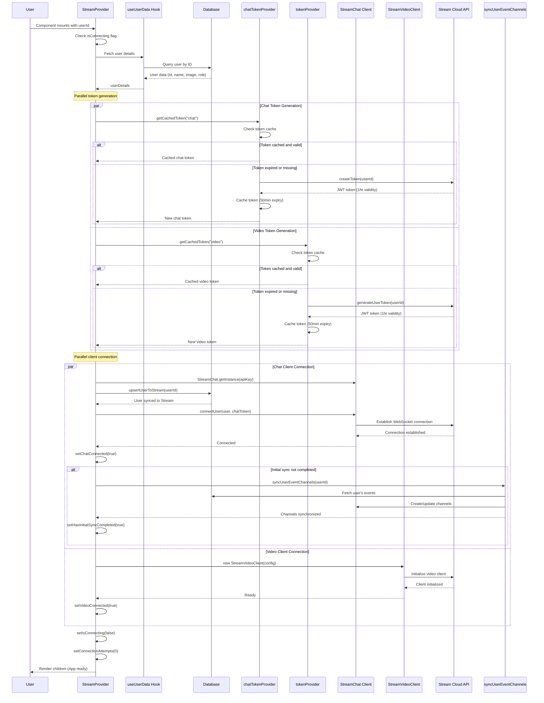
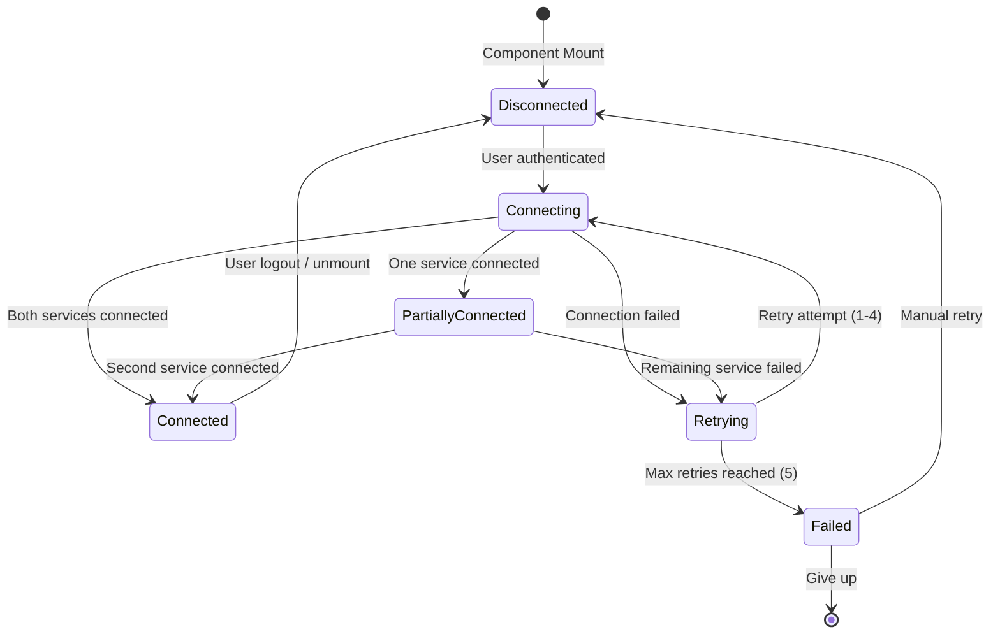

# 03. Provider & Authentication

> Deep dive into StreamProvider architecture, connection lifecycle, token management, and error recovery

## Table of Contents

- [Provider Architecture](#provider-architecture)
- [Initialization Sequence](#initialization-sequence)
- [Connection State Management](#connection-state-management)
- [Token Caching Strategy](#token-caching-strategy)
- [Error Boundary Integration](#error-boundary-integration)
- [Retry Logic with Exponential Backoff](#retry-logic-with-exponential-backoff)
- [Advanced Topics](#advanced-topics)

---

## Provider Architecture

### Dual-Client Design Pattern

**File:** `/providers/StreamProvider.tsx` (Lines 1-382)

StreamProvider implements a **dual-client architecture**, managing two independent SDK clients simultaneously:

```typescript
// Two separate client instances
const [chatClient, setChatClient] = useState<StreamChat | null>(null);
const [videoClient, setVideoClient] = useState<StreamVideoClient | null>(null);
```

#### 1. Chat Client (`StreamChat`)

**Package:** `stream-chat`
**Protocol:** WebSocket
**Purpose:** Real-time messaging

```typescript
import { StreamChat } from "stream-chat";

const client = StreamChat.getInstance(apiKey);
await client.connectUser(
  {
    id: userId,
    name: userName,
    image: userImage,
    role: streamRole,
  },
  () => getCachedToken("chat"),
);
```

**Features:**

- 1-on-1 messaging
- Group channels
- Read receipts
- Typing indicators
- Message reactions
- Channel synchronization

#### 2. Video Client (`StreamVideoClient`)

**Package:** `@stream-io/video-react-sdk`
**Protocol:** WebRTC
**Purpose:** Video/audio calling

```typescript
import { StreamVideoClient } from "@stream-io/video-react-sdk";

const client = new StreamVideoClient({
  apiKey: apiKey,
  user: {
    id: userId,
    name: userName,
    image: userImage,
  },
  tokenProvider: () => getCachedToken("video"),
});
```

**Features:**

- 1-on-1 video calls
- Group meetings
- Screen sharing
- Device management
- Call statistics

### Why Separate Clients?

| Aspect             | Chat Client           | Video Client       |
| ------------------ | --------------------- | ------------------ |
| **Protocol**       | WebSocket             | WebRTC             |
| **Connection**     | Long-lived persistent | On-demand per call |
| **Token Provider** | One-time              | Callback function  |
| **Initialization** | `connectUser()`       | Constructor        |
| **Disconnect**     | `disconnectUser()`    | No explicit method |

### Component Structure

```typescript
export default function StreamProvider({
  children,
  userId,
  enableChat = true,
  enableVideo = true,
}: StreamProviderProps) {
  // Connection state
  const [chatClient, setChatClient] = useState<StreamChat | null>(null);
  const [videoClient, setVideoClient] = useState<StreamVideoClient | null>(null);
  const [chatConnected, setChatConnected] = useState(false);
  const [videoConnected, setVideoConnected] = useState(false);
  const [isConnecting, setIsConnecting] = useState(false);
  const [error, setError] = useState<string | null>(null);
  const [connectionAttempts, setConnectionAttempts] = useState(0);
  const [hasInitialSyncCompleted, setHasInitialSyncCompleted] = useState(false);

  // Token cache
  const [tokenCache, setTokenCache] = useState<{
    chatToken?: string;
    videoToken?: string;
    expiresAt?: number;
  }>({});

  // Connection logic (see below)
  useEffect(() => {
    if (!isLoading && userDetails && apiKey) {
      connectServices();
    }
    return () => {
      disconnect();
    };
  }, [userDetails, isLoading, apiKey]);

  return (
    <StreamErrorBoundary onError={handleError} enableRetry={true}>
      <StreamConnectionContext.Provider value={connectionState}>
        {enableVideo && videoClient ? (
          <StreamVideo client={videoClient}>
            {enableChat && chatClient ? (
              <Chat client={chatClient}>{children}</Chat>
            ) : (
              children
            )}
          </StreamVideo>
        ) : enableChat && chatClient ? (
          <Chat client={chatClient}>{children}</Chat>
        ) : (
          children
        )}
      </StreamConnectionContext.Provider>
    </StreamErrorBoundary>
  );
}
```

**Nested Provider Pattern:**

- Outermost: `StreamErrorBoundary` (error handling)
- Middle: `StreamConnectionContext` (connection state)
- Inner: `StreamVideo` → `Chat` → `children` (SDK providers)

---

## Initialization Sequence

### Complete Flow Diagram



### Step-by-Step Breakdown

#### Step 1: User Data Fetching (Lines 74)

```typescript
const { userDetails, isLoading } = useUserData(userId);
```

**What happens:**

- Hook fetches user from database
- Retrieves: `id`, `name`, `image`, `role`
- Waits until `!isLoading` before proceeding

**Database Query:**

```typescript
// Inside useUserData hook
const user = await prisma.user.findUnique({
  where: { id: userId },
  select: {
    id: true,
    name: true,
    image: true,
    role: true,
  },
});
```

#### Step 2: Token Cache Check (Lines 76-121)

```typescript
const [tokenCache, setTokenCache] = useState<{
  chatToken?: string;
  videoToken?: string;
  expiresAt?: number;
}>({});

const isTokenValid = useCallback(
  (type: "chat" | "video") => {
    const token =
      type === "chat" ? tokenCache.chatToken : tokenCache.videoToken;
    const expiresAt = tokenCache.expiresAt;

    if (!token || !expiresAt) return false;

    // Check if token expires within next 5 minutes
    return Date.now() < expiresAt - 5 * 60 * 1000;
  },
  [tokenCache],
);

const getCachedToken = useCallback(
  async (type: "chat" | "video"): Promise<string> => {
    if (isTokenValid(type)) {
      return type === "chat" ? tokenCache.chatToken! : tokenCache.videoToken!;
    }

    // Generate new token
    const newToken =
      type === "chat"
        ? await chatTokenProvider(userId)
        : await tokenProvider(userId);

    // Cache with 50-minute expiry (tokens usually last 1 hour)
    const expiresAt = Date.now() + 50 * 60 * 1000;

    setTokenCache((prev) => ({
      ...prev,
      [`${type}Token`]: newToken,
      expiresAt,
    }));

    return newToken;
  },
  [userId, tokenCache, isTokenValid],
);
```

**Token Generation (Server Actions):**

```typescript
// actions/stream/chat/stream.action.ts

// Chat token
export const chatTokenProvider = async (userId: string) => {
  const serverClient = StreamChat.getInstance(apiKey, apiSecret);
  const token = serverClient.createToken(userId);
  return token;
};

// Video token
export const tokenProvider = async (userId: string) => {
  const client = new StreamClient(apiKey, apiSecret);
  const exp = Math.round(Date.now() / 1000) + 60 * 60; // 1 hour
  const issued = Math.round(Date.now() / 1000) - 60; // 1 minute ago

  const token = client.generateUserToken({
    user_id: userId,
    exp,
    iat: issued,
  });

  return token;
};
```

#### Step 3: Chat Client Connection (Lines 128-189)

```typescript
const connectChat = useCallback(async () => {
  if (!enableChat || !userDetails || !apiKey || chatConnected) return;

  try {
    console.log(`Connecting user ${userDetails.id} to Stream Chat`);

    const client = StreamChat.getInstance(apiKey);

    // Ensure user exists in Stream's database
    try {
      await upsertUserToStream(userDetails.id);
      console.log(`User ${userDetails.id} upserted to Stream`);
    } catch (upsertError) {
      console.warn("User upserting failed, continuing:", upsertError);
    }

    const streamRole = mapRoleToStream(userDetails.role);

    await client.connectUser(
      {
        id: userDetails.id,
        name: userDetails.name ?? userDetails.id,
        image: userDetails.image ?? undefined,
        role: streamRole, // ⚠️ Currently always "admin"
      },
      () => getCachedToken("chat"),
    );

    setChatClient(client);
    setChatConnected(true);

    // Initial channel sync only once
    if (!hasInitialSyncCompleted) {
      try {
        console.log(
          `Performing initial channel sync for user ${userDetails.id}`,
        );
        await syncUserEventChannels(userDetails.id);
        setHasInitialSyncCompleted(true);
        console.log(`Completed initial sync for user ${userDetails.id}`);
      } catch (syncError) {
        console.warn(
          `Channel sync failed for user ${userDetails.id}:`,
          syncError,
        );
      }
    }

    console.log(`Chat connection successful for user ${userDetails.id}`);
  } catch (error) {
    console.error("Chat connection failed:", error);
    setChatConnected(false);
    throw error;
  }
}, [
  enableChat,
  userDetails,
  apiKey,
  chatConnected,
  hasInitialSyncCompleted,
  getCachedToken,
]);
```

**Key Points:**

- Singleton pattern: `StreamChat.getInstance()` returns same instance
- User upserted to Stream database before connection
- Role mapping via `mapRoleToStream()` (currently always returns "admin")
- Token provided as callback function
- Channel sync only runs once per session
- Errors thrown to trigger retry logic

#### Step 4: Video Client Connection (Lines 191-215)

```typescript
const connectVideo = useCallback(async () => {
  if (!enableVideo || !userDetails || !apiKey || videoConnected) return;

  try {
    console.log(`Connecting user ${userDetails.id} to Stream Video`);

    const client = new StreamVideoClient({
      apiKey: apiKey,
      user: {
        id: userDetails.id,
        name: userDetails.name ?? userDetails.id,
        image: userDetails.image ?? undefined,
      },
      tokenProvider: () => getCachedToken("video"),
    });

    setVideoClient(client);
    setVideoConnected(true);
    console.log(`Video connection successful for user ${userDetails.id}`);
  } catch (error) {
    console.error("Video connection failed:", error);
    setVideoConnected(false);
    throw error;
  }
}, [enableVideo, userDetails, apiKey, videoConnected, getCachedToken]);
```

**Key Differences from Chat:**

- New instance created (no singleton)
- Token provider as callback (called when needed)
- No explicit connection method
- Initialization completes synchronously

#### Step 5: Parallel Connection Execution (Lines 217-268)

```typescript
const connectServices = useCallback(async () => {
  if (isLoading || !userDetails || isConnecting) return;

  setIsConnecting(true);
  setError(null);

  try {
    const promises = [];
    if (enableChat && !chatConnected) promises.push(connectChat());
    if (enableVideo && !videoConnected) promises.push(connectVideo());

    await Promise.all(promises); // Parallel execution
    setConnectionAttempts(0); // Reset on success
  } catch (error) {
    const errorMessage =
      error instanceof Error ? error.message : "Connection failed";
    setError(errorMessage);

    // Implement exponential backoff retry
    const newAttempts = connectionAttempts + 1;
    setConnectionAttempts(newAttempts);

    if (newAttempts < 5) {
      const delay = getRetryDelay(newAttempts);
      console.log(`Retrying connection in ${delay}ms (attempt ${newAttempts})`);
      setTimeout(() => {
        setIsConnecting(false);
        connectServices();
      }, delay);
      return;
    } else {
      console.error("Max connection attempts reached");
    }
  } finally {
    setIsConnecting(false);
  }
}, [
  isLoading,
  userDetails,
  isConnecting,
  enableChat,
  enableVideo,
  chatConnected,
  videoConnected,
  connectChat,
  connectVideo,
  connectionAttempts,
  getRetryDelay,
]);
```

**Performance Benefit:**

```
Sequential: chat (2-3s) + video (2-3s) = 4-6s total
Parallel:   max(2-3s, 2-3s) = 2-3s total

Speed improvement: ~50% faster
```

---

## Connection State Management

### State Variables

```typescript
interface StreamConnectionState {
  chatConnected: boolean; // Chat WebSocket active
  videoConnected: boolean; // Video client initialized
  isConnecting: boolean; // Connection in progress
  error: string | null; // Last error message
  retryConnection: () => void; // Manual retry function
}
```

**Implementation (Lines 28-46):**

```typescript
const StreamConnectionContext = createContext<StreamConnectionState | null>(
  null,
);

export const useStreamConnection = () => {
  const context = useContext(StreamConnectionContext);
  if (!context) {
    throw new Error("useStreamConnection must be used within StreamProvider");
  }
  return context;
};
```

### State Transition Diagram



### Connection State Access

**Usage in Components:**

```typescript
"use client";

import { useStreamConnection } from "@/providers/StreamProvider";

export function ConnectionStatus() {
  const {
    chatConnected,
    videoConnected,
    isConnecting,
    error,
    retryConnection,
  } = useStreamConnection();

  if (isConnecting) {
    return <div>Connecting to Stream...</div>;
  }

  if (error) {
    return (
      <div>
        <p>Error: {error}</p>
        <button onClick={retryConnection}>Retry</button>
      </div>
    );
  }

  return (
    <div>
      <p>Chat: {chatConnected ? "✅" : "❌"}</p>
      <p>Video: {videoConnected ? "✅" : "❌"}</p>
    </div>
  );
}
```

### Loading States

Provider shows loading UI while connecting (Lines 321-334):

```typescript
if (
  (enableChat && !chatClient && !error) ||
  (enableVideo && !videoClient && !error) ||
  isConnecting
) {
  return (
    <div className="flex items-center justify-center min-h-[200px]">
      <div className="animate-spin rounded-full h-12 w-12 border-t-2 border-b-2 border-primary"></div>
      {isConnecting && (
        <p className="ml-4 text-sm text-gray-600">Connecting to Stream...</p>
      )}
    </div>
  );
}
```

### Error States

Error UI shown after max retries (Lines 337-352):

```typescript
if (error && connectionAttempts >= 5) {
  return (
    <div className="flex flex-col items-center justify-center min-h-[200px] p-4">
      <div className="text-red-600 text-center">
        <h3 className="font-semibold mb-2">Connection Failed</h3>
        <p className="text-sm mb-4">{error}</p>
        <button
          onClick={retryConnection}
          className="px-4 py-2 bg-blue-600 text-white rounded hover:bg-blue-700"
        >
          Retry Connection
        </button>
      </div>
    </div>
  );
}
```

---

## Token Caching Strategy

### Why Cache Tokens?

**Problem without caching:**

- ❌ API call on every render
- ❌ Slow (200-500ms per token)
- ❌ Expensive (counts toward API limits)
- ❌ Unnecessary (tokens valid for 1 hour)

**Solution with caching:**

- ✅ Generate token once
- ✅ Reuse for 50 minutes
- ✅ Auto-refresh before expiry
- ✅ Reduced API calls by ~98%

### Cache Implementation (Lines 76-121)

```typescript
const [tokenCache, setTokenCache] = useState<{
  chatToken?: string;
  videoToken?: string;
  expiresAt?: number;
}>({});

const isTokenValid = useCallback(
  (type: "chat" | "video") => {
    const token =
      type === "chat" ? tokenCache.chatToken : tokenCache.videoToken;
    const expiresAt = tokenCache.expiresAt;

    if (!token || !expiresAt) return false;

    // Check if token expires within next 5 minutes
    return Date.now() < expiresAt - 5 * 60 * 1000;
  },
  [tokenCache],
);

const getCachedToken = useCallback(
  async (type: "chat" | "video"): Promise<string> => {
    if (isTokenValid(type)) {
      console.log(`Using cached ${type} token`);
      return type === "chat" ? tokenCache.chatToken! : tokenCache.videoToken!;
    }

    // Generate new token
    console.log(`Generating new ${type} token`);
    const newToken =
      type === "chat"
        ? await chatTokenProvider(userId)
        : await tokenProvider(userId);

    // Cache with 50-minute expiry (tokens usually last 1 hour)
    const expiresAt = Date.now() + 50 * 60 * 1000;

    setTokenCache((prev) => ({
      ...prev,
      [`${type}Token`]: newToken,
      expiresAt,
    }));

    return newToken;
  },
  [userId, tokenCache, isTokenValid],
);
```

### Token Lifecycle Timeline

```
Time    Event                     Token State
-----   -------------------------  ------------------
0:00    Token generated           Valid (expires 1:00)
0:00    Cached                    Cached (expires 0:50)
0:30    Token requested           ✅ Cached token used
0:49    Token requested           ✅ Cached token used
0:50    Cache expires             ⚠️ Generate new token
0:50    New token generated       Valid (expires 1:50)
0:50    New token cached          Cached (expires 1:40)
1:00    Old token expires         (Already replaced at 0:50)
```

### Why 50 Minutes (Not 60)?

**Token Validity:** 1 hour (3600 seconds)
**Cache Duration:** 50 minutes (3000 seconds)
**Safety Buffer:** 10 minutes (600 seconds)

**Reasoning:**

1. **Prevents mid-operation expiry**
   - Token refreshed before critical operations
   - No connection drops during long sessions

2. **Handles clock drift**
   - Server/client time differences
   - Network latency tolerance

3. **Covers edge cases**
   - Slow network connections
   - Token validation delays
   - Race conditions

⚠️ **Known Issue:** 10-minute buffer may not be enough for some edge cases.
See: [Known Issues #2 - Token Expiry Race Condition](./13-known-issues.md#medium-bug-2-token-expiry-race-condition)

### Cache Invalidation (Lines 276-298)

```typescript
const disconnect = useCallback(async () => {
  const promises = [];

  if (chatClient) {
    promises.push(
      chatClient.disconnectUser().then(() => {
        console.log("Chat client disconnected");
        setChatClient(null);
        setChatConnected(false);
      }),
    );
  }

  if (videoClient) {
    // Note: StreamVideoClient doesn't have explicit disconnect method
    setVideoClient(null);
    setVideoConnected(false);
  }

  await Promise.all(promises);
  setTokenCache({}); // Clear token cache
}, [chatClient, videoClient]);
```

**Cache cleared on:**

- User logout
- Component unmount
- Manual disconnect
- Connection error (after max retries)

---

## Error Boundary Integration

### StreamErrorBoundary Component

**File:** `/components/stream/StreamErrorBoundary.tsx` (Lines 1-234)

Provider wrapped in error boundary for crash recovery (Lines 368-378):

```typescript
return (
  <StreamErrorBoundary
    onError={(error, errorInfo) => {
      console.error("Stream Provider Error:", error, errorInfo);
      setError(error.message);
    }}
    enableRetry={true}
  >
    <StreamConnectionContext.Provider value={connectionState}>
      {content}
    </StreamConnectionContext.Provider>
  </StreamErrorBoundary>
);
```

### Error Boundary Implementation

```typescript
export class StreamErrorBoundary extends React.Component<
  StreamErrorBoundaryProps,
  StreamErrorBoundaryState
> {
  private retryCount = 0;
  private maxRetries = 3;

  static getDerivedStateFromError(
    error: Error,
  ): Partial<StreamErrorBoundaryState> {
    // Determine error type based on error message
    let errorType: "chat" | "video" | "general" = "general";

    const errorString = error.toString().toLowerCase();
    if (errorString.includes("chat") || errorString.includes("message")) {
      errorType = "chat";
    } else if (errorString.includes("video") || errorString.includes("call")) {
      errorType = "video";
    }

    return {
      hasError: true,
      error,
      errorType,
    };
  }

  componentDidCatch(error: Error, errorInfo: React.ErrorInfo) {
    console.error("StreamErrorBoundary caught an error:", error, errorInfo);

    this.setState({
      error,
      errorInfo,
    });

    // Call custom error handler if provided
    if (this.props.onError) {
      this.props.onError(error, errorInfo);
    }

    // Log to monitoring service in production
    if (process.env.NODE_ENV === "production") {
      console.error("Stream Error Boundary:", {
        error: error.message,
        stack: error.stack,
        componentStack: errorInfo.componentStack,
        errorType: this.state.errorType,
        retryCount: this.retryCount,
      });
    }
  }

  handleRetry = () => {
    if (this.retryCount < this.maxRetries) {
      this.retryCount++;
      console.log(
        `Retrying Stream component (attempt ${this.retryCount}/${this.maxRetries})`,
      );

      this.setState({
        hasError: false,
        error: null,
        errorInfo: null,
        errorType: "general",
      });
    } else {
      console.warn("Maximum retry attempts reached for Stream component");
    }
  };
}
```

### Error Types Handled

| Error Type         | Detection                 | Recovery                    |
| ------------------ | ------------------------- | --------------------------- |
| **Authentication** | "token", "authentication" | Regenerate token, reconnect |
| **Network**        | "network", "connection"   | Exponential backoff retry   |
| **Permission**     | "permission"              | Log error, notify user      |
| **API Error**      | HTTP status codes         | Retry with delay            |
| **Unknown**        | Catchall                  | Single retry attempt        |

### Custom Error Messages

```typescript
const getErrorMessage = () => {
  if (!error) return "An unknown error occurred";

  if (
    error.message.includes("token") ||
    error.message.includes("authentication")
  ) {
    return "Authentication failed. Please refresh the page to reconnect.";
  }

  if (
    error.message.includes("network") ||
    error.message.includes("connection")
  ) {
    return "Network connection failed. Please check your internet and try again.";
  }

  if (error.message.includes("permission")) {
    return "Permission denied. Please ensure you have the necessary permissions.";
  }

  return error.message;
};
```

---

## Retry Logic with Exponential Backoff

### Why Exponential Backoff?

**Linear Retry Issues:**

```
Attempt 1: 1s delay  → Server still down
Attempt 2: 1s delay  → Server still down
Attempt 3: 1s delay  → Server still down
Attempt 4: 1s delay  → Server still down
Result: Wasted retries, server overloaded
```

**Exponential Backoff Benefits:**

```
Attempt 1: 1s delay   → Server recovering
Attempt 2: 2s delay   → Server recovering
Attempt 3: 4s delay   → Server recovering
Attempt 4: 8s delay   → Server back up ✅
Result: Server has time to recover
```

### Implementation (Lines 124-126, 217-268)

```typescript
// Exponential backoff calculation
const getRetryDelay = useCallback((attempt: number) => {
  return Math.min(1000 * Math.pow(2, attempt), 30000); // Max 30 seconds
}, []);
```

**Delay Progression:**

| Attempt | Calculation   | Delay | Cumulative Wait |
| ------- | ------------- | ----- | --------------- |
| 1       | 1000 × 2^0    | 1s    | 1s              |
| 2       | 1000 × 2^1    | 2s    | 3s              |
| 3       | 1000 × 2^2    | 4s    | 7s              |
| 4       | 1000 × 2^3    | 8s    | 15s             |
| 5       | 1000 × 2^4    | 16s   | 31s             |
| 6+      | min(32s, 30s) | 30s   | (max cap)       |

### Retry Logic in connectServices

```typescript
const connectServices = useCallback(async () => {
  if (isLoading || !userDetails || isConnecting) return;

  setIsConnecting(true);
  setError(null);

  try {
    const promises = [];
    if (enableChat && !chatConnected) promises.push(connectChat());
    if (enableVideo && !videoConnected) promises.push(connectVideo());

    await Promise.all(promises);
    setConnectionAttempts(0); // Reset on success
  } catch (error) {
    const errorMessage =
      error instanceof Error ? error.message : "Connection failed";
    setError(errorMessage);

    // Implement exponential backoff retry
    const newAttempts = connectionAttempts + 1;
    setConnectionAttempts(newAttempts);

    if (newAttempts < 5) {
      // Max 5 attempts
      const delay = getRetryDelay(newAttempts);
      console.log(`Retrying connection in ${delay}ms (attempt ${newAttempts})`);

      setTimeout(() => {
        setIsConnecting(false);
        connectServices(); // Recursive retry
      }, delay);
      return;
    } else {
      console.error("Max connection attempts reached");
    }
  } finally {
    setIsConnecting(false);
  }
}, [
  isLoading,
  userDetails,
  isConnecting,
  enableChat,
  enableVideo,
  chatConnected,
  videoConnected,
  connectChat,
  connectVideo,
  connectionAttempts,
  getRetryDelay,
]);
```

### Manual Retry Function (Lines 270-274)

```typescript
const retryConnection = useCallback(() => {
  setConnectionAttempts(0);
  setError(null);
  connectServices();
}, [connectServices]);
```

**Usage:**

```typescript
const { retryConnection } = useStreamConnection();

<button onClick={retryConnection}>Retry Connection</button>
```

---

## Advanced Topics

### Cleanup on Unmount (Lines 301-309)

```typescript
useEffect(() => {
  if (!isLoading && userDetails && apiKey) {
    connectServices();
  }

  return () => {
    disconnect(); // Cleanup function
  };
}, [userDetails, isLoading, apiKey]);
```

**Cleanup Process:**

1. Disconnect chat client (`chatClient.disconnectUser()`)
2. Nullify video client (no explicit disconnect method)
3. Clear token cache
4. Reset connection states

### Connection State Persistence

**Problem:** Page reload loses connection state

**Solution:** Reconnect on mount (Lines 301-309)

```typescript
useEffect(() => {
  if (userId && !chatConnected) {
    connectServices();
  }
}, [userId]);
```

**Security Note:**

- Tokens are NOT persisted
- No localStorage/sessionStorage
- Memory-only cache (cleared on unmount)
- New tokens generated on each session

### Singleton Pattern in StreamChat

```typescript
const client1 = StreamChat.getInstance(apiKey);
const client2 = StreamChat.getInstance(apiKey);

console.log(client1 === client2); // true (same instance)
```

**Implications:**

- Multiple `StreamProvider` instances share same chat client
- Only one provider should exist in component tree
- Place provider at root layout level

### Debugging Tips

**Enable Debug Logging:**

```typescript
const DEBUG = process.env.NODE_ENV === "development";

if (DEBUG) {
  console.log("[Stream Debug]", {
    userId,
    chatConnected,
    videoConnected,
    isConnecting,
    cachedTokens: Object.keys(tokenCache),
    connectionAttempts,
  });
}
```

**Monitor Connection State:**

```typescript
useEffect(() => {
  console.log("Connection state changed:", {
    chat: chatConnected,
    video: videoConnected,
    connecting: isConnecting,
    error: error?.message,
    attempts: connectionAttempts,
  });
}, [chatConnected, videoConnected, isConnecting, error, connectionAttempts]);
```

**Test Token Expiry:**

```typescript
// Temporarily change cache duration for testing
const TOKEN_CACHE_DURATION = 60 * 1000; // 1 minute instead of 50

setTimeout(() => {
  console.log("Token should refresh now...");
}, 61 * 1000);
```

### Performance Optimizations

**1. Lazy Initialization**

```typescript
// Only initialize when user is authenticated
{session?.user?.id ? (
  <StreamProvider userId={session.user.id}>
    {children}
  </StreamProvider>
) : (
  children // No Stream overhead
)}
```

**2. Memoization**

```typescript
const connectToStream = useCallback(async (userId: string) => {
  // Connection logic
}, []); // No dependencies = created once

const getCachedToken = useCallback(
  async (type) => {
    // Token logic
  },
  [userId],
); // Only recreate if userId changes
```

**3. Parallel Connection**

```typescript
await Promise.all([connectChat(), connectVideo()]);
// ~50% faster than sequential
```

---

## Common Issues & Solutions

### Issue: "User already connected"

**Cause:** Duplicate `connectUser()` calls

**Fix:** Check `isConnecting` flag before connecting

```typescript
if (isConnecting) {
  console.log("Already connecting, skipping...");
  return;
}

setIsConnecting(true);
await connectUser();
setIsConnecting(false);
```

### Issue: "Token expired" immediately

**Cause:** Server time mismatch

**Fix:** Ensure server time is synchronized

```bash
# Check server time
date

# Synchronize (Linux)
sudo ntpdate pool.ntp.org
```

### Issue: Connection works locally, fails in production

**Causes:**

1. Wrong environment variables
2. HTTP instead of HTTPS
3. CORS configuration

**Fix:** Verify production env vars and use HTTPS

---

## Next Steps

**Understand specific implementations:**

- [04. Chat Implementation](./04-chat-implementation.md) - Messaging features
- [05. Video Implementation](./05-video-implementation.md) - Video calls
- [08. Token Management](./08-token-management.md) - Token deep dive

**Handle errors:**

- [12. Error Handling](./12-error-handling.md) - Error boundaries and recovery
- [13. Known Issues](./13-known-issues.md) - Known bugs and workarounds

---

← [02. Setup](./02-setup-configuration.md) | [Next: Chat Implementation](./04-chat-implementation.md) →
