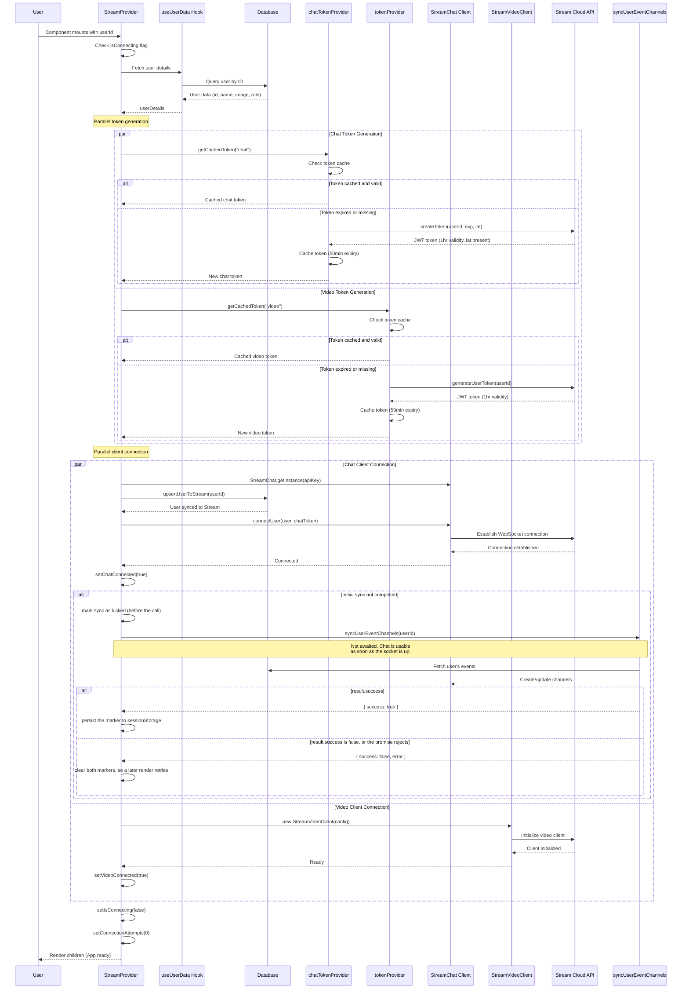
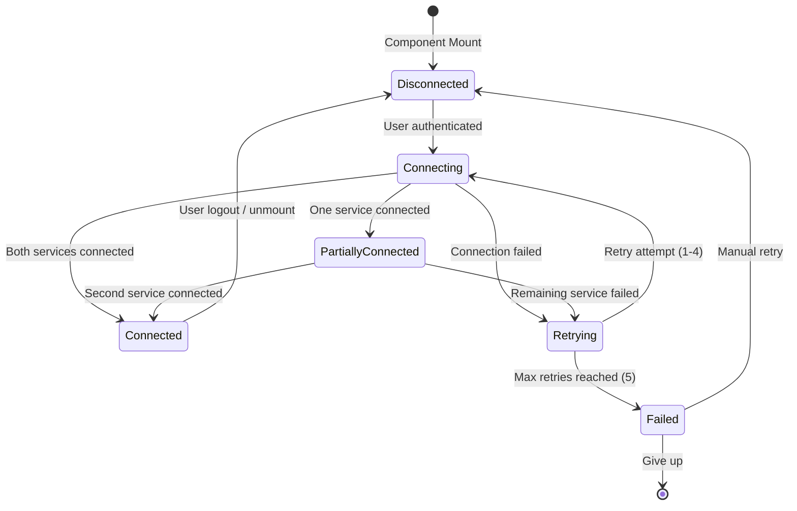

# 03. Provider & Authentication

> Deep dive into StreamProvider architecture, connection lifecycle, token management, and error recovery

## Table of Contents

- [Provider Architecture](#provider-architecture)
- [Initialization Sequence](#initialization-sequence)
- [Connection State Management](#connection-state-management)
- [Token Caching Strategy](#token-caching-strategy)
- [Error Boundary Integration](#error-boundary-integration)
- [Retry Logic with Exponential Backoff](#retry-logic-with-exponential-backoff)
- [Advanced Topics](#advanced-topics)

---

## Provider Architecture

### Dual-Client Design Pattern

**File:** `providers/StreamProviderImpl.tsx` (the SDK-free shell lives in `providers/StreamProvider.tsx`)

StreamProvider manages two SDK clients — one for chat, one for video — but holds them in a **single piece of state**:

```typescript
// One settled value, not two independent ones
interface SettledStreamClients {
  chat: StreamChat | null;
  video: StreamVideoClient | null;
}
const [clients, setClients] = useState<SettledStreamClients | null>(null);
```

`null` means "not settled yet", which is deliberately distinct from a settled result whose `chat` or `video` is `null` because that particular connect failed.

#### Why one state and not two

This is the most important thing to understand before changing this file, because the obvious refactor — a `useState` per client — is the bug.

**This is now a historical constraint, kept for a different reason.** The
original defect was that the provider wrapped its children in `<Chat>` and
`<StreamVideo>` only once a client existed. With two independent states set by
two async connects that race, the element occupying that wrapper slot changed
**type** between renders: `children`, then `<StreamVideo>`, then `<Chat>`, in
whichever order the sockets happened to settle. React cannot reconcile a change
of element type in place — it unmounts the old tree and mounts a new one — and
the subtree was the entire dashboard.

The user-visible symptom was a join button that appeared to do nothing: the click
started a join, the dashboard remounted underneath it as the second client
connected, and the in-flight join was destroyed. People pressed it repeatedly
(#248).

The provider no longer wraps `children` at all (see
[Component Structure](#component-structure)), so the remount is gone by
construction. The single committed value is still the right shape: it keeps the
two connects from producing two renders, and it means every downstream effect
that reads `clients` sees a consistent pair. A connect that genuinely _fails_ can
still cost a second commit if a later retry succeeds; that is accepted, because
withholding the client that did connect would break the sidebar's chat-unread
badge on every route.

Do not reintroduce per-client state, and do not reintroduce wrapper elements
around `children`.

#### 1. Chat Client (`StreamChat`)

**Package:** `stream-chat`
**Protocol:** WebSocket
**Purpose:** Real-time messaging

```typescript
import { StreamChat } from "stream-chat";

const client = StreamChat.getInstance(apiKey);
await client.connectUser(
  {
    id: userId,
    name: userName,
    image: userImage,
    role: streamRole,
  },
  () => getCachedToken("chat"),
);
```

**Features:**

- 1-on-1 messaging
- Group channels
- Read receipts
- Typing indicators
- Message reactions
- Channel synchronization

#### 2. Video Client (`StreamVideoClient`)

**Package:** `@stream-io/video-react-sdk`
**Protocol:** WebRTC
**Purpose:** Video/audio calling

```typescript
import { StreamVideoClient } from "@stream-io/video-react-sdk";

const client = new StreamVideoClient({
  apiKey: apiKey,
  user: {
    id: userId,
    name: userName,
    image: userImage,
  },
  tokenProvider: () => getCachedToken("video"),
});
```

**Features:**

- 1-on-1 video calls
- Group meetings
- Screen sharing
- Device management
- Call statistics

### Why Separate Clients?

| Aspect             | Chat Client           | Video Client       |
| ------------------ | --------------------- | ------------------ |
| **Protocol**       | WebSocket             | WebRTC             |
| **Connection**     | Long-lived persistent | On-demand per call |
| **Token Provider** | One-time              | Callback function  |
| **Initialization** | `connectUser()`       | Constructor        |
| **Disconnect**     | `disconnectUser()`    | No explicit method |

### Component Structure

**The provider renders `children` DIRECTLY, and mounts the connector as a
SIBLING.** It does not wrap children in `<Chat>` and `<StreamVideo>`, and it does
not hold the clients or the token cache in its own state.

There are two files, and the split is the point:

| File                               | Contains                                                                                                                                                                     |
| ---------------------------------- | ---------------------------------------------------------------------------------------------------------------------------------------------------------------------------- |
| `providers/StreamProvider.tsx`     | The **SDK-free shell.** Renders `children`; owns the connection-state context; publishes to a store. Imports no Stream SDK.                                                  |
| `providers/StreamProviderImpl.tsx` | The **heavy connector.** Holds the SDK clients, the websocket lifecycle, `getCachedToken`, and the sync effect. Renders nothing. Loaded with `dynamic(..., { ssr: false })`. |

```typescript
// providers/StreamProvider.tsx — the whole shape
const StreamConnector = dynamic(() => import("@/providers/StreamProviderImpl"), {
  ssr: false,
});

const StreamProvider = ({ children, ...connectorProps }: StreamProviderProps) => {
  const snapshot = useSyncExternalStore(
    subscribeStreamConnection,
    getStreamConnectionSnapshot,
    getStreamConnectionServerSnapshot,
  );

  const retryConnection = useCallback(() => {
    // The connector owns the retry loop; it listens for this event so the
    // shell does not have to import anything from the SDK bundle to expose it.
    window.dispatchEvent(new CustomEvent("stream:retry-connection"));
  }, []);

  return (
    <StreamConnectionContext.Provider value={connectionStateFrom(snapshot)}>
      {children}
      <StreamConnector {...connectorProps} />
    </StreamConnectionContext.Provider>
  );
};
```

#### Why not wrap `children` — two measured bugs

1. **`ssr: false` skips server rendering for the component AND its children.**
   While the connector wrapped the dashboard, no dashboard markup reached the
   HTML: `<h1` never appeared in the document and FCP sat at ~6s regardless of
   what happened on the server (#1102 measurements A/B/C). Because children now
   sit in a fixed position, `ssr: false` costs only the connector.
2. **Changing the element type at a position remounts that subtree.** The
   connector used to swap the wrapper set once the sockets settled
   (`children` → `<StreamVideo>` → `<Chat>`), which is the storm behind "I
   pressed Join ten times" (#248).

The SDK's own `<Chat>` / `<StreamVideo>` contexts are mounted by the surfaces that
actually consume them — the Messages tabs and `/meetings` — not here.

#### Consequences worth knowing

- **`useStreamConnection()` does not throw outside the provider.** The context is
  created with a `DEFAULT_CONNECTION_STATE` and the hook is a plain
  `useContext`, so a consumer rendered outside the tree reads
  `{ chatConnected: false, videoConnected: false, isConnecting: false, error: null, failure: null, retryConnection: noop }`.
- **`getCachedToken` lives in `StreamProviderImpl.tsx`**, not the shell. So does
  the token cache state. The shell re-exports `disconnectStreamClients` from
  `@/lib/stream/disconnect` purely so existing importers of that path keep
  working.
- **`dynamic()` has no `loading` prop here.** There is no spinner, because the
  connector renders nothing — there is nothing to display a loading state for.
  `isConnecting` on the context is what a surface should render.
- The shell exists partly so SDK-free consumers can import the context without
  pulling the SDK: `components/chat/DebugDialog.tsx` does exactly that.

Note that the connection _flags_ (`chatConnected`, `videoConnected`,
`isConnecting`) come from `useSyncExternalStore` over a module-level store, not
from `useState` in the provider. That is what lets the connector's writes reach
consumers without the shell re-rendering the tree it wraps.

---

## Initialization Sequence

### Complete Flow Diagram


```mermaid
sequenceDiagram
    participant User
    participant Provider as StreamProvider
    participant UserData as useUserData Hook
    participant DB as Database
    participant ChatToken as chatTokenProvider
    participant VideoToken as tokenProvider
    participant ChatSDK as StreamChat Client
    participant VideoSDK as StreamVideoClient
    participant StreamAPI as Stream Cloud API
    participant Sync as syncUserEventChannels

    User->>Provider: Component mounts with userId
    Provider->>Provider: Check isConnecting flag

    Provider->>UserData: Fetch user details
    UserData->>DB: Query user by ID
    DB-->>UserData: User data (id, name, image, role)
    UserData-->>Provider: userDetails

    Note over Provider: Parallel token generation

    par Chat Token Generation
        Provider->>ChatToken: getCachedToken("chat")
        ChatToken->>ChatToken: Check token cache
        alt Token cached and valid
            ChatToken-->>Provider: Cached chat token
        else Token expired or missing
            ChatToken->>StreamAPI: createToken(userId, exp, iat)
            StreamAPI-->>ChatToken: JWT token (1hr validity, iat present)
            ChatToken->>ChatToken: Cache token (50min expiry)
            ChatToken-->>Provider: New chat token
        end
    and Video Token Generation
        Provider->>VideoToken: getCachedToken("video")
        VideoToken->>VideoToken: Check token cache
        alt Token cached and valid
            VideoToken-->>Provider: Cached video token
        else Token expired or missing
            VideoToken->>StreamAPI: generateUserToken(userId)
            StreamAPI-->>VideoToken: JWT token (1hr validity)
            VideoToken->>VideoToken: Cache token (50min expiry)
            VideoToken-->>Provider: New video token
        end
    end

    Note over Provider: Parallel client connection

    par Chat Client Connection
        Provider->>ChatSDK: StreamChat.getInstance(apiKey)
        Provider->>DB: upsertUserToStream(userId)
        DB-->>Provider: User synced to Stream
        Provider->>ChatSDK: connectUser(user, chatToken)
        ChatSDK->>StreamAPI: Establish WebSocket connection
        StreamAPI-->>ChatSDK: Connection established
        ChatSDK-->>Provider: Connected
        Provider->>Provider: setChatConnected(true)

        alt Initial sync not completed
            Provider->>Provider: mark sync as kicked (before the call)
            Provider->>Sync: syncUserEventChannels(userId)
            Note over Provider,Sync: Not awaited. Chat is usable<br/>as soon as the socket is up.
            Sync->>DB: Fetch user's events
            Sync->>ChatSDK: Create/update channels
            alt result.success
                Sync-->>Provider: { success: true }
                Provider->>Provider: persist the marker to sessionStorage
            else result.success is false, or the promise rejects
                Sync-->>Provider: { success: false, error }
                Provider->>Provider: clear both markers, so a later render retries
            end
        end
    and Video Client Connection
        Provider->>VideoSDK: new StreamVideoClient(config)
        VideoSDK->>StreamAPI: Initialize video client
        StreamAPI-->>VideoSDK: Client initialized
        VideoSDK-->>Provider: Ready
        Provider->>Provider: setVideoConnected(true)
    end

    Provider->>Provider: setIsConnecting(false)
    Provider->>Provider: setConnectionAttempts(0)
    Provider-->>User: Render children (App ready)
```

### Step-by-Step Breakdown

#### Step 1: User Data Fetching (Lines 74)

```typescript
const { userDetails, isLoading } = useUserData(userId);
```

**What happens:**

- Hook fetches user from database
- Retrieves: `id`, `name`, `image`, `role`
- Waits until `!isLoading` before proceeding

**Database Query:**

```typescript
// Inside useUserData hook
const user = await prisma.user.findUnique({
  where: { id: userId },
  select: {
    id: true,
    name: true,
    image: true,
    role: true,
  },
});
```

#### Step 2: Token Cache Check (`providers/StreamProviderImpl.tsx`)

**The cache is a `useRef`, not `useState`.** With `useState`, every token fetch
produced a new `tokenCache` object, which changed `getCachedToken`'s identity,
which re-fired `connectChat` → `connectServices`, which re-fired the
`connectUser` effect — producing _"Consecutive calls to connectUser"_ warnings.
A ref mutates without rendering.

It is also **identity-scoped** and carries a **per-type** expiry, so a token
minted for a previous user can never satisfy the current one even while
unexpired, and a chat fetch cannot clobber the video window (or vice versa):

```typescript
const tokenCacheRef = useRef<{
  userId?: string;
  chatToken?: string;
  chatExpiresAt?: number;
  videoToken?: string;
  videoExpiresAt?: number;
}>({});

const isTokenValid = useCallback(
  (type: "chat" | "video", forUserId: string) => {
    const cache = tokenCacheRef.current;
    if (cache.userId !== forUserId) return false;
    const token = type === "chat" ? cache.chatToken : cache.videoToken;
    const expiresAt =
      type === "chat" ? cache.chatExpiresAt : cache.videoExpiresAt;
    if (!token || !expiresAt) return false;
    // Treat as stale 5 minutes early, so a token cannot expire mid-handshake.
    return Date.now() < expiresAt - 5 * 60 * 1000;
  },
  [],
);
```

The connector also gates on the client-side session (`signedOutRef`) before
minting: the token action refuses without a server session, and a tab whose
cookie expired while it sat open used to keep calling it, producing a stream of
401s nobody was there to read. `isPending` counts as allowed on purpose —
blocking the first mint on the session round trip would put a serial wait back
on the join path.

**Token Generation (Server Actions):**

```typescript
// actions/stream/chat/stream.action.ts

// Neither provider calls createToken() itself. Both delegate to
// lib/stream-client.ts, which always supplies exp AND iat.

// Chat token
export const chatTokenProvider = async (userId: string) => {
  // #899 session bind, then the shared TTL (STREAM_TOKEN_TTL_SECONDS = 3600)
  const token = generateChatToken(userId, STREAM_TOKEN_TTL_SECONDS);
  return token;
};

// Video token
export const tokenProvider = async (userId: string) => {
  const token = generateVideoToken(userId, STREAM_TOKEN_TTL_SECONDS);
  return token;
};
```

**`iat` is not optional, and a chat token without one is a lockout, not a
short-lived token.** Stream treats a token with no `iat` as _invalid_ once
`revoke_tokens_issued_before` is set for that user, and that flag persists until
someone explicitly clears it. So a token minted without `iat` plus a single
7-day suspension revoked every future token too, forever (#1134 P0-4). Both
generators pass `iat` with a 60-second skew allowance. Un-revoking is explicit:
`revokeUserToken(id, null)`, and a deactivated user also needs
`reactivateUser(id)`.

The `expirationTime` argument is **required** on both generators. The chat one
used to be optional, and `createToken(userId, undefined, iat)` minted a token
with no `exp` — a credential that never ages out, whose only revocation is the
same global flag that then blocks every future token. That path is still callable
but **no production caller uses it**; do not reintroduce it.

#### Step 3: Chat Client Connection (Lines 128-189)

```typescript
const connectChat = useCallback(async () => {
  if (!enableChat || !userDetails || !apiKey || chatConnected) return;

  try {
    console.log(`Connecting user ${userDetails.id} to Stream Chat`);

    const client = StreamChat.getInstance(apiKey);

    // Ensure user exists in Stream's database
    try {
      await upsertUserToStream(userDetails.id);
      console.log(`User ${userDetails.id} upserted to Stream`);
    } catch (upsertError) {
      console.warn("User upserting failed, continuing:", upsertError);
    }

    const streamRole = mapRoleToStream(userDetails.role);

    await client.connectUser(
      {
        id: userDetails.id,
        name: userDetails.name ?? userDetails.id,
        image: userDetails.image ?? undefined,
        role: streamRole, // "admin" only for staff/admins, "user" for everyone else
      },
      () => getCachedToken("chat"),
    );

    setChatClient(client);
    setChatConnected(true);

    // Initial channel sync, once per user per browser session.
    //
    // Deliberately NOT awaited. The sync costs roughly 1 + W + C + D + ceil(N/100)
    // Stream round trips, so a consultant with two hundred clients waited eight
    // to twenty seconds with chat apparently dead before it was ever marked
    // connected. Chat is usable the moment the socket is up, and channels stream
    // into the sidebar as they land.
    if (!alreadySynced) {
      // Marked BEFORE the call, not after. This flag means "we have kicked the
      // sync for this user"; marking on completion let a re-render start a
      // second one while the first was still in flight.
      clientSyncCompletedUsers.add(userDetails.id);

      void syncUserEventChannels(userDetails.id)
        .then((result) => {
          // syncUserEventChannels reports failure by RESOLVING with
          // { success: false }, not by rejecting. A `.then` that ignores its
          // argument therefore treats a failed sync as a completed one, and the
          // sessionStorage marker then suppresses the retry for the rest of the
          // tab's life. The `.catch` below only ever sees the thrown case.
          if (!result?.success) {
            markSyncIncomplete(userDetails.id, syncKey);
            return;
          }
          sessionStorage.setItem(syncKey, "1");
        })
        .catch(() => {
          markSyncIncomplete(userDetails.id, syncKey);
        });
    }

    console.log(`Chat connection successful for user ${userDetails.id}`);
  } catch (error) {
    console.error("Chat connection failed:", error);
    setChatConnected(false);
    throw error;
  }
}, [
  enableChat,
  userDetails,
  apiKey,
  chatConnected,
  hasInitialSyncCompleted,
  getCachedToken,
]);
```

**Key Points:**

- Singleton pattern: `StreamChat.getInstance()` returns same instance
- User upserted to Stream database before connection
- Role mapping via `mapRoleToStream()` (returns "admin" only for staff/admins, "user" for everyone else)
- Token provided as callback function
- Channel sync only runs once per session
- Errors thrown to trigger retry logic

#### Step 4: Video Client Connection (Lines 191-215)

```typescript
const connectVideo = useCallback(async () => {
  if (!enableVideo || !userDetails || !apiKey || videoConnected) return;

  try {
    console.log(`Connecting user ${userDetails.id} to Stream Video`);

    const client = new StreamVideoClient({
      apiKey: apiKey,
      user: {
        id: userDetails.id,
        name: userDetails.name ?? userDetails.id,
        image: userDetails.image ?? undefined,
      },
      tokenProvider: () => getCachedToken("video"),
    });

    setVideoClient(client);
    setVideoConnected(true);
    console.log(`Video connection successful for user ${userDetails.id}`);
  } catch (error) {
    console.error("Video connection failed:", error);
    setVideoConnected(false);
    throw error;
  }
}, [enableVideo, userDetails, apiKey, videoConnected, getCachedToken]);
```

**Key Differences from Chat:**

- New instance created (no singleton)
- Token provider as callback (called when needed)
- No explicit connection method
- Initialization completes synchronously

#### Step 5: Parallel Connection Execution (Lines 217-268)

```typescript
const connectServices = useCallback(async () => {
  if (isLoading || !userDetails || isConnecting) return;

  setIsConnecting(true);
  setError(null);

  try {
    // allSettled, not all: `all` rejects on the first failure and abandons the
    // other promise's result, so a chat failure threw away a good video client.
    // Each connect RESOLVES to its client (or null) rather than setting state,
    // so both land in one commit below.
    const [chatResult, videoResult] = await Promise.allSettled([
      connectChat(),
      connectVideo(),
    ]);

    setClients({
      chat: chatResult.status === "fulfilled" ? chatResult.value : null,
      video: videoResult.status === "fulfilled" ? videoResult.value : null,
    });

    // Retry is still driven by a rejection, so re-throw the first one.
    const failure = [chatResult, videoResult].find(
      (result) => result.status === "rejected",
    );
    if (failure?.status === "rejected") throw failure.reason;

    setConnectionAttempts(0); // Reset on success
  } catch (error) {
    const failure = classifyConnectFailure(error);
    setError(failure.detail); // raw SDK text, for the debug dialog only
    setFailure(failure); // what the surfaces render

    const newAttempts = connectionAttempts + 1;
    setConnectionAttempts(newAttempts);

    // Stream says a non-retryable code cannot succeed as-is (a deactivated
    // user is code 16). Report once, with a stable fingerprint, and stop.
    if (failure.kind !== "retryable") {
      Sentry.captureException(error, {
        level: failure.kind === "account-disabled" ? "warning" : "error",
        fingerprint: ["stream-connect", failure.kind, String(failure.code)],
      });
      return;
    }

    if (newAttempts < 5) {
      const delay = getRetryDelay(newAttempts);
      console.log(`Retrying connection in ${delay}ms (attempt ${newAttempts})`);
      setTimeout(() => {
        setIsConnecting(false);
        connectServices();
      }, delay);
      return;
    } else {
      console.error("Max connection attempts reached");
    }
  } finally {
    setIsConnecting(false);
  }
}, [
  isLoading,
  userDetails,
  isConnecting,
  enableChat,
  enableVideo,
  chatConnected,
  videoConnected,
  connectChat,
  connectVideo,
  connectionAttempts,
  getRetryDelay,
]);
```

**Performance Benefit:**

```
Sequential: chat (2-3s) + video (2-3s) = 4-6s total
Parallel:   max(2-3s, 2-3s) = 2-3s total

Speed improvement: ~50% faster
```

---

## Connection State Management

### State Variables

```typescript
interface StreamConnectionState {
  chatConnected: boolean; // Chat WebSocket active
  videoConnected: boolean; // Video client initialized
  isConnecting: boolean; // Connection in progress
  error: string | null; // Raw SDK message — debug dialog only
  failure: ConnectFailure | null; // Classified: kind, title, description, action
  retryConnection: () => void; // Manual retry function
}
```

### What a failed connect shows

The SDKs reject `connectUser` with an `Error` whose message is a JSON blob, for example `{"code":16,"StatusCode":404,"message":"WS failed with code 16 and reason - the user … was deactivated","isWSFailure":false}`. The provider used to render that string verbatim and retry it five times with backoff for both clients on every dashboard page, so one deactivated account produced three Sentry error shapes per page load and a Retry button that could never succeed.

`lib/stream/connect-failure.ts` classifies the rejection before it is shown or retried. It reads the code from the error object or from the JSON in its message, then maps it with a copy of the SDK's `APIErrorCodes` table, which `stream-chat` declares but does not export at runtime; `__tests__/stream/connect-failure.test.ts` reads the shipped bundle and fails if the two sets drift. The result carries a `kind`, the human `title` and `description`, and the `action` the empty state should offer.

| Kind               | When                                                                                                                                                                         | The surface offers                                                                                                 |
| ------------------ | ---------------------------------------------------------------------------------------------------------------------------------------------------------------------------- | ------------------------------------------------------------------------------------------------------------------ |
| `account-disabled` | code 16, `DoesNotExistError`: the user id cannot connect because it is deactivated, deleted, or was never created (the upsert was refused, for example on withdrawn consent) | "Messaging is turned off for this account" with a **Contact support** button that opens the platform support sheet |
| `not-retryable`    | any other code Stream marks `retryable: false` (a bad or expired token, a suspended app, a wrong region)                                                                     | "Chat is unavailable" with **Reload**, which re-mints tokens                                                       |
| `retryable`        | a network failure, a timeout, a rate limit, or anything without a code                                                                                                       | the previous copy with **Retry**, and the five-attempt backoff continues                                           |

A non-retryable failure is reported to Sentry once at `warning` level for an account state and `error` otherwise, fingerprinted on `["stream-connect", kind, code]` and tagged `stream.failure` and `stream.code`, and no retry is scheduled. The video client is constructed without a `user` and `connectUser` is awaited with `maxConnectUserRetries: 1`: the constructor's auto-connect used to retry five times inside the SDK and leak one unhandled rejection per attempt to Sentry's global handler, while the provider reported the video side as connected without ever awaiting it. A failed video client is disconnected before the error propagates, so the global ref only ever holds a client that connected. On the server, `upsertUserToStream` returns `{ refused: "account-disabled" }` for the code 16 / 404 shape instead of throwing, because `@sentry/nextjs` captures anything a server action throws and an account state is not an infrastructure failure; both event-channel callers treat the refusal like the consent gate and skip.

`ChatUnavailable` takes the classified `failure` and never a raw string. A moderation ban deactivates the Stream user permanently; lifting it must go through `POST /api/staff/moderation/reports/[reportId]/unban`, which clears the ban columns **and** calls `restoreStreamAccess`. Editing `users.banned` by hand leaves the Stream side deactivated and is exactly how this surface was first seen.

**Implementation (Lines 28-46):**

```typescript
const StreamConnectionContext = createContext<StreamConnectionState | null>(
  null,
);

export const useStreamConnection = () => {
  const context = useContext(StreamConnectionContext);
  if (!context) {
    throw new Error("useStreamConnection must be used within StreamProvider");
  }
  return context;
};
```

### State Transition Diagram


```mermaid
stateDiagram-v2
    [*] --> Disconnected: Component Mount
    Disconnected --> Connecting: User authenticated
    Connecting --> PartiallyConnected: One service connected
    Connecting --> Connected: Both services connected
    Connecting --> Retrying: Connection failed
    PartiallyConnected --> Connected: Second service connected
    PartiallyConnected --> Retrying: Remaining service failed
    Retrying --> Connecting: Retry attempt (1-4)
    Retrying --> Failed: Max retries reached (5)
    Connected --> Disconnected: User logout / unmount
    Failed --> Disconnected: Manual retry
    Failed --> [*]: Give up
```

### Connection State Access

**Usage in Components:**

```typescript
"use client";

import { useStreamConnection } from "@/providers/StreamProvider";

export function ConnectionStatus() {
  const {
    chatConnected,
    videoConnected,
    isConnecting,
    error,
    retryConnection,
  } = useStreamConnection();

  if (isConnecting) {
    return <div>Connecting to Stream...</div>;
  }

  if (error) {
    return (
      <div>
        <p>Error: {error}</p>
        <button onClick={retryConnection}>Retry</button>
      </div>
    );
  }

  return (
    <div>
      <p>Chat: {chatConnected ? "✅" : "❌"}</p>
      <p>Video: {videoConnected ? "✅" : "❌"}</p>
    </div>
  );
}
```

### Loading States

**The provider no longer blocks children behind a spinner.** It used to: while either client was unconnected it returned a spinner instead of `children`, which gated the entire dashboard on two websocket handshakes even on routes with no chat or video UI at all.

Children now render immediately and the wrappers appear around them once the clients settle. Video consumers already guard a null client, and chat consumers only render on the chat route, underneath `<Chat>`.

The only spinner left is in the SDK-free shell (`providers/StreamProvider.tsx`), shown during the brief window where the lazy impl chunk is still downloading:

```typescript
const LazyStreamProviderImpl = dynamic(
  () => import("@/providers/StreamProviderImpl"),
  { ssr: false, loading: () => <StreamProviderLoading /> },
);
```

If you are tempted to reintroduce a connection gate here, note that it interacts badly with the single-commit design above: gating on "all clients ready" turns one shape change into a shape change plus an unmount, and a permanently failing service would hold the whole dashboard hostage.

### Error States

Error UI shown after max retries (Lines 337-352):

```typescript
if (error && connectionAttempts >= 5) {
  return (
    <div className="flex flex-col items-center justify-center min-h-[200px] p-4">
      <div className="text-red-600 text-center">
        <h3 className="font-semibold mb-2">Connection Failed</h3>
        <p className="text-sm mb-4">{error}</p>
        <button
          onClick={retryConnection}
          className="px-4 py-2 bg-blue-600 text-white rounded hover:bg-blue-700"
        >
          Retry Connection
        </button>
      </div>
    </div>
  );
}
```

---

## Token Caching Strategy

### Why Cache Tokens?

**Problem without caching:**

- ❌ API call on every render
- ❌ Slow (200-500ms per token)
- ❌ Expensive (counts toward API limits)
- ❌ Unnecessary (tokens valid for 1 hour)

**Solution with caching:**

- ✅ Generate token once
- ✅ Reuse for 50 minutes
- ✅ Auto-refresh before expiry
- ✅ Reduced API calls by ~98%

### Cache Implementation

The cache is a `useRef` in `providers/StreamProviderImpl.tsx`, **not `useState`**,
and it is identity-scoped with a per-type expiry. See
[Step 2](#step-2-token-cache-check-providersstreamproviderimpltsx) for the code
and the reason — with `useState`, each fetch changed `getCachedToken`'s identity
and re-fired the connect effect.

The prefetch that seeds it lives in `lib/stream/initial-tokens.ts` and uses
`STREAM_TOKEN_CACHE_MS` (50 minutes) as the window.

### Token Lifecycle Timeline

Two independent windows are in play: the **cache** window
(`STREAM_TOKEN_CACHE_MS` = 50 min) and the **staleness margin** inside
`isTokenValid` (5 min). A cached token is therefore treated as stale at
**0:45**, not at 0:50.

```
Time    Event                     Token State
-----   -------------------------  ------------------
0:00    Token generated           Valid (expires 1:00)
0:00    Cached                    Cache window expires 0:50
0:30    Token requested           ✅ Cached token used
0:45    Staleness margin reached  ⚠️ Treated as stale; next request re-mints
0:45    New token generated       Valid (expires 1:45)
0:45    New token cached          Cache window expires 1:35
1:00    Old token expires         (already replaced at 0:45)
```

### Why 50 Minutes (Not 60)?

**Token Validity:** 1 hour (`STREAM_TOKEN_TTL_SECONDS` = 3600)
**Cache Duration:** 50 minutes (`STREAM_TOKEN_CACHE_MS` = 3000 s)
**Staleness margin:** 5 minutes, applied on top

**Reasoning:**

1. **Prevents mid-operation expiry.** A token cannot expire during a
   handshake, because the cache stops offering it 15 minutes before the token
   itself dies (5 minutes of margin, on a 50-minute cache inside a 60-minute
   lifetime).
2. **Handles clock drift.** Server/client time differences and network latency.
3. **Covers edge cases.** Slow connections and validation delays.

There is a known open item on the token-expiry path — see
[Troubleshooting - Token Expiry Race Condition](./troubleshooting.md#token-expiry-race-condition-medium).

### Cache Invalidation

Disconnection is **not** owned by the provider and does **not** happen on unmount. The clients live in module-level refs in `lib/stream/disconnect.ts` — an SDK-free module so that callers which only need to disconnect (Navbar, UserDropdown, the org/admin/staff layouts) do not statically link the heavy SDK into their bundles.

```typescript
export async function disconnectStreamClients(): Promise<void> {
  const promises: Promise<void>[] = [];
  if (globalChatClient) promises.push(globalChatClient.disconnectUser().then(...));
  if (globalVideoClient) promises.push(globalVideoClient.disconnectUser().then(...));

  // allSettled (not all): a rejected disconnectUser() must NOT skip the global
  // teardown below — stale refs after a failed logout would let the next login
  // adopt the prior user's connection.
  await Promise.allSettled(promises);

  globalChatClient = null;
  globalVideoClient = null;
  currentUserId = null;
  clearAllStreamCaches();
}
```

**Why unmount does not disconnect:** the clients are deliberately kept alive across remounts and tab switches, so navigating between dashboard routes does not pay for a fresh websocket handshake each time. The provider adopts an existing global client for the same user rather than building a new one.

**The one case that must tear down** is a _different_ user appearing — on a fresh mount the provider's local `clients` state is `null` while the globals still point at the previous user. The provider therefore calls `disconnectStreamClients()` (global refs) rather than any local teardown, which would no-op and leak the prior user's connection for the next connect to adopt.

**Disconnect happens on:**

- User logout (the primary path)
- A different user mounting the provider
- Not on unmount, and not on connection error — the retry loop owns that

---

## Error Boundary Integration

### StreamErrorBoundary Component

**File:** `/components/stream/StreamErrorBoundary.tsx` (Lines 1-234)

Provider wrapped in error boundary for crash recovery (Lines 368-378):

```typescript
return (
  <StreamErrorBoundary
    onError={(error, errorInfo) => {
      console.error("Stream Provider Error:", error, errorInfo);
      setError(error.message);
    }}
    enableRetry={true}
  >
    <StreamConnectionContext.Provider value={connectionState}>
      {content}
    </StreamConnectionContext.Provider>
  </StreamErrorBoundary>
);
```

### Error Boundary Implementation

```typescript
export class StreamErrorBoundary extends React.Component<
  StreamErrorBoundaryProps,
  StreamErrorBoundaryState
> {
  private retryCount = 0;
  private maxRetries = 3;

  static getDerivedStateFromError(
    error: Error,
  ): Partial<StreamErrorBoundaryState> {
    // Determine error type based on error message
    let errorType: "chat" | "video" | "general" = "general";

    const errorString = error.toString().toLowerCase();
    if (errorString.includes("chat") || errorString.includes("message")) {
      errorType = "chat";
    } else if (errorString.includes("video") || errorString.includes("call")) {
      errorType = "video";
    }

    return {
      hasError: true,
      error,
      errorType,
    };
  }

  componentDidCatch(error: Error, errorInfo: React.ErrorInfo) {
    console.error("StreamErrorBoundary caught an error:", error, errorInfo);

    this.setState({
      error,
      errorInfo,
    });

    // Call custom error handler if provided
    if (this.props.onError) {
      this.props.onError(error, errorInfo);
    }

    // Log to monitoring service in production
    if (process.env.NODE_ENV === "production") {
      console.error("Stream Error Boundary:", {
        error: error.message,
        stack: error.stack,
        componentStack: errorInfo.componentStack,
        errorType: this.state.errorType,
        retryCount: this.retryCount,
      });
    }
  }

  handleRetry = () => {
    if (this.retryCount < this.maxRetries) {
      this.retryCount++;
      console.log(
        `Retrying Stream component (attempt ${this.retryCount}/${this.maxRetries})`,
      );

      this.setState({
        hasError: false,
        error: null,
        errorInfo: null,
        errorType: "general",
      });
    } else {
      console.warn("Maximum retry attempts reached for Stream component");
    }
  };
}
```

### Error Types Handled

| Error Type         | Detection                 | Recovery                    |
| ------------------ | ------------------------- | --------------------------- |
| **Authentication** | "token", "authentication" | Regenerate token, reconnect |
| **Network**        | "network", "connection"   | Exponential backoff retry   |
| **Permission**     | "permission"              | Log error, notify user      |
| **API Error**      | HTTP status codes         | Retry with delay            |
| **Unknown**        | Catchall                  | Single retry attempt        |

### Custom Error Messages

```typescript
const getErrorMessage = () => {
  if (!error) return "An unknown error occurred";

  if (
    error.message.includes("token") ||
    error.message.includes("authentication")
  ) {
    return "Authentication failed. Please refresh the page to reconnect.";
  }

  if (
    error.message.includes("network") ||
    error.message.includes("connection")
  ) {
    return "Network connection failed. Please check your internet and try again.";
  }

  if (error.message.includes("permission")) {
    return "Permission denied. Please ensure you have the necessary permissions.";
  }

  return error.message;
};
```

---

## Retry Logic with Exponential Backoff

### Why Exponential Backoff?

**Linear Retry Issues:**

```
Attempt 1: 1s delay  → Server still down
Attempt 2: 1s delay  → Server still down
Attempt 3: 1s delay  → Server still down
Attempt 4: 1s delay  → Server still down
Result: Wasted retries, server overloaded
```

**Exponential Backoff Benefits:**

```
Attempt 1: 1s delay   → Server recovering
Attempt 2: 2s delay   → Server recovering
Attempt 3: 4s delay   → Server recovering
Attempt 4: 8s delay   → Server back up ✅
Result: Server has time to recover
```

### Implementation (Lines 124-126, 217-268)

```typescript
// Exponential backoff calculation
const getRetryDelay = useCallback((attempt: number) => {
  return Math.min(1000 * Math.pow(2, attempt), 30000); // Max 30 seconds
}, []);
```

**Delay Progression:**

| Attempt | Calculation   | Delay | Cumulative Wait |
| ------- | ------------- | ----- | --------------- |
| 1       | 1000 × 2^0    | 1s    | 1s              |
| 2       | 1000 × 2^1    | 2s    | 3s              |
| 3       | 1000 × 2^2    | 4s    | 7s              |
| 4       | 1000 × 2^3    | 8s    | 15s             |
| 5       | 1000 × 2^4    | 16s   | 31s             |
| 6+      | min(32s, 30s) | 30s   | (max cap)       |

### Retry Logic in connectServices

```typescript
const connectServices = useCallback(async () => {
  if (isLoading || !userDetails || isConnecting) return;

  setIsConnecting(true);
  setError(null);

  try {
    const promises = [];
    if (enableChat && !chatConnected) promises.push(connectChat());
    if (enableVideo && !videoConnected) promises.push(connectVideo());

    await Promise.all(promises);
    setConnectionAttempts(0); // Reset on success
  } catch (error) {
    const failure = classifyConnectFailure(error);
    setError(failure.detail); // raw SDK text, for the debug dialog only
    setFailure(failure); // what the surfaces render

    const newAttempts = connectionAttempts + 1;
    setConnectionAttempts(newAttempts);

    // Stream says a non-retryable code cannot succeed as-is (a deactivated
    // user is code 16). Report once, with a stable fingerprint, and stop.
    if (failure.kind !== "retryable") {
      Sentry.captureException(error, {
        level: failure.kind === "account-disabled" ? "warning" : "error",
        fingerprint: ["stream-connect", failure.kind, String(failure.code)],
      });
      return;
    }

    if (newAttempts < 5) {
      // Max 5 attempts
      const delay = getRetryDelay(newAttempts);
      console.log(`Retrying connection in ${delay}ms (attempt ${newAttempts})`);

      setTimeout(() => {
        setIsConnecting(false);
        connectServices(); // Recursive retry
      }, delay);
      return;
    } else {
      console.error("Max connection attempts reached");
    }
  } finally {
    setIsConnecting(false);
  }
}, [
  isLoading,
  userDetails,
  isConnecting,
  enableChat,
  enableVideo,
  chatConnected,
  videoConnected,
  connectChat,
  connectVideo,
  connectionAttempts,
  getRetryDelay,
]);
```

### Manual Retry Function (Lines 270-274)

```typescript
const retryConnection = useCallback(() => {
  setConnectionAttempts(0);
  setError(null);
  connectServices();
}, [connectServices]);
```

**Usage:**

```typescript
const { retryConnection } = useStreamConnection();

<button onClick={retryConnection}>Retry Connection</button>
```

---

## Advanced Topics

### Cleanup on Unmount

Unmount cancels _pending work_ and nothing else. It does not disconnect.

```typescript
return () => {
  // Cancel the scheduled idle connect and any pending retry so nothing calls
  // setState after unmount.
  if (idleHandle !== undefined) cancelIdleCallback(idleHandle);
  if (timeoutHandle) clearTimeout(timeoutHandle);
  if (retryTimeoutRef.current) clearTimeout(retryTimeoutRef.current);

  // Intentionally NOT calling disconnect() here.
  // Global clients are reused across component remounts.
};
```

**Cleanup process:**

1. Cancel the deferred `requestIdleCallback` connect (#248)
2. Clear the retry backoff timer
3. Leave the clients connected

The third point is the whole design. Disconnecting here would mean a websocket handshake on every dashboard navigation, and — before the single-commit change described above — the provider remounted on its own during connection anyway, so an unmount-disconnect would have torn down the connection it had just established.

Actual disconnection happens on logout, via `disconnectStreamClients()`. See §Disconnection.

### Connection State Persistence

**Problem:** Page reload loses connection state

**Solution:** Reconnect on mount (Lines 301-309)

```typescript
useEffect(() => {
  if (userId && !chatConnected) {
    connectServices();
  }
}, [userId]);
```

**Security Note:**

- Tokens are NOT persisted
- No localStorage/sessionStorage
- Memory-only cache (cleared on unmount)
- New tokens generated on each session

### Singleton Pattern in StreamChat

```typescript
const client1 = StreamChat.getInstance(apiKey);
const client2 = StreamChat.getInstance(apiKey);

console.log(client1 === client2); // true (same instance)
```

**Implications:**

- Multiple `StreamProvider` instances share same chat client
- Only one provider should exist in component tree
- Place provider at root layout level

### Debugging Tips

**Enable Debug Logging:**

```typescript
const DEBUG = process.env.NODE_ENV === "development";

if (DEBUG) {
  console.log("[Stream Debug]", {
    userId,
    chatConnected,
    videoConnected,
    isConnecting,
    cachedTokens: Object.keys(tokenCache),
    connectionAttempts,
  });
}
```

**Monitor Connection State:**

```typescript
useEffect(() => {
  console.log("Connection state changed:", {
    chat: chatConnected,
    video: videoConnected,
    connecting: isConnecting,
    error: error?.message,
    attempts: connectionAttempts,
  });
}, [chatConnected, videoConnected, isConnecting, error, connectionAttempts]);
```

**Test Token Expiry:**

```typescript
// Temporarily change cache duration for testing
const TOKEN_CACHE_DURATION = 60 * 1000; // 1 minute instead of 50

setTimeout(() => {
  console.log("Token should refresh now...");
}, 61 * 1000);
```

### Performance Optimizations

**1. Lazy Initialization**

```typescript
// Only initialize when user is authenticated
{session?.user?.id ? (
  <StreamProvider userId={session.user.id}>
    {children}
  </StreamProvider>
) : (
  children // No Stream overhead
)}
```

**2. Memoization**

```typescript
const connectToStream = useCallback(async (userId: string) => {
  // Connection logic
}, []); // No dependencies = created once

const getCachedToken = useCallback(
  async (type) => {
    // Token logic
  },
  [userId],
); // Only recreate if userId changes
```

**3. Parallel Connection**

```typescript
await Promise.all([connectChat(), connectVideo()]);
// ~50% faster than sequential
```

---

## Common Issues & Solutions

### Issue: "User already connected"

**Cause:** Duplicate `connectUser()` calls

**Fix:** Check `isConnecting` flag before connecting

```typescript
if (isConnecting) {
  console.log("Already connecting, skipping...");
  return;
}

setIsConnecting(true);
await connectUser();
setIsConnecting(false);
```

### Issue: "Token expired" immediately

**Cause:** Server time mismatch

**Fix:** Ensure server time is synchronized

```bash
# Check server time
date

# Synchronize (Linux)
sudo ntpdate pool.ntp.org
```

### Issue: Connection works locally, fails in production

**Causes:**

1. Wrong environment variables
2. HTTP instead of HTTPS
3. CORS configuration

**Fix:** Verify production env vars and use HTTPS

---

## Next Steps

**Understand specific implementations:**

- [04. Chat Implementation](./04-chat-implementation.md) - Messaging features
- [05. Video Implementation](./05-video-implementation.md) - Video calls
- [08. Token Management](./08-token-management.md) - Token deep dive

**Handle errors:**

- [12. Error Handling](./12-error-handling.md) - Error boundaries and recovery
- [Troubleshooting](./troubleshooting.md) - Common issues and workarounds

---

← [02. Setup](./02-setup-configuration.md) | [Next: Chat Implementation](./04-chat-implementation.md) →
