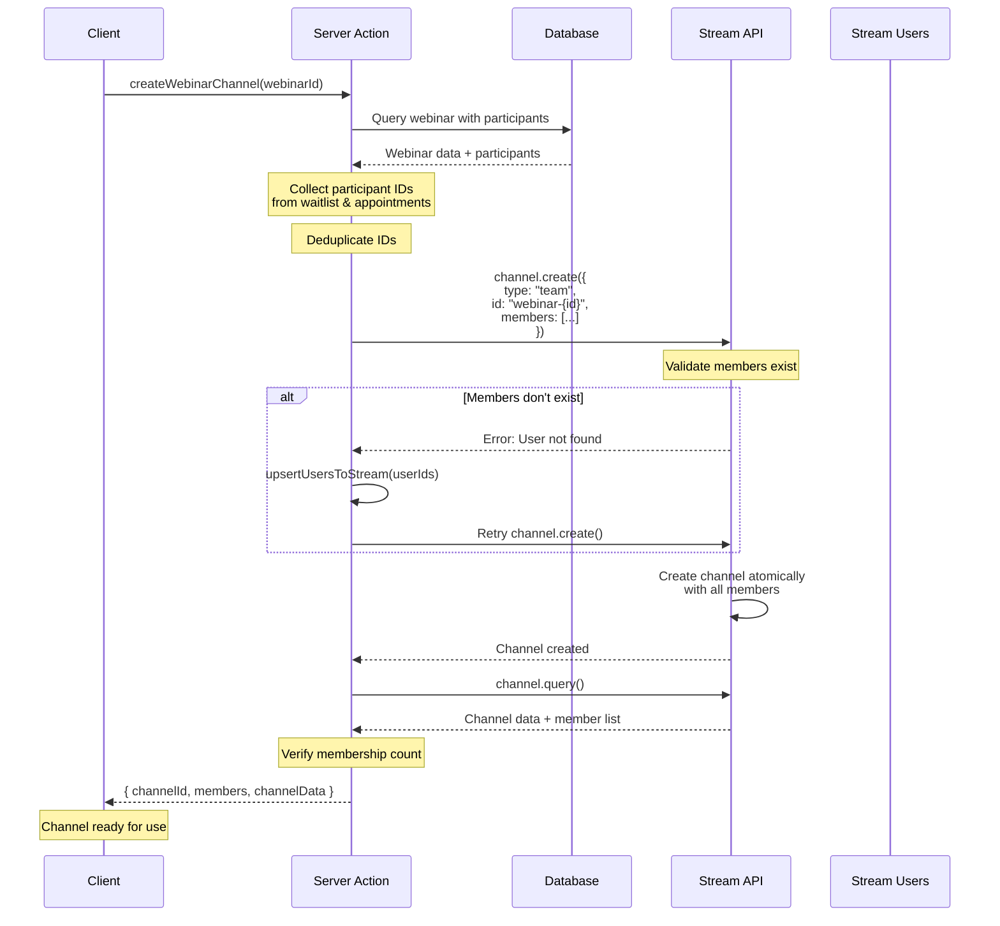

# 04. Chat Implementation

> Complete guide to implementing Stream Chat channels with best practices

## Table of Contents

- [Channel Types](#channel-types)
- [Channel ID Conventions](#channel-id-conventions)
- [Creating Channels](#creating-channels)
- [Member Management](#member-management)
- [Channel Creation Flow](#channel-creation-flow)
- [Code Examples](#code-examples)
- [Best Practices](#best-practices)

---

## Channel Types

Stream Chat supports multiple channel types, each optimized for different use cases:

### Messaging Channels

**Purpose**: One-on-one private conversations

**Use Cases**:

- Direct messages between users
- Consultations (consultant-consultee)
- Subscriptions (consultant-consultee)

**Characteristics**:

- Private by default
- Only accessible to members
- Optimized for 1:1 communication
- Support for typing indicators
- Read receipts enabled

### Team Channels

**Purpose**: Group conversations with multiple participants

**Use Cases**:

- Webinars (host + multiple participants)
- Classes (instructor + students)
- Group events

**Characteristics**:

- Support for many members
- Role-based permissions
- Participant list management
- Suitable for broadcasts and discussions

---

## Channel ID Conventions

Consistent channel ID naming ensures predictable behavior and prevents duplicates.

### Direct Messages

**Format**: `{userId1}-{userId2}` (alphabetically sorted)

**Implementation**:

```typescript
// Alphabetically sort user IDs using localeCompare
const channelId = [currentUserId, targetUserId]
  .sort((a, b) => a.localeCompare(b))
  .join("-");
```

**Example**:

- User A: `user_abc123`
- User B: `user_xyz789`
- Channel ID: `user_abc123-user_xyz789`

**Why Alphabetical Sorting?**

- Prevents duplicate channels for same conversation
- Ensures same channel ID regardless of who initiates
- Enables consistent channel lookup

### Consultations

**Format**: `consultation-{consultationId}`

**Example**: `consultation-clr4h8x0j0000ab1cdcdef123`

**Data**:

```typescript
{
  channelType: "messaging",
  channelId: `consultation-${consultationId}`,
  members: [consultantId, consulteeId],
  createdById: consultantId,
  additionalData: { consultation_id: consultationId }
}
```

### Subscriptions

**Format**: `subscription-{subscriptionId}`

**Example**: `subscription-clr4h8x0j0000ab1cdcdef456`

**Data**:

```typescript
{
  channelType: "messaging",
  channelId: `subscription-${subscriptionId}`,
  members: [consultantId, consulteeId],
  createdById: consultantId,
  additionalData: { subscription_id: subscriptionId }
}
```

### Webinars

**Format**: `webinar-{webinarId}`

**Example**: `webinar-clr4h8x0j0000ab1cdcdef789`

**Data**:

```typescript
{
  channelType: "team",
  channelId: `webinar-${webinarId}`,
  channelName: webinar.webinarPlan.title,
  members: [consultantUserId, ...participantIds],
  createdById: consultantUserId,
  additionalData: { webinar_id: webinarId }
}
```

### Classes

**Format**: `class-{classId}`

**Example**: `class-clr4h8x0j0000ab1cdcdef012`

**Data**:

```typescript
{
  channelType: "team",
  channelId: `class-${classId}`,
  channelName: classData.classPlan.title,
  members: [consultantUserId, ...participantIds],
  createdById: consultantUserId,
  additionalData: { class_id: classId }
}
```

---

## Creating Channels

### Server-Side Pattern (Recommended)

All channel creation operations are performed server-side using Stream's Node SDK.

**Why Server-Side?**

- Secure API secret management
- Atomic member addition during creation
- Centralized error handling
- Consistent validation
- Database transaction support

### Generic Channel Creation

**File**: `actions/stream/chat/channel.action.ts`

```typescript
export async function createChannel({
  channelType,
  channelId,
  channelName,
  members,
  createdById,
  additionalData = {},
}: {
  channelType: "messaging" | "team";
  channelId: string;
  channelName?: string;
  members: string[];
  createdById: string;
  additionalData?: Record<string, any>;
}) {
  if (!apiKey || !apiSecret) {
    throw new Error("Stream API keys not configured");
  }

  const serverClient = StreamChat.getInstance(apiKey, apiSecret);

  // Ensure creator is always included in members list
  const allMembers = Array.from(new Set([createdById, ...members]));
  console.log(
    `Creating ${channelType} channel ${channelId} with ${allMembers.length} members`,
  );

  // Create the channel with members atomically
  const channel = serverClient.channel(channelType, channelId, {
    name: channelName,
    created_by_id: createdById,
    members: allMembers,
    ...additionalData,
  });

  await channel.create();
  console.log(`Channel ${channelId} created successfully`);

  // Verify membership was established
  const channelData = await channel.query();
  const actualMembers = Object.keys(channelData.members || {});
  console.log(`Channel ${channelId} actual members:`, actualMembers);

  return { channelId, members: actualMembers, channelData };
}
```

**Key Features**:

- Deduplicates members (creator + specified members)
- Atomic creation with members
- Post-creation verification
- Comprehensive logging

### Specialized Channel Creators

#### Direct Message Channel

```typescript
export async function createDirectMessageChannel(
  currentUserId: string,
  targetUserId: string,
) {
  // Create a unique channel ID for the DM using alphabetical sorting
  const channelId = [currentUserId, targetUserId]
    .sort((a, b) => a.localeCompare(b))
    .join("-");

  return createChannel({
    channelType: "messaging",
    channelId,
    members: [currentUserId, targetUserId],
    createdById: currentUserId,
  });
}
```

#### Webinar Channel

```typescript
export async function createWebinarChannel(webinarId: string) {
  const webinar = await prisma.webinar.findUnique({
    where: { id: webinarId },
    include: {
      webinarPlan: {
        include: {
          consultantProfile: { include: { user: true } },
        },
      },
      waitlist: { include: { user: true } },
      appointment: {
        include: {
          slotsOfAppointment: { include: { user: true } },
        },
      },
    },
  });

  if (!webinar) {
    throw new Error("Webinar not found");
  }

  const consultantUserId = webinar.webinarPlan.consultantProfile?.user?.id;
  if (!consultantUserId) {
    throw new Error("Consultant not found for webinar");
  }

  // Get participant IDs from waitlist
  const waitlistParticipantIds = webinar.waitlist.map((entry) => entry.userId);

  // Get participant IDs from appointments
  const appointmentParticipantIds =
    webinar.appointment?.slotsOfAppointment?.flatMap((slot) =>
      slot.user.map((user) => user.id),
    ) || [];

  // Combine both sets and remove duplicates
  const allParticipantIds = Array.from(
    new Set([...waitlistParticipantIds, ...appointmentParticipantIds]),
  );

  console.log(
    `Webinar ${webinarId} participants: ${waitlistParticipantIds.length} ` +
      `from waitlist, ${appointmentParticipantIds.length} from appointments, ` +
      `${allParticipantIds.length} total unique`,
  );

  return createChannel({
    channelType: "team",
    channelId: `webinar-${webinarId}`,
    channelName: webinar.webinarPlan.title,
    members: [consultantUserId, ...allParticipantIds],
    createdById: consultantUserId,
    additionalData: { webinar_id: webinarId },
  });
}
```

---

## Member Management

### Adding Members

**Server-Side**: `actions/stream/chat/channel.action.ts`

```typescript
export async function addMemberToChannel(channelId: string, userId: string) {
  if (!apiKey || !apiSecret) {
    throw new Error("Stream API keys not configured");
  }
  if (!channelId || !userId) {
    throw new Error("Channel ID and User ID are required");
  }

  const serverClient = StreamChat.getInstance(apiKey, apiSecret);

  // Infer channel type from ID pattern
  const channelType =
    channelId.startsWith("consultation-") ||
    channelId.startsWith("subscription-")
      ? "messaging"
      : "team";

  console.log(`Adding member ${userId} to ${channelType} channel ${channelId}`);

  try {
    const channel = serverClient.channel(channelType, channelId);

    // Ensure channel exists before adding members
    await channel.create(); // No-op if exists

    const response = await channel.addMembers([userId]);
    console.log(`Successfully added member ${userId} to channel ${channelId}`);

    return { success: true, response };
  } catch (error) {
    console.error(
      `Error adding member ${userId} to channel ${channelId}:`,
      error,
    );
    throw error;
  }
}
```

### Removing Members

```typescript
const channel = serverClient.channel(channelType, channelId);
await channel.removeMembers([userId]);
```

### Permission Management

Stream Chat uses role-based permissions:

**Default Roles**:

- `owner` - Full control over channel
- `moderator` - Can moderate content and members
- `member` - Can send and receive messages
- `guest` - Limited read-only access

**Assigning Roles**:

```typescript
await channel.addMembers([{ user_id: userId, role: "moderator" }]);
```

---

## Channel Creation Flow



**Flow Steps**:

1. **Client Request**: Client calls server action with entity ID
2. **Database Query**: Fetch entity data with all participants
3. **Member Collection**: Gather IDs from waitlist and appointments
4. **Deduplication**: Remove duplicate participant IDs
5. **Channel Creation**: Atomically create channel with members
6. **Error Handling**: If users don't exist, upsert and retry
7. **Verification**: Query channel to verify member count
8. **Response**: Return channel details to client

---

## Code Examples

### Complete Consultation Channel Setup

```typescript
// Server action
export async function createConsultationChannel(consultationId: string) {
  const consultation = await prisma.consultation.findUnique({
    where: { id: consultationId },
    include: {
      consultationPlan: {
        include: {
          consultantProfile: { include: { user: true } },
        },
      },
      requestedBy: { include: { user: true } },
    },
  });

  if (!consultation) {
    throw new Error("Consultation not found");
  }

  const consultantId = consultation.consultationPlan.consultantProfile.user.id;
  const consulteeId = consultation.requestedBy.user.id;

  if (!consultantId || !consulteeId) {
    throw new Error("Consultant or consultee not found");
  }

  return createChannel({
    channelType: "messaging",
    channelId: `consultation-${consultationId}`,
    members: [consultantId, consulteeId],
    createdById: consultantId,
    additionalData: { consultation_id: consultationId },
  });
}
```

### Client-Side Channel Access

```typescript
"use client";

import { useChatContext } from "stream-chat-react";
import { useEffect, useState } from "react";

export function useConsultationChannel(consultationId: string) {
  const { client } = useChatContext();
  const [channel, setChannel] = useState(null);

  useEffect(() => {
    if (!client) return;

    const channelId = `consultation-${consultationId}`;
    const channel = client.channel("messaging", channelId);

    // Watch the channel for updates
    channel.watch();
    setChannel(channel);

    return () => {
      channel.stopWatching();
    };
  }, [client, consultationId]);

  return channel;
}
```

### Querying User Channels

```typescript
"use client";

import { useChatContext } from "stream-chat-react";

export function useUserChannels(userId: string) {
  const { client } = useChatContext();

  const filters = {
    type: "messaging",
    members: { $in: [userId] },
  };

  const sort = { last_message_at: -1 };

  const options = {
    watch: true,
    state: true,
    limit: 30,
  };

  return client.queryChannels(filters, sort, options);
}
```

---

## Best Practices

### 1. Always Use Server-Side Creation

**Good**:

```typescript
// Server action
export async function createChannel(...) {
  const serverClient = StreamChat.getInstance(apiKey, apiSecret);
  // Create channel
}
```

**Bad**:

```typescript
// Client component - NEVER do this!
const channel = client.channel("messaging", channelId);
await channel.create(); // API secret exposed!
```

### 2. Atomic Member Addition

**Good**:

```typescript
// Add members during creation
const channel = serverClient.channel(channelType, channelId, {
  members: allMembers, // Atomic
});
await channel.create();
```

**Bad**:

```typescript
// Create then add members separately - race condition!
await channel.create();
await channel.addMembers(members); // Separate operation
```

### 3. Consistent ID Formatting

**Good**:

```typescript
const channelId = [userId1, userId2]
  .sort((a, b) => a.localeCompare(b))
  .join("-");
```

**Bad**:

```typescript
const channelId = `${userId1}-${userId2}`; // Not sorted!
```

### 4. Proper Error Handling

**Good**:

```typescript
try {
  await createChannel({ ... });
  console.log("Channel created successfully");
} catch (error) {
  console.error("Channel creation failed:", error);
  // Handle specific error types
  if (error.code === 16) {
    // Channel already exists
  }
}
```

### 5. Verify Membership

**Good**:

```typescript
await channel.create();
const channelData = await channel.query();
const actualMembers = Object.keys(channelData.members || {});
console.log(`Expected: ${members.length}, Actual: ${actualMembers.length}`);
```

### 6. Deduplicate Members

**Good**:

```typescript
const allMembers = Array.from(new Set([createdById, ...members]));
```

**Bad**:

```typescript
const allMembers = [createdById, ...members]; // Possible duplicates
```

### 7. Use Meaningful Custom Data

**Good**:

```typescript
additionalData: {
  webinar_id: webinarId,
  event_type: "live_session",
  starts_at: webinar.startTime.toISOString(),
}
```

---

## Navigation

- [Previous: 03. Provider Authentication](./03-provider-authentication.md)
- [Next: 05. Video Implementation](./05-video-implementation.md)
- [Back to Index](./README.md)
