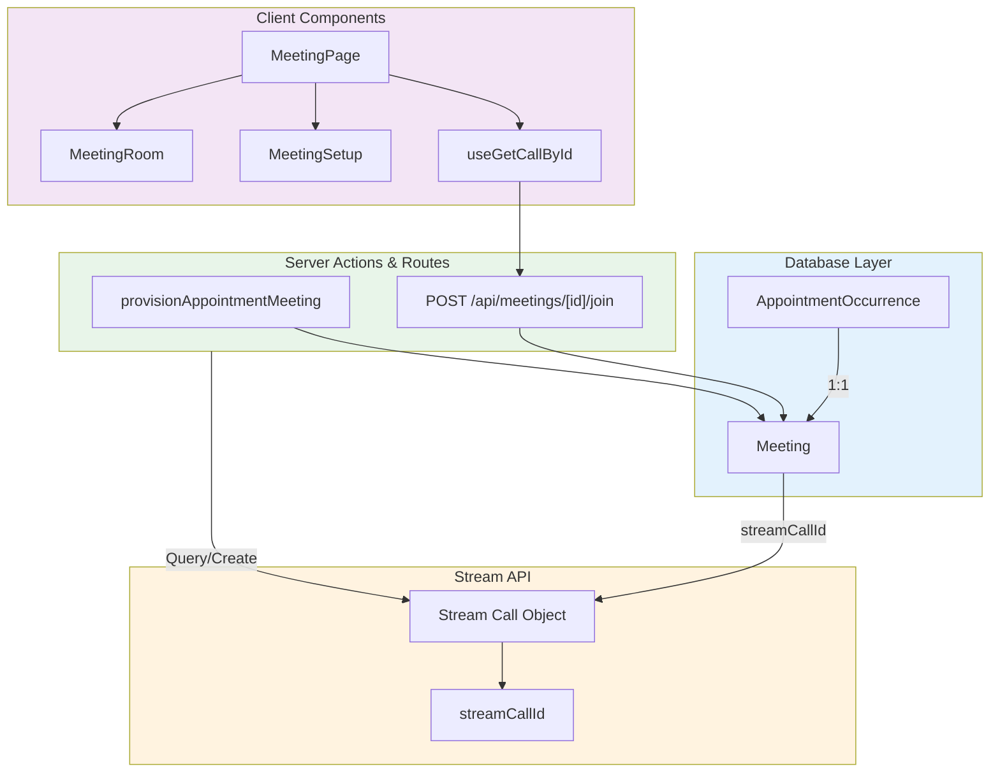
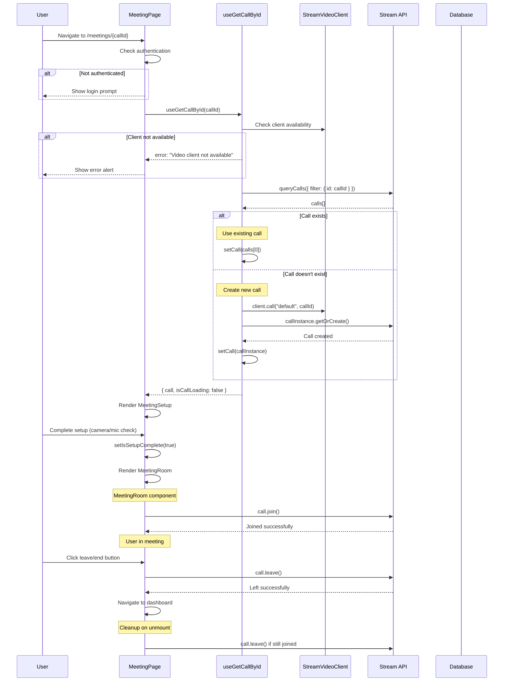

# 05. Video Implementation

> Complete guide to implementing Stream Video calls with meeting architecture

## Table of Contents

- [Meeting Architecture](#meeting-architecture)
- [Meeting Join Flow](#meeting-join-flow)
- [Meeting Components](#meeting-components)
- [Hooks and State Management](#hooks-and-state-management)
- [Cleanup and Lifecycle](#cleanup-and-lifecycle)
- [Call States and Monitoring](#call-states-and-monitoring)
- [Code Examples](#code-examples)
- [Best Practices](#best-practices)

---

## Meeting Architecture

### Call Types and ID Mapping

The video implementation uses a dual-ID system to link appointments with Stream calls:

**Database Layer**: `Meeting` model

```prisma
model Meeting {
  id                     String                 @id @default(cuid())
  streamCallId           String                 @unique
  platform               Platform               @default(STREAM)
  occurrenceId           String                 @unique
  occurrence             AppointmentOccurrence  @relation(...)
  scheduledMaxDurationS  Int?
  endedAt                DateTime?
  endedReason            String?
  createdAt              DateTime               @default(now())
  updatedAt              DateTime               @updatedAt
}
```

**ID Mapping**:

- `occurrenceId` - The database's `AppointmentOccurrence` ID
- `streamCallId` - Stream's call ID (format: `occurrence-{slotId}` or `occurrence-{slotId}-r{suffix}` when rebuilt after `ended_early`)

**Call Types**:

- `default` - All video sessions use the `default` call type with per-call `settings_override`
- Unused call types (`audio_room`, `development`, `livestream`) are stripped of all billable permissions via `scripts/stream/harden-unused-call-types.ts`

### Architecture Diagram



### Call Creation and Ownership

The Stream call for a booking is created on the server and only on the server.
`provisionAppointmentMeeting` in `actions/stream/meetings/meeting.action.ts` handles provisioning
(`findDbMeetingBySlot` and the `createDbMeeting` row writer are module-private helpers), and `lib/meeting.ts` is a thin
client-side wrapper that calls `provisionAppointmentMeeting(slot)`, turns `result.refusal`
back into a user-facing error for the toast, and hands the call id to
`router.push("/meetings/<id>")`. Nothing in the browser constructs a `Call` in
order to create one.

The order the action works in is load-bearing:

1. Evaluate the target `MeetingSlot` (`AppointmentOccurrence`).
2. Check entitlement (`readSlotForCaller`) before any Stream write, and again
   first inside `createDbMeeting` as defense-in-depth.
3. If a `Meeting` row already exists, re-run the same idempotent `getOrCreate` on its
   `streamCallId` so a row whose call is missing (a seed row, a deleted call) is healed, then
   return it. An `endedReason === "ended_early"` row is instead re-provisioned with a fresh
   `streamCallId`.
4. For a new room, run every refusal that can block a join — maintenance, a tentative or
   cancelled occurrence, a booking whose parent row is in a terminal state — before
   anything is minted.
5. Create the call with the server client (`buildCallSettingsOverride`), naming the
   appointment's host as `created_by_id`, every entitled user (excluding unconsented
   participants returned in `droppedIds`) as `call_member`, and setting `settings_override.limits.max_duration_seconds`
   from `resolveMaxCallDurationSeconds`.
6. Write the `Meeting` row linked to the occurrence.

### Elastic Session Envelope & Call Settings Override

Every session is provisioned with an elastic duration envelope (`lib/meetings/duration-cap.ts` and `lib/meetings/room-ready.ts`):

- **Duration Cap Formula (`resolveMaxCallDurationSeconds`)**:
  - `CONSULTANT_JOIN_WINDOW_MS = 15 * 60 * 1000` (15 minutes early-join window)
  - `CALL_DURATION_GRACE_MS = 30 * 60 * 1000` (30 minutes automatic overrun buffer)
  - `MIN_CALL_DURATION_MS = 45 * 60 * 1000` (45 minutes floor) and `MAX_CALL_DURATION_MS = 12 * 60 * 60 * 1000` (12 hours hard ceiling)
  - `budgetMs = clamp(bookedMs + 15m + 30m, 45m, 12h)`: a 30-minute Trial gets `30m + 15m + 30m = 75m` (`4500s`); a 60-minute Consultation gets `60m + 15m + 30m = 105m` (`6300s`).
- **Dashboard & API Rejoin Grace (`REJOIN_GRACE_MS = 30 * 60 * 1000`)**:
  - `getOccurrenceVMJoinState` (`lib/appointments/occurrences.ts`) and `resolveMeetingAccess` (`lib/meetings/access.ts`) allow joining and rejoining until `endsAt + 30m` unless the session was deliberately ended (`endedReason === "call_ended"` or `"maintenance"`).
- **1-to-Many Stage Controls (`StageControls.tsx` & `isAwaitingHostGoLive`)**:
  - `buildCallSettingsOverride` configures `limits.max_duration_seconds` on `default` calls. When backstage mode is enabled on a 1-to-Many call (`isBackstageEnabled: true`), attendees wait in the backstage lobby while `isAwaitingHostGoLive` is true until a host clicks **Go Live** (`POST /api/meetings/[meetingId]/live`).
  - Attendees can raise their hand to request audio/video permissions; hosts approve or decline via `StageControls.tsx`.
- **In-Call Overrun Banner & Free +15m Extension**:
  - `OverrunBanner.tsx` surfaces a countdown inside the room when entering the final 5 minutes of the booked window, transitions to an amber grace-buffer countdown after `endsAt` (reading `session.timer_ends_at` or falling back to `MIN_CALL_DURATION_MS` + `CALL_DURATION_GRACE_MS`), and provides hosts with a one-click **Extend +15m (Free)** button (`POST /api/meetings/[meetingId]/extend`).
- **In-Call Ephemeral Chat**:
  - Allowed for `CONSULTATION`, `SUBSCRIPTION`, `WEBINAR`, and `CLASS`; disabled for `TRIAL` (`isInCallChatAllowed` in `lib/meetings/room-ready.ts`) to prevent off-platform contact leakage before payment.

#### Call roles, and the order the scripts have to run in

Every member of a call is named `call_member` at creation. On each join, the
admit route sets the member role again: an accepted presenter collaborator
(`CO_HOST` or `CO_INSTRUCTOR`) on a webinar or class plan gets `co_presenter`,
and everyone else gets `call_member`. The plan owner is the call's `created_by`,
so the owner also holds the `-owner` permission variants.

`scripts/stream/ensure.ts` (and `scripts/stream/ensure-call-type-grants.ts`)
locks the `default` call type down. The `user` and `guest` roles lose
`join-call`, `join-ended-call`, `end-call`, and all 18 billable permissions.
The `call_member` role keeps `join-call` and `join-ended-call` (for the
`ended_early` and `REJOIN_GRACE_MS` rejoin paths), and it loses `end-call` and
all 18 billable permissions. The `call_member` role does not hold
`update-call-permissions`, `mute-users` or `pin-call-track`. It holds only the
`-owner` variants of those permissions, which take effect for the call's
creator alone.

Stream accepts only `send-audio`, `send-video` and `screenshare` as per-user
grants (`updateUserPermissions`). A single other name fails the whole request.
Every other power, such as muting, pinning or joining backstage, has to come
from a role's grants on the call type. The custom `co_presenter` role on
`default` holds `join-call`, `join-ended-call`, `join-backstage`, `read-call`,
`send-audio`, `send-video`, `screenshare`, `mute-users`, `pin-call-track`,
`send-event`, `send-closed-captions`, `create-call-reaction`, `list-recordings`
and `list-transcriptions`. It never holds `end-call`, `update-call-permissions`,
`update-call-member` or any recording control. Step 5 of `scripts/stream/ensure.ts`
(`ensureCoPresenterRole`) creates the role and writes exactly this grant list
idempotently, and the other grants scripts leave the role untouched. If the role is
missing, the admit route falls back to `call_member` and reports once to Sentry.
Removing a collaborator downgrades their membership on the plan's open calls to
`call_member`, or removes them when they hold no seat of their own.

```bash
npx tsx scripts/stream/ensure.ts                                      # dry run, inspects app settings + call types
npx tsx scripts/stream/ensure.ts --apply --confirm-join-route-deployed # applies canonical settings + hardened grants
```

---

## Meeting Join Flow



> **The diagram above predates #1134 P0-2 and #1270 and is kept for the shape of
> the flow, not for its creation branch.** The meeting page no longer creates
> anything: `useGetCallById` posts to `POST /api/meetings/[meetingId]/join`,
> which is the only grantor of call membership, and `client.call()` on the way
> back merely constructs a local handle. The room itself was created earlier, on
> the server, by `provisionAppointmentMeeting` when someone first pressed Join on
> a dashboard — see "Call Creation and Ownership" above.

**Flow Steps**:

1. **Navigation**: User navigates to `/meetings/{callId}`
2. **Authentication Check**: Verify user session
3. **Client Initialization**: Hook checks StreamVideoClient availability
4. **Call Query**: Query Stream API for existing call
5. **Call Creation**: Create call if it doesn't exist
6. **Meeting Setup**: Show camera/mic preview and configuration
7. **Join Call**: User joins after setup completion
8. **Meeting Room**: Render full meeting interface
9. **Leave/End**: User leaves or host ends the meeting
10. **Cleanup**: Automatically clean up on component unmount

---

## Meeting Components

### MeetingPage

**File**: `app/meetings/[id]/page.tsx`

**Purpose**: Main meeting container with authentication and state management

```typescript
const MeetingPage = () => {
  const { id } = useParams();
  const { data: session, isPending } = useSession(); // from "@/lib/auth-client"
  const { call, isCallLoading, error } = useGetCallById(id as string);
  const [isSetupComplete, setIsSetupComplete] = useState(false);

  // Cleanup on component unmount
  useEffect(() => {
    return () => {
      console.log("Meeting page unmounting, cleaning up call...");

      // Cleanup call if still active
      if (call?.state.callingState !== CallingState.LEFT) {
        console.log("Leaving call on unmount");
        call?.leave().catch((error) => {
          console.warn("Error leaving call on unmount:", error);
        });
      }
    };
  }, [call]);

  if (status === "loading" || isCallLoading) {
    return (
      <div className="flex flex-col items-center justify-center min-h-screen">
        <Loader2 className="h-12 w-12 animate-spin text-primary" />
        <p className="mt-4 text-lg">Loading meeting...</p>
      </div>
    );
  }

  if (error) {
    return (
      <Alert
        title="Meeting Error"
        description={`Failed to load meeting: ${error.message}`}
      />
    );
  }

  if (!call) {
    return (
      <Alert
        title="Meeting Not Found"
        description="The meeting you're trying to join doesn't exist or has ended."
      />
    );
  }

  const notAllowed = !session?.user;

  if (notAllowed) {
    return <Alert title="You need to be logged in to join this meeting" />;
  }

  return (
    <main className="h-screen w-full">
      <StreamCall call={call}>
        <StreamTheme>
          {!isSetupComplete ? (
            <MeetingSetup setIsSetupComplete={setIsSetupComplete} />
          ) : (
            <MeetingRoom />
          )}
        </StreamTheme>
      </StreamCall>
    </main>
  );
};
```

**Key Features**:

- Session-based authentication
- Loading states for call initialization
- Error handling with user-friendly messages
- Automatic cleanup on unmount
- Conditional rendering (setup vs. room)

### MeetingSetup

**Purpose**: Pre-call configuration (camera, microphone, speaker testing)

**Features**:

- Device selection (camera, microphone, speaker)
- Preview of video/audio
- Permission requests
- Visual feedback for device status

### MeetingRoom

**File**: `app/meetings/[id]/components/MeetingRoom.tsx`

**Purpose**: Main meeting interface with controls and layouts

```typescript
const MeetingRoom = () => {
  const searchParams = useSearchParams();
  const isPersonalRoom = !!searchParams.get("personal");
  const router = useRouter();
  const { data: session } = useSession(); // from "@/lib/auth-client"
  const [layout, setLayout] = useState<CallLayoutType>("speaker-left");
  const [showParticipants, setShowParticipants] = useState(false);
  const call = useCall();
  const { useCallCallingState, useCallEndedAt, useLocalParticipant } =
    useCallStateHooks();

  const callingState = useCallCallingState();
  const callEndedAt = useCallEndedAt();
  const localParticipant = useLocalParticipant();

  // Check if user is call owner
  const isCallOwner =
    localParticipant &&
    call?.state.createdBy &&
    localParticipant.userId === call.state.createdBy.id;

  // Monitor call state
  useEffect(() => {
    if (callEndedAt) {
      console.log("Call ended at:", callEndedAt);
    }
  }, [callEndedAt, callingState]);

  // Listen for call state updates
  useEffect(() => {
    if (call) {
      const handleCallStateUpdated = () => {
        console.log("Call state updated:", call.state);
      };

      call.on("call.updated", handleCallStateUpdated);

      return () => {
        call.off("call.updated", handleCallStateUpdated);
      };
    }
  }, [call]);

  // An ended call is over for everyone still on this screen, host or not.
  // The only client not shown this is the one already on its way out
  // (`exit` is set before the end or leave request goes out). On
  // `call.ended` the SDK leaves and empties the participant list, so a host
  // exempted here would be left on a live-looking room with an empty stage.
  if (callEndedAt && !exit) {
    return (
      <CallEnded
        message={
          isHost ? "The call has ended" : "The call has been ended by the host"
        }
        onRejoin={handleRejoinCall}
      />
    );
  }

  // Every non-JOINED state gets its own screen; see describeCallingState.
  const advice = exit
    ? { tone: "loading", title: "Leaving…", canRejoin: false }
    : describeCallingState(callingState);
  if (advice) {
    return <ConnectionStateScreen advice={advice} />;
  }

  return (
    <section className="relative h-screen w-full overflow-hidden pt-4 text-white">
      <div className="relative flex size-full items-center justify-center">
        <div className="flex size-full max-w-[1000px] items-center">
          <CallLayout layout={layout} />
        </div>
        <div className={cn("h-[calc(100vh-86px)] hidden ml-2", {
          block: showParticipants,
        })}>
          <CallParticipantsList onClose={() => setShowParticipants(false)} />
        </div>
      </div>

      {/* Call controls */}
      <div className="fixed bottom-0 flex w-full items-center justify-center gap-5">
        <CallControls onLeave={async () => {
          await call?.leave();
          // Navigate to dashboard based on user role
          router.push(getDashboardUrl(session?.user));
        }} />

        {/* Layout selector */}
        <DropdownMenu>
          {/* Layout options */}
        </DropdownMenu>

        <CallStatsButton />

        {/* Participants toggle */}
        <button onClick={() => setShowParticipants((prev) => !prev)}>
          <Users size={20} />
        </button>

        {!isPersonalRoom && <EndCallButton />}
      </div>
    </section>
  );
};
```

**Key Features**:

- Multiple layout options (grid, speaker-left, speaker-right)
- Participant list management
- Call statistics monitoring
- Role-based controls (owner can end for all)
- Automatic state monitoring
- Graceful handling of ended calls

---

## Hooks and State Management

### useGetCallById Hook

**File**: `app/meetings/[id]/hooks/useGetCallById.ts`

**Purpose**: Fetch or create a Stream call by ID

```typescript
export const useGetCallById = (callId: string) => {
  const [call, setCall] = useState<Call | null>(null);
  const [isCallLoading, setIsCallLoading] = useState(true);
  const [error, setError] = useState<Error | null>(null);
  const client = useStreamVideoClient();

  useEffect(() => {
    const getCall = async () => {
      if (!client) {
        console.error("StreamVideoClient not available");
        setError(new Error("Video client not available"));
        setIsCallLoading(false);
        return;
      }

      if (!callId) {
        console.error("Call ID is required");
        setError(new Error("Call ID is required"));
        setIsCallLoading(false);
        return;
      }

      try {
        setIsCallLoading(true);
        setError(null);
        console.log(`Attempting to get call with ID: ${callId}`);

        // First try to query for the call
        const { calls } = await client.queryCalls({
          filter_conditions: { id: callId },
        });

        console.log(`Query result: found ${calls.length} calls`);

        if (calls.length > 0) {
          // Use existing call
          console.log(`Using existing call: ${calls[0].id}`);
          setCall(calls[0]);
        } else {
          // Create new call
          console.log(`Creating new call with ID: ${callId}`);
          const callInstance = client.call("default", callId);
          await callInstance.getOrCreate();
          console.log(`Successfully created call: ${callInstance.id}`);
          setCall(callInstance);
        }
      } catch (err) {
        console.error("Error getting call:", err);
        setError(err instanceof Error ? err : new Error("Failed to get call"));
        setCall(null);
      } finally {
        setIsCallLoading(false);
      }
    };

    getCall();
  }, [client, callId]);

  return { call, isCallLoading, error };
};
```

**Key Features**:

- Automatic call query/creation
- Comprehensive error handling
- Loading state management
- Detailed logging for debugging
- Reactive to client/callId changes

### Stream SDK Hooks

**Provided by Stream SDK**:

```typescript
import { useCallStateHooks } from "@stream-io/video-react-sdk";

const {
  useCallCallingState, // Current call state
  useCallEndedAt, // Call end timestamp
  useLocalParticipant, // Current user's participant object
  useParticipantCount, // Number of participants
  useIsCallRecordingInProgress, // Recording status
} = useCallStateHooks();
```

---

## Cleanup and Lifecycle

### Component Unmount Cleanup

**MeetingPage cleanup**:

```typescript
useEffect(() => {
  return () => {
    console.log("Meeting page unmounting, cleaning up call...");

    // Leave call if still active
    if (call?.state.callingState !== CallingState.LEFT) {
      console.log("Leaving call on unmount");
      call?.leave().catch((error) => {
        console.warn("Error leaving call on unmount:", error);
      });
    }
  };
}, [call]);
```

### Manual Leave Flow

```typescript
const handleLeave = async () => {
  try {
    await call?.leave();
    console.log("Left call successfully");

    // Navigate based on user role
    if (session?.user?.role === "CONSULTANT") {
      router.push(`/dashboard/consultant/${consultantId}/home`);
    } else if (session?.user?.role === "CONSULTEE") {
      router.push(`/dashboard/consultee/${consulteeId}/home`);
    } else {
      router.push("/");
    }
  } catch (error) {
    console.error("Error leaving call:", error);
    router.push("/");
  }
};
```

### End Call (Host Only)

Ending a call for everyone is a server decision, not a client one. `EndCallButton`
posts to `POST /api/meetings/[meetingId]/end`, which re-resolves access from the
database and requires the caller to be on the hosting side — the plan owner, or
an accepted collaborator on a webinar or a class.

```typescript
const handleEndCall = async () => {
  try {
    const response = await fetch(
      `/api/meetings/${encodeURIComponent(call.id)}/end`,
      { method: "POST" },
    );
    if (!response.ok) {
      throw new Error(`End call failed with status ${response.status}`);
    }
  } catch (error) {
    // The host leaves and their media is released either way; a failed end
    // means the room outlives them, which is what it has always meant.
    console.error("Error ending call:", error);
  } finally {
    await leaveCallAndReleaseMedia(call);
    router.push(getDashboardUrl());
  }
};
```

The button used to call `call.endCall()` directly. Routing through the server
allows `scripts/stream/ensure-call-type-grants.ts` to strip `end-call` and all
18 billable permissions from `call_member` (while retaining `join-ended-call`
on `call_member` and revoking it from `user` and `guest`).

`POST /api/meetings/[meetingId]/end` calls `call.end()` on Stream, and the
resulting `call.ended` webhook is the single writer for `Meeting.endedAt`,
`Meeting.endedReason` (`ended_early` when ended before `startsAt`, or
`call_ended` when ended at or after `startsAt`), and `AppointmentOccurrence`
completion.

---

## Call States and Monitoring

### CallingState Enum

```typescript
enum CallingState {
  UNKNOWN = "unknown",
  IDLE = "idle",
  RINGING = "ringing",
  JOINING = "joining",
  JOINED = "joined",
  RECONNECTING = "reconnecting",
  RECONNECTING_FAILED = "reconnecting_failed",
  OFFLINE = "offline",
  LEFT = "left",
}
```

### State Monitoring

```typescript
const callingState = useCallCallingState();

useEffect(() => {
  console.log("Call state changed:", callingState);

  switch (callingState) {
    case CallingState.JOINING:
      // Show joining indicator
      break;
    case CallingState.JOINED:
      // Hide loading, show meeting room
      break;
    case CallingState.RECONNECTING:
      // Show reconnecting indicator
      break;
    case CallingState.LEFT:
      // Cleanup and redirect
      break;
  }
}, [callingState]);
```

### Event Listeners

```typescript
useEffect(() => {
  if (!call) return;

  const handleCallEnded = () => {
    console.log("Call ended by host");
    // Show end screen or redirect
  };

  const handleParticipantJoined = (event) => {
    console.log("Participant joined:", event.user);
  };

  const handleParticipantLeft = (event) => {
    console.log("Participant left:", event.user);
  };

  call.on("call.ended", handleCallEnded);
  call.on("call.session_participant_joined", handleParticipantJoined);
  call.on("call.session_participant_left", handleParticipantLeft);

  return () => {
    call.off("call.ended", handleCallEnded);
    call.off("call.session_participant_joined", handleParticipantJoined);
    call.off("call.session_participant_left", handleParticipantLeft);
  };
}, [call]);
```

---

## Code Examples

### Complete Meeting Flow

```typescript
// 1. Server Action: Provision or retrieve meeting session from dashboard
const result = await provisionAppointmentMeeting(slot);
if (!result.ok) {
  toast.error(result.refusal);
  return;
}
router.push(`/meetings/${result.streamCallId}`);

// 2. Client: Join meeting via POST /api/meetings/[meetingId]/join inside useGetCallById
const MeetingFlow = () => {
  const { callId } = useParams();
  const { call, isCallLoading } = useGetCallById(callId);

  if (isCallLoading) return <Loader />;
  if (!call) return <ErrorScreen />;

  return (
    <StreamCall call={call}>
      <StreamTheme>
        <MeetingRoom />
      </StreamTheme>
    </StreamCall>
  );
};
```

---

## Best Practices

### 1. Always Clean Up Calls

**Good**:

```typescript
useEffect(() => {
  return () => {
    if (call?.state.callingState !== CallingState.LEFT) {
      call?.leave();
    }
  };
}, [call]);
```

### 2. Handle All States

**Good**:

```typescript
if (isCallLoading) return <Loader />;
if (error) return <Error message={error.message} />;
if (!call) return <NotFound />;
if (callEndedAt && !exit) return <CallEnded />;
```

The ended screen is not gated on who the viewer is. A webinar has more than one
host, the owner can hold a second tab, and the SFU ends the call itself at
`max_duration_seconds`; in every one of those cases the SDK has already left the
call and emptied the participant list, so a host exempted from this screen sees
an empty stage under a live-looking control bar. The one client that is exempt
is the one that pressed End or Leave, and it says so by setting `exit` before
the request goes out.

### 3. Graceful Error Handling

**Good**:

```typescript
try {
  await call.leave();
  router.push("/dashboard");
} catch (error) {
  console.error("Error leaving call:", error);
  // Still redirect even if leave fails
  router.push("/dashboard");
}
```

### 4. Monitor Call State Changes

**Good**:

```typescript
useEffect(() => {
  if (callEndedAt) {
    console.log("Call ended at:", callEndedAt);
    // Handle cleanup
  }
}, [callEndedAt]);
```

### 5. Use Error Boundaries

**Good**:

```typescript
<StreamVideoErrorBoundary>
  <MeetingRoom />
</StreamVideoErrorBoundary>
```

---

## Deprecated & Superseded Approaches

- **Exported `findDbMeetingBySlot`**: Now an internal helper inside `actions/stream/meetings/meeting.action.ts`. External callers use `provisionAppointmentMeeting(slot)`.
- **`slotOfAppointmentId` on `Meeting`**: Replaced by `occurrenceId` referencing `AppointmentOccurrence`.
- **Client-side `call.endCall()` and `call.goLive()`**: Replaced by server-enforced `POST /api/meetings/[meetingId]/end` and `POST /api/meetings/[meetingId]/live`.
- **`end-call` and billable permissions on `call_member`, `user`, and `guest`**: Revoked by `scripts/stream/ensure-call-type-grants.ts` while retaining `join-ended-call` on `call_member`.
- **Per-user host grants in the admit route (`join-backstage`, `update-call-permissions`, `mute-users`, `pin-call-track`)**: Stream rejects every per-user grant except `send-audio`, `send-video` and `screenshare`. Co-presenter powers now come from the `co_presenter` call-type role.

---

## Navigation

- [Previous: 04. Chat Implementation](./04-chat-implementation.md)
- [Next: 06. Channel Management](./06-channel-management.md)
- [Back to Index](./README.md)
