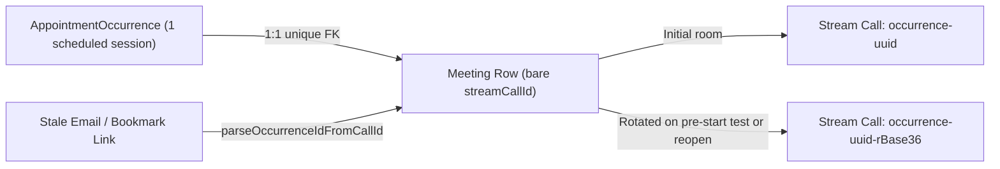
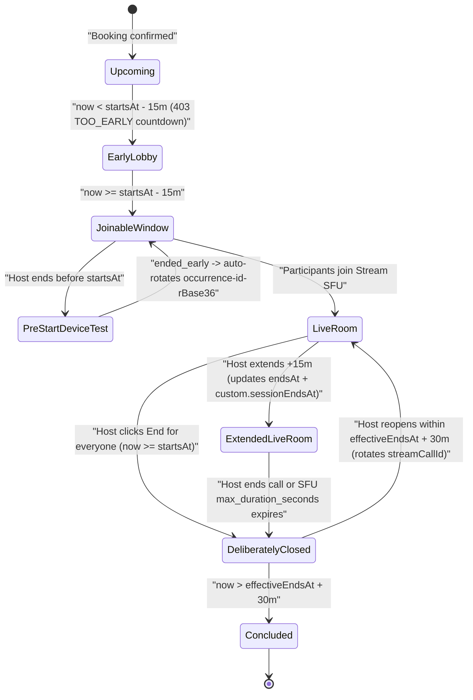
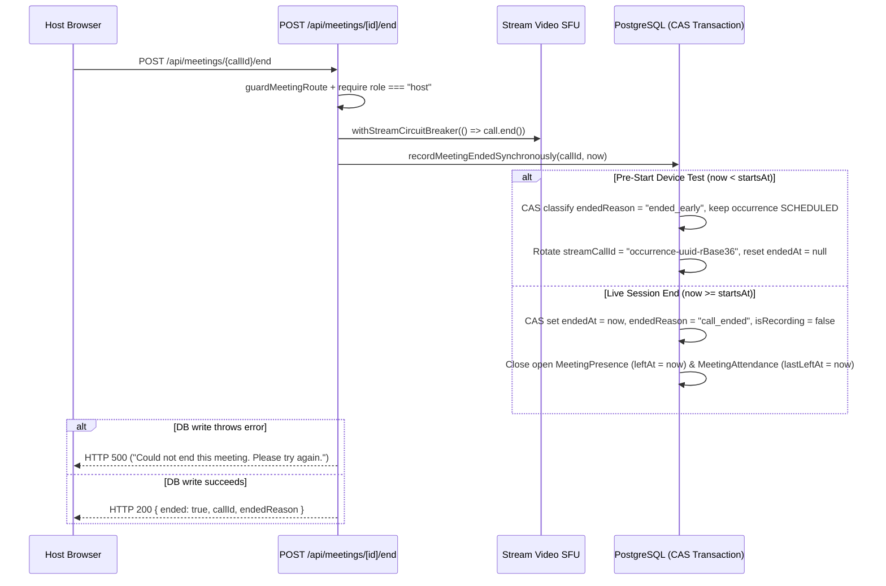

# 05. Video Implementation & Session Lifecycle Algorithms

> Authoritative specification of Stream Video room provisioning, the unified `[startsAt - 15m, effectiveEndsAt + 30m]` envelope, timezone-safe civil day arithmetic, synchronous CAS termination & pre-start rotation, host room reopen with asymmetric webhook routing, atomic `+15m` call extensions, exit UX, lobby gate retries, and hybrid Q&A / emoji reactions.

## Table of Contents

- [Meeting Room Architecture & Call Ownership](#meeting-room-architecture--call-ownership)
- [Algorithm 1: Unified Session Window Envelope & Timezone Normalization](#algorithm-1-unified-session-window-envelope--timezone-normalization)
- [Algorithm 2: Synchronous Termination & Pre-Start Device-Check Rotation](#algorithm-2-synchronous-termination--pre-start-device-check-rotation)
- [Algorithm 3: Host Room Reopen & Asymmetric Webhook Lookup](#algorithm-3-host-room-reopen--asymmetric-webhook-lookup)
- [Algorithm 4: Atomic `+15m` Call Extension & Idempotent Cap Math](#algorithm-4-atomic-15m-call-extension--idempotent-cap-math)
- [Algorithm 5: Unified Call Exit UX (`CallExitButton`) & Lobby Gate Backoff (`MeetingLobbyGateCard`)](#algorithm-5-unified-call-exit-ux-callexitbutton--lobby-gate-backoff-meetinglobbygatecard)
- [Algorithm 6: Hybrid In-Room Chat, Persistent Q&A, Stage Spotlight & Reactions](#algorithm-6-hybrid-in-room-chat-persistent-qa-stage-spotlight--reactions)
- [Deprecated & Superseded Approaches](#deprecated--superseded-approaches)

---

## Meeting Room Architecture & Call Ownership

Every video call executes on Stream Video's hardened `default` call type (`STREAM_CALL_TYPE = "default"`) and obeys strict `1 AppointmentOccurrence = 1 active Stream Call ID` isolation ([ADR-01](./18-architecture-decision-records.md#adr-01-strict-per-occurrence-stream-call-isolation-1-occurrence--1-active-call-id-vs-permanent-link-reuse)):

- **Server-Only Provisioning (`actions/stream/meetings/meeting.action.ts`)**: `provisionAppointmentMeeting` verifies caller entitlement (`readSlotForCaller`), evaluates booking/occurrence health, and calls `call.getOrCreate(...)` using `STREAM_API_SECRET` with:
  - `created_by_id`: plan owner / assigned consultant (granting creator `-owner` permission variants).
  - `members`: every DPDP-consented participant mapped to `call_member`, and `ACCEPTED` presenter collaborators (`CO_HOST`, `CO_INSTRUCTOR`) mapped to `co_presenter`.
  - `settings_override`: `buildCallSettingsOverride(appointmentType, maxDurationSeconds)` (`session.inactivity_timeout_seconds = 300`, `limits.max_duration_seconds = clamp(bookedDuration + 45m, 45m, 12h)`, and Backstage + muted defaults on `WEBINAR` / `CLASS`).
- **Bare Call Identifier Storage (`lib/stream/call-cid.ts`)**: `Meeting.streamCallId` always persists the bare call ID (`occurrence-<uuid>` initially, or `occurrence-<uuid>-r<base36>` after rotation). `toCallId(cidOrId)` strips any `"default:"` prefix idempotently, while `parseOccurrenceIdFromCallId(cidOrId)` extracts `<uuid>` across both initial and rotated call aliases.



---

## Algorithm 1: Unified Session Window Envelope & Timezone Normalization

### 1. Symmetric Envelope Across All 5 Appointment Types

Every appointment type — **`CONSULTATION`**, **`TRIAL`**, **`SUBSCRIPTION`**, **`WEBINAR`**, and **`CLASS`** — enforces the exact same join, live, overrun, and reopen window bounds (`lib/appointments/occurrences.ts`, `lib/meetings/access.ts`, `lib/meetings/duration-cap.ts`):

$$\text{Active Session Envelope} = [\,\text{startsAt} - 15\text{m},\; \text{effectiveEndsAt} + 30\text{m}\,]$$

| Parameter                                  | Constant / Source                                        | Value                           | Behavioral Rule                                                                                                        |
| ------------------------------------------ | -------------------------------------------------------- | ------------------------------- | ---------------------------------------------------------------------------------------------------------------------- |
| **Early Join Window (`T - 15m`)**          | `CONSULTEE_JOIN_WINDOW_MS` / `CONSULTANT_JOIN_WINDOW_MS` | `900_000 ms` (15m)              | symmetric for both hosts and participants; prior requests receive HTTP `403` (`code: "TOO_EARLY"`).                    |
| **Effective End (`effectiveEndsAt`)**      | `AppointmentOccurrence.endsAt`                           | Scheduled or `+15m`             | Advances atomically when a host triggers `POST /api/meetings/[meetingId]/extend`.                                      |
| **Rejoin & Overrun Grace (`T + 30m`)**     | `REJOIN_GRACE_MS` / `CALL_DURATION_GRACE_MS`             | `1_800_000 ms` (30m)            | Keeps dashboard `Join` buttons active, permits WebRTC reconnection after Wi-Fi drops, and bounds host room reopens.    |
| **SFU Hard Wall (`max_duration_seconds`)** | `resolveMaxCallDurationSeconds`                          | `clamp(booked + 45m, 45m, 12h)` | Enforced server-side by Stream SFU (`75m` for a 30m `TRIAL`, `105m` for a 60m `CONSULTATION`, `+900s` on host extend). |



### 2. Viewer Timezone Normalization & DST-Safe Civil Day Arithmetic

Server processes execute in UTC while consultants and consultees span arbitrary IANA zones (`Asia/Kolkata`, `America/Los_Angeles`, `Europe/London`, etc.). Two strict date formatting invariants govern all dashboard badges (`getAppointmentStatus`, `deriveBookingPresentation`, `HomeTab`, `ConsultantAppointmentsAdapter`, `MeetingLobbyGateCard`):

1. **Viewer Zone Formatting (`formatInViewerZone`)**: Every rendered timestamp and relative day label formats against explicit `viewerZone` (`session.user.timezone ?? Intl.DateTimeFormat().resolvedOptions().timeZone`), never bare `new Date().toLocaleTimeString()` or server-local `getFullYear()` / `getDate()`.
2. **Civil Day-Number Subtraction Without `now + 86_400_000`**: Adding `86_400_000` milliseconds (`24h`) to `now` skips or duplicates calendar days across 23-hour spring-forward and 25-hour fall-back DST transitions. Relative day buckets compute exact integer day deltas from timezone-formatted `"yyyy-MM-dd"` civil keys:
   ```typescript
   const dayNumber = (key: string): number => {
     const [year, month, day] = key.split("-").map(Number);
     return Date.UTC(year, month - 1, day) / 86_400_000;
   };
   const targetDayKey = formatInViewerZone(effectiveTime, zone, "yyyy-MM-dd");
   const todayKey = formatInViewerZone(now, zone, "yyyy-MM-dd");
   const diffDays = dayNumber(targetDayKey) - dayNumber(todayKey);
   // diffDays === 0 -> "Today" | diffDays === 1 -> "Tomorrow" | diffDays < 7 -> "In N days"
   ```

---

## Algorithm 2: Synchronous Termination & Pre-Start Device-Check Rotation

When a host selects **End session for everyone**, `POST /api/meetings/[meetingId]/end` (`app/api/meetings/[meetingId]/end/route.ts`) terminates the live Stream SFU room and updates PostgreSQL **synchronously** so returning to `/dashboard` immediately reflects the post-call state without waiting for Stream's webhook queue:



### Critical Branch Rules

1. **Pre-Start Device Check (`endedAt < startsAt`)**:
   - A consultant testing audio/camera at `startsAt - 12m` and clicking **End session for everyone** has **not** delivered the scheduled session.
   - `recordMeetingEndedSynchronously` classifies the event as `"ended_early"`, keeps `AppointmentOccurrence.completionStatus = "SCHEDULED"`, and rotates `Meeting.streamCallId` to a fresh `occurrence-<uuid>-r<base36>` segment (`endedAt = null`, `endedReason = null`). Both consultant and consultee still see an active `Join` button on their dashboards and enter a un-ended room at start time.
2. **Live Session Termination (`endedAt >= startsAt`)**:
   - Atomically stamps `Meeting.endedAt = now`, `Meeting.endedReason = "call_ended"`, `Meeting.isRecording = false` via CAS (`where: { id: meeting.id, endedAt: meeting.endedAt }`), closes all open `MeetingPresence` and `MeetingAttendance` rows, and prevents attendee rejoin unless reopened by the host.
3. **Explicit HTTP `500` Error Propagation**:
   - If `recordMeetingEndedSynchronously` rejects after `call.end()`, the route captures the exception via `reportSentryError` and returns HTTP `500` rather than silently succeeding with HTTP `200`.

---

## Algorithm 3: Host Room Reopen & Asymmetric Webhook Lookup

### 1. Why Reopening Rotates `Meeting.streamCallId`

Once `call.end()` executes on `default:occurrence-<uuid>`, Stream permanently marks that `cid` ended in SFU state. If a host accidentally ends a session at `T + 12m`, reopening cannot reuse `occurrence-<uuid>`. Instead, `POST /api/meetings/[meetingId]/reopen` (`app/api/meetings/[meetingId]/reopen/route.ts`):

1. Validates caller session (`requireApiAuth`), DPDP consent (`hasStreamConsent`), host/co-presenter authorization (`isAuthorizedReopenHost`), non-cancelled booking/occurrence status (`!isDeadOccurrence`), deliberate termination (`isDeliberateEnd(meeting)`), and window eligibility (`now <= effectiveEndsAt + REJOIN_GRACE_MS`).
2. Mints `nextCallId = "occurrence-${occurrenceId}-r${Date.now().toString(36)}"`.
3. Executes an optimistic CAS write:
   ```typescript
   await prisma.meeting.updateMany({
     where: { id: meeting.id, endedAt: { not: null } },
     data: {
       streamCallId: nextCallId,
       endedAt: null,
       endedReason: null,
       isRecording: false,
     },
   });
   ```
4. Provisions the new Stream call segment (`call.getOrCreate`) immediately and returns `{ reopened: true, streamCallId: nextCallId }` so `<MeetingLobbyGateCard />` navigates to `/meetings/${nextCallId}` (`router.replace`). Meanwhile, any participant joining via the original email link `/meetings/occurrence-<uuid>` resolves transparently to `nextCallId` through `loadMeeting` (`parseOccurrenceIdFromCallId`).

### 2. Asymmetric Webhook Lookup Rule

Rotating `Meeting.streamCallId` from segment 1 (`occurrence-<uuid>`) to segment 2 (`occurrence-<uuid>-r<base36>`) requires **strictly asymmetric webhook resolution** across `lib/stream/session-handlers.ts` and `lib/stream/recording-handlers.ts`:

- **Artifact & Presence Events (`call.recording_ready`, `call.recording_failed`, `call.session_participant_joined`, `call.session_participant_left`)**:
  - Query exact `where: { streamCallId }` first, **then fall back to `where: { appointmentOccurrenceId }`** extracted via `parseOccurrenceIdFromCallId(call_cid)`.
  - **Why**: Composite MP4 transcoding (`recording_ready`) and final participant leave duration events from segment 1 arrive asynchronously **after** segment 2 is already live. Falling back to `appointmentOccurrenceId` guarantees zero orphaned recordings and 100% accurate attendance durations.
- **Termination Events (`call.ended`, `call.session_ended`)**:
  - Match **strictly and exclusively on `where: { streamCallId }`** with **zero fallback to `appointmentOccurrenceId`**.
  - **Why**: A delayed `call.ended` or 5-minute SFU inactivity `call.session_ended` webhook from closed segment 1 carries `call_cid = "default:occurrence-<uuid>"`. Because `Meeting.streamCallId` is now `"occurrence-<uuid>-r<base36>"`, strict equality misses cleanly (`null`) and drops the stale termination event without closing the live reopened room.

---

## Algorithm 4: Atomic `+15m` Call Extension & Idempotent Cap Math

Hosts can extend any live room by **+15 minutes (`900s`) for free** once per session via `POST /api/meetings/[meetingId]/extend` (`app/api/meetings/[meetingId]/extend/route.ts`):

1. **Multi-Party Schedule Conflict Guard (`hasExtensionScheduleConflict`)**:
   - Evaluates `[slotStartsAt, max(slotEndsAt, now) + 15m]` against non-tentative, non-cancelled `AppointmentOccurrence` rows across:
     - Host profile & hosted/co-hosted plans (`buildOccupiedAppointmentFilter`, `buildCohostCommitmentFilter`),
     - All `ACCEPTED` presenter collaborators (`assertConsultantAvailableForWindows`),
     - Every active seat holder on the appointment (`status in ["HELD", "CONFIRMED", "ATTENDED"]`).
   - Returns HTTP `409` (`hasConflictingNextBooking: true`) if any party has an overlapping next booking.
2. **Stream SFU Update + Idempotent Postgres CAS Recovery**:
   - Updates Stream call via `call.update({ settings_override, custom: { ...existingCustom, extendedSeconds: prevExtended + 900, extensionsUsed: nextExtensionsUsed, sessionEndsAt: extendedEndsAt.toISOString() } })`.
   - Always runs conditional CAS persistence on `AppointmentOccurrence.endsAt` (`where: { id: occurrence.id, endsAt: slotEndsAt }`, setting `endsAt = extendedEndsAt`) **before** short-circuiting `if (extendResult.alreadyExtended)` — ensuring that if attempt 1 succeeded on Stream but timed out before updating PostgreSQL, retrying self-heals `AppointmentOccurrence.endsAt` idempotently.
3. **Single-Source Overrun Countdown Math (`resolveCapEndsAtMs` in `OverrunBanner.tsx`)**:
   - Transitions cleanly across four UI phases (`hidden` -> `ending-soon` at `T - 5m` -> `overrun-grace` at `T + 0` -> `cap-imminent` at `Cap - 2m`).
   - Reads authoritative `session.timer_ends_at` when unchanged locally, or computes `baseEndsAt + CALL_DURATION_GRACE_MS + extendedSeconds * 1000` without adding `+30m` grace on top of an already-extended `endsAt` **and** adding `extendedSeconds` twice.

---

## Algorithm 5: Unified Call Exit UX (`CallExitButton`) & Lobby Gate Backoff (`MeetingLobbyGateCard`)

### 1. Single Primary Red Exit Control (`CallExitButton` in `EndCallButton.tsx`)

To prevent hosts from accidentally ending a live cohort when stepping out (`ADR-05`), `MeetingRoom.tsx` mounts a single red exit button:

- **Attendees (`!isHost`)**: Clicking the button immediately triggers `onLeaveForSelf()` (`leaveCallAndReleaseMedia(call)` + redirect to role dashboard), keeping the room alive.
- **Hosts (`isHost`)**: Clicking the button opens a 2-action popover menu:
  - **Inline Caution Alert (`remainingMinutes > 10`)**: Whenever more than `10 minutes` (`EARLY_END_WARNING_THRESHOLD_MS`) remain in `info.endsAt`, displays an amber warning card: `"{N} min remaining in this booked slot. Ending for everyone disconnects all participants."`
  - **Action 1 — `Leave call`**: Disconnects only the host's local media session while keeping the room live for participants and co-presenters.
  - **Action 2 — `End session for everyone`**: Calls `POST /api/meetings/[meetingId]/end` (`AbortSignal.timeout(10_000)`), releases local camera/mic hardware tracks, and routes to the dashboard.

### 2. Lobby Gate Countdown & Clock-Skew Retry Backoff (`MeetingLobbyGateCard.tsx`)

When `POST /api/meetings/[meetingId]/join` denies entry with HTTP `403`, `MeetingLobbyGateCard` handles three structured modes:

- **`TOO_EARLY` Auto-Entry with Clock-Skew Protection**:
  - Displays scheduled start time formatted in the viewer's timezone (`formatScheduledAt(startsAt, session.user.timezone)`) and a live `MM:SS` countdown to `openAtMs = startsAt - 15m`.
  - Guards against client/server clock skew (e.g., browser clock ahead of server clock by 2–8s causing `now >= openAtMs` while server still returns `TOO_EARLY`) via a module-level retry map (`autoRetryAttemptsByWindow`) capped at **`MAX_AUTO_RETRIES = 3`** with linear backoff **`AUTO_RETRY_BACKOFF_MS = 5_000`**:
    ```typescript
    const retryAtMs = openAtMs + priorAttempts * AUTO_RETRY_BACKOFF_MS;
    ```
  - After 3 attempts (`T+0s`, `T+5s`, `T+10s`), automatic polling halts cleanly while preserving manual **Check Again** click access.
- **`SESSION_ENDED` with Host Reopen Safety Valve**: Renders **Reopen Session Room** whenever `access.canReopen === true`.
- **`CONSENT_REQUIRED` / Default Denial**: Surfaces DPDP data-processing consent or security access guidance.

---

## Algorithm 6: Hybrid In-Room Chat, Persistent Q&A, Stage Spotlight & Reactions

Live interaction inside `MeetingRoom.tsx` combines ephemeral WebRTC media events with server-verified Q&A persistence (`app/api/meetings/[meetingId]/qa/route.ts`, `lib/meetings/stage-qa.ts`, `StageQaDrawer.tsx`, `StagePinnedBannerOverlay.tsx`):

1. **In-Call Chat & Q&A Modality Gate (`isInCallChatAllowed`)**:
   - Enabled for `CONSULTATION`, `SUBSCRIPTION`, `WEBINAR`, and `CLASS`.
   - Completely blocked for free `TRIAL` sessions (`403 trial_chat_disabled` on API + `data-in-call-chat-blocked="true"` on client) to block pre-purchase off-platform leakage.
2. **Server-Verified Questions, Upvoting & Host Answers / Stage Spotlight**:
   - Submitting a question (`POST /api/meetings/[meetingId]/qa`) authenticates caller session and role via `guardMeetingRoute`, stamps verified server author identity (`id: "qa_<uuid>"`, `authorName`, `authorRole`), persists question metadata (`stageQuestionRedisKey`, 6h TTL), supports attendee upvoting and host answer tracking, and broadcasts `familiarise.qa.question` over Stream WebSockets (`call.sendCallEvent`).
   - Clicking **Show on screen** (`action: "pin"`, restricted strictly to `access.role === "host"`) writes `custom.activeStageBanner` onto the Stream call document (preserving existing `custom.organizationId` / `custom.extendedSeconds`) **and** emits `familiarise.qa.pin` over WebSockets so both live and late-joining attendees see the lower-third `<StagePinnedBannerOverlay />`.
3. **Ephemeral Emoji Reactions (`ReactionsButton`)**:
   - Rendered natively via Stream Video SDK's `<ReactionsButton />` in the bottom control bar, backed by `create-call-reaction` role grants on `call_member` and `co_presenter`.

---

## Deprecated & Superseded Approaches

- **Asymmetric Join Windows or Per-Type Grace Divergences**: Superseded by the single unified `[startsAt - 15m, effectiveEndsAt + 30m]` envelope across all 5 appointment types (`CONSULTATION`, `TRIAL`, `SUBSCRIPTION`, `WEBINAR`, `CLASS`).
- **DST-Unsafe `now.getTime() + 86_400_000` Day Buckets**: Superseded by timezone-explicit `formatInViewerZone` `"yyyy-MM-dd"` civil day-key subtraction (`Date.UTC(year, month - 1, day) / 86_400_000`).
- **Pre-Start Host Hangup Permanently Closing Scheduled Slots**: Superseded by `"ended_early"` detection (`endedAt < startsAt`) + immediate `occurrence-<uuid>-r<base36>` rotation so pre-call device checks keep the session upcoming.
- **Unconditional `appointmentOccurrenceId` Fallback on End Webhooks**: Superseded by asymmetric webhook routing (`ADR-02`), preventing delayed `call.ended` webhooks from closed segments from killing reopened rooms.
- **Unbounded `TOO_EARLY` Retry Loops on Client Clock Skew**: Superseded by `autoRetryAttemptsByWindow` (`MAX_AUTO_RETRIES = 3`, `5_000ms` linear backoff) in `MeetingLobbyGateCard.tsx`.

---

## Navigation

- [Previous: 04. Chat Implementation](./04-chat-implementation.md)
- [Next: 06. Channel Management](./06-channel-management.md)
- [Architecture Decision Records (ADR-01..ADR-05)](./18-architecture-decision-records.md)
- [Back to Index](./README.md)
