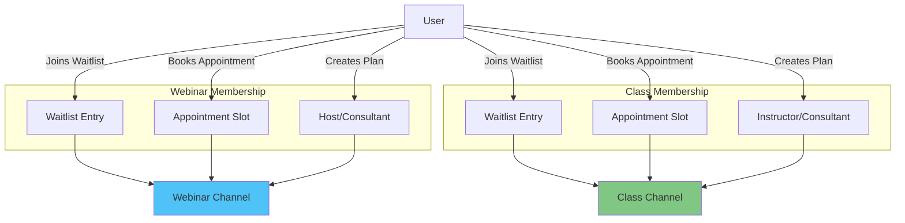
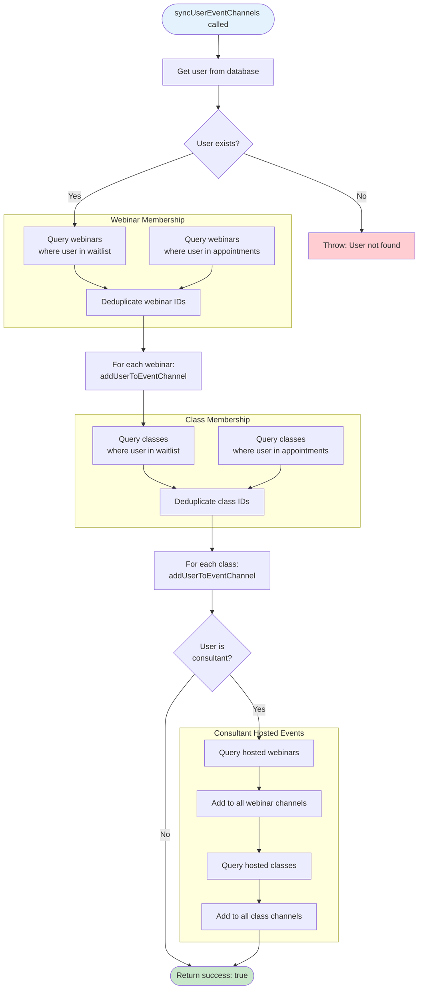

# 06. Channel Management

> Advanced channel management strategies including synchronization and race condition prevention

## Table of Contents

- [Channel Creation Strategies](#channel-creation-strategies)
- [User Channel Synchronization](#user-channel-synchronization)
- [Channel Membership Rules](#channel-membership-rules)
- [Race Condition Prevention](#race-condition-prevention)
- [User Channel Sync Flow](#user-channel-sync-flow)
- [Event Channel Management](#event-channel-management)
- [Code Examples](#code-examples)
- [Best Practices](#best-practices)

---

## Channel Creation Strategies

### Eager Creation

**Definition**: Create channels immediately when the entity (webinar, class, consultation, subscription) is created or approved.

**When to Use**:

- High-priority events (paid consultations, approved subscriptions)
- Events with guaranteed participants
- When chat availability is critical

**Advantages**:

- Channels ready immediately
- No delay for first users
- Predictable behavior

**Disadvantages**:

- May create unused channels
- Higher initial API usage
- Requires cleanup for canceled events

**Implementation**:

```typescript
// After consultation approval
const consultation = await prisma.consultation.update({
  where: { id: consultationId },
  data: { requestStatus: "APPROVED" },
});

// Immediately create channel
await createConsultationChannel(consultation.id);
```

### Lazy Creation

**Definition**: Create channels on-demand when the first user attempts to access them.

**When to Use**:

- Events with uncertain participation
- Low-priority or free events
- When minimizing API usage is important

**Advantages**:

- Only creates channels that will be used
- Lower API usage
- Self-cleaning (no unused channels)

**Disadvantages**:

- Slight delay for first user
- Race conditions possible
- More complex error handling

**Implementation**:

```typescript
// In event channel component
const ensureChannel = async () => {
  try {
    // Try to access channel
    const channel = client.channel("team", `webinar-${webinarId}`);
    await channel.watch();
  } catch (error) {
    if (error.code === 16) {
      // Channel not found
      // Create channel server-side
      await createWebinarChannel(webinarId);
    }
  }
};
```

### Hybrid Strategy (Recommended)

Combine both strategies based on entity type:

```typescript
// Eager for paid/approved entities
if (consultation.requestStatus === "APPROVED") {
  await createConsultationChannel(consultation.id);
}

// Lazy for events (created when first user joins waitlist)
if (webinar.waitlist.length === 1) {
  await createWebinarChannel(webinar.id);
}
```

---

## User Channel Synchronization

### syncUserEventChannels Function

**Purpose**: Ensure a user is a member of all channels for events they're participating in.

**When to Call**:

- User login (ensure membership of all channels)
- After joining an event (add to specific channel)
- Periodic background job (fix any inconsistencies)
- After profile changes

**File**: `actions/stream/chat/event-channel.action.ts`

```typescript
export const syncUserEventChannels = async (userId: string) => {
  try {
    // Get user details
    const user = await prisma.user.findUnique({
      where: { id: userId },
      include: {
        consulteeProfile: true,
        consultantProfile: true,
      },
    });

    if (!user) {
      throw new Error("User not found");
    }

    // WEBINARS: Get all webinars where user is participating
    // Method 1: Waitlist participation
    const webinarsFromWaitlist = await prisma.webinar.findMany({
      where: {
        waitlist: {
          some: { userId: userId },
        },
      },
      select: { id: true },
    });

    // Method 2: Appointment participation
    const webinarsFromAppointments = await prisma.webinar.findMany({
      where: {
        appointment: {
          slotsOfAppointment: {
            some: {
              user: {
                some: { id: userId },
              },
            },
          },
        },
      },
      select: { id: true },
    });

    // Combine and deduplicate webinar IDs
    const allWebinarIds = Array.from(
      new Set([
        ...webinarsFromWaitlist.map((w) => w.id),
        ...webinarsFromAppointments.map((w) => w.id),
      ]),
    );

    console.log(
      `User ${userId}: Found ${webinarsFromWaitlist.length} webinars from waitlist, ` +
        `${webinarsFromAppointments.length} from appointments, ` +
        `${allWebinarIds.length} total unique webinars`,
    );

    // Add user to all webinar channels
    for (const webinarId of allWebinarIds) {
      await addUserToEventChannel("webinar", webinarId, userId);
    }

    // CLASSES: Get all classes where user is participating
    // Method 1: Waitlist participation
    const classesFromWaitlist = await prisma.class.findMany({
      where: {
        waitlist: {
          some: { userId: userId },
        },
      },
      select: { id: true },
    });

    // Method 2: Appointment participation
    const classesFromAppointments = await prisma.class.findMany({
      where: {
        appointments: {
          some: {
            slotsOfAppointment: {
              some: {
                user: {
                  some: { id: userId },
                },
              },
            },
          },
        },
      },
      select: { id: true },
    });

    // Combine and deduplicate class IDs
    const allClassIds = Array.from(
      new Set([
        ...classesFromWaitlist.map((c) => c.id),
        ...classesFromAppointments.map((c) => c.id),
      ]),
    );

    console.log(
      `User ${userId}: Found ${classesFromWaitlist.length} classes from waitlist, ` +
        `${classesFromAppointments.length} from appointments, ` +
        `${allClassIds.length} total unique classes`,
    );

    // Add user to all class channels
    for (const classId of allClassIds) {
      await addUserToEventChannel("class", classId, userId);
    }

    // CONSULTANT CHANNELS: If user is a consultant
    if (user.consultantProfile) {
      const consultantId = user.consultantProfile.id;

      // Get all hosted webinars
      const hostedWebinars = await prisma.webinar.findMany({
        where: {
          webinarPlan: {
            consultantProfileId: consultantId,
          },
        },
        select: { id: true },
      });

      // Add to webinar channels
      for (const webinar of hostedWebinars) {
        await addUserToEventChannel("webinar", webinar.id, userId);
      }

      // Get all hosted classes
      const hostedClasses = await prisma.class.findMany({
        where: {
          classPlan: {
            consultantProfileId: consultantId,
          },
        },
        select: { id: true },
      });

      // Add to class channels
      for (const classItem of hostedClasses) {
        await addUserToEventChannel("class", classItem.id, userId);
      }
    }

    return { success: true };
  } catch (error) {
    console.error("Error synchronizing user event channels:", error);
    throw error;
  }
};
```

---

## Channel Membership Rules

### Participant Sources

Users can be added to event channels through multiple paths:



### Deduplication Strategy

**Problem**: User might join through multiple paths (waitlist + appointment)

**Solution**: Deduplicate before adding to channel

```typescript
// Collect from all sources
const waitlistIds = webinar.waitlist.map((entry) => entry.userId);
const appointmentIds =
  webinar.appointment?.slotsOfAppointment?.flatMap((slot) =>
    slot.user.map((user) => user.id),
  ) || [];

// Deduplicate using Set
const allParticipantIds = Array.from(
  new Set([...waitlistIds, ...appointmentIds]),
);

console.log(
  `Waitlist: ${waitlistIds.length}, ` +
    `Appointments: ${appointmentIds.length}, ` +
    `Unique: ${allParticipantIds.length}`,
);
```

### Host Inclusion

**Rule**: Event host (consultant) is ALWAYS a member

```typescript
const allMembers = Array.from(new Set([consultantUserId, ...participantIds]));
```

---

## Race Condition Prevention

### Atomic Channel Creation

**Problem**: Multiple users might try to create the same channel simultaneously

**Solution**: Atomic creation with member list

```typescript
// BAD: Race condition possible
await channel.create();
await channel.addMembers(members); // Separate operation

// GOOD: Atomic operation
const channel = serverClient.channel(channelType, channelId, {
  name: channelName,
  created_by_id: createdById,
  members: allMembers, // Added atomically
});
await channel.create();
```

### Check-Then-Create Pattern

**Problem**: Race between checking if channel exists and creating it

**Solution**: Use try-create pattern with error handling

```typescript
export const addUserToEventChannel = async (
  eventType: "webinar" | "class",
  eventId: string,
  userId: string,
) => {
  const channelId = `${eventType}-${eventId}`;
  const channel = client.channel("team", channelId);

  try {
    // Check if channel exists
    let channelExists = await checkEventChannelExists(eventType, eventId);

    if (!channelExists) {
      // Get event details and create channel
      const eventData = await getEventData(eventType, eventId);

      // Create with initial member
      const newChannel = client.channel("team", channelId, {
        name: eventData.name,
        created_by_id: eventData.creatorId,
        members: [userId], // Add during creation
      });

      await newChannel.create();
      console.log(`Created channel ${channelId} with initial member ${userId}`);
    } else {
      // Channel exists, just add member
      await channel.addMembers([userId]);
      console.log(`Added ${userId} to existing channel ${channelId}`);
    }
  } catch (error) {
    if (error.code === 16) {
      // Channel not found - might have been deleted
      console.log(`Channel ${channelId} not found, will retry creation`);
      throw error;
    }
    console.error(`Error adding user to channel:`, error);
    throw error;
  }
};
```

### Idempotent Operations

**Problem**: Retry logic might add user twice

**Solution**: Stream's `addMembers` is idempotent (safe to call multiple times)

```typescript
// Safe to call multiple times - won't duplicate members
await channel.addMembers([userId]);
await channel.addMembers([userId]); // No-op if already member
```

---

## User Channel Sync Flow



**Flow Steps**:

1. **User Retrieval**: Fetch user with consultant/consultee profiles
2. **Webinar Collection**:
   - Query waitlist entries
   - Query appointment slots
   - Deduplicate IDs
3. **Webinar Channel Addition**: Add user to all webinar channels
4. **Class Collection**:
   - Query waitlist entries
   - Query appointment slots
   - Deduplicate IDs
5. **Class Channel Addition**: Add user to all class channels
6. **Consultant Check**: If user is consultant, add to hosted events
7. **Completion**: Return success

---

## Event Channel Management

### Checking Channel Existence

```typescript
export const checkEventChannelExists = async (
  eventType: "webinar" | "class",
  eventId: string,
) => {
  const channelId = `${eventType}-${eventId}`;

  try {
    if (!apiKey || !apiSecret) {
      throw new Error("Stream API keys not configured");
    }

    const client = StreamChat.getInstance(apiKey, apiSecret);
    const channel = client.channel("team", channelId, {
      created_by_id: "system",
    });

    // Query the channel
    const response = await channel.query();

    // Channel exists if it has an ID
    const exists = !!(response.channel && response.channel.id);
    console.log(`Channel ${channelId} exists: ${exists}`);
    return exists;
  } catch (error) {
    // Error code 16 = channel not found
    if (error.code === 16 || error.response?.data?.code === 16) {
      console.log(`Channel ${channelId} not found via query`);
      return false;
    }
    console.error(`Error checking channel ${channelId}:`, error.message);
    return false;
  }
};
```

### Adding User to Event Channel

```typescript
export const addUserToEventChannel = async (
  eventType: "webinar" | "class",
  eventId: string,
  userId: string,
) => {
  try {
    const channelId = `${eventType}-${eventId}`;
    let systemCreatedChannel = false;

    // Check if channel exists
    let channelExists = await checkEventChannelExists(eventType, eventId);
    let channel = client.channel("team", channelId);

    if (!channelExists) {
      console.log(`Channel ${channelId} does not exist. Creating...`);

      // Get event data
      let channelCreatorId = "system";
      let channelName = `${eventType} ${eventId}`;

      if (eventType === "webinar") {
        const webinar = await prisma.webinar.findUnique({
          where: { id: eventId },
          include: {
            webinarPlan: {
              include: { consultantProfile: { include: { user: true } } },
            },
          },
        });

        if (!webinar) throw new Error(`Webinar ${eventId} not found`);

        channelName = webinar.webinarPlan.title;

        if (webinar.webinarPlan.consultantProfile?.user?.id) {
          const consultantUserId =
            webinar.webinarPlan.consultantProfile.user.id;
          await upsertUserToStream(consultantUserId);
          channelCreatorId = consultantUserId;
        }
      } else {
        // Similar logic for classes...
      }

      // Create channel with user as initial member
      channel = client.channel("team", channelId, {
        name: channelName,
        created_by_id: channelCreatorId,
        members: [userId], // Add during creation
      });

      await channel.create();
      systemCreatedChannel = true;
      console.log(
        `Created channel ${channelId} with creator ${channelCreatorId} ` +
          `and initial member ${userId}`,
      );
    } else {
      // Channel exists - update name if needed and add member
      const eventData = await getEventData(eventType, eventId);
      const existingChannelData = await channel.query();

      if (existingChannelData.channel?.name !== eventData.name) {
        console.log(
          `Updating channel ${channelId} name to "${eventData.name}"`,
        );
        await channel.update({ name: eventData.name });
      }

      await upsertUserToStream(userId);
      console.log(`Channel ${channelId} exists. Adding member ${userId}...`);
      await channel.addMembers([userId]);
    }

    return { success: true, systemCreatedChannel };
  } catch (error) {
    console.error(
      `Error in addUserToEventChannel for ${eventType} ${eventId}, user ${userId}:`,
      error,
    );
    throw error;
  }
};
```

---

## Code Examples

### Complete Sync on Login

```typescript
// In login callback
async function handleLogin(userId: string) {
  try {
    // 1. Upsert user to Stream
    await upsertUserToStream(userId);

    // 2. Sync all channel memberships
    await syncUserEventChannels(userId);

    console.log(`User ${userId} synced with all event channels`);
  } catch (error) {
    console.error("Error syncing user channels on login:", error);
    // Continue login even if sync fails
  }
}
```

### Periodic Background Sync

```typescript
// Background job (daily)
export async function syncAllUserChannels() {
  console.log("Starting daily user channel sync...");

  // Get all active users
  const users = await prisma.user.findMany({
    where: {
      OR: [
        { consulteeProfile: { isNot: null } },
        { consultantProfile: { isNot: null } },
      ],
    },
    select: { id: true },
  });

  console.log(`Syncing ${users.length} users...`);

  let successCount = 0;
  let errorCount = 0;

  for (const user of users) {
    try {
      await syncUserEventChannels(user.id);
      successCount++;
    } catch (error) {
      console.error(`Failed to sync user ${user.id}:`, error);
      errorCount++;
    }
  }

  console.log(`Sync complete: ${successCount} succeeded, ${errorCount} failed`);

  return { successCount, errorCount };
}
```

### Add to Channel on Event Join

```typescript
// When user joins webinar waitlist
async function handleJoinWebinar(userId: string, webinarId: string) {
  try {
    // 1. Add to database waitlist
    await prisma.webinarWaitlist.create({
      data: {
        userId,
        webinarId,
      },
    });

    // 2. Add to Stream channel
    await addUserToEventChannel("webinar", webinarId, userId);

    console.log(`User ${userId} added to webinar ${webinarId} channel`);
  } catch (error) {
    console.error("Error adding user to webinar channel:", error);
    throw error;
  }
}
```

---

## Best Practices

### 1. Always Deduplicate Members

**Good**:

```typescript
const allIds = Array.from(new Set([...waitlistIds, ...appointmentIds]));
```

**Bad**:

```typescript
const allIds = [...waitlistIds, ...appointmentIds]; // Duplicates possible
```

### 2. Include Creator in Members

**Good**:

```typescript
const allMembers = Array.from(new Set([createdById, ...members]));
```

### 3. Sync on Critical Events

**When to Sync**:

- User login
- User joins event
- User profile changes
- Daily background job

### 4. Graceful Error Handling

**Good**:

```typescript
try {
  await syncUserEventChannels(userId);
  console.log("Sync successful");
} catch (error) {
  console.error("Sync failed:", error);
  // Log but don't block user flow
}
```

### 5. Use Idempotent Operations

**Good**:

```typescript
// Safe to call multiple times
await channel.addMembers([userId]);
```

### 6. Log Membership Details

**Good**:

```typescript
console.log(
  `Webinar ${webinarId} participants: ` +
    `${waitlistCount} from waitlist, ` +
    `${appointmentCount} from appointments, ` +
    `${uniqueCount} total unique`,
);
```

### 7. Verify Channel State

**Good**:

```typescript
await channel.create();
const channelData = await channel.query();
const actualMembers = Object.keys(channelData.members || {});
console.log(`Expected: ${members.length}, Actual: ${actualMembers.length}`);
```

### 8. Update Channel Metadata

**Good**:

```typescript
// Check if name changed
if (existingChannel.name !== expectedName) {
  await channel.update({ name: expectedName });
}
```

---

## Navigation

- [Previous: 05. Video Implementation](./05-video-implementation.md)
- [Next: 13. Known Issues](./13-known-issues.md)
- [Back to Index](./README.md)
