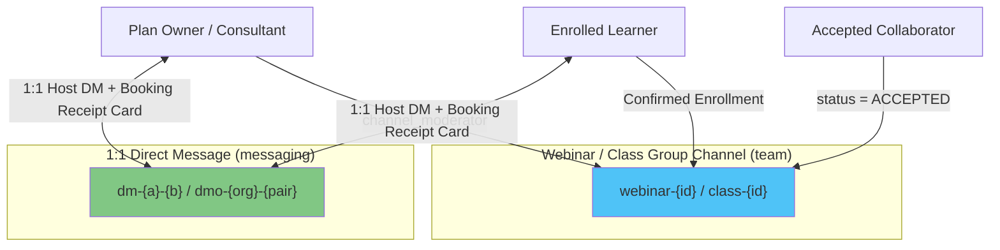
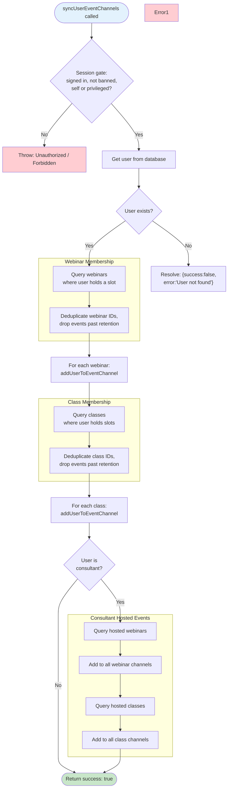

# 06. Channel Management

> Advanced channel management strategies including synchronization and race condition prevention

## Table of Contents

- [Channel Creation Strategies](#channel-creation-strategies)
- [User Channel Synchronization](#user-channel-synchronization)
- [Channel Membership Rules](#channel-membership-rules)
  - [4-Part DM & Trial Policy](#4-part-dm--trial-policy)
  - [Contextual Booking Receipt Cards](#contextual-booking-receipt-cards)
  - [Server-Side Authorization for Membership Changes](#server-side-authorization-for-membership-changes)
- [Race Condition Prevention](#race-condition-prevention)
- [User Channel Sync Flow](#user-channel-sync-flow)
- [Event Channel Management](#event-channel-management)
- [Code Examples](#code-examples)
- [Best Practices](#best-practices)
- [Deprecated & Superseded Approaches](#deprecated--superseded-approaches)

---

## Channel Creation Strategies

### Server-Provisioned Hybrid Strategy

Stream Chat channels are created and reconciled exclusively on the server across two complementary paths:

1. **Eager Provisioning on Confirmed Payment / Approval (`lib/payments/webhooks/handlers.ts`)**:
   - When a paid **Consultation** or **Subscription** transitions into `DM_ELIGIBLE_STATUSES` (`APPROVED`, `SCHEDULED`, `COMPLETED`), the server provisions or reuses the pair's canonical 1:1 DM channel (`createDirectMessageChannel(consultantUserId, consulteeUserId, organizationId)`).
   - When a **Webinar** or **Class** enrollment is confirmed, the server adds the enrollee to the group `team` channel (`webinar-<id>` / `class-<id>`) **and** provisions the 1:1 DM channel between the consultant and the enrollee.
   - **Free Trials (`TRIAL`)** never create or open a Stream channel (`skipped: "trial_chat_blocked"`).
2. **On-Demand Resolution (`POST /api/stream/channels/open`)**:
   - When a user clicks **"Message"** on an appointment card or selects a search result in the chat sidebar, the browser sends the target user or event identifier (`{ kind: "dm", counterpartyUserId, organizationId, contextAppointmentId }` or `{ kind: "event", eventType, eventId }`) to `POST /api/stream/channels/open`.
   - The server verifies `canDirectMessage` or `isEventParticipant`, derives the canonical channel ID server-side, creates/adopts the channel with chunked membership (`createMemberChunk` + `addRemainingMembers`), and optionally posts an idempotent booking context card.

```typescript
// Eager provisioning after payment confirmation (server-side)
await createDirectMessageChannel(
  consultantUserId,
  consulteeUserId,
  organizationId,
);

// On-demand open from client UI (never client-side channel.watch() on uncreated IDs)
const res = await fetch("/api/stream/channels/open", {
  method: "POST",
  headers: { "Content-Type": "application/json" },
  body: JSON.stringify({
    kind: "dm",
    counterpartyUserId,
    organizationId,
    contextAppointmentId: appointment.id,
  }),
});
```

---

## User Channel Synchronization

### syncUserEventChannels Function

**Purpose**: Reconcile a user's Stream channel memberships against Postgres entitlements and revoke stale memberships.

**When to Call**:

- Deferred initial provider connect (`providers/StreamProviderImpl.tsx`)
- Manual user refresh (`components/chat/InitializeUserChannelsButton.tsx`)
- Privileged maintenance run (the session gate rejects unauthenticated callers)

**File**: `actions/stream/chat/event-channel.action.ts` (thin `"use server"` wrapper delegating primitives to `lib/stream/event-channel-service.ts`)

```typescript
export async function syncUserEventChannels(
  userId: string,
  force = false,
): Promise<{
  success: boolean;
  skipped?: boolean;
  error?: string;
  channelsSynced?: number;
  failed?: number;
  staleChannelsRemoved?: number;
  durationMs?: number;
}>;
```

Five properties of this contract are load-bearing:

1. **It reports failure by resolving, not by rejecting.** A missing user or unauthenticated session returns `{ success: false, error: "..." }` rather than throwing. Callers must branch on `result.success` before marking session sync complete.
2. **It can no-op.** A recent successful sync for the same user returns `{ success: true, skipped: true }` without doing work unless `force` is passed.
3. **It revokes rather than adds, paging at Stream's 30-channel ceiling.** Channels are provisioned eagerly at booking confirmation and on-demand via `POST /api/stream/channels/open`. `syncUserEventChannels` walks every channel the user belongs to via `queryChannelsPaged` (`lib/stream/batch.ts`, 30 channels per page sorted by `created_at` ascending) and removes memberships with a managed prefix (`MANAGED_CHANNEL_PREFIXES`) that are absent from the Postgres expected-set.
4. **It is session-gated.** `actions/stream/chat/event-channel.action.ts` reads the session fresh from the database (`getSession()`), rejects banned accounts, and allows only self or privileged (`ADMIN`/`STAFF`) callers before touching the sync cache.
5. **Its expected-set includes `ACCEPTED` collaborators and excludes events past retention.** `getWebinarIdsForUser` and `getClassIdsForUser` include webinars and classes where the user is the host, a live `AppointmentParticipant`, or an `ACCEPTED` `PlanCollaborator` (`consultantProfile.deletedAt: null`), so co-hosts are never evicted during reconciliation. Events whose latest slot `endsAt` has passed the owning organization's retention window (`isPastRetention` in `lib/stream/channel-lifecycle.ts`) are excluded so the sync never resurrects channels hard-deleted by the retention cron.

---

## Channel Membership Rules

### 4-Part DM & Trial Policy

Familiarise enforces a deterministic 4-part communication policy across all booking modalities (`lib/stream/dm-eligibility.ts`, `lib/stream/dm-eligibility-statuses.ts`, `lib/stream/event-channel-service.ts`):

1. **One Human Pair = One Canonical DM Channel (`dm-` / `dmo-`)**:
   - A consultant and a consultee who transact together share **one** 1:1 `messaging` channel per tenancy scope across all repeat consultations, subscriptions, webinars, and classes:
     - **B2C Personal Scope**: `dm-${userIdA}-${userIdB}` (with `userIdA` and `userIdB` ordered by UTF-16 code units `a < b ? [a, b] : [b, a]`, never `localeCompare`; hashed to `dmh-${sha256}` if the joined string exceeds Stream's 64-character ceiling).
     - **B2B Enterprise Organization Scope**: `dmo-${sha256(orgId).slice(0, 12)}-${sha256(`${orgId}:${a}:${b}`).slice(0, 36)}` with `custom.organization_id = orgId`.
   - Consultee-to-consultee peer DMs are prohibited (`canDirectMessage` requires at least one eligible consultant ↔ consultee link).
2. **Paid / Confirmed Eligibility Gate (`DM_ELIGIBLE_STATUSES`)**:
   - `DM_ELIGIBLE_STATUSES = ["APPROVED", "SCHEDULED", "COMPLETED"]` (`lib/stream/dm-eligibility-statuses.ts`).
   - Unpaid or unconfirmed bookings (`PENDING`, `APPROVED_PENDING_PAYMENT`, `CANCELLED`, `REJECTED`, `EXPIRED`) are **excluded** — direct messaging opens only after payment settles or an appointment is confirmed without pending payment, and remains open through `COMPLETED` for post-session follow-up until the retention window expires.
3. **Webinars & Classes Provision Both Group Event Channels and 1:1 Host DMs**:
   - Enrolling in a confirmed `WEBINAR` or `CLASS` (`OPENABLE_EVENT_STATUSES = ["SCHEDULED", "IN_PROGRESS", "COMPLETED"]`) provisions **both**:
     1. The shared `team` channel (`webinar-${webinarId}` or `class-${classId}`), whose roster includes the plan owner, all `ACCEPTED` `PlanCollaborator` co-hosts, and all live `AppointmentParticipant` enrollees.
     2. The 1:1 personal DM (`dm-` or `dmo-`) between the hosting consultant and each confirmed enrollee (`hasWebinarLink` and `hasClassLink` in `lib/stream/dm-eligibility.ts`).
4. **Free Trials (`TRIAL`) Block All Chat Surfaces**:
   - `TrialSession` appointments (`AppointmentsType.TRIAL`) have all Stream Chat channels, 1:1 DMs, and in-call meeting chat blocked (`skipped: "trial_chat_blocked"` in `lib/payments/webhooks/handlers.ts` and in-call chat hidden in `app/meetings/[id]/components/MeetingRoom.tsx`). A free trial is a strictly time-boxed live video evaluation; asynchronous DM access unlocks only when the learner converts to a paid plan.

### Contextual Booking Receipt Cards

Because repeat bookings between the same consultant and consultee share a single `dm-` or `dmo-` thread, `POST /api/stream/channels/open` supports an optional `contextAppointmentId` parameter to disambiguate which booking a conversation turn refers to:

- When `contextAppointmentId` is passed (for example, from **"Message Consultant"** / **"Message Consultee"** CTAs on an appointment card via `chatAffordancesForVm`), the server verifies that the appointment is non-deleted, in an eligible status, and links `(userId, counterpartyUserId)`.
- The server then posts an idempotent message into the shared DM with deterministic message ID (`id: booking-ctx-${appointmentId}-${eventType}` / `buildBookingContextMessageId(channelId, appointmentId)` hashed to $\le 64$ chars) and `booking_context` metadata (`booking_appointment_id`, `booking_type`, `booking_title`, `booking_starts_at`).
- If the receipt card for that appointment was already posted, Stream rejects the duplicate message ID and `postBookingContextCardIfAbsent` treats the duplicate as a clean no-op.

### Server-Side Authorization for Membership Changes

Stream's server-side API bypasses its own permission system whenever a valid API secret is presented, so every membership mutation is authorized in the application layer before calling Stream:

- `actions/stream/chat/channel.action.ts` and `lib/stream/event-channel-service.ts` do **not** have `"use server"` directives and cannot be invoked as browser RPCs.
- `actions/stream/chat/event-channel.action.ts` (`"use server"`) gates `addUserToEventChannel`, `removeUserFromEventChannel`, and `syncUserEventChannels` via `getSession()` + participant/host/admin checks.
- `POST /api/stream/channels/open` enforces `requireApiAuth()`, `streamApiLimiter`, `canDirectMessage` / `isEventParticipant`, and `pairBookingContexts` (preventing cross-organization `organizationId` forgery).

### Participant Sources

Event channel membership follows the event's confirmed `AppointmentParticipant` records plus the plan owner and `ACCEPTED` `PlanCollaborator` co-hosts:


```mermaid
graph TB
    User[Enrolled Learner]
    Collab[Accepted Collaborator]
    Host[Plan Owner / Consultant]

    subgraph "Webinar / Class Group Channel (team)"
        EventChannel["webinar-{id} / class-{id}"]
    end

    subgraph "1:1 Direct Message (messaging)"
        DMChannel["dm-{a}-{b} / dmo-{org}-{pair}"]
    end

    User -->|Confirmed Enrollment| EventChannel
    Collab -->|status = ACCEPTED| EventChannel
    Host -->|channel_moderator| EventChannel

    User <-->|1:1 Host DM + Booking Receipt Card| DMChannel
    Host <-->|1:1 Host DM + Booking Receipt Card| DMChannel

    style EventChannel fill:#4fc3f7
    style DMChannel fill:#81c784
```

### Deduplication Strategy

**Problem**: a webinar's registrants are connected to every one of its slots, so
the same user id appears once per slot.

**Solution**: Deduplicate before adding to the channel

```typescript
const appointmentIds =
  webinar.appointment?.appointmentOccurrences?.flatMap((slot) =>
    slot.user.map((user) => user.id),
  ) || [];

const allParticipantIds = Array.from(new Set(appointmentIds));

console.log(`Unique participants: ${allParticipantIds.length}`);
```

### Host Inclusion

**Rule**: Event host (consultant) is ALWAYS a member

```typescript
const allMembers = Array.from(new Set([consultantUserId, ...participantIds]));
```

---

## Race Condition Prevention

### Atomic Channel Creation

**Problem**: Multiple users might try to create the same channel simultaneously

**Solution**: Atomic creation with member list

```typescript
// BAD: Race condition possible
await channel.create();
await channel.addMembers(members); // Separate operation

// GOOD: Atomic operation
const channel = serverClient.channel(channelType, channelId, {
  name: channelName,
  created_by_id: createdById,
  members: allMembers, // Added atomically
});
await channel.create();
```

### Check-Then-Create Pattern

**Problem**: Race between checking if channel exists and creating it

**Solution**: Use try-create pattern with error handling

```typescript
export const addUserToEventChannel = async (
  eventType: "webinar" | "class",
  eventId: string,
  userId: string,
) => {
  const channelId = `${eventType}-${eventId}`;
  const channel = client.channel("team", channelId);

  try {
    // Check if channel exists
    let channelExists = await checkEventChannelExists(eventType, eventId);

    if (!channelExists) {
      // Get event details and create channel
      const eventData = await getEventData(eventType, eventId);

      // Create with initial member
      const newChannel = client.channel("team", channelId, {
        name: eventData.name,
        created_by_id: eventData.creatorId,
        members: [userId], // Add during creation
      });

      await newChannel.create();
      console.log(`Created channel ${channelId} with initial member ${userId}`);
    } else {
      // Channel exists, just add member
      await channel.addMembers([userId]);
      console.log(`Added ${userId} to existing channel ${channelId}`);
    }
  } catch (error) {
    if (error.code === 16) {
      // Channel not found - might have been deleted
      console.log(`Channel ${channelId} not found, will retry creation`);
      throw error;
    }
    console.error(`Error adding user to channel:`, error);
    throw error;
  }
};
```

### Idempotent Operations

**Problem**: Retry logic might add user twice

**Solution**: Stream's `addMembers` is idempotent (safe to call multiple times)

```typescript
// Safe to call multiple times - won't duplicate members
await channel.addMembers([userId]);
await channel.addMembers([userId]); // No-op if already member
```

The shipped lazy paths go one step further than check-then-create: when a
lost create race is rejected by Stream, the existing channel is adopted via
`isChannelAlreadyExistsError` in `lib/stream-utils.ts` instead of failing the
caller. [17. Channel Lifecycle](./17-channel-lifecycle.md) documents the full
create-and-adopt story.

---

## User Channel Sync Flow


```mermaid
flowchart TB
    Start([syncUserEventChannels called])
    Start --> AuthGate{"Session gate:<br/>signed in, not banned,<br/>self or privileged?"}
    AuthGate -->|No| Error0[Throw: Unauthorized / Forbidden]
    AuthGate -->|Yes| GetUser[Get user from database]

    GetUser --> CheckUser{User exists?}
    CheckUser -->|No| ResolveMissing["Resolve: {success:false,<br/>error:'User not found'}"]
    CheckUser -->|Yes| GetWebinarsAppts

    subgraph "Webinar Membership"
        GetWebinarsAppts[Query webinars<br/>where user holds a slot]
        DedupeWebinars[Deduplicate webinar IDs,<br/>drop events past retention]

        GetWebinarsAppts --> DedupeWebinars
    end

    DedupeWebinars --> AddToWebinars[For each webinar:<br/>addUserToEventChannel]

    subgraph "Class Membership"
        GetClassesAppts[Query classes<br/>where user holds slots]
        DedupeClasses[Deduplicate class IDs,<br/>drop events past retention]

        GetClassesAppts --> DedupeClasses
    end

    AddToWebinars --> GetClassesAppts
    DedupeClasses --> AddToClasses[For each class:<br/>addUserToEventChannel]

    AddToClasses --> IsConsultant{User is<br/>consultant?}

    IsConsultant -->|No| Success
    IsConsultant -->|Yes| GetHostedWebinars

    subgraph "Consultant Hosted Events"
        GetHostedWebinars[Query hosted webinars]
        GetHostedClasses[Query hosted classes]
        AddConsultantToWebinars[Add to all webinar channels]
        AddConsultantToClasses[Add to all class channels]

        GetHostedWebinars --> AddConsultantToWebinars
        GetHostedClasses --> AddConsultantToClasses
    end

    AddConsultantToWebinars --> GetHostedClasses
    AddConsultantToClasses --> Success

    Success([Return success: true])

    style Start fill:#e3f2fd
    style Success fill:#c8e6c9
    style Error0 fill:#ffcdd2
    style Error1 fill:#ffcdd2
```

**Flow Steps**:

1. **Session Gate**: Require a signed-in, non-banned caller acting as self (or a privileged role); the gate precedes everything, including the `force` guard reset
2. **User Retrieval**: Fetch user with consultant/consultee profiles
3. **Webinar Collection**:
   - Query appointment slots
   - Deduplicate IDs
   - Drop events past their retention window (`isPastRetention`)
4. **Webinar Channel Addition**: Add user to all webinar channels
5. **Class Collection**:
   - Query appointment slots
   - Deduplicate IDs
   - Drop events past their retention window (`isPastRetention`)
6. **Class Channel Addition**: Add user to all class channels
7. **Consultant Check**: If user is consultant, add to hosted events
8. **Completion**: Return success

---

## Event Channel Management

### Checking Channel Existence

```typescript
export const checkEventChannelExists = async (
  eventType: "webinar" | "class",
  eventId: string,
) => {
  const channelId = `${eventType}-${eventId}`;

  try {
    if (!apiKey || !apiSecret) {
      throw new Error("Stream API keys not configured");
    }

    const client = StreamChat.getInstance(apiKey, apiSecret);
    const channel = client.channel("team", channelId, {
      created_by_id: "system",
    });

    // Query the channel
    const response = await channel.query();

    // Channel exists if it has an ID
    const exists = !!(response.channel && response.channel.id);
    console.log(`Channel ${channelId} exists: ${exists}`);
    return exists;
  } catch (error) {
    // Error code 16 = channel not found
    if (error.code === 16 || error.response?.data?.code === 16) {
      console.log(`Channel ${channelId} not found via query`);
      return false;
    }
    console.error(`Error checking channel ${channelId}:`, error.message);
    return false;
  }
};
```

### Adding User to Event Channel

```typescript
export const addUserToEventChannel = async (
  eventType: "webinar" | "class",
  eventId: string,
  userId: string,
) => {
  try {
    const channelId = `${eventType}-${eventId}`;
    let systemCreatedChannel = false;

    // Check if channel exists
    let channelExists = await checkEventChannelExists(eventType, eventId);
    let channel = client.channel("team", channelId);

    if (!channelExists) {
      console.log(`Channel ${channelId} does not exist. Creating...`);

      // Get event data
      let channelCreatorId = "system";
      let channelName = `${eventType} ${eventId}`;

      if (eventType === "webinar") {
        const webinar = await prisma.webinar.findUnique({
          where: { id: eventId },
          include: {
            webinarPlan: {
              include: { consultantProfile: { include: { user: true } } },
            },
          },
        });

        if (!webinar) throw new Error(`Webinar ${eventId} not found`);

        channelName = webinar.webinarPlan.title;

        if (webinar.webinarPlan.consultantProfile?.user?.id) {
          const consultantUserId =
            webinar.webinarPlan.consultantProfile.user.id;
          await upsertUserToStream(consultantUserId);
          channelCreatorId = consultantUserId;
        }
      } else {
        // Similar logic for classes...
      }

      // Create channel with user as initial member
      channel = client.channel("team", channelId, {
        name: channelName,
        created_by_id: channelCreatorId,
        members: [userId], // Add during creation
      });

      try {
        await channel.create();
        systemCreatedChannel = true;
        console.log(
          `Created channel ${channelId} with creator ${channelCreatorId} ` +
            `and initial member ${userId}`,
        );
      } catch (createError) {
        if (!isChannelAlreadyExistsError(createError)) throw createError;

        // Lost a concurrent-create race: ADOPT the winner's channel instead
        // of failing this user's join, and retry our own membership once —
        // the winner's roster snapshot may predate us.
        console.log(`Lost the create race for ${channelId}; adopting`);
        try {
          await channel.addMembers([userId]);
        } catch (adoptError) {
          // Best-effort: logged, never thrown; the next sync reconciles a miss.
          console.warn(
            `Post-adoption addMembers failed for ${userId}:`,
            adoptError,
          );
        }
      }
    } else {
      // Channel exists - update name if needed and add member
      const eventData = await getEventData(eventType, eventId);
      const existingChannelData = await channel.query();

      if (existingChannelData.channel?.name !== eventData.name) {
        console.log(
          `Updating channel ${channelId} name to "${eventData.name}"`,
        );
        await channel.update({ name: eventData.name });
      }

      await upsertUserToStream(userId);
      console.log(`Channel ${channelId} exists. Adding member ${userId}...`);
      await channel.addMembers([userId]);
    }

    return { success: true, systemCreatedChannel };
  } catch (error) {
    console.error(
      `Error in addUserToEventChannel for ${eventType} ${eventId}, user ${userId}:`,
      error,
    );
    throw error;
  }
};
```

---

## Code Examples

### Complete Sync on Login

```typescript
// In login callback
async function handleLogin(userId: string) {
  try {
    // 1. Upsert user to Stream
    await upsertUserToStream(userId);

    // 2. Sync all channel memberships
    await syncUserEventChannels(userId);

    console.log(`User ${userId} synced with all event channels`);
  } catch (error) {
    console.error("Error syncing user channels on login:", error);
    // Continue login even if sync fails
  }
}
```

### Periodic Background Sync

```typescript
// Background job (daily)
export async function syncAllUserChannels() {
  console.log("Starting daily user channel sync...");

  // Get all active users
  const users = await prisma.user.findMany({
    where: {
      OR: [
        { consulteeProfile: { isNot: null } },
        { consultantProfile: { isNot: null } },
      ],
    },
    select: { id: true },
  });

  console.log(`Syncing ${users.length} users...`);

  let successCount = 0;
  let errorCount = 0;

  for (const user of users) {
    try {
      // The session gate applies here too: this loop only passes when it runs
      // under a PRIVILEGED (ADMIN/STAFF) session, or when each call acts as
      // self. An unauthenticated script is rejected outright.
      const result = await syncUserEventChannels(user.id);
      // The sync reports per-user problems by RESOLVING with success:false,
      // not by rejecting — count them as failures, not successes.
      if (result.success) {
        successCount++;
      } else {
        console.warn(`Skipped ${user.id}: ${result.error}`);
        errorCount++;
      }
    } catch (error) {
      console.error(`Failed to sync user ${user.id}:`, error);
      errorCount++;
    }
  }

  console.log(`Sync complete: ${successCount} succeeded, ${errorCount} failed`);

  return { successCount, errorCount };
}
```

The session gate constrains loops like this: each call must act as self or run
under a privileged caller — an unauthenticated background job is rejected
outright.

### Add to Channel on Event Join

```typescript
// When a user registers for a webinar
async function handleJoinWebinar(userId: string, webinarId: string) {
  try {
    // 1. Record the registration
    await prisma.appointmentOccurrence.update({
      data: {
        userId,
        webinarId,
      },
    });

    // 2. Add to Stream channel
    await addUserToEventChannel("webinar", webinarId, userId);

    console.log(`User ${userId} added to webinar ${webinarId} channel`);
  } catch (error) {
    console.error("Error adding user to webinar channel:", error);
    throw error;
  }
}
```

---

## Best Practices

### 1. Always Deduplicate Members

**Good**:

```typescript
const allIds = Array.from(new Set(appointmentIds));
```

**Bad**:

```typescript
const allIds = appointmentIds; // Duplicates possible
```

### 2. Include Creator in Members

**Good**:

```typescript
const allMembers = Array.from(new Set([createdById, ...members]));
```

### 3. Sync on Critical Events

**When to Sync**:

- User login
- User joins event
- User profile changes
- Daily background job

### 4. Graceful Error Handling

**Good**:

```typescript
try {
  await syncUserEventChannels(userId);
  console.log("Sync successful");
} catch (error) {
  console.error("Sync failed:", error);
  // Log but don't block user flow
}
```

### 5. Use Idempotent Operations

**Good**:

```typescript
// Safe to call multiple times
await channel.addMembers([userId]);
```

### 6. Log Membership Details

**Good**:

```typescript
console.log(
  `Webinar ${webinarId} participants: ` +
    `${appointmentCount} from appointments, ` +
    `${uniqueCount} total unique`,
);
```

### 7. Verify Channel State

**Good**:

```typescript
await channel.create();
const channelData = await channel.query();
const actualMembers = Object.keys(channelData.members || {});
console.log(`Expected: ${members.length}, Actual: ${actualMembers.length}`);
```

### 8. Update Channel Metadata

**Good**:

```typescript
// Check if name changed
if (existingChannel.name !== expectedName) {
  await channel.update({ name: expectedName });
}
```

---

## Deprecated & Superseded Approaches

- **Per-Booking `consultation-{id}` and `subscription-{id}` Channels**: Retired in favor of one canonical 1:1 DM channel per `(consultant, consultee, orgScope)` tuple (`dm-<a>-<b>` / `dmo-<orgHash>-<pairHash>`). Per-booking channels fragmented conversation history across repeat sessions, caused sidebar clutter, and complicated post-session follow-up. Disambiguation across multiple bookings now uses idempotent `booking-ctx-` receipt cards posted into the shared DM via `POST /api/stream/channels/open`.
- **Direct Messages and In-Call Chat on Free Trials (`TRIAL`)**: Superseded by a strict trial chat block (`skipped: "trial_chat_blocked"` in `lib/payments/webhooks/handlers.ts` and `enableChat={false}` in `MeetingRoom.tsx`). Free trials are bounded live video evaluations; asynchronous messaging opens only on paid/confirmed bookings (`DM_ELIGIBLE_STATUSES = ["APPROVED", "SCHEDULED", "COMPLETED"]`).
- **Opening DMs on `APPROVED_PENDING_PAYMENT` Bookings**: Retired so unpaid booking requests cannot initiate chat before payment settles.
- **Unpaginated `queryChannels({ limit: 100 })` Reconciliation Loops**: Superseded by `queryChannelsPaged` (`lib/stream/batch.ts`), which pages at Stream's hard 30-channel per-request ceiling sorted by `created_at` ascending so memberships beyond the 30th channel are never silently skipped during revocation sweeps.
- **Client-Side `channel.watch()` on Uncreated Channel IDs**: Superseded by server-side resolution in `POST /api/stream/channels/open` (`createDirectMessageChannel` / `addUserToEventChannel`), preventing the browser from creating memberless phantom channels.

---

## Navigation

- [Previous: 05. Video Implementation](./05-video-implementation.md)
- [Next: 13. Recording & Webhooks](./13-recording-webhooks.md)
- [Troubleshooting](./troubleshooting.md)
