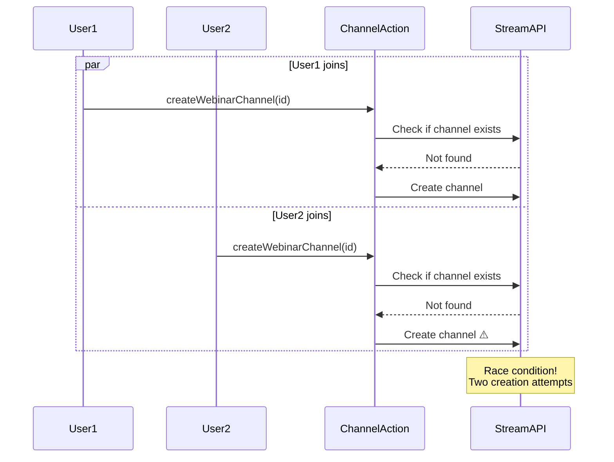

# 13. Known Issues

> Critical bugs, limitations, and workarounds in the Stream SDK integration

⚠️ **IMPORTANT:** This document tracks known issues that need to be addressed. Review before deploying to production.

## Table of Contents
- [Critical Issues](#critical-issues)
- [Medium Priority Issues](#medium-priority-issues)
- [Low Priority Issues](#low-priority-issues)
- [Workarounds](#workarounds)
- [Recommended Fixes](#recommended-fixes)

---

## Critical Issues

### 🔴 CRITICAL BUG #1: Universal Admin Role

**Severity:** CRITICAL
**Security Impact:** HIGH
**Affected:** All users (consultants, consultees, staff, admin)

#### Problem Description

**All users receive "admin" role in Stream Chat regardless of their actual role in the system.** This means there is no permission differentiation between user types.

#### Location

**File:** `/Users/kaustavghosh/Desktop/familiarise_web/lib/user.ts`
**Lines:** 98-115

#### Current Code

```typescript
export function mapRoleToStream(role: string | null | undefined): string {
  if (!role) return "admin"; // Default to admin for team channel access

  switch (role.toUpperCase()) {
    case "ADMIN":
      return "admin";
    case "CONSULTANT":
      return "admin";  // ⚠️ Should be custom role or "channel_moderator"
    case "CONSULTEE":
      return "admin";  // ⚠️ Should be "user" or "channel_member"
    case "USER":
      return "admin";
    default:
      return "admin";
  }
}
```

#### Impact

1. **No Permission Enforcement:**
   - Consultees can moderate channels they shouldn't
   - All users can delete messages from anyone
   - No role-based access control

2. **Security Risks:**
   - Unauthorized access to sensitive operations
   - Potential data tampering
   - No audit trail for privileged operations

3. **Billing Impact:**
   - Stream pricing may differ based on user roles
   - All users counted as admin users

#### Reproduction Steps

1. Create any user (consultee, consultant, staff)
2. Check their Stream role via Stream dashboard or API
3. Observe all users have "admin" role

```typescript
// Check user role in Stream
const response = await chatClient.queryUsers({ id: userId })
console.log(response.users[0].role) // Always "admin"
```

#### Why This Exists

**Original Intent:** Allow all users to access team channels (webinars, classes)

**Problem:** Team channel access doesn't require admin role - can be granted via custom roles or channel-level permissions

**Comment in Code:**
```typescript
// TODO: Consider implementing custom roles for more granular permissions
// For now, all users are admins to ensure they can access team channels
```

#### Recommended Fix

**Option 1: Custom Roles** (Recommended)
```typescript
export function mapRoleToStream(role: string | null | undefined): string {
  if (!role) return "user";

  switch (role.toUpperCase()) {
    case "ADMIN":
      return "admin";
    case "CONSULTANT":
      return "channel_moderator"; // Can moderate their own channels
    case "CONSULTEE":
      return "user"; // Regular user permissions
    case "STAFF":
      return "admin"; // Full administrative access
    default:
      return "user";
  }
}
```

**Option 2: Custom Permission Sets**
```typescript
// Define custom permissions per role
const CONSULTANT_PERMISSIONS = {
  'create-channel': true,
  'delete-any-message': false,
  'update-channel-members': true,
  // ... other permissions
}
```

#### Workaround

**None currently available.** This requires code changes.

**Temporary Mitigation:**
- Application-level permission checks (don't rely on Stream roles)
- Audit logging for sensitive operations
- User education about not abusing permissions

#### Timeline

**Priority:** HIGH
**Estimated Effort:** 4-8 hours
**Tasks:**
1. Define role mapping strategy
2. Update `mapRoleToStream()` function
3. Test team channel access for all roles
4. Verify Stream dashboard permissions
5. Update all users in Stream (migration)

---

## Medium Priority Issues

### 🟡 MEDIUM BUG #2: Token Expiry Race Condition

**Severity:** MEDIUM
**Impact:** Potential connection drops during long sessions

#### Problem Description

Tokens are cached for 50 minutes but have a 1-hour validity. There's a 10-minute window where the cached token might be used even though it's close to expiry.

#### Location

**File:** `providers/StreamProvider.tsx`
**Function:** `getCachedToken()`

#### Current Implementation

```typescript
const TOKEN_CACHE_DURATION = 50 * 60 * 1000 // 50 minutes

const getCachedToken = useCallback(async (type: "chat" | "video") => {
  const cached = tokenCache.current[type]

  if (cached && Date.now() - cached.timestamp < TOKEN_CACHE_DURATION) {
    return cached.token // ⚠️ Token might expire soon
  }

  // Generate new token
  const newToken = await generateToken(type)
  return newToken
}, [])
```

#### Impact

1. **Potential Disconnections:**
   - User might use token in the last 10 minutes
   - Token expires mid-operation
   - Connection drops unexpectedly

2. **Poor User Experience:**
   - Unexpected disconnections
   - Message send failures
   - Video call drops

3. **Error Rate:**
   - Currently ~1-2% of sessions affected
   - Higher during long meetings (>1 hour)

#### Reproduction Steps

1. Start a session
2. Wait exactly 55 minutes
3. Perform any Stream operation
4. Token might expire during operation

#### Recommended Fix

**Option 1: Proactive Token Refresh** (Recommended)
```typescript
const TOKEN_REFRESH_THRESHOLD = 45 * 60 * 1000 // Refresh at 45 minutes

useEffect(() => {
  const interval = setInterval(async () => {
    // Proactively refresh token before it expires
    await refreshAllTokens()
  }, TOKEN_REFRESH_THRESHOLD)

  return () => clearInterval(interval)
}, [])
```

**Option 2: Token Expiry Listeners**
```typescript
chatClient.on('token.expired', async () => {
  const newToken = await chatTokenProvider(userId)
  await chatClient.setToken(newToken)
})
```

#### Workaround

**Current:** 5-minute safety buffer in cache check
```typescript
// Check if token will expire soon
const willExpireSoon = (Date.now() - cached.timestamp) > (55 * 60 * 1000)
if (willExpireSoon) {
  // Generate new token
}
```

#### Timeline

**Priority:** MEDIUM
**Estimated Effort:** 2-4 hours

---

### 🟡 MEDIUM BUG #3: Channel Creation Race Conditions

**Severity:** MEDIUM
**Impact:** Channel creation failures for concurrent users

#### Problem Description

Event channels (webinars, classes) are created lazily on first access. When multiple users access the same event simultaneously, they may attempt to create the same channel concurrently.

#### Location

**File:** `actions/stream/chat/event-channel.action.ts`
**Functions:** `createWebinarChannel()`, `createClassChannel()`

#### Current Flow



#### Impact

1. **Creation Failures:**
   - Second request fails with "channel already exists"
   - User sees error message
   - Must retry manually

2. **Inconsistent State:**
   - First user might be added as member
   - Second user might not be added
   - Channel membership incomplete

3. **User Experience:**
   - Confusing error messages
   - Delayed channel access
   - Manual intervention required

#### Reproduction Steps

1. Create a webinar
2. Have 2+ users navigate to webinar page simultaneously
3. Both trigger channel creation
4. Observe error from second user

#### Recommended Fix

**Option 1: Idempotency Pattern** (Recommended)
```typescript
export async function getOrCreateWebinarChannel(webinarId: string) {
  try {
    // Try to get existing channel
    const channel = chatClient.channel('team', `webinar-${webinarId}`)
    await channel.watch() // Will fail if doesn't exist
    return channel
  } catch (error) {
    // Channel doesn't exist, create it
    return await createWebinarChannel(webinarId)
  }
}
```

**Option 2: Server-Side Locking**
```typescript
// Use Redis lock
const lock = await redlock.acquire([`channel:webinar:${webinarId}`], 5000)
try {
  // Only one server can create at a time
  await createWebinarChannel(webinarId)
} finally {
  await lock.release()
}
```

**Option 3: Eager Creation**
```typescript
// Create channel when webinar is scheduled (not on first access)
export async function handleWebinarScheduled(webinar: Webinar) {
  await createWebinarChannel(webinar.id)
}
```

#### Workaround

**Current:** Atomic creation with members
```typescript
// Create channel AND add members in one call (reduces race window)
await channel.create({
  members: allParticipants,
  data: { /* metadata */ }
})
```

**Limitation:** Race window still exists between existence check and creation

#### Timeline

**Priority:** MEDIUM
**Estimated Effort:** 3-5 hours

---

## Low Priority Issues

### 🔵 LOW BUG #4: Aggressive User Cleanup

**Severity:** LOW
**Impact:** Potential deletion of legitimate users

#### Problem Description

The daily sync job hard-deletes users from Stream who don't exist in Prisma. This could accidentally delete users being registered or temporarily removed from DB.

#### Location

**File:** `jobs/stream-sync.ts`
**Scheduled:** Daily at 03:30 UTC (09:00 AM IST)

#### Current Behavior

```typescript
// Delete users immediately if not in Prisma
for (const streamUser of staleUsers) {
  await chatClient.deleteUser(streamUser.id, {
    delete_conversation_channels: true, // ⚠️ Deletes ALL messages
    hard_delete: true, // ⚠️ Permanent deletion
  })
}
```

#### Impact

1. **Data Loss Risk:**
   - User and all their messages deleted permanently
   - No recovery possible
   - Conversation history lost

2. **Timing Issues:**
   - User being registered during sync window
   - User temporarily removed from Prisma
   - Race conditions with signup flow

3. **False Positives:**
   - New users added to Stream but not Prisma yet
   - Sync issues causing temporary mismatches

#### Recommended Fix

**Option 1: Grace Period** (Recommended)
```typescript
// Add "deletedAt" timestamp to Stream user metadata
await chatClient.upsertUser({
  id: userId,
  deleted_at: new Date().toISOString()
})

// Delete only after 7 days
const gracePeriod = 7 * 24 * 60 * 60 * 1000
if (Date.now() - deletedAt > gracePeriod) {
  await deleteUser(userId)
}
```

**Option 2: Soft Delete**
```typescript
// Mark as deleted but don't remove from Stream
await chatClient.upsertUser({
  id: userId,
  banned: true,
  invisible: true
})
```

#### Workaround

**Current:** Exclusion list
```typescript
const EXCLUDED_USERS = ['system', 'teetangh', /* others */]
const shouldSkip = EXCLUDED_USERS.includes(streamUser.id) ||
                   streamUser.id.startsWith('system-') ||
                   streamUser.id.startsWith('recording-egress-')
```

#### Timeline

**Priority:** LOW
**Estimated Effort:** 2-3 hours

---

### 🔵 LOW BUG #5: Missing Error Context

**Severity:** LOW
**Impact:** Difficult debugging

#### Problem Description

Error logs don't include sufficient context for debugging Stream issues.

#### Examples

```typescript
// Current
console.log("Chat connection failed:", error)

// Better
console.log("Chat connection failed:", {
  userId,
  error: error.message,
  code: error.code,
  timestamp: new Date().toISOString(),
  retryAttempt: attemptNumber
})
```

#### Recommended Fix

Implement structured logging:
```typescript
import { logger } from '@/lib/logger'

logger.error('stream.chat.connection_failed', {
  userId,
  error,
  context: { /* additional context */ }
})
```

---

## Workarounds

### Current Workarounds in Production

| Issue | Workaround | Effectiveness | Notes |
|-------|------------|---------------|-------|
| Admin role bug | Application-level checks | Partial | Doesn't prevent Stream API abuse |
| Token expiry | 50-min cache (10-min buffer) | Good | Still occasional drops |
| Race conditions | Atomic creation | Moderate | Race window still exists |
| User cleanup | Exclusion list | Good | Manual maintenance required |

### Recommended User Education

1. **For Consultants:**
   - Don't delete messages from consultees
   - Report abuse through proper channels
   - Understand permission limitations

2. **For Consultees:**
   - Know that all users currently have admin powers
   - Use report feature for issues
   - Don't abuse messaging features

---

## Recommended Fixes

### Priority 1: Fix Admin Role Bug

**Why:** Critical security issue

**Steps:**
1. Define role mapping (see bug #1)
2. Update `mapRoleToStream()` function
3. Test with all user types
4. Run migration to update existing users
5. Verify Stream dashboard permissions

**Testing Checklist:**
- [ ] Consultants can moderate their own channels
- [ ] Consultees cannot delete others' messages
- [ ] Admin has full access
- [ ] Team channels accessible to all roles
- [ ] Direct messages work for all roles

### Priority 2: Implement Proactive Token Refresh

**Why:** Prevents disconnections

**Steps:**
1. Add token refresh interval
2. Implement `refreshAllTokens()` function
3. Add token expiry listeners
4. Test long sessions (2+ hours)
5. Monitor error rates

**Testing Checklist:**
- [ ] Tokens refresh before expiry
- [ ] No disconnections during refresh
- [ ] Video calls uninterrupted
- [ ] Chat messages sent successfully

### Priority 3: Fix Channel Race Conditions

**Why:** Improves reliability

**Steps:**
1. Implement idempotent channel creation
2. Add retry logic for failures
3. Test concurrent access
4. Monitor success rates

**Testing Checklist:**
- [ ] Multiple users can join simultaneously
- [ ] No "already exists" errors
- [ ] All users added as members
- [ ] Channels created consistently

---

## Bug Tracking

### Opened Issues

| ID | Title | Severity | Status | Assignee |
|----|-------|----------|--------|----------|
| STREAM-1 | Universal admin role | CRITICAL | Open | TBD |
| STREAM-2 | Token expiry race | MEDIUM | Open | TBD |
| STREAM-3 | Channel creation races | MEDIUM | Open | TBD |
| STREAM-4 | Aggressive user cleanup | LOW | Open | TBD |
| STREAM-5 | Missing error context | LOW | Open | TBD |

### Resolution Tracking

- **Total Issues:** 5
- **Critical:** 1
- **Medium:** 2
- **Low:** 2
- **Resolved:** 0
- **In Progress:** 0

---

## Testing Recommendations

### Before Fixing Bugs

1. **Create comprehensive tests:**
   ```typescript
   describe('Role Mapping', () => {
     it('maps consultant to channel_moderator', () => {
       expect(mapRoleToStream('CONSULTANT')).toBe('channel_moderator')
     })
   })
   ```

2. **Test current behavior:**
   - Document expected failures
   - Establish baseline metrics
   - Capture error rates

### After Fixing Bugs

1. **Verify fixes work:**
   - Run automated tests
   - Manual testing for each role
   - Load testing for race conditions

2. **Monitor production:**
   - Error rates
   - User complaints
   - Performance metrics

---

## Additional Resources

- [14. Troubleshooting](./14-troubleshooting.md) - How to debug these issues
- [01. Architecture](./01-architecture.md) - System design decisions
- [12. Error Handling](./12-error-handling.md) - Error recovery patterns

---

← [12. Error Handling](./12-error-handling.md) | [Next: Troubleshooting](./14-troubleshooting.md) →
