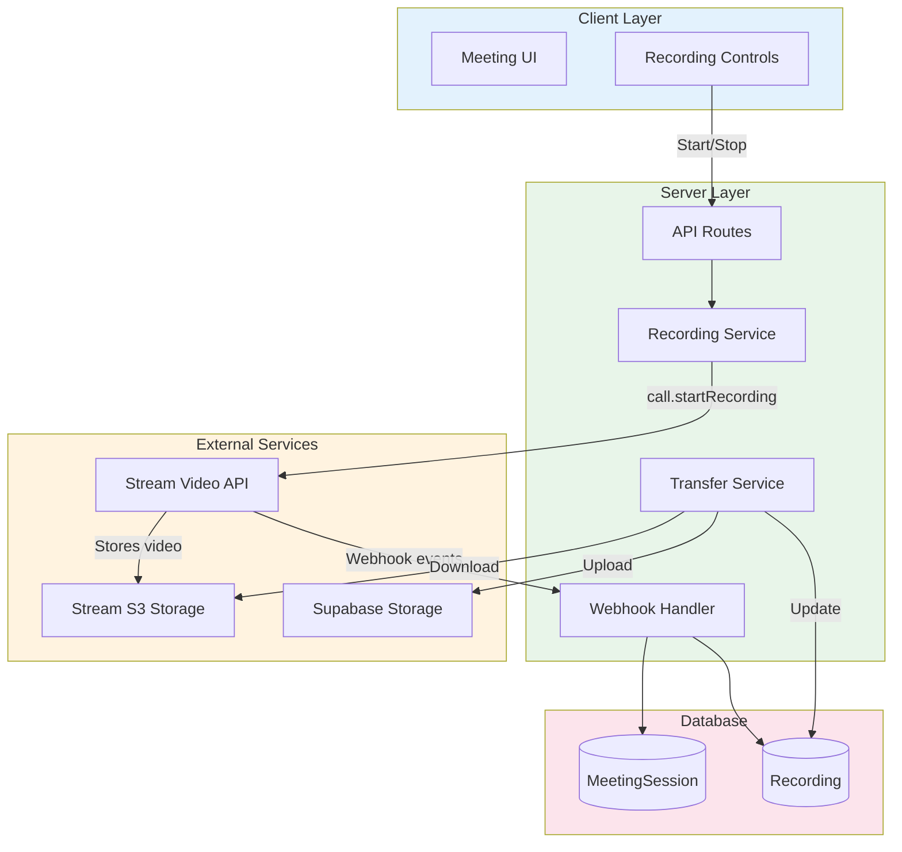
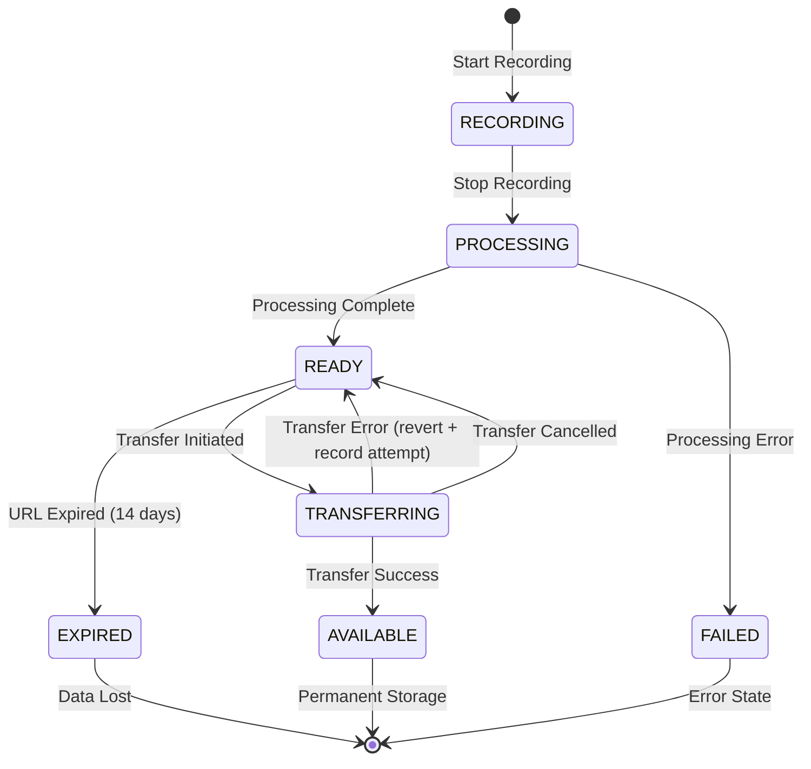
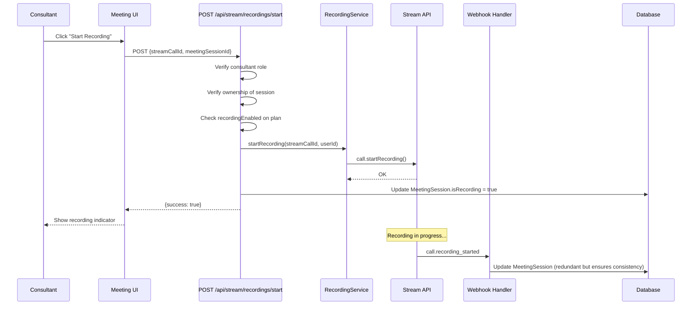
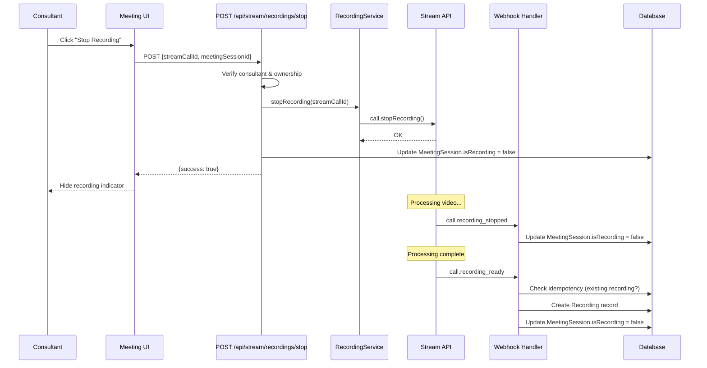
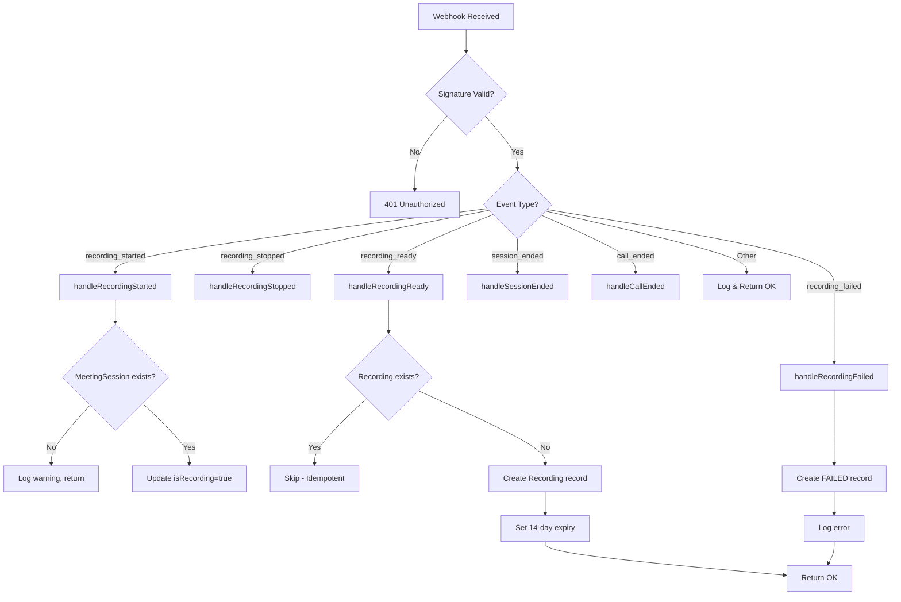
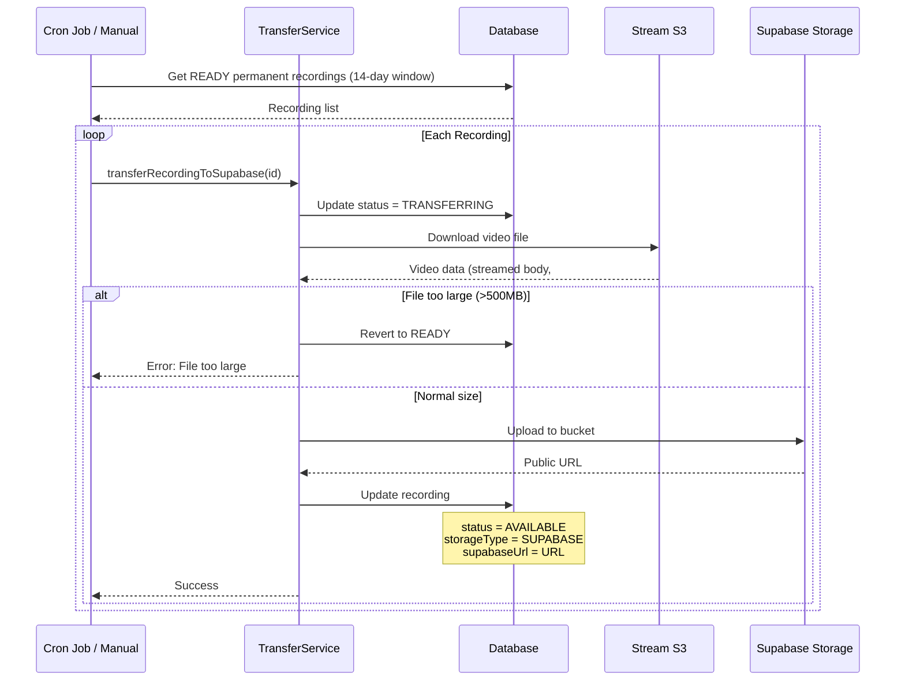

# Stream Recording & Webhooks

Comprehensive documentation for Stream video call recording and webhook handling in Familiarise.

## Navigation

- [Architecture](./01-architecture.md)
- [Setup & Configuration](./02-setup-configuration.md)
- [Provider & Authentication](./03-provider-authentication.md)
- [Video Implementation](./05-video-implementation.md)
- [Troubleshooting](./troubleshooting.md)

---

## Table of Contents

1. [Overview](#overview)
2. [Recording Architecture](#recording-architecture)
3. [Recording Lifecycle](#recording-lifecycle)
4. [Data Models](#data-models)
5. [Recording Flow](#recording-flow)
6. [Webhook Events](#webhook-events)
7. [Webhook Handler Flow](#webhook-handler-flow)
8. [Recording Transfer](#recording-transfer)
9. [API Routes Reference](#api-routes-reference)
10. [Access Control Matrix](#access-control-matrix)
11. [Key Implementation Files](#key-implementation-files)
12. [Configuration](#configuration)

---

## Overview

The recording system enables consultants to record webinars and classes for later viewing by enrolled participants. Recordings follow a two-stage storage architecture:

1. **Stream S3** - Initial storage provided by Stream (14-day expiration)
2. **Supabase Storage** - Permanent storage after transfer

### Key Features

- **Consultant-only recording control** - Only the session host can start/stop
- **Automatic webhook processing** - Recording lifecycle managed via webhooks
- **Idempotent operations** - Safe to receive duplicate webhook events
- **Automatic transfer** - The `recording_ready` webhook enqueues the permanent-storage transfer immediately (via Next.js `after()`), and a cron job runs as a backstop sweeper that picks up any recording the webhook missed before its Stream URL expires
- **Role-based access** - Different permissions for consultants, consultees, and admins

---

## Recording Architecture

### High-Level Overview



### Storage Architecture

| Storage       | Duration  | Use Case           | URL Format                                  |
| ------------- | --------- | ------------------ | ------------------------------------------- |
| **Stream S3** | 14 days   | Initial processing | `https://stream-io-*.s3.amazonaws.com/...`  |
| **Supabase**  | Permanent | Long-term storage  | `https://[project].supabase.co/storage/...` |

---

## Recording Lifecycle

### Recording Status Flow



### Status Definitions

| Status         | Description                         | Storage Type | URL Available |
| -------------- | ----------------------------------- | ------------ | ------------- |
| `RECORDING`    | Recording in progress               | N/A          | No            |
| `PROCESSING`   | Stream processing video             | Stream S3    | No            |
| `READY`        | Available on Stream S3              | STREAM_S3    | Yes (14 days) |
| `TRANSFERRING` | Being transferred to Supabase       | STREAM_S3    | Yes           |
| `AVAILABLE`    | Permanently stored in Supabase      | SUPABASE     | Yes           |
| `EXPIRED`      | Stream URL expired, not transferred | STREAM_S3    | No            |
| `FAILED`       | Recording capture failed            | N/A          | No            |

As of #689 (STR-2/3), a failed *transfer* no longer lands in `FAILED`. Every transfer failure path reverts the recording to `READY` so that both the cron job and the manual `/transfer` route can retry it, since a `FAILED` status would permanently dead-end the recording (the manual route only accepts `READY` recordings). `FAILED` is now reached only by a capture/processing failure, not by a transfer error.

### Storage Type Transitions

```
STREAM_S3 (initial) --> SUPABASE (after transfer)
```

---

## Data Models

### Recording Model

```prisma
model Recording {
  id                  String          @id @default(cuid())
  title               String
  recordingUrl        String          // Stream S3 URL (temporary)
  supabaseUrl         String?         // Supabase URL (permanent)
  supabasePath        String?         // Supabase storage path
  durationInMinutes   Int
  recordedAt          DateTime
  streamRecordingId   String?         // Stream filename identifier
  streamCallId        String?         // Associated Stream call ID
  storageType         StorageType     @default(STREAM_S3)
  status              RecordingStatus @default(READY)
  streamUrlExpiresAt  DateTime?       // When Stream URL expires
  transferredAt       DateTime?       // When transferred to Supabase
  fileSize            BigInt?         // File size in bytes

  // #689 (STR-2/3) — transfer reliability tracking
  transferAttempts         Int       @default(0) // Failed-transfer counter; reset to a clean trail on success
  lastTransferError        String?   // Message from the most recent failed transfer
  transferFailureAlertedAt DateTime? // Set when engineering has been paged for this recording (dedupe)

  meetingSessionId    String
  meetingSession      MeetingSession  @relation(...)

  createdAt           DateTime        @default(now())
  updatedAt           DateTime        @updatedAt
}

enum StorageType {
  STREAM_S3
  SUPABASE
}

enum RecordingStatus {
  RECORDING
  PROCESSING
  READY
  TRANSFERRING
  AVAILABLE
  EXPIRED
  FAILED
}
```

### MeetingSession Recording Fields

```prisma
model MeetingSession {
  id                  String    @id @default(cuid())
  streamCallId        String    @unique

  // Recording state (real-time)
  isRecording         Boolean   @default(false)
  recordingStartedAt  DateTime?
  recordingStartedBy  String?   // User ID who started recording

  // Related recordings
  recordings          Recording[]

  // ... other fields
}
```

### Entity Relationships

```mermaid
erDiagram
    MeetingSession ||--o{ Recording : "has many"
    MeetingSession ||--|| SlotOfAppointment : "belongs to"
    SlotOfAppointment ||--|| Appointment : "belongs to"
    Appointment ||--o| Webinar : "may have"
    Appointment ||--o| Class : "may have"
    Webinar ||--|| WebinarPlan : "belongs to"
    Class ||--|| ClassPlan : "belongs to"
    WebinarPlan ||--|| ConsultantProfile : "owned by"
    ClassPlan ||--|| ConsultantProfile : "owned by"

    Recording {
        string id PK
        string title
        string recordingUrl
        string supabaseUrl
        int durationInMinutes
        datetime recordedAt
        string status
        string storageType
    }

    MeetingSession {
        string id PK
        string streamCallId UK
        boolean isRecording
        datetime recordingStartedAt
    }
```

---

## Recording Flow

### Start Recording Sequence



### Stop Recording Sequence



---

## Webhook Events

### Handled Event Types

| Event Type                         | Description                          | Handler                            |
| ---------------------------------- | ------------------------------------ | ---------------------------------- |
| `call.recording_started`           | Recording has begun                  | `handleRecordingStarted()`         |
| `call.recording_stopped`           | Recording has stopped                | `handleRecordingStopped()`         |
| `call.recording_ready`             | Recording is processed and available | `handleRecordingReady()`           |
| `call.recording_failed`            | Recording failed                     | `handleRecordingFailed()`          |
| `call.session_ended`               | A participant's session ended        | `handleSessionEnded()`             |
| `call.ended`                       | The entire call has ended            | `handleCallEnded()`                |
| `call.session_participant_joined`  | A participant joined the call        | `handleSessionParticipantJoined()` |
| `call.session_participant_left`    | A participant left the call          | `handleSessionParticipantLeft()`   |

### Per-Attendee Attendance Capture

As of #689 (STR-4), the platform records per-attendee presence rather than only call-level lifecycle. The two `call.session_participant_*` handlers above maintain a `MeetingAttendance` row keyed on the unique pair of meeting session and app user. The first join for a user creates the row and stamps `firstJoinedAt`; a rejoin only increments `joinCount`, leaving `firstJoinedAt` immutable so it always reflects the genuine first arrival. A participant-left event stamps `lastLeftAt`, and because a leave can arrive before or without a recorded join, the left handler upserts as well (defensively seeding `firstJoinedAt` from the leave time) so the event is never lost. The handlers are idempotent on the session-and-user key, so a duplicate webhook does not inflate the count. This attendance data is what unblocks no-show detection (#471) and overrun detection (#472), which previously had no underlying per-attendee record to read from.

### Event Payload Structures

#### call.recording_started

```typescript
interface StreamRecordingStartedEvent {
  call_cid: string; // "default:callId"
  type: "call.recording_started";
  user?: {
    id: string;
    name?: string;
  };
  created_at: string; // ISO timestamp
}
```

#### call.recording_stopped

```typescript
interface StreamRecordingStoppedEvent {
  call_cid: string;
  type: "call.recording_stopped";
  created_at: string;
}
```

#### call.recording_ready

```typescript
interface StreamRecordingReadyEvent {
  call_cid: string;
  type: "call.recording_ready";
  call_recording: {
    filename: string; // Unique recording identifier
    url: string; // Stream S3 URL (expires in 14 days)
    start_time: string; // Recording start timestamp
    end_time: string; // Recording end timestamp
  };
  created_at: string;
}
```

#### call.recording_failed

```typescript
interface StreamRecordingFailedEvent {
  call_cid: string;
  type: "call.recording_failed";
  error?: {
    message?: string;
    code?: string;
  };
  created_at: string;
}
```

### Webhook Security

Webhooks are verified using HMAC SHA256 signature:

```typescript
// Signature verification
const signature = req.headers.get("x-signature");
const expectedSignature = crypto
  .createHmac("sha256", STREAM_WEBHOOK_SECRET)
  .update(body)
  .digest("hex");

// Constant-time comparison (prevents timing attacks)
return crypto.timingSafeEqual(
  Buffer.from(signature),
  Buffer.from(expectedSignature),
);
```

---

## Webhook Handler Flow

### Main Handler Flowchart



### Idempotency Handling

Webhooks may be delivered multiple times. The handler uses multiple idempotency strategies:

1. **Event ID tracking** - Log webhook events with unique IDs
2. **Recording existence check** - Skip if recording already exists for filename
3. **Safe status updates** - Status updates are idempotent

```typescript
// Check if recording already exists (idempotency)
const existingRecording = await prisma.recording.findFirst({
  where: {
    meetingSessionId: meetingSession.id,
    streamRecordingId: filename, // Unique per recording
  },
});

if (existingRecording) {
  streamLogger.info("Recording already exists, skipping creation", {
    recordingId: existingRecording.id,
    streamRecordingId: filename,
  });
  return; // Safe to return early
}
```

---

## Recording Transfer

### Transfer Architecture



### Transfer Configuration

| Setting             | Value        | Description                           |
| ------------------- | ------------ | ------------------------------------- |
| `MAX_TRANSFER_SIZE` | 500MB        | Maximum file size for direct transfer |
| `RECORDINGS_BUCKET` | "recordings" | Supabase storage bucket name          |
| `daysBeforeExpiry`  | 5            | Days before expiry to start transfer (default). The production jobs pass 14 — the full Stream URL lifetime — so every READY permanent recording is swept near-ready rather than near-expiry (#899). |
| `batchSize`         | 10           | Max recordings per cron run           |

### Storage Path Format

```
recordings/{year}/{month}/{recordingId}/{filename}

Example:
recordings/2025/01/clx123abc/rec_xyz789.mp4
```

### Transfer Service Methods

```typescript
class RecordingTransferService {
  // Queue for transfer
  static async queueRecordingTransfer(recordingId: string): Promise<boolean>;

  // Execute transfer
  static async transferRecordingToSupabase(recordingId: string): Promise<{
    success: boolean;
    error?: string;
  }>;

  // Process batch of expiring recordings
  static async processExpiringRecordings(
    daysBeforeExpiry?: number,
    batchSize?: number,
  ): Promise<{
    processed: number;
    succeeded: number;
    failed: number;
    errors: string[];
  }>;

  // Mark expired recordings
  static async markExpiredRecordings(): Promise<number>;

  // Delete from Supabase
  static async deleteRecordingFromSupabase(recordingId: string): Promise<{
    success: boolean;
    error?: string;
  }>;

  // Get best available URL
  static getBestRecordingUrl(recording: Recording): string | null;
}
```

### Transfer Failure Handling and Paging

As of #689 (STR-2/3), transfer reliability is tracked on the recording itself rather than left to logs. Every failure path inside `transferRecordingToSupabase` — a missing bucket, a failed download, a file over the 500MB limit, an upload error, or any unexpected exception — routes through a single `recordTransferFailure` helper. That helper reverts the recording to `READY`, increments `transferAttempts`, and stamps `lastTransferError` with the failure message. A successful transfer clears this trail by nulling `lastTransferError` and `transferFailureAlertedAt`, so a recording that recovers stops looking stuck.

Once a recording crosses three failed attempts, the helper pages engineering exactly once by calling `recordSystemError` with the `RECORDING_TRANSFER` category, and stamps `transferFailureAlertedAt` so the same stuck recording does not re-page on every subsequent sweep. The stamp is written only after the page is recorded, so a crash mid-alert re-pages on the next failure rather than silently swallowing it.

### STREAM_ONLY Expiry Warning

For recordings on a `STREAM_ONLY` plan there is nothing to auto-transfer — the URL simply expires after fourteen days. As of #689, the previously-TODO expiry-warning email to the consultant is now actually sent. `getExpiringStreamOnlyRecordings` collects the consultant-owned `STREAM_ONLY` recordings whose Stream URL expires soon but has not yet lapsed, and the expiry-warning job dispatches a notification to each owning consultant through Novu so they can save the recording before it is lost.

---

## API Routes Reference

### Recording Control Routes

#### POST /api/stream/recordings/start

Start recording for a video call.

**Authorization:** Consultant only, must own the session

**Request:**

```json
{
  "streamCallId": "abc123",
  "meetingSessionId": "clx123..."
}
```

**Response:**

```json
{
  "success": true,
  "message": "Recording started"
}
```

**Errors:**

- `401` - Unauthorized
- `403` - Not a consultant / Not session owner / Recording not enabled
- `400` - Already recording
- `404` - Meeting session not found

---

#### POST /api/stream/recordings/stop

Stop recording for a video call.

**Authorization:** Consultant only, must own the session

**Request:**

```json
{
  "streamCallId": "abc123",
  "meetingSessionId": "clx123..."
}
```

**Response:**

```json
{
  "success": true,
  "message": "Recording stopped"
}
```

---

### Recording Query Routes

#### GET /api/stream/recordings/[recordingId]

Get a single recording by ID.

**Authorization:** Consultant (own recordings) or Consultee (paid enrollments) or Admin

**Response:**

```json
{
  "id": "clx123...",
  "title": "Webinar: Introduction to React - Jan 15, 2025",
  "recordingUrl": "https://...",
  "supabaseUrl": "https://...",
  "durationInMinutes": 45,
  "recordedAt": "2025-01-15T10:00:00Z",
  "status": "AVAILABLE",
  "storageType": "SUPABASE"
}
```

---

#### POST /api/stream/recordings/[recordingId]/transfer

Transfer a recording from Stream S3 to Supabase.

**Authorization:** Consultant only, must own the recording

**Response:**

```json
{
  "success": true,
  "message": "Recording transferred successfully",
  "recording": { ... }
}
```

---

#### POST /api/stream/recordings/sync

Sync recordings from Stream API for the current user.

**Authorization:** Authenticated user (Consultant or Consultee)

**Response:**

```json
{
  "success": true,
  "synced": 3,
  "recordings": [ ... ]
}
```

---

### Webhook Route

#### POST /api/stream/webhooks

Receives webhook events from Stream.

**Headers:**

- `x-signature` - HMAC SHA256 signature

**Response:**

```json
{
  "status": "ok"
}
```

---

## Access Control Matrix

### Recording Operations

| Role           | Start | Stop | View Own | View All | Transfer | Delete |
| -------------- | :---: | :--: | :------: | :------: | :------: | :----: |
| **Consultant** |  Yes  | Yes  |   Yes    |    No    |   Yes    |   No   |
| **Consultee**  |  No   |  No  |  Yes\*   |    No    |    No    |   No   |
| **Admin**      |  No   |  No  |   Yes    |   Yes    |    No    |   No   |

\*Consultees can only view recordings for webinars/classes they have a live paid enrollment for. As of #689 (STR-1), a successful payment alone is no longer sufficient — the entitlement nets any refunds, so a fully-refunded buyer loses access while a partially-refunded buyer keeps it.

### Access Verification Logic

```typescript
// Consultant access check
const isOwner = getMeetingSessionOwnershipInfo(
  meetingSession,
  user.consultantProfileId,
).isOwner;

// Consultee access check (#689, STR-1)
// `PaymentStatus` has no REFUNDED value — a refunded payment stays SUCCEEDED
// and the money movement lives only in `Refund` rows. A `SUCCEEDED` filter
// alone therefore still matches a fully-refunded buyer, so the check loads
// the payment's refunds and nets them via the shared isPaymentEntitled() helper.
const payment = await prisma.payment.findFirst({
  where: {
    userId: user.id,
    paymentStatus: "SUCCEEDED",
    appointment: {
      // ... matches recording's appointment
    },
  },
  include: { refunds: true },
});

// A full refund (refunded paise >= amount) revokes access; a partial refund
// keeps it. The same isPaymentEntitled() helper guards all four entitlement
// paths: the single-recording route, getPaidPlanIds, syncRecordingsForConsultee,
// and the meetings recording-info endpoint.
const hasPaidEnrollment =
  payment != null && isPaymentEntitled(payment); // lib/payments/utils/refund-balance.ts
```

### Recording Visibility Rules

1. **Consultants** see all their own recordings (webinars + classes)
2. **Consultees** see recordings only for paid enrollments that have not been fully refunded (as of #689, access nets refunds — a full refund revokes it, a partial refund retains it)
3. **Admins** can view all recordings for oversight
4. **Recording must not be FAILED or EXPIRED** to be visible

---

## Key Implementation Files

### Core Services

| File                                       | Purpose                        |
| ------------------------------------------ | ------------------------------ |
| `lib/stream/recording-service.ts`          | Recording CRUD operations      |
| `lib/stream/recording-transfer-service.ts` | Stream S3 to Supabase transfer |
| `lib/stream/recording-handlers.ts`         | Webhook event handlers         |
| `lib/stream/recording-utils.ts`            | Helper functions               |
| `lib/stream/recording-types.ts`            | Prisma payload types           |

### API Routes

| File                                                        | Endpoint           |
| ----------------------------------------------------------- | ------------------ |
| `app/api/stream/recordings/start/route.ts`                  | POST /start        |
| `app/api/stream/recordings/stop/route.ts`                   | POST /stop         |
| `app/api/stream/recordings/sync/route.ts`                   | POST /sync         |
| `app/api/stream/recordings/[recordingId]/route.ts`          | GET /:id           |
| `app/api/stream/recordings/[recordingId]/transfer/route.ts` | POST /:id/transfer |
| `app/api/stream/webhooks/route.ts`                          | Webhook handler    |

### Session Handlers

| File                             | Purpose                         |
| -------------------------------- | ------------------------------- |
| `lib/stream/session-handlers.ts` | Call session lifecycle handlers |

---

## Configuration

### Environment Variables

```env
# Stream API (required)
NEXT_PUBLIC_STREAM_API_KEY=your_api_key
STREAM_API_SECRET=your_api_secret

# Webhook signature verification (required for webhooks)
STREAM_WEBHOOK_SECRET=your_webhook_secret

# Supabase (required for transfer)
NEXT_PUBLIC_SUPABASE_URL=https://xxx.supabase.co
NEXT_PUBLIC_SUPABASE_ANON_KEY=your_anon_key
SUPABASE_SERVICE_ROLE_KEY=your_service_role_key
```

### Stream Dashboard Configuration

1. **Enable Recording** - Dashboard > Video > Settings > Enable Recording
2. **Configure Webhooks** - Dashboard > Webhooks > Add Endpoint
   - URL: `https://your-domain.com/api/stream/webhooks`
   - Events: `call.recording_*`, `call.session_ended`, `call.ended`
   - Signing Secret: Copy to `STREAM_WEBHOOK_SECRET`

### Supabase Storage Setup

1. Create a bucket named `recordings`
2. Set appropriate RLS policies:

   ```sql
   -- Allow service role full access
   CREATE POLICY "Service role access"
   ON storage.objects
   FOR ALL
   TO service_role
   USING (bucket_id = 'recordings');

   -- Allow authenticated users to read their recordings
   CREATE POLICY "Users can read own recordings"
   ON storage.objects
   FOR SELECT
   TO authenticated
   USING (bucket_id = 'recordings');
   ```

### Cron Job Configuration

Set up a cron job to process expiring recordings:

```typescript
// Example: Run daily at 3:00 AM UTC
// 0 3 * * *

import { RecordingTransferService } from "@/lib/stream/recording-transfer-service";

async function processExpiringRecordings() {
  const result = await RecordingTransferService.processExpiringRecordings(
    14, // daysBeforeExpiry — full Stream URL lifetime, sweeps near-ready (#899)
    10, // batchSize
  );

  console.log(`Processed: ${result.processed}`);
  console.log(`Succeeded: ${result.succeeded}`);
  console.log(`Failed: ${result.failed}`);

  // Also mark expired recordings
  const expired = await RecordingTransferService.markExpiredRecordings();
  console.log(`Marked expired: ${expired}`);
}
```

---

## Troubleshooting

### Common Issues

#### Webhook not receiving events

1. Verify webhook URL is accessible from internet
2. Check `STREAM_WEBHOOK_SECRET` matches dashboard
3. Verify events are selected in Stream dashboard
4. Check server logs for signature validation errors

#### Recording not appearing after call

1. Check webhook handler logs for errors
2. Verify `streamCallId` matches between session and webhook
3. Check for duplicate detection (recording may already exist)
4. Verify call had recording enabled in Stream

#### Transfer failing

1. Check Supabase credentials and bucket exists
2. Verify file size is under 500MB limit
3. Check Stream URL hasn't expired
4. Review transfer service logs for errors

### Debug Logging

Enable detailed logging:

```typescript
import { streamLogger } from "@/lib/stream-logger";

// Logs are automatically structured with context
streamLogger.info("Recording started", { streamCallId, userId });
streamLogger.error("Transfer failed", error, { recordingId });
```

---

## Next Steps

- Review [Video Implementation](./05-video-implementation.md) for meeting UI
- Check [Troubleshooting](./troubleshooting.md) for common issues
- Return to [Architecture](./01-architecture.md) for system overview

---

**Last Updated:** 2025-01-22
