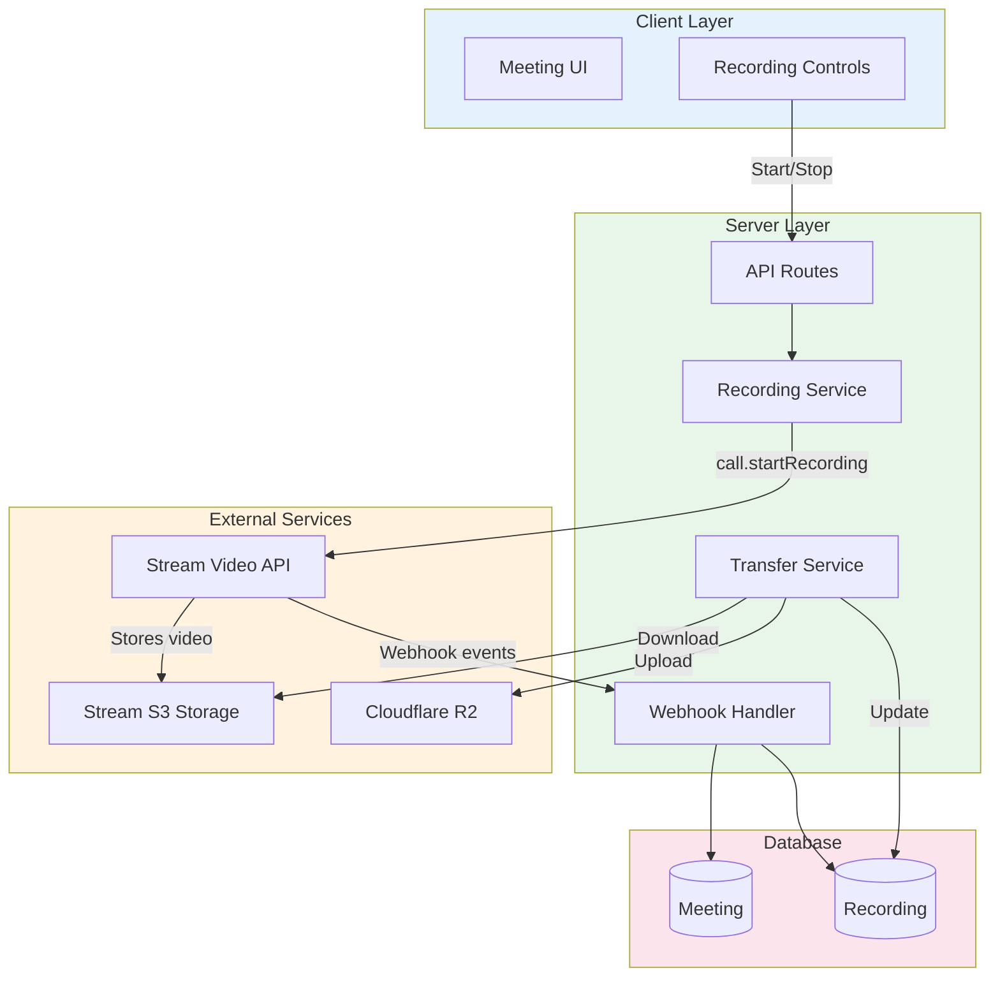
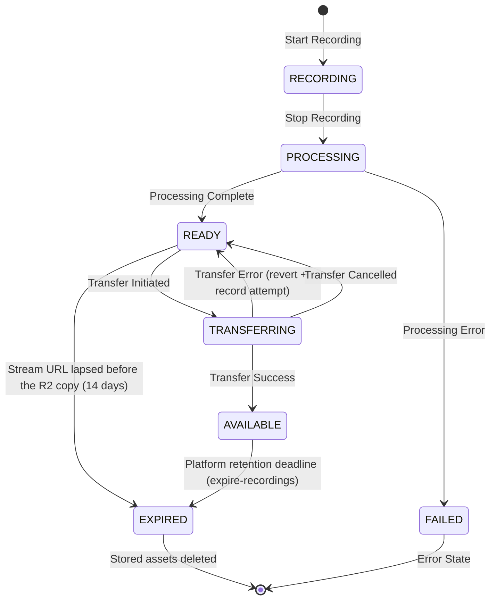
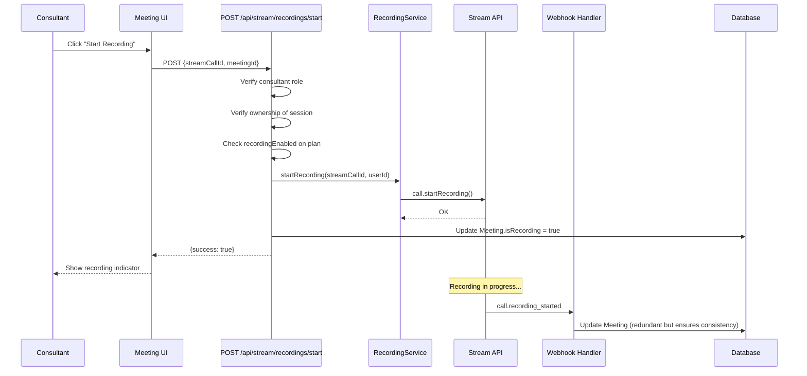
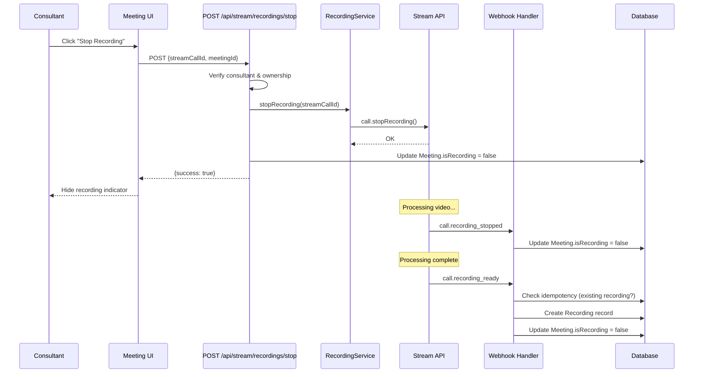
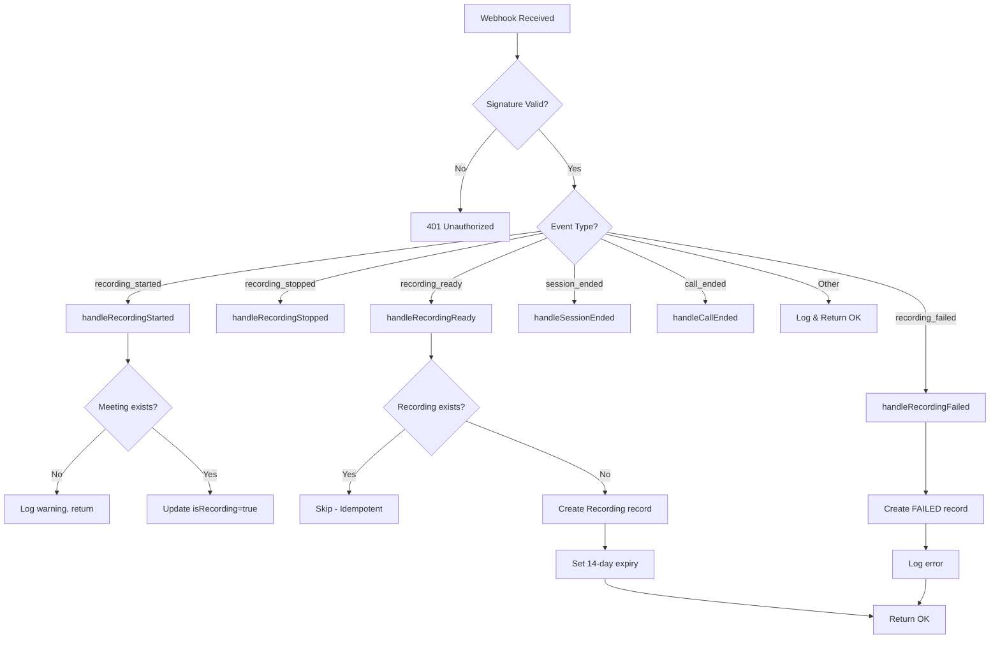
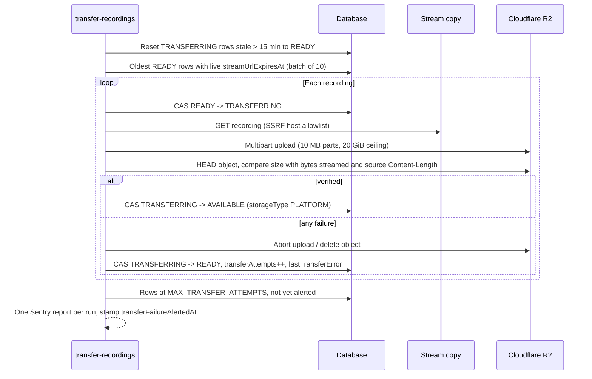

# Stream Recording & Webhooks

Comprehensive documentation for Stream video call recording and webhook handling in Familiarise.

## Navigation

- [Architecture](./01-architecture.md)
- [Setup & Configuration](./02-setup-configuration.md)
- [Provider & Authentication](./03-provider-authentication.md)
- [Video Implementation](./05-video-implementation.md)
- [Troubleshooting](./troubleshooting.md)

---

## Table of Contents

1. [Overview](#overview)
2. [Recording Architecture](#recording-architecture)
3. [Recording Lifecycle](#recording-lifecycle)
4. [Data Models](#data-models)
5. [Recording Flow](#recording-flow)
6. [Webhook Events](#webhook-events)
7. [Webhook Handler Flow](#webhook-handler-flow)
8. [Recording Transfer](#recording-transfer)
9. [API Routes Reference](#api-routes-reference)
10. [Access Control Matrix](#access-control-matrix)
11. [Key Implementation Files](#key-implementation-files)
12. [Configuration](#configuration)

---

## Overview

The recording system enables consultants to record webinars and classes for later viewing by enrolled participants. Recordings follow a two-stage storage architecture:

1. **Stream S3** - Initial storage provided by Stream (14-day expiration)
2. **Cloudflare R2** - Our copy, made by the `transfer-recordings` job and kept until retention

### Key Features

- **Consultant-only recording control** - Only the session host can start/stop
- **Automatic webhook processing** - Recording lifecycle managed via webhooks
- **Idempotent operations** - Safe to receive duplicate webhook events
- **Automatic copy** - The `recording_ready` webhook only records the READY row; the `transfer-recordings` job copies every READY recording into R2 while Stream's fourteen-day copy is live.
- **Capability-based access** - Consultants, consultees, collaborators and replay buyers each reach a recording through a distinct ownership or entitlement path, and platform operators reach it through the back-office permission matrix: staff see metadata, admin alone plays the session, and either one is audited (#1270)

---

## Recording Architecture

### High-Level Overview


```mermaid
graph TB
    subgraph Client["Client Layer"]
        UI[Meeting UI]
        RecBtn[Recording Controls]
    end

    subgraph Server["Server Layer"]
        API[API Routes]
        RecService[Recording Service]
        TransferService[Transfer Service]
        WebhookHandler[Webhook Handler]
    end

    subgraph External["External Services"]
        StreamAPI[Stream Video API]
        StreamS3[Stream S3 Storage]
        SupaStorage[Cloudflare R2]
    end

    subgraph Database["Database"]
        Meeting[(Meeting)]
        Recording[(Recording)]
    end

    RecBtn -->|Start/Stop| API
    API --> RecService
    RecService -->|call.startRecording| StreamAPI
    StreamAPI -->|Stores video| StreamS3

    StreamAPI -->|Webhook events| WebhookHandler
    WebhookHandler --> Meeting
    WebhookHandler --> Recording

    TransferService -->|Download| StreamS3
    TransferService -->|Upload| SupaStorage
    TransferService -->|Update| Recording

    style Client fill:#e3f2fd
    style Server fill:#e8f5e9
    style External fill:#fff3e0
    style Database fill:#fce4ec
```

### Storage Architecture

| Storage       | Duration        | Use Case           | URL Format                                        |
| ------------- | --------------- | ------------------ | ------------------------------------------------- |
| **Stream S3** | 14 days         | Initial processing | `https://stream-io-*.s3.amazonaws.com/...`        |
| **R2**        | Until retention | Our copy           | Presigned per request (`createR2PresignedGetUrl`) |

---

## Recording Lifecycle

### Recording Status Flow


```mermaid
stateDiagram-v2
    [*] --> RECORDING: Start Recording
    RECORDING --> PROCESSING: Stop Recording
    PROCESSING --> READY: Processing Complete
    PROCESSING --> FAILED: Processing Error

    READY --> TRANSFERRING: Transfer Initiated
    TRANSFERRING --> AVAILABLE: Transfer Success
    TRANSFERRING --> READY: Transfer Error (revert + record attempt)
    TRANSFERRING --> READY: Transfer Cancelled

    READY --> EXPIRED: Stream URL lapsed before the R2 copy (14 days)
    AVAILABLE --> EXPIRED: Platform retention deadline (expire-recordings)
    EXPIRED --> [*]: Stored assets deleted
    FAILED --> [*]: Error State
```

### Status Definitions

| Status         | Description                                    | Storage Type       | URL Available |
| -------------- | ---------------------------------------------- | ------------------ | ------------- |
| `RECORDING`    | Recording in progress                          | N/A                | No            |
| `PROCESSING`   | Stream processing video                        | Stream S3          | No            |
| `READY`        | Available on Stream S3                         | STREAM_S3          | Yes (14 days) |
| `TRANSFERRING` | Being copied to R2                             | STREAM_S3          | Yes           |
| `AVAILABLE`    | Copied to R2                                   | PLATFORM           | Yes           |
| `EXPIRED`      | Past retention, or Stream copy lapsed uncopied | STREAM_S3/PLATFORM | No            |
| `FAILED`       | Recording capture failed                       | N/A                | No            |

A failed copy never lands in `FAILED`: every transfer failure returns the row to `READY` so the next `transfer-recordings` run retries it. `FAILED` is reached only through `call.recording_failed`.

### Storage Type Transitions

```
STREAM_S3 (initial) --> PLATFORM (after the R2 copy)
```

---

## Data Models

### Recording Model

```prisma
model Recording {
  id                  String          @id @default(cuid())
  title               String
  recordingUrl        String          // Stream S3 URL (temporary)
  storagePath         String?         // Object key in R2 once copied
  durationInMinutes   Int
  recordedAt          DateTime
  streamRecordingId   String?         // Stream filename identifier
  streamCallId        String?         // Associated Stream call ID
  storageType         RecordingStorageType @default(STREAM_S3)
  status              RecordingStatus @default(READY)
  streamUrlExpiresAt  DateTime?       // When Stream URL expires
  transferredAt       DateTime?       // When copied to R2
  fileSize            BigInt?         // File size in bytes

  // #689 (STR-2/3) — transfer reliability tracking
  transferAttempts         Int       @default(0) // Failed-transfer counter; reset to a clean trail on success
  lastTransferError        String?   // Message from the most recent failed transfer
  transferFailureAlertedAt DateTime? // Set when engineering has been paged for this recording (dedupe)

  meetingId    String
  meeting      Meeting  @relation(...)

  createdAt           DateTime        @default(now())
  updatedAt           DateTime        @updatedAt
}

enum RecordingStorageType {
  STREAM_S3
  PLATFORM
}

enum RecordingStatus {
  RECORDING
  PROCESSING
  READY
  TRANSFERRING
  AVAILABLE
  EXPIRED
  FAILED
}
```

### Meeting Recording Fields

```prisma
model Meeting {
  id                  String    @id @default(cuid())
  streamCallId        String    @unique

  // Recording state (real-time)
  isRecording         Boolean   @default(false)
  recordingStartedAt  DateTime?
  recordingStartedBy  String?   // User ID who started recording

  // Related recordings
  recordings          Recording[]

  // ... other fields
}
```

### Entity Relationships

```mermaid
erDiagram
    Meeting ||--o{ Recording : "has many"
    Meeting ||--|| AppointmentOccurrence : "belongs to"
    AppointmentOccurrence ||--|| Appointment : "belongs to"
    Appointment ||--o| Webinar : "may have"
    Appointment ||--o| Class : "may have"
    Webinar ||--|| WebinarPlan : "belongs to"
    Class ||--|| ClassPlan : "belongs to"
    WebinarPlan ||--|| ConsultantProfile : "owned by"
    ClassPlan ||--|| ConsultantProfile : "owned by"

    Recording {
        string id PK
        string title
        string recordingUrl
        string storagePath
        int durationInMinutes
        datetime recordedAt
        string status
        string storageType
    }

    Meeting {
        string id PK
        string streamCallId UK
        boolean isRecording
        datetime recordingStartedAt
    }
```

---

## Recording Flow

### Start Recording Sequence


```mermaid
sequenceDiagram
    participant C as Consultant
    participant UI as Meeting UI
    participant API as POST /api/stream/recordings/start
    participant Service as RecordingService
    participant Stream as Stream API
    participant Webhook as Webhook Handler
    participant DB as Database

    C->>UI: Click "Start Recording"
    UI->>API: POST {streamCallId, meetingId}

    API->>API: Verify consultant role
    API->>API: Verify ownership of session
    API->>API: Check recordingEnabled on plan

    API->>Service: startRecording(streamCallId, userId)
    Service->>Stream: call.startRecording()
    Stream-->>Service: OK

    API->>DB: Update Meeting.isRecording = true
    API-->>UI: {success: true}
    UI-->>C: Show recording indicator

    Note over Stream: Recording in progress...

    Stream->>Webhook: call.recording_started
    Webhook->>DB: Update Meeting (redundant but ensures consistency)
```

### Stop Recording Sequence


```mermaid
sequenceDiagram
    participant C as Consultant
    participant UI as Meeting UI
    participant API as POST /api/stream/recordings/stop
    participant Service as RecordingService
    participant Stream as Stream API
    participant Webhook as Webhook Handler
    participant DB as Database

    C->>UI: Click "Stop Recording"
    UI->>API: POST {streamCallId, meetingId}

    API->>API: Verify consultant & ownership
    API->>Service: stopRecording(streamCallId)
    Service->>Stream: call.stopRecording()
    Stream-->>Service: OK

    API->>DB: Update Meeting.isRecording = false
    API-->>UI: {success: true}
    UI-->>C: Hide recording indicator

    Note over Stream: Processing video...

    Stream->>Webhook: call.recording_stopped
    Webhook->>DB: Update Meeting.isRecording = false

    Note over Stream: Processing complete

    Stream->>Webhook: call.recording_ready
    Webhook->>DB: Check idempotency (existing recording?)
    Webhook->>DB: Create Recording record
    Webhook->>DB: Update Meeting.isRecording = false
```

---

## Webhook Events

### Handled Event Types

| Event Type                        | Description                          | Handler                            |
| --------------------------------- | ------------------------------------ | ---------------------------------- |
| `call.recording_started`          | Recording has begun                  | `handleRecordingStarted()`         |
| `call.recording_stopped`          | Recording has stopped                | `handleRecordingStopped()`         |
| `call.recording_ready`            | Recording is processed and available | `handleRecordingReady()`           |
| `call.recording_failed`           | Recording failed                     | `handleRecordingFailed()`          |
| `call.session_ended`              | A participant's session ended        | `handleSessionEnded()`             |
| `call.ended`                      | The entire call has ended            | `handleCallEnded()`                |
| `call.session_participant_joined` | A participant joined the call        | `handleSessionParticipantJoined()` |
| `call.session_participant_left`   | A participant left the call          | `handleSessionParticipantLeft()`   |

`call.session_started` is subscribed but listed in `IGNORED_EVENT_TYPES` (`lib/stream/webhook-events.ts`): the route acknowledges it with `ignored: true` and writes no receipt.

### End Events and the `endedAt` Column

Three rules govern how the two end events write `Meeting.endedAt` and `endedReason`, all from #1607. First, the last end wins: Stream reuses a call id across sessions, so a `call.session_ended` fired by the inactivity timeout after a host's pre-start device check must not be the end of record for the real call an hour later. Both handlers therefore accept an event only when its timestamp is later than the recorded `endedAt`, which also means a replayed or out-of-order older event can never move the column backwards. Second, a `call.ended` that arrives before the booked start is stamped `ended_early` rather than `call_ended`, and the slot is left `SCHEDULED`; `ended_early` is not a deliberate end, so every join gate re-lights and the same room is re-entered for the real session. Third, a `call.session_participant_joined` on a session whose recorded end is not deliberate (`session_timeout`, `ended_early`, or one of the reconciler's guesses) clears `endedAt` and `endedReason`, because a participant joining means Stream has opened a new session on that call id. That clear is compare-and-set on the end the handler read, so a real end committed concurrently is never overwritten. A deliberate end — the host closing the room after the start, or the maintenance drain — is never cleared. `heldOccurrence`'s attendance arm and the maintenance drain both read `endedAt` as "the room is closed", and these rules are what keep that reading true while a call is live.

One more rule sits on the provisioning side rather than in a handler. A Stream call's own `ended_at` never clears, so after a `call.ended` the SDK renders the room as ended even though Stream opens a new session for a re-entrant participant. `provisionAppointmentMeeting` therefore treats an `ended_early` row as the one case in which an existing `Meeting` is not simply handed back: it runs the same entitlement and refusal gates as a first mint, creates a fresh call under `slot-<anchorSlotId>-r<suffix>`, and rebinds the row to it (compare-and-set on the reason, so two concurrent joins share one rebuilt room). The dashboard buckets and the session timeline follow the same reading through `meetingClosedAt`: only a deliberate end is the session's end, so a timed-out or early-ended booking stays under Upcoming with Join offered.

### Per-Attendee Attendance Capture

As of #689 (STR-4), the platform records per-attendee presence rather than only call-level lifecycle. The two `call.session_participant_*` handlers above maintain a `MeetingAttendance` row keyed on the unique pair of meeting session and app user. The first join for a user creates the row and stamps `firstJoinedAt`; a rejoin only increments `joinCount`, leaving `firstJoinedAt` immutable so it always reflects the genuine first arrival. A participant-left event stamps `lastLeftAt`, and because a leave can arrive before or without a recorded join, the left handler upserts as well (defensively seeding `firstJoinedAt` from the leave time) so the event is never lost. The handlers are idempotent on the session-and-user key, so a duplicate webhook does not inflate the count. This attendance data is what unblocks no-show detection (#471) and overrun detection (#472), which previously had no underlying per-attendee record to read from.

### Event Payload Structures

#### call.recording_started

```typescript
interface StreamRecordingStartedEvent {
  call_cid: string; // "default:callId"
  type: "call.recording_started";
  user?: {
    id: string;
    name?: string;
  };
  created_at: string; // ISO timestamp
}
```

Every start in this app goes through the server SDK (`POST /api/stream/recordings/start`), so this event never carries a `user` in practice. The handler treats the webhook as confirmation that recording is active, not as a fresh source of truth: it never overwrites the actor or claim time the route already stamped, and it only fills them in when the row does not already have them (#1615).

#### call.recording_stopped

```typescript
interface StreamRecordingStoppedEvent {
  call_cid: string;
  type: "call.recording_stopped";
  created_at: string;
}
```

#### call.recording_ready

```typescript
interface StreamRecordingReadyEvent {
  call_cid: string;
  type: "call.recording_ready";
  call_recording: {
    filename: string; // Unique recording identifier
    url: string; // Stream S3 URL (expires in 14 days)
    start_time: string; // Recording start timestamp
    end_time: string; // Recording end timestamp
  };
  created_at: string;
}
```

#### call.recording_failed

```typescript
interface StreamRecordingFailedEvent {
  call_cid: string;
  type: "call.recording_failed";
  egress_id: string; // e.g. "call_recorder:unique"
  recording_type: string; // e.g. "composite"
  created_at: string;
}
```

Stream sends no error detail, so the log names the recording type and egress id and the host's notification carries no reason.

### Webhook Security

Webhooks are verified using HMAC SHA256 signature:

```typescript
// Signature verification
const signature = req.headers.get("x-signature");
const expectedSignature = crypto
  .createHmac("sha256", STREAM_WEBHOOK_SECRET)
  .update(body)
  .digest("hex");

// Constant-time comparison (prevents timing attacks)
return crypto.timingSafeEqual(
  Buffer.from(signature),
  Buffer.from(expectedSignature),
);
```

---

## Webhook Handler Flow

### Main Handler Flowchart


```mermaid
flowchart TD
    A[Webhook Received] --> B{Signature Valid?}
    B -->|No| C[401 Unauthorized]
    B -->|Yes| D{Event Type?}

    D -->|recording_started| E[handleRecordingStarted]
    D -->|recording_stopped| F[handleRecordingStopped]
    D -->|recording_ready| G[handleRecordingReady]
    D -->|recording_failed| H[handleRecordingFailed]
    D -->|session_ended| I[handleSessionEnded]
    D -->|call_ended| J[handleCallEnded]
    D -->|Other| K[Log & Return OK]

    E --> L{Meeting exists?}
    L -->|No| M[Log warning, return]
    L -->|Yes| N[Update isRecording=true]

    G --> O{Recording exists?}
    O -->|Yes| P[Skip - Idempotent]
    O -->|No| Q[Create Recording record]
    Q --> R[Set 14-day expiry]
    R --> S[Return OK]

    H --> T[Create FAILED record]
    T --> U[Log error]
    U --> S
```

### Idempotency Handling

Webhooks may be delivered multiple times. The handler uses multiple idempotency strategies:

1. **Event ID tracking** - Log webhook events with unique IDs
2. **Recording existence check** - Skip if recording already exists for filename
3. **Safe status updates** - Status updates are idempotent

```typescript
// Check if recording already exists (idempotency)
const existingRecording = await prisma.recording.findFirst({
  where: {
    meetingId: meeting.id,
    streamRecordingId: filename, // Unique per recording
  },
});

if (existingRecording) {
  streamLogger.info("Recording already exists, skipping creation", {
    recordingId: existingRecording.id,
    streamRecordingId: filename,
  });
  return; // Safe to return early
}
```

---

## Recording Transfer

### Why the file is pulled instead of pushed

Stream can push recordings into a customer bucket itself, but it does not document what happens when that push fails: there are no retry or fallback semantics, `call.recording_failed` carries no reason, and the GetStream/protocol discussion #371 reports problems. Twilio's analogous feature deletes recordings after exhausted retries. Pulling from Stream's own 14-day copy means our side can fail and retry without ever losing the recording. Stream external storage is to be revisited after a bad-credentials canary test; the full reasoning is in the [storage, retention and visibility ADR](../decisions/2026-10-09-recording-storage-retention-visibility.md).

### Transfer Architecture

`call.recording_ready` only upserts the `READY` row; it never copies. The
`transfer-recordings` job (`lib/stream/recording-transfer-service.ts`, every
six hours in `cron-intra-day.yml`) copies every READY recording into
Cloudflare R2 while Stream's fourteen-day copy is still live. R2 is the only
destination; Stream's copy is the retry source.


```mermaid
sequenceDiagram
    participant Job as transfer-recordings
    participant DB as Database
    participant Stream as Stream copy
    participant R2 as Cloudflare R2

    Job->>DB: Reset TRANSFERRING rows stale > 15 min to READY
    Job->>DB: Oldest READY rows with live streamUrlExpiresAt (batch of 10)
    loop Each recording
        Job->>DB: CAS READY -> TRANSFERRING
        Job->>Stream: GET recording (SSRF host allowlist)
        Job->>R2: Multipart upload (10 MB parts, 20 GiB ceiling)
        Job->>R2: HEAD object, compare size with bytes streamed and source Content-Length
        alt verified
            Job->>DB: CAS TRANSFERRING -> AVAILABLE (storageType PLATFORM)
        else any failure
            Job->>R2: Abort upload / delete object
            Job->>DB: CAS TRANSFERRING -> READY, transferAttempts++, lastTransferError
        end
    end
    Job->>DB: Rows at MAX_TRANSFER_ATTEMPTS, not yet alerted
    Job-->>Job: One Sentry report per run, stamp transferFailureAlertedAt
```

### Invariants

- A failed copy never hides a playable recording: the transfer path only
  writes `READY`, `TRANSFERRING` or `AVAILABLE`. `FAILED` is reserved for
  `call.recording_failed`. While `READY` or `TRANSFERRING`, playback uses
  Stream's URL.
- `streamUrlExpiresAt` is `end_time + 14 days`, computed by
  `streamCopyExpiresAt` in both the webhook and `syncSessionRecordings`.
- A CompleteMultipartUpload answer is parsed for an `<Error>` body even on
  HTTP 200; any upload error aborts the multipart upload.
- READY rows whose Stream copy lapsed without a copy become `EXPIRED` in the
  daily `expire-recordings` job.

### Storage Path Format

```
recordings/{recordingId}/{uuid}.mp4
```

### Mid-session decline

For a 1:1 meeting where a participant's `DECLINED` consent was decided at or
before the recording's end time, `recording_ready` and the sync path delete the
recording from Stream (`call.deleteRecording({ session, filename })`) and
CAS-expire any row instead of creating a playable one
(`lib/stream/recording-decline.ts`). Retries are no-ops.

### Retention

`lib/stream/recording-retention.ts` holds the one rule and the daily
`expire-recordings` job: 1:1 sessions are kept 90 days after the session,
subscription and trial recordings 90 days after the subscription ends, webinars
365 days, and classes 365 days after their final session. Published replays and
recordings with a PENDING or SUCCEEDED purchase are exempt. An org's
`streamRecordingRetentionDays` (owner-set, nullable) caps org-scoped
recordings only. Expiry deletes the R2 object and the preview clip and
thumbnail, and writes a `STREAM_RECORDING_DELETED` org audit row. The reasoning behind the windows is in the [ADR](../decisions/2026-10-09-recording-storage-retention-visibility.md).

---

## API Routes Reference

### Recording Control Routes

#### POST /api/stream/recordings/start

Start recording for a video call.

**Authorization:** Consultant only, must own the session

**Request:**

```json
{
  "streamCallId": "abc123",
  "meetingId": "clx123..."
}
```

**Response:**

```json
{
  "success": true,
  "message": "Recording started"
}
```

**Errors:**

- `401` - Unauthorized
- `403` - Not a consultant / Not session owner / Recording not enabled
- `400` - Already recording
- `404` - Meeting session not found

---

#### POST /api/stream/recordings/stop

Stop recording for a video call.

**Authorization:** Consultant only, must own the session

**Request:**

```json
{
  "streamCallId": "abc123",
  "meetingId": "clx123..."
}
```

**Response:**

```json
{
  "success": true,
  "message": "Recording stopped"
}
```

---

### Recording Query Routes

#### GET /api/stream/recordings/[recordingId]

Get a single recording by ID.

**Authorization:** the consultant who delivered the session, an accepted collaborator on its plan, a consultee holding a net-positive payment for the plan, or a standalone replay buyer. Platform operators reach it through the back-office matrix instead: `recordings.read` admits ADMIN and STAFF, while `recordings.play` is ADMIN-only. See the [Operator access](#operator-access-admin--staff) section below.

A successful response always carries an `access` object so a client can tell "you may not play this" apart from "there is nothing to play yet" — both of which present as a null `playbackUrl`. Error responses do not carry it, including the `410` returned when a Stream URL has lapsed for a caller entitled to play it.

**Response (full access):**

```json
{
  "recording": {
    "id": "clx123...",
    "title": "Webinar: Introduction to React - Jan 15, 2025",
    "playbackUrl": "https://...",
    "thumbnailUrl": "https://...",
    "previewClipUrl": "https://...",
    "durationInMinutes": 45,
    "recordedAt": "2025-01-15T10:00:00Z",
    "status": "AVAILABLE",
    "storageType": "PLATFORM"
  },
  "access": { "level": "FULL" }
}
```

**Response (staff, metadata only):**

```json
{
  "recording": {
    "id": "clx123...",
    "title": "Webinar: Introduction to React - Jan 15, 2025",
    "playbackUrl": null,
    "thumbnailUrl": null,
    "previewClipUrl": null,
    "durationInMinutes": 45,
    "recordedAt": "2025-01-15T10:00:00Z",
    "status": "AVAILABLE",
    "storageType": "PLATFORM",
    "streamUrlExpiresAt": null
  },
  "access": {
    "level": "METADATA_ONLY",
    "reason": "Playback requires the recordings.play permission; staff receive metadata only."
  }
}
```

Every media URL is withheld from the metadata-only response, not only `playbackUrl`. A thumbnail is a frame of the session and the preview clip is a cut of it, so returning either would hand over exactly the content the cap exists to protect. The expiry branch behaves differently too: a full-access caller receives a `410` when a `STREAM_S3` recording's link has lapsed, whereas a metadata-only caller receives the record with `streamUrlExpiresAt` populated, because diagnosing that expiry is the reason a support agent is looking at all.

---

#### POST /api/stream/recordings/sync

Sync recordings from Stream API for the current user.

**Authorization:** Authenticated user (Consultant or Consultee)

**Response:**

```json
{
  "success": true,
  "synced": 3,
  "recordings": [ ... ]
}
```

**Rate limit:** three calls per five minutes per user, via `streamRecordingSyncLimiter`. One POST here walks every session the caller owns or is enrolled in and issues a `listRecordings` request to Stream for each of them, so a single authenticated account could otherwise force an unbounded and billable fan-out. The edge `stream: api` rule already matched this path, but it is keyed by IP at sixty per minute, which neither identifies the caller nor reflects what the endpoint costs to serve. The user-keyed limiter is sized on what the feature is for: somebody presses "Sync" because a replay is missing, and the answer does not change on the second press.

---

### Recording Consent Routes

Consent is asked for before anyone joins, not while a recording is running. Both
handlers are gated by `resolveMeetingAccess`, the same resolver the join gate
uses, so only somebody actually on this appointment can read the notice or
record a decision about it. Without that gate the endpoint would leak which
meeting identifiers exist and which of them are recorded.

#### GET /api/meetings/[meetingId]/recording-consent

Returns the notice this person must be shown before joining, if any.

**Authorization:** any participant on the appointment.

**Response:**

```json
{
  "required": true,
  "regime": "OPT_OUT",
  "noticeVersion": 1,
  "decision": null
}
```

`regime` is `OPT_OUT` for one-to-one sessions, where declining is real and
costs nothing — the person still joins and the host's recording endpoint
refuses. It is `ACKNOWLEDGE` for group events, where the recording is part of
what attendees bought and the only action available is to understand it.

`required: false` means there is nothing to disclose, and the client should not
block joining.

#### POST /api/meetings/[meetingId]/recording-consent

Records a decision.

**Authorization:** any participant on the appointment, for their own decision
only.

**Request:**

```json
{ "decision": "GRANTED" }
```

`decision` is `GRANTED` or `DECLINED`.

**Implementation notes.** Three details of these handlers are easy to
reintroduce incorrectly.

Neither handler loads the meeting a second time. `resolveMeetingAccess` already
joins the session, its slot and all four plan relations in order to decide
whether the caller is the host, so it returns `meetingId` and
`appointment` and the handlers read them off the result. Both used to re-run the
same `findUnique` immediately after the access check, which on this deployment
is serialized latency rather than parallel work. See the
[ADR](../decisions/2026-08-13-meeting-access-returns-what-it-loaded.md).

The choice between 404 and 403 comes from `access.reason === "not_found"`, never
from comparing `access.message` against a string. Rewording a user-facing
message must not be able to change a status code.

Enforcement is at recording start only. The `DECLINED` check lives inside the
atomic claim in `POST /api/stream/recordings/start`, so a decline arriving
between the read and the write loses the race rather than being ignored. A
decline made _after_ recording has begun has no effect, because what should
happen to the recording that already exists is an open product question rather
than an implementation gap. It is tracked in #1146.

**Client.** `useRecordingConsent` in
`app/meetings/[id]/components/RecordingConsentNotice.tsx` returns a
`ConsentGate` of `{ satisfied, loading, node }`. `loading` is true only while
the fetch is outstanding, which the lobby needs in order to distinguish that
window from a genuinely outstanding decision — `satisfied` is false in both, and
the Join button is disabled in both. `MeetingSetup` reads it and labels the
button "Checking recording notice..." rather than leaving it disabled with
nothing on screen accounting for it.

---

### Webhook Route

#### POST /api/stream/webhooks

Receives webhook events from Stream.

**Headers:**

- `x-signature` - HMAC SHA256 signature

**Response:**

```json
{
  "status": "ok"
}
```

---

## Access Control Matrix

### Recording Operations

| Role           | Start | Stop | View Own | Metadata (any) | Play (any) | Delete |
| -------------- | :---: | :--: | :------: | :------------: | :--------: | :----: |
| **Consultant** |  Yes  | Yes  |   Yes    |       No       |     No     |   No   |
| **Consultee**  |  No   |  No  |  Yes\*   |       No       |     No     |   No   |
| **Staff**      |  No   |  No  |   Yes    |      Yes       |   **No**   |   No   |
| **Admin**      |  No   |  No  |   Yes    |      Yes       |    Yes     |   No   |

\*Consultees can play recordings of 1:1, subscription and trial appointments they took part in, and of webinar and class sessions they hold a live seat or entitled payment for (see [Recording Visibility Rules](#recording-visibility-rules)). Entitlement nets refunds: a fully refunded buyer loses access, a partially refunded buyer keeps it.

### Operator access (ADMIN / STAFF)

Until #1270 the operator grant was a single line — `if (isPrivileged(session.user.role)) hasAccess = true` — in both `GET /api/stream/recordings/[recordingId]` and `GET /api/stream/meetings/[streamCallId]/recording-info`. Because `isPrivileged` returns true for STAFF as well as ADMIN, any staff member could fetch a playback URL for any recording on the platform, including a 1:1 consultation they had no relationship to, and nothing was written anywhere to record that they had. The operator path was therefore strictly less accountable than the tenant path, where deleting a recording or exporting a call log already produced an `OrgAuditLog` row.

Three rules now hold, and they are implemented once in `lib/stream/recording-operator-access.ts` so no route can restate them differently.

First, the grant is resolved through `BACKOFFICE_PERMISSIONS`, which is the declared single source of truth for who reaches which internal surface. `recordings.read` covers metadata and admits both ADMIN and STAFF; `recordings.play` covers any URL that renders the session and admits ADMIN alone. A bare `isPrivileged` call left the grant invisible to the file that is supposed to enumerate it.

Second, staff receive metadata only. Everything a support agent needs in order to answer "where is my replay" — status, storage type, duration, recorded-at, and the Stream URL expiry — is metadata, and none of it requires watching the session. The session content belongs to the two people who agreed to record it for each other, not to the platform.

Third, the operator branch is evaluated last, after every ownership and entitlement path. A staff member who actually delivered or bought the session passes one of those checks and keeps full playback; the operator branch only ever catches somebody with no relationship to the session at all. ADMIN is the one exception and short-circuits first, because holding `recordings.play` means the ownership walk cannot widen anything for them.

### Auditing a privileged read

Every read that is granted by the operator branch writes a trail before the response is built, and before any playback URL is minted, so the trail cannot lag the access it describes. There are two sinks.

`OrgAuditLog` receives a `STREAM_RECORDING_ACCESSED` row whenever the session belongs to an organization, so the tenant can see that a platform operator reached into their sessions. `actorMembershipId` is null because the operator is acting as the platform rather than as a member; the actor's user id and role live in `details`, alongside `played`, which distinguishes a metadata read from playback. This write is deliberately not swallowed — it mirrors the sibling compliance export at `app/api/organizations/[orgId]/stream/calls/route.ts`, where a read that cannot be audited is not served.

`SystemEvent` receives a `STREAM_RECORDING_ACCESS` row on every privileged read, including B2C recordings that have no tenant to write to. It is recorded at `WARN` severity rather than `INFO` so that reaching into someone else's session stands out when an on-call engineer scans the platform trail. `recordSystemEvent` is best-effort by its own contract, which is the honest ceiling today: there is no platform-wide audit table to write to instead, and introducing one is a schema change.

### Playback URLs never leave the handler raw

`Recording.recordingUrl` holds Stream's pre-signed S3 link. It is valid for fourteen days and carries its own credentials, so anybody who ends up holding the string can fetch the video with no session and no membership — a forwarded email, a pasted chat message, an exported CSV, or a third-party tool consuming the API all suffice. `GET /api/organizations/[orgId]/stream/calls` used to return that column verbatim to any org MANAGER+ when called with `?withRecordings=1`.

That export now uses an explicit select allowlist that names no field which reaches the media — not `recordingUrl`, not `storagePath`, and not the thumbnail, preview clip or Stream identifiers. What remains is the retention picture the compliance pull actually exists for: whether a recording exists, whether it survived the transfer to permanent storage, how long it runs, and when its Stream link lapses.

The route deliberately offers no playback arm at all, not even a short-lived signed one. [ADR 20](../enterprise/70-design-decisions/20-org-visibility-into-member-sessions.md) is the governing rule — an organization may see that a session happened, not what happened in it — and it considered and rejected exactly that design, on the grounds that an audit row does not change what a member has to assume about who can watch their coaching session. The equivalent allowlist already existed in `lib/api/scope/list-recordings.ts` for the org recordings page; this route was the arm the July 2026 audit missed.

### Access Verification Logic

```typescript
// Consultant access check
const isOwner = getgetMeetingOwnershipInfo(
  meeting,
  user.consultantProfileId,
).isOwner;

// Consultee access check (#689, STR-1)
// `PaymentStatus` has no REFUNDED value — a refunded payment stays SUCCEEDED
// and the money movement lives only in `Refund` rows. A `SUCCEEDED` filter
// alone therefore still matches a fully-refunded buyer, so the check loads
// the payment's refunds and nets them via the shared isPaymentEntitled() helper.
const payment = await prisma.payment.findFirst({
  where: {
    userId: user.id,
    paymentStatus: "SUCCEEDED",
    appointment: {
      // ... matches recording's appointment
    },
  },
  include: { refunds: true },
});

// A full refund (refunded paise >= amount) revokes access; a partial refund
// keeps it. The same isPaymentEntitled() helper guards all four entitlement
// paths: the single-recording route, getPaidPlanIds, syncRecordingsForConsultee,
// and the meetings recording-info endpoint.
const hasPaidEnrollment = payment != null && isPaymentEntitled(payment); // lib/payments/utils/refund-balance.ts
```

### Recording Visibility Rules

Recordings are private by default. The playback route is the only place a viewer is admitted, and it evaluates these rules ([ADR](../decisions/2026-10-09-recording-storage-retention-visibility.md)):

| Session type                          | Who may play                                                                                                                  |
| ------------------------------------- | ----------------------------------------------------------------------------------------------------------------------------- |
| 1:1 consultation, subscription, trial | Only that appointment's participants (consultant, payer, participants, requester). Never plan-wide, never sellable.           |
| Webinar                               | Attendees (paid or seated) of that run. `WebinarPlan.shareRecordingsWithAllAttendees` extends this to attendees of every run. |
| Class                                 | Enrolled members. `ClassPlan.lateJoinersGetPastRecordings` shares earlier sessions with late joiners.                         |

The owner and accepted co-presenters always have access, a platform ADMIN has full access, STAFF and organization roles see metadata only, and buyers of a published replay may play it.

---

## Key Implementation Files

### Core Services

| File                                       | Purpose                        |
| ------------------------------------------ | ------------------------------ |
| `lib/stream/recording-service.ts`          | Recording CRUD operations      |
| `lib/stream/recording-transfer-service.ts` | Stream to R2 copy job          |
| `lib/stream/recording-retention.ts`        | Retention rule and job         |
| `lib/stream/recording-handlers.ts`         | Webhook event handlers         |
| `lib/stream/recording-utils.ts`            | Helper functions               |
| `lib/stream/recording-types.ts`            | Prisma payload types           |
| `lib/stream/recording-operator-access.ts`  | Operator grant + audit (#1270) |

### API Routes

| File                                                             | Endpoint            |
| ---------------------------------------------------------------- | ------------------- |
| `app/api/stream/recordings/start/route.ts`                       | POST /start         |
| `app/api/stream/recordings/stop/route.ts`                        | POST /stop          |
| `app/api/stream/recordings/sync/route.ts`                        | POST /sync          |
| `app/api/stream/recordings/[recordingId]/route.ts`               | GET /:id            |
| `app/api/stream/webhooks/route.ts`                               | Webhook handler     |
| `app/api/stream/meetings/[streamCallId]/recording-info/route.ts` | GET recording state |
| `app/api/organizations/[orgId]/stream/calls/route.ts`            | GET org call export |

### Session Handlers

| File                             | Purpose                         |
| -------------------------------- | ------------------------------- |
| `lib/stream/session-handlers.ts` | Call session lifecycle handlers |

---

## Configuration

### Environment Variables

```env
# Stream API (required)
NEXT_PUBLIC_STREAM_API_KEY=your_api_key
STREAM_API_SECRET=your_api_secret

# Webhook signature verification (required for webhooks)
STREAM_WEBHOOK_SECRET=your_webhook_secret

# Cloudflare R2 (our recording copies)
R2_S3_ENDPOINT=https://<account_id>.r2.cloudflarestorage.com
R2_BUCKET=your_bucket
R2_ACCESS_KEY_ID=your_access_key_id
R2_SECRET_ACCESS_KEY=your_secret_access_key

# Supabase (public recordings-previews bucket for preview clips and thumbnails)
NEXT_PUBLIC_SUPABASE_URL=https://xxx.supabase.co
SUPABASE_SERVICE_ROLE_KEY=your_service_role_key
```

### Stream Dashboard Configuration

1. **Enable Recording** - Dashboard > Video > Settings > Enable Recording
2. **Configure Webhooks** - Dashboard > Webhooks > Add Endpoint
   - URL: `https://your-domain.com/api/stream/webhooks`
   - Events: `call.recording_*`, `call.session_ended`, `call.ended`
   - Signing Secret: Copy to `STREAM_WEBHOOK_SECRET`

### The scheduled fleet behind recordings

Three scheduled jobs keep the recording pipeline honest. Each one runs as a
bare `npx tsx jobs/...` process under GitHub Actions, takes the fleet cron lock
so that a manual dispatch cannot race the schedule, and writes a
`SystemJobExecution` row that the staff Jobs page reads.

| Workflow                                 | Schedule (UTC)         | What it does                                                                                                                                                                       |
| ---------------------------------------- | ---------------------- | ---------------------------------------------------------------------------------------------------------------------------------------------------------------------------------- |
| `cron-intra-day.yml#transfer-recordings` | Every six hours at :33 | Copies READY recordings into R2 before Stream's fourteen-day copy lapses, and reports rows that exhausted their attempts once per run.                                             |
| `cron-daily.yml#expire-recordings`       | Daily at 03:00         | Expires lapsed Stream copies and recordings past retention, deletes their R2 and preview objects, and writes the org audit row. This is the erasure half of the retention promise. |
| `reconcile-orphaned-recordings.yml`      | Daily at 05:00         | Recovers recordings whose `call.recording_ready` webhook was never delivered. See the section below.                                                                               |

### Recovering a recording whose webhook never arrived

A recording reaches the database exactly one way in normal operation: Stream
delivers `call.recording_ready` and the webhook route writes a `Recording` row.
When that delivery is lost, nothing in the system notices. The `Meeting`
still carries `recordingStartedAt`, because our own code wrote it rather than a
webhook, so the database records that a recording was started and simply has no
row for the recording itself.

Before #1270 the only repair was `POST /api/stream/recordings/sync`, which a
consultant has to click from the recordings page. That is not a backstop,
because the person who would click it is the person who does not yet know
anything is missing. Stream deletes the file fourteen days after the call, so a
dropped webhook was a permanent loss of the customer's recording on a
fourteen-day fuse — and #1134 established that dropped webhooks here were not
hypothetical, since every delivery was lost for the whole period the webhook
secret was unset in production.

`jobs/stream/reconcile-orphaned-recordings.ts` closes that gap. It selects every
meeting session whose `recordingStartedAt` falls between two hours and fourteen
days ago and which has no `Recording` row, asks Stream directly what recordings
exist for that call, and writes whatever it finds through
`RecordingService.syncSessionRecordings` — the same single writer the
user-triggered sync uses, so a reconciled row is indistinguishable from a
webhook-written one. The two-hour floor exists because Stream needs minutes to
finish the egress and upload for a long session, and sweeping earlier would race
the webhook it is backstopping.

The job reports three counts, and each one means something different. A non-zero
`recovered` is good news about this job and bad news about the webhook, so it
raises a Sentry warning: the row exists now, but it only exists because a
delivery was lost. A non-zero `stillMissing` means Stream held nothing for a call
that claims to have been recorded, which usually means the recording failed
rather than that it was lost in transit. A non-zero `unrecoverable` counts
sessions already past Stream's retention window; those recordings are gone for
good, and the number only grows, which makes it the honest measure of what the
missing webhook secret cost.

### Subscription drift is checked, not assumed

`scripts/stream/ensure-webhook-subscription.ts` compares the event types the live
Stream hook is subscribed to against `HANDLED_EVENT_TYPES`, the single list that
`lib/stream/webhook-dispatch.ts` also reads. Run it with no flags to see the
difference, with `--apply` to widen the hook, and with `--check` for the CI mode,
which never writes, annotates each finding for the Actions log and exits `2` when
the live app does not cover everything the dispatcher handles. An exit code of
`1` is different and means the check could not run at all, usually because the
runner has no Stream credentials.

`.github/workflows/stream-webhook-drift.yml` runs the `--check` mode daily and on
any pull request that touches the handled event list or the script itself.
Applying is deliberately left to a human, because `--apply` calls
`updateAppSettings` on a shared production Stream app that has no rehearsal
environment.

### Never import `@/lib/supabase` from a cron job

`lib/supabase.ts` opens with `import "server-only"`. That marker package's main
entry does nothing but throw; Next resolves it to an empty module under the
`react-server` export condition, and every other resolver — including the bare
Node process a workflow runs — gets the throw. Five scheduled workflows reached
it transitively and therefore died during module evaluation, before a line of
their own code ran, on every run they had ever had.

The Supabase clients and the storage primitives a job needs now live in
`lib/supabase-storage-core.ts`, which carries no marker. `lib/supabase.ts`
re-exports every one of those names, so application code is unaffected and still
gets the client-import guard. `__tests__/maintenance/workflow-import-env.test.ts`
re-derives each scheduled workflow's import graph on every test run and fails if
any of them reaches a `server-only` module again, or if a job that reaches the
Supabase client module is not given the `NEXT_PUBLIC_SUPABASE_URL` that module
throws without. Storage calls run on the service-role client, so jobs also need
`SUPABASE_SERVICE_ROLE_KEY`.

---

## Troubleshooting

### Common Issues

#### Webhook not receiving events

1. Verify webhook URL is accessible from internet
2. Check `STREAM_WEBHOOK_SECRET` matches dashboard
3. Verify events are selected in Stream dashboard
4. Check server logs for signature validation errors

#### Recording not appearing after call

1. Check webhook handler logs for errors
2. Verify `streamCallId` matches between session and webhook
3. Check for duplicate detection (recording may already exist)
4. Verify call had recording enabled in Stream

#### Transfer failing

1. Check the R2 secrets in `cron-intra-day.yml` and that the bucket exists
2. Read `lastTransferError` and `transferAttempts` on the row
3. Check Stream URL hasn't expired (`streamUrlExpiresAt`)
4. Review the `transfer-recordings` run output and its Sentry report

### Debug Logging

Enable detailed logging:

```typescript
import { streamLogger } from "@/lib/stream-logger";

// Logs are automatically structured with context
streamLogger.info("Recording started", { streamCallId, userId });
streamLogger.error("Transfer failed", error, { recordingId });
```

---

## Next Steps

- Review [Video Implementation](./05-video-implementation.md) for meeting UI
- Check [Troubleshooting](./troubleshooting.md) for common issues
- Return to [Architecture](./01-architecture.md) for system overview

---

## Deprecated & Superseded Approaches

- **Per-plan storage tiers and the manual transfer route**: `recordingStoragePolicy` (`STREAM_ONLY` / `PERMANENT`), `POST /api/stream/recordings/[id]/transfer`, the Supabase recordings bucket fallback and the consultant "recording expires soon" email are gone. Every recording is copied to R2 by `transfer-recordings`; retention is platform-set.
- **Ready-time transfer kicks and the three recording crons**: the webhook no longer starts a copy in `after()`; `transfer-expiring-recordings`, `mark-expired-recordings` and `cleanup-old-stream-recordings` became `transfer-recordings` and `expire-recordings`. Stream external storage was considered and not adopted: Stream's fourteen-day copy is the retry source.

- **Synchronous attendance or end-state writes in join/end routes**: `POST /api/meetings/[meetingId]/join` and `POST /api/meetings/[meetingId]/end` do not write `MeetingAttendance`, `MeetingPresence`, `ATTENDED`, `Meeting.endedAt`, or `Meeting.endedReason`; Stream webhooks (`call.session_participant_joined`, `call.session_participant_left`, `call.session_ended`, and `call.ended`) own normal call lifecycle writes, while `reconcileOrphanedSessions` repairs orphaned records if a terminal webhook never arrives.
- **`reconcileOrphanedSessions` leaving `MeetingPresence(leftAt: null)` open**: The orphaned-session reconciler (`lib/meetings/reconcile-orphaned-sessions.ts`) orders candidates oldest-first (`occurrence.endsAt: "asc"`) and closes any open `MeetingPresence` intervals when stamping `endedAt`.

---

**Last Updated:** 2026-10-03
