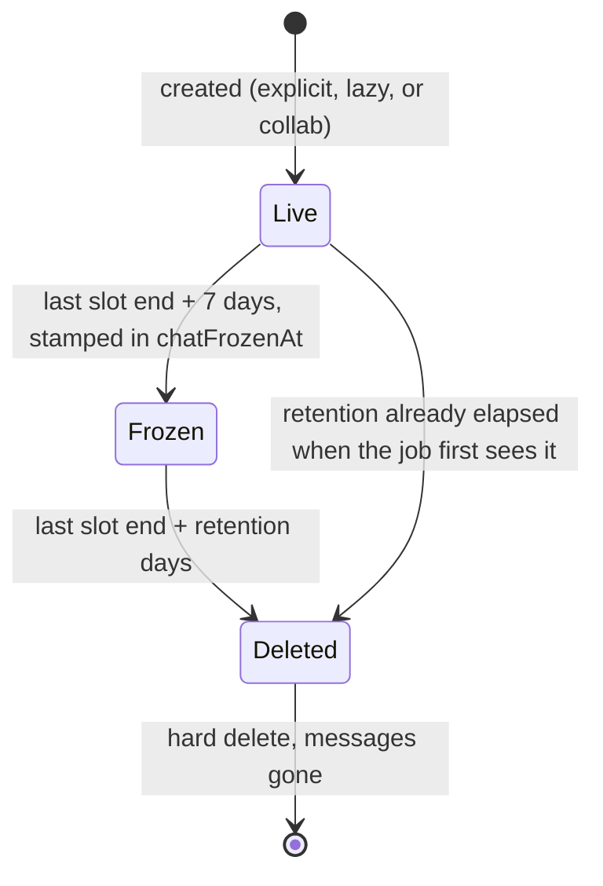

# 17. Channel Lifecycle

> How chat channels come into existence, how duplicate-create races resolve,
> how they age out (freeze, then delete), and the contract that keeps the
> dashboard sync from resurrecting the dead.

## Table of Contents

- [Two stores, two responsibilities](#two-stores-two-responsibilities)
- [Channel ID taxonomy & 4-Part DM / Trial policy](#channel-id-taxonomy--4-part-dm--trial-policy)
- [Contextual booking receipt cards](#contextual-booking-receipt-cards)
- [How a channel comes into existence](#how-a-channel-comes-into-existence)
- [The duplicate-create race](#the-duplicate-create-race)
- [Aging: freeze, then delete](#aging-freeze-then-delete)
- [The sync expected-set contract](#the-sync-expected-set-contract)
- [Stream's per-request & rate-limit ceilings](#streams-per-request--rate-limit-ceilings)
- [Security surface rules](#security-surface-rules)
- [Testing map](#testing-map)
- [Deprecated & Superseded Approaches](#deprecated--superseded-approaches)

---

## Two stores, two responsibilities

Stream Chat is the system of record for message content and channel state:
messages, read state, and membership live only on Stream, and a deleted channel
is unrecoverable. Postgres is the system of record for entitlements and
scheduling truth: who booked what, when the last slot ends, and which
organization's retention dial applies. Neither store can answer the other's
questions — a Postgres appointment proves the _right_ to be in a channel, not
that the channel exists, and a Stream channel proves nothing about why it was
created. Every mechanism in this document exists to manage the boundary between
the two: creation copies entitlements forward into Stream, expiry retires
channels once their entitlements are historic, and the sync repairs drift in
one direction only — Postgres decides, Stream obeys.

## Channel ID taxonomy & 4-Part DM / Trial policy

Every channel ID is derived deterministically from domain entities (`lib/stream-channel-ids.ts`, `lib/stream-utils.ts`) using UTF-16 code-unit ordering (`a < b ? [a, b] : [b, a]`, never `localeCompare`) and capped at Stream's 64-character ceiling. `MANAGED_CHANNEL_PREFIXES` defines the prefixes reconciled by `syncUserEventChannels` (`webinar-`, `class-`, `dm-`, `dmo-`, `dmh-`, and legacy `consultation-`/`subscription-`); `collab-` and support channels are never swept by user sync.

Channel provisioning and eligibility follow a strict **4-Part DM & Trial Policy** (`lib/stream/dm-eligibility.ts`, `lib/stream/dm-eligibility-statuses.ts`):

1. **One human pair = one DM channel (`dm-` / `dmo-`)**:
   - Personal B2C conversations between a consultant and consultee use `dm-${userIdA}-${userIdB}` (or `dmh-${sha256}` when $> 64$ chars) with no `organization_id` field.
   - Enterprise B2B conversations scoped to an organization use `dmo-${sha256(orgId).slice(0, 12)}-${sha256(`${orgId}:${a}:${b}`).slice(0, 36)}` and stamp `organization_id: orgId` on the channel's custom data.
   - Consultee-to-consultee peer DMs are never permitted (`canDirectMessage` requires a consultant ↔ consultee link).
2. **Paid/confirmed gate (`DM_ELIGIBLE_STATUSES`)**:
   - `DM_ELIGIBLE_STATUSES = ["APPROVED", "SCHEDULED", "COMPLETED"]`.
   - `APPROVED_PENDING_PAYMENT` and `PENDING` are excluded — no DM channel can be created, searched, or opened until payment succeeds or an appointment is approved without pending payment.
3. **Webinars & Classes provision both the group event channel and a 1:1 personal DM**:
   - Confirmed enrollment (`OPENABLE_EVENT_STATUSES = ["SCHEDULED", "IN_PROGRESS", "COMPLETED"]`) provisions both the shared `team` channel (`webinar-${id}` / `class-${id}`) **and** a 1:1 DM (`dm-` / `dmo-`) between the hosting consultant and each confirmed enrollee (`hasWebinarLink`, `hasClassLink`).
   - `ACCEPTED` `PlanCollaborator` co-hosts (`consultantProfile.deletedAt: null`) are included in the group channel roster (`lib/stream/event-channel-service.ts`) and in `syncUserEventChannels`'s expected-set so co-hosts are never evicted during reconciliation.
4. **Free Trials (`TRIAL`) block all chat surfaces**:
   - `TrialSession` bookings have all Stream Chat channels, 1:1 DMs, and in-call meeting chat blocked (`skipped: "trial_chat_blocked"` in `lib/payments/webhooks/handlers.ts` and `enableChat={false}` in `MeetingRoom.tsx`).

## Contextual booking receipt cards

Because all consultations, subscriptions, webinars, and classes between a given `(consultant, consultee, orgScope)` pair share one canonical 1:1 DM thread, `POST /api/stream/channels/open` accepts an optional `contextAppointmentId` to anchor conversation context when a user clicks **"Message"** from an appointment card (`chatAffordancesForVm`):

- The route verifies that `contextAppointmentId` is non-deleted, in an eligible status, and links `(userId, counterpartyUserId)` (either directly on a consultation/subscription or as host + live participant on a webinar/class).
- It then sends an idempotent message into the shared DM with deterministic ID (`id: booking-ctx-${appointmentId}-${eventType}` / `buildBookingContextMessageId(channelId, appointmentId)`) and custom `booking_context` fields (`booking_appointment_id`, `booking_type`, `booking_title`, `booking_starts_at`).
- Re-opening the same appointment's chat hits Stream's duplicate-message-ID check and is ignored cleanly without posting duplicate receipt cards.

## How a channel comes into existence

There are three server-side creation paths:

1. **Explicit creators** — `actions/stream/chat/channel.action.ts`
   (`createChannel` plus `createWebinarChannel`, `createClassChannel`,
   `createDirectMessageChannel`). Called from `POST /api/stream/channels/open`,
   authenticated API routes under `app/api/`, and `lib/payments/webhooks/handlers.ts`
   at booking confirmation and payment settlement.
2. **Lazy create-on-miss** — `lib/stream/event-channel-service.ts`
   (`addUserToEventChannel`, wrapped for browser callers by
   `actions/stream/chat/event-channel.action.ts`). Attempts `addMembers` first;
   when the channel does not exist, builds the full roster from Postgres
   (host + `ACCEPTED` collaborators + live `AppointmentParticipant` rows),
   filters out unconsented users (`droppedIds` from `upsertUsersToStream`), and
   creates atomically with `createMemberChunk` + `addRemainingMembers`.
3. **Collaborator reconcile** — `createCollaboratorChannel` in
   `channel.action.ts`. Idempotent create (`collab-{webinar|class}-{planId}`)
   with 100-member chunking (`createMemberChunk` + `addRemainingMembers`) plus
   a full member diff against the `ACCEPTED` collaborator list.

Creation is server-side by necessity, not preference: the Node SDK holds the
API secret, and every create call must carry `created_by_id` set to a real
member (the consultant host, or the DM initiator) — Stream rejects server-side
creates without it, and a synthetic "system" creator would break the
channel-scoped `channel_moderator` grant via `assignRoles`.

## The duplicate-create race

Lazy creation can encounter a concurrent-create race: two users join an event
at the same instant, both `addMembers` calls miss because the channel does not
exist yet, and both proceed to `create()`. One wins; the loser's `create()`
rejects with Stream's duplicate-create error.

The contract is: **lose the race, adopt the winner's channel.** The
predicate is `isChannelAlreadyExistsError` in `lib/stream-utils.ts`, which
matches three shapes — `error.code === 17`, HTTP status 409, and a
message-text `/already exists/i` fallback.

What adoption guarantees:

- The channel exists and was built from the same deterministic ID and roster
  inputs, so the loser continues down the normal post-create path:
  `addRemainingMembers`, the channel-scoped `channel_moderator` grant via
  `assignRoles`, and the `markChannelExists` cache stamp.
- The caller resolves successfully with the channel ID it asked for. On the
  explicit path (`createChannel`) the raw create response is dropped
  (`channelData: null`) — callers consume the ID and members, never the payload.

What adoption does **not** guarantee is the joining user's membership if the
winner's roster snapshot predated them. Therefore, the lazy paths
(`addUserToEventChannel`, `addUserToDmChannel`) retry `addMembers([userId])`
once after adopting. That retry is best-effort: if it fails, `adoptRetryFailed`
keeps the membership cache unwritten so the next sync or open call retries.

## Aging: freeze, then delete

Group event channels age through three states so dormant cohorts do not
accumulate writable channels indefinitely:

The thresholds are defined in `lib/stream/channel-lifecycle.ts` —
`FREEZE_AFTER_DAYS = 7`, `DEFAULT_RETENTION_DAYS = 90`, `DAY_MS`, and
`isPastRetention()` — and shared between the expiry job and the dashboard sync
so the two never drift apart.

The daily job `jobs/stream/expire-event-channels.ts` (scheduled in
`.github/workflows/expire-event-channels.yml`) applies two stages:

- **Freeze (+7d after the last slot ends).** `updatePartial({ set: { frozen:
true } })`: history stays readable, nobody can post. After a successful
  Stream call, the job stamps `Webinar.chatFrozenAt` / `Class.chatFrozenAt`.
  Stamping after the Stream write ensures a missed stamp costs at most one
  redundant freeze on the next run rather than leaving a channel unfrozen.
- **Delete (at the org's retention window).**
  `deleteChannels(cids, { hard_delete: true })`, capped at 100 CIDs per
  request and paced with a `10_000ms` delay between 100-CID chunks to stay well
  under Stream's `60/min` `DeleteChannels` rate limit. The retention window uses
  `resolveEventRetentionDays` (`organization.chatRetentionDays ?? organization.streamRecordingRetentionDays ?? 90`).

A webinar or class may span multiple appointments across cohorts but owns
**one** event channel, so its age is computed from the **latest** slot `endsAt`
across all non-deleted occurrences.

## The sync expected-set contract

`syncUserEventChannels` in `actions/stream/chat/event-channel.action.ts` is the
reconciliation loop: Postgres defines which channels the user _should_ belong to,
and the sync revokes any managed Stream channel membership absent from that set.
It builds the expected-set from:

1. **Webinars (`getWebinarIdsForUser`)**: Active webinars (`OPENABLE_EVENT_STATUSES`) not past retention where the user is the host (`webinarPlan.consultantProfile.userId`), an `ACCEPTED` `PlanCollaborator`, or a live `AppointmentParticipant`.
2. **Classes (`getClassIdsForUser`)**: Active classes (`OPENABLE_EVENT_STATUSES`) not past retention where the user is the host (`classPlan.consultantProfile.userId`), an `ACCEPTED` `PlanCollaborator`, or a live `AppointmentParticipant`.
3. **Direct Messages (`getDmPairsForUser`)**: Canonical `dm-` / `dmo-` channel IDs for every consultant ↔ consultee pair linked by a consultation or subscription in `DM_ELIGIBLE_STATUSES` (`APPROVED`, `SCHEDULED`, `COMPLETED`) or a webinar/class in `OPENABLE_EVENT_STATUSES` (`SCHEDULED`, `IN_PROGRESS`, `COMPLETED`).

Excluding events where `isPastRetention` is true prevents resurrection: Postgres
rows outlive their Stream channels, so if a finished event remained in the
expected-set after `expire-event-channels.ts` hard-deleted its channel, a lazy
open or sync would re-create the deleted channel with `chatFrozenAt` already
stamped in Postgres, leaving it permanently unfrozen. **An event past retention
must appear in neither the cron's freeze queue nor the sync's expected-set.**

## Stream's per-request & rate-limit ceilings

`lib/stream/batch.ts` and our background jobs enforce three hard Stream ceilings:

1. **`queryChannels` returns at most 30 channels per call (`QUERY_CHANNELS_PAGE_LIMIT = 30`).**
   Asking for `limit: 100` still returns 30 rows. `queryChannelsPaged` pages at
   the real 30-row cap, advances `offset` by the number of rows returned, sorts
   by `created_at` ascending (a stable sort order, unlike `last_message_at`
   which shifts during multi-page walks), and stops at Stream's maximum `offset`
   of 1000 (`truncated: true`).
2. **`channel.create()` and `upsertUsers()` accept at most 100 members per request.**
   Both `createChannel` and `addUserToEventChannel` pass the first 100 members
   via `createMemberChunk(syncedMembers)` (keeping the host and joining user at
   the front of the array) and backfill the remainder in 100-member batches via
   `addRemainingMembers`.
3. **Batch deletion rate limits (`DeleteChannels: 60/min`, `DeleteUser: 60/min`).**
   `jobs/stream/expire-event-channels.ts` and `scripts/stream/stream-sync.ts`
   enforce a `10_000ms` pause between 100-item chunks so batch sweeps never trip
   Stream's 60 requests/minute ceiling.

## Security surface rules

- **`actions/stream/chat/channel.action.ts` and `lib/stream/event-channel-service.ts` must NEVER carry `"use server"`.**
  Stream's server-side SDK bypasses all permission checks when given the API
  secret. Keeping internal channel-creation and service primitives out of
  `"use server"` modules prevents browsers from invoking them as unauthenticated
  RPC endpoints.
- **`actions/stream/chat/event-channel.action.ts` is a thin `"use server"` boundary.**
  Its exports (`syncUserEventChannels`, `addUserToEventChannel`,
  `removeUserFromEventChannel`, `checkEventChannelExists`) verify a fresh
  database session (`getSession()`), reject banned users, and enforce
  self/host/privileged authorization before delegating to
  `lib/stream/event-channel-service.ts`.
- **`actions/stream/chat/user.action.ts` enforces actor checks and PII stripping.**
  Browser-initiated calls require an authenticated session (`requireAuthenticatedStreamActor`),
  filter out users without `STREAM_DATA_PROCESSING` consent (`droppedIds`), and
  strip `email` fields (`stripStreamUserEmails`) from returned Stream user objects.

## Testing map

| Suite                                            | Pins                                                                                                                                                                                                                                                                                               |
| ------------------------------------------------ | -------------------------------------------------------------------------------------------------------------------------------------------------------------------------------------------------------------------------------------------------------------------------------------------------- |
| `__tests__/stream/channel-actions.test.ts`       | Explicit-path adoption: losing `create()` still returns the id, `channelData` is null, `assignRoles` and `markChannelExists` still run; non-duplicate failures rethrow; 100-member `createMemberChunk` + `addRemainingMembers` on event and collaborator channels; `droppedIds` consent filtering. |
| `__tests__/stream/event-channel-actions.test.ts` | Lazy-path adoption plus one-shot post-adoption `addMembers` retry; session gate (another user as non-privileged → Forbidden, banned user → account suspended); `ACCEPTED` collaborator retention in `syncUserEventChannels`; 30-row `queryChannelsPaged` paging and `created_at` sort.             |
| `__tests__/stream/batch.test.ts`                 | `queryChannelsPaged` 30-row cap, offset advancement, and `truncated` flag at offset 1000; `createMemberChunk` / `addRemainingMembers` chunking.                                                                                                                                                    |
| `__tests__/fixtures/stream-mocks.ts`             | Shared mocks including `assignRoles` for channel-scoped moderator grants.                                                                                                                                                                                                                          |

---

## Deprecated & Superseded Approaches

- **Per-Booking `consultation-*` and `subscription-*` Channels**: Retired in favor of one canonical 1:1 DM channel per `(consultant, consultee, orgScope)` pair (`dm-<a>-<b>` / `dmo-<orgHash>-<pairHash>`), with per-booking context injected via idempotent `booking-ctx-` receipt cards on `POST /api/stream/channels/open`. Legacy `consultation-` and `subscription-` prefixes remain in `MANAGED_CHANNEL_PREFIXES` solely so `syncUserEventChannels` can clean up historic memberships.
- **Trial Session (`TRIAL`) Chat Channels & DMs**: Retired (`skipped: "trial_chat_blocked"`). Free trials no longer provision or unlock 1:1 DMs or in-call chat.
- **Unpaid (`APPROVED_PENDING_PAYMENT`) DM Provisioning**: Removed from `DM_ELIGIBLE_STATUSES` so chat opens strictly after payment confirmation (`APPROVED`, `SCHEDULED`, `COMPLETED`).
- **Unpaginated `queryChannels({ limit: 100 })` Sweeps**: Replaced by `queryChannelsPaged` (`lib/stream/batch.ts`) paging at Stream's 30-channel hard limit sorted by `created_at` ascending.
- **Monolithic `"use server"` Channel Modules**: `lib/stream/event-channel-service.ts` was extracted from `actions/stream/chat/event-channel.action.ts` so server-side callers (`POST /api/stream/channels/open`, webhooks, cron jobs) can invoke event-channel primitives without going through browser-facing `"use server"` wrappers.

---

**See also:** [06. Channel Management](./06-channel-management.md) for the
membership policy and sync signature; [09. Background Sync](./09-background-sync.md)
for scheduled sweeps; [troubleshooting.md](./troubleshooting.md) for
operational diagnostics.
