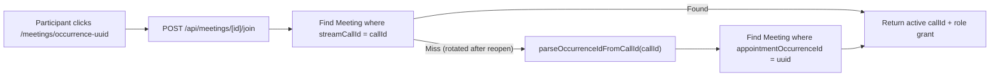
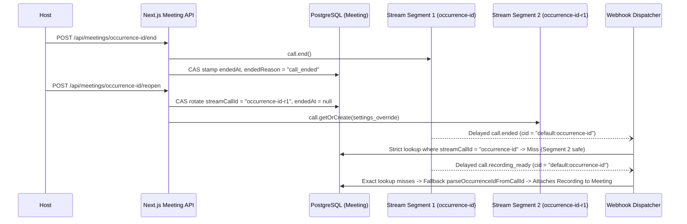

# 18. Architecture Decision Records (ADRs)

> Authoritative architecture decision records governing Stream Video call lifecycle isolation, call-ID rotation, synchronous CAS state convergence, dual-synced extensions, and meeting exit controls.

## Table of Contents

- [Overview & Decision Matrix](#overview--decision-matrix)
- [ADR-01: Strict Per-Occurrence Stream Call Isolation (`1 Occurrence = 1 Active Call ID`) vs Permanent Link Reuse](#adr-01-strict-per-occurrence-stream-call-isolation-1-occurrence--1-active-call-id-vs-permanent-link-reuse)
- [ADR-02: Call-ID Rotation (`occurrence-<id>-r<base36>`) + Asymmetric Webhook Lookup for Reopened Rooms](#adr-02-call-id-rotation-occurrence-id-rbase36--asymmetric-webhook-lookup-for-reopened-rooms)
- [ADR-03: Synchronous CAS Termination Stamp (`recordMeetingEndedSynchronously`) + Monotonic Webhook Convergence (`supersedesRecordedEnd`)](#adr-03-synchronous-cas-termination-stamp-recordmeetingendedsynchronously--monotonic-webhook-convergence-supersedesrecordedend)
- [ADR-04: Dual-Synced Extension State (Postgres `AppointmentOccurrence.endsAt` + Stream `custom.sessionEndsAt`)](#adr-04-dual-synced-extension-state-postgres-appointmentoccurrenceendsat--stream-customsessionendsat)
- [ADR-05: Single Exit Control (`CallExitButton`) over Dual Hangup Buttons](#adr-05-single-exit-control-callexitbutton-over-dual-hangup-buttons)
- [Deprecated & Superseded Approaches](#deprecated--superseded-approaches)

---

## Overview & Decision Matrix

Stream Video SFU and PostgreSQL (`PG_POOL_MAX=1`) enforce distinct operational constraints across real-time media sessions and durable relational billing records:

| ADR        | Core Architectural Decision                                             | Primary Enforcing Modules                                                                                   | Invariant Protected                                                                                            |
| ---------- | ----------------------------------------------------------------------- | ----------------------------------------------------------------------------------------------------------- | -------------------------------------------------------------------------------------------------------------- |
| **ADR-01** | `1 AppointmentOccurrence = 1 active Stream Call ID`                     | `actions/stream/meetings/meeting.action.ts`, `lib/stream/call-cid.ts`, `lib/meetings/access.ts`             | Prevents cross-session attendance contamination, recording mix-ups, and stale room admission across series     |
| **ADR-02** | Rotate `streamCallId` (`occurrence-<id>-r<base36>`) + asymmetric lookup | `app/api/meetings/[meetingId]/{end,reopen}/route.ts`, `lib/stream/{session-handlers,recording-handlers}.ts` | Bypasses Stream's permanent `ended_at` seal without losing prior recording egress or dying from late webhooks  |
| **ADR-03** | Synchronous CAS end stamp + monotonic `supersedesRecordedEnd`           | `app/api/meetings/[meetingId]/end/route.ts`, `lib/stream/session-handlers.ts`                               | Eliminates webhook lag on dashboard cards while preventing out-of-order webhooks from rewinding terminal state |
| **ADR-04** | Dual-synced `+15m` extension (`endsAt` + `custom.sessionEndsAt`)        | `app/api/meetings/[meetingId]/extend/route.ts`, `app/meetings/[id]/components/OverrunBanner.tsx`            | Keeps Stream SFU hard cutoff, client countdown banners, and Postgres schedule conflict horizon identical       |
| **ADR-05** | Unified `<CallExitButton />` (participant leave vs host 2-way popover)  | `app/meetings/[id]/components/EndCallButton.tsx`, `app/meetings/[id]/components/MeetingRoom.tsx`            | Prevents accidental room termination when a host leaves early while keeping room closure one deliberate choice |

---

## ADR-01: Strict Per-Occurrence Stream Call Isolation (`1 Occurrence = 1 Active Call ID`) vs Permanent Link Reuse

### Context & Problem Statement

Multi-occurrence appointments (`SUBSCRIPTION` weekly calls and multi-session `CLASS` cohorts) span weeks or months under a single parent `Appointment`. Reusing a permanent Stream call identifier per `Appointment` or per human pair creates four severe distributed systems failure modes:

1. **Cross-Occurrence Attendance Contamination**: `MeetingPresence` and `MeetingAttendance` (`firstJoinedAt`, `lastLeftAt`, `joinCount`) key settlement (`HELD`, `CUT_SHORT`, `NO_SHOW_*`) and payout release (`release-earnings.ts`) per occurrence. Sharing one Stream call across occurrences conflates late departures from session $N$ with early arrivals for session $N+1$.
2. **Recording Ownership & Retention Ambiguity**: Each `Recording` row inherits per-occurrence titles, participant consent decisions (`MeetingRecordingConsent`), and retention expiries.
3. **Permanent `call.end()` Seal**: Once Stream stamps `ended_at` on a call object, subsequent `call.join()` calls from non-admin roles fail at the SFU boundary. If week 1 calls `call.end()`, week 2 cannot reuse the same `cid`.
4. **Duration Cap Drift**: Each occurrence computes its own `max_duration_seconds = clamp(bookedDuration + 45m, 45m, 12h)` (`resolveMaxCallDurationSeconds`) and independent `+15m` host extension budget.

### Decision

Enforce strict **1-to-1 isolation between an `AppointmentOccurrence` row and one active `Meeting` row (`Meeting.appointmentOccurrenceId @unique`)**:

- **Canonical Call Identifier**: Initial provisioning (`provisionAppointmentMeeting` in `actions/stream/meetings/meeting.action.ts`) mints `streamCallId = "occurrence-<occurrenceUuid>"` on the hardened `default` call type (`STREAM_CALL_TYPE = "default"`).
- **Bare Call ID Storage**: `Meeting.streamCallId` always stores the bare identifier (`occurrence-<uuid>` or rotated `occurrence-<uuid>-r<base36>`), never prefixed with `default:`. `toCallId(cidOrId)` and `toCallCid(callId)` in `lib/stream/call-cid.ts` normalize identifiers idempotently at every API and webhook boundary.
- **Transparent Stale-Link Alias Resolution**: When a participant clicks an email calendar invite or browser bookmark containing an older call alias for the same occurrence (e.g., `occurrence-<uuid>` after the host reopened the room as `occurrence-<uuid>-r<base36>`), `loadMeeting(callId)` in `lib/meetings/access.ts` executes a two-step lookup:
  1. Primary exact match: `prisma.meeting.findUnique({ where: { streamCallId: callId } })`.
  2. Canonical occurrence fallback: extracts `<uuid>` via `parseOccurrenceIdFromCallId(callId)` (`/^occurrence-([0-9a-f-]{36})(?:-r[a-z0-9]+)?$/i`) and queries `prisma.meeting.findUnique({ where: { appointmentOccurrenceId: occurrenceId } })`, transparently returning the current active `meeting.streamCallId` in `POST /api/meetings/[meetingId]/join`.



### Consequences

- Every occurrence has deterministic lifecycle boundaries, isolated `MeetingAttendance` / `MeetingPresence` ledger rows, isolated Q&A namespaces (`stage-qa:<callId>:<questionId>`), and isolated recording pipelines.
- Bookmarks and transactional booking emails (`occurrence-<uuid>`) remain permanently valid even if a room is rotated one or more times before or during the session.

---

## ADR-02: Call-ID Rotation (`occurrence-<id>-r<base36>`) + Asymmetric Webhook Lookup for Reopened Rooms

### Context & Problem Statement

In Stream Video's control plane, invoking `call.end()` irreversibly stamps `call.ended_at` on that Stream call document (`default:occurrence-<uuid>`). Stream does not provide an un-end RPC to reopen a terminated call segment, and emitting `call.end()` triggers asynchronous background workers on Stream's infrastructure:

1. **Recording Egress Transcoding**: If recording was active in segment 1 (`occurrence-<uuid>`), Stream's transcoding cluster emits `call.recording_stopped` and `call.recording_ready` (or `call.recording_failed`) **seconds to minutes after** `call.end()` returns.
2. **Delayed Termination Webhooks**: `call.ended` and `call.session_ended` webhooks for segment 1 (`occurrence-<uuid>`) can arrive **after** a host has already clicked **Reopen Session Room** (`POST /api/meetings/[meetingId]/reopen`) and entered segment 2 (`occurrence-<uuid>-r<base36>`).

If reopening simply overwrote `Meeting.streamCallId = "occurrence-<uuid>-r<base36>"` and all webhook handlers used the same lookup query, one of two catastrophic bugs would occur:

- If all webhooks only queried `where: { streamCallId }`, `call.recording_ready` and late `call.session_participant_left` events from segment 1 would fail with `Meeting not found`, silently dropping paid recordings and participant attendance intervals.
- Conversely, if all webhooks fell back to `appointmentOccurrenceId`, a delayed `call.ended` or `call.session_ended` webhook from segment 1 would match segment 2's active `Meeting` row and prematurely stamp `endedAt` on the live reopened room!

### Decision

Combine **atomic call-ID rotation (`occurrence-<uuid>-r<base36>`)** with **strictly asymmetric webhook resolution** based on event domain semantics:

1. **Rotation Formula & CAS Transition**:
   - On pre-start early end (`endedAt < startsAt` -> `"ended_early"`) or explicit host reopen (`POST /api/meetings/[meetingId]/reopen` within `[startsAt - 15m, effectiveEndsAt + 30m]`), the server mints:
     ```text
     nextCallId = `occurrence-${occurrenceId}-r${Date.now().toString(36)}`
     ```
   - Updates `Meeting` atomically via compare-and-set (`updateMany` predicated on expected prior state), clearing `endedAt = null`, `endedReason = null`, and `isRecording = false`, and immediately provisions the fresh Stream call on `default` with `settings_override` and host/participant member grants.
2. **Asymmetric Webhook Lookup Matrix**:

| Webhook Event Family                                               | Lookup Strategy                                                                               | Architectural Rationale                                                                                                               |
| ------------------------------------------------------------------ | --------------------------------------------------------------------------------------------- | ------------------------------------------------------------------------------------------------------------------------------------- |
| `call.ended`, `call.session_ended`                                 | **Strict exact match only**: `where: { streamCallId }`                                        | Termination belongs strictly to one Stream call segment. A delayed end webhook from segment 1 must **never** kill reopened segment 2. |
| `call.recording_ready`, `call.recording_failed`                    | **Exact match + occurrence fallback**: `where: { streamCallId }` -> `appointmentOccurrenceId` | Transcoding finishes asynchronously after segment 1 closes; every segment's MP4 belongs to the occurrence's `Meeting` row.            |
| `call.session_participant_joined`, `call.session_participant_left` | **Exact match + occurrence fallback**: `where: { streamCallId }` -> `appointmentOccurrenceId` | Participant stay durations (`userSessionId` intervals) from segment 1 must be preserved for accurate `deliveredMinutes` settlement.   |



### Consequences

- Hosts can safely run a pre-session camera/audio device test (`endedAt < startsAt`) and click **End session for everyone**, or recover from an accidental live hangup via **Reopen Session Room**, with zero risk of late webhooks killing the new room or dropping prior segment recordings.

---

## ADR-03: Synchronous CAS Termination Stamp (`recordMeetingEndedSynchronously`) + Monotonic Webhook Convergence (`supersedesRecordedEnd`)

### Context & Problem Statement

Relying solely on Stream's `call.ended` webhook to stamp `Meeting.endedAt` introduces a 1–10 second asynchronous propagation window (or longer during webhook retries). When a host ends a session and immediately navigates back to `/dashboard/...`, the dashboard server component queries Postgres before the webhook lands, rendering the ended room as still live (`Join Now`). Conversely, writing `Meeting.endedAt` naively from both the HTTP route and the webhook handler risks race conditions, lost `endedReason` classifications, and backward timestamp rewinds when out-of-order webhooks arrive.

### Decision

Implement **Synchronous CAS Dual-Write + Monotonic Webhook Convergence** in `lib/stream/session-handlers.ts`:

1. **Synchronous Route Execution (`POST /api/meetings/[meetingId]/end`)**:
   - Invokes `getStreamVideoClient().video.call("default", resolvedCallId).end()` inside `withStreamCircuitBreaker` (outside any DB transaction per `PG_POOL_MAX=1`).
   - Immediately executes `recordMeetingEndedSynchronously(resolvedCallId, now)`:
     - Evaluates pre-start vs live termination:
       - If `endedAt < startsAt` (**Pre-Start Device Check**): stamps `endedReason = "ended_early"` and immediately rotates `streamCallId = occurrence-<id>-r<base36>` while keeping the occurrence upcoming (`SCHEDULED`) so real session entry opens a clean room.
       - If `endedAt >= startsAt` (**Live Session Termination**): stamps `endedReason = "call_ended"`, closes all open `MeetingPresence` intervals (`leftAt = endedAt`) and `MeetingAttendance` (`lastLeftAt = endedAt`) inside a single CAS transaction predicated on `where: { id: meeting.id, endedAt: meeting.endedAt }`.
     - If the synchronous DB update throws an unexpected exception, the route reports to Sentry and returns **HTTP `500`** (`"Could not end this meeting. Please try again."`) rather than returning a false HTTP `200`.
2. **Monotonic Webhook Convergence (`supersedesRecordedEnd`)**:
   - Both `recordMeetingEndedSynchronously` and async webhook handlers (`handleCallEnded`, `handleSessionEnded`) enforce:
     ```typescript
     function supersedesRecordedEnd(
       recorded: Date | null,
       incoming: Date,
     ): boolean {
       return !recorded || incoming.getTime() > recorded.getTime();
     }
     ```
   - `handleSessionEnded` additionally refuses to overwrite `isDeliberateEnd(meeting)` (`"call_ended"` or `"maintenance"`), ensuring a subsequent SFU inactivity timeout event can never downgrade a host's deliberate room closure into a reopenable timeout.

### Consequences

- Dashboard cards transition from `Join Now` to `Ended` on the exact first frame after a host leaves the room.
- Duplicate or out-of-order `call.ended` / `call.session_ended` webhooks converge deterministically without overwriting terminal state.

---

## ADR-04: Dual-Synced Extension State (Postgres `AppointmentOccurrence.endsAt` + Stream `custom.sessionEndsAt`)

### Context & Problem Statement

Every call starts with an SFU duration cap of `max_duration_seconds = clamp(bookedDuration + 15m early + 30m grace, 45m, 12h)` (`lib/meetings/duration-cap.ts`). When a session approaches scheduled `endsAt`, hosts may grant one free `+15m` (`900s`) extension via `<OverrunBanner />` (`POST /api/meetings/[meetingId]/extend`).

If extension state is stored only on Stream (`call.settings.limits.max_duration_seconds` + `call.custom.extendedSeconds`), Postgres schedule queries (`hasExtensionScheduleConflict`, `resolveMeetingAccess`, `reconcile-orphaned-sessions`) remain blind to the extended end time. Conversely, if `POST /api/meetings/[meetingId]/extend` updates Stream (`call.update(...)`) on attempt 1, succeeds at Stream, and hits a transient database failure before updating `AppointmentOccurrence.endsAt`, a retry on attempt 2 would see `extensionsUsed >= 1` on Stream and abort with HTTP `409` without ever persisting the extended `endsAt` to Postgres! Furthermore, if client UI (`resolveCapEndsAtMs` in `OverrunBanner.tsx`) adds `+30m` grace on top of an already-extended `endsAt` **and** adds `extendedSeconds` a second time, the countdown timer displays `+30m` phantom overrun time beyond the SFU hard wall.

### Decision

Enforce **Dual-Synced Idempotent Extension Persistence** across Stream and PostgreSQL with single-source cap arithmetic:

1. **Schedule Conflict Check Across Host, Co-Hosts & Active Seat Holders**:
   - Before extending, `hasExtensionScheduleConflict` checks `[slotStartsAt, max(slotEndsAt, now) + 15m]` across the host profile, all hosted/co-hosted plans (`buildOccupiedAppointmentFilter`, `buildCohostCommitmentFilter`), all `ACCEPTED` presenter collaborators (`assertConsultantAvailableForWindows`), and all active participants (`HELD`, `CONFIRMED`, `ATTENDED`).
2. **Stream Update + Idempotent Postgres CAS Recovery**:
   - Calls `call.update({ settings_override, custom: { ...existingCustom, extendedSeconds, extensionsUsed, sessionEndsAt } })`.
   - Always executes idempotent CAS persistence on `AppointmentOccurrence.endsAt` (`where: { id: occurrence.id, endsAt: slotEndsAt }`, advancing to `extendedEndsAt = slotEndsAt + 15m`) **before** returning `409 alreadyExtended` if `occurrence.endsAt` has not yet advanced to `custom.sessionEndsAt`. Thus, retrying after a partial failure cleanly heals Postgres `endsAt`.
3. **Zero Double-Counting Cap Math (`resolveCapEndsAtMs`)**:
   - When `endsAt` in Postgres/props already reflects the `+15m` extension (`endsAt == sessionEndsAt`), `resolveCapEndsAtMs` derives the SFU hard cutoff from the authoritative Stream `session.timer_ends_at` or `baseEndsAt + CALL_DURATION_GRACE_MS + extendedSeconds * 1000` without adding `extendedSeconds` on top of an already-extended `endsAt`.

### Consequences

- Partial network failures between Stream and Postgres self-heal idempotently on retry.
- In-room `<OverrunBanner />` phases (`hidden` -> `ending-soon` at `T-5m` -> `overrun-grace` at `T+0` -> `cap-imminent` at `Cap-2m`) match Stream's SFU cutoff to the second.

---

## ADR-05: Single Exit Control (`CallExitButton`) over Dual Hangup Buttons

### Context & Problem Statement

Rendering two adjacent red hangup buttons in the bottom control bar (one to leave the room locally and a second to terminate the call for all participants) caused high rates of accidental room closures when hosts intended to step out briefly or refresh audio/video devices, disconnecting paying learners mid-session and sealing the Stream `cid`.

### Decision

Standardize all meeting rooms on a single primary red exit control (`CallExitButton` in `app/meetings/[id]/components/EndCallButton.tsx`):

- **Participants (`!isHost`)**: Clicking the red exit button immediately executes `onLeaveForSelf()` (`leaveCallAndReleaseMedia(call)` -> navigate to role dashboard), leaving the room open for all other attendees.
- **Hosts & Co-Presenters (`isHost`)**: Clicking the red trigger opens an explicit two-choice popover menu (`End or leave session?`):
  1. **Leave call** (`outline` action): Disconnects only the host's local media session (`Keep session open for others · Rejoin anytime`), allowing the room to stay active for remaining attendees or co-presenters.
  2. **End session for everyone** (`destructive` red action): Invokes `POST /api/meetings/[meetingId]/end` (`AbortSignal.timeout(10_000)`), closing the Stream call for all participants, stopping active recordings, stamping `Meeting.endedAt` synchronously, and tearing down local hardware tracks.
  3. **Early-End Caution Guard (`EARLY_END_WARNING_THRESHOLD_MS = 10m`)**: Whenever more than 10 minutes remain before `info.endsAt`, the popover displays a high-visibility amber warning banner (`"{N} min remaining in this booked slot. Ending for everyone disconnects all participants."`) directly above the buttons.

### Consequences

- Eliminates accidental host session terminations while keeping deliberate room closure two clicks away.
- Combined with `ADR-02` (`Reopen Session Room`), even an intentional premature room closure can be recovered cleanly within `endsAt + 30m`.

---

## Deprecated & Superseded Approaches

- **Permanent Per-Appointment / Per-Consultant Stream Call IDs**: Superseded by strict `1 AppointmentOccurrence = 1 active Stream Call ID` isolation (`occurrence-<uuid>`) so recurring `SUBSCRIPTION` and `CLASS` sessions never bleed attendance, duration caps, or recording state across occurrences.
- **Uniform `where: { streamCallId }` Webhook Lookup Across All Events**: Superseded by asymmetric webhook lookup (`ADR-02`) so recordings and presence from pre-reopen segments attach via `parseOccurrenceIdFromCallId`, while late `call.ended` / `call.session_ended` webhooks strictly check `where: { streamCallId }`.
- **Fire-and-Forget End Endpoint Swallowing DB Errors as HTTP 200**: Superseded by `recordMeetingEndedSynchronously` CAS dual-write that rotates pre-start `"ended_early"` rooms and returns HTTP `500` on database failure.
- **Dual Red Hangup Buttons in `MeetingRoom.tsx`**: Superseded by the single Zoom/Meet-style `<CallExitButton />` with role-aware direct leave vs host two-action popover and `< 10m` remaining caution banner.
