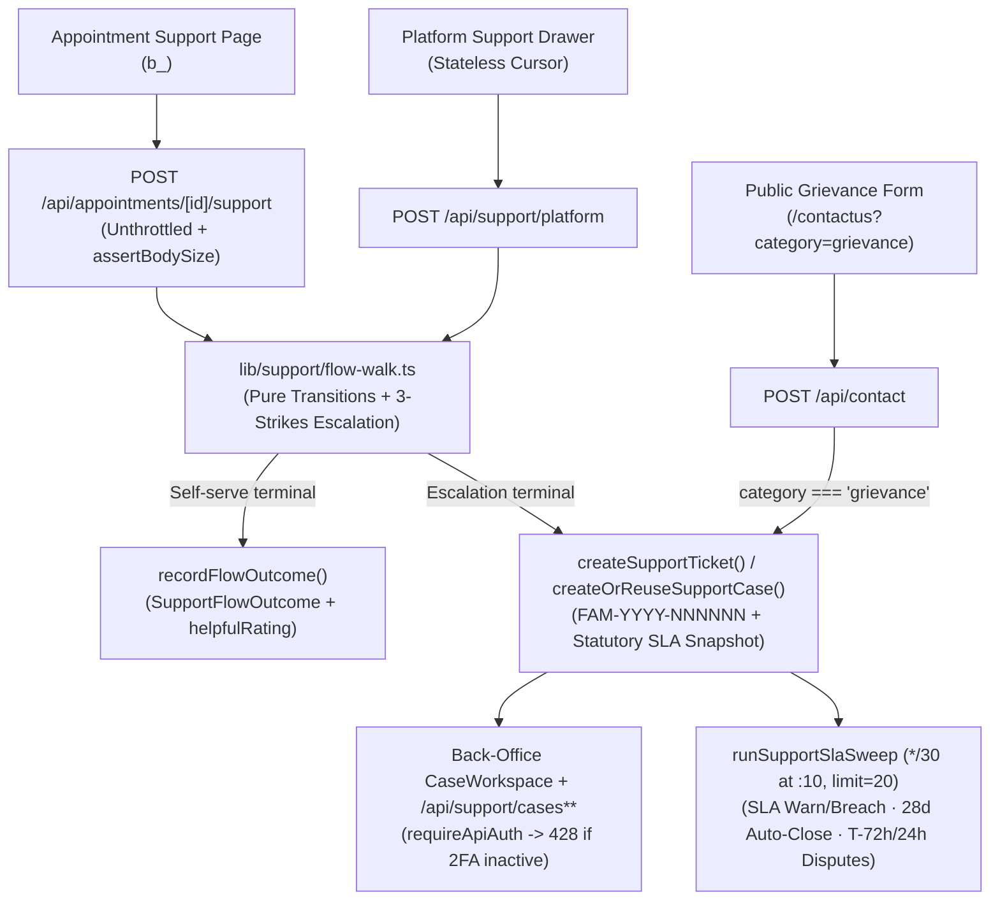
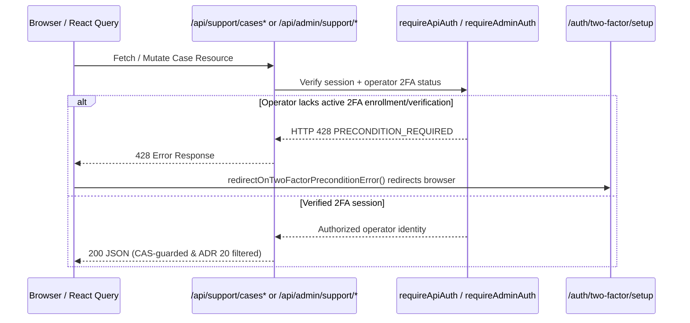

# Architecture: two scopes, one engine

Support operates across two intake scopes over one pure flowchart engine, backed by a unified relational case model (`SupportCase`), speakable IST-year ticket references (`FAM-YYYY-NNNNNN`), mandatory operator two-factor authentication, and a 30-minute background SLA sweep. The per-appointment scope persists a conversation thread per `(appointmentId, userId)`; the platform scope executes statelessly until escalation. Both evaluate identical graph transitions in `lib/support/flow-walk.ts` and enforce one error envelope and one authorization model across every API surface.

## System overview



## Module layout

```text
lib/support/
├── flow-walk.ts          # Pure graph walk + 3-strikes unrecognized turn auto-escalation
├── flows.ts              # 10 appointment flowcharts (code-defined, PR-reviewed)
├── platform-flows.ts     # 5 stateless platform flows + reason -> issueType taxonomy
├── priority.ts           # Canonical escalation reason -> priority policy map
├── create-ticket.ts      # Shared ticket factory, session-scope guard, dedup helpers & notifications
├── case-service.ts       # Unified SupportCase lifecycle, PROBLEM->INCIDENT cascade, ADR 20 redaction & compliance
├── case-workspace.ts     # Back-office workspace assembler, timeline merge & system-escalated promise extraction
├── saved-replies.ts      # Typed operator saved-reply and resolve macro registry by CaseTopic
├── escalation.ts         # Word-bounded triggers + single-line ' | '-delimited escalationBrief / extractBotPromises
├── sla.ts                # Statutory ceilings (24h ack / 15d dispose), priority tightening & pause math
├── sla-sweep.ts          # 30-min cron sweep (:10 offset, limit=20): warn/breach, 28d auto-close, dispute alerts
├── reference.ts          # Atomic IST-year FAM-YYYY-NNNNNN allocator (allocateTicketReference)
├── deflection.ts         # Terminal flow outcomes, helpfulRating & rolling health metrics
├── context.ts            # Stage (UPCOMING / LIVE / COMPLETED), live AppointmentOccurrence bounds, isOrgOperator
├── service.ts            # runSupportTurn: reason/priority/org attribution, lastMessageAt, ORG_PARTY_CATEGORIES
└── resolvers/            # Flowchart turn resolver over appointment and platform definitions

lib/api/
├── support-http.ts       # Standardized { error, code, detail? } envelope, Sentry filter & parseRouteParams
└── appointment-access.ts # Unified appointment authorization gate (opt-in orgParty isolation)

providers/
└── ReactQueryProvider.tsx # Global 428 PRECONDITION_REQUIRED interceptor -> /auth/two-factor/setup
```

## Intake scopes

### Per-appointment scope (persisted conversations)

`AppointmentSupportThread` maintains one conversation per `(appointmentId, userId)`. Intents are stage-gated against the live `AppointmentOccurrence` window derived in `lib/support/context.ts`: cancellation and rescheduling surface while upcoming; no-show (both attendee and consultant variants), session quality, and recording access unlock after completion. Escalation terminals carry machine-readable `reason` codes (`provider_no_show`, `double_charge`, `repeated_unrecognized`) mapped to SLA priorities via `lib/support/priority.ts`.

- **API route:** `app/api/appointments/[appointmentId]/support/route.ts` (`GET` thread + gated intents, `POST` turn).
- **Full-page workspace:** `app/support/_components/SupportRequestCasePage.tsx` (`b_<appointmentId>`) mounted across consultee, consultant, organization, and workspace trees via `SupportRequestView.tsx` and `SessionConversation.tsx`.
- **Appointment card:** `components/support/AppointmentSupportStatusCard.tsx`.

> [!IMPORTANT]
> **Three-Strikes Auto-Escalation & Unthrottled Booking Turns (`S-ADR-05`)**:
>
> 1. After **3 consecutive unrecognized user inputs** without advancing `currentNodeId`, `walkFlow` (`lib/support/flow-walk.ts`) automatically escalates (`escalate: true`, `reason: "repeated_unrecognized"`).
> 2. Booking-bot turns (`POST /api/appointments/[appointmentId]/support`) consume **zero rate-limit quota**, guarded solely by `assertBodySize(req)` and `authorizeAppointment` so multi-step guided walks never fail with HTTP `429`.

### Platform scope (stateless cursor replay)

Account, billing, technical, and organization operator billing issues run statelessly in `app/api/support/platform/route.ts` (`components/support/PlatformSupportSheet.tsx`). The client holds and replays the node cursor on each turn; the server re-validates every step against `lib/support/platform-flows.ts`. Self-serve terminals write only a `SupportFlowOutcome` telemetry row; escalation terminals reuse any open ticket filed within the preceding 30 minutes (`findRecentOpenEscalation`) or mint a new ticket with an atomic `FAM-` reference. Explicit `orgId` claims are permitted only on `ORG_OPERATOR_BILLING` for active org operators (`403` otherwise, never silently downgraded to B2C).

### Public grievance & statutory transparency surfaces

Unauthenticated visitors and signed-in users alike can access statutory redressal and review moderation disclosures directly:

- **Grievance Redressal (`/grievance`, `app/(pages)/grievance/page.tsx`):** Publishes Designated Grievance Officer contact details bound to live MX mailboxes via `resolveLiveMailbox()` (`support@practitionist.com`, jurisdiction `Haryana, India`), statutory acknowledgement (`within 24 hours`) and disposal (`within 15 days`) commitments, and direct links to `/contactus?category=grievance`. Submitting `POST /api/contact` with `category === "grievance"` atomically mints a `HIGH`-priority `GRIEVANCE` `SupportTicket` with an allocated `FAM-YYYY-NNNNNN` reference (`S-ADR-12`).
- **Reviews & Moderation Policy (`/reviews-policy`, `app/(pages)/reviews-policy/page.tsx`):** Documents verified booking eligibility, BIS IS 19000:2022 equal treatment and author withdrawal rules, separate `ONE_TO_ONE` and `GROUP` score aggregation, human moderation grounds, DSA Art. 16(5)/17(3) Statement of Reasons notices (never exposing internal moderator notes), and `RPT-XXXXXXXX` takedown appeals (`S-ADR-11`).

## Hub surfaces & access matrix

| Surface                             | Owning file(s)                                                                                                       | Authorization & visibility boundary                                                                                                                         |
| ----------------------------------- | -------------------------------------------------------------------------------------------------------------------- | ----------------------------------------------------------------------------------------------------------------------------------------------------------- |
| Customer & consultant Support hub   | `components/dashboard/shared/support/SupportHub.tsx`, `SupportRequestView.tsx`, `SessionConversation.tsx`            | Session picker, active/resolved case buckets opening `b_<appointmentId>` case pages, and stateless platform subtab                                          |
| Back-office Support inbox           | `components/dashboard/backoffice/support/CaseWorkspace.tsx`, `useCaseMutations.tsx`                                  | `tickets.manage` + mandatory operator 2FA (`requireApiAuth` -> `428`): unified deadline-sorted queue over escalated cases and pre-escalation threads        |
| Admin health & compliance panel     | `components/dashboard/backoffice/support/SupportHealthAndComplianceOverview.tsx`                                     | `requireAdminAuth` + 2FA: rolling 30d deflection & 7d recontact metrics (`/api/admin/support/health`) and CSV monthly IT Rules compliance report            |
| Org triage — member threads         | `app/dashboard/organization/[orgId]/support/OrgSupportTriage.tsx` + `GET /api/organizations/[orgId]/support-threads` | `operations.read`: metadata-only list with zero transcript bodies ([ADR 20](../enterprise/70-design-decisions/20-org-visibility-into-member-sessions.md))   |
| Org triage — consultant quality     | `OrgSupportTriage.tsx` + `GET /api/organizations/[orgId]/feedback-summary`                                           | `quality.read`: cohort-floored (`>=5` scores, `>=10` comments) per-consultant aggregates ([02-org-quality-signal.md](../feedback/02-org-quality-signal.md)) |
| Private session rating row          | `components/reviews/SessionRatingRow.tsx`                                                                            | Participant rater writes own score/note; rated party reads score only ([feedback architecture](../feedback/01-architecture.md))                             |
| Public consultant review composer   | `components/reviews/ProfileReviewComposer.tsx`                                                                       | Attended non-org-hosted booking required; separate `ONE_TO_ONE` and `GROUP` tracks ([reviews architecture](../reviews/01-architecture.md))                  |
| Public Grievance & Reviews policies | `app/(pages)/grievance/page.tsx`, `app/(pages)/reviews-policy/page.tsx`, `app/api/contact/route.ts`                  | Public statutory disclosures; `POST /api/contact` (`category: "grievance"`) mints tracked `FAM-` tickets                                                    |

## Authorization gates & mandatory operator 2FA



1. **Appointment participation gate (`authorizeAppointment(appointmentId, orgParty?)` in `lib/api/appointment-access.ts`):**
   - Evaluates failures in deterministic order: `401 UNAUTHORIZED` -> `404 NOT_FOUND` -> `403 FORBIDDEN`.
   - Direct participants and verified staff receive `{ organizationId, detail }` in a single query.
   - Passing `orgParty: true` allows an organization operator (`operations.read`) to file a separate org-owned thread restricted to `ORG_PARTY_CATEGORIES` (`ORG_ADMIN_DISPUTE`, `SPONSORSHIP_BILLING`) without exposing `detail` or the member's transcript (`ADR 20`).
2. **Mandatory operator 2FA (`S-ADR-10`):**
   - Every `/api/support/cases*` and `/api/admin/support/*` handler calls `requireApiAuth` or `requireAdminAuth`, returning HTTP `428 PRECONDITION_REQUIRED` whenever a `STAFF` or `ADMIN` operator has not enrolled and verified TOTP 2FA.
   - `makeQueryClient()` in `providers/ReactQueryProvider.tsx` wires `redirectOnTwoFactorPreconditionError` onto both `QueryCache.onError` and `MutationCache.onError`, immediately navigating unverified operators to `/auth/two-factor/setup` (`components/auth/TwoFactorSettings.tsx`).
   - Seeded operators in non-production environments pre-enroll deterministic TOTP secrets and 10 backup codes encrypted with `BETTER_AUTH_SECRET` (`prisma/seedFiles/seed-two-factor.ts`).

## Error contract, concurrency & handoff integrity

- **Standardized error envelope (`lib/api/support-http.ts`):** All support endpoints return `{ error, code, detail? }`. Client errors below `500` include structured `detail`; `5xx` details report strictly to Sentry. Expected noise (`401` and `429`) is never captured to Sentry; cron and sweep jobs accumulate per-row errors and report at most once per run (`sentry.shared.config.ts`). Route parameters use length-bounded strings (`min(1).max(64)` in `schemas/support.ts`), never `.uuid()`, so human-readable demo slugs validate uniformly.
- **Optimistic concurrency & reply collision guards (`S-ADR-07`):** Staff metadata mutations (`PATCH /api/support/cases/[caseId]`) enforce CAS on `expectedUpdatedAt` (`409 CONFLICT`), and public agent replies (`POST /api/support/cases/[caseId]/messages`) require `expectedLastMessageAt` (`409 NEW_CUSTOMER_MESSAGE` if a customer message arrived mid-draft).
- **Sanitized single-line bot promises (`S-ADR-06`):** `escalationBrief` (`lib/support/escalation.ts`) collapses newlines in every field and joins promises on one line (`Bot told the customer: <p1> | <p2>`). `readTicketWorkspace` invokes `extractBotPromises` strictly when `isSystemEscalatedTicket` holds so customer-typed text cannot inject fake operator promises.
- **Notifications (`ADR 23`):** Every support alert carries explicit `NotificationScope` and leads its title with the `FAM-` reference when allocated. Customer replies page the assigned operator (falling back to the staff roster when unassigned) via `notifyStaffOfTicketActivity`.

## Background sweep (`runSupportSlaSweep`)

Breach state is computed purely on read via `slaStateOf(clock, now)`. Proactive warnings, breach alerts, 28-day stale auto-closure, and actionable payment dispute reminders (`T-72h` / `T-24h`) execute every **30 minutes at offset `:10`** via `runSupportSlaSweep` (`lib/support/sla-sweep.ts`, `limit=20`, locked by `withCronLock("support-sla-sweep")`). See [03-ticket-references-and-sla.md](03-ticket-references-and-sla.md) and [09-support-case-and-sla-sweep.md](09-support-case-and-sla-sweep.md) for full clock math and sidecar constraints.

## Deliberately out of scope

Generative AI resolution bots, database-stored flow editors, inbound email ticket parsing, organization admins receiving notifications on member personal complaints, per-organization Novu inboxes, and mirroring support conversations into Stream Chat (support transcripts live strictly in PostgreSQL).

## Related

- [02-the-grid.md](02-the-grid.md) — ownership, actor permissions, booking shapes, and session vs booking anchoring.
- [03-ticket-references-and-sla.md](03-ticket-references-and-sla.md) — IST-year `FAM-` references, tighten-only deadlines, pause accounting, and sweep arms.
- [06-invariants-and-testing.md](06-invariants-and-testing.md) — sixteen non-negotiable runtime invariants and QA suite guide.
- [07-ticket-lifecycle-and-concurrency.md](07-ticket-lifecycle-and-concurrency.md) — statuses, reopen transitions, and CAS guards.
- [08-intake-callbacks-attachments-and-limits.md](08-intake-callbacks-attachments-and-limits.md) — callback validation, attachments, engineering escalations, and rate limiters.
- [09-support-case-and-sla-sweep.md](09-support-case-and-sla-sweep.md) — unified `SupportCase` schema, `PROBLEM`/`INCIDENT` cascade, CSAT, and statutory monthly reports.

## Deprecated & Superseded Approaches

- **Per-appointment slide-over drawer (`SupportThreadSheet.tsx`):**
  Replaced by full-page `SupportRequestCasePage.tsx` (`b_<appointmentId>`) across consultee, consultant, and organization workspaces so transcripts, file attachments, and SLA badges never clip inside a narrow drawer.
- **Separate back-office Tickets and Conversations queues:**
  Replaced by unified `CaseWorkspace.tsx` (`tickets.manage`) sorting unacknowledged and near-breach cases ahead of routine conversational activity.
- **Passive read-only SLA monitoring without background escalation:**
  `slaStateOf` remains pure and derived on read, while `runSupportSlaSweep` (`*/30` at `:10`, `limit=20`) drives proactive warn/breach paging, 28d auto-close, and dispute alerts.
- **Unbounded reprompting & rate-limited appointment bot turns:**
  Superseded by three-strikes `repeated_unrecognized` auto-escalation in `walkFlow` and zero-quota turns guarded by `assertBodySize(req)` and `authorizeAppointment`.
- **Multi-line unsanitized bot promise extraction:**
  Superseded by newline-stripped single-line `|`-delimited fields in `escalationBrief` parsed strictly on `isSystemEscalatedTicket` rows.
- **Unverified operator API access & placeholder grievance domains:**
  Superseded by mandatory `requireApiAuth` (`428` -> `/auth/two-factor/setup`), automatic public `FAM-` `GRIEVANCE` ticket creation on `POST /api/contact`, and `resolveLiveMailbox()` (`support@practitionist.com`, jurisdiction `Haryana, India`).
- **3-layer standalone cron scripts & legacy `SupportTicket` / `ON_HOLD` status:**
  Standalone wrapper scripts under `scripts/**` and `jobs/**` are retired in favor of single-function cron sweeps registered in `lib/cron/cleanup-registry.ts`, `ON_HOLD` is rejected in favor of `awaitingUserSince` / internal notes, and all new schema features land exclusively on `SupportCase*`.
- **Unredacted cross-party member case reads:**
  Superseded by `readSupportCaseForViewer` serving summary metadata (`filedByOrganizationNotice: true`, `messages: []`) to members on org-submitted cases.
