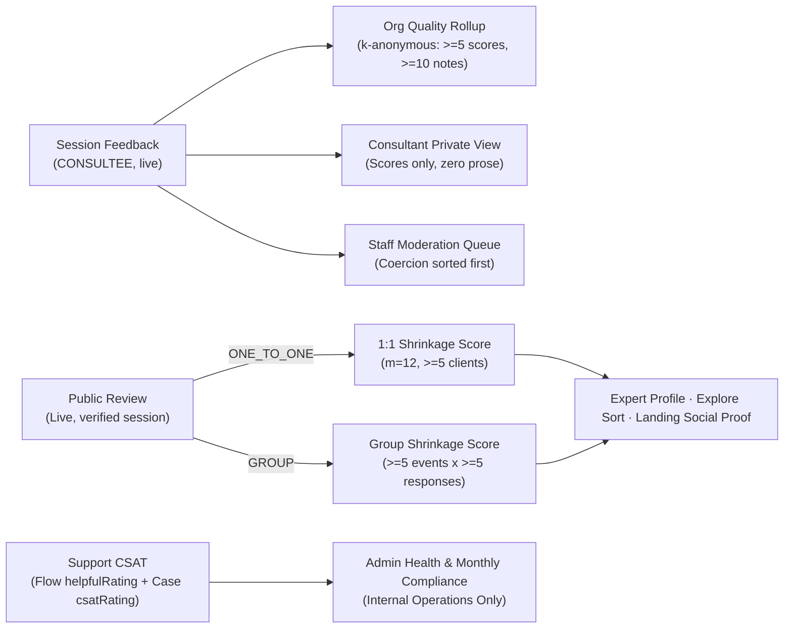

# The grid: what each record is about, who may see it, and when it exists

Support, feedback, and reviews all hang off bookings and answer three distinct questions, so they anchor to three distinct domain entities. Every ownership rule factors cleanly into **three questions**, from which nearly every actor × entity × shape cell is derived automatically:

1. **Anchor — what is this record _about_?** Anchor to the narrowest entity whose identity the user names when describing it: _"The call on the 14th was terrible"_ is about a session (`AppointmentOccurrence`); _"This expert is excellent"_ is about a relationship (`ConsultantReview`); _"I was charged twice for my package"_ is about a booking (`Appointment`); _"I cannot log in"_ is about an account (`User`).
2. **Visibility — who may write and read it?** Two rules, not ad-hoc exceptions:
   - _Participation_: only a party to the anchored entity may author a record about it.
   - _[ADR 20](../enterprise/70-design-decisions/20-org-visibility-into-member-sessions.md)_: an organisation sees session metadata and floored aggregates, never member session content or cross-party transcripts.
3. **Applicability — does it exist for this booking shape?** A session rating or review exists if there is an identifiable counterparty and at least one session occurred.

## Vocabulary

- **Appointment:** the purchase container — one consultation, a multi-session subscription (up to 24 meetings), a trial, a webinar with hundreds of attendees, or a multi-session class enrollment.
- **Session (`AppointmentOccurrence`):** one scheduled meeting instance that took place. Every `Meeting` and session-scoped `AppointmentFeedback` or occurrence-scoped `SupportCase` anchors directly to its `AppointmentOccurrence` row (`startsAt` / `endsAt`).
- **Relationship:** one consultee and one consultant across every booking shared between them.
- **Track:** the delivery format purchased — `ONE_TO_ONE` (consultations, subscriptions, trials) or `GROUP` (webinars, classes).

## A · Object -> anchor

| Object                                                | Anchored to                                                                                                | Key columns & constraints                                                                                                                         | Written by                                                                     | Read by                                                                                                             |
| ----------------------------------------------------- | ---------------------------------------------------------------------------------------------------------- | ------------------------------------------------------------------------------------------------------------------------------------------------- | ------------------------------------------------------------------------------ | ------------------------------------------------------------------------------------------------------------------- |
| `AppointmentFeedback` — private per-call rating       | **Session** (`appointmentOccurrenceId`) or whole **appointment** (`appointmentOccurrenceId IS NULL`)       | `appointmentId`, `organizationId`, `raterRole`, `ratingCause`; unique `(appointmentId, appointmentOccurrenceId, userId)` `NULLS NOT DISTINCT`     | Any participant once the session ends                                          | Rater (score + note), rated party (**score only**), organisation (aggregate above cohort floor), staff read-only    |
| `ConsultantReview` — public consultant review         | **Relationship** (`@@unique([consultantProfileId, consulteeProfileId])`) plus experience `track`           | `appointmentId` provenance, `ratingUnitId` (`webinar:<id>` / `class:<id>`), consultant reply columns, revision audit trail                        | Consultee after at least one attended non-org-hosted session                   | Public (`isAnonymous` stripped everywhere); owner can edit/withdraw idempotently (`200`)                            |
| `SupportCase` — unified support graph                 | **Session** (`appointmentOccurrenceId`), **Booking** (`appointmentId`), or **Account** (`requesterUserId`) | `referenceNumber` (`FAM-`), `caseKind` (`INCIDENT` \| `PROBLEM`), `problemCaseId`, `SupportCaseSubject`, `SupportCaseMessage`, `SupportCaseEvent` | Submitter (customer, org `OWNER`/`MAINTAINER`, or operator); SLA sweep closes  | Submitter, requester (**redacted summary only** if cross-party filed by org per ADR 20), verified 2FA staff in full |
| `AppointmentSupportThread` — pre-cutover conversation | **Appointment** (`@@unique([appointmentId, userId])`)                                                      | `category`, `activeChannel`, `supportTicketId` link                                                                                               | Participant or org operator (`ORG_PARTY_CATEGORIES` only)                      | Participant, verified staff in full, organisation as metadata only                                                  |
| `SupportTicket` — pre-cutover / grievance record      | **User** (`userId`) with links to consultation, subscription, payment, or public grievance                 | `referenceNumber` (`FAM-`), SLA clocks (`ackDueAt`, `resolutionDueAt`, `awaitingUserSince`, `pausedSeconds`), `priority`, `assignedToId`          | Flow escalation, ticket form, or public `POST /api/contact?category=grievance` | Submitter, verified staff in full                                                                                   |
| `SupportFlowOutcome` — deflection counter             | **Flow execution** (`userId` + optional `organizationId`)                                                  | Terminal node ID, escalation `reason`, binary/star `helpfulRating`                                                                                | Server on every terminal flowchart turn                                        | Admin operators in rolling aggregate (`/api/admin/support/health`)                                                  |
| `Feedback` — product feedback                         | **User** (`userId`)                                                                                        | Unaggregated score, free-text category, operator triage status                                                                                    | Any authenticated user                                                         | Author, staff                                                                                                       |
| `DpdpGrievance` — statutory privacy pipeline          | **Data principal**                                                                                         | Dedicated DPDP Act / IT Rules data protection pipeline                                                                                            | Data principal                                                                 | Designated Grievance Officer (strictly separate from consumer support tickets)                                      |

The governing design invariant is compact: **a rating is about a conversation, a review is about a person, a case is about a problem, and product feedback is about us.**

## B · Actor × operation

| Actor                                          | Private rating                                             | Public review                                                                                         | Support                                                                                   | Product feedback      |
| ---------------------------------------------- | ---------------------------------------------------------- | ----------------------------------------------------------------------------------------------------- | ----------------------------------------------------------------------------------------- | --------------------- |
| Consultee (participant)                        | Write own · read own score and note                        | Write one per consultant · edit any time · idempotent `DELETE` withdrawal (`200`) and revival         | Open, reply, read own cases/threads; summary-only if cross-party org-filed (`ADR 20`)     | Write, read own       |
| Consultant (rated party)                       | Read attendee **scores only**, never prose notes           | **Reply once** publicly · never edit or delete customer review                                        | Open, reply, read own cases/threads                                                       | Write, read own       |
| Org LEARNER / EXPERT without `operations.read` | As participant only                                        | As consultee only (B2C / org-sponsored bookings only)                                                 | As participant only                                                                       | As authenticated user |
| Org OWNER / MAINTAINER / MANAGER / SUPPORT     | **Floored aggregate only** (`>=5` scores, `>=10` comments) | Public view only, never attributable to named org members                                             | Metadata-only list of member threads · **full access** to org-submitted cross-party cases | —                     |
| Org BILLING_ADMIN                              | — (finance-only by design)                                 | Public view only                                                                                      | Billing-subject cases only                                                                | —                     |
| Platform STAFF (2FA required)                  | Read-only                                                  | Read · moderate · takedown with DSA Statement of Reasons (`RPT-XXXXXXXX`) · remove reply              | Full access across cases, messages, and SLA clocks                                        | Triage status         |
| Platform ADMIN (2FA required)                  | Read-only                                                  | Staff capabilities + attributed soft-delete + compliance reports                                      | Full access + health/compliance reports (`/api/admin/support/{health,compliance-report}`) | Triage status         |
| Anonymous public                               | —                                                          | Read verified non-anonymous/anonymized reviews + file `/contactus?category=grievance` (`FAM-` ticket) | File statutory public grievance (`POST /api/contact`)                                     | —                     |

Three critical boundaries prevent cross-contaminating trust signals:

- **Read access is never write access:** Operators read private feedback for moderation/support context but `appointmentRaterRole` forbids anyone outside the session's participants from submitting a score.
- **An organisation is a party, not a spectator (`S-ADR-08`):** Org operators file their own cross-party cases (`requesterUserId !== submitterUserId`, restricted to org intents) without gaining transcript access to a member's personal conversation, and members reading an org-filed case see only summary notice metadata (`filedByOrganizationNotice: true`).
- **Refund negotiation and public review state are strictly isolated:** Support agents cannot inspect whether a requester holds an unpublished draft review, preventing review-for-refund coercion (`S-ADR-11`).

## C · Support intent -> subject scope

Five appointment intents target one specific session (`AppointmentOccurrence`), five target the commercial booking container (`Appointment`), and five stateless platform flows target the user or organization account:

| Scope       | Categories                                                                                                               |
| ----------- | ------------------------------------------------------------------------------------------------------------------------ |
| **Session** | `NO_SHOW`, `RESCHEDULE`, `RECORDING_ACCESS`, `TECHNICAL`, `QUALITY_COMPLAINT`                                            |
| **Booking** | `CANCEL_REFUND`, `PAYMENT_STATUS`, `DOCUMENTS`, `SPONSORSHIP_BILLING`, `ORG_ADMIN_DISPUTE`                               |
| **Account** | Stateless platform flows — `PAYMENTS_BILLING`, `ACCOUNT_ACCESS`, `PLATFORM_TECHNICAL`, `ORG_OPERATOR_BILLING`, `GENERAL` |

## D · Booking shape -> what applies

| Shape                                     | Private rating           | Public review                                                  | Operational rules                                                                           |
| ----------------------------------------- | ------------------------ | -------------------------------------------------------------- | ------------------------------------------------------------------------------------------- |
| Consultation (1:1)                        | Per session              | Feeds **1:1 score** (`ONE_TO_ONE`)                             | Standard single-occurrence booking                                                          |
| Subscription (up to 24 meetings)          | Per session              | Feeds **1:1 score**, one relationship review updated over time | Relationship anchoring prevents 24 duplicate reviews from one ongoing client                |
| Trial                                     | Per session              | Feeds **1:1 score**                                            | Attributed to trial consultant                                                              |
| Webinar (shared appointment, N attendees) | Per session per attendee | Feeds **group score** (`GROUP`), unit `webinar:<id>`           | Group score publishes once event clears response floor (`>=5` responses across `>=5` units) |
| Class (appointment per enrollment)        | Per session              | Feeds **group score** (`GROUP`), unit `class:<id>`             | Bucketed by cohort run rather than collapsing all courses by topic                          |
| Offline / in-person                       | Per session              | Feeds track matching booking shape                             | Rides `UNVERIFIED` attendance eligibility arm                                               |
| Group plan with **no named consultant**   | Private only             | **None** (explicit empty state in composer)                    | Rolls into org total quality rollup without per-expert breakdown                            |

## E · Organisation-ness -> treatment

A case belongs to an organisation strictly when the **subject entity** belongs to the organisation, never merely because the human happens to hold an active membership.

| Relationship                                                    | Schema representation                                                                    | Support                                                                     | Feedback                            | Public review                                                                  |
| --------------------------------------------------------------- | ---------------------------------------------------------------------------------------- | --------------------------------------------------------------------------- | ----------------------------------- | ------------------------------------------------------------------------------ |
| B2C personal                                                    | `organizationId = NULL`                                                                  | Customer owns transcript                                                    | Rater + score-only counterparty     | Publishes on profile                                                           |
| Org-sponsored (org funds seat, marketplace consultant delivers) | `Appointment.organizationId`, `AppointmentParticipant.organizationId`, `BillingAccount`  | Subject-attributed to org; org sees metadata only (`ADR 20`)                | Feeds floored org consultant rollup | Publishes publicly; never attributable back to named org member                |
| Org-hosted (org's own `EXPERT` member delivers)                 | `Membership.role = EXPERT` with `payoutRecipient = ORGANIZATION`                         | Subject-attributed to org; org sees metadata only                           | Feeds floored org consultant rollup | **No public review** (`orgHostedAppointmentIds` enforces non-marketplace rule) |
| Org operator concern (`OWNER` / `MAINTAINER`)                   | `submitterUserId` holds active org operator role (`requesterUserId !== submitterUserId`) | Full transcript for org submitter; redacted summary for member (`S-ADR-08`) | —                                   | —                                                                              |

## F · The grid multiplied out: feedback, reviews, and attribution flows

### F1 · Session feedback by booking shape and organisation relationship

| Booking shape                                  | Org relationship           | Rows written                                                                | Anchor columns                                                                             | Aggregated into                                                          | Org visibility                                  |
| ---------------------------------------------- | -------------------------- | --------------------------------------------------------------------------- | ------------------------------------------------------------------------------------------ | ------------------------------------------------------------------------ | ----------------------------------------------- |
| Consultation (1 session)                       | B2C personal               | Up to 1 `CONSULTEE` row + 1 optional `PROVIDER` row                         | `appointmentOccurrenceId`, `appointmentId`, `userId`, `raterRole`, `organizationId = NULL` | Consultant scores-only view; staff queue                                 | None                                            |
| Consultation (1 session)                       | Org-sponsored / Org-hosted | Same                                                                        | Plus `organizationId`                                                                      | Org per-consultant rollup (`CONSULTEE` only, `>=5` scores, `>=10` notes) | Floored aggregates only, never individual notes |
| Subscription (up to 24 sessions)               | B2C or Org                 | Up to 24 per-session rows per participant                                   | Distinct `appointmentOccurrenceId` per held call; shared `appointmentId`                   | Consultant scores-only view; org rollup when `organizationId` set        | Floored aggregates only                         |
| Trial (1 session)                              | B2C or Org-attributed      | Up to 1 row per participant                                                 | `appointmentOccurrenceId`, `appointmentId`, optional `organizationId`                      | Consultant view; org rollup when `organizationId` set                    | Floored aggregates only                         |
| Webinar (shared appointment, N seats)          | B2C or Org-sponsored       | Up to N `CONSULTEE` rows sharing `(appointmentId, appointmentOccurrenceId)` | Shared session anchor, distinct `userId`                                                   | Consultant view; org rollup                                              | Floored aggregates only                         |
| Class (per-enrollment appointment, N sessions) | B2C or Org                 | Up to N rows per enrollee                                                   | Enrollee `appointmentId` + per-session `appointmentOccurrenceId`                           | Consultant view; org rollup                                              | Floored aggregates only                         |
| Whole-appointment purchase rating              | Any                        | Up to 1 extra row per participant (`appointmentOccurrenceId IS NULL`)       | Guarded by `appointment_feedback_level_key` (`NULLS NOT DISTINCT`)                         | Consultant scores-only view; staff queue                                 | Matches booking org relationship                |

Every `AppointmentFeedback` row obeys four invariants: `appointment_feedback_level_key` enforces one rating per participant per session plus at most one whole-appointment rating; `PROVIDER` ratings are excluded from all aggregates; `deletedAt` and `excludedFromAggregateAt` omit rows from aggregates without hard-deleting rows; and `updatedAt` advances only when the score or comment text actually mutates.

### F2 · Public review by booking shape and organisation relationship

| Booking shape                       | Org relationship      | Rows written                                            | Anchor & track                                 | Published score fed                                                                           | Org visibility                         |
| ----------------------------------- | --------------------- | ------------------------------------------------------- | ---------------------------------------------- | --------------------------------------------------------------------------------------------- | -------------------------------------- |
| Consultation / Subscription / Trial | B2C or Org-sponsored  | **One per `(consultantProfileId, consulteeProfileId)`** | `track = ONE_TO_ONE`, `ratingUnitId = NULL`    | Shrinkage **1:1 score** (`m = 12`, publishes at `>= 5` distinct clients)                      | Public view, never member-attributable |
| Any shape                           | Org-hosted (`EXPERT`) | **Zero** (blocked by `orgHostedAppointmentIds`)         | —                                              | None (internal org coaching is not a public marketplace transaction)                          | —                                      |
| Webinar                             | B2C or Org-sponsored  | One per attendee-consultant pair                        | `track = GROUP`, `ratingUnitId = webinar:<id>` | Shrinkage **group score** (event clears at `>= 5` responses; score publishes at `>= 5` units) | Public view, never member-attributable |
| Class                               | B2C or Org-sponsored  | One per enrollee-consultant pair                        | `track = GROUP`, `ratingUnitId = class:<id>`   | Shrinkage **group score**                                                                     | Public view, never member-attributable |
| Group plan without consultant       | Any                   | **Zero** (explicit empty state in composer)             | —                                              | None                                                                                          | —                                      |

### F3 · End-to-end attribution paths

## Session-level support anchoring (`SupportCase` & `lib/support/case-service.ts`)

Because five of the ten appointment intents (`NO_SHOW`, `RESCHEDULE`, `RECORDING_ACCESS`, `TECHNICAL`, `QUALITY_COMPLAINT`) concern a specific session rather than the entire commercial package, the unified `SupportCase` schema and `lib/support/case-service.ts` anchor cases cleanly at session granularity while preserving booking- and account-level scopes:

1. **Composite open-scope deduplication (`support_case_open_scope_key`):** Partial unique constraint (`NULLS NOT DISTINCT`) on `("appointmentId", "appointmentOccurrenceId", "requesterUserId", "submitterUserId", "category") WHERE "closedAt" IS NULL AND "deletedAt" IS NULL` in `prisma/sql/check-constraints.sql` ensures a no-show in week two (`appointmentOccurrenceId = occ_2`, `category = 'NO_SHOW'`) and a billing question in week nine (`appointmentOccurrenceId = NULL`, `category = 'PAYMENT_STATUS'`) file independent cases with independent SLA clocks, while deduplicating double-submits on the same open scope (`dedupeReason: "open_scope"` or `"client_intake_id"`).
2. **Polymorphic entity graph (`SupportCaseSubject`):** `buildInitialCaseSubjects` attaches typed subject rows (`OCCURRENCE` marked `isPrimary: true` when `appointmentOccurrenceId` is present, otherwise `APPOINTMENT` as primary, alongside `PAYMENT`, `REFUND`, `INVOICE`, `ORGANIZATION`, or `ACCOUNT`) enforced by `support_case_subject_primary_key`.
3. **ITIL `PROBLEM` -> `INCIDENT` hierarchy:** Single-level `problemCaseId` (`support_case_scope_and_shape_chk`) links customer-facing `INCIDENT` cases to an underlying root-cause `PROBLEM` case; resolving the `PROBLEM` case cascades resolution across all open linked incidents via `cascadeProblemResolution`.
4. **Live occurrence context resolution (`buildSupportContext`):** Reads `startsAt` / `endsAt` directly from non-cancelled `AppointmentOccurrence` rows (`SCHEDULED`, `COMPLETED`, `UNVERIFIED`), resolving retrospective session intents against the most recently ended session and forward-looking/refund previews against the target upcoming session.
5. **Back-office workspace bridge (`readCaseWorkspace`):** While `/api/support/cases/**` handles full CRUD, SLA sweeps, CSAT, and compliance reporting over `SupportCase`, `readCaseWorkspace` in `lib/support/case-workspace.ts` returns `null` for `ref.kind === "case"` until the back-office inbox UI cutover migrates operator detail views from `ticket`/`thread` keys to `case` keys.

## Related

- [ADR 29 — Two-track reputation and the right of reply](../enterprise/70-design-decisions/29-two-track-reputation-and-the-right-of-reply.md) — public review scoring, shrinkage parameters, and non-removal guarantees.
- [ADR 20 — Organisations see session metadata, never session content](../enterprise/70-design-decisions/20-org-visibility-into-member-sessions.md) — cross-party privacy boundary enforced across org triage and case reads.
- [09-support-case-and-sla-sweep.md](09-support-case-and-sla-sweep.md) — unified `SupportCase` schema, API routes, 2FA gate, and background sweep.
- [Feedback architecture](../feedback/01-architecture.md) and [reviews architecture](../reviews/01-architecture.md).

## Deprecated & Superseded Approaches

- **30-minute storage atom slot rows:**
  Previously fragmented multi-hour calls into contiguous 30-minute storage atoms requiring run-grouping logic that flipped session stage prematurely to `COMPLETED` on partial reads. Superseded by atomic `AppointmentOccurrence` rows carrying true session `startsAt` and `endsAt` bounds read directly by `buildSupportContext`.
- **Filtering session context to `SCHEDULED` rows only:**
  Previously omitted `COMPLETED` and `UNVERIFIED` rows when resolving retrospective intents (`NO_SHOW`, `QUALITY_COMPLAINT`, `RECORDING_ACCESS`), causing `lastEndedRun` to evaluate null after call completion. Superseded by selecting all non-cancelled occurrences and resolving retrospective vs upcoming intents explicitly.
- **Single appointment-level thread uniqueness (`@@unique([appointmentId, userId])`) for multi-session issues:**
  Prevented recurring subscription attendees from isolating session-specific incidents from package billing questions. Superseded by occurrence-capable `SupportCase` (`support_case_open_scope_key` including `appointmentOccurrenceId` and `category`), polymorphic `SupportCaseSubject` rows, and ITIL `PROBLEM -> INCIDENT` cascading.
- **Automatic employer attribution on personal learner complaints:**
  Stamping a user's first `ACTIVE` organization membership onto personal account tickets misattributed personal login/billing requests to employers; superseded by strict subject-based org attribution and ADR 20 cross-party transcript redaction (`requesterUserId !== submitterUserId` -> `filedByOrganizationNotice: true`).
- **Generic `spamLimiter` on public review mutations:**
  Previously shared aggressive global spam rate limits across public review writes and profile edits, risking false-positive `429` blocks during legitimate dashboard workflows; superseded by dedicated `reviewWriteLimiter` scoping across all review write and edit handlers.
- **Non-idempotent review withdrawal (`404` on repeat `DELETE`):**
  Previously threw client errors when an author double-clicked withdraw or retried a timed-out `DELETE` request; superseded by idempotent `HTTP 200` owner withdrawal returning consistent success payloads across already-withdrawn reviews.
- **Chronological-only review moderation queue & moderator note exposure:**
  Replaced by pre-pagination prioritization of suspected coercion (`review-for-value` / `coercion`) ahead of chronological flags, paired with DSA Art. 16(5)/17(3) Statement of Reasons (`RPT-XXXXXXXX`) notices that omit internal moderator notes completely.
- **Marketplace public reviews on internal organization-hosted coaching:**
  Superseded by `orgHostedAppointmentIds` eligibility enforcement excluding `Membership.role = EXPERT` (`payoutRecipient = ORGANIZATION`) engagements from public consultant profiles while preserving private session ratings.
- **Direct workspace lookup for `kind === "case"` prior to UI inbox cutover:**
  `readCaseWorkspace` in `lib/support/case-workspace.ts` returns `null` for `case` keys while back-office detail views complete their cutover from `ticket` and `thread` keys to `SupportCase`.
