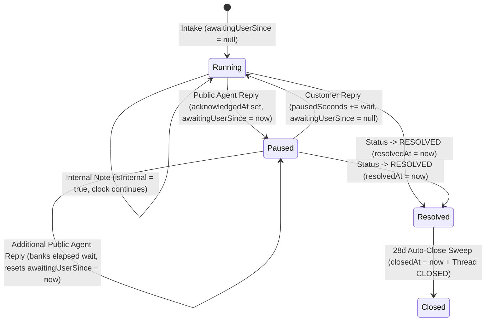

# Ticket references and the SLA model

Every escalated support request carries two operational primitives: a speakable reference number a caller can quote over the phone (`FAM-YYYY-NNNNNN`), and a pair of statutory SLA clocks sized to Indian consumer and intermediary law. Unified `SupportCase` records and legacy `SupportTicket` records share identical sequence allocation, deadline tightening, customer-wait pause arithmetic, and background cron escalation.

## Ticket references: `FAM-YYYY-NNNNNN`

Every support case or escalated ticket carries a unique handle in `referenceNumber`, formatted by `lib/support/reference.ts` as `FAM-YYYY-NNNNNN` (`FAM` prefix, four-digit **IST calendar year**, and six-digit zero-padded sequence, e.g. `FAM-2026-000123`).

### Rollover & transactional allocation (`allocateTicketReference`)

1. **Annual reset privacy boundary (German tank protection):** A single monotonic lifetime sequence reveals cumulative platform ticket volume to anyone filing two requests and subtracting handles; resetting the sequence each calendar year bounds any inference to the active year.
2. **IST year boundary (`UTC+05:30`):** `allocateTicketReference(tx, now)` shifts the timestamp by `+330` minutes (`new Date(now.getTime() + 330 * 60_000).getUTCFullYear()`) so tickets filed between `00:00 IST` (`18:30 UTC` on 31 Dec) and `00:00 UTC` on 1 January receive the new IST calendar year's series immediately.
3. **Lock-safe single-query increment:** Inside the caller's transaction `tx`, `SupportTicketCounter.upsert` (`where: { year: istYear }`, `create: { year: istYear, nextSeq: 2 }`, `update: { nextSeq: { increment: 1 } }`) executes `INSERT … ON CONFLICT DO UPDATE … RETURNING` under row-level locking without read-modify-write races and returns `formatTicketReference(istYear, counter.nextSeq - 1)`. Rolling back the enclosing transaction rolls back the sequence counter cleanly.
4. **Schema uniqueness:** `SupportCase.referenceNumber` is non-null `@unique`; legacy `SupportTicket.referenceNumber` is nullable `@unique` so pre-counter rows retain UUID fallbacks (`t.referenceNumber ?? t.id`).

## Statutory SLA model & priority tightening

Two Indian statutory regimes govern customer redressal, and `lib/support/sla.ts` enforces the stricter ceiling across both:

| Statutory regime                            | Acknowledge within | Dispose within |
| ------------------------------------------- | ------------------ | -------------- |
| Consumer Protection (E-Commerce) Rules 2020 | 48 hours           | 1 month        |
| Information Technology Rules 2021           | **24 hours**       | **15 days**    |

`lib/support/sla.ts` exports `STATUTORY_ACK_HOURS = 24` and `STATUTORY_RESOLUTION_DAYS = 15`. All priority-specific SLA targets sit strictly within these statutory caps:

| Priority | Acknowledge within | Resolve within |
| -------- | ------------------ | -------------- |
| `URGENT` | 2 hours            | 1 day          |
| `HIGH`   | 8 hours            | 3 days         |
| `MEDIUM` | 24 hours           | 7 days         |
| `LOW`    | 24 hours           | 15 days        |

### Intake snapshots & tighten-only priority raises

- **Intake deadline snapshot (`slaDeadlinesFor(priority, from)`):** Computed at intake and persisted directly to `ackDueAt` and `resolutionDueAt`. Editing internal target constants never retroactively shifts existing cases.
- **Tighten-only priority escalation (`tightenDeadlinesForPriorityRaise(existing, nextPriority, now)`):** When an operator raises priority (`URGENT > HIGH > MEDIUM > LOW`), `tightenDeadlinesForPriorityRaise` computes `slaDeadlinesFor(nextPriority, now)` relative to `now` and tightens unacknowledged `ackDueAt` (`Math.min(existing.ackDueAt, target.ackDueAt)`) and unresolved `resolutionDueAt` (`Math.min(existing.resolutionDueAt, target.resolutionDueAt)`). Re-submitting the same priority or lowering priority returns `{}` — **deadlines tighten on priority raise and never extend on priority drop**.

## Pause arithmetic & read-time state derivation

- **Public operator reply (`applyStaffReply` / `advanceAgentPublicTurnState`):** Sets `acknowledgedAt` and `firstAgentReplyAt` on the first public operator reply (first-write-wins via CAS), banks any open customer wait interval into `pausedSeconds`, and pauses the resolution clock (`awaitingUserSince = now`). Internal notes (`isInternal: true`) neither satisfy acknowledgement nor start a customer wait.
- **Customer reply (`userRepliedPatch`):** Accumulates `openWaitSeconds(clock, now)` into `pausedSeconds` (`Int` seconds rather than milliseconds, avoiding 32-bit signed integer overflow at 24.8 days) and clears `awaitingUserSince = null`. Additional consecutive customer turns while `awaitingUserSince === null` are no-ops.
- **Acknowledgement never pauses:** Until the first public operator reply, nothing is awaited from the customer.
- **Pure read-time state (`slaStateOf(clock, now)`):** Shifts `resolutionDueAt` by `pausedSecondsAt(clock, now) * 1000` (`effectiveResolutionDueAt`) and derives `{ ackBreached, resolutionBreached, paused, msToAckDue, msToResolutionDue }` deterministically on read. Composite indexes on `[acknowledgedAt, ackDueAt]` and `[resolvedAt, resolutionDueAt]` keep range scans fast without mutable breach columns.

## Background SLA, auto-close, and dispute sweep (`runSupportSlaSweep`)

`runSupportSlaSweep` (`lib/support/sla-sweep.ts`) runs every **30 minutes at offset `:10`** on `netlify/functions/cron-tick.mts` (`limit=20`), serialized via `withCronLock("support-sla-sweep", { failMode: "open" }, ...)`:

1. **Outbox pre-load & separate unpaused warn/breach candidate scans (`fetchSlaSweepCandidates`):**
   - Loads recent `NotificationOutbox` entries (`createdAt >= now - 35d`, `workflowId: NOVU_WORKFLOWS.SUPPORT_TICKET_ACTIVITY`, `entityRef: { startsWith: "sla:" }`) via `parseStagedSlaOutboxRows` into per-bucket ID exclusion sets (`ackBreachIds`, `resBreachIds`, `ackWarnIds`, `resWarnIds`, `stagedKeys`).
   - Runs **four parallel unpaused scans** (`awaitingUserSince: null`, `status: { notIn: ["RESOLVED", "CLOSED"] }`, `take: limit` per query) splitting **breach** candidates from **warning** candidates across both `SupportTicket` and `SupportCase` so near-due warning items never starve already-breached cases (or vice versa):
     - **Breach filter (`30-day` window bound):** Unacknowledged `ackDueAt` or unresolved `resolutionDueAt` within `[now - 30d, now]` (`breachCutoff = now - 30d`), bounding historical backlog scans.
     - **Warning filter:** Unacknowledged `ackDueAt` within `(now, now + 2h]` (`ACK_WARN_MS = 2h`) or unresolved `resolutionDueAt` within `(now, now + 24h]` (`RES_WARN_MS = 24h`).
2. **Idempotent transactional outbox check & HTML-escaped delivery (`processSingleSlaNotice` / `deliverSlaNoticeEmails`):**
   - Evaluates unpaused transitions via `slaStateOf(row, now)` (`sla:{id}:{ack|res}:{warn|breach}`).
   - Inside `prisma.$transaction`, checks `tx.notificationOutbox.findUnique({ where: { transactionId } })` **before** staging `NOVU_WORKFLOWS.SUPPORT_TICKET_ACTIVITY` via `stageBell`. If the outbox entry was already staged (`!newlyStaged`), outbound email calls via `deliver()` are skipped completely.
   - `deliverSlaNoticeEmails` escapes `subject`, `row.referenceNumber`, and `row.title` with `escapeHtml(...)` (`&amp;`, `&lt;`, `&gt;`, `&quot;`, `&#39;`) before rendering HTML email bodies to prevent XSS/HTML injection from user-supplied case titles.
   - Organization `escalationContactEmail` receives email notifications **strictly when `level === "breach"`**, never on `"warn"`.
3. **28-day resolved auto-close (`autoCloseResolvedRows`):**
   - Finds `RESOLVED` `SupportTicket` and non-deleted `SupportCase` rows where `resolvedAt <= now - 28d`, transitions them conditionally (`status: "RESOLVED"`) to `CLOSED` (`closedAt: now`), appends an `AUTO_CLOSED` `SupportCaseEvent`, and for tickets atomically closes linked `AppointmentSupportThread` rows (`status: "CLOSED"`, `activeChannel: "SELF_SERVE"`).
4. **Actionable payment dispute reminders (`processDisputeDeadlineAlerts`):**
   - Queries `Dispute` records in `NEEDS_RESPONSE` or `WARNING_NEEDS_RESPONSE` with `dueBy <= now + 72h`, classifies threshold window `"24"` (`<= 24h`) or `"72"`, pre-checks `tx.notificationOutbox` on `dedupeKey: dispute-due:{id}:{72|24}`, stages `NOVU_WORKFLOWS.DISPUTE_UPDATED` notifications to `ADMIN` users, and emails HTML-escaped dispute alerts (`escapeHtml(d.disputeId)`).
5. **Single per-run error budget:** Row-level exceptions across all arms collect into `errors[]` and emit at most one `reportSentryError` event per cron execution (`op: "support-sla-sweep"`).

## Queue surfaces & operator badges

- **Badges (`slaStatusBadge`):** Renders `Breached` (acknowledgement or resolution breached), `Waiting on customer` (`awaitingUserSince !== null`), `Due soon` (acknowledgement within `6h` or resolution within `12h`), or `On track`, accompanied by the tighter active countdown (`slaHint`).
- **Deadline-first default sort:** `parseInboxFilters` defaults `Needs reply` and `SLA at risk` views to `sort=sla` (unacknowledged ordered by `ackDueAt` asc, acknowledged ordered by `resolutionDueAt` asc, oldest tiebreak). `readTicketKeysBySla` merges both ordered slices cleanly up to `INBOX_MAX_DEPTH` (`1000`), excluding paused cases (`awaitingUserSince !== null`).

## Related

- [05-schema-reference.md](05-schema-reference.md) — relational schema and check constraint index.
- [07-ticket-lifecycle-and-concurrency.md](07-ticket-lifecycle-and-concurrency.md) — status transitions, reopen behavior, and CAS guards.
- [09-support-case-and-sla-sweep.md](09-support-case-and-sla-sweep.md) — unified `SupportCase` APIs, operator 2FA, CSAT, and monthly IT Rules compliance reports.
- Public policy disclosures (`app/(pages)/constants.ts`, `app/(pages)/contactus/**`, `app/(pages)/grievance/page.tsx`) bind `ACK_PROMISE_COPY` (`within 24 hours`) and disposal promises (`within 15 days`) directly to `STATUTORY_ACK_HOURS` and `STATUTORY_RESOLUTION_DAYS`.

## Deprecated & Superseded Approaches

- **Combined warn + breach single-query candidate fetch:** Fetching warning and breach candidates in one `take: limit` query allowed imminent warnings to crowd out already-breached cases; superseded by separate parallel warn and breach scans in `fetchSlaSweepCandidates`.
- **Unbounded historical breach scanning:** Scanning all open rows regardless of age re-scanned ancient backlog indefinitely; superseded by `breachCutoff = now - 30d`.
- **Dispatching sweep alert emails without an outbox existence guard:** Risked duplicate emails on retried sweeps; superseded by transactional `notificationOutbox` pre-checks gating `deliver()`.
- **Unescaped user ticket titles in HTML alert emails:** Superseded by `escapeHtml(...)` across `subject`, `referenceNumber`, `title`, and `disputeId`.
- **Emailing `escalationContactEmail` on SLA warnings:** Organization escalation contacts are alerted strictly on actual SLA breaches (`level === "breach"`), never on warning thresholds.
- **Single `ackDueAt` sort & activity-first queue defaults:** Ranked acknowledged cases by already-satisfied acknowledgement timestamps; superseded by two-query ordered merge (`readTicketKeysBySla`) and deadline-first defaults (`sort=sla`).
- **Extending deadlines on priority drop or storing boolean `isBreached` flags:** `tightenDeadlinesForPriorityRaise` never pushes deadlines outward when priority decreases, and `slaStateOf` computes state purely on read.
- **UTC year rollover & standalone dispute reminder script:** Superseded by IST (`UTC+05:30`) year rollover in `allocateTicketReference` and folding `T-72h`/`T-24h` dispute reminders into Arm 3 of `runSupportSlaSweep`.
