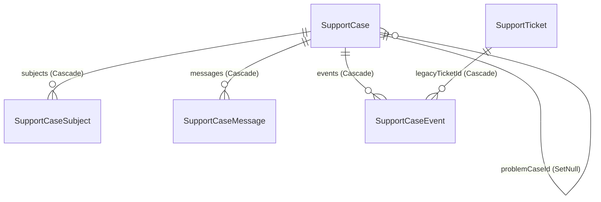

# Schema Reference: Support Tables, Enums & Sidecar Constraints

This reference documents every model, enum, foreign-key cascade policy, Prisma index, and PostgreSQL sidecar constraint powering the unified support architecture (`SupportCase` family) alongside analytics (`SupportFlowOutcome`) and pre-cutover compatibility tables in [`prisma/schema.prisma`](../../prisma/schema.prisma) and [`prisma/sql/check-constraints.sql`](../../prisma/sql/check-constraints.sql).

---

## 1. Unified Support Models (`prisma/schema.prisma`)

### `SupportCase`

Owns the support lifecycle, human/bot transcript cursor, speakable `FAM-<YYYY>-<SEQ6>` reference, statutory IT Rules 2021 SLA timestamps, callback window, parent problem linkage, and 1–5★ resolution CSAT.

| Column Group           | Columns                                                                                                                                                                                                                                                                                                                                                                       | Notes & Invariants                                                                                                              |
| ---------------------- | ----------------------------------------------------------------------------------------------------------------------------------------------------------------------------------------------------------------------------------------------------------------------------------------------------------------------------------------------------------------------------- | ------------------------------------------------------------------------------------------------------------------------------- |
| Identity & Idempotency | `id` (`uuid`), `referenceNumber` (`@unique VarChar(20)`), `clientIntakeId?` (`@unique VarChar(128)`)                                                                                                                                                                                                                                                                          | `referenceNumber` allocated atomically via `SupportTicketCounter`. `clientIntakeId` deduplicates client retries at intake.      |
| Classification & Flow  | `title`, `description` (`Text`), `category?` (`VarChar(64)`), `flowKey?` (`VarChar(64)`), `currentNodeId?` (`VarChar(64)`), `activeChannel` (`SupportChannel`, default `SELF_SERVE`), `issueType?` (`SupportIssueType`), `priority` (`SupportPriority`, default `MEDIUM`), `status` (`SupportCaseStatus`, default `OPEN`), `caseKind` (`SupportCaseKind`, default `INCIDENT`) | Enforced by `"support_case_scope_and_shape_chk"` to carry at least `category` or `flowKey`.                                     |
| Actors & Scope Links   | `requesterUserId`, `submitterUserId`, `organizationId?`, `appointmentId?`, `appointmentOccurrenceId?`, `assignedToId?`, `problemCaseId?`                                                                                                                                                                                                                                      | Separates subject user (`requesterUserId`) from filing user (`submitterUserId`) for cross-party redaction and DPDP erasure.     |
| Callback & SLA Clocks  | `callbackPhone?`, `callbackWindow?`, `ackDueAt?`, `acknowledgedAt?`, `resolutionDueAt?`, `resolvedAt?`, `closedAt?`, `deletedAt?`, `firstAgentReplyAt?`, `awaitingUserSince?`, `pausedSeconds` (`Int`, default `0`)                                                                                                                                                           | Deadlines computed once at intake (`lib/support/sla.ts`); `pausedSeconds` banks customer-wait intervals without `Int` overflow. |
| Transcript & CSAT      | `messageSeq` (`Int`, default `0`), `lastMessageAt?`, `csatRating?` (`SmallInt`), `csatAt?`, `createdAt`, `updatedAt`                                                                                                                                                                                                                                                          | `messageSeq` serializes per-case turn ordering; `csatRating` (`1..5`) set once via CAS (`csatRating: null`) within 28 days.     |

### `SupportCaseSubject`, `SupportCaseMessage` & `SupportCaseEvent`

| Model                | Columns                                                                                                                                                                          | Purpose                                                                                                                                                   |
| -------------------- | -------------------------------------------------------------------------------------------------------------------------------------------------------------------------------- | --------------------------------------------------------------------------------------------------------------------------------------------------------- |
| `SupportCaseSubject` | `id`, `caseId`, `subjectType` (`SupportSubjectType`), `subjectId`, `isPrimary` (`Boolean`, default `false`), `createdAt`                                                         | Links a case to typed domain entities (`APPOINTMENT`, `OCCURRENCE`, `PAYMENT`, `REFUND`, `INVOICE`, `ORGANIZATION`, `ACCOUNT`) with at most 1 primary.    |
| `SupportCaseMessage` | `id`, `caseId`, `seq` (`Int`), `sender` (`SupportMessageSender`), `body` (`Text`), `isInternal` (`Boolean`), `clientTurnId?`, `metadata?` (`Json`), `authorUserId?`, `createdAt` | Unified public and internal staff note transcript strictly ordered by per-case `seq` and idempotent per `(caseId, clientTurnId)`.                         |
| `SupportCaseEvent`   | `id`, `caseId?`, `legacyTicketId?`, `actorId?`, `kind` (`SupportCaseEventKind`), `fromValue?`, `toValue?`, `note?`, `createdAt`                                                  | Append-only audit log and legacy CSAT ledger targeting strictly either a unified `SupportCase` (`caseId`) or a legacy `SupportTicket` (`legacyTicketId`). |

---

## 2. Unified Enums (`prisma/schema.prisma`)

| Enum                   | Values                                                                                                                                                                         | Runtime Contract                                                                                                                  |
| ---------------------- | ------------------------------------------------------------------------------------------------------------------------------------------------------------------------------ | --------------------------------------------------------------------------------------------------------------------------------- |
| `SupportCaseStatus`    | `OPEN`, `IN_PROGRESS`, `RESOLVED`, `CLOSED` _(plus transition-compat schema variants `ESCALATED`, `ON_HOLD`)_                                                                  | Active unified lifecycle moves across `OPEN`, `IN_PROGRESS`, `RESOLVED`, and `CLOSED`; `ON_HOLD` is rejected on write (`400`).    |
| `SupportCaseKind`      | `INCIDENT`, `PROBLEM`                                                                                                                                                          | Only `INCIDENT` rows may set `problemCaseId`; resolving a `PROBLEM` case cascades resolution across open linked `INCIDENT` cases. |
| `SupportSubjectType`   | `APPOINTMENT`, `OCCURRENCE`, `PAYMENT`, `REFUND`, `INVOICE`, `ORGANIZATION`, `ACCOUNT`                                                                                         | Typed polymorphic references on `SupportCaseSubject` indexed by `[subjectType, subjectId]`.                                       |
| `SupportCaseEventKind` | `CREATED`, `STATUS_CHANGED`, `PRIORITY_CHANGED`, `ASSIGNED`, `UNASSIGNED`, `VISIBILITY_CHANGED`, `LINKED_PROBLEM`, `DUPLICATE_CLOSED`, `REOPENED`, `AUTO_CLOSED`, `CSAT_RATED` | Customer read views (`readSupportCaseForViewer`) strip `VISIBILITY_CHANGED` events and `isInternal: true` messages automatically. |

---

## 3. Foreign-Key `onDelete` Policies (DPDP Erasure & Operator Offboarding)

| Model.Relation                                                              | Foreign Key -> Target                                                | `onDelete`    | Rationale                                                                                                      |
| --------------------------------------------------------------------------- | -------------------------------------------------------------------- | ------------- | -------------------------------------------------------------------------------------------------------------- |
| `SupportCase.requester`                                                     | `requesterUserId` -> `User.id`                                       | **`Cascade`** | DPDP right-to-erasure safety: erasing the subject user removes personal support records automatically.         |
| `SupportCase.submitter`                                                     | `submitterUserId` -> `User.id`                                       | **`Cascade`** | DPDP right-to-erasure safety: erasing the submitting user cascades owned support cases.                        |
| `SupportCase.assignedTo`                                                    | `assignedToId` -> `User.id`                                          | **`SetNull`** | Staff/admin departure must never delete customer support history.                                              |
| `SupportCase.organization`                                                  | `organizationId` -> `Organization.id`                                | **`SetNull`** | Deactivating or removing an organization preserves the historical case row.                                    |
| `SupportCase.appointment` / `occurrence`                                    | `appointmentId` / `appointmentOccurrenceId`                          | **`SetNull`** | Booking/occurrence cleanup preserves linked support audit records.                                             |
| `SupportCase.problemCase`                                                   | `problemCaseId` -> `SupportCase.id`                                  | **`SetNull`** | Deleting or unlinking a parent `PROBLEM` case leaves linked `INCIDENT` cases intact.                           |
| `SupportCaseSubject` / `SupportCaseMessage` / `SupportCaseEvent` parent FKs | `caseId` -> `SupportCase.id`, `legacyTicketId` -> `SupportTicket.id` | **`Cascade`** | Child subjects, transcript messages, and audit events cascade cleanly with their owning parent case or ticket. |
| `SupportCaseMessage.authorUser` & `SupportCaseEvent.actor`                  | `authorUserId` / `actorId` -> `User.id`                              | **`SetNull`** | Operator deletion retains message bodies and audit trail provenance without breaking foreign keys.             |

---

## 4. All 18 Unified Prisma Indexes & Unique Keys

`SupportCase` intentionally never declares a PSL `@@index` or `@@unique` on the exact 5-tuple `[appointmentId, appointmentOccurrenceId, requesterUserId, submitterUserId, category]` so `prisma db push` never drops or shadows the partial unique sidecar index `"support_case_open_scope_key"`.

| #   | Model                | Declaration                                                   | Query Path Served                                                        |
| --- | -------------------- | ------------------------------------------------------------- | ------------------------------------------------------------------------ |
| 1   | `SupportCase`        | `@unique` (`referenceNumber`)                                 | Speakable `FAM-<YYYY>-<SEQ6>` lookup and collision prevention.           |
| 2   | `SupportCase`        | `@unique` (`clientIntakeId`)                                  | Client idempotency key deduplication on case creation.                   |
| 3   | `SupportCase`        | `@@index([requesterUserId, status])`                          | Customer "My Support Requests" list filtered by lifecycle state.         |
| 4   | `SupportCase`        | `@@index([submitterUserId])`                                  | Submitter lookup and `clientIntakeId` replay verification.               |
| 5   | `SupportCase`        | `@@index([appointmentId, requesterUserId])`                   | Booking-scoped support thread lookup per participant.                    |
| 6   | `SupportCase`        | `@@index([organizationId, status])`                           | Enterprise / organization operator queue filtered by status.             |
| 7   | `SupportCase`        | `@@index([assignedToId, status])`                             | Backoffice "Assigned to me" queue filtered by status.                    |
| 8   | `SupportCase`        | `@@index([status, lastMessageAt])`                            | Backoffice inbox sorted by latest visible activity (`lastMessageAt`).    |
| 9   | `SupportCase`        | `@@index([acknowledgedAt, ackDueAt])`                         | Unacknowledged SLA breach sweep (`acknowledgedAt IS NULL`).              |
| 10  | `SupportCase`        | `@@index([resolvedAt, resolutionDueAt])`                      | Unresolved statutory disposition SLA sweep (`resolvedAt IS NULL`).       |
| 11  | `SupportCase`        | `@@index([problemCaseId])`                                    | Parent `PROBLEM` -> child `INCIDENT` cascade resolution scan.            |
| 12  | `SupportCaseSubject` | `@@unique([caseId, subjectType, subjectId])`                  | Prevents duplicate attachment of the same entity to one case.            |
| 13  | `SupportCaseSubject` | `@@index([subjectType, subjectId])`                           | Reverse lookup ("all support cases touching Payment / Refund X").        |
| 14  | `SupportCaseMessage` | `@@unique([caseId, clientTurnId])`                            | Idempotent message replay (`replayClientTurnIfExists`).                  |
| 15  | `SupportCaseMessage` | `@@index([caseId, seq])`                                      | Strict deterministic per-case message ordering (`ORDER BY seq ASC`).     |
| 16  | `SupportCaseMessage` | `@@index([authorUserId])`                                     | Foreign-key scan index supporting `onDelete: SetNull`.                   |
| 17  | `SupportCaseEvent`   | `@@index([caseId, createdAt])`                                | Chronological case timeline rendering (`ORDER BY createdAt ASC`).        |
| 18  | `SupportCaseEvent`   | `@@index([legacyTicketId, createdAt])` + `@@index([actorId])` | Legacy ticket audit/CSAT timeline and operator actor FK `SetNull` scans. |

---

## 5. All 5 PostgreSQL SQL Sidecar Constraints (`prisma/sql/check-constraints.sql`)

| Sidecar Object Name                    | Kind                 | Target Table           | Exact SQL Definition & Invariant Enforced                                                                                                                                                                                                                                                     |
| -------------------------------------- | -------------------- | ---------------------- | --------------------------------------------------------------------------------------------------------------------------------------------------------------------------------------------------------------------------------------------------------------------------------------------- |
| `"support_case_open_scope_key"`        | Partial Unique Index | `"SupportCase"`        | `ON "SupportCase" ("appointmentId", "appointmentOccurrenceId", "requesterUserId", "submitterUserId", "category") NULLS NOT DISTINCT WHERE "closedAt" IS NULL AND "deletedAt" IS NULL` — guarantees at most one open non-deleted case per scope tuple without merging cross-submitter threads. |
| `"support_case_scope_and_shape_chk"`   | `CHECK` Constraint   | `"SupportCase"`        | Enforces `("category" IS NOT NULL OR "flowKey" IS NOT NULL) AND ("appointmentOccurrenceId" IS NULL OR "appointmentId" IS NOT NULL) AND ("problemCaseId" IS NULL OR "caseKind" = 'INCIDENT') AND ("csatRating" IS NULL OR ("csatRating" BETWEEN 1 AND 5))`.                                    |
| `"support_case_subject_primary_key"`   | Partial Unique Index | `"SupportCaseSubject"` | `ON "SupportCaseSubject" ("caseId") WHERE "isPrimary" = true` — guarantees at most one primary subject per case.                                                                                                                                                                              |
| `"support_case_event_target_xor"`      | `CHECK` Constraint   | `"SupportCaseEvent"`   | `CHECK (("caseId" IS NULL) <> ("legacyTicketId" IS NULL))` — guarantees every audit/CSAT event belongs strictly to either a unified `SupportCase` or a pre-cutover `SupportTicket`, never both or neither.                                                                                    |
| `"support_case_event_legacy_csat_key"` | Partial Unique Index | `"SupportCaseEvent"`   | `ON "SupportCaseEvent" ("legacyTicketId") WHERE "kind" = 'CSAT_RATED'` — guarantees at most one resolution CSAT score per legacy `SupportTicket` under concurrency (`P2002` -> `409`).                                                                                                        |

---

## 6. Analytics & Legacy Compatibility Tables

- **`SupportFlowOutcome` & `SupportFlowOutcomeKind` (`RESOLVED`, `ESCALATED`)**: Counter table writing one row per terminal self-serve or escalated turn across `"APPOINTMENT"` and `"PLATFORM"` scopes (`helpfulRating` `SmallInt?` `1..5`; `user` `Cascade`, `organization` `SetNull`; indexed on `[createdAt, outcome]`, `[flowKey, outcome]`, `[userId, createdAt]`, and `[organizationId, createdAt]`).
- **`SupportTicketCounter` (`@@map("support_ticket_counters")`)**: Single row per calendar `year` (`@id`) allocating sequential `FAM-<YYYY>-<SEQ6>` handles atomically inside the intake transaction (`INSERT ... ON CONFLICT DO UPDATE ... RETURNING`).
- **`SupportTicket`, `SupportResponse`, `SupportTicketAttachment`, `AppointmentSupportThread`, `SupportMessage`**: Frozen pre-cutover tables kept read/write compatible until legacy row drain completes (`user` / parent FKs `Cascade`; `assignedTo`, `authorUser`, `organization`, `supportTicket` link `SetNull`).

### Live Sidecar Verification (`scripts/ci/check-db-sidecars.ts`)

Because standalone `prisma db push` does not apply `CHECK` constraints, triggers, or partial unique indexes, `npm run db:sidecars` applies `prisma/sql/*.sql` and [`scripts/ci/check-db-sidecars.ts`](../../scripts/ci/check-db-sidecars.ts) parses `prisma/sql` dynamically to assert all **104 live sidecar objects** (**74 constraints**, **22 indexes**, **8 triggers**) across `pg_constraint`, `pg_indexes`, and `pg_trigger` in schema `public`. Check drift read-only via `npx prisma migrate diff --from-config-datasource --to-schema prisma/schema.prisma --script`.

---

## Deprecated & Superseded Approaches

> [!NOTE]
> Retain these retired schema patterns strictly as guardrails against reviving legacy structures.

- **Separate `SupportTicket` + `SupportResponse` + `AppointmentSupportThread` + `SupportMessage` dual tables**:
  - Fragmented transcripts, status mirrors, and SLA clocks across two disconnected stores.
  - Unified into `SupportCase`, `SupportCaseMessage`, `SupportCaseSubject`, and `SupportCaseEvent` (legacy tables frozen for drain).
- **Bare unindexed `assignedToId` string & persisted `slaState` column**:
  - Replaced by `User` foreign keys (`SetNull` on operator offboarding, `Cascade` on DPDP user erasure) and derived `slaStateOf(clock, now)`.
- **PSL `@@index` on `[appointmentId, appointmentOccurrenceId, requesterUserId, submitterUserId, category]`**:
  - Omitted from `schema.prisma` so `prisma db push` never drops or shadows sidecar partial unique `"support_case_open_scope_key"`.
- **Unbounded legacy CSAT events & dual-parent `SupportCaseEvent` rows**:
  - Blocked at commit by `"support_case_event_legacy_csat_key"` (`WHERE "kind" = 'CSAT_RATED'`) and `"support_case_event_target_xor"`.
- **Standalone `npm run db:push:schema` without `db:sidecars`**:
  - Always chain `db:sidecars` and verify all `104` live sidecar objects (`74` constraints, `22` indexes, `8` triggers) via `scripts/ci/check-db-sidecars.ts`.
