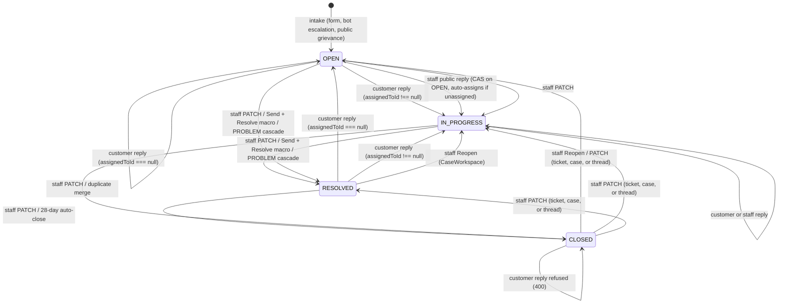
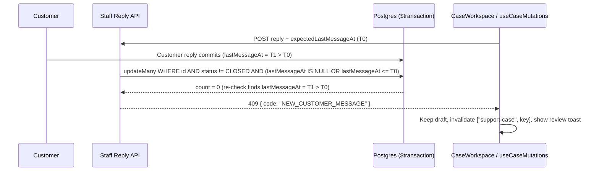

# Ticket lifecycle, reopening and concurrent writes

A support ticket or unified case has four live statuses, two actors who can move it, and (for session escalations) a linked booking thread (`AppointmentSupportThread`) that stays synchronized inside the same database transaction. This document defines the live status transitions, reopen rules, public reply collision protection (`expectedLastMessageAt`), optimistic concurrency guards (`expectedUpdatedAt`), ITIL problem-to-incident resolution cascading, and compare-and-set invariants.

## Live statuses

The `SupportTicketStatus` enum contains five values, only four of which are writable:

| Status        | Meaning                                                                | Written by                                                                          |
| ------------- | ---------------------------------------------------------------------- | ----------------------------------------------------------------------------------- |
| `OPEN`        | Unassigned intake waiting in the general queue.                        | Initial intake, customer reply on an unassigned ticket/case, staff reopen `PATCH`.  |
| `IN_PROGRESS` | Owned by a staff operator or awaiting customer follow-up.              | Public staff reply on an `OPEN` ticket/case, customer reply when assigned, `PATCH`. |
| `RESOLVED`    | Operator marked complete; customer reply or staff action can reopen.   | Staff ticket/case `PATCH`, staff thread `PATCH`, parent `PROBLEM` cascade.          |
| `CLOSED`      | Terminal for customers: no public replies or attachments accepted.     | Staff ticket/case `PATCH`, staff thread `PATCH`, 28-day SLA auto-close sweep.       |
| `ON_HOLD`     | Read-only legacy enum value; rejected on every API write path (`400`). | Never written (`STATUS_NOT_SUPPORTED`).                                             |

`ON_HOLD` remains in the schema solely so pre-existing historical rows deserialize cleanly. Both `PATCH /api/staff/support-tickets/[ticketId]` and `patchSupportCaseLifecycle` (`lib/support/case-service.ts`) reject `status: "ON_HOLD"` with HTTP `400` (`code: "STATUS_NOT_SUPPORTED"`), directing operators to `Waiting on customer` (derived automatically from `awaitingUserSince`) or internal notes (`isInternal: true`).

## Customer vs staff reopening rules

### Customer reply transitions (`resolveUserReplyNextStatus`)

In `POST /api/user/support-tickets/[ticketId]/responses` (`resolveUserReplyNextStatus(status, assignedToId)`) and `lib/support/case-service.ts` (`resolveReopenedUserTurnStatus`):

- **Unassigned `OPEN` stays `OPEN`:** When `status === "OPEN"` and `assignedToId === null`, a customer follow-up keeps the ticket/case in `OPEN` (`status === "OPEN" && !assignedToId ? "OPEN" : "IN_PROGRESS"`) so unassigned queue items never masquerade as actively owned work.
- **Reopening `RESOLVED` or legacy `ON_HOLD`:** A customer reply moves the row to `IN_PROGRESS` when `assignedToId !== null` and `OPEN` when `assignedToId === null`, clears `resolvedAt` and `closedAt`, records a `REOPENED` `SupportCaseEvent` (on `SupportCase`), and banks the elapsed pause interval into `pausedSeconds` via `userRepliedPatch(ticket, now)`.
- **Refusing `CLOSED`:** Customer replies on `CLOSED` rows are rejected before transaction entry with HTTP `400`, prompting the user to open a new request.

### Staff public replies, internal notes, and thread reopening

- **Public staff replies never reopen `RESOLVED` cases:** `POST /api/staff/support-tickets/[ticketId]/responses` (`guardTicketPublicReplyTx`) transitions status from `OPEN` to `IN_PROGRESS` (assigning `session.user.id` when `assignedToId === null`), while leaving any other non-`CLOSED` status (`IN_PROGRESS`, `RESOLVED`) unchanged and updating `lastMessageAt` plus SLA acknowledgement/pause clocks via `applyStaffReply`.
- **Internal notes (`isInternal: true`):** Allowed even when a ticket or case is `CLOSED`. Internal notes never mutate `status`, never advance public `lastMessageAt`, never start an SLA pause, and are never mirrored to customer-visible booking threads.
- **Reopening `RESOLVED` and `CLOSED` threads & tickets:** `PATCH /api/staff/support-threads/[threadId]` (`app/api/staff/support-threads/[threadId]/route.ts`) accepts `"OPEN" | "IN_PROGRESS" | "RESOLVED" | "CLOSED"`. When `isReopening` (`status === "OPEN" || status === "IN_PROGRESS"`) is true, `persistThreadStatusTx` updates both `AppointmentSupportThread` and its linked `SupportTicket` across `["OPEN", "IN_PROGRESS", "ESCALATED", "ON_HOLD", "RESOLVED", "CLOSED"]`, clearing `resolvedAt` and `closedAt` and banking any active `awaitingUserSince` pause into `pausedSeconds`. In `components/dashboard/backoffice/support/CaseWorkspace.tsx`, `SETTLED = new Set(["RESOLVED", "CLOSED"])` renders the **Reopen** button on both settled states—sending `"IN_PROGRESS"` for `RESOLVED` cases and `"OPEN"` for `CLOSED` cases.

## Public reply collision guard (`expectedLastMessageAt`)

To prevent operators from sending an answer drafted before a customer's newest follow-up landed, all three staff public reply write paths enforce `expectedLastMessageAt`:

1. **Ticket public replies (`POST /api/staff/support-tickets/[ticketId]/responses`):**
   - **Pre-transaction fast path:** Rejects immediately with HTTP `409` `{ code: "NEW_CUSTOMER_MESSAGE" }` if `ticket.lastMessageAt > expectedDate`.
   - **Inside-transaction CAS (`guardTicketPublicReplyTx`):** Embeds `OR: [{ lastMessageAt: null }, { lastMessageAt: { lte: expectedDate } }]` alongside `status: { not: "CLOSED" }` inside `tx.supportTicket.updateMany`. If zero rows match, re-reads `status` and `lastMessageAt` inside `tx` to return `{ code: "NEW_CUSTOMER_MESSAGE" }` (`409`) when a customer reply won the race or `409` if closed concurrently.
2. **Thread public replies (`POST /api/staff/support-threads/[threadId]`):**
   - Validates optional `expectedLastMessageAt` via `replySchema` and rejects with HTTP `409` `{ code: "NEW_CUSTOMER_MESSAGE" }` whenever `thread.lastMessageAt > expectedDate`, followed by CAS on `status: { not: "CLOSED" }` in `persistStaffReplyTx`.
3. **Unified case public replies (`POST /api/support/cases/[caseId]/messages` -> `appendSupportCaseTurn`):**
   - `advanceAgentPublicTurnState` includes `OR: [{ lastMessageAt: null }, { lastMessageAt: { lte: expectedDate } }]` and `awaitingUserSince: existingCase.awaitingUserSince` inside `tx.supportCase.updateMany`, returning HTTP `409` `{ code: "NEW_CUSTOMER_MESSAGE" }` if `lastMessageAt` advanced past `expectedDate`.

On the client (`components/dashboard/backoffice/support/useCaseMutations.ts`), `isStaleCaseError` intercepts HTTP `409` responses, invalidates `["support-case", caseKey]` so TanStack Query immediately loads the incoming message, preserves the operator's draft in `CaseWorkspace.tsx`, and surfaces the toast `"New message arrived before your send"`.

## Workspace macros, reassignment notes, duplicates & problem cascading

- **Send + Resolve macros (`thenStatus: "RESOLVED"` in `lib/support/saved-replies.ts`):** Saved replies carrying `thenStatus: "RESOLVED"` (such as `macro-resolve-closing` and `macro-refund-processed-resolve`) execute sequentially in `CaseWorkspace.tsx` (`selectReplyMacro`): first `await reply.mutateAsync({ message: macro.body, note: false })`, then `await query.refetch()` to refresh the workspace cache with the post-reply `updatedAt`, and finally `setStatus.mutate("RESOLVED")` reading `qc.getQueryData<CaseWorkspace>(["support-case", key])?.updatedAt` so `expectedUpdatedAt` never triggers a self-inflicted `409`.
- **Reassignment internal notes (`note`):** Passing an optional `note` to `PATCH /api/staff/support-tickets/[ticketId]` or `PATCH /api/support/cases/[caseId]` atomically records both an internal transcript message (`isInternal: true`, incrementing `messageSeq` on `SupportCase` without advancing `lastMessageAt`) and the `note` attribute on the `ASSIGNED` / `UNASSIGNED` `SupportCaseEvent` within the same transaction.
- **Duplicate closure (`markDuplicate` in `CaseWorkspace.tsx`):** Closing a duplicate open ticket first sends a public pointer reply (`"We've merged this into your active support request <reference> so everything stays in one thread."`), awaits `query.refetch()` to obtain the updated `expectedUpdatedAt`, and then transitions status to `"CLOSED"`.
- **ITIL `PROBLEM` -> `INCIDENT` resolution cascade (`cascadeProblemResolution` in `lib/support/case-service.ts`):** Transitioning a `caseKind === "PROBLEM"` case to `RESOLVED` queries all linked `INCIDENT` cases (`problemCaseId: problemCase.id`, `status: { notIn: ["RESOLVED", "CLOSED"] }`, `deletedAt: null`) and resolves each child incident using per-row CAS (`where: { id: inc.id, status: inc.status, messageSeq: inc.messageSeq, awaitingUserSince: inc.awaitingUserSince, pausedSeconds: inc.pausedSeconds }`). Each matched incident banks its SLA pause, optionally appends `closingMessage` at `seq: inc.messageSeq + 1`, logs `STATUS_CHANGED` (`note: "Resolved via problem <ref>"`), and stages a 24-hour delayed CSAT prompt. Reopening a parent `PROBLEM` **never** auto-reopens `RESOLVED` or `CLOSED` child incidents.
- **Status-transition-only customer notifications:** Both `PATCH /api/staff/support-tickets/[ticketId]` (`existing.status !== updatedTicket.status`) and `PATCH /api/support/cases/[caseId]` (`result.previousStatus !== updatedCase.status`) fire `notifySupportTicketUpdate` and `sendSupportTicketUpdateEmail` strictly when `status` changes (for both the primary record and any cascaded `INCIDENT` rows). Priority-only, assignee-only, or internal-note-only edits send zero customer notifications.

## Optimistic concurrency & compare-and-set summary

Every mutation enforces its expected prior state directly inside `updateMany` `WHERE`:

| Write operation                  | Expected state enforced in `WHERE`                                                                           | Zero-row / mismatch outcome                                                               |
| -------------------------------- | ------------------------------------------------------------------------------------------------------------ | ----------------------------------------------------------------------------------------- |
| Staff ticket / case `PATCH`      | `id`, `updatedAt: expectedUpdatedAt` (+ `status: { not: "CLOSED" }` when `status` omitted)                   | `409 CONFLICT` (pre-transaction `CLOSED` edits without `status` return `400` closed code) |
| Customer ticket / case reply     | `id`, `status`, `awaitingUserSince`, `pausedSeconds` as read                                                 | `409` concurrent update conflict                                                          |
| Staff public ticket / case reply | `id`, `status: { not: "CLOSED" }`, `OR: [{ lastMessageAt: null }, { lastMessageAt: { lte: expectedDate } }]` | `409 NEW_CUSTOMER_MESSAGE` if `lastMessageAt > expectedDate`, else `409` closed           |
| Staff thread public reply        | Pre-check `thread.lastMessageAt <= expectedDate`; `updateMany` `id`, `status: { not: "CLOSED" }`             | `409 NEW_CUSTOMER_MESSAGE` or `409 CONFLICT`                                              |
| Staff thread status `PATCH`      | Reopen: `status` in all states; non-reopen: `status: { notIn: ["CLOSED"] }` and linked ticket not `CLOSED`   | `409 CONFLICT`                                                                            |
| `PROBLEM` -> `INCIDENT` cascade  | `id: inc.id`, `status: inc.status`, `messageSeq: inc.messageSeq`, `awaitingUserSince`, `pausedSeconds`       | Skips concurrently modified child incident safely                                         |
| `applyStaffReply` SLA clocks     | `acknowledgedAt: null`, `firstAgentReplyAt: null`, `awaitingUserSince` as read                               | Earliest responder retains first-reply timestamps                                         |

## Deprecated & Superseded Approaches

- **Moving unassigned `OPEN` tickets to `IN_PROGRESS` on customer reply:** Previously, `POST /api/user/support-tickets/[ticketId]/responses` set every non-settled reply to `IN_PROGRESS`, hiding unassigned customer follow-ups from unassigned queue filters. Superseded by `resolveUserReplyNextStatus` keeping `OPEN` when `assignedToId === null`.
- **Blocking staff from reopening `CLOSED` threads or omitting `Reopen` on `CLOSED` cases:** `PATCH /api/staff/support-threads/[threadId]` previously rejected `"OPEN"` and `CaseWorkspace.tsx` hid **Reopen** once `CLOSED`. Superseded by `isReopening` (`OPEN` / `IN_PROGRESS`) across both thread and ticket routes.
- **Blind staff public replies overwriting unseen customer messages:** Sending replies without `expectedLastMessageAt` let stale browser tabs answer outdated context. Superseded by pre-transaction + inside-transaction CAS returning HTTP `409` `{ code: "NEW_CUSTOMER_MESSAGE" }`.
- **Unrefreshed `Send + Resolve` or duplicate-close mutations:** Firing `setStatus("RESOLVED")` or `setStatus("CLOSED")` immediately after `reply.mutateAsync` without awaiting `query.refetch()` sent a stale `expectedUpdatedAt` that failed with `409 CONFLICT`.
- **Customer emails on priority or assignee edits:** Emitting `notifySupportTicketUpdate` on every `PATCH` notified customers when operators changed internal priority or ownership. Superseded by strict `previousStatus !== updatedStatus` gating.
- **Writable `ON_HOLD` status and unguarded `PATCH` updates:** `ON_HOLD` is permanently rejected on write (`400 STATUS_NOT_SUPPORTED`) in favour of `awaitingUserSince` SLA pauses, and every `PATCH` requires `expectedUpdatedAt`.
