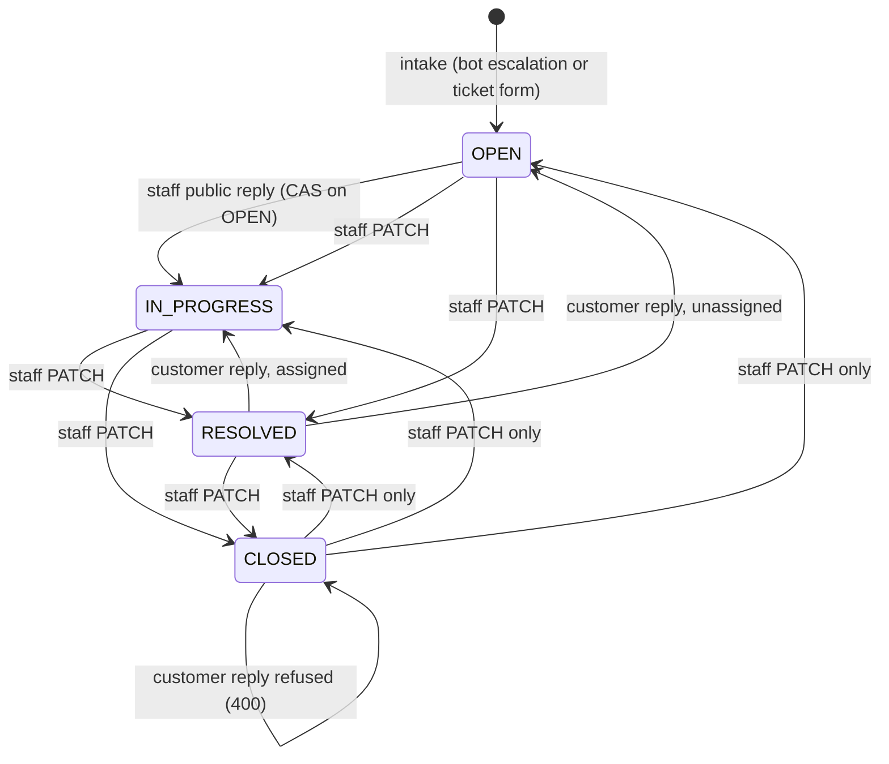
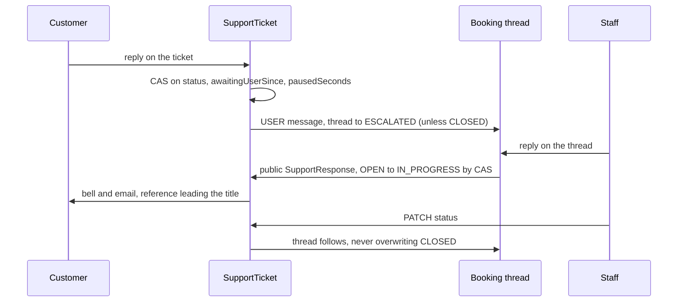

# Ticket lifecycle, reopening and concurrent writes

A support ticket has four live statuses, two actors who can move it, and a booking thread that has to agree with it. This page describes the state machine as the routes implement it today, the reopen rules that follow from it, and the compare-and-set guards that keep two simultaneous writers from leaving a ticket in a state nobody chose.

## The statuses

The `SupportTicketStatus` enum has five values, and only four of them can be written.

| Status        | Meaning                                                      | Written by                                            |
| ------------- | ------------------------------------------------------------ | ----------------------------------------------------- |
| `OPEN`        | Nobody is working it, or the customer has just written back. | Intake, a customer reply to an unassigned ticket.     |
| `IN_PROGRESS` | A staff member owns it or has replied.                       | A staff reply on an `OPEN` ticket, the staff `PATCH`. |
| `RESOLVED`    | Staff believe it is done; the customer can still reopen it.  | The staff `PATCH`, the staff thread `PATCH`.          |
| `CLOSED`      | Final for the customer: no replies, no attachments.          | The staff `PATCH`, the staff thread `PATCH`.          |
| `ON_HOLD`     | Readable on existing rows, refused on every write path.      | Nothing.                                              |

`ON_HOLD` stays in the enum so rows that already carry it still render, but the staff `PATCH` answers a request for it with a 400 and the code `STATUS_NOT_SUPPORTED`, and points the agent at "Waiting on customer", which is derived from the SLA pause rather than stored as a status. A customer reply to an `ON_HOLD` row is treated like a reply to a `RESOLVED` one, so such a row can leave the status but never enter it.

## Who may reopen a ticket

Two rules, both decided by the owner, define reopening.

**A customer reply reopens a resolved ticket.** The route `POST /api/user/support-tickets/[ticketId]/responses` computes the next status from the status it read: a `RESOLVED` or `ON_HOLD` ticket becomes `OPEN` when nobody is assigned and `IN_PROGRESS` when someone is, and every other live ticket becomes `IN_PROGRESS`. The same write clears `resolvedAt` and `closedAt`, so a reopened ticket stops reading as finished, and it folds the wait that just ended into `pausedSeconds` through `userRepliedPatch`. A reply to a `CLOSED` ticket is refused with a 400 saying the ticket is closed and can no longer receive replies, and the client then offers a new request. While a ticket is `RESOLVED` the reply box says "This request is marked resolved. Replying reopens it.", so the reopen is never a surprise.

**A staff reply never reopens a resolved ticket.** The staff `POST` on `/api/staff/support-tickets/[ticketId]/responses` moves a ticket only from `OPEN` to `IN_PROGRESS`, with the status read as the expected prior status in the `WHERE` clause, and assigns the replier when nobody was assigned. On any other live status it bumps `lastMessageAt` and nothing else, so a reply that races a Resolve leaves the ticket `RESOLVED` rather than `IN_PROGRESS` with a stale `resolvedAt`. The reply is still saved and sent. An internal note touches neither the status nor the activity clock, and it is the only reply write allowed on a `CLOSED` ticket; the staff `PATCH` can still change a closed ticket's status. The back-office composer follows that rule: on a closed case it disables the reply box and Send, says that the customer can no longer receive replies, and keeps private notes available.

Only staff can take a `CLOSED` ticket out of `CLOSED`, through the staff `PATCH`. That write also moves the booking thread, as described below.

## The staff PATCH and the stale-view guard

`PATCH /api/staff/support-tickets/[ticketId]` requires the `expectedUpdatedAt` the caller rendered. The `updateMany` matches on `id` and that exact `updatedAt`, and a priority or assignee edit without a status change also requires `status` not to be `CLOSED`. When nothing matches, the route answers 409 with the code `CONFLICT`. A stale tab therefore cannot move a ticket from `RESOLVED` to `CLOSED`, or reprioritise a ticket someone else just closed, without noticing.

The assignee and priority of a ticket that is already `CLOSED` are frozen. The route refuses such an edit before the write, with 400 and the code `TICKET_CLOSED` ("This request is closed, so its assignee and priority can't be changed. Reopen it first."), rather than reporting a conflict that did not happen. The 409 is kept for the case where the ticket closed between the read and the write. A status change, which is how a ticket is reopened, is still accepted.

The client half is `useCaseMutations` in the back-office case workspace. A 409 is recognised by `isStaleCaseError`, which invalidates the case query so the case is refetched, and shows the toast "The case changed — review and retry" instead of a generic failure. The retry then starts from what the database holds now.

Status writes stamp the clocks consistently, through `buildTicketPatchFields`. `RESOLVED` sets `resolvedAt` and clears `closedAt`. `CLOSED` sets `closedAt` and keeps an existing `resolvedAt`, so closing a resolved ticket does not erase when it was resolved. `OPEN` and `IN_PROGRESS` clear both.

The moderation report `PATCH` follows the same idea with different fields: it matches on the status and assignee the caller saw, and it refuses outright once a report is `DISMISSED` or `ACTION_TAKEN`, because a resolved report changes only through the audited action route.

## Thread and ticket mirroring

An escalated booking conversation (`AppointmentSupportThread`) and its ticket describe one problem, so every write on one is mirrored to the other inside the same transaction.

The rules the code enforces are these.

- A customer reply on the ticket becomes a `USER` message on the thread and moves a non-closed thread to `ESCALATED`. A staff public reply on the ticket becomes an `AGENT` message on a non-closed thread. Internal notes are never mirrored.
- A staff reply on the thread becomes a public `SupportResponse` on the ticket, so the queue history and the customer's "My requests" view stay complete, and it starts the SLA pause through `applyStaffReply`.
- The staff thread `PATCH` accepts `IN_PROGRESS`, `RESOLVED` or `CLOSED`. It moves the thread and the ticket in one transaction, and if the ticket is already `CLOSED` and the target is not `CLOSED` the whole transaction returns zero rows and the caller gets a 409, because letting the thread move alone is the disagreement the mirror exists to prevent.
- The ticket `PATCH` calls `syncLinkedThreadStatus`. Moving a `CLOSED` ticket to any other status also reopens a `CLOSED` thread to `ESCALATED` with `resolvedAt` cleared, so later staff replies reach the customer's conversation instead of only their bell. Setting `OPEN` puts a non-closed thread back to `ESCALATED`. Any other status is copied onto a non-closed thread.
- The back-office timeline shows a customer's follow-up once. `dedupeEscalatedResponses` drops the mirrored `SupportResponse` when a `USER` message with the same body exists within five seconds, and each message can pair with only one response.

## Compare-and-set, summarised

Every transition above puts its expected prior state in the `WHERE` clause, as the repository's money-and-state rule requires, and a zero-row result is an answer rather than an error.

| Write                    | Expected state in the `WHERE`                                                  | Zero rows becomes                                                                     |
| ------------------------ | ------------------------------------------------------------------------------ | ------------------------------------------------------------------------------------- |
| Staff `PATCH`            | `updatedAt` (and `status` not `CLOSED` when no status is changing)             | 409 `CONFLICT` (an already-closed ticket is refused earlier with 400 `TICKET_CLOSED`) |
| Customer reply           | `status`, `awaitingUserSince`, `pausedSeconds` as read                         | 409, "updated concurrently, refresh"                                                  |
| Staff public reply       | `status: OPEN` for the pickup; `status` not `CLOSED` for the touch             | 409 when the ticket closed under the reply                                            |
| Staff thread reply       | thread `status` not `CLOSED`                                                   | 409 `CONFLICT`                                                                        |
| Staff thread `PATCH`     | thread `status` not `CLOSED`, and the ticket not `CLOSED`                      | 409 `CONFLICT`                                                                        |
| `applyStaffReply` stamps | `acknowledgedAt: null`, `firstAgentReplyAt: null`, `awaitingUserSince` as read | the earlier writer keeps the timestamp                                                |

## Deprecated & Superseded Approaches

- **Deriving the reply's status from a pre-transaction read with only a `CLOSED` guard**: the staff reply used to compute `OPEN` to `IN_PROGRESS` outside the transaction and guard only against `CLOSED`, so a reply racing a Resolve left `IN_PROGRESS` with `resolvedAt` set. Superseded by the status-in-`WHERE` pickup above; do not reintroduce a read-then-update.
- **A `PATCH` guarded only by status**: a stale tab could change a closed ticket's priority and see 200. Superseded by `expectedUpdatedAt`; there is no unguarded variant to restore.
- **Mirroring replies only to non-closed threads after a staff reopen**: reopening a `CLOSED` ticket left its thread `CLOSED`, so replies never reached the conversation. Superseded by `syncLinkedThreadStatus`.
- **An `ON_HOLD` status written by staff**: no longer offered. If a real on-hold feature returns it will need its own SLA semantics; do not re-enable the value on the `PATCH` without them.
