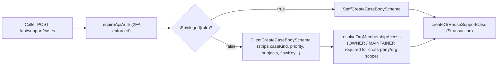

# Intake, callbacks, receipts, attachments and rate limits

This document specifies how requests enter the support system, how organization cross-party permissions and non-staff intake schemas are enforced, how timeline queries keep recent messages visible via tail-window slicing (`take: -200`), how callback numbers are canonicalised, how private attachments are stored and served, and which endpoints consume Upstash rate-limit budgets. Lifecycle rules are in [07-ticket-lifecycle-and-concurrency.md](07-ticket-lifecycle-and-concurrency.md), clocks in [03-ticket-references-and-sla.md](03-ticket-references-and-sla.md), and unified `SupportCase` sweeps in [09-support-case-and-sla-sweep.md](09-support-case-and-sla-sweep.md).

## Intake entry points & schema boundaries

Every intake route allocates an IST-year `FAM-YYYY-NNNNNN` reference via `allocateTicketReference`, computes initial acknowledgement/resolution deadlines via `slaDeadlinesFor`, and sets `lastMessageAt` to the creation timestamp within one database transaction:

- **Unified support cases (`POST /api/support/cases` in `app/api/support/cases/route.ts`):**
  - Enforces mandatory operator 2FA via `requireApiAuth` (`428 PRECONDITION_REQUIRED` if an operator lacks verified 2FA).
  - Separates caller payload validation strictly by role:
    - **Non-staff callers (`ClientCreateCaseBodySchema`):** Omits `submitterUserId`, `caseKind`, `problemCaseId`, `subjects`, `priority`, `activeChannel`, `currentNodeId`, and `flowKey` so customers and org admins cannot inject internal workflow flags, priority overrides, problem links, or arbitrary polymorphic subjects.
    - **Staff operators (`StaffCreateCaseBodySchema`):** Omits only `submitterUserId` (always bound server-side to `auth.session.user.id`).
  - **Organization submitter role enforcement (`ALLOWED_ORG_SUBMITTER_ROLES = new Set(["OWNER", "MAINTAINER"])`):** Filing on behalf of another user (`requesterUserId !== user.id`) or against an organization booking that the requester did not book personally requires both an active `targetOrgId`, an `ACTIVE` membership for the caller with role in `ALLOWED_ORG_SUBMITTER_ROLES` (`OWNER` or `MAINTAINER`), and an `ACTIVE` membership for `requesterUserId` in the same organization (`resolveOrgMembershipAccess` + `validateCaseScopeAccess`). Plain `MEMBER` accounts cannot file cross-party organization cases or bind organization-scoped appointments they do not participate in (`403 FORBIDDEN`).
  - Deduplicates idempotently in `createOrReuseSupportCase` on `(submitterUserId, clientIntakeId)` (`dedupeReason: "client_intake_id"`) or active open scope `(requesterUserId, submitterUserId, appointmentId, appointmentOccurrenceId, category)` where `closedAt IS NULL AND deletedAt IS NULL` (`dedupeReason: "open_scope"`).
- **Ticket form (`POST /api/user/support-tickets`):** Validates via `CreateSupportTicketSchema`, rejects session-scoped issues with HTTP `422` (`SESSION_SCOPED_ISSUE`), verifies linked bookings, payments, or organizations against caller ownership, and reuses an already-open ticket for the same payment.
- **Platform self-serve bot (`POST /api/support/platform`):** Runs statelessly across guided nodes until an escalating terminal turn, deduplicating against any `OPEN` ticket created by the caller for the same terminal node within the last 30 minutes (`findRecentOpenEscalation`).
- **Booking self-serve bot (`POST /api/appointments/[appointmentId]/support`):** Persists turns onto `AppointmentSupportThread` and builds structured escalation briefs (`escalationBrief`) capturing the last substantive customer turn (excluding bare trigger phrases such as `"agent"` or `"talk to a human"`), topic, node trail, last bot message, and escalation cause.

### Three-strikes bot escalation & unthrottled booking turns

1. **Three consecutive unrecognised turns auto-escalate:** In `walkFlow` (`lib/support/flow-walk.ts`), three consecutive unrecognized typed customer inputs without node cursor movement automatically escalate to human staff (`escalate: true`, `reason: "repeated_unrecognized"`), while keeping an explicit human hand-off option one tap away at every prompt node.
2. **Zero rate-limit budget on booking turns:** `POST /api/appointments/[appointmentId]/support` consumes zero Upstash rate-limit budget—guarded by `assertBodySize(req)` and participant/organization access verification—so multi-step diagnostic flows and typed clarifications never fail with HTTP `429`.

## Timeline tail slicing (`take: -200`) & workspace cutover guard

- **Newest 200 turns in chronological order (`take: -TIMELINE_LIMIT`):** Both `lib/support/own-case-read.ts` (`readOwnSupportCase` with `orderBy: { seq: "asc" }, take: -TIMELINE_LIMIT` and `readOwnTicket` with `orderBy: { createdAt: "asc" }, take: -TIMELINE_LIMIT`) and `lib/support/case-workspace.ts` (`MESSAGE_SELECT` with `orderBy: MESSAGE_ORDER, take: -TIMELINE_LIMIT` and `responses` with `orderBy: { createdAt: "asc" }, take: -TIMELINE_LIMIT`, where `TIMELINE_LIMIT = 200`) use negative Prisma `take` slicing on ascending orderings. Postgres returns the **newest 200** messages/responses already sorted chronologically from oldest to newest, ensuring active conversations never drop recent customer or operator messages past turn 200.
- **Back-office workspace case guard (`readCaseWorkspace`):** In `lib/support/case-workspace.ts`, `readCaseWorkspace(ref, grants)` resolves `kind === "ticket"` (`readTicketWorkspace`) and `kind === "thread"` (`readThreadWorkspace`), and explicitly returns `null` when `ref.kind === "case"` until the back-office inbox UI cutover PR lands.

## Callback requests & engineering escalation

- **Server-side phone & schedule validation (`callbackPhoneSchema` / `CallbackWindowSchema`):** Accepts Indian mobile numbers (optional `+91`, `91`, or `0` prefix starting `6–9`) or international E.164 numbers (`+[1-9]\d{7,14}`), strips formatting characters, rejects 10+ repeated digits, and normalises to E.164 (`+91XXXXXXXXXX`). `SupportCase` persists `callbackPhone` and `callbackWindow` (`"09:00-12:00 IST"` through `"18:00-21:00 IST"`) in typed columns.
- **Legacy description prefix sanitization (`stripCallbackTags`):** On `SupportTicket`, `[Callback Requested: <phone>]` is prepended exclusively by `createSupportTicket`. Every free-text user or operator input passes iteratively through `stripCallbackTags`, and `extractCallbackInfo` honours only a valid start-of-body marker.
- **PII-free engineering escalation link (`buildEngineeringEscalationHref`):** Rendered strictly for operators granted `engineering.escalate` (`ADMIN` only in `BACKOFFICE_PERMISSIONS`). Because the issue tracker repository is public, the pre-filled template includes only the internal case key and `FAM-` reference number—never names, emails, phone numbers, appointment IDs, or payment IDs.

## Intake receipts & outbound notices

Creating a ticket or case triggers two outbound notifications:

1. **Staff alert (`notifySupportStaff`):** Notifies operators of the new intake (`"case"` or `"ticket"` route scope).
2. **Requester receipt (`notifyRequesterOfTicket`):** Stages an outbox bell on `SUPPORT_TICKET_RECEIVED` (`dedupeKey: ticket-received:<id>`) and sends an acknowledgement window receipt email (`sendSupportTicketReceivedEmail`) citing `referenceNumber` and `ackDueAt`. System-generated escalations (`filedBy: "system"`) notify staff only. Automated receipts never set `acknowledgedAt`; only a public human staff reply stamps first acknowledgement.

## Rate limits & private attachments

Customer write routes isolate budgets across dedicated Upstash limiters (`spamLimiter` at 5/h, `ticketResponseLimiter` on `ticket-response:<userId>`, `reviewWriteLimiter` at 20/h, and `documentUploadLimiter` at 10/m), failing open with a single throttled Sentry alert if Redis is unreachable:

| Route                                                 | Limiter & Key                                                            | Enforcement & Staff Exemptions                                                 |
| ----------------------------------------------------- | ------------------------------------------------------------------------ | ------------------------------------------------------------------------------ |
| `POST /api/appointments/[id]/support`                 | Unthrottled (`assertBodySize` only)                                      | Zero rate-limit budget; protected by body size cap and participant auth        |
| `POST /api/support/cases/[caseId]/messages`           | `ticketResponseLimiter` (`ticket-response:<userId>`)                     | **Skipped for staff**; shared customer reply bucket                            |
| `POST /api/user/support-tickets/[ticketId]/responses` | `ticketResponseLimiter` (`ticket-response:<userId>`)                     | Charged after session check before body parsing (customers)                    |
| `POST /api/user/support-tickets`                      | `spamLimiter` (`tickets:<userId>`)                                       | Charged after authentication before body parsing                               |
| `POST /api/support/platform`                          | `spamLimiter` (`tickets:<userId>`, shared)                               | Charged **only** on escalating terminal turns; navigation turns are free       |
| `POST /api/support/cases`                             | `spamLimiter` (`support-cases:<userId>`)                                 | Charged after `requireApiAuth` on unified case creation                        |
| `POST /api/support/cases/[caseId]/csat`               | `spamLimiter` (`support-case-csat:<userId>`)                             | Resolution CSAT survey submission                                              |
| `POST /api/support-tickets/[ticketId]/attachments`    | `documentUploadLimiter` (`ticket-attachment-upload:<userId>:<ticketId>`) | Charged **customers only** after access, closed-ticket, and 5-file checks pass |
| `DELETE /api/support-tickets/[ticketId]/attachments`  | `documentUploadLimiter` (`ticket-attachment-delete:<userId>:<ticketId>`) | Charged **customers only** after ownership and non-closed checks pass          |
| `POST /api/appointments/[appointmentId]/feedback`     | `spamLimiter` (`appointment-feedback:<userId>`)                          | Private post-session feedback writes                                           |
| `POST /api/user/feedbacks`                            | `spamLimiter` (`feedbacks:<userId>`)                                     | General product feedback writes                                                |
| `POST /api/report`                                    | `spamLimiter` (`report:<userId>`)                                        | Content and review moderation reports                                          |
| `POST/PUT/DELETE /api/user/reviews`                   | `reviewWriteLimiter` (`reviews:<userId>`)                                | Public consultant review creation, update, and deletion                        |

Attachments are stored in the private `support-attachments` Supabase bucket (max 5 files per ticket under `SELECT … FOR UPDATE`, max 10 MB per file across allow-listed MIME types). `GET /api/support-tickets/[ticketId]/attachments/[attachmentId]` verifies owner/staff authorization and returns a 60-second signed `302` redirect with `Cache-Control: private, no-store`. `DELETE` verifies storage removal via `removeObjects` before deleting metadata rows (`502` on partial failure).

## Deprecated & Superseded Approaches

- **Forward head-truncation (`take: 200` on ascending order):** Positive `take: 200` with `orderBy: { createdAt: "asc" }` or `{ seq: "asc" }` silently dropped every message after the 200th turn on long-running cases. Superseded by `take: -TIMELINE_LIMIT` (`take: -200`) returning the newest 200 turns in chronological order.
- **Unrestricted client fields & member cross-party filing on `POST /api/support/cases`:** Allowing non-staff callers to supply `priority`, `caseKind`, `problemCaseId`, or `subjects`, or allowing plain `MEMBER` accounts to file on behalf of other members, was superseded by `ClientCreateCaseBodySchema` field stripping and `ALLOWED_ORG_SUBMITTER_ROLES` (`OWNER`, `MAINTAINER`).
- **Prematurely serving `kind === "case"` in `readCaseWorkspace`:** `readCaseWorkspace` returns `null` for `kind === "case"` until the back-office inbox UI cutover PR lands so ticket/thread workspace contracts never receive half-wired payloads.
- **Public storage URLs, unverified deletes, and full-body regex callback tags:** Superseded by private 60s signed redirects, verified `removeObjects` deletes, typed `SupportCase` callback columns, and start-of-body `stripCallbackTags` sanitization.
- **Throttling guided booking bot clicks or staff case replies under `spamLimiter`:** Superseded by zero-budget booking turns (with three-strikes auto-escalation), `ticketResponseLimiter` for customer replies, and full staff exemptions on case messages.
