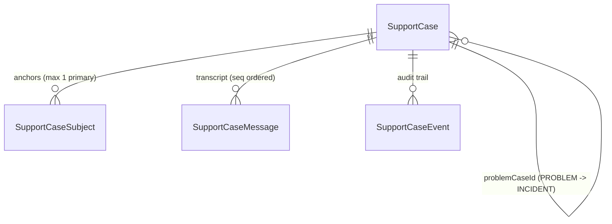
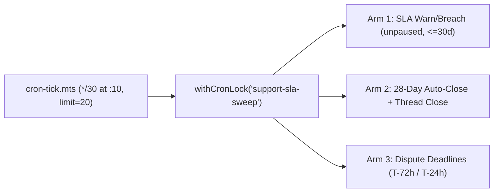

# Unified SupportCase model, SLA sweep, CSAT and compliance

The unified `SupportCase` graph consolidates transcripts, statutory SLA clocks, ITIL problem-incident hierarchies, typed callback schedules, audit logs, resolution CSAT, and statutory monthly compliance reporting into one relational model backed by an idempotent 30-minute cron sweep.

## Schema & Postgres sidecar constraints

| Model                | Primary purpose & key columns                                                                                                                                                                                                                                                                                                                                                                     | Database & sidecar constraints (`prisma/sql/check-constraints.sql`)                                                                                                                                                                                                                                                                                                                                                                                                                               |
| -------------------- | ------------------------------------------------------------------------------------------------------------------------------------------------------------------------------------------------------------------------------------------------------------------------------------------------------------------------------------------------------------------------------------------------- | ------------------------------------------------------------------------------------------------------------------------------------------------------------------------------------------------------------------------------------------------------------------------------------------------------------------------------------------------------------------------------------------------------------------------------------------------------------------------------------------------- |
| `SupportCase`        | Owns `referenceNumber` (`FAM-YYYY-NNNNNN`), `clientIntakeId`, `caseKind` (`INCIDENT` \| `PROBLEM`), `problemCaseId`, `requesterUserId`, `submitterUserId`, `callbackPhone`, `callbackWindow`, SLA clocks (`ackDueAt`, `acknowledgedAt`, `resolutionDueAt`, `resolvedAt`, `closedAt`, `firstAgentReplyAt`, `awaitingUserSince`, `pausedSeconds`), `messageSeq`, and CSAT (`csatRating`, `csatAt`). | `support_case_open_scope_key`: partial unique (`NULLS NOT DISTINCT`) on `("appointmentId", "appointmentOccurrenceId", "requesterUserId", "submitterUserId", "category") WHERE "closedAt" IS NULL AND "deletedAt" IS NULL`. `support_case_scope_and_shape_chk`: `CHECK` enforcing `category IS NOT NULL OR flowKey IS NOT NULL`, `appointmentId` presence whenever `appointmentOccurrenceId` is set, single-level `problemCaseId` (`caseKind = 'INCIDENT'`), and `csatRating BETWEEN 1 AND 5`. |
| `SupportCaseSubject` | Polymorphic entity attachments (`APPOINTMENT`, `OCCURRENCE`, `PAYMENT`, `REFUND`, `INVOICE`, `ORGANIZATION`, `ACCOUNT`) with `isPrimary`.                                                                                                                                                                                                                                                         | `@@unique([caseId, subjectType, subjectId])` plus `support_case_subject_primary_key` partial unique on `("caseId") WHERE "isPrimary" = true`.                                                                                                                                                                                                                                                                                                                                                     |
| `SupportCaseMessage` | Total-ordered message stream (`seq`, `sender` in `USER` \| `AGENT` \| `BOT` \| `SYSTEM`, `isInternal`, `clientTurnId`, `authorUserId`).                                                                                                                                                                                                                                                           | `@@unique([caseId, clientTurnId])` for idempotent client retries; indexed on `[caseId, seq]`.                                                                                                                                                                                                                                                                                                                                                                                                     |
| `SupportCaseEvent`   | Append-only audit events (`CREATED`, `STATUS_CHANGED`, `PRIORITY_CHANGED`, `ASSIGNED`, `UNASSIGNED`, `VISIBILITY_CHANGED`, `LINKED_PROBLEM`, `DUPLICATE_CLOSED`, `REOPENED`, `AUTO_CLOSED`, `CSAT_RATED`).                                                                                                                                                                                        | `support_case_event_target_xor`: `CHECK (("caseId" IS NULL) <> ("legacyTicketId" IS NULL))`. `support_case_event_legacy_csat_key`: partial unique on `("legacyTicketId") WHERE "kind" = 'CSAT_RATED'`.                                                                                                                                                                                                                                                                                        |

## API authorization, intake schema boundaries & ADR 20 redaction

Every route under `/api/support/cases*` and `/api/admin/support/*` enforces mandatory operator 2FA via `requireApiAuth` (`428 PRECONDITION_REQUIRED` if an operator lacks verified 2FA):

- **Role-split schemas & org submitter gate (`POST /api/support/cases` in `app/api/support/cases/route.ts`):**
  - Non-staff requests parse through `ClientCreateCaseBodySchema`, stripping privileged fields (`submitterUserId`, `caseKind`, `problemCaseId`, `subjects`, `priority`, `activeChannel`, `currentNodeId`, `flowKey`), while staff operators use `StaffCreateCaseBodySchema` (with `submitterUserId` always bound server-side to `user.id`).
  - Cross-party organization intake (`requesterUserId !== user.id`) and organization-scoped booking access require active membership in `ALLOWED_ORG_SUBMITTER_ROLES = new Set(["OWNER", "MAINTAINER"])` for the submitter plus active membership for `requesterUserId` in `targetOrgId` (`resolveOrgMembershipAccess`).
  - Idempotent intake (`createOrReuseSupportCase`) deduplicates on `(submitterUserId, clientIntakeId)` (`dedupeReason: "client_intake_id"`) or active open scope (`dedupeReason: "open_scope"`), appending a `USER` turn and reopening `RESOLVED` cases to `IN_PROGRESS` (when assigned) or `OPEN` (when unassigned).
- **Timeline tail slicing (`take: -200`) & back-office workspace guard:**
  - Customer timeline reads (`lib/support/own-case-read.ts` in both `readOwnSupportCase` with `orderBy: { seq: "asc" }, take: -TIMELINE_LIMIT` and `readOwnTicket` with `orderBy: { createdAt: "asc" }, take: -TIMELINE_LIMIT`) and back-office workspace reads (`lib/support/case-workspace.ts`, `TIMELINE_LIMIT = 200`) query the **newest 200** messages/responses in chronological ascending order so long-lived threads never truncate recent turns.
  - `readCaseWorkspace` in `lib/support/case-workspace.ts` returns `null` when `ref.kind === "case"` until the back-office inbox UI cutover PR lands.
- **ADR 20 cross-party transcript redaction (`readSupportCaseForViewer` & `readOwnSupportCase`):** When an organization operator files a case concerning another member (`requesterUserId !== submitterUserId`), reads by `requesterUserId` strip all operator correspondence and payment metadata—returning summary metadata only (`title: "Organization support request"`, empty `description`, empty `messages: []`, `events: []`, `subjects: []`, `callbackPhone: null`, `callbackWindow: null`, `submitterUserId: null`, `filedByOrganizationNotice: true`). Non-staff viewers never receive internal messages (`isInternal: true`) or `VISIBILITY_CHANGED` audit events.
- **Lifecycle mutations (`PATCH /api/support/cases/[caseId]`) & turn appends (`POST /api/support/cases/[caseId]/messages`):**
  - `patchSupportCaseLifecycle` enforces optimistic concurrency (`expectedUpdatedAt` -> `409 CONFLICT`), verifies `STAFF`/`ADMIN` assignees (`validateOperatorAssigneeTx`), tightens SLA clocks on priority raises (`tightenDeadlinesForPriorityRaise`), cascades `PROBLEM` resolution across linked open `INCIDENT` cases (`cascadeProblemResolution`), writes internal reassignment notes (`isInternal: true`), and triggers customer email/bell notices strictly when `previousStatus !== updatedCase.status`.
  - `appendSupportCaseTurn` exempts staff from rate limits, deduplicates on `(caseId, clientTurnId)`, and guards public staff replies against unseen customer follow-ups via `expectedLastMessageAt` (`409 NEW_CUSTOMER_MESSAGE`).

## Resolution CSAT, compliance reporting & CSV injection protection

- **Resolution CSAT (`POST /api/support/cases/[caseId]/csat`):**
  - Resolving a case or ticket stages a **24-hour delayed outbox survey prompt** (`dedupeKey: csat:{id}:{resolvedAt}`).
  - `submitSupportCaseCsat` accepts scores `1..5` from `submitterUserId` on `RESOLVED` or `CLOSED` cases within **28 days** of `resolvedAt`, guarded by CAS on `csatRating: null` (or partial unique index `support_case_event_legacy_csat_key` -> `409` on legacy tickets).
- **Statutory monthly compliance report (`GET /api/admin/support/compliance-report` & `supportMonthlyComplianceReport`):**
  - Restricted to `ADMIN` (`requireAdminAuth`) and bounded to IST calendar months (`UTC+05:30`).
  - Aggregates unified `SupportCase` and legacy `SupportTicket` rows created inside the IST window, reporting:
    - `received`: total requests opened in the month.
    - `acknowledgedWithin24h`: requests acknowledged within 24 hours of `createdAt`.
    - `disposedWithin15d`: requests resolved within 15 days of `createdAt` net of `pausedSeconds`.
    - `grievances`: count of formal grievance rows (`category === "GRIEVANCE"`), alongside per-row `grievance: boolean`.
    - `appealed`: count of moderation appeal rows (`category === "MODERATION_APPEAL"` or citing an `RPT-` report reference matching `/\bRPT-/` in `title` or `description`), alongside per-row `appealed: boolean`.
- **CSV formula-injection guard (`components/dashboard/backoffice/support/SupportHealthAndComplianceOverview.tsx`):**
  - When exporting the monthly grievance report CSV (`downloadCsv`), `escapeCsvCell` prepends a single apostrophe (`'`) to any cell starting with `[=+\-@\t\r]` before wrapping in RFC 4180 double quotes (`"${safe.replace(/"/g, '""')}"`), neutralizing spreadsheet formula execution.

## Background SLA, auto-close & dispute sweep

`runSupportSlaSweep` (`lib/support/sla-sweep.ts`) runs every **30 minutes at offset `:10`** on `netlify/functions/cron-tick.mts` (`limit=20`), serialized by `withCronLock("support-sla-sweep")`:

1. **Arm 1 — SLA acknowledgement & resolution warnings/breaches:** Queries open, unpaused (`awaitingUserSince === null`) cases and tickets due within the last 30 days (`ackWarn <= 2h`, `resWarn <= 24h`, or breached `<= now`). Stages idempotent outbox notices (`dedupeKey: sla:{id}:{ack|res}:{warn|breach}`) on `NOVU_WORKFLOWS.SUPPORT_TICKET_ACTIVITY` and emails operators (`deliver()`). Organization `escalationContactEmail` is emailed **strictly on `"breach"`**, never on `"warn"`.
2. **Arm 2 — 28-day auto-close (`RESOLVED` -> `CLOSED`):** Transitions rows resolved `>= 28` days ago via conditional `updateMany` (`status: "RESOLVED"`), writes an `AUTO_CLOSED` event row, and atomically closes linked `AppointmentSupportThread` rows (`status: "CLOSED"`, `activeChannel: "SELF_SERVE"`).
3. **Arm 3 — Actionable dispute deadline reminders:** Alerts `ADMIN` users on disputes in `NEEDS_RESPONSE` or `WARNING_NEEDS_RESPONSE` at `T-72h` and `T-24h` (`dedupeKey: dispute-due:{id}:{72|24}` on `NOVU_WORKFLOWS.DISPUTE_UPDATED`).

Row-level errors are collected across all three arms and reported to Sentry at most once per run (`op: "support-sla-sweep"`).

## Deprecated & Superseded Approaches

- **Conflating `grievances` and `appealed` in compliance counts or exporting unescaped CSV cells:** Previously, `supportMonthlyComplianceReport` folded `GRIEVANCE` and moderation appeals into a single counter and omitted formula-prefix escaping. Superseded by separate `grievances` (`category === "GRIEVANCE"`) and `appealed` (`MODERATION_APPEAL` or `/\bRPT-/`) metrics plus `' ` cell prefixing on leading `[=+\-@\t\r]` in `SupportHealthAndComplianceOverview.tsx`.
- **Head-truncating long case transcripts (`take: 200` without negative sign) or enabling `readCaseWorkspace` for `kind === "case"` prematurely:** Superseded by `take: -200` (`take: -TIMELINE_LIMIT` with ascending order) returning the newest 200 turns, and `readCaseWorkspace` returning `null` for `kind === "case"` until the inbox UI cutover PR lands.
- **Unrestricted client fields on `POST /api/support/cases` and unredacted cross-party reads:** Superseded by `ClientCreateCaseBodySchema` field stripping, `ALLOWED_ORG_SUBMITTER_ROLES` (`OWNER`, `MAINTAINER`), and ADR 20 redaction (`filedByOrganizationNotice: true`).
- **Extending SLA deadlines on priority drops or resolving linked incidents without CAS:** Lowering priority never pushes `ackDueAt` or `resolutionDueAt` outward (`tightenDeadlinesForPriorityRaise`), and `cascadeProblemResolution` matches `messageSeq: inc.messageSeq` so concurrent customer replies on child incidents are never overwritten.
- **Frozen legacy `SupportTicket` / `AppointmentSupportThread` tables, removed `ON_HOLD` status, and standalone `alert-dispute-deadlines.ts` script:** Legacy tables are frozen until UI cutover, `ON_HOLD` is rejected on write (`STATUS_NOT_SUPPORTED`), and dispute deadline alerts live inside Arm 3 of `runSupportSlaSweep`.
