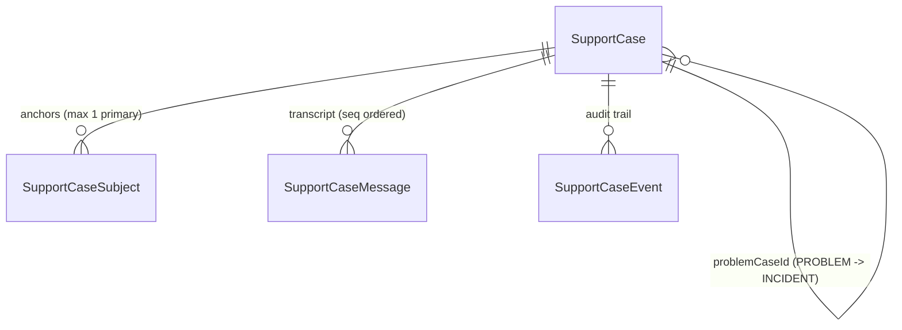
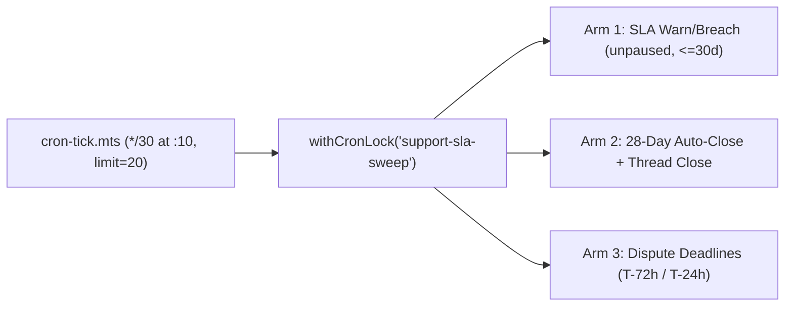

# Unified SupportCase model, SLA sweep, CSAT and compliance

The unified `SupportCase` architecture consolidates transcripts, statutory SLA clocks, ITIL problem-incident hierarchies, structured callback schedules, audit logs, resolution CSAT, and statutory monthly compliance reporting into a single relational graph backed by an idempotent 30-minute cron sweep.

## Schema & Postgres sidecar invariants

| Model                | Primary purpose & key columns                                                                                                                                                                                                                                                                                                                                                                                              | Database & sidecar constraints (`prisma/sql/check-constraints.sql`)                                                                                                                                                                                                                                                                                                                                                                                                                               |
| -------------------- | -------------------------------------------------------------------------------------------------------------------------------------------------------------------------------------------------------------------------------------------------------------------------------------------------------------------------------------------------------------------------------------------------------------------------- | ------------------------------------------------------------------------------------------------------------------------------------------------------------------------------------------------------------------------------------------------------------------------------------------------------------------------------------------------------------------------------------------------------------------------------------------------------------------------------------------------- |
| `SupportCase`        | Unified support record owning `referenceNumber` (`FAM-YYYY-NNNNNN`), `clientIntakeId`, `caseKind` (`INCIDENT` \| `PROBLEM`), `problemCaseId`, `requesterUserId`, `submitterUserId`, `callbackPhone`, `callbackWindow`, SLA clocks (`ackDueAt`, `acknowledgedAt`, `resolutionDueAt`, `resolvedAt`, `closedAt`, `firstAgentReplyAt`, `awaitingUserSince`, `pausedSeconds`), `messageSeq`, and CSAT (`csatRating`, `csatAt`). | `support_case_open_scope_key`: partial unique (`NULLS NOT DISTINCT`) on `("appointmentId", "appointmentOccurrenceId", "requesterUserId", "submitterUserId", "category") WHERE "closedAt" IS NULL AND "deletedAt" IS NULL`. `support_case_scope_and_shape_chk`: `CHECK` enforcing `category IS NOT NULL OR flowKey IS NOT NULL`, `appointmentId` presence whenever `appointmentOccurrenceId` is set, single-level `problemCaseId` (`caseKind = 'INCIDENT'`), and `csatRating BETWEEN 1 AND 5`. |
| `SupportCaseSubject` | Polymorphic entity attachments (`APPOINTMENT`, `OCCURRENCE`, `PAYMENT`, `REFUND`, `INVOICE`, `ORGANIZATION`, `ACCOUNT`) with `isPrimary`.                                                                                                                                                                                                                                                                                  | `@@unique([caseId, subjectType, subjectId])` plus `support_case_subject_primary_key` partial unique on `("caseId") WHERE "isPrimary" = true`.                                                                                                                                                                                                                                                                                                                                                     |
| `SupportCaseMessage` | Total-ordered message stream (`seq`, `sender` in `USER` \| `AGENT` \| `BOT` \| `SYSTEM`, `isInternal`, `clientTurnId`, `authorUserId`).                                                                                                                                                                                                                                                                                    | `@@unique([caseId, clientTurnId])` for idempotent client retries; indexed on `[caseId, seq]`.                                                                                                                                                                                                                                                                                                                                                                                                     |
| `SupportCaseEvent`   | Append-only audit events (`CREATED`, `STATUS_CHANGED`, `PRIORITY_CHANGED`, `ASSIGNED`, `UNASSIGNED`, `VISIBILITY_CHANGED`, `LINKED_PROBLEM`, `DUPLICATE_CLOSED`, `REOPENED`, `AUTO_CLOSED`, `CSAT_RATED`).                                                                                                                                                                                                                 | `support_case_event_target_xor`: `CHECK (("caseId" IS NULL) <> ("legacyTicketId" IS NULL))`. `support_case_event_legacy_csat_key`: partial unique on `("legacyTicketId") WHERE "kind" = 'CSAT_RATED'`.                                                                                                                                                                                                                                                                                        |

## API routes, authorization & ADR 20 redaction

Every route under `/api/support/cases*` and `/api/admin/support/*` enforces **mandatory operator 2FA** via `requireApiAuth` (returning HTTP `428` `PRECONDITION_REQUIRED` if a `STAFF` or `ADMIN` operator has not completed 2FA enrollment/verification).

- **`GET /api/support/cases` & `POST /api/support/cases` (`lib/support/case-service.ts`):**
  - Validates callback inputs via `phoneField` (`callbackPhoneSchema`) and `CallbackWindowSchema` into `callbackPhone` and `callbackWindow`.
  - Deduplicates idempotently in `createOrReuseSupportCase` on `clientIntakeId` (`dedupeReason: "client_intake_id"`) or matching active open scope (`dedupeReason: "open_scope"`), appending a `USER` turn and reopening `RESOLVED` cases to `IN_PROGRESS` (when assigned) or `OPEN` (when unassigned).
  - **ADR 20 cross-party transcript redaction (`readSupportCaseForViewer`):** When an organization operator files a case concerning a member (`requesterUserId !== submitterUserId`), reads by `requesterUserId` redact all operator correspondence, returning summary metadata only (`title: "Organization support request"`, empty `description`, empty `messages: []`, `events: []`, `subjects: []`, `callbackPhone: null`, `callbackWindow: null`, `submitterUserId: null`, `filedByOrganizationNotice: true`). Non-staff viewers never receive internal messages (`isInternal: true`) or `VISIBILITY_CHANGED` events.
- **`GET /api/support/cases/[caseId]` & `PATCH /api/support/cases/[caseId]`:**
  - Guards staff mutations with optimistic concurrency (`expectedUpdatedAt` -> HTTP `409` `CONFLICT`) and CAS-in-`WHERE` updates inside a single Prisma transaction.
  - Verifies `assignedToId` belongs to a `STAFF` or `ADMIN` user (`validateOperatorAssigneeTx`), tightens unacknowledged/unresolved SLA deadlines on priority raise via `tightenDeadlinesForPriorityRaise` (never extending deadlines on priority drop), cascades `PROBLEM` resolution across linked open `INCIDENT` cases (`cascadeProblemResolution`), writes internal note messages (`isInternal: true`), and records atomic `SupportCaseEvent` rows for every mutated field.
- **`POST /api/support/cases/[caseId]/messages`:**
  - Rate-limiting is **skipped for staff**; customer replies share `ticketResponseLimiter` (`ticket-response:<userId>`).
  - Rejects stale public staff replies (`expectedLastMessageAt` older than `lastMessageAt` -> HTTP `409` `NEW_CUSTOMER_MESSAGE`), deduplicates retries via `(caseId, clientTurnId)`, and advances SLA pause/acknowledgement clocks atomically.

## Resolution CSAT & statutory compliance report

- **Resolution CSAT (`POST /api/support/cases/[caseId]/csat`):**
  - Resolving a case/ticket stages a **24-hour delayed outbox survey prompt** (`dedupeKey: csat:{ticketId}:{resolvedAt}`).
  - `submitSupportCaseCsat` accepts integer scores `1..5` from the submitter on `RESOLVED` or `CLOSED` cases within **28 days** of `resolvedAt`.
  - Atomicity is enforced via CAS on `csatRating: null` (writing `csatRating`, `csatAt`, and a `CSAT_RATED` `SupportCaseEvent`), or for pre-cutover `SupportTicket` rows via the partial unique index `support_case_event_legacy_csat_key` (`409` on duplicate submission).
- **Monthly IT Rules compliance report (`GET /api/admin/support/compliance-report`):**
  - Restricted to `ADMIN` (`requireAdminAuth`), bounded to IST calendar months (`year`, `month` at `UTC+05:30`).
  - `supportMonthlyComplianceReport` aggregates unified `SupportCase` and legacy `SupportTicket` rows created inside the IST window, reporting total `received`, `acknowledgedWithin24h`, `disposedWithin15d` (net of `pausedSeconds`), `appealed` (`GRIEVANCE` and `MODERATION_APPEAL`), and per-case provenance rows.

## Background SLA, auto-close & dispute sweep

`runSupportSlaSweep` (`lib/support/sla-sweep.ts`) runs every **30 minutes at offset `:10`** on `netlify/functions/cron-tick.mts` (`limit=20`), serialized by `withCronLock("support-sla-sweep")`:

1. **Arm 1 — SLA acknowledgement & resolution warnings/breaches:** Queries open, unpaused (`awaitingUserSince === null`) cases and tickets due within the last 30 days (`ackWarn <= 2h`, `resWarn <= 24h`, or breached `<= now`). Stages idempotent outbox notices (`dedupeKey: sla:{id}:{ack|res}:{warn|breach}`) on `NOVU_WORKFLOWS.SUPPORT_TICKET_ACTIVITY` and emails operators (`deliver()`). Organization `escalationContactEmail` is emailed **strictly on `"breach"`**, never on `"warn"`.
2. **Arm 2 — 28-day auto-close (`RESOLVED` -> `CLOSED`):** Transitions rows resolved `>= 28` days ago via conditional `updateMany` (`status: "RESOLVED"`), writes an `AUTO_CLOSED` event row, and atomically closes linked `AppointmentSupportThread` rows (`status: "CLOSED"`, `activeChannel: "SELF_SERVE"`).
3. **Arm 3 — Actionable dispute deadline reminders:** Alerts `ADMIN` users on disputes in `NEEDS_RESPONSE` or `WARNING_NEEDS_RESPONSE` at `T-72h` and `T-24h` (`dedupeKey: dispute-due:{id}:{72|24}` on `NOVU_WORKFLOWS.DISPUTE_UPDATED`).

Row-level errors are accumulated across all three arms and reported to Sentry at most once per execution (`op: "support-sla-sweep"`).

## Deprecated & Superseded Approaches

- **Frozen legacy `SupportTicket` and `AppointmentSupportThread` models**: legacy tables and routes (`/api/user/support-tickets*`, `/api/staff/support-tickets*`, `/api/appointments/[id]/support`) remain in maintenance freeze solely to serve active intake paths until the back-office inbox UI cut-over to `SupportCase` completes. New schema columns, audit events, and workflow capabilities belong exclusively on `SupportCase`, `SupportCaseSubject`, `SupportCaseMessage`, and `SupportCaseEvent`.
- **Removed `ON_HOLD` status enum variant**: `ON_HOLD` is no longer supported in API transitions (`patchSupportCaseLifecycle` rejects it with HTTP `400` `STATUS_NOT_SUPPORTED`); customer waits are tracked via `awaitingUserSince` / `pausedSeconds` and operator context via internal `SupportCaseMessage` rows (`isInternal: true`).
- **Standalone dispute reminder cron script (`scripts/disputes/alert-dispute-deadlines.ts`)**: deleted outright under the single-implementation background job architecture and folded into Arm 3 of `runSupportSlaSweep` (`lib/support/sla-sweep.ts`).
- **Unredacted cross-party member case reads**: superseded by `readSupportCaseForViewer` enforcing ADR 20 transcript redaction (`filedByOrganizationNotice: true`) whenever `requesterUserId !== submitterUserId`.
