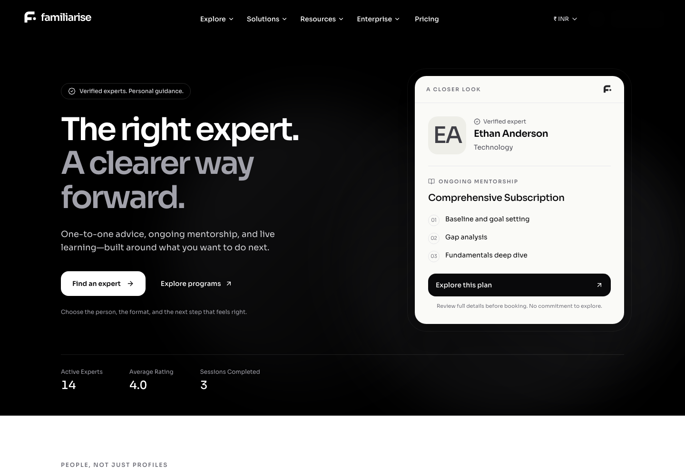

# Familiarise identity and landing page

Implemented in the existing Explore UI PR, following the confirmed choices: **black editorial hero + product preview**, **customer-first discovery**, **Familiarise identity**, and an original **geometric f + lowercase wordmark**.

## What changed

The animated black hero still merges with transparent navigation. It now introduces a clear customer journey: find an expert or explore programs. A restrained preview uses a real verified expert, a publicly discoverable published mentorship plan, and up to three authored curriculum titles. It is not a screenshot with fabricated availability or a live booking widget.

The page has eight sections when experts and reviews are present:

1. Black hero with expert/plan preview and actual public figures.
2. Curated experts and populated domain shortcuts.
3. Consultations, mentorship, classes, and webinars.
4. A three-step introduction to the customer journey.
5. One review section using published review text.
6. Secondary paths for experts and organisations.
7. Customer FAQ.
8. A final discovery action, followed by a compact home-page newsletter and the existing footer.

The landing page no longer renders hardcoded success stories, employer-name endorsements, stale upcoming events, repeated review sections, or blanket refund/security claims. Their old source components and legacy artwork files are retained for reversible use; this is not an app-wide content cleanup.

## Frontend system design

- Server components own page composition, public data, copy, links, and SVG branding. Only the existing navigation/FAQ controls and portrait-error fallback need client behavior.
- Stats and experts are read in parallel before the page component renders. One expert result feeds both preview and discovery, with real HTML links rather than an animation-dependent reveal. Lower-priority reviews retain a streaming boundary. See the no-JavaScript development limitation below.
- Preserve route/data-cache `revalidate = 3600`, existing purge tags, build retries, and the no-server-session root layout. No per-viewer availability, scheduling, checkout, or currency reads were added to the landing page.
- Public preview queries are bounded to three milestone IDs/titles/order per plan and five published, unarchived public/organisation-and-public plans per expert. They do not select lesson descriptions, learner materials, or content URLs.
- Discovery filters use canonical domain IDs. Classes and webinars link to the supported `tab=class` and `tab=webinar` URLs; consultations and mentorship remain discoverable through experts.
- Review reads retain the public allowlist, sanitisation, and anonymity guarantees, with a live verified-expert gate. Blank reviews are omitted, never replaced with invented quotes. Edit attribution and expert replies are preserved; each excerpt links to the expert's full reviews section.
- A missing catalogue gets a purposeful hero fallback, not a fictional expert. Empty expert/review sections are omitted. No rating is manufactured for an unrated expert.
- Portraits use intentionally uploaded `profileDisplayImage` assets, not OAuth avatars or stock people. Missing/failed images show neutral initials; a new source can recover from an earlier error.

This is discovery, not a reservation surface. Booking, payment, allocation, locks, capacity, and pricing logic are unchanged. Existing concurrency follow-ups in the Explore review remain open; landing-page tests are not production booking certification.

## UI system design

Monochrome branding, black editorial framing, warm neutral content surfaces, restrained borders, rounded cards, and the existing Sora typeface form one visual system. The hero carries the stronger contrast; the rest of the page stays light and readable. No lilac hero or app-wide dark-mode switch was introduced.

Desktop uses an asymmetric headline/preview layout and four-column discovery. Mobile keeps customer actions first and changes expert discovery to a native, manually controlled swipe row with keyboard scrolling. No automatic testimonial marquee moves content while visitors read. Focus outlines, accessible names, contrast-aware logo variants, and reduced-motion ambient animation are retained.

The original geometric mark is shared between inline application branding and exported SVGs. The wordmark exports contain outlined Sora lettering so they remain portable without a font installation. The new identity replaces the old artwork in the navbar, mobile drawer, footer, error/maintenance views, and small Explore branding badges. Next's automatic favicon is updated alongside the SVG tab icon, home-screen icon, and social preview.

## Downloadable assets

| Asset                     | Files                                                                                                                                                                  |
| ------------------------- | ---------------------------------------------------------------------------------------------------------------------------------------------------------------------- |
| Complete pack             | [ZIP](../../../public/brand/familiarise-brand-assets.zip)                                                                                                              |
| Dark ink wordmark         | [SVG](../../../public/brand/familiarise-wordmark-dark.svg), [transparent PNG](../../../public/brand/familiarise-wordmark-dark.png)                                     |
| White wordmark            | [SVG](../../../public/brand/familiarise-wordmark-light.svg), [transparent PNG](../../../public/brand/familiarise-wordmark-light.png)                                   |
| Standalone mark           | [Dark SVG](../../../public/brand/familiarise-symbol-dark.svg), [white SVG](../../../public/brand/familiarise-symbol-light.svg)                                         |
| Browser/home-screen icons | [SVG](../../../public/brand/familiarise-icon.svg), [ICO](../../../public/brand/familiarise-favicon.ico), [180px PNG](../../../public/brand/familiarise-apple-icon.png) |
| Social preview            | [1200×630 PNG](../../../public/brand/landing-og.png), [outlined SVG](../../../public/brand/landing-og.svg)                                                             |
| Usage and regeneration    | [Brand guide](../../../public/brand/README.md), [generator](../../../scripts/brand/generate-landing-assets.cjs)                                                        |

The logo is original design work, not a trademark-availability assessment. No font binary or photos of invented customers are included in the asset pack. The generated social card is typography and vector geometry, not AI-generated customer imagery.

## Verification

- **130 tests across 22 targeted Jest suites pass**, covering landing selection/empty states, published-plan projection, review anonymity, uploaded/failed portraits, logo exports, public figures, discovery route contracts, Explore/booking review, lazy availability, and brochure regression cases.
- Changed/new source and tests pass ESLint with zero warnings, formatting, and diff whitespace checks. A focused TypeScript check of changed roots, ambient declarations, and transitive imports reports zero diagnostics; it is not a full-project type-check claim.
- Completed local browser checks at 1440px, 1024px, 390px, and 320px: eight populated sections, no horizontal page overflow, FAQ expansion, and no availability reads. Mobile expert-row keyboard scrolling and menu open/close were checked; the primary action reached the actual expert directory.
- A final fresh-session check confirms matching tab/home-screen metadata, all three ambient animations stopped under reduced motion, the supported classes discovery link, and the customer-facing FAQ answer, with zero page exceptions, console errors, or availability requests. The separate classes-arrival check timed out during a development-server memory restart and is not counted as a pass.
- Browser captures below use the actual local landing route and local development catalogue. Seeded people, curriculum, counts, and review text in those captures are **not production customer proof**. No booking, registration, payment, or newsletter submission was made.
- The browser tool's in-app connection was unavailable; local Chromium was used after attempting that connection. Captures hide only Next's development tooling overlay, not application content.
- A no-JavaScript browser check of the uncached development route remains on Next's route-loading skeleton: streaming scripts are needed to replace that boundary. Server-rendered component markup was checked, but full no-JavaScript behavior of production prerendered HTML was not verified and is not claimed.
- A local production build was not completed. The existing PR CI remains the full-project lint/type-check/test/build gate.

## Review captures

| Surface                                | Desktop                                                      | Mobile                                                |
| -------------------------------------- | ------------------------------------------------------------ | ----------------------------------------------------- |
| Hero and original logo                 | [1440px](landing-1440-hero.png)                              | [390px](landing-390-hero.png)                         |
| Complete landing                       | [1440px](landing-1440-full.png)                              | [390px](landing-390-full.png)                         |
| Narrow-screen layout                   | —                                                            | [320px](landing-320-hero.png)                         |
| Expert discovery                       | —                                                            | [Keyboard-scrollable row](landing-mobile-experts.png) |
| Navigation identity                    | [Experts directory](experts-brand-desktop.png)               | [Menu](landing-mobile-menu.png)                       |
| FAQ                                    | —                                                            | [Expanded answer](landing-mobile-faq.png)             |
| No JavaScript — development limitation | [Uncached route skeleton](landing-no-javascript-loading.png) | —                                                     |

The wider [Explore and booking review](../explore-booking-refresh/README.md) documents the existing plan, calendar, PDF, and concurrency scope separately.
