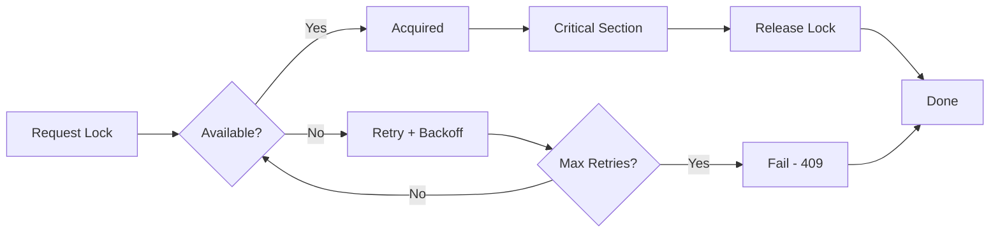

# Upstash Redis Distributed Locking

> **Serverless-native distributed locking system** for preventing race conditions in approval workflows, subscription payments, and appointment booking

---

## Overview

This is a **production-ready distributed locking implementation** built on Upstash Redis that provides race condition protection for serverless applications.

### What is it?
A lightweight, REST API-based locking system that prevents concurrent operations from creating duplicate payments, double-booking appointments, or processing the same approval request multiple times.

### When to use it?
- **Payment Approval Workflows**: Ensure only one approval creates a payment link
- **Subscription Processing**: Prevent duplicate subscription charges
- **Appointment Booking**: Avoid double-booking time slots
- **Circuit Breaking**: Protect against Redis failures with graceful degradation

> **Note**: API rate limiting is handled by **Arcjet** at the route level, not by this module.

### Why Upstash?
- ✅ **Serverless-Native**: REST API works everywhere (Vercel Edge, Lambda, etc.)
- ✅ **Zero Infrastructure**: Fully managed Redis, no servers to maintain
- ✅ **Simple Integration**: Single package, drop-in replacement for Redlock
- ✅ **Cost-Effective**: Pay-per-request pricing, ~90% cheaper than self-hosted
- ✅ **Observable**: Structured JSON logging for every lock operation

---

## Quick Start

### Prerequisites

1. **Upstash Account**: Sign up at [upstash.com](https://upstash.com) (free tier available)
2. **Redis Instance**: Create a new Redis database in Upstash console
3. **Environment Variables**: Add credentials to your `.env.local` file

### Environment Setup

```bash
# .env.local
UPSTASH_REDIS_REST_URL="https://[region]-[name].upstash.io"
UPSTASH_REDIS_REST_TOKEN="AXmxASQgY..."
```

> **Where to find these?** Go to your Upstash Redis dashboard → REST API tab → Copy URL and Token

### 5-Minute Tutorial

#### Example 1: Approval Lock (Basic Pattern)

Prevent concurrent approvals from creating duplicate payment links:

```typescript
import {
  lockConsultationApproval,
  unlockApproval,
} from "@/utils/appointmentlock";

export async function approveConsultation(consultationId: string) {
  let lock;

  try {
    // Acquire lock with 30-second TTL
    lock = await lockConsultationApproval(consultationId, 30000);

    // ✅ Protected critical section
    // Only ONE approval can execute this code
    const paymentLink = await generatePaymentLink(consultationId);
    await sendPaymentLinkEmail(paymentLink);
    await updateConsultationStatus(consultationId, "APPROVED");

    return { success: true, paymentLink };
  } catch (error) {
    // Lock acquisition failed - another approval is in progress
    return {
      error: "Another approval is in progress. Please try again.",
      status: 409,
    };
  } finally {
    // ✅ Always release lock (never throws)
    if (lock) {
      await unlockApproval(lock);
    }
  }
}
```

**Expected Output (Logs)**:
```json
{"event":"lock_acquired","key":"consultation-approval:clx123","attempts":1,"duration_ms":78,"ttl":29700,"timestamp":"2025-11-29T12:34:56.789Z"}
{"event":"lock_released","key":"consultation-approval:clx123","held_duration_ms":5058,"timestamp":"2025-11-29T12:35:01.847Z"}
```

#### Example 2: Circuit Breaker

Protect your application when Redis is unavailable:

```typescript
import { withCircuitBreaker, checkRedisHealth } from "@/lib/redis";

// Health check endpoint
export async function GET() {
  const redisHealthy = await checkRedisHealth();
  return Response.json({
    redis: redisHealthy ? "healthy" : "unhealthy",
  });
}

// Using circuit breaker for Redis operations
export async function performRedisOperation() {
  return withCircuitBreaker(
    async () => {
      // Your Redis operation here
      return await redis.get("some-key");
    },
    () => null // Fallback value if circuit is open
  );
}
```

> **Note**: For API rate limiting, use **Arcjet** instead. See the Arcjet documentation for setup.

---

## Key Concepts

### Lock Types

| Lock Type | Default TTL | Use Case |
|-----------|-------------|----------|
| **Consultation Approval** | 30 seconds | Fast payment link generation |
| **Subscription Approval** | 30 seconds | Fast subscription processing |
| **Appointment Lock** (legacy) | 5 minutes | Complex time slot allocation |
| **Rate Limiting** | 10 seconds | API abuse protection |

### Core Features

1. **SET NX PX**: Atomic Redis operation (set-if-not-exists with TTL)
2. **UUID Ownership**: Each lock has unique ID for safe release verification
3. **Exponential Backoff**: Smart retry strategy (10 attempts, 200ms base delay)
4. **Clock Drift Protection**: 1% TTL safety margin prevents timing bugs
5. **Structured Logging**: Every operation logged as JSON for monitoring

### Lock Lifecycle



---

## Architecture at a Glance

```
┌─────────────────────────────────────────────────────┐
│  Application Layer                                  │
│  ├─ lockConsultationApproval(consultationId)       │
│  ├─ lockSubscriptionApproval(subscriptionId)       │
│  └─ checkRateLimit(identifier)                     │
└──────────────────────┬──────────────────────────────┘
                       ↓
┌─────────────────────────────────────────────────────┐
│  Core Lock Engine                                   │
│  (utils/appointmentlock.ts)                         │
│  ├─ acquireLockWithRetry() - Exponential backoff   │
│  ├─ releaseLock() - Safe ownership verification    │
│  └─ Structured JSON logging                        │
└──────────────────────┬──────────────────────────────┘
                       ↓
┌─────────────────────────────────────────────────────┐
│  Upstash Client                                     │
│  (lib/redis.ts)                                     │
│  ├─ Redis.set(key, value, {nx: true, px: ttl})    │
│  ├─ Redis.get(key) - Ownership check               │
│  └─ Redis.del(key) - Lock release                  │
└──────────────────────┬──────────────────────────────┘
                       ↓
┌─────────────────────────────────────────────────────┐
│  Upstash Cloud (Managed Redis)                      │
│  └─ Global REST API (99.99% SLA)                   │
└─────────────────────────────────────────────────────┘
```

### File Structure

```
utils/
└── appointmentlock.ts          # Core lock implementation (278 lines)
    ├── lockConsultationApproval()
    ├── lockSubscriptionApproval()
    ├── unlockApproval()
    └── Legacy: lockAppointment(), isAppointmentLocked()

lib/
└── redis.ts                    # Upstash client setup (72 lines)
    ├── checkRateLimit()
    └── Environment validation
```

---

## Documentation Navigation

### For New Users

**Start here** → Read this README → Jump to [API Reference](./02_API_REFERENCE.md) → Try examples

**Learning path**:
1. Read Quick Start (above)
2. Review [Common Use Cases](#common-use-cases) (below)
3. Study [API Reference](./02_API_REFERENCE.md) for detailed documentation
4. Check [Best Practices](./02_API_REFERENCE.md#best-practices) before production

### For Migration from Redlock

**Start here** → Read [Migration Guide](./01_MIGRATION_GUIDE.md)

**Migration path**:
1. Understand [Breaking Changes](./01_MIGRATION_GUIDE.md#breaking-changes)
2. Follow [Migration Checklist](./01_MIGRATION_GUIDE.md#migration-checklist)
3. Review [Architecture Comparison](./01_MIGRATION_GUIDE.md#architecture-deep-dive)
4. Deploy and [Monitor](./01_MIGRATION_GUIDE.md#monitoring--observability)

### For Troubleshooting

**Having issues?** → Check [Troubleshooting Guide](./01_MIGRATION_GUIDE.md#troubleshooting)

**Common problems**:
- Lock acquisition always fails → [Solution](./01_MIGRATION_GUIDE.md#lock-acquisition-always-fails)
- High retry rate → [Solution](./01_MIGRATION_GUIDE.md#high-retry-rate)
- Locks not released → [Solution](./01_MIGRATION_GUIDE.md#locks-not-released)

---

## Common Use Cases

### Use Case 1: Approval Workflow

**Problem**: Concurrent API requests create duplicate payment links

**Solution**: Lock the consultation before approval

```typescript
import { lockConsultationApproval, unlockApproval } from "@/utils/appointmentlock";

let lock;
try {
  lock = await lockConsultationApproval(consultationId, 30000);
  // Only one approval executes here
  await createApprovalPaymentIntent(...);
  await sendPaymentLinkEmail(...);
} catch (error) {
  return NextResponse.json(
    { error: "Another approval in progress" },
    { status: 409 }
  );
} finally {
  if (lock) await unlockApproval(lock);
}
```

**Result**: ✅ Exactly one payment link created, even with 100 concurrent requests

### Use Case 2: Rate Limiting

**Problem**: API endpoints vulnerable to abuse (brute force, spam)

**Solution**: Rate limit by user ID, IP, or endpoint

```typescript
import { checkRateLimit } from "@/lib/redis";

const allowed = await checkRateLimit(`user:${userId}:approval`);
if (!allowed) {
  return Response.json({ error: "Too many requests" }, { status: 429 });
}
```

**Result**: ✅ Maximum 5 requests per 10 seconds per user

### Use Case 3: Appointment Booking (Legacy)

**Problem**: Multiple users booking the same time slot simultaneously

**Solution**: Lock the appointment before allocation

```typescript
import { lockAppointment, unlockAppointment } from "@/utils/appointmentlock";

let lock;
try {
  lock = await lockAppointment(appointmentId, 300000); // 5 minutes
  // Complex time slot allocation logic
  await allocateTimeSlot(...);
} finally {
  if (lock) await unlockAppointment(lock);
}
```

**Result**: ✅ No double-booking, even with race conditions

---

## Quick Links

### Documentation

- **[Migration Guide](./01_MIGRATION_GUIDE.md)**: Comprehensive guide for migrating from Redlock
- **[API Reference](./02_API_REFERENCE.md)**: Complete API documentation with examples
- **[Legacy Docs](../../payments/pay-later/DISTRIBUTED_LOCKING.md)**: Historical Redlock documentation (archived)

### External Resources

- **[Upstash Redis Docs](https://upstash.com/docs/redis)**: Official Upstash Redis documentation
- **[Upstash Rate Limiting](https://upstash.com/docs/redis/sdks/ratelimit-ts/overview)**: Rate limiting SDK guide
- **[Redis SET Command](https://redis.io/commands/set/)**: Understanding SET NX PX
- **[Vercel Environment Variables](https://vercel.com/docs/environment-variables)**: Setting up env vars

### Support & Troubleshooting

- **Issues**: Check [Troubleshooting Guide](./01_MIGRATION_GUIDE.md#troubleshooting) first
- **Performance**: See [Performance Comparison](./01_MIGRATION_GUIDE.md#performance-comparison)
- **Monitoring**: Review [Observability Guide](./01_MIGRATION_GUIDE.md#monitoring--observability)

---

## Next Steps

1. **Set up environment**: Add Upstash credentials to `.env.local`
2. **Try an example**: Copy-paste code from [Quick Start](#quick-start)
3. **Read API docs**: Review [API Reference](./02_API_REFERENCE.md) for your use case
4. **Deploy**: Follow [Best Practices](./02_API_REFERENCE.md#best-practices)

---

**Questions?** Check the [API Reference](./02_API_REFERENCE.md) or [Migration Guide](./01_MIGRATION_GUIDE.md) for detailed information.
